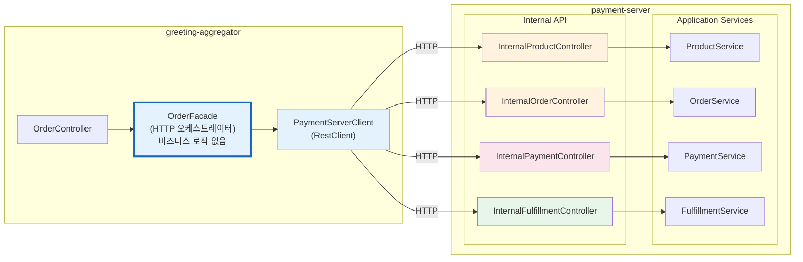
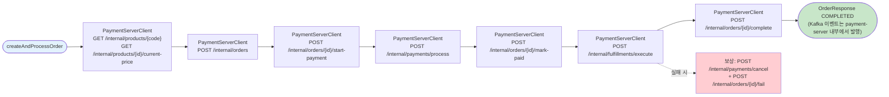
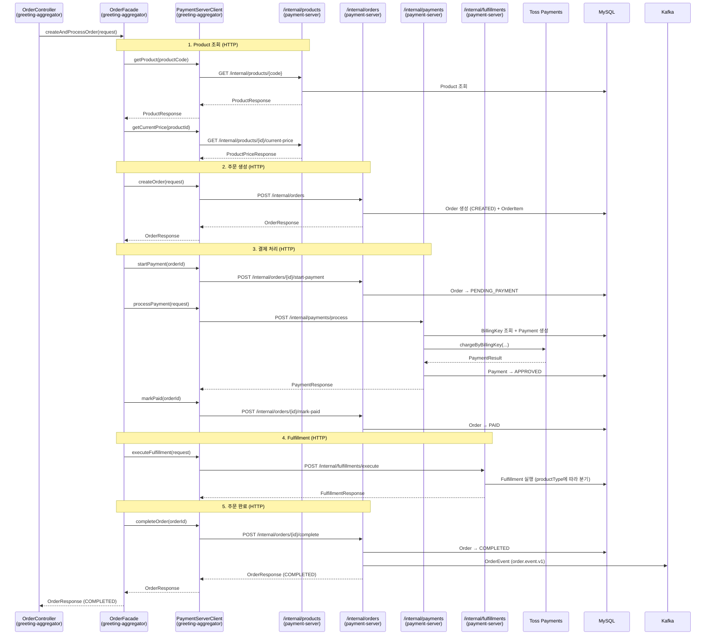
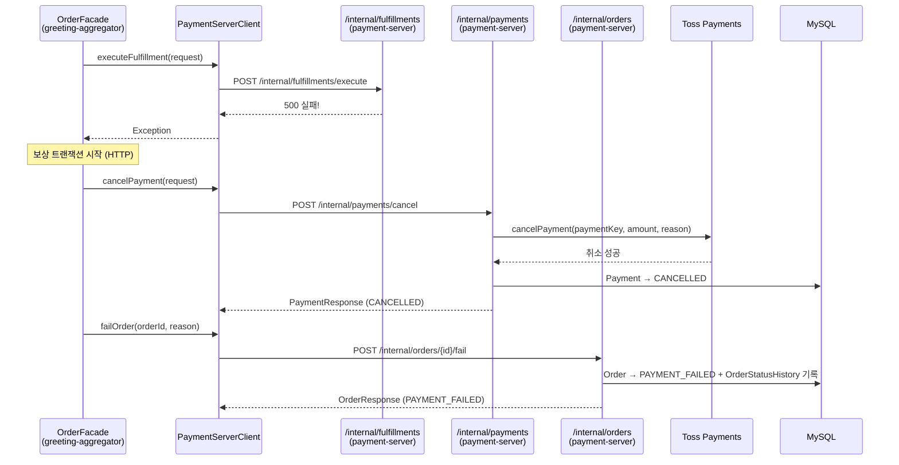

# [Ticket #8d] OrderFacade (HTTP 오케스트레이터 — greeting-aggregator)

## 개요
- TDD 참조: tdd.md 섹션 3.1, 3.2, 4.2, 4.4, 4.5, 8.2, 8.3
- 선행 티켓: #7 (ProductService), #8c (OrderService), #9c (PaymentService), #12a~c (FulfillmentStrategy)
- 후속 연관: **#14에서 payment-server Internal API Controller 4개 구현** (InternalProductController, InternalOrderController, InternalPaymentController, InternalFulfillmentController)
- 크기: M
- **레포: greeting-aggregator** (기존 greeting_payment-server에서 변경)

## 핵심 원칙

**OrderFacade는 greeting-aggregator에 위치하는 순수 HTTP 오케스트레이터. 비즈니스 로직(if/else, DB 접근, 도메인 로직) 없음. payment-server Internal API를 순차 호출하여 주문 파이프라인을 수행한다.**

- OrderFacade → PaymentServerClient(RestClient) → payment-server `/internal/*` 엔드포인트
- Kafka 이벤트 발행은 payment-server에서만 수행 (aggregator에서 발행하지 않음)
- 보상 트랜잭션도 HTTP 호출로 처리



> **참고**: payment-server의 Internal API Controller 4개는 **#14 티켓**에서 구현한다. 이 티켓(#8d)은 greeting-aggregator 측 OrderFacade + PaymentServerClient에 집중한다.

---

## 작업 내용

### Facade 메서드 목록

| 메서드 | 역할 | 호출하는 Internal API |
|--------|------|----------------------|
| `createAndProcessOrder()` | 전체 파이프라인: 상품조회→주문→결제→이행→완료 | GET /internal/products/{code} → POST /internal/orders → POST /internal/payments/process → POST /internal/fulfillments/execute → POST /internal/orders/{id}/complete |
| `processOrder()` | 결제→이행→완료 (주문이 이미 존재할 때) | POST /internal/orders/{id}/start-payment → POST /internal/payments/process → POST /internal/orders/{id}/mark-paid → POST /internal/fulfillments/execute → POST /internal/orders/{id}/complete |
| `cancelOrder()` | 주문 취소 | POST /internal/orders/{id}/cancel (또는 aggregator에서 상태 전이) |
| `getCurrentSubscription()` | 현재 구독 조회 | GET /internal/subscriptions/current |
| `getCreditBalance()` | 크레딧 잔액 조회 | GET /internal/credits/balance |
| `getOrderDetail()` | 주문 상세 조회 | GET /internal/orders/{orderNumber} |
| `getOrderList()` | 주문 목록 조회 | GET /internal/orders |

### 전체 파이프라인 흐름



### 코드 예시

#### 1. OrderFacade (greeting-aggregator)

```kotlin
// greeting-aggregator/business/application/payment/OrderFacade.kt
package doodlin.greeting.aggregator.business.application.payment

import doodlin.greeting.aggregator.business.application.payment.client.PaymentServerClient
import doodlin.greeting.aggregator.business.application.payment.client.dto.*
import org.springframework.stereotype.Service

/**
 * HTTP 오케스트레이터. 비즈니스 로직 없음.
 * payment-server Internal API를 순차 호출하여 주문 파이프라인을 수행한다.
 * Kafka 이벤트 발행은 payment-server가 담당한다 (aggregator에서 발행하지 않음).
 */
@Service
class OrderFacade(
    private val paymentServerClient: PaymentServerClient,
) {
    private val log = LoggerFactory.getLogger(javaClass)

    /** 주문 생성 + 결제 + Fulfillment 전체 파이프라인 */
    fun createAndProcessOrder(request: CreateOrderRequest): OrderResponse {
        // 1. Product 조회 (HTTP)
        val product = paymentServerClient.getProduct(request.productCode)
        val price = paymentServerClient.getCurrentPrice(
            productId = product.id,
            billingIntervalMonths = request.billingIntervalMonths,
        )

        // 2. 주문 생성 (HTTP)
        val order = paymentServerClient.createOrder(
            CreateInternalOrderRequest(
                workspaceId = request.workspaceId,
                orderType = request.orderType,
                productCode = product.code,
                productId = product.id,
                unitPrice = price.price,
                billingIntervalMonths = request.billingIntervalMonths,
                idempotencyKey = request.idempotencyKey,
            )
        )

        // 3. 결제 + Fulfillment
        return processOrder(order)
    }

    /** 결제 → Fulfillment → 완료 (또는 보상) */
    fun processOrder(order: OrderResponse): OrderResponse {
        // 결제 시작 상태 전이
        paymentServerClient.startPayment(order.id)

        // 결제 처리
        val payment = paymentServerClient.processPayment(
            ProcessPaymentRequest(
                orderId = order.id,
                workspaceId = order.workspaceId,
                amount = order.totalAmount,
                orderName = order.orderNumber,
            )
        )

        // 결제 완료 상태 전이
        paymentServerClient.markPaid(order.id)

        // Fulfillment 실행
        try {
            paymentServerClient.executeFulfillment(
                ExecuteFulfillmentRequest(
                    orderId = order.id,
                    workspaceId = order.workspaceId,
                    productType = order.productType,
                    productCode = order.productCode,
                )
            )
            // 주문 완료 (payment-server가 Kafka 이벤트도 발행)
            return paymentServerClient.completeOrder(order.id)
        } catch (e: Exception) {
            log.error("Fulfillment 실패, 보상 트랜잭션 시작: orderId=${order.id}", e)
            compensate(order, "fulfillment 실패: ${e.message}")
            throw e
        }
    }

    fun cancelOrder(orderNumber: String, reason: String?): OrderResponse {
        return paymentServerClient.cancelOrder(orderNumber, reason ?: "사용자 취소")
    }

    fun getCurrentSubscription(workspaceId: Int): SubscriptionResponse =
        paymentServerClient.getCurrentSubscription(workspaceId)

    fun getCreditBalance(workspaceId: Int, creditType: String): CreditBalanceResponse =
        paymentServerClient.getCreditBalance(workspaceId, creditType)

    fun getOrderDetail(orderNumber: String): OrderResponse =
        paymentServerClient.getOrder(orderNumber)

    private fun compensate(order: OrderResponse, reason: String) {
        try {
            paymentServerClient.cancelPayment(
                CancelPaymentRequest(
                    orderId = order.id,
                    reason = reason,
                )
            )
        } catch (e: Exception) {
            log.error("보상 결제 취소 실패: orderId=${order.id}", e)
        }
        paymentServerClient.failOrder(
            orderId = order.id,
            reason = reason,
        )
    }
}
```

#### 2. PaymentServerClient (greeting-aggregator)

```kotlin
// greeting-aggregator/business/application/payment/client/PaymentServerClient.kt
package doodlin.greeting.aggregator.business.application.payment.client

import doodlin.greeting.aggregator.business.application.payment.client.dto.*
import org.springframework.stereotype.Component
import org.springframework.web.client.RestClient

/**
 * payment-server Internal API 클라이언트.
 * 모든 HTTP 호출을 캡슐화한다.
 */
@Component
class PaymentServerClient(
    private val paymentRestClient: RestClient,
) {
    fun getProduct(code: String): ProductResponse =
        paymentRestClient.get()
            .uri("/internal/products/{code}", code)
            .retrieve()
            .body(ProductResponse::class.java)!!

    fun getCurrentPrice(productId: Long, billingIntervalMonths: Int?): ProductPriceResponse =
        paymentRestClient.get()
            .uri("/internal/products/{id}/current-price?billingIntervalMonths={months}",
                productId, billingIntervalMonths)
            .retrieve()
            .body(ProductPriceResponse::class.java)!!

    fun createOrder(request: CreateInternalOrderRequest): OrderResponse =
        paymentRestClient.post()
            .uri("/internal/orders")
            .body(request)
            .retrieve()
            .body(OrderResponse::class.java)!!

    fun startPayment(orderId: Long): OrderResponse =
        paymentRestClient.post()
            .uri("/internal/orders/{id}/start-payment", orderId)
            .retrieve()
            .body(OrderResponse::class.java)!!

    fun markPaid(orderId: Long): OrderResponse =
        paymentRestClient.post()
            .uri("/internal/orders/{id}/mark-paid", orderId)
            .retrieve()
            .body(OrderResponse::class.java)!!

    fun completeOrder(orderId: Long): OrderResponse =
        paymentRestClient.post()
            .uri("/internal/orders/{id}/complete", orderId)
            .retrieve()
            .body(OrderResponse::class.java)!!

    fun failOrder(orderId: Long, reason: String): OrderResponse =
        paymentRestClient.post()
            .uri("/internal/orders/{id}/fail", orderId)
            .body(mapOf("reason" to reason))
            .retrieve()
            .body(OrderResponse::class.java)!!

    fun cancelOrder(orderNumber: String, reason: String): OrderResponse =
        paymentRestClient.post()
            .uri("/internal/orders/{orderNumber}/cancel", orderNumber)
            .body(mapOf("reason" to reason))
            .retrieve()
            .body(OrderResponse::class.java)!!

    fun getOrder(orderNumber: String): OrderResponse =
        paymentRestClient.get()
            .uri("/internal/orders/{orderNumber}", orderNumber)
            .retrieve()
            .body(OrderResponse::class.java)!!

    fun processPayment(request: ProcessPaymentRequest): PaymentResponse =
        paymentRestClient.post()
            .uri("/internal/payments/process")
            .body(request)
            .retrieve()
            .body(PaymentResponse::class.java)!!

    fun cancelPayment(request: CancelPaymentRequest): PaymentResponse =
        paymentRestClient.post()
            .uri("/internal/payments/cancel")
            .body(request)
            .retrieve()
            .body(PaymentResponse::class.java)!!

    fun executeFulfillment(request: ExecuteFulfillmentRequest): FulfillmentResponse =
        paymentRestClient.post()
            .uri("/internal/fulfillments/execute")
            .body(request)
            .retrieve()
            .body(FulfillmentResponse::class.java)!!

    fun getCurrentSubscription(workspaceId: Int): SubscriptionResponse =
        paymentRestClient.get()
            .uri("/internal/subscriptions/current?workspaceId={workspaceId}", workspaceId)
            .retrieve()
            .body(SubscriptionResponse::class.java)!!

    fun getCreditBalance(workspaceId: Int, creditType: String): CreditBalanceResponse =
        paymentRestClient.get()
            .uri("/internal/credits/balance?workspaceId={workspaceId}&creditType={creditType}",
                workspaceId, creditType)
            .retrieve()
            .body(CreditBalanceResponse::class.java)!!
}
```

#### 3. PaymentServerClientConfig (greeting-aggregator)

```kotlin
// greeting-aggregator/business/application/payment/client/PaymentServerClientConfig.kt
package doodlin.greeting.aggregator.business.application.payment.client

import org.springframework.beans.factory.annotation.Value
import org.springframework.context.annotation.Bean
import org.springframework.context.annotation.Configuration
import org.springframework.web.client.RestClient

@Configuration
class PaymentServerClientConfig {

    @Bean
    fun paymentRestClient(
        @Value("\${payment-server.base-url}") baseUrl: String,
    ): RestClient = RestClient.builder()
        .baseUrl(baseUrl)
        .defaultHeader("X-Internal-Service", "greeting-aggregator")
        .build()
}
```

#### 4. Client DTO 클래스 (greeting-aggregator)

```kotlin
// greeting-aggregator/business/application/payment/client/dto/

data class ProductResponse(
    val id: Long,
    val code: String,
    val name: String,
    val productType: String,
    val isActive: Boolean,
)

data class ProductPriceResponse(
    val id: Long,
    val productId: Long,
    val price: Int,
    val currency: String,
    val billingIntervalMonths: Int?,
)

data class OrderResponse(
    val id: Long,
    val orderNumber: String,
    val workspaceId: Int,
    val orderType: String,
    val status: String,
    val productType: String,
    val productCode: String,
    val totalAmount: Int,
    val originalAmount: Int,
    val discountAmount: Int,
    val vatAmount: Int,
    val currency: String,
    val createdAt: LocalDateTime,
    val updatedAt: LocalDateTime,
)

data class PaymentResponse(
    val id: Long,
    val orderId: Long,
    val paymentKey: String?,
    val paymentMethod: String,
    val gateway: String,
    val status: String,
    val amount: Int,
    val receiptUrl: String?,
    val approvedAt: LocalDateTime?,
)

data class FulfillmentResponse(
    val orderId: Long,
    val productType: String,
    val success: Boolean,
    val detail: String?,
)

data class SubscriptionResponse(
    val id: Long,
    val workspaceId: Int,
    val productCode: String,
    val status: String,
    val currentPeriodStart: LocalDateTime,
    val currentPeriodEnd: LocalDateTime,
    val autoRenew: Boolean,
    val billingIntervalMonths: Int,
)

data class CreditBalanceResponse(
    val workspaceId: Int,
    val creditType: String,
    val balance: Int,
    val updatedAt: LocalDateTime,
)

data class CreateOrderRequest(
    val workspaceId: Int,
    val productCode: String,
    val orderType: String,
    val billingIntervalMonths: Int? = null,
    val idempotencyKey: String? = null,
    val createdBy: String? = null,
)

data class CreateInternalOrderRequest(
    val workspaceId: Int,
    val orderType: String,
    val productCode: String,
    val productId: Long,
    val unitPrice: Int,
    val billingIntervalMonths: Int? = null,
    val idempotencyKey: String? = null,
)

data class ProcessPaymentRequest(
    val orderId: Long,
    val workspaceId: Int,
    val amount: Int,
    val orderName: String,
)

data class ExecuteFulfillmentRequest(
    val orderId: Long,
    val workspaceId: Int,
    val productType: String,
    val productCode: String,
)

data class CancelPaymentRequest(
    val orderId: Long,
    val reason: String,
)
```

### 상세 시퀀스



### Fulfillment 실패 시 보상 트랜잭션



---

### 그리팅 실제 적용 예시

#### AS-IS (현재)
```
PaymentController (payment-server)
  → OrderFacade.createUpgradePlanOrder() (payment-server 내부)
    → OrderServiceImpl: Product 조회 + 결제 + 플랜 관리 + 이력 저장 + 이벤트 전부 수행
    (1개 Service가 모든 BC를 넘나듦, 모든 것이 payment-server 내부 메서드 호출)
```

#### TO-BE (리팩토링 후)
```
OrderController (greeting-aggregator)
  → OrderFacade.createAndProcessOrder() (greeting-aggregator, HTTP 오케스트레이터)
    → PaymentServerClient.getProduct()                   ← HTTP: GET /internal/products/{code}
    → PaymentServerClient.getCurrentPrice()              ← HTTP: GET /internal/products/{id}/current-price
    → PaymentServerClient.createOrder()                  ← HTTP: POST /internal/orders
    → PaymentServerClient.startPayment()                 ← HTTP: POST /internal/orders/{id}/start-payment
    → PaymentServerClient.processPayment()               ← HTTP: POST /internal/payments/process
    → PaymentServerClient.markPaid()                     ← HTTP: POST /internal/orders/{id}/mark-paid
    → PaymentServerClient.executeFulfillment()            ← HTTP: POST /internal/fulfillments/execute
    → PaymentServerClient.completeOrder()                ← HTTP: POST /internal/orders/{id}/complete
    (각 HTTP 호출은 payment-server의 Internal API → Application Service로 라우팅)
    (OrderFacade에는 if/else, DB 접근, 도메인 로직이 일절 없음)
```

#### 향후 확장 예시
- AI 크레딧 충전: Facade 코드 변경 없음. `productCode="AI_CREDIT_100"` → 동일 `createAndProcessOrder()`
- 새 PG 추가: payment-server의 PaymentService 내부만 변경, aggregator 무관
- 새 Fulfillment 전략: payment-server에 FulfillmentStrategy 구현체 추가, aggregator 무관

---

### 수정 파일 목록

| 레포 | 파일 경로 | 변경 유형 |
|------|----------|----------|
| **greeting-aggregator** | business/application/payment/OrderFacade.kt | 신규 |
| **greeting-aggregator** | business/application/payment/client/PaymentServerClient.kt | 신규 |
| **greeting-aggregator** | business/application/payment/client/PaymentServerClientConfig.kt | 신규 |
| **greeting-aggregator** | business/application/payment/client/dto/ProductResponse.kt | 신규 |
| **greeting-aggregator** | business/application/payment/client/dto/ProductPriceResponse.kt | 신규 |
| **greeting-aggregator** | business/application/payment/client/dto/OrderResponse.kt | 신규 |
| **greeting-aggregator** | business/application/payment/client/dto/PaymentResponse.kt | 신규 |
| **greeting-aggregator** | business/application/payment/client/dto/FulfillmentResponse.kt | 신규 |
| **greeting-aggregator** | business/application/payment/client/dto/SubscriptionResponse.kt | 신규 |
| **greeting-aggregator** | business/application/payment/client/dto/CreditBalanceResponse.kt | 신규 |
| **greeting-aggregator** | business/application/payment/client/dto/CreateOrderRequest.kt | 신규 |
| **greeting-aggregator** | business/application/payment/client/dto/CreateInternalOrderRequest.kt | 신규 |
| **greeting-aggregator** | business/application/payment/client/dto/ProcessPaymentRequest.kt | 신규 |
| **greeting-aggregator** | business/application/payment/client/dto/ExecuteFulfillmentRequest.kt | 신규 |
| **greeting-aggregator** | business/application/payment/client/dto/CancelPaymentRequest.kt | 신규 |

> **payment-server의 Internal API Controller 4개** (InternalProductController, InternalOrderController, InternalPaymentController, InternalFulfillmentController)는 **#14 티켓**에서 구현한다.

## 테스트 케이스

### 정상 케이스
| ID | 테스트명 | Given | When | Then |
|----|---------|-------|------|------|
| TC-01 | 전체 파이프라인 성공 | 정상 요청 | createAndProcessOrder() | Product조회(HTTP)→주문(HTTP)→결제(HTTP)→Fulfillment(HTTP)→COMPLETED(HTTP) |
| TC-02 | 주문 취소 | CREATED 주문 | cancelOrder() | HTTP 호출로 CANCELLED |
| TC-03 | 구독 조회 | ACTIVE 구독 | getCurrentSubscription() | HTTP 호출로 SubscriptionResponse 반환 |
| TC-04 | 크레딧 잔액 조회 | SMS 1000 | getCreditBalance() | HTTP 호출로 1000 반환 |

### 예외/엣지 케이스
| ID | 테스트명 | Given | When | Then |
|----|---------|-------|------|------|
| TC-E01 | 결제 실패 | PG 거절 | createAndProcessOrder() | PaymentServerClient에서 HTTP 에러, Order PAYMENT_FAILED |
| TC-E02 | Fulfillment 실패 → 보상 | DB 오류 | processOrder() | cancelPayment(HTTP) + failOrder(HTTP) 보상 호출 |
| TC-E03 | 상품 미존재 | productCode="INVALID" | createAndProcessOrder() | HTTP 404, ProductNotFoundException |
| TC-E04 | payment-server 통신 장애 | 네트워크 장애 | createAndProcessOrder() | RestClient 타임아웃/에러 핸들링 |

## 기대 결과 (AC)
- [ ] **OrderFacade가 greeting-aggregator에 위치** (payment-server가 아님)
- [ ] **OrderFacade에 비즈니스 로직 없음** (if/else, DB 접근, 도메인 로직 없음 — 순수 HTTP 호출 순서만 관리)
- [ ] **PaymentServerClient가 payment-server Internal API 12개 엔드포인트를 RestClient로 호출**
- [ ] 보상 트랜잭션이 HTTP 호출로 처리됨 (cancelPayment + failOrder)
- [ ] Kafka 이벤트 발행은 payment-server에서만 수행 (aggregator에서 발행하지 않음)
- [ ] Controller는 OrderFacade만 의존
- [ ] Fulfillment 전략 변경 시 aggregator 코드 변경 없음 (payment-server 내부만)
- [ ] **#14 티켓에서 payment-server Internal API Controller 4개를 구현해야 이 Facade가 동작함**
