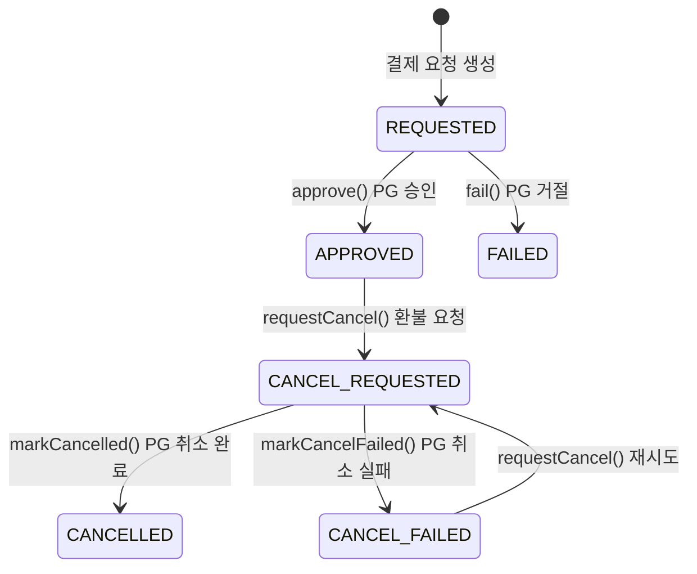

# [Ticket #9a] Payment 엔티티 모델 + 상태머신

## 개요
- TDD 참조: tdd.md 섹션 3.4, 4.1.3
- 선행 티켓: #2 (JPA 엔티티)
- 크기: M
- 원본: ticket-09_payment-domain.md에서 분리

## 배경

Payment 엔티티와 상태머신을 정의한다. **비즈니스 로직은 엔티티/enum 내부에 캡슐화**하는 원칙을 따른다.

- `PaymentStatus` enum이 상태 전이 규칙을 **소유**한다
- `Payment` 엔티티가 상태 전이 메서드를 **캡슐화**한다 (PG 응답 데이터 반영 포함)
- Service는 엔티티 메서드를 호출만 한다

> **설계 원칙 (CRITICAL)**:
> 1. `PaymentStatus` enum이 `canTransitionTo()`, `validateTransitionTo()`로 전이 규칙을 내부에 캡슐화한다.
> 2. `Payment` 엔티티가 `approve()`, `fail()`, `requestCancel()`, `markCancelled()`, `markCancelFailed()` 메서드를 캡슐화한다.
> 3. PaymentService가 Order의 상태를 직접 변경하지 않는다 -- Order 상태 변경은 OrderService 책임.

---

## 작업 내용

### Payment 상태머신



### PaymentStatus enum (상태 전이 규칙을 enum이 소유)

```kotlin
package com.greeting.payment.domain.payment

/**
 * PaymentStatus enum이 상태 전이 규칙을 소유한다.
 * Payment 엔티티의 상태 전이 메서드 내부에서 validateTransitionTo()를 호출.
 */
enum class PaymentStatus {
    REQUESTED,
    APPROVED,
    FAILED,
    CANCEL_REQUESTED,
    CANCELLED,
    CANCEL_FAILED;

    companion object {
        private val ALLOWED_TRANSITIONS: Map<PaymentStatus, Set<PaymentStatus>> = mapOf(
            REQUESTED to setOf(APPROVED, FAILED),
            APPROVED to setOf(CANCEL_REQUESTED),
            FAILED to emptySet(),
            CANCEL_REQUESTED to setOf(CANCELLED, CANCEL_FAILED),
            CANCELLED to emptySet(),
            CANCEL_FAILED to setOf(CANCEL_REQUESTED),  // 재시도 허용
        )
    }

    fun canTransitionTo(next: PaymentStatus): Boolean {
        return next in (ALLOWED_TRANSITIONS[this] ?: emptySet())
    }

    fun validateTransitionTo(next: PaymentStatus) {
        require(canTransitionTo(next)) {
            "결제 상태 전이 불가: $this -> $next"
        }
    }

    val isTerminal: Boolean
        get() = this == APPROVED || this == FAILED || this == CANCELLED

    val isCancellable: Boolean
        get() = canTransitionTo(CANCEL_REQUESTED)
}
```

### PaymentMethod enum

```kotlin
package com.greeting.payment.domain.payment

enum class PaymentMethod {
    BILLING_KEY,  // 빌링키 자동결제
    CARD,         // 카드 직접결제 (confirmPayment)
    TRANSFER,     // 계좌이체
    MANUAL,       // 수동 처리 (금액 0, PG 호출 없음)
}
```

### PaymentResult VO

```kotlin
package com.greeting.payment.domain.payment

import java.time.LocalDateTime

data class PaymentResult(
    val success: Boolean,
    val paymentKey: String?,
    val receiptUrl: String?,
    val approvedAt: LocalDateTime?,
    val failureCode: String?,
    val failureMessage: String?,
    val rawResponse: String?,
)
```

### Refund 엔티티

> Refund는 Payment의 취소 이력을 별도 추적할 때 사용한다. Payment 상태머신의 CANCEL_REQUESTED -> CANCELLED 흐름과 함께 환불 상세 정보를 기록한다.

```kotlin
package com.greeting.payment.domain.payment

import jakarta.persistence.*
import java.time.LocalDateTime

@Entity
@Table(name = "refund")
class Refund(

    @Id
    @GeneratedValue(strategy = GenerationType.IDENTITY)
    val id: Long = 0,

    @Column(name = "payment_id", nullable = false)
    val paymentId: Long,

    @Column(name = "refund_amount", nullable = false)
    val refundAmount: Int,

    @Column(name = "reason", nullable = false)
    val reason: String,

    @Column(name = "refund_key")
    var refundKey: String? = null,

    @Column(name = "status", nullable = false)
    @Enumerated(EnumType.STRING)
    var status: RefundStatus = RefundStatus.REQUESTED,

    @Column(name = "created_at", nullable = false, updatable = false)
    val createdAt: LocalDateTime = LocalDateTime.now(),

    @Column(name = "completed_at")
    var completedAt: LocalDateTime? = null,
) {

    fun markCompleted(refundKey: String?) {
        this.status = RefundStatus.COMPLETED
        this.refundKey = refundKey
        this.completedAt = LocalDateTime.now()
    }

    fun markFailed() {
        this.status = RefundStatus.FAILED
    }
}

enum class RefundStatus {
    REQUESTED,
    COMPLETED,
    FAILED,
}
```

### Payment 엔티티 (비즈니스 로직을 엔티티 내부에 캡슐화)

```kotlin
package com.greeting.payment.domain.payment

import jakarta.persistence.*
import java.time.LocalDateTime

@Entity
@Table(name = "payment")
@SQLRestriction("deleted_at IS NULL")
@SQLDelete(sql = "UPDATE payment SET deleted_at = NOW(6) WHERE id = ?")
class Payment(

    @Id
    @GeneratedValue(strategy = GenerationType.IDENTITY)
    val id: Long = 0,

    @Column(name = "order_id", nullable = false)
    val orderId: Long,

    @Column(name = "payment_key")
    var paymentKey: String? = null,

    @Column(name = "payment_method", nullable = false)
    val paymentMethod: String,

    @Column(name = "gateway", nullable = false)
    val gateway: String,

    @Column(name = "status", nullable = false)
    var status: PaymentStatus = PaymentStatus.REQUESTED,

    @Column(name = "amount", nullable = false)
    val amount: Int,

    @Column(name = "receipt_url")
    var receiptUrl: String? = null,

    @Column(name = "failure_code")
    var failureCode: String? = null,

    @Column(name = "failure_message")
    var failureMessage: String? = null,

    @Column(name = "approved_at")
    var approvedAt: LocalDateTime? = null,

    @Column(name = "cancelled_at")
    var cancelledAt: LocalDateTime? = null,

    @Column(name = "idempotency_key", unique = true)
    val idempotencyKey: String? = null,

    @Column(name = "created_at", nullable = false, updatable = false)
    val createdAt: LocalDateTime = LocalDateTime.now(),

    @Column(name = "updated_at", nullable = false)
    var updatedAt: LocalDateTime = LocalDateTime.now(),

    @Column(name = "deleted_at")
    var deletedAt: LocalDateTime? = null,
) {

    // =========================================================================
    // 상태 전이 메서드 — PaymentStatus.validateTransitionTo()가 규칙 검증.
    // 엔티티가 PG 응답 데이터를 자신의 필드에 반영하는 것까지 캡슐화.
    // Service는 이 메서드를 호출만 한다.
    // =========================================================================

    /**
     * PG 승인 성공 시: REQUESTED -> APPROVED
     * PaymentResult의 paymentKey, receiptUrl, approvedAt을 자신에게 반영.
     */
    fun approve(result: PaymentResult) {
        status.validateTransitionTo(PaymentStatus.APPROVED)
        this.status = PaymentStatus.APPROVED
        this.paymentKey = result.paymentKey
        this.receiptUrl = result.receiptUrl
        this.approvedAt = result.approvedAt ?: LocalDateTime.now()
        this.updatedAt = LocalDateTime.now()
    }

    /**
     * PG 승인 실패 시: REQUESTED -> FAILED
     * 실패 코드/메시지를 자신에게 반영.
     */
    fun fail(result: PaymentResult) {
        status.validateTransitionTo(PaymentStatus.FAILED)
        this.status = PaymentStatus.FAILED
        this.failureCode = result.failureCode
        this.failureMessage = result.failureMessage
        this.updatedAt = LocalDateTime.now()
    }

    /**
     * 취소 요청: APPROVED -> CANCEL_REQUESTED
     */
    fun requestCancel() {
        status.validateTransitionTo(PaymentStatus.CANCEL_REQUESTED)
        this.status = PaymentStatus.CANCEL_REQUESTED
        this.updatedAt = LocalDateTime.now()
    }

    /**
     * 취소 완료: CANCEL_REQUESTED -> CANCELLED
     */
    fun markCancelled() {
        status.validateTransitionTo(PaymentStatus.CANCELLED)
        this.status = PaymentStatus.CANCELLED
        this.cancelledAt = LocalDateTime.now()
        this.updatedAt = LocalDateTime.now()
    }

    /**
     * 취소 실패: CANCEL_REQUESTED -> CANCEL_FAILED
     */
    fun markCancelFailed() {
        status.validateTransitionTo(PaymentStatus.CANCEL_FAILED)
        this.status = PaymentStatus.CANCEL_FAILED
        this.updatedAt = LocalDateTime.now()
    }

    // =========================================================================
    // 조회 헬퍼
    // =========================================================================

    fun requirePaymentKey(): String {
        return paymentKey ?: throw IllegalStateException("paymentKey가 없습니다: paymentId=$id")
    }

    /**
     * 상태 이력 생성용
     */
    fun createStatusHistory(
        fromStatus: PaymentStatus?,
        pgResponse: String? = null,
    ): PaymentStatusHistory {
        return PaymentStatusHistory(
            paymentId = this.id,
            fromStatus = fromStatus?.name,
            toStatus = this.status.name,
            pgResponse = pgResponse,
        )
    }
}
```

### 수정 파일 목록

| 파일 | 변경 유형 | 설명 |
|------|----------|------|
| `domain/payment/PaymentStatus.kt` | 신규 | 상태 enum: `validateTransitionTo()`, `canTransitionTo()`, `isTerminal`, `isCancellable` |
| `domain/payment/PaymentMethod.kt` | 신규 | 결제 수단 enum |
| `domain/payment/PaymentResult.kt` | 신규 | PG 응답 VO |
| `domain/payment/Refund.kt` | 신규 | 환불 엔티티 + RefundStatus enum |
| `domain/payment/Payment.kt` | 수정 | `approve()`, `fail()`, `requestCancel()`, `markCancelled()`, `markCancelFailed()`, `requirePaymentKey()`, `createStatusHistory()` |
| `domain/payment/PaymentStatusHistory.kt` | 기존 (#2) | 변경 없음 |

---

## 테스트 케이스

### 정상 케이스

| # | 테스트 | 입력 | 기대 결과 |
|---|--------|------|----------|
| 1 | `PaymentStatus.validateTransitionTo` - REQUESTED -> APPROVED | | 성공 |
| 2 | `PaymentStatus.isCancellable` - APPROVED | | true |
| 3 | `Payment.approve` | PaymentResult(success=true) | status=APPROVED, paymentKey/receiptUrl 반영 |
| 4 | `Payment.fail` | PaymentResult(success=false) | status=FAILED, failureCode/message 반영 |
| 5 | `Payment.requestCancel` + `markCancelled` | APPROVED Payment | APPROVED -> CANCEL_REQUESTED -> CANCELLED |
| 6 | `Payment.requirePaymentKey` | paymentKey 존재 | paymentKey 반환 |
| 7 | `Payment.createStatusHistory` | fromStatus=REQUESTED | PaymentStatusHistory 생성 |
| 8 | `Refund.markCompleted` | refundKey="RF-xxx" | status=COMPLETED, completedAt 설정 |

### 예외/엣지 케이스

| # | 테스트 | 입력 | 기대 결과 |
|---|--------|------|----------|
| 1 | `PaymentStatus.validateTransitionTo` - FAILED -> APPROVED | | IllegalArgumentException |
| 2 | `PaymentStatus.validateTransitionTo` - CANCELLED -> CANCEL_REQUESTED | | IllegalArgumentException |
| 3 | `Payment.requirePaymentKey` - null | paymentKey=null | IllegalStateException |
| 4 | 지원하지 않는 상태 전이 전수 검증 | 모든 6 x 6 상태 조합 | `canTransitionTo` 정확히 일치 |

---

## 기대 결과 (AC)

- [ ] `PaymentStatus` enum이 상태 전이 규칙을 소유하고, `validateTransitionTo()`로 검증 (Service에 전이 로직 없음)
- [ ] `Payment` 엔티티가 `approve()`, `fail()`, `requestCancel()`, `markCancelled()`, `markCancelFailed()` 메서드를 캡슐화 (PG 응답 반영 포함)
- [ ] `Payment.requirePaymentKey()`가 paymentKey null 시 엔티티 내부에서 예외 발생
- [ ] `Refund` 엔티티가 환불 상세 정보를 추적
- [ ] 단위 테스트: 정상 8건 + 예외 4건 = 총 12건 통과
