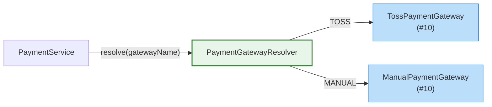

# [Ticket #9b] PaymentGateway 인터페이스 + Resolver

## 개요
- TDD 참조: tdd.md 섹션 4.3
- 선행 티켓: #9a (Payment 엔티티 모델)
- 크기: S
- 원본: ticket-09_payment-domain.md에서 분리

## 배경

PaymentGateway 인터페이스와 PaymentGatewayResolver를 정의한다. **구현체(Toss, Manual)는 #10에서 작성**한다.

- `PaymentService`가 `PaymentGatewayResolver`를 통해 적절한 PG 구현체를 선택한다
- gateway name 기반으로 구현체를 매핑한다

---

## 작업 내용

### PaymentGateway 인터페이스

```kotlin
package com.greeting.payment.domain.payment

/**
 * PG 추상화 인터페이스.
 * 구현체: TossPaymentGateway (#10), ManualPaymentGateway (#10)
 */
interface PaymentGateway {

    val gatewayName: String  // "TOSS", "MANUAL"

    fun chargeByBillingKey(
        billingKey: String,
        orderId: String,
        amount: Int,
        orderName: String,
    ): PaymentResult

    fun confirmPayment(
        paymentKey: String,
        orderId: String,
        amount: Int,
    ): PaymentResult

    fun cancelPayment(
        paymentKey: String,
        cancelAmount: Int,
        cancelReason: String,
    ): PaymentResult
}
```

### PaymentGatewayResolver

```kotlin
package com.greeting.payment.domain.payment

import org.springframework.stereotype.Component

@Component
class PaymentGatewayResolver(
    private val gateways: List<PaymentGateway>,
) {

    private val gatewayMap: Map<String, PaymentGateway> by lazy {
        gateways.associateBy { it.gatewayName }
    }

    fun resolve(gatewayName: String): PaymentGateway {
        return gatewayMap[gatewayName]
            ?: throw IllegalArgumentException("지원하지 않는 PG: $gatewayName")
    }
}
```

### PG 호출 위치 (PaymentService 흐름)



### 수정 파일 목록

| 파일 | 변경 유형 | 설명 |
|------|----------|------|
| `domain/payment/PaymentGateway.kt` | 신규 | PG 추상화 인터페이스: `chargeByBillingKey()`, `confirmPayment()`, `cancelPayment()` |
| `domain/payment/PaymentGatewayResolver.kt` | 신규 | 게이트웨이 이름 -> 구현체 매핑 |

---

## 테스트 케이스

### 정상 케이스

| # | 테스트 | 입력 | 기대 결과 |
|---|--------|------|----------|
| 1 | `PaymentGatewayResolver.resolve` - TOSS | "TOSS" | TossPaymentGateway 반환 |
| 2 | `PaymentGatewayResolver.resolve` - MANUAL | "MANUAL" | ManualPaymentGateway 반환 |

### 예외/엣지 케이스

| # | 테스트 | 입력 | 기대 결과 |
|---|--------|------|----------|
| 1 | 지원하지 않는 PG | gateway="UNKNOWN" | IllegalArgumentException |

---

## 기대 결과 (AC)

- [ ] `PaymentGateway` 인터페이스가 `chargeByBillingKey()`, `confirmPayment()`, `cancelPayment()` 시그니처로 정의
- [ ] `PaymentGatewayResolver`가 gateway 이름으로 올바른 구현체 반환
- [ ] 지원하지 않는 PG 이름 시 명확한 예외 발생
- [ ] 단위 테스트: 정상 2건 + 예외 1건 = 총 3건 통과
