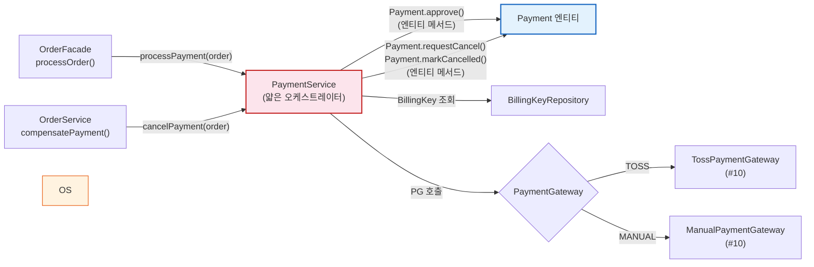
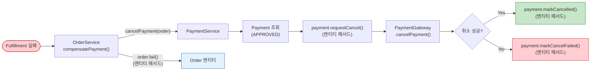

# [Ticket #9c] PaymentService (결제 처리 오케스트레이터)

## 개요
- TDD 참조: tdd.md 섹션 4.3, 4.4, 4.5
- 선행 티켓: #9a (Payment 엔티티), #9b (PaymentGateway 인터페이스), #10 (PG 구현체)
- 크기: M
- 원본: ticket-09_payment-domain.md에서 분리

## 배경

PaymentService는 OrderService에서 호출되는 **결제 처리 전용 서비스**이다. PG와의 통신을 추상화하고, 결제 상태 관리 및 보상 트랜잭션(cancelPayment)을 담당한다.

- PaymentService는 OrderService에서만 호출 -- 직접 외부 노출 없음
- **얇은 오케스트레이터**: Payment 엔티티 메서드 호출 + PG 호출 + 저장만 담당

> **설계 원칙 (CRITICAL)**:
> 1. `PaymentService`는 얇은 오케스트레이터 -- 엔티티 메서드 호출 + PG 호출 + 저장만 수행한다.
> 2. PaymentService가 Order 상태를 직접 변경하지 않는다 -- Order 변경은 OrderService 책임.
> 3. 금액=0이면 ManualGateway, 그 외 TossGateway를 자동 선택한다.

---

## 작업 내용

### PaymentService 위치 (OrderService 호출 흐름)



### PaymentService (얇은 오케스트레이터 -- 엔티티 메서드 호출 + PG 호출 + 저장만)

```kotlin
package com.greeting.payment.application

import com.greeting.payment.domain.order.Order
import com.greeting.payment.domain.payment.*
import com.greeting.payment.infrastructure.repository.BillingKeyRepository
import com.greeting.payment.infrastructure.repository.PaymentRepository
import com.greeting.payment.infrastructure.repository.PaymentStatusHistoryRepository
import org.slf4j.LoggerFactory
import org.springframework.stereotype.Service
import org.springframework.transaction.annotation.Transactional

/**
 * PaymentService는 얇은 오케스트레이터.
 *
 * - 상태 전이: Payment 엔티티 메서드가 캡슐화 (approve, fail, requestCancel, markCancelled)
 * - 전이 규칙: PaymentStatus enum의 validateTransitionTo() 가 소유
 * - Service 역할: Payment 생성 -> PG 호출 -> 엔티티 메서드 호출 -> 저장
 * - 주의: Order 상태 변경은 OrderService 책임. PaymentService는 Order를 읽기만 한다.
 */
@Service
class PaymentService(
    private val paymentRepository: PaymentRepository,
    private val billingKeyRepository: BillingKeyRepository,
    private val paymentStatusHistoryRepository: PaymentStatusHistoryRepository,
    private val gatewayResolver: PaymentGatewayResolver,
) {
    private val log = LoggerFactory.getLogger(javaClass)

    @Transactional
    fun processPayment(order: Order) {
        val isManual = order.totalAmount == 0
        val gatewayName = if (isManual) "MANUAL" else "TOSS"
        val paymentMethod = if (isManual) PaymentMethod.MANUAL.name else PaymentMethod.BILLING_KEY.name

        // 1. Payment 생성 (REQUESTED)
        val payment = Payment(
            orderId = order.id,
            paymentMethod = paymentMethod,
            gateway = gatewayName,
            amount = order.totalAmount,
            idempotencyKey = "PAY-${order.orderNumber}",
        )
        paymentRepository.save(payment)
        paymentStatusHistoryRepository.save(payment.createStatusHistory(fromStatus = null))

        // 2. PG 호출
        val gateway = gatewayResolver.resolve(gatewayName)
        val result: PaymentResult = if (isManual) {
            gateway.chargeByBillingKey("", order.orderNumber, 0, "무료 주문")
        } else {
            val billingKey = billingKeyRepository
                .findByWorkspaceIdAndIsPrimaryTrueAndDeletedAtIsNull(order.workspaceId)
                ?: throw BillingKeyNotFoundException("활성 빌링키가 없습니다: workspaceId=${order.workspaceId}")
            gateway.chargeByBillingKey(
                billingKey = billingKey.decryptedBillingKey(),
                orderId = order.orderNumber,
                amount = order.totalAmount,
                orderName = order.items.first().productName,
            )
        }

        // 3. 결과 반영 (엔티티 메서드 호출 — Service는 호출만)
        if (result.success) {
            payment.approve(result)  // 엔티티 내부: 상태 전이 검증 + paymentKey/receiptUrl 반영
            paymentStatusHistoryRepository.save(
                payment.createStatusHistory(PaymentStatus.REQUESTED, result.rawResponse)
            )
            log.info("결제 승인: orderNumber=${order.orderNumber}, paymentKey=${result.paymentKey}")
        } else {
            payment.fail(result)  // 엔티티 내부: 상태 전이 검증 + failureCode/message 반영
            paymentStatusHistoryRepository.save(
                payment.createStatusHistory(PaymentStatus.REQUESTED, result.rawResponse)
            )
            paymentRepository.save(payment)
            throw PaymentFailedException(
                "결제 실패: code=${result.failureCode}, message=${result.failureMessage}"
            )
        }

        paymentRepository.save(payment)
    }

    @Transactional
    fun cancelPayment(order: Order, reason: String) {
        val payment = paymentRepository.findByOrderIdAndStatus(order.id, PaymentStatus.APPROVED.name)
            ?: throw PaymentNotFoundException("승인된 결제를 찾을 수 없습니다: orderId=${order.id}")

        // 취소 요청 (엔티티 메서드)
        payment.requestCancel()
        paymentStatusHistoryRepository.save(
            payment.createStatusHistory(PaymentStatus.APPROVED)
        )

        // PG 취소 호출
        val gateway = gatewayResolver.resolve(payment.gateway)
        val result = gateway.cancelPayment(
            paymentKey = payment.requirePaymentKey(),  // 엔티티 내부 검증
            cancelAmount = payment.amount,
            cancelReason = reason,
        )

        // 결과 반영 (엔티티 메서드)
        if (result.success) {
            payment.markCancelled()
            paymentStatusHistoryRepository.save(
                payment.createStatusHistory(PaymentStatus.CANCEL_REQUESTED, result.rawResponse)
            )
            log.info("결제 취소 완료: orderNumber=${order.orderNumber}")
        } else {
            payment.markCancelFailed()
            paymentStatusHistoryRepository.save(
                payment.createStatusHistory(PaymentStatus.CANCEL_REQUESTED, result.rawResponse)
            )
            paymentRepository.save(payment)
            throw PaymentCancelException(
                "결제 취소 실패: code=${result.failureCode}, message=${result.failureMessage}"
            )
        }

        paymentRepository.save(payment)
    }
}

class PaymentFailedException(message: String) : RuntimeException(message)
class PaymentNotFoundException(message: String) : RuntimeException(message)
class PaymentCancelException(message: String) : RuntimeException(message)
class BillingKeyNotFoundException(message: String) : RuntimeException(message)
```

### 보상 트랜잭션 흐름



### 수정 파일 목록

| 파일 | 변경 유형 | 설명 |
|------|----------|------|
| `application/PaymentService.kt` | 신규 | 얇은 오케스트레이터: 엔티티 메서드 호출 + PG 호출 + 저장 |
| `infrastructure/repository/PaymentRepository.kt` | 수정 | findByOrderIdAndStatus 추가 |
| `infrastructure/repository/PaymentStatusHistoryRepository.kt` | 수정 | 사용 확인 |

---

## 테스트 케이스

### 정상 케이스

| # | 테스트 | 입력 | 기대 결과 |
|---|--------|------|----------|
| 1 | `processPayment` - 빌링키 결제 성공 | order(amount=33000) | Payment APPROVED |
| 2 | `processPayment` - 무료 주문 (Manual) | order(amount=0) | ManualGateway -> Payment APPROVED |
| 3 | `cancelPayment` - 정상 취소 | APPROVED Payment | Payment CANCELLED |

### 예외/엣지 케이스

| # | 테스트 | 입력 | 기대 결과 |
|---|--------|------|----------|
| 1 | `processPayment` - PG 거절 | PG returns success=false | Payment.fail() -> PaymentFailedException |
| 2 | `processPayment` - 빌링키 없음 | workspace에 billingKey 없음 | BillingKeyNotFoundException |
| 3 | `cancelPayment` - APPROVED Payment 없음 | | PaymentNotFoundException |
| 4 | `cancelPayment` - PG 취소 실패 | PG cancel returns success=false | Payment.markCancelFailed() -> PaymentCancelException |

---

## 그리팅 실제 적용 예시

### AS-IS (현재)
- **플랜 결제**: `PlanServiceImpl.upgradePlan()` 내부에서 직접 Toss `chargeByBillingKey()` 호출 -> `chargeResult`로 성공/실패 분기 -> `PaymentLogsOnWorkspace`(MongoDB)에 결제 이력 저장. 결제 로직과 비즈니스 로직이 혼재
- **플랜 환불**: `PlanServiceImpl.cancelPlan()` -> 미사용일 프로레이션 계산 -> Toss `cancelPayment()` 직접 호출 -> MongoDB에 `cancelLog(isBuy=false, cancelPrice=환불금)` 저장. 환불 실패 시 보상 트랜잭션 없음
- **백오피스 무료 부여**: `paymentKey=""`, PG 미경유. 일반 결제와 완전히 다른 코드 경로
- **결제 이력**: `payment_transaction`(MySQL) + `PaymentLogsOnWorkspace`(MongoDB) 이원화

### TO-BE (리팩토링 후)
- **모든 결제가 PaymentService 하나를 경유**: `PaymentService.processPayment(order)` -> 금액=0이면 ManualGateway, 그 외 TossGateway 자동 선택
- **보상 트랜잭션 자동화**: Fulfillment 실패 시 `PaymentService.cancelPayment()` 자동 호출 -> `payment.requestCancel()` -> `payment.markCancelled()` (엔티티 메서드)
- **결제 이력 통합**: `payment` 테이블 + `payment_status_history` 테이블 (MySQL 단일 DB). PG 원본 응답도 `payment.createStatusHistory()` (엔티티 메서드)로 기록
- **백오피스 무료 부여도 동일 경로**: ManualPaymentGateway -> `payment.approve()` (엔티티 메서드)

### 향후 확장 예시 (코드 변경 없이 가능)
- **새 PG 추가 (예: KG이니시스)**: `PaymentGateway` 인터페이스 구현체 추가 -> `PaymentGatewayResolver`에 자동 등록
- **해외 결제 PG 추가 (예: Stripe)**: 동일 인터페이스, 동일 파이프라인

---

## 기대 결과 (AC)

- [ ] `PaymentService`는 얇은 오케스트레이터 -- 엔티티 메서드 호출 + PG 호출 + 저장만 수행
- [ ] `PaymentService`가 Order 상태를 직접 변경하지 않음 (Order 변경은 OrderService 책임)
- [ ] `PaymentService.processPayment()`가 금액=0이면 ManualGateway, 그 외 TossGateway를 자동 선택
- [ ] 모든 상태 변경마다 `payment.createStatusHistory()` (엔티티 메서드)로 이력 생성
- [ ] 단위 테스트: 정상 3건 + 예외 4건 = 총 7건 통과
