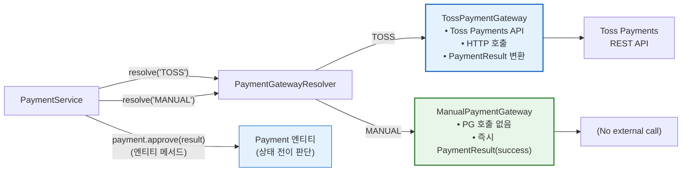
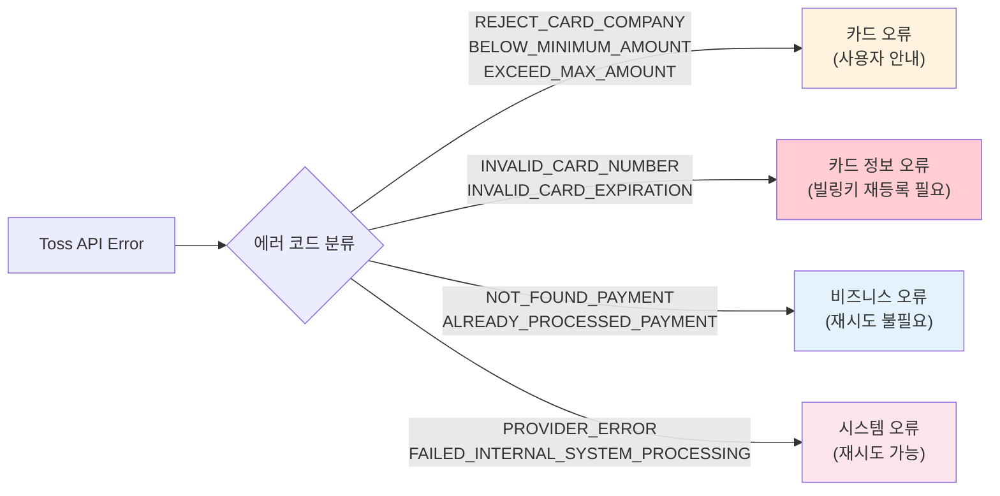

# [Ticket #10] TossPaymentGateway + ManualPaymentGateway 구현

## 개요
- TDD 참조: tdd.md 섹션 4.3
- 선행 티켓: #9 (PaymentGateway 인터페이스)
- 크기: M

## 배경

#9에서 정의한 `PaymentGateway` 인터페이스의 2가지 구현체를 작성한다.

- **TossPaymentGateway**: 실제 Toss Payments API를 호출하는 프로덕션 PG
- **ManualPaymentGateway**: 금액=0 주문(무료 플랜 전환, 관리자 수동 처리 등)에서 PG 호출 없이 자동 승인

기존 payment-server의 Toss API 호출 코드를 리팩토링하여 `PaymentGateway` 인터페이스에 맞게 래핑한다.

> **설계 원칙**: PG Gateway는 인프라 계층이므로 비즈니스 로직을 포함하지 않는다.
> PG 응답을 `PaymentResult` VO로 변환만 하고, 상태 전이 판단은 `Payment` 엔티티가 담당한다.

---

## 작업 내용

### PG 구현체 구조



### TossPaymentGateway 구현

```kotlin
package com.greeting.payment.infrastructure.pg

import com.fasterxml.jackson.databind.ObjectMapper
import com.greeting.payment.domain.payment.PaymentGateway
import com.greeting.payment.domain.payment.PaymentResult
import org.slf4j.LoggerFactory
import org.springframework.beans.factory.annotation.Value
import org.springframework.http.HttpEntity
import org.springframework.http.HttpHeaders
import org.springframework.http.MediaType
import org.springframework.stereotype.Component
import org.springframework.web.client.RestTemplate
import java.time.LocalDateTime
import java.time.format.DateTimeFormatter
import java.util.Base64

@Component
class TossPaymentGateway(
    private val restTemplate: RestTemplate,
    private val objectMapper: ObjectMapper,
    @Value("\${toss.payments.secret-key}") private val secretKey: String,
    @Value("\${toss.payments.base-url:https://api.tosspayments.com}") private val baseUrl: String,
) : PaymentGateway {

    private val log = LoggerFactory.getLogger(javaClass)

    override val gatewayName: String = "TOSS"

    override fun chargeByBillingKey(
        billingKey: String,
        orderId: String,
        amount: Int,
        orderName: String,
    ): PaymentResult {
        val url = "$baseUrl/v1/billing/$billingKey"
        val body = mapOf(
            "customerKey" to orderId,
            "amount" to amount,
            "orderId" to orderId,
            "orderName" to orderName,
        )
        return executeRequest(url, body, "chargeByBillingKey")
    }

    override fun confirmPayment(
        paymentKey: String,
        orderId: String,
        amount: Int,
    ): PaymentResult {
        val url = "$baseUrl/v1/payments/confirm"
        val body = mapOf(
            "paymentKey" to paymentKey,
            "orderId" to orderId,
            "amount" to amount,
        )
        return executeRequest(url, body, "confirmPayment")
    }

    override fun cancelPayment(
        paymentKey: String,
        cancelAmount: Int,
        cancelReason: String,
    ): PaymentResult {
        val url = "$baseUrl/v1/payments/$paymentKey/cancel"
        val body = mapOf(
            "cancelReason" to cancelReason,
            "cancelAmount" to cancelAmount,
        )
        return executeRequest(url, body, "cancelPayment")
    }

    /**
     * HTTP 요청 실행 + PaymentResult VO 변환.
     * 비즈니스 로직 없음 — 순수 변환 레이어.
     */
    private fun executeRequest(
        url: String,
        body: Map<String, Any>,
        operation: String,
    ): PaymentResult {
        val headers = HttpHeaders().apply {
            contentType = MediaType.APPLICATION_JSON
            val encoded = Base64.getEncoder().encodeToString("$secretKey:".toByteArray())
            set("Authorization", "Basic $encoded")
        }

        val request = HttpEntity(objectMapper.writeValueAsString(body), headers)

        return try {
            val response = restTemplate.postForEntity(url, request, String::class.java)
            val responseBody = response.body ?: ""
            val json = objectMapper.readTree(responseBody)

            PaymentResult(
                success = true,
                paymentKey = json.path("paymentKey").asText(null),
                receiptUrl = json.path("receipt").path("url").asText(null),
                approvedAt = json.path("approvedAt").asText(null)?.let {
                    LocalDateTime.parse(it, DateTimeFormatter.ISO_OFFSET_DATE_TIME)
                },
                failureCode = null,
                failureMessage = null,
                rawResponse = responseBody,
            )
        } catch (e: Exception) {
            val errorResponse = extractTossError(e)
            log.error("Toss API $operation 실패: code=${errorResponse.first}, message=${errorResponse.second}", e)

            PaymentResult(
                success = false,
                paymentKey = null,
                receiptUrl = null,
                approvedAt = null,
                failureCode = errorResponse.first,
                failureMessage = errorResponse.second,
                rawResponse = errorResponse.third,
            )
        }
    }

    private fun extractTossError(e: Exception): Triple<String, String, String?> {
        return try {
            if (e is org.springframework.web.client.HttpClientErrorException ||
                e is org.springframework.web.client.HttpServerErrorException
            ) {
                val responseBody = (e as org.springframework.web.client.HttpStatusCodeException).responseBodyAsString
                val json = objectMapper.readTree(responseBody)
                Triple(
                    json.path("code").asText("UNKNOWN_ERROR"),
                    json.path("message").asText("알 수 없는 오류"),
                    responseBody,
                )
            } else {
                Triple("NETWORK_ERROR", e.message ?: "네트워크 오류", null)
            }
        } catch (parseException: Exception) {
            Triple("PARSE_ERROR", e.message ?: "응답 파싱 실패", null)
        }
    }
}
```

### Toss 에러 코드 → 도메인 예외 매핑



### TossErrorCode 매핑

```kotlin
package com.greeting.payment.infrastructure.pg

enum class TossErrorCategory {
    CARD_REJECTED,
    INVALID_CARD,
    BUSINESS_ERROR,
    SYSTEM_ERROR,
    UNKNOWN,
}

object TossErrorCodeMapper {

    private val errorMap: Map<String, TossErrorCategory> = mapOf(
        "REJECT_CARD_COMPANY" to TossErrorCategory.CARD_REJECTED,
        "BELOW_MINIMUM_AMOUNT" to TossErrorCategory.CARD_REJECTED,
        "EXCEED_MAX_AMOUNT" to TossErrorCategory.CARD_REJECTED,
        "RESTRICTED_CARD" to TossErrorCategory.CARD_REJECTED,
        "EXCEED_MAX_DAILY_PAYMENT_COUNT" to TossErrorCategory.CARD_REJECTED,
        "EXCEED_MAX_MONTHLY_PAYMENT_AMOUNT" to TossErrorCategory.CARD_REJECTED,

        "INVALID_CARD_NUMBER" to TossErrorCategory.INVALID_CARD,
        "INVALID_CARD_EXPIRATION" to TossErrorCategory.INVALID_CARD,
        "INVALID_STOPPED_CARD" to TossErrorCategory.INVALID_CARD,
        "INVALID_CARD_LOST_OR_STOLEN" to TossErrorCategory.INVALID_CARD,

        "NOT_FOUND_PAYMENT" to TossErrorCategory.BUSINESS_ERROR,
        "ALREADY_PROCESSED_PAYMENT" to TossErrorCategory.BUSINESS_ERROR,
        "NOT_CANCELABLE_PAYMENT" to TossErrorCategory.BUSINESS_ERROR,
        "NOT_CANCELABLE_AMOUNT" to TossErrorCategory.BUSINESS_ERROR,
        "FORBIDDEN_REQUEST" to TossErrorCategory.BUSINESS_ERROR,

        "PROVIDER_ERROR" to TossErrorCategory.SYSTEM_ERROR,
        "FAILED_INTERNAL_SYSTEM_PROCESSING" to TossErrorCategory.SYSTEM_ERROR,
    )

    fun categorize(code: String): TossErrorCategory {
        return errorMap[code] ?: TossErrorCategory.UNKNOWN
    }

    fun isRetryable(code: String): Boolean {
        return categorize(code) == TossErrorCategory.SYSTEM_ERROR
    }
}
```

### ManualPaymentGateway 구현

```kotlin
package com.greeting.payment.infrastructure.pg

import com.greeting.payment.domain.payment.PaymentGateway
import com.greeting.payment.domain.payment.PaymentResult
import org.slf4j.LoggerFactory
import org.springframework.stereotype.Component
import java.time.LocalDateTime
import java.util.UUID

@Component
class ManualPaymentGateway : PaymentGateway {

    private val log = LoggerFactory.getLogger(javaClass)

    override val gatewayName: String = "MANUAL"

    override fun chargeByBillingKey(
        billingKey: String,
        orderId: String,
        amount: Int,
        orderName: String,
    ): PaymentResult {
        log.info("Manual 결제 자동 승인: orderId=$orderId, amount=$amount")
        return PaymentResult(
            success = true,
            paymentKey = "MANUAL-${UUID.randomUUID().toString().take(8).uppercase()}",
            receiptUrl = null,
            approvedAt = LocalDateTime.now(),
            failureCode = null,
            failureMessage = null,
            rawResponse = """{"gateway":"MANUAL","orderId":"$orderId","amount":$amount,"status":"APPROVED"}""",
        )
    }

    override fun confirmPayment(
        paymentKey: String,
        orderId: String,
        amount: Int,
    ): PaymentResult {
        log.info("Manual confirmPayment 자동 승인: orderId=$orderId")
        return PaymentResult(
            success = true,
            paymentKey = paymentKey,
            receiptUrl = null,
            approvedAt = LocalDateTime.now(),
            failureCode = null,
            failureMessage = null,
            rawResponse = """{"gateway":"MANUAL","orderId":"$orderId","amount":$amount,"status":"APPROVED"}""",
        )
    }

    override fun cancelPayment(
        paymentKey: String,
        cancelAmount: Int,
        cancelReason: String,
    ): PaymentResult {
        log.info("Manual cancelPayment 자동 취소: paymentKey=$paymentKey, reason=$cancelReason")
        return PaymentResult(
            success = true,
            paymentKey = paymentKey,
            receiptUrl = null,
            approvedAt = null,
            failureCode = null,
            failureMessage = null,
            rawResponse = """{"gateway":"MANUAL","paymentKey":"$paymentKey","cancelAmount":$cancelAmount,"status":"CANCELLED"}""",
        )
    }
}
```

### 수정 파일 목록

| 파일 | 변경 유형 | 설명 |
|------|----------|------|
| `infrastructure/pg/TossPaymentGateway.kt` | 신규 | Toss Payments API 래퍼 (순수 변환, 비즈니스 로직 없음) |
| `infrastructure/pg/TossErrorCodeMapper.kt` | 신규 | Toss 에러 코드 → 도메인 분류 매핑 |
| `infrastructure/pg/ManualPaymentGateway.kt` | 신규 | 무료 주문용 자동 승인 게이트웨이 |

---

## 테스트 케이스

### 정상 케이스

| # | 테스트 | 입력 | 기대 결과 |
|---|--------|------|----------|
| 1 | `TossPaymentGateway.chargeByBillingKey` - 성공 | 유효 빌링키, amount=33000 | PaymentResult(success=true, paymentKey 존재) |
| 2 | `TossPaymentGateway.confirmPayment` - 성공 | paymentKey, amount | PaymentResult(success=true) |
| 3 | `TossPaymentGateway.cancelPayment` - 성공 | paymentKey, cancelAmount | PaymentResult(success=true) |
| 4 | `ManualPaymentGateway.chargeByBillingKey` - 자동 승인 | orderId, amount=0 | PaymentResult(success=true, paymentKey="MANUAL-...") |
| 5 | `ManualPaymentGateway.cancelPayment` - 자동 취소 | paymentKey | PaymentResult(success=true) |
| 6 | `TossErrorCodeMapper.categorize` - 카드 거절 | "REJECT_CARD_COMPANY" | CARD_REJECTED |
| 7 | `TossErrorCodeMapper.isRetryable` - 시스템 오류 | "PROVIDER_ERROR" | true |
| 8 | `TossErrorCodeMapper.isRetryable` - 카드 오류 | "REJECT_CARD_COMPANY" | false |

### 예외/엣지 케이스

| # | 테스트 | 입력 | 기대 결과 |
|---|--------|------|----------|
| 1 | `TossPaymentGateway` - HTTP 4xx 에러 | Toss 400 응답 | PaymentResult(success=false, failureCode 매핑) |
| 2 | `TossPaymentGateway` - HTTP 5xx 에러 | Toss 500 응답 | PaymentResult(success=false, failureCode="PROVIDER_ERROR") |
| 3 | `TossPaymentGateway` - 네트워크 타임아웃 | 연결 불가 | PaymentResult(success=false, failureCode="NETWORK_ERROR") |
| 4 | `TossPaymentGateway` - 응답 파싱 실패 | 비정상 JSON | PaymentResult(success=false, failureCode="PARSE_ERROR") |
| 5 | `TossErrorCodeMapper` - 미매핑 에러 코드 | "NEW_UNKNOWN_CODE" | UNKNOWN |
| 6 | `ManualPaymentGateway` - amount > 0 호출 | amount=10000 | 정상 승인 (검증은 PaymentService 책임) |

---

## 그리팅 실제 적용 예시

### AS-IS (현재)
- **Toss API 호출이 서비스 곳곳에 산재**: `PlanServiceImpl`에서 직접 `chargeByBillingKey()` 호출, `MessagePointService`에서도 별도로 Toss API 호출. 에러 처리도 각각 별도 구현
- **에러 코드 매핑 없음**: Toss API 에러 응답을 그대로 로깅만 하고, 사용자에게 의미 있는 안내 불가. 재시도 가능 여부 판단 로직 없음
- **백오피스 수동 처리**: PG 미경유 로직이 `paymentKey=""` 조건 분기로 하드코딩

### TO-BE (리팩토링 후)
- **TossPaymentGateway**: 기존 Toss API 호출 코드를 `PaymentGateway` 인터페이스로 래핑. 모든 Toss 호출이 한 곳에서 관리됨. PG 응답 → `PaymentResult` VO 변환만 담당하고, 상태 전이 판단은 `Payment` 엔티티가 담당
- **ManualPaymentGateway**: 금액=0 또는 백오피스 수동 부여 시 PG 호출 없이 즉시 `PaymentResult(success=true)` 반환
- **TossErrorCodeMapper**: Toss 에러 코드를 4가지 카테고리로 분류. 재시도 가능 여부 판단 → 구독 갱신 재시도 전략에 활용

### 향후 확장 예시 (코드 변경 없이 가능)
- **KG이니시스 PG 추가**: `KgIniciisPaymentGateway implements PaymentGateway` 구현 → `@Component`로 등록 → `PaymentGatewayResolver`가 자동 인식
- **Stripe 해외 결제**: `StripePaymentGateway implements PaymentGateway` 구현 → 동일 인터페이스, 동일 파이프라인

---

## 기대 결과 (AC)

- [ ] `TossPaymentGateway`가 `PaymentGateway` 인터페이스를 구현하고, 순수 변환 레이어로만 동작 (비즈니스 로직 없음)
- [ ] `TossPaymentGateway`의 모든 API 호출이 Authorization Basic 헤더를 포함
- [ ] Toss API 에러 응답이 `PaymentResult(success=false)`로 변환되고, 에러 코드/메시지가 매핑
- [ ] `TossErrorCodeMapper`가 Toss 에러 코드를 4가지 카테고리로 분류하고 재시도 가능 여부 판단
- [ ] `ManualPaymentGateway`가 PG 호출 없이 즉시 승인/취소 결과를 반환
- [ ] `ManualPaymentGateway`의 paymentKey 형식: `MANUAL-{UUID 8자리}`
- [ ] 네트워크 오류/타임아웃 시에도 예외가 아닌 `PaymentResult(success=false)`로 안전하게 처리
- [ ] 단위 테스트: 정상 8건 + 예외 6건 = 총 14건 통과
