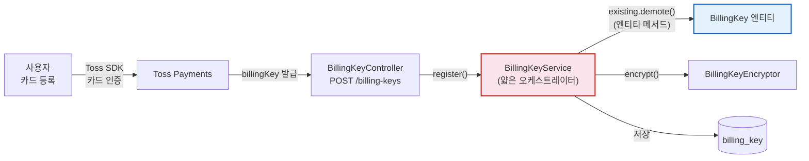
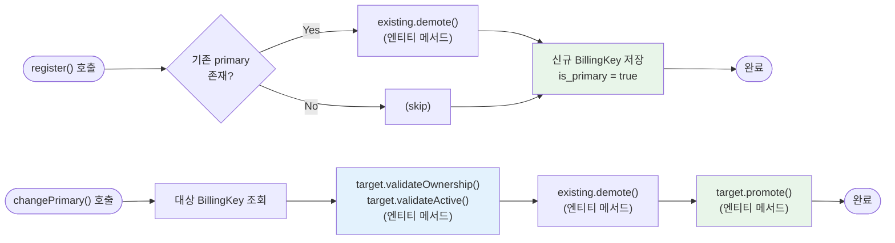

# [Ticket #11] BillingKey 관리

## 개요
- TDD 참조: tdd.md 섹션 4.1.3 (billing_key 테이블)
- 선행 티켓: #2 (JPA 엔티티), #9 (PaymentService에서 BillingKey 조회)
- 크기: M

## 배경

BillingKey는 PG(Toss)에서 발급한 카드 정보 토큰으로, 자동 결제(구독 갱신 등)에 사용된다. 기존 `CardInfoOnGroup` 테이블의 데이터가 #5c에서 `billing_key` 테이블로 이관되었으며, 이 티켓에서는 BillingKeyService를 구현한다.

- 빌링키 값은 암호화 저장 (기존 패턴 유지)
- 워크스페이스당 여러 빌링키 등록 가능, `is_primary`로 기본 결제 수단 관리
- #9 PaymentService.processPayment()에서 `billingKeyRepository.findByWorkspaceIdAndIsPrimaryTrue()`로 조회

> **설계 원칙 (CRITICAL)**:
> 1. `BillingKey` 엔티티가 `demote()`, `promote()`, `softDelete()`, `validateOwnership()` 비즈니스 로직을 캡슐화한다.
> 2. `BillingKeyService`는 얇은 오케스트레이터 -- 엔티티 메서드 호출 + 저장만 담당한다.

---

## 작업 내용

### BillingKey 관리 흐름



### is_primary 관리 로직



### BillingKeyEncryptor (기존 패턴 활용)

```kotlin
package com.greeting.payment.infrastructure.encryption

import org.springframework.beans.factory.annotation.Value
import org.springframework.stereotype.Component
import java.util.Base64
import javax.crypto.Cipher
import javax.crypto.spec.IvParameterSpec
import javax.crypto.spec.SecretKeySpec

@Component
class BillingKeyEncryptor(
    @Value("\${billing.encryption.key}") private val encryptionKey: String,
    @Value("\${billing.encryption.iv}") private val iv: String,
) {
    private val algorithm = "AES/CBC/PKCS5Padding"

    fun encrypt(plainText: String): String {
        val cipher = Cipher.getInstance(algorithm)
        val keySpec = SecretKeySpec(encryptionKey.toByteArray(), "AES")
        val ivSpec = IvParameterSpec(iv.toByteArray())
        cipher.init(Cipher.ENCRYPT_MODE, keySpec, ivSpec)
        val encrypted = cipher.doFinal(plainText.toByteArray())
        return Base64.getEncoder().encodeToString(encrypted)
    }

    fun decrypt(encryptedText: String): String {
        val cipher = Cipher.getInstance(algorithm)
        val keySpec = SecretKeySpec(encryptionKey.toByteArray(), "AES")
        val ivSpec = IvParameterSpec(iv.toByteArray())
        cipher.init(Cipher.DECRYPT_MODE, keySpec, ivSpec)
        val decoded = Base64.getDecoder().decode(encryptedText)
        return String(cipher.doFinal(decoded))
    }
}
```

### BillingKey 엔티티 (비즈니스 로직을 엔티티 내부에 캡슐화)

```kotlin
package com.greeting.payment.domain.payment

import jakarta.persistence.*
import java.time.LocalDateTime

@Entity
@Table(name = "billing_key")
@SQLRestriction("deleted_at IS NULL")
@SQLDelete(sql = "UPDATE billing_key SET deleted_at = NOW(6) WHERE id = ?")
class BillingKey(

    @Id
    @GeneratedValue(strategy = GenerationType.IDENTITY)
    val id: Long = 0,

    @Column(name = "workspace_id", nullable = false)
    val workspaceId: Int,

    @Column(name = "billing_key_value", nullable = false)
    val billingKeyValue: String,

    @Column(name = "card_company")
    val cardCompany: String? = null,

    @Column(name = "card_number_masked")
    val cardNumberMasked: String? = null,

    @Column(name = "email")
    val email: String? = null,

    @Column(name = "is_primary", nullable = false)
    var isPrimary: Boolean = true,

    @Column(name = "gateway", nullable = false)
    val gateway: String = "TOSS",

    @Column(name = "created_at", nullable = false, updatable = false)
    val createdAt: LocalDateTime = LocalDateTime.now(),

    @Column(name = "updated_at", nullable = false)
    var updatedAt: LocalDateTime = LocalDateTime.now(),

    @Column(name = "deleted_at")
    var deletedAt: LocalDateTime? = null,
) {

    // =========================================================================
    // 비즈니스 로직 — 엔티티 내부에 캡슐화.
    // Service는 이 메서드를 호출만 한다.
    // =========================================================================

    /**
     * primary 해제. 새 빌링키 등록/변경 시 기존 primary에 호출.
     */
    fun demote() {
        this.isPrimary = false
        this.updatedAt = LocalDateTime.now()
    }

    /**
     * primary 승격.
     */
    fun promote() {
        this.isPrimary = true
        this.updatedAt = LocalDateTime.now()
    }

    /**
     * 소프트 삭제. isPrimary도 해제.
     */
    fun softDelete() {
        this.deletedAt = LocalDateTime.now()
        this.isPrimary = false
        this.updatedAt = LocalDateTime.now()
    }

    // =========================================================================
    // 검증 메서드 — 비즈니스 규칙을 엔티티가 소유
    // =========================================================================

    /**
     * 소유권 검증: 이 빌링키가 해당 workspace에 속하는지.
     */
    fun validateOwnership(workspaceId: Int) {
        require(this.workspaceId == workspaceId) {
            "빌링키가 해당 워크스페이스에 속하지 않습니다: billingKeyId=$id, expected=$workspaceId, actual=${this.workspaceId}"
        }
    }

    /**
     * 활성 상태 검증: 삭제되지 않았는지.
     */
    fun validateActive() {
        require(this.deletedAt == null) {
            "삭제된 빌링키는 조작할 수 없습니다: billingKeyId=$id"
        }
    }

    val isActive: Boolean
        get() = deletedAt == null

    /** 런타임에 Encryptor를 주입받아 복호화 */
    fun decryptedBillingKey(encryptor: BillingKeyEncryptor): String {
        return encryptor.decrypt(billingKeyValue)
    }
}
```

### BillingKeyService (얇은 오케스트레이터)

```kotlin
package com.greeting.payment.application

import com.greeting.payment.domain.payment.BillingKey
import com.greeting.payment.infrastructure.encryption.BillingKeyEncryptor
import com.greeting.payment.infrastructure.repository.BillingKeyRepository
import org.slf4j.LoggerFactory
import org.springframework.stereotype.Service
import org.springframework.transaction.annotation.Transactional

/**
 * BillingKeyService는 얇은 오케스트레이터.
 *
 * - 소유권/활성 검증: BillingKey 엔티티의 validateOwnership(), validateActive()
 * - 상태 변경: BillingKey 엔티티의 demote(), promote(), softDelete()
 * - Service 역할: 엔티티 메서드 호출 + 암호화 + Repository 저장
 */
@Service
class BillingKeyService(
    private val billingKeyRepository: BillingKeyRepository,
    private val encryptor: BillingKeyEncryptor,
) {
    private val log = LoggerFactory.getLogger(javaClass)

    @Transactional
    fun register(
        workspaceId: Int,
        billingKeyPlain: String,
        cardCompany: String?,
        cardNumberMasked: String?,
        email: String?,
        gateway: String = "TOSS",
    ): BillingKey {
        // 기존 primary 해제 (엔티티 메서드)
        billingKeyRepository
            .findByWorkspaceIdAndIsPrimaryTrueAndDeletedAtIsNull(workspaceId)
            ?.let { existing ->
                existing.demote()
                billingKeyRepository.save(existing)
            }

        // 암호화 + 저장
        val billingKey = BillingKey(
            workspaceId = workspaceId,
            billingKeyValue = encryptor.encrypt(billingKeyPlain),
            cardCompany = cardCompany,
            cardNumberMasked = cardNumberMasked,
            email = email,
            isPrimary = true,
            gateway = gateway,
        )

        val saved = billingKeyRepository.save(billingKey)
        log.info("빌링키 등록: workspaceId=$workspaceId, cardMasked=$cardNumberMasked")
        return saved
    }

    @Transactional
    fun softDelete(billingKeyId: Long, workspaceId: Int) {
        val billingKey = billingKeyRepository.findById(billingKeyId).orElseThrow {
            BillingKeyNotFoundException("빌링키를 찾을 수 없습니다: id=$billingKeyId")
        }

        // 엔티티 내부에서 검증
        billingKey.validateOwnership(workspaceId)

        val wasPrimary = billingKey.isPrimary
        billingKey.softDelete()  // 엔티티 메서드
        billingKeyRepository.save(billingKey)

        // primary 삭제 시 다음 후보 자동 승격
        if (wasPrimary) {
            billingKeyRepository
                .findFirstByWorkspaceIdAndDeletedAtIsNullOrderByCreatedAtDesc(workspaceId)
                ?.let { next ->
                    next.promote()  // 엔티티 메서드
                    billingKeyRepository.save(next)
                    log.info("빌링키 primary 자동 승격: id=${next.id}")
                }
        }

        log.info("빌링키 삭제: id=$billingKeyId, workspaceId=$workspaceId")
    }

    @Transactional
    fun changePrimary(billingKeyId: Long, workspaceId: Int) {
        val target = billingKeyRepository.findById(billingKeyId).orElseThrow {
            BillingKeyNotFoundException("빌링키를 찾을 수 없습니다: id=$billingKeyId")
        }

        // 엔티티 내부에서 검증
        target.validateOwnership(workspaceId)
        target.validateActive()

        // 기존 primary 해제 (엔티티 메서드)
        billingKeyRepository
            .findByWorkspaceIdAndIsPrimaryTrueAndDeletedAtIsNull(workspaceId)
            ?.let { existing ->
                existing.demote()
                billingKeyRepository.save(existing)
            }

        // 대상 승격 (엔티티 메서드)
        target.promote()
        billingKeyRepository.save(target)
        log.info("빌링키 primary 변경: id=$billingKeyId, workspaceId=$workspaceId")
    }

    @Transactional(readOnly = true)
    fun findByWorkspace(workspaceId: Int): List<BillingKey> {
        return billingKeyRepository.findByWorkspaceIdAndDeletedAtIsNullOrderByIsPrimaryDescCreatedAtDesc(workspaceId)
    }

    @Transactional(readOnly = true)
    fun findPrimary(workspaceId: Int): BillingKey? {
        return billingKeyRepository.findByWorkspaceIdAndIsPrimaryTrueAndDeletedAtIsNull(workspaceId)
    }

    fun decryptBillingKey(billingKey: BillingKey): String {
        return encryptor.decrypt(billingKey.billingKeyValue)
    }
}

class BillingKeyNotFoundException(message: String) : RuntimeException(message)
```

### BillingKeyRepository

```kotlin
package com.greeting.payment.infrastructure.repository

import com.greeting.payment.domain.payment.BillingKey
import org.springframework.data.jpa.repository.JpaRepository

interface BillingKeyRepository : JpaRepository<BillingKey, Long> {

    fun findByWorkspaceIdAndIsPrimaryTrueAndDeletedAtIsNull(workspaceId: Int): BillingKey?

    fun findByWorkspaceIdAndDeletedAtIsNullOrderByIsPrimaryDescCreatedAtDesc(
        workspaceId: Int
    ): List<BillingKey>

    fun findFirstByWorkspaceIdAndDeletedAtIsNullOrderByCreatedAtDesc(
        workspaceId: Int
    ): BillingKey?
}
```

### 수정 파일 목록

| 파일 | 변경 유형 | 설명 |
|------|----------|------|
| `domain/payment/BillingKey.kt` | 수정 | `demote()`, `promote()`, `softDelete()`, `validateOwnership()`, `validateActive()` 도메인 메서드 캡슐화 |
| `application/BillingKeyService.kt` | 신규 | 얇은 오케스트레이터: 엔티티 메서드 호출 + 암호화 + 저장 |
| `infrastructure/encryption/BillingKeyEncryptor.kt` | 신규 | AES-256-CBC 암호화/복호화 |
| `infrastructure/repository/BillingKeyRepository.kt` | 수정 | 조회 메서드 추가 |

---

## 테스트 케이스

### 정상 케이스

| # | 테스트 | 입력 | 기대 결과 |
|---|--------|------|----------|
| 1 | `BillingKey.demote` | isPrimary=true | isPrimary=false, updatedAt 갱신 |
| 2 | `BillingKey.promote` | isPrimary=false | isPrimary=true, updatedAt 갱신 |
| 3 | `BillingKey.softDelete` | 활성 빌링키 | deletedAt 설정, isPrimary=false |
| 4 | `BillingKey.validateOwnership` - 성공 | 올바른 workspaceId | 예외 없음 |
| 5 | `BillingKey.validateActive` - 성공 | deletedAt=null | 예외 없음 |
| 6 | `register` - 최초 등록 | workspaceId=1 | BillingKey(isPrimary=true), 암호화 저장 |
| 7 | `register` - 기존 빌링키 있을 때 | 이미 primary 존재 | 기존.demote() + 신규 primary |
| 8 | `softDelete` - primary 삭제 | isPrimary=true | 삭제 후 다음 후보.promote() |
| 9 | `changePrimary` - 변경 | 다른 빌링키 ID | 기존.demote() + 대상.promote() |
| 10 | 암호화/복호화 | plainText="bk_xxx" | encrypt → decrypt 후 원본 일치 |

### 예외/엣지 케이스

| # | 테스트 | 입력 | 기대 결과 |
|---|--------|------|----------|
| 1 | `BillingKey.validateOwnership` - 실패 | workspaceId 불일치 | IllegalArgumentException |
| 2 | `BillingKey.validateActive` - 실패 | deletedAt != null | IllegalArgumentException |
| 3 | `softDelete` - 존재하지 않는 ID | billingKeyId=999 | BillingKeyNotFoundException |
| 4 | `changePrimary` - 삭제된 빌링키 | deletedAt != null | IllegalArgumentException (validateActive) |
| 5 | `changePrimary` - 다른 workspace | workspaceId 불일치 | IllegalArgumentException (validateOwnership) |
| 6 | `softDelete` - primary 삭제 + 대체 후보 없음 | 빌링키 1개뿐 | 삭제 완료, primary 없는 상태 |
| 7 | `findPrimary` - 빌링키 없음 | 등록된 빌링키 없음 | null 반환 |

---

## 그리팅 실제 적용 예시

### AS-IS (현재)
- **CardInfoOnGroup 테이블**: 워크스페이스당 1개 카드 정보 저장. 카드 변경 시 직접 UPDATE (이력 없음)
- **암호화**: `encryption_key`를 행마다 별도 저장 (각 카드별 다른 키)
- **단일 카드만 지원**: 기본/대체 결제 수단 개념 없음

### TO-BE (리팩토링 후)
- **billing_key 테이블**: 워크스페이스당 여러 빌링키 등록 가능. `billingKey.demote()`/`promote()` 엔티티 메서드로 primary 관리
- **Soft Delete + 이력**: `billingKey.softDelete()` 엔티티 메서드로 이력 보존
- **통합 암호화**: `BillingKeyEncryptor`로 일원화된 AES-256-CBC
- **엔티티 내부 검증**: `billingKey.validateOwnership()`, `validateActive()` -- Service에 검증 로직 없음

### 향후 확장 예시 (코드 변경 없이 가능)
- **여러 PG 빌링키 공존**: `billing_key.gateway` 필드로 TOSS/KG_INICIS 등 PG별 구분
- **결제 수단 확장**: 카드 외 계좌이체 빌링키 등록 시 `payment_method` 필드 활용

---

## 기대 결과 (AC)

- [ ] `BillingKey` 엔티티가 `demote()`, `promote()`, `softDelete()`, `validateOwnership()`, `validateActive()` 비즈니스 로직을 캡슐화
- [ ] `BillingKeyService`는 얇은 오케스트레이터 -- 엔티티 메서드 호출 + 저장만 수행, 검증 로직을 포함하지 않음
- [ ] `BillingKeyService.register()`가 빌링키를 암호화하여 저장하고, 기존 primary는 `existing.demote()` 엔티티 메서드로 해제
- [ ] `BillingKeyService.softDelete()`가 `billingKey.validateOwnership()` + `billingKey.softDelete()` 엔티티 메서드 사용
- [ ] `BillingKeyService.changePrimary()`가 `target.validateOwnership()` + `target.validateActive()` 엔티티 검증 후 `promote()`
- [ ] Soft Delete된 빌링키는 조회 결과에서 자동 제외
- [ ] 단위 테스트: 정상 10건 + 예외 7건 = 총 17건 통과
