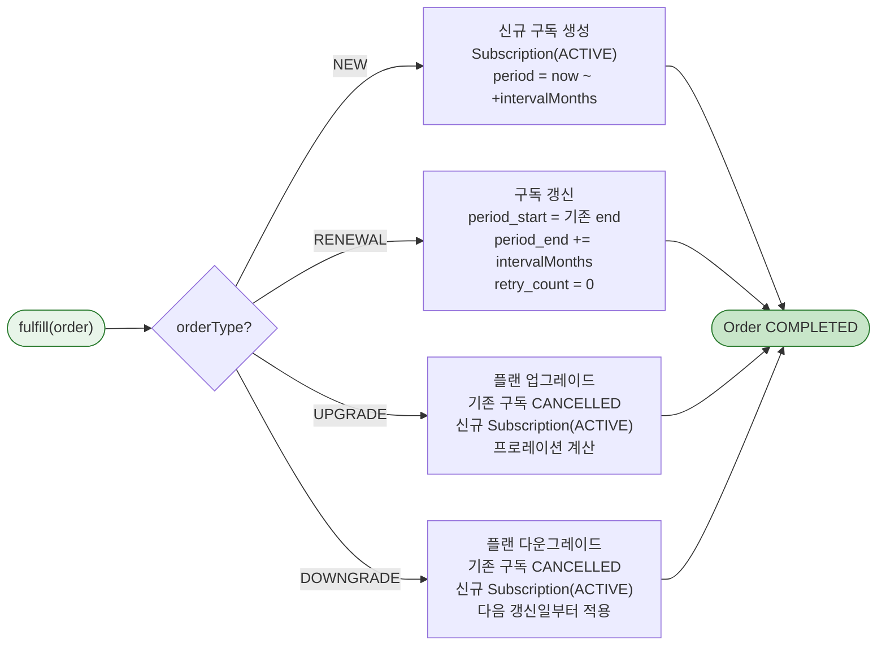
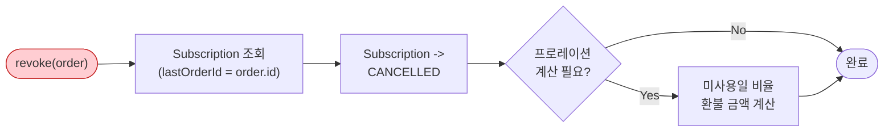

# [Ticket #12a] SubscriptionFulfillment 구현

## 개요
- TDD 참조: tdd.md 섹션 3.5, 4.1.4, 8.1
- 선행 티켓: #8b (FulfillmentStrategy 인터페이스)
- 크기: M
- 원본: ticket-12_fulfillment-strategy.md에서 분리

## 배경

SubscriptionFulfillment는 구독형 상품의 주문 이행을 담당한다. NEW(생성), RENEWAL(갱신), UPGRADE(프로레이션 환불 + 신규), DOWNGRADE(기간 종료 시) 4가지 주문 유형을 처리한다.

- `SubscriptionService`는 **존재하지 않는다** -- FulfillmentStrategy 패턴으로 통합
- Subscription은 `order/` 패키지 하위의 **Fulfillment 결과물**

---

## 작업 내용

### 처리 흐름



### revoke 흐름 (환불)



### SubscriptionFulfillment 코드

```kotlin
package com.greeting.payment.domain.order.fulfillment

import com.greeting.payment.domain.order.Order
import com.greeting.payment.domain.order.OrderType
import com.greeting.payment.domain.order.Subscription
import com.greeting.payment.domain.order.SubscriptionStatus
import com.greeting.payment.domain.product.ProductType
import com.greeting.payment.infrastructure.repository.ProductMetadataRepository
import com.greeting.payment.infrastructure.repository.SubscriptionRepository
import org.slf4j.LoggerFactory
import org.springframework.stereotype.Component
import org.springframework.transaction.annotation.Transactional
import java.time.LocalDateTime

@Component
class SubscriptionFulfillment(
    private val subscriptionRepository: SubscriptionRepository,
    private val productMetadataRepository: ProductMetadataRepository,
) : FulfillmentStrategy {

    private val log = LoggerFactory.getLogger(javaClass)

    @Transactional
    override fun fulfill(order: Order) {
        val item = order.items.first()
        require(item.productType == ProductType.SUBSCRIPTION.name) {
            "SubscriptionFulfillment은 SUBSCRIPTION 상품만 처리: actual=${item.productType}"
        }

        when (order.orderType) {
            OrderType.NEW -> createSubscription(order)
            OrderType.RENEWAL -> renewSubscription(order)
            OrderType.UPGRADE -> upgradeSubscription(order)
            OrderType.DOWNGRADE -> downgradeSubscription(order)
            else -> throw FulfillmentException(
                "SubscriptionFulfillment에서 처리할 수 없는 주문 유형: ${order.orderType}"
            )
        }
    }

    @Transactional
    override fun revoke(order: Order) {
        val subscription = subscriptionRepository.findByLastOrderId(order.id)
            ?: throw FulfillmentException("환불 대상 구독을 찾을 수 없습니다: orderId=${order.id}")

        subscription.cancel("환불에 의한 취소: orderNumber=${order.orderNumber}")
        subscriptionRepository.save(subscription)

        log.info("구독 환불 완료: subscriptionId=${subscription.id}, orderNumber=${order.orderNumber}")
    }

    /**
     * 신규 구독 생성.
     * 동일 workspace에 ACTIVE 구독이 있으면 먼저 취소.
     */
    private fun createSubscription(order: Order) {
        val item = order.items.first()
        val billingInterval = getBillingIntervalMonths(item.productId)

        // 기존 ACTIVE 구독 취소 (같은 workspace)
        subscriptionRepository
            .findByWorkspaceIdAndStatus(order.workspaceId, SubscriptionStatus.ACTIVE.name)
            ?.let { existing ->
                existing.cancel("신규 구독으로 대체: orderNumber=${order.orderNumber}")
                subscriptionRepository.save(existing)
            }

        val now = LocalDateTime.now()
        val subscription = Subscription(
            workspaceId = order.workspaceId,
            productId = item.productId,
            status = SubscriptionStatus.ACTIVE,
            currentPeriodStart = now,
            currentPeriodEnd = now.plusMonths(billingInterval.toLong()),
            billingIntervalMonths = billingInterval,
            autoRenew = true,
            retryCount = 0,
            lastOrderId = order.id,
        )

        subscriptionRepository.save(subscription)
        log.info("신규 구독 생성: workspaceId=${order.workspaceId}, product=${item.productCode}, " +
            "period=${subscription.currentPeriodStart}~${subscription.currentPeriodEnd}")
    }

    /**
     * 구독 갱신 (자동 갱신 스케줄러에서 호출).
     * 기존 period_end를 start로, +intervalMonths를 end로 설정.
     */
    private fun renewSubscription(order: Order) {
        val subscription = subscriptionRepository
            .findByWorkspaceIdAndStatus(order.workspaceId, SubscriptionStatus.ACTIVE.name)
            ?: subscriptionRepository
                .findByWorkspaceIdAndStatus(order.workspaceId, SubscriptionStatus.PAST_DUE.name)
            ?: throw FulfillmentException("갱신 대상 구독을 찾을 수 없습니다: workspaceId=${order.workspaceId}")

        val newStart = subscription.currentPeriodEnd
        val newEnd = newStart.plusMonths(subscription.billingIntervalMonths.toLong())

        subscription.renew(
            newPeriodStart = newStart,
            newPeriodEnd = newEnd,
            orderId = order.id,
        )
        subscriptionRepository.save(subscription)

        log.info("구독 갱신: subscriptionId=${subscription.id}, period=${newStart}~${newEnd}")
    }

    /**
     * 플랜 업그레이드.
     * 기존 구독 취소 + 신규 상위 구독 생성.
     * 프로레이션: 기존 미사용일 비율만큼 환불 (Order.creditAmount에 반영됨)
     */
    private fun upgradeSubscription(order: Order) {
        val existing = subscriptionRepository
            .findByWorkspaceIdAndStatus(order.workspaceId, SubscriptionStatus.ACTIVE.name)

        existing?.let {
            it.cancel("업그레이드: orderNumber=${order.orderNumber}")
            subscriptionRepository.save(it)
        }

        // 신규 상위 플랜 구독 생성
        createSubscription(order)
    }

    /**
     * 플랜 다운그레이드.
     * 기존 구독 유지, 다음 갱신일에 하위 플랜으로 전환.
     * 즉시 전환이 아닌 scheduled downgrade.
     */
    private fun downgradeSubscription(order: Order) {
        val existing = subscriptionRepository
            .findByWorkspaceIdAndStatus(order.workspaceId, SubscriptionStatus.ACTIVE.name)
            ?: throw FulfillmentException("다운그레이드 대상 구독이 없습니다: workspaceId=${order.workspaceId}")

        val item = order.items.first()

        // 다운그레이드 예약: 갱신 시점에 적용
        existing.scheduleDowngrade(item.productId, order.id)
        subscriptionRepository.save(existing)

        log.info("다운그레이드 예약: subscriptionId=${existing.id}, newProduct=${item.productCode}, " +
            "적용 시점=${existing.currentPeriodEnd}")
    }

    private fun getBillingIntervalMonths(productId: Long): Int {
        return productMetadataRepository
            .findByProductIdAndMetaKey(productId, "billing_interval_months")
            ?.metaValue?.toIntOrNull() ?: 1
    }
}
```

### Subscription 엔티티 (도메인 로직)

```kotlin
package com.greeting.payment.domain.order

import jakarta.persistence.*
import java.time.LocalDateTime

@Entity
@Table(name = "subscription")
@SQLRestriction("deleted_at IS NULL")
@SQLDelete(sql = "UPDATE subscription SET deleted_at = NOW(6) WHERE id = ? AND version = ?")
class Subscription(

    @Id
    @GeneratedValue(strategy = GenerationType.IDENTITY)
    val id: Long = 0,

    @Column(name = "workspace_id", nullable = false)
    val workspaceId: Int,

    @Column(name = "product_id", nullable = false)
    var productId: Long,

    @Column(name = "status", nullable = false)
    @Enumerated(EnumType.STRING)
    var status: SubscriptionStatus = SubscriptionStatus.ACTIVE,

    @Column(name = "current_period_start", nullable = false)
    var currentPeriodStart: LocalDateTime,

    @Column(name = "current_period_end", nullable = false)
    var currentPeriodEnd: LocalDateTime,

    @Column(name = "billing_interval_months", nullable = false)
    val billingIntervalMonths: Int = 1,

    @Column(name = "auto_renew", nullable = false)
    var autoRenew: Boolean = true,

    @Column(name = "retry_count", nullable = false)
    var retryCount: Int = 0,

    @Column(name = "last_order_id")
    var lastOrderId: Long? = null,

    @Column(name = "cancelled_at")
    var cancelledAt: LocalDateTime? = null,

    @Column(name = "cancel_reason")
    var cancelReason: String? = null,

    /** 다운그레이드 예약: 다음 갱신 시 전환할 product_id */
    @Column(name = "scheduled_product_id")
    var scheduledProductId: Long? = null,

    @Column(name = "created_at", nullable = false, updatable = false)
    val createdAt: LocalDateTime = LocalDateTime.now(),

    @Column(name = "updated_at", nullable = false)
    var updatedAt: LocalDateTime = LocalDateTime.now(),

    @Column(name = "deleted_at")
    var deletedAt: LocalDateTime? = null,

    @Version
    @Column(name = "version", nullable = false)
    var version: Int = 0,
) {

    fun activate() {
        this.status = SubscriptionStatus.ACTIVE
        this.updatedAt = LocalDateTime.now()
    }

    fun renew(newPeriodStart: LocalDateTime, newPeriodEnd: LocalDateTime, orderId: Long) {
        this.currentPeriodStart = newPeriodStart
        this.currentPeriodEnd = newPeriodEnd
        this.lastOrderId = orderId
        this.retryCount = 0
        this.status = SubscriptionStatus.ACTIVE
        this.updatedAt = LocalDateTime.now()

        // 다운그레이드 예약이 있으면 갱신 시 적용
        scheduledProductId?.let { newProductId ->
            this.productId = newProductId
            this.scheduledProductId = null
        }
    }

    fun cancel(reason: String) {
        this.status = SubscriptionStatus.CANCELLED
        this.cancelledAt = LocalDateTime.now()
        this.cancelReason = reason
        this.autoRenew = false
        this.updatedAt = LocalDateTime.now()
    }

    fun expire() {
        this.status = SubscriptionStatus.EXPIRED
        this.autoRenew = false
        this.updatedAt = LocalDateTime.now()
    }

    fun incrementRetry() {
        this.status = SubscriptionStatus.PAST_DUE
        this.retryCount++
        this.updatedAt = LocalDateTime.now()
    }

    fun scheduleDowngrade(newProductId: Long, orderId: Long) {
        this.scheduledProductId = newProductId
        this.lastOrderId = orderId
        this.updatedAt = LocalDateTime.now()
    }

    /** 프로레이션 환불 금액 계산 (미사용일 비율) */
    fun calculateProration(originalAmount: Int): Int {
        val now = LocalDateTime.now()
        if (now.isAfter(currentPeriodEnd)) return 0

        val totalDays = java.time.Duration.between(currentPeriodStart, currentPeriodEnd).toDays()
        if (totalDays <= 0) return 0

        val remainingDays = java.time.Duration.between(now, currentPeriodEnd).toDays()
        return ((originalAmount.toLong() * remainingDays) / totalDays).toInt()
    }
}
```

### SubscriptionStatus enum

```kotlin
package com.greeting.payment.domain.order

enum class SubscriptionStatus {
    ACTIVE,     // 활성
    PAST_DUE,   // 결제 실패 (재시도 대기)
    CANCELLED,  // 취소
    EXPIRED;    // 만료 (재시도 한도 초과)

    companion object {
        private val ALLOWED_TRANSITIONS: Map<SubscriptionStatus, Set<SubscriptionStatus>> = mapOf(
            ACTIVE to setOf(PAST_DUE, CANCELLED),
            PAST_DUE to setOf(ACTIVE, CANCELLED, EXPIRED),
            CANCELLED to emptySet(),
            EXPIRED to emptySet(),
        )
    }

    fun canTransitionTo(next: SubscriptionStatus): Boolean {
        return next in (ALLOWED_TRANSITIONS[this] ?: emptySet())
    }
}
```

### SubscriptionRepository 추가 쿼리

```kotlin
package com.greeting.payment.infrastructure.repository

import com.greeting.payment.domain.order.Subscription
import org.springframework.data.jpa.repository.JpaRepository

interface SubscriptionRepository : JpaRepository<Subscription, Long> {

    fun findByWorkspaceIdAndStatus(workspaceId: Int, status: String): Subscription?

    fun findByLastOrderId(orderId: Long): Subscription?

    /** 만료 예정 구독 조회 (스케줄러용) */
    fun findByCurrentPeriodEndBeforeAndAutoRenewTrueAndStatusIn(
        deadline: java.time.LocalDateTime,
        statuses: List<String>,
    ): List<Subscription>
}
```

### 수정 파일 목록

| 파일 | 변경 유형 | 설명 |
|------|----------|------|
| `domain/order/fulfillment/SubscriptionFulfillment.kt` | 신규 | 구독 생성/갱신/업/다운그레이드 |
| `domain/order/Subscription.kt` | 수정 | activate, renew, cancel, expire, incrementRetry, scheduleDowngrade, calculateProration 도메인 로직 |
| `domain/order/SubscriptionStatus.kt` | 신규 | enum + canTransitionTo |
| `infrastructure/repository/SubscriptionRepository.kt` | 수정 | 쿼리 추가 |
| `infrastructure/repository/ProductMetadataRepository.kt` | 수정 | findByProductIdAndMetaKey 추가 |

---

## 테스트 케이스

### 정상 케이스

| # | 테스트 | 입력 | 기대 결과 |
|---|--------|------|----------|
| 1 | `SubscriptionFulfillment.fulfill` - 신규 | orderType=NEW | Subscription ACTIVE, period 설정 |
| 2 | `SubscriptionFulfillment.fulfill` - 갱신 | orderType=RENEWAL | period 연장, retryCount=0 |
| 3 | `SubscriptionFulfillment.fulfill` - 업그레이드 | orderType=UPGRADE | 기존 취소 + 신규 구독 생성 |
| 4 | `SubscriptionFulfillment.fulfill` - 다운그레이드 예약 | orderType=DOWNGRADE | scheduledProductId 설정 |
| 5 | `SubscriptionFulfillment.revoke` - 구독 환불 | lastOrderId 일치 | Subscription CANCELLED |
| 6 | `Subscription.renew` - 다운그레이드 적용 | scheduledProductId 존재 | productId 변경, scheduledProductId null |
| 7 | `Subscription.calculateProration` | 잔여 15일/30일 | 50% 환불 |

### 예외/엣지 케이스

| # | 테스트 | 입력 | 기대 결과 |
|---|--------|------|----------|
| 1 | `SubscriptionFulfillment` - 잘못된 ProductType | CONSUMABLE 상품 | IllegalArgumentException |
| 2 | `SubscriptionFulfillment` - 잘못된 OrderType | type=PURCHASE | FulfillmentException |
| 3 | `SubscriptionFulfillment.revoke` - 대상 없음 | lastOrderId 불일치 | FulfillmentException |
| 4 | `SubscriptionFulfillment.renew` - ACTIVE 구독 없음 | workspace에 구독 없음 | FulfillmentException |

---

## 그리팅 실제 적용 예시

### AS-IS (현재)
- **플랜 업그레이드**: `PlanServiceImpl.upgradePlan()` -> Toss `chargeByBillingKey()` 직접 호출 -> `planInfo.updatePlan()` 직접 수정 -> `PaymentLogsOnWorkspace`(MongoDB) 저장 -> `PlanChanged` + `BasicPlanProcess`/`StandardPlanProcess` 이벤트. 결제/이행이 하나의 메서드에 혼재
- **플랜 해지**: `PlanServiceImpl.cancelPlan()` -> 미사용일 프로레이션(`cancelPrice=환불금`) -> `PaymentLogsOnWorkspace`에 `cancelLog(isBuy=false)` -> `planInfo.cancelPlan()` -> `PlanEndedMail` 이벤트
- **플랜 자동 갱신**: `PlanServiceImpl.updatePlan()` -> 성공: `planInfo.updatePlan()` + MongoDB 로그 + `PlanChanged` / 실패: `planInfo.failedUpdatePlan()` + `PlanUpdateFailedMail`. 체계적 재시도 없음

### TO-BE (리팩토링 후)
- **플랜 업그레이드**: `OrderFacade.createAndProcessOrder("PLAN_STANDARD", UPGRADE)` -> OrderService.createOrder() -> PaymentService -> `SubscriptionFulfillment.fulfill()` -- 기존 구독 CANCELLED + 신규 구독 ACTIVE. 프로레이션은 Order.creditAmount에 반영
- **플랜 해지**: `OrderFacade.cancelOrder()` -> `SubscriptionFulfillment.revoke()` -> `Subscription.cancel()` + `calculateProration()` 환불
- **플랜 자동 갱신**: `SubscriptionRenewalFacade` -> `OrderFacade.createAndProcessOrder(RENEWAL)` -> `SubscriptionFulfillment.fulfill()` -- `retry_count` 기반 5회 재시도, PAST_DUE -> EXPIRED 체계적 전이

### 향후 확장 예시 (코드 변경 없이 가능)
- **AI 서류평가 무제한 구독**: `product` 테이블에 `AI_EVAL_UNLIMITED` INSERT(product_type=SUBSCRIPTION) -> `OrderFacade.createAndProcessOrder("AI_EVAL_UNLIMITED", NEW)` -> `SubscriptionFulfillment` (동일 파이프라인)
- **엔터프라이즈 전용 구독**: `product` 테이블에 `ENTERPRISE_PLAN` INSERT -> 동일 파이프라인, billingIntervalMonths만 12로 설정

---

## 기대 결과 (AC)

- [ ] `SubscriptionFulfillment.fulfill()`가 NEW/RENEWAL/UPGRADE/DOWNGRADE 4가지 주문 유형을 올바르게 처리
- [ ] 신규 구독 시 동일 workspace의 기존 ACTIVE 구독이 자동 취소됨
- [ ] 구독 갱신 시 period가 올바르게 연장되고 retryCount가 0으로 리셋
- [ ] 다운그레이드가 즉시 적용이 아닌 갱신 시점에 예약 적용
- [ ] `Subscription.calculateProration()`이 미사용일 비율로 환불 금액을 정확히 계산
- [ ] `SubscriptionStatus` enum이 canTransitionTo로 전이 규칙 소유
- [ ] Subscription 엔티티의 activate, renew, cancel, expire, incrementRetry 메서드가 도메인 로직 캡슐화
- [ ] 단위 테스트: 정상 7건 + 예외 4건 = 총 11건 통과
