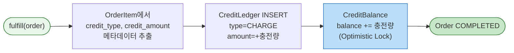
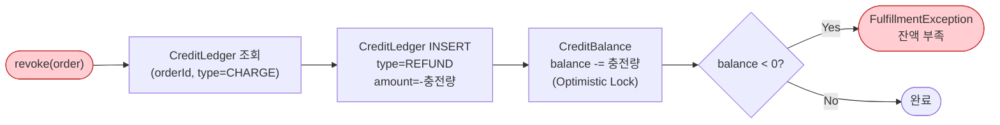

# [Ticket #12b] CreditFulfillment 구현

## 개요
- TDD 참조: tdd.md 섹션 3.5, 4.1.5
- 선행 티켓: #8b (FulfillmentStrategy 인터페이스)
- 크기: M
- 원본: ticket-12_fulfillment-strategy.md에서 분리

## 배경

CreditFulfillment는 소진형 상품(크레딧)의 주문 이행을 담당한다. CreditLedger에 CHARGE 기록 + CreditBalance 잔액 증가를 원자적으로 처리한다.

- `CreditService`는 **존재하지 않는다** -- FulfillmentStrategy 패턴으로 통합
- CreditBalance, CreditLedger는 `order/` 패키지 하위의 **Fulfillment 결과물**
- CreditBalance에 Optimistic Lock(@Version)을 적용하여 동시 충전/차감 경합 방지

---

## 작업 내용

### 처리 흐름



### revoke 흐름 (환불)



### CreditFulfillment 코드

```kotlin
package com.greeting.payment.domain.order.fulfillment

import com.greeting.payment.domain.order.*
import com.greeting.payment.domain.product.ProductType
import com.greeting.payment.infrastructure.repository.CreditBalanceRepository
import com.greeting.payment.infrastructure.repository.CreditLedgerRepository
import com.greeting.payment.infrastructure.repository.ProductMetadataRepository
import org.slf4j.LoggerFactory
import org.springframework.stereotype.Component
import org.springframework.transaction.annotation.Transactional

@Component
class CreditFulfillment(
    private val creditBalanceRepository: CreditBalanceRepository,
    private val creditLedgerRepository: CreditLedgerRepository,
    private val productMetadataRepository: ProductMetadataRepository,
) : FulfillmentStrategy {

    private val log = LoggerFactory.getLogger(javaClass)

    @Transactional
    override fun fulfill(order: Order) {
        val item = order.items.first()
        require(item.productType == ProductType.CONSUMABLE.name) {
            "CreditFulfillment은 CONSUMABLE 상품만 처리: actual=${item.productType}"
        }

        val creditType = getCreditType(item.productId)
        val creditAmount = getCreditAmount(item.productId) * item.quantity

        // 1. CreditBalance 조회 또는 생성 (Optimistic Lock)
        val balance = creditBalanceRepository
            .findByWorkspaceIdAndCreditType(order.workspaceId, creditType)
            ?: CreditBalance(
                workspaceId = order.workspaceId,
                creditType = creditType,
                balance = 0,
            )

        val newBalance = balance.balance + creditAmount

        // 2. CreditLedger 충전 기록
        val ledger = CreditLedger(
            workspaceId = order.workspaceId,
            creditType = creditType,
            transactionType = CreditTransactionType.CHARGE.name,
            amount = creditAmount,
            balanceAfter = newBalance,
            orderId = order.id,
            description = "충전: ${item.productName} x${item.quantity}",
        )
        creditLedgerRepository.save(ledger)

        // 3. CreditBalance 잔액 증가
        balance.charge(creditAmount)
        creditBalanceRepository.save(balance)

        log.info("크레딧 충전: workspaceId=${order.workspaceId}, type=$creditType, " +
            "amount=+$creditAmount, newBalance=$newBalance")
    }

    @Transactional
    override fun revoke(order: Order) {
        val item = order.items.first()
        val creditType = getCreditType(item.productId)
        val creditAmount = getCreditAmount(item.productId) * item.quantity

        // 1. CreditBalance 조회
        val balance = creditBalanceRepository
            .findByWorkspaceIdAndCreditType(order.workspaceId, creditType)
            ?: throw FulfillmentException("환불 대상 크레딧 잔액이 없습니다: workspaceId=${order.workspaceId}")

        // 2. 잔액 부족 검증
        if (balance.balance < creditAmount) {
            throw FulfillmentException(
                "크레딧 환불 불가: 현재 잔액=${balance.balance}, 환불 요청량=$creditAmount"
            )
        }

        val newBalance = balance.balance - creditAmount

        // 3. CreditLedger 환불 기록
        val ledger = CreditLedger(
            workspaceId = order.workspaceId,
            creditType = creditType,
            transactionType = CreditTransactionType.REFUND.name,
            amount = -creditAmount,
            balanceAfter = newBalance,
            orderId = order.id,
            description = "환불: ${item.productName} x${item.quantity}",
        )
        creditLedgerRepository.save(ledger)

        // 4. CreditBalance 잔액 차감
        balance.refund(creditAmount)
        creditBalanceRepository.save(balance)

        log.info("크레딧 환불: workspaceId=${order.workspaceId}, type=$creditType, " +
            "amount=-$creditAmount, newBalance=$newBalance")
    }

    private fun getCreditType(productId: Long): String {
        return productMetadataRepository
            .findByProductIdAndMetaKey(productId, "credit_type")
            ?.metaValue
            ?: throw FulfillmentException("상품에 credit_type 메타데이터가 없습니다: productId=$productId")
    }

    private fun getCreditAmount(productId: Long): Int {
        return productMetadataRepository
            .findByProductIdAndMetaKey(productId, "credit_amount")
            ?.metaValue?.toIntOrNull()
            ?: throw FulfillmentException("상품에 credit_amount 메타데이터가 없습니다: productId=$productId")
    }
}
```

### CreditBalance 엔티티

```kotlin
package com.greeting.payment.domain.order

import jakarta.persistence.*
import java.time.LocalDateTime

@Entity
@Table(name = "credit_balance")
class CreditBalance(

    @Id
    @GeneratedValue(strategy = GenerationType.IDENTITY)
    val id: Long = 0,

    @Column(name = "workspace_id", nullable = false)
    val workspaceId: Int,

    @Column(name = "credit_type", nullable = false)
    val creditType: String,

    @Column(name = "balance", nullable = false)
    var balance: Int = 0,

    @Column(name = "updated_at", nullable = false)
    var updatedAt: LocalDateTime = LocalDateTime.now(),

    @Version
    @Column(name = "version", nullable = false)
    var version: Int = 0,
) {

    fun charge(amount: Int) {
        require(amount > 0) { "충전량은 양수여야 합니다: $amount" }
        this.balance += amount
        this.updatedAt = LocalDateTime.now()
    }

    fun use(amount: Int) {
        require(amount > 0) { "사용량은 양수여야 합니다: $amount" }
        require(this.balance >= amount) { "잔액 부족: balance=${this.balance}, request=$amount" }
        this.balance -= amount
        this.updatedAt = LocalDateTime.now()
    }

    fun refund(amount: Int) {
        require(amount > 0) { "환불량은 양수여야 합니다: $amount" }
        require(this.balance >= amount) { "잔액 부족: balance=${this.balance}, request=$amount" }
        this.balance -= amount
        this.updatedAt = LocalDateTime.now()
    }
}
```

### CreditLedger 엔티티

```kotlin
package com.greeting.payment.domain.order

import jakarta.persistence.*
import java.time.LocalDateTime

@Entity
@Table(name = "credit_ledger")
class CreditLedger(

    @Id
    @GeneratedValue(strategy = GenerationType.IDENTITY)
    val id: Long = 0,

    @Column(name = "workspace_id", nullable = false)
    val workspaceId: Int,

    @Column(name = "credit_type", nullable = false)
    val creditType: String,

    @Column(name = "transaction_type", nullable = false)
    val transactionType: String,

    @Column(name = "amount", nullable = false)
    val amount: Int,

    @Column(name = "balance_after", nullable = false)
    val balanceAfter: Int,

    @Column(name = "order_id")
    val orderId: Long? = null,

    @Column(name = "description")
    val description: String? = null,

    @Column(name = "expired_at")
    val expiredAt: LocalDateTime? = null,

    @Column(name = "created_at", nullable = false, updatable = false)
    val createdAt: LocalDateTime = LocalDateTime.now(),
)
```

### CreditTransactionType / CreditType enum

```kotlin
package com.greeting.payment.domain.order

enum class CreditTransactionType {
    CHARGE,   // 충전
    USE,      // 사용
    REFUND,   // 환불
    EXPIRE,   // 만료
    GRANT,    // 무상 지급
}

enum class CreditType {
    SMS,
    AI_EVALUATION,
}
```

### CreditBalanceRepository / CreditLedgerRepository

```kotlin
package com.greeting.payment.infrastructure.repository

import com.greeting.payment.domain.order.CreditBalance
import com.greeting.payment.domain.order.CreditLedger
import org.springframework.data.jpa.repository.JpaRepository

interface CreditBalanceRepository : JpaRepository<CreditBalance, Long> {

    fun findByWorkspaceIdAndCreditType(workspaceId: Int, creditType: String): CreditBalance?
}

interface CreditLedgerRepository : JpaRepository<CreditLedger, Long> {

    fun findByOrderIdAndTransactionType(orderId: Long, transactionType: String): List<CreditLedger>

    fun findByWorkspaceIdAndCreditTypeOrderByCreatedAtDesc(
        workspaceId: Int,
        creditType: String,
    ): List<CreditLedger>
}
```

### 수정 파일 목록

| 파일 | 변경 유형 | 설명 |
|------|----------|------|
| `domain/order/fulfillment/CreditFulfillment.kt` | 신규 | 크레딧 충전/환불 |
| `domain/order/CreditBalance.kt` | 수정 | charge, use, refund 도메인 로직 |
| `domain/order/CreditLedger.kt` | 기존 (#2) | 변경 없음 |
| `domain/order/CreditTransactionType.kt` | 신규 | enum |
| `domain/order/CreditType.kt` | 신규 | enum |
| `infrastructure/repository/CreditBalanceRepository.kt` | 수정 | 쿼리 추가 |
| `infrastructure/repository/CreditLedgerRepository.kt` | 수정 | 쿼리 추가 |

---

## 테스트 케이스

### 정상 케이스

| # | 테스트 | 입력 | 기대 결과 |
|---|--------|------|----------|
| 1 | `CreditFulfillment.fulfill` - 크레딧 충전 | SMS_PACK_1000 | balance += 1000, Ledger CHARGE 기록 |
| 2 | `CreditFulfillment.fulfill` - 최초 충전 (잔액 없음) | 새 workspace | CreditBalance 신규 생성, balance=충전량 |
| 3 | `CreditFulfillment.revoke` - 크레딧 환불 | 잔액 충분 | balance -= 충전량, Ledger REFUND 기록 |
| 4 | `CreditBalance.charge` | amount=100 | balance += 100 |
| 5 | `CreditBalance.use` | balance=1000, amount=100 | balance = 900 |
| 6 | `CreditBalance.refund` | balance=1000, amount=100 | balance = 900 |

### 예외/엣지 케이스

| # | 테스트 | 입력 | 기대 결과 |
|---|--------|------|----------|
| 1 | `CreditFulfillment` - 잘못된 ProductType | SUBSCRIPTION 상품 | IllegalArgumentException |
| 2 | `CreditFulfillment` - credit_type 메타 없음 | 메타데이터 미등록 | FulfillmentException |
| 3 | `CreditFulfillment` - credit_amount 메타 없음 | 메타데이터 미등록 | FulfillmentException |
| 4 | `CreditFulfillment.revoke` - 잔액 부족 | balance < 환불량 | FulfillmentException |
| 5 | `CreditBalance.use` - 잔액 부족 | balance=50, amount=100 | IllegalArgumentException |
| 6 | `CreditBalance.charge` - 음수 입력 | amount=-100 | IllegalArgumentException |
| 7 | `CreditBalance` 낙관적 락 충돌 | 동시 충전 | OptimisticLockException |

---

## 그리팅 실제 적용 예시

### AS-IS (현재)
- **SMS 충전**: `MessagePointService` -> 별개 서비스에서 `MessagePointChargeLogsOnWorkspace`(MongoDB) 저장 + `CreditOnGroup.credit` 직접 수정. 플랜과 완전히 다른 코드 경로
- **SMS 사용/만료**: `MessagePointLogsOnWorkspace`에 유형별(PAYMENT/CREDIT/USE/DELETE/EXPIRE/REFUND) 기록. 원장 개념 없이 로그만 존재

### TO-BE (리팩토링 후)
- **SMS 충전**: `OrderFacade.createAndProcessOrder("SMS_PACK_1000", PURCHASE)` -> `CreditFulfillment.fulfill()` -- `CreditLedger`(CHARGE) + `CreditBalance` 잔액 증가. 플랜과 동일 파이프라인
- **SMS 사용**: `CreditLedger`(USE) + `CreditBalance.use()` 잔액 차감 (Optimistic Lock). 원장 기반 정합성 보장

### 향후 확장 예시 (코드 변경 없이 가능)
- **AI 서류평가 크레딧 100건 충전**: `product` 테이블에 `AI_CREDIT_100` INSERT(`product_metadata`: credit_type=AI_EVALUATION, credit_amount=100) -> `OrderFacade.createAndProcessOrder("AI_CREDIT_100", PURCHASE)` -> `CreditFulfillment` (동일 파이프라인)
- **면접 크레딧**: `product` 테이블에 `INTERVIEW_CREDIT_50` INSERT(credit_type=INTERVIEW) -> CreditType enum에 INTERVIEW 추가 -> 동일 파이프라인

---

## 기대 결과 (AC)

- [ ] `CreditFulfillment.fulfill()`가 CreditLedger(CHARGE) + CreditBalance(잔액 증가)를 원자적으로 처리
- [ ] CreditBalance에 Optimistic Lock(@Version)이 적용되어 동시 충전/차감 경합 방지
- [ ] `CreditFulfillment.revoke()`가 잔액 부족 시 명확한 예외 발생
- [ ] CreditBalance 엔티티의 charge, use, refund 메서드가 도메인 로직 캡슐화
- [ ] CreditBalance, CreditLedger가 order/ 패키지 하위에 위치 (독립 도메인이 아닌 Fulfillment 결과물)
- [ ] 단위 테스트: 정상 6건 + 예외 7건 = 총 13건 통과
