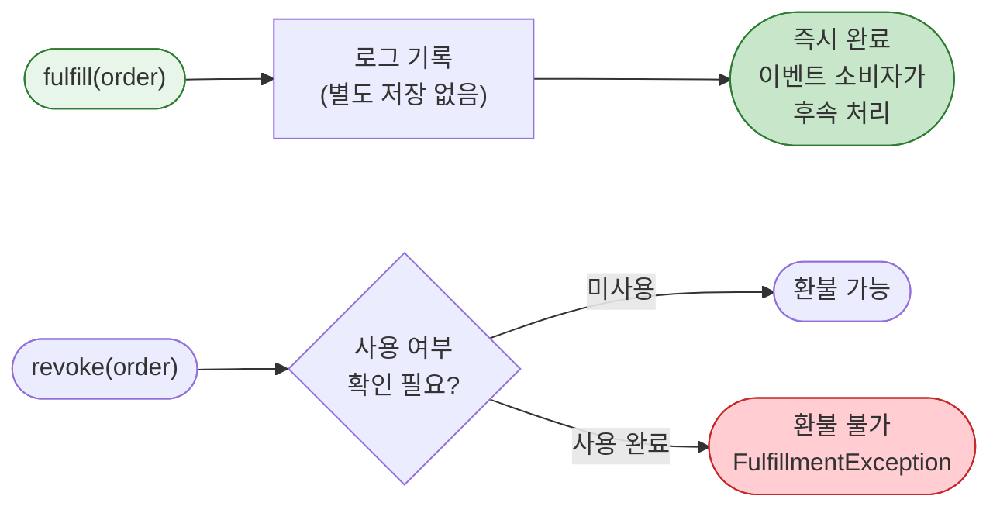

# [Ticket #12c] OneTimeFulfillment 구현

## 개요
- TDD 참조: tdd.md 섹션 3.5
- 선행 티켓: #8b (FulfillmentStrategy 인터페이스)
- 크기: S
- 원본: ticket-12_fulfillment-strategy.md에서 분리

## 배경

OneTimeFulfillment는 일회성 상품의 주문 이행을 담당한다. 별도 저장/지급 없이 즉시 완료되며, Order가 COMPLETED 되면 `order.event.v1` 이벤트를 소비하는 다른 서비스가 후속 처리한다.

---

## 작업 내용

### 처리 흐름



### OneTimeFulfillment 코드

```kotlin
package com.greeting.payment.domain.order.fulfillment

import com.greeting.payment.domain.order.Order
import com.greeting.payment.domain.product.ProductType
import org.slf4j.LoggerFactory
import org.springframework.stereotype.Component

/**
 * 일회성 상품 Fulfillment.
 *
 * 별도 저장/지급 없이 즉시 완료. Order가 COMPLETED 되면
 * order.event.v1 이벤트를 소비하는 다른 서비스가 후속 처리한다.
 * (예: AI 서류평가 1건 -> ATS에서 이벤트 수신 후 평가 실행)
 */
@Component
class OneTimeFulfillment : FulfillmentStrategy {

    private val log = LoggerFactory.getLogger(javaClass)

    override fun fulfill(order: Order) {
        val item = order.items.first()
        require(item.productType == ProductType.ONE_TIME.name) {
            "OneTimeFulfillment은 ONE_TIME 상품만 처리: actual=${item.productType}"
        }

        // 즉시 완료 — 별도 저장 없음
        // order.event.v1 이벤트로 소비자가 후속 처리
        log.info("일회성 주문 즉시 완료: orderNumber=${order.orderNumber}, product=${item.productCode}")
    }

    override fun revoke(order: Order) {
        // 일회성 상품은 사용 여부에 따라 환불 결정
        // 현재 단계에서는 환불 허용 (사용 여부 확인은 소비자 서비스 책임)
        log.info("일회성 주문 환불: orderNumber=${order.orderNumber}")
    }
}
```

### 수정 파일 목록

| 파일 | 변경 유형 | 설명 |
|------|----------|------|
| `domain/order/fulfillment/OneTimeFulfillment.kt` | 신규 | 일회성 즉시 완료 |

---

## 테스트 케이스

### 정상 케이스

| # | 테스트 | 입력 | 기대 결과 |
|---|--------|------|----------|
| 1 | `OneTimeFulfillment.fulfill` - 즉시 완료 | ONE_TIME 상품 | 별도 저장 없이 즉시 반환 |
| 2 | `OneTimeFulfillment.revoke` - 환불 | ONE_TIME 상품 | 로그만 기록, 즉시 반환 |

### 예외/엣지 케이스

| # | 테스트 | 입력 | 기대 결과 |
|---|--------|------|----------|
| 1 | `OneTimeFulfillment` - 잘못된 ProductType | SUBSCRIPTION 상품 | IllegalArgumentException |

---

## 향후 확장 예시

- **프리미엄 리포트 단건 구매**: `product` 테이블에 `PREMIUM_REPORT` INSERT(product_type=ONE_TIME) -> `OrderFacade.createAndProcessOrder("PREMIUM_REPORT", PURCHASE)` -> `OneTimeFulfillment` (동일 파이프라인). 후속 처리는 `order.event.v1` 이벤트 소비자가 담당
- **AI 서류평가 1건 단건 구매**: `product` 테이블에 `AI_EVAL_SINGLE` INSERT(product_type=ONE_TIME) -> 동일 파이프라인. ATS에서 이벤트 수신 후 평가 실행
- **사용 여부 기반 환불 제어**: 향후 `revoke()` 확장 시 이벤트 소비자에게 사용 여부를 질의하여 환불 가능 판단 로직 추가 가능

---

## 기대 결과 (AC)

- [ ] `OneTimeFulfillment.fulfill()`가 별도 저장 없이 즉시 완료
- [ ] `OneTimeFulfillment.revoke()`가 현재 단계에서 환불 허용 (로그 기록)
- [ ] 잘못된 ProductType 입력 시 명확한 예외 발생
- [ ] 단위 테스트: 정상 2건 + 예외 1건 = 총 3건 통과
