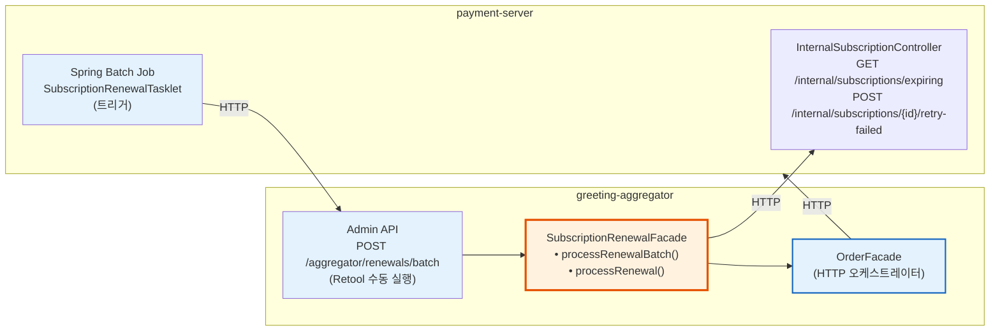
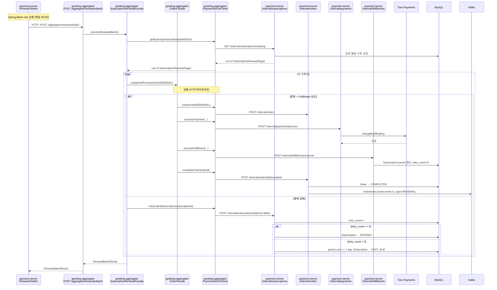
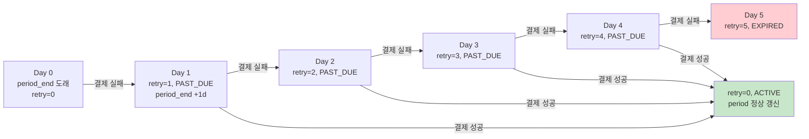

# [Ticket #13a] 구독 자동 갱신 (Tasklet + SubscriptionRenewalFacade via HTTP)

## 개요
- TDD 참조: tdd.md 섹션 4.6, 8.3
- 선행 티켓: #8d (OrderFacade in greeting-aggregator), #12a (SubscriptionFulfillment), #14 (Internal API)
- 크기: M

## 핵심 설계 원칙

1. **SubscriptionRenewalFacade는 greeting-aggregator에 위치** — HTTP로 payment-server Internal API를 호출하여 갱신 로직을 오케스트레이션. OrderFacade의 공통 파이프라인을 재사용.
2. **Tasklet은 payment-server에 위치** — Spring Batch `Tasklet`으로 구현. `@Scheduled` 사용 안 함. Tasklet은 aggregator의 SubscriptionRenewalFacade를 HTTP로 호출하는 트리거일 뿐.
3. **도메인 로직은 payment-server에 유지** — 만료 대상 구독 조회, retry 처리 등은 payment-server Internal API로 제공.

### 레이어 구조



---

## 작업 내용

### 1. SubscriptionRenewalFacade (greeting-aggregator, HTTP 오케스트레이션)

```kotlin
// greeting-aggregator/business/application/payment/SubscriptionRenewalFacade.kt
package doodlin.greeting.aggregator.business.application.payment

import doodlin.greeting.aggregator.business.application.payment.client.PaymentServerClient
import doodlin.greeting.aggregator.business.application.payment.client.dto.*
import io.micrometer.core.instrument.MeterRegistry
import org.slf4j.LoggerFactory
import org.springframework.stereotype.Service

/**
 * 구독 갱신 오케스트레이션. greeting-aggregator에 위치.
 * payment-server Internal API를 HTTP로 호출하여 갱신 로직을 수행한다.
 * OrderFacade의 공통 파이프라인(Product→Order→Payment→Fulfillment)을 재사용.
 * @Scheduled는 사용하지 않는다.
 */
@Service
class SubscriptionRenewalFacade(
    private val paymentServerClient: PaymentServerClient,
    private val orderFacade: OrderFacade,
    private val meterRegistry: MeterRegistry,
) {
    private val log = LoggerFactory.getLogger(javaClass)

    companion object {
        const val DEFAULT_BATCH_SIZE = 100
    }

    /** 배치 실행: 만료 대상 조회(HTTP) → 각 건 갱신 처리 */
    fun processRenewalBatch(batchSize: Int = DEFAULT_BATCH_SIZE): RenewalBatchResult {
        // payment-server에서 만료 예정 구독 목록 조회 (HTTP)
        val targets = paymentServerClient.getExpiringSubscriptions(batchSize)
        log.info("[Renewal] 갱신 대상 ${targets.size}건 시작")

        var success = 0
        var failed = 0
        var expired = 0

        for (subscription in targets) {
            try {
                processRenewal(subscription)
                success++
                meterRegistry.counter("scheduler.renewal.success").increment()
            } catch (e: Exception) {
                log.error("[Renewal] 실패: subscription=${subscription.id}, workspace=${subscription.workspaceId}", e)
                failed++
                meterRegistry.counter("scheduler.renewal.failure").increment()
                if (subscription.retryCount >= 5) {
                    expired++
                    meterRegistry.counter("scheduler.renewal.expired").increment()
                }
            }
        }

        val result = RenewalBatchResult(total = targets.size, success = success, failed = failed, expired = expired)
        log.info("[Renewal] 완료: $result")
        return result
    }

    /** 단건 갱신 처리 */
    fun processRenewal(subscription: SubscriptionRenewalTarget) {
        try {
            // OrderFacade의 공통 HTTP 파이프라인 재사용 (Product→Order→Payment→Fulfillment)
            orderFacade.createAndProcessOrder(
                CreateOrderRequest(
                    workspaceId = subscription.workspaceId,
                    productCode = subscription.productCode,
                    orderType = "RENEWAL",
                    billingIntervalMonths = subscription.billingIntervalMonths,
                    createdBy = "SYSTEM_RENEWAL",
                )
            )
            // SubscriptionFulfillment 내부에서 subscription.renew() 호출됨 (payment-server)
        } catch (e: Exception) {
            // 결제 실패 시 payment-server에 retry 처리 요청 (HTTP)
            paymentServerClient.retryFailedSubscription(subscription.id)
            throw e
        }
    }
}

data class RenewalBatchResult(
    val total: Int,
    val success: Int,
    val failed: Int,
    val expired: Int,
)
```

### 2. PaymentServerClient 추가 메서드 (greeting-aggregator)

```kotlin
// PaymentServerClient.kt에 추가

/** 만료 예정 구독 목록 조회 */
fun getExpiringSubscriptions(batchSize: Int): List<SubscriptionRenewalTarget> =
    paymentRestClient.get()
        .uri("/internal/subscriptions/expiring?batchSize={batchSize}", batchSize)
        .retrieve()
        .body(object : ParameterizedTypeReference<List<SubscriptionRenewalTarget>>() {})!!

/** 구독 갱신 실패 retry 처리 */
fun retryFailedSubscription(subscriptionId: Long): SubscriptionResponse =
    paymentRestClient.post()
        .uri("/internal/subscriptions/{id}/retry-failed", subscriptionId)
        .retrieve()
        .body(SubscriptionResponse::class.java)!!
```

### 3. SubscriptionRenewalTarget DTO (greeting-aggregator)

```kotlin
// greeting-aggregator/business/application/payment/client/dto/SubscriptionRenewalTarget.kt
data class SubscriptionRenewalTarget(
    val id: Long,
    val workspaceId: Int,
    val productCode: String,
    val billingIntervalMonths: Int,
    val retryCount: Int,
    val currentPeriodEnd: LocalDateTime,
)
```

### 4. Aggregator REST 엔드포인트 (greeting-aggregator)

```kotlin
// greeting-aggregator/business/presentation/payment/RenewalController.kt
package doodlin.greeting.aggregator.business.presentation.payment

import doodlin.greeting.aggregator.business.application.payment.SubscriptionRenewalFacade
import org.springframework.http.ResponseEntity
import org.springframework.web.bind.annotation.*

@RestController
@RequestMapping("/aggregator/renewals")
class RenewalController(
    private val renewalFacade: SubscriptionRenewalFacade,
) {
    /** Batch Job 또는 Retool에서 호출 */
    @PostMapping("/batch")
    fun processRenewalBatch(
        @RequestParam(defaultValue = "100") batchSize: Int,
    ): ResponseEntity<RenewalBatchResult> {
        val result = renewalFacade.processRenewalBatch(batchSize)
        return ResponseEntity.ok(result)
    }

    /** 단건 디버깅용 */
    @PostMapping("/single/{subscriptionId}")
    fun processSingleRenewal(
        @PathVariable subscriptionId: Long,
    ): ResponseEntity<String> {
        val target = paymentServerClient.getSubscriptionForRenewal(subscriptionId)
        renewalFacade.processRenewal(target)
        return ResponseEntity.ok("Renewal processed for subscription=$subscriptionId")
    }
}
```

### 5. SubscriptionRenewalTasklet (payment-server, 트리거)

```kotlin
// payment-server/infrastructure/batch/SubscriptionRenewalTasklet.kt
package doodlin.greeting.payment.infrastructure.batch

import org.springframework.batch.core.StepContribution
import org.springframework.batch.core.scope.context.ChunkContext
import org.springframework.batch.core.step.tasklet.Tasklet
import org.springframework.batch.repeat.RepeatStatus
import org.springframework.stereotype.Component
import org.springframework.web.client.RestClient

/**
 * Spring Batch Tasklet. @Scheduled 대신 Job으로 실행.
 * greeting-aggregator의 SubscriptionRenewalFacade를 HTTP로 호출하는 트리거일 뿐.
 * 비즈니스 로직 없음.
 */
@Component
class SubscriptionRenewalTasklet(
    private val aggregatorRestClient: RestClient,
    private val featureFlagService: FeatureFlagService,
) : Tasklet {

    private val log = LoggerFactory.getLogger(javaClass)

    override fun execute(contribution: StepContribution, chunkContext: ChunkContext): RepeatStatus {
        val enabled = featureFlagService.getFlag(
            SchedulerFeatureKeys.SubscriptionRenewalEnabled,
            FeatureContext.ALL,
        )
        if (!enabled) {
            log.info("[RenewalTasklet] Feature flag disabled, skipping")
            return RepeatStatus.FINISHED
        }

        // greeting-aggregator의 배치 엔드포인트를 HTTP 호출
        val result = aggregatorRestClient.post()
            .uri("/aggregator/renewals/batch")
            .retrieve()
            .body(RenewalBatchResult::class.java)!!

        // Job ExecutionContext에 결과 저장 (모니터링용)
        chunkContext.stepContext.stepExecution.jobExecution.executionContext.apply {
            putInt("total", result.total)
            putInt("success", result.success)
            putInt("failed", result.failed)
            putInt("expired", result.expired)
        }

        log.info("[RenewalTasklet] Completed: $result")
        return RepeatStatus.FINISHED
    }
}
```

### 6. Job 설정 (payment-server)

```kotlin
// payment-server/infrastructure/batch/SubscriptionRenewalJobConfig.kt
@Configuration
class SubscriptionRenewalJobConfig(
    private val jobBuilderFactory: JobBuilderFactory,
    private val stepBuilderFactory: StepBuilderFactory,
    private val renewalTasklet: SubscriptionRenewalTasklet,
) {
    @Bean
    fun subscriptionRenewalJob(): Job = jobBuilderFactory
        .get("subscriptionRenewalJob")
        .start(subscriptionRenewalStep())
        .build()

    @Bean
    fun subscriptionRenewalStep(): Step = stepBuilderFactory
        .get("subscriptionRenewalStep")
        .tasklet(renewalTasklet)
        .build()
}
```

### 7. 전체 HTTP 호출 흐름



### 8. 재시도 전략



### 9. Feature Flag (payment-server)

```kotlin
object SchedulerFeatureKeys {
    object SubscriptionRenewalEnabled : BooleanFeatureKey(
        key = "scheduler.renewal-enabled",
        defaultValue = false,
    )
}
```

---

### 그리팅 실제 적용 예시

#### AS-IS (현재)
```
OrderServiceImpl에 @Scheduled CRON → createUpdatePlanOrder() → BillingService.charge() → PlanServiceImpl.updatePlan()
(스케줄러 안에 결제+플랜관리+이벤트 로직이 전부 들어있어 재사용 불가)
(모두 payment-server 내부 메서드 호출)
```

#### TO-BE (리팩토링 후)
```
SubscriptionRenewalTasklet (payment-server, 트리거)
  → HTTP: POST /aggregator/renewals/batch (greeting-aggregator)
    → SubscriptionRenewalFacade.processRenewalBatch() (greeting-aggregator)
      → PaymentServerClient.getExpiringSubscriptions()       ← HTTP: GET /internal/subscriptions/expiring
      → OrderFacade.createAndProcessOrder(RENEWAL)            ← 공통 HTTP 파이프라인
        → PaymentServerClient.getProduct()                    ← HTTP: GET /internal/products/{code}
        → PaymentServerClient.createOrder()                   ← HTTP: POST /internal/orders
        → PaymentServerClient.processPayment()                ← HTTP: POST /internal/payments/process
        → PaymentServerClient.executeFulfillment()            ← HTTP: POST /internal/fulfillments/execute
        → PaymentServerClient.completeOrder()                 ← HTTP: POST /internal/orders/{id}/complete

Admin API / Retool에서도 동일 aggregator 엔드포인트 호출 가능:
  POST /aggregator/renewals/batch → 같은 SubscriptionRenewalFacade
  POST /aggregator/renewals/single/{id} → 단건 디버깅
```

#### 향후 확장 예시
- AI 크레딧 구독 자동 갱신: 동일 `SubscriptionRenewalFacade`가 AI_EVAL_UNLIMITED 상품도 자동 갱신 (코드 변경 없음)

---

### 수정 파일 목록

| 레포 | 파일 경로 | 변경 유형 |
|------|----------|----------|
| **greeting-aggregator** | business/application/payment/SubscriptionRenewalFacade.kt | 신규 |
| **greeting-aggregator** | business/application/payment/client/dto/SubscriptionRenewalTarget.kt | 신규 |
| **greeting-aggregator** | business/application/payment/client/dto/RenewalBatchResult.kt | 신규 |
| **greeting-aggregator** | business/presentation/payment/RenewalController.kt | 신규 |
| **greeting-aggregator** | business/application/payment/client/PaymentServerClient.kt | 수정 (getExpiringSubscriptions, retryFailedSubscription 추가) |
| greeting_payment-server | infrastructure/batch/SubscriptionRenewalTasklet.kt | 신규 (HTTP 트리거) |
| greeting_payment-server | infrastructure/batch/SubscriptionRenewalJobConfig.kt | 신규 |
| greeting_payment-server | presentation/internal/InternalSubscriptionController.kt | 신규 (expiring, retry-failed 엔드포인트) |
| greeting_payment-server | domain/migration/SchedulerFeatureKeys.kt | 신규 |
| greeting-db-schema | migration/V{N}__insert_scheduler_feature_flags.sql | 신규 |

## 테스트 케이스

### 정상 케이스
| ID | 테스트명 | Given | When | Then |
|----|---------|-------|------|------|
| TC-01 | 배치 갱신 성공 | ACTIVE 구독 3건, 만료 임박 | processRenewalBatch() | 3건 HTTP 파이프라인 성공, retry=0, period 갱신 |
| TC-02 | PAST_DUE 구독 갱신 성공 | PAST_DUE(retry=2) | processRenewal() | ACTIVE, retry=0 |
| TC-03 | Tasklet → Aggregator HTTP 호출 | Feature flag ON | Job 실행 | HTTP POST /aggregator/renewals/batch 호출 |
| TC-04 | Admin API 실행 | - | POST /aggregator/renewals/batch | 200 OK + RenewalBatchResult |
| TC-05 | 단건 수동 갱신 | subscriptionId=1 | POST /aggregator/renewals/single/1 | 200 OK |
| TC-06 | catch-up | 장애로 놓친 2일전 만료 건 | processRenewalBatch() | 해당 건도 포함 처리 |

### 예외/엣지 케이스
| ID | 테스트명 | Given | When | Then |
|----|---------|-------|------|------|
| TC-E01 | Feature flag OFF | 비활성 | Tasklet 실행 | 스킵, FINISHED |
| TC-E02 | 결제 실패 → retry | ACTIVE, 결제 실패 | processRenewal() | retryFailedSubscription(HTTP) 호출, PAST_DUE, period_end+1d |
| TC-E03 | 5회 실패 → EXPIRED | retry=4, 결제 실패 | processRenewal() | retryFailedSubscription(HTTP) → retry=5, EXPIRED |
| TC-E04 | 대상 0건 | 만료 예정 없음 | processRenewalBatch() | total=0, 정상 완료 |
| TC-E05 | aggregator 통신 장애 | 네트워크 오류 | Tasklet 실행 | RestClient 에러 핸들링, Job FAILED |

## 기대 결과 (AC)
- [ ] `@Scheduled` 미사용. Spring Batch Tasklet으로 실행
- [ ] **SubscriptionRenewalFacade가 greeting-aggregator에 위치** (payment-server가 아님)
- [ ] **Tasklet(payment-server) → HTTP → SubscriptionRenewalFacade(aggregator) → OrderFacade(aggregator) → HTTP → payment-server Internal API** 체인 구조
- [ ] OrderFacade의 공통 HTTP 파이프라인 재사용 (결제+Fulfillment)
- [ ] 만료 대상 조회는 payment-server Internal API (GET /internal/subscriptions/expiring)
- [ ] retry 처리는 payment-server Internal API (POST /internal/subscriptions/{id}/retry-failed)
- [ ] Admin API / Retool로 수동 실행 + 단건 디버깅 가능
- [ ] Feature flag로 on/off 제어
- [ ] Kafka 이벤트 발행은 payment-server에서만 수행
