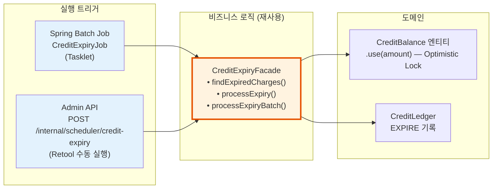

# [Ticket #13b] 크레딧 만료 (Tasklet + Facade)

## 개요
- TDD 참조: tdd.md 섹션 4.1.5
- 선행 티켓: #12b (CreditFulfillment), #2 (JPA 엔티티)
- 크기: S

## 핵심 설계 원칙

1. **비즈니스 로직은 Facade에** — `CreditExpiryFacade`로 만료 로직을 캡슐화. API/Batch 어디서든 재사용 가능.
2. **Tasklet으로 실행** — `@Scheduled` 사용 안 함.
3. **만료는 "주문"이 아니라 "원장 정산"** — OrderFacade를 경유하지 않고 CreditExpiryFacade가 직접 처리.

### 레이어 구조



---

## 작업 내용

### 1. CreditExpiryFacade

```kotlin
@Service
class CreditExpiryFacade(
    private val creditLedgerRepository: CreditLedgerRepository,
    private val creditBalanceRepository: CreditBalanceRepository,
    private val meterRegistry: MeterRegistry,
) {
    private val log = LoggerFactory.getLogger(javaClass)

    companion object {
        const val DEFAULT_BATCH_SIZE = 200
    }

    /** 만료 대상 CHARGE 건 조회 (아직 EXPIRE 처리 안 된 것만) */
    fun findExpiredCharges(batchSize: Int = DEFAULT_BATCH_SIZE): List<CreditLedger> {
        return creditLedgerRepository.findExpiredUnprocessedCharges(
            expiredBefore = LocalDateTime.now(),
            transactionType = CreditTransactionType.CHARGE.name,
            limit = batchSize,
        )
    }

    /** 배치 실행 */
    fun processExpiryBatch(batchSize: Int = DEFAULT_BATCH_SIZE): ExpiryBatchResult {
        val targets = findExpiredCharges(batchSize)
        log.info("[CreditExpiry] 만료 대상 ${targets.size}건 시작")

        var success = 0
        var failed = 0

        for (chargeLedger in targets) {
            try {
                processExpiry(chargeLedger)
                success++
                meterRegistry.counter("scheduler.credit_expiry.success").increment()
            } catch (e: Exception) {
                log.error("[CreditExpiry] 실패: ledger=${chargeLedger.id}", e)
                failed++
                meterRegistry.counter("scheduler.credit_expiry.failure").increment()
            }
        }

        val result = ExpiryBatchResult(total = targets.size, success = success, failed = failed)
        log.info("[CreditExpiry] 완료: $result")
        return result
    }

    /** 단건 만료 처리 */
    @Transactional
    fun processExpiry(chargeLedger: CreditLedger) {
        // 이미 EXPIRE 처리된 건인지 멱등성 체크
        val alreadyExpired = creditLedgerRepository.existsBySourceLedgerIdAndTransactionType(
            sourceLedgerId = chargeLedger.id,
            transactionType = CreditTransactionType.EXPIRE.name,
        )
        if (alreadyExpired) return

        // 잔여 만료 가능 금액 계산 (충전량 - 이미 사용/환불/만료된 양)
        val remainingAmount = calculateRemainingAmount(chargeLedger)
        if (remainingAmount <= 0) return

        // CreditBalance 차감 (엔티티 메서드 — Optimistic Lock)
        val balance = creditBalanceRepository.findByWorkspaceIdAndCreditType(
            chargeLedger.workspaceId, chargeLedger.creditType
        ) ?: return

        balance.use(remainingAmount)  // 엔티티 내부: balance -= amount, 음수면 0으로 floor
        creditBalanceRepository.save(balance)

        // EXPIRE 원장 기록
        creditLedgerRepository.save(CreditLedger(
            workspaceId = chargeLedger.workspaceId,
            creditType = chargeLedger.creditType,
            transactionType = CreditTransactionType.EXPIRE.name,
            amount = -remainingAmount,
            balanceAfter = balance.balance,
            sourceLedgerId = chargeLedger.id,
            description = "크레딧 만료: 충전건 #${chargeLedger.id}, 만료일 ${chargeLedger.expiredAt}",
        ))
    }

    private fun calculateRemainingAmount(chargeLedger: CreditLedger): Int {
        // 해당 충전 건에서 이미 사용/환불/만료된 총량
        val consumed = creditLedgerRepository.sumAmountBySourceLedgerId(chargeLedger.id)
        return chargeLedger.amount + consumed  // amount는 양수(충전), consumed는 음수(사용/환불/만료)
    }
}

data class ExpiryBatchResult(
    val total: Int,
    val success: Int,
    val failed: Int,
)
```

### 2. CreditExpiryTasklet

```kotlin
@Component
class CreditExpiryTasklet(
    private val expiryFacade: CreditExpiryFacade,
    private val featureFlagService: FeatureFlagService,
) : Tasklet {

    private val log = LoggerFactory.getLogger(javaClass)

    override fun execute(contribution: StepContribution, chunkContext: ChunkContext): RepeatStatus {
        val enabled = featureFlagService.getFlag(
            SchedulerFeatureKeys.CreditExpiryEnabled,
            FeatureContext.ALL,
        )
        if (!enabled) {
            log.info("[CreditExpiryTasklet] Feature flag disabled, skipping")
            return RepeatStatus.FINISHED
        }

        val result = expiryFacade.processExpiryBatch()

        chunkContext.stepContext.stepExecution.jobExecution.executionContext.apply {
            putInt("total", result.total)
            putInt("success", result.success)
            putInt("failed", result.failed)
        }

        return RepeatStatus.FINISHED
    }
}
```

### 3. Job 설정 + Admin API

```kotlin
@Configuration
class CreditExpiryJobConfig(
    private val jobBuilderFactory: JobBuilderFactory,
    private val stepBuilderFactory: StepBuilderFactory,
    private val expiryTasklet: CreditExpiryTasklet,
) {
    @Bean
    fun creditExpiryJob(): Job = jobBuilderFactory
        .get("creditExpiryJob")
        .start(creditExpiryStep())
        .build()

    @Bean
    fun creditExpiryStep(): Step = stepBuilderFactory
        .get("creditExpiryStep")
        .tasklet(expiryTasklet)
        .build()
}

// SchedulerController에 추가 (ticket-13a에서 생성)
@PostMapping("/credit-expiry")
fun triggerCreditExpiry(): ResponseEntity<Map<String, Any>> {
    val params = JobParametersBuilder()
        .addLong("timestamp", System.currentTimeMillis())
        .toJobParameters()
    val execution = jobLauncher.run(creditExpiryJob, params)
    return ResponseEntity.accepted().body(mapOf(
        "jobExecutionId" to execution.id,
        "status" to execution.status.name,
    ))
}
```

### 4. Feature Flag

```kotlin
object SchedulerFeatureKeys {
    // #13a에서 정의
    object SubscriptionRenewalEnabled : BooleanFeatureKey(key = "scheduler.renewal-enabled", defaultValue = false)

    // 신규
    object CreditExpiryEnabled : BooleanFeatureKey(key = "scheduler.credit-expiry-enabled", defaultValue = false)
}
```

---

### 그리팅 실제 적용 예시

#### AS-IS (현재)
```
크레딧 만료 처리 없음.
MessagePointChargeLogsOnWorkspace.rest 필드로 잔여량 추적하지만, 만료 자동 차감 미구현.
```

#### TO-BE (리팩토링 후)
```
CreditExpiryTasklet (트리거)
  → CreditExpiryFacade.processExpiryBatch() (재사용 가능)
    → findExpiredCharges() → processExpiry() → CreditBalance.use() + CreditLedger(EXPIRE)

Admin API로도 동일 Facade 호출:
  POST /internal/scheduler/credit-expiry → 같은 Facade
```

#### 향후 확장 예시
- AI 크레딧 만료: `credit_type = AI_EVALUATION`인 건도 동일 Facade가 자동 처리 (코드 변경 없음)

---

### 수정 파일 목록

| 레포 | 파일 경로 | 변경 유형 |
|------|----------|----------|
| greeting_payment-server | application/CreditExpiryFacade.kt | 신규 |
| greeting_payment-server | application/dto/ExpiryBatchResult.kt | 신규 |
| greeting_payment-server | batch/CreditExpiryTasklet.kt | 신규 |
| greeting_payment-server | batch/CreditExpiryJobConfig.kt | 신규 |
| greeting_payment-server | presentation/internal/SchedulerController.kt | 수정 (credit-expiry 엔드포인트 추가) |
| greeting_payment-server | domain/migration/SchedulerFeatureKeys.kt | 수정 (CreditExpiryEnabled 추가) |

## 테스트 케이스

### 정상 케이스
| ID | 테스트명 | Given | When | Then |
|----|---------|-------|------|------|
| TC-01 | 만료 배치 성공 | 만료 도래 CHARGE 5건 | processExpiryBatch() | 5건 EXPIRE, balance 차감 |
| TC-02 | 멱등성 | 이미 EXPIRE 처리된 건 | processExpiry() | 스킵, 중복 EXPIRE 없음 |
| TC-03 | 잔여량 0 | 충전량 전부 사용됨 | processExpiry() | 스킵 (만료할 잔여량 없음) |
| TC-04 | Tasklet 실행 | Feature flag ON | Job 실행 | Facade 호출, 결과 저장 |
| TC-05 | Admin API | - | POST /credit-expiry | 202 Accepted |

### 예외/엣지 케이스
| ID | 테스트명 | Given | When | Then |
|----|---------|-------|------|------|
| TC-E01 | Feature flag OFF | 비활성 | Tasklet 실행 | 스킵 |
| TC-E02 | Optimistic Lock 충돌 | 동시 차감 | processExpiry() | 재시도 or 실패 로그 |
| TC-E03 | 대상 0건 | 만료 도래 없음 | processExpiryBatch() | total=0, 정상 완료 |

## 기대 결과 (AC)
- [ ] `@Scheduled` 미사용. Spring Batch Tasklet으로 실행
- [ ] CreditExpiryFacade가 API/Batch 양쪽에서 재사용 가능
- [ ] 멱등성: sourceLedgerId + EXPIRE 조합으로 중복 방지
- [ ] CreditBalance.use() 엔티티 캡슐화 (Optimistic Lock)
- [ ] Admin API로 수동 실행 가능
- [ ] Feature flag로 on/off 제어
