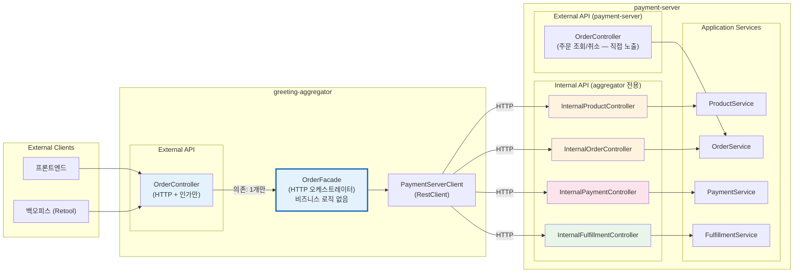
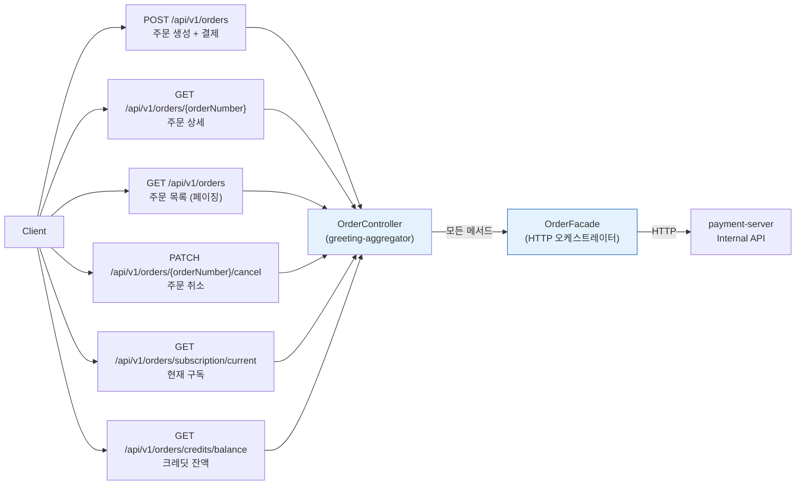
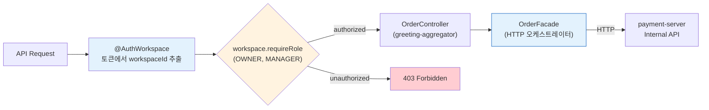
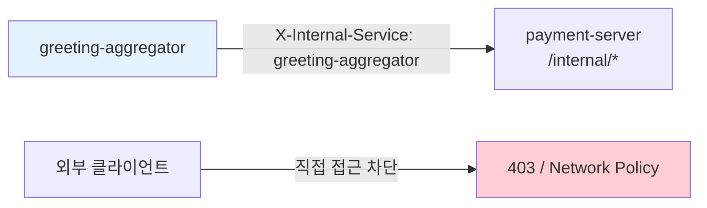

# [Ticket #14] Order API -- External API (greeting-aggregator) + Internal API (payment-server)

## 개요
- TDD 참조: tdd.md 섹션 3.1, 3.2, 4.2.3, 4.4
- 선행 티켓: #8d (OrderFacade in greeting-aggregator), #12a~c (FulfillmentStrategy)
- 크기: L

## 작업 내용

### 설계 원칙

**Aggregator + payment-server 분리 구조**를 적용한다.

- **External API (greeting-aggregator)**: 클라이언트가 호출하는 외부 엔드포인트. OrderController → OrderFacade(HTTP 오케스트레이터).
- **Internal API (payment-server)**: aggregator 전용 내부 엔드포인트. 4개의 InternalController → 각 Application Service.
- OrderFacade는 비즈니스 로직 없이 PaymentServerClient를 통해 Internal API를 순차 호출한다.

### 1. 전체 아키텍처



---

### 2. External API 엔드포인트 (greeting-aggregator)



### 3. Internal API 엔드포인트 (payment-server)

> TDD 섹션 4.2.3 기반

| Method | Path | Controller | Service | Description |
|--------|------|------------|---------|-------------|
| GET | `/internal/products/{code}` | InternalProductController | ProductService | 상품 조회 |
| GET | `/internal/products/{id}/current-price` | InternalProductController | ProductService | 현재 가격 조회 |
| POST | `/internal/orders` | InternalOrderController | OrderService | 주문 생성 |
| POST | `/internal/orders/{id}/start-payment` | InternalOrderController | OrderService | 결제 시작 상태 전이 |
| POST | `/internal/orders/{id}/mark-paid` | InternalOrderController | OrderService | 결제 완료 상태 전이 |
| POST | `/internal/orders/{id}/complete` | InternalOrderController | OrderService | 주문 완료 상태 전이 |
| POST | `/internal/orders/{id}/fail` | InternalOrderController | OrderService | 주문 실패 상태 전이 |
| POST | `/internal/payments/process` | InternalPaymentController | PaymentService | 결제 처리 |
| POST | `/internal/payments/cancel` | InternalPaymentController | PaymentService | 결제 취소 |
| POST | `/internal/fulfillments/execute` | InternalFulfillmentController | FulfillmentStrategy | Fulfillment 실행 |
| GET | `/internal/subscriptions/current` | InternalOrderController | OrderService | 현재 구독 조회 |
| GET | `/internal/credits/balance` | InternalOrderController | OrderService | 크레딧 잔액 조회 |

---

### 4. OrderController 구현 (greeting-aggregator, External API)

```kotlin
// greeting-aggregator/business/presentation/payment/OrderController.kt
package doodlin.greeting.aggregator.business.presentation.payment

import doodlin.greeting.aggregator.business.application.payment.OrderFacade
import doodlin.greeting.aggregator.business.application.payment.client.dto.*
import org.springframework.http.HttpStatus
import org.springframework.http.ResponseEntity
import org.springframework.web.bind.annotation.*

@RestController
@RequestMapping("/api/v1/orders")
class OrderController(
    private val orderFacade: OrderFacade,  // Facade 하나만 의존
) {

    /** 주문 생성 + 결제 처리 */
    @PostMapping
    fun createAndProcessOrder(
        @RequestBody request: CreateOrderApiRequest,
        @AuthWorkspace workspace: WorkspaceAuth,
    ): ResponseEntity<OrderResponse> {
        workspace.requireRole(Role.OWNER, Role.MANAGER)

        val order = orderFacade.createAndProcessOrder(
            CreateOrderRequest(
                workspaceId = workspace.workspaceId,
                productCode = request.productCode,
                orderType = request.orderType,
                billingIntervalMonths = request.billingIntervalMonths,
                idempotencyKey = request.idempotencyKey,
                createdBy = workspace.userId.toString(),
            )
        )
        return ResponseEntity.status(HttpStatus.CREATED).body(order)
    }

    /** 주문 상세 조회 */
    @GetMapping("/{orderNumber}")
    fun getOrder(
        @PathVariable orderNumber: String,
        @AuthWorkspace workspace: WorkspaceAuth,
    ): ResponseEntity<OrderResponse> {
        workspace.requireRole(Role.OWNER, Role.MANAGER)
        val order = orderFacade.getOrderDetail(orderNumber)
        return ResponseEntity.ok(order)
    }

    /** 주문 취소 */
    @PatchMapping("/{orderNumber}/cancel")
    fun cancelOrder(
        @PathVariable orderNumber: String,
        @RequestBody request: CancelOrderApiRequest,
        @AuthWorkspace workspace: WorkspaceAuth,
    ): ResponseEntity<OrderResponse> {
        workspace.requireRole(Role.OWNER, Role.MANAGER)
        val order = orderFacade.cancelOrder(orderNumber, request.reason)
        return ResponseEntity.ok(order)
    }

    /** 현재 활성 구독 조회 */
    @GetMapping("/subscription/current")
    fun getCurrentSubscription(
        @AuthWorkspace workspace: WorkspaceAuth,
    ): ResponseEntity<SubscriptionResponse> {
        workspace.requireRole(Role.OWNER, Role.MANAGER)
        val subscription = orderFacade.getCurrentSubscription(workspace.workspaceId)
        return ResponseEntity.ok(subscription)
    }

    /** 크레딧 잔액 조회 */
    @GetMapping("/credits/balance")
    fun getCreditBalance(
        @AuthWorkspace workspace: WorkspaceAuth,
        @RequestParam(required = false) creditType: String?,
    ): ResponseEntity<CreditBalanceResponse> {
        workspace.requireRole(Role.OWNER, Role.MANAGER)
        val balance = orderFacade.getCreditBalance(workspace.workspaceId, creditType ?: "SMS")
        return ResponseEntity.ok(balance)
    }
}

// === External API Request DTOs ===
data class CreateOrderApiRequest(
    val productCode: String,
    val orderType: String,
    val billingIntervalMonths: Int? = null,
    val quantity: Int = 1,
    val memo: String? = null,
    val idempotencyKey: String? = null,
)

data class CancelOrderApiRequest(
    val reason: String,
)
```

### 5. InternalProductController 구현 (payment-server)

```kotlin
// payment-server/presentation/internal/InternalProductController.kt
package doodlin.greeting.payment.presentation.internal

import doodlin.greeting.payment.application.ProductService
import org.springframework.http.ResponseEntity
import org.springframework.web.bind.annotation.*

@RestController
@RequestMapping("/internal/products")
class InternalProductController(
    private val productService: ProductService,
) {
    @GetMapping("/{code}")
    fun getProduct(@PathVariable code: String): ResponseEntity<ProductResponse> {
        val product = productService.findByCode(code)
        return ResponseEntity.ok(product.toResponse())
    }

    @GetMapping("/{id}/current-price")
    fun getCurrentPrice(
        @PathVariable id: Long,
        @RequestParam(required = false) billingIntervalMonths: Int?,
    ): ResponseEntity<ProductPriceResponse> {
        val price = productService.getCurrentPrice(id, billingIntervalMonths)
        return ResponseEntity.ok(price.toResponse())
    }
}
```

### 6. InternalOrderController 구현 (payment-server)

```kotlin
// payment-server/presentation/internal/InternalOrderController.kt
package doodlin.greeting.payment.presentation.internal

import doodlin.greeting.payment.application.OrderService
import org.springframework.http.ResponseEntity
import org.springframework.web.bind.annotation.*

@RestController
@RequestMapping("/internal/orders")
class InternalOrderController(
    private val orderService: OrderService,
) {
    @PostMapping
    fun createOrder(@RequestBody request: CreateInternalOrderRequest): ResponseEntity<OrderResponse> {
        val order = orderService.createOrder(
            workspaceId = request.workspaceId,
            orderType = OrderType.valueOf(request.orderType),
            productCode = request.productCode,
            productId = request.productId,
            unitPrice = request.unitPrice,
            billingIntervalMonths = request.billingIntervalMonths,
            idempotencyKey = request.idempotencyKey,
        )
        return ResponseEntity.status(201).body(order.toResponse())
    }

    @PostMapping("/{id}/start-payment")
    fun startPayment(@PathVariable id: Long): ResponseEntity<OrderResponse> {
        val order = orderService.startPayment(id)
        return ResponseEntity.ok(order.toResponse())
    }

    @PostMapping("/{id}/mark-paid")
    fun markPaid(@PathVariable id: Long): ResponseEntity<OrderResponse> {
        val order = orderService.markPaid(id)
        return ResponseEntity.ok(order.toResponse())
    }

    @PostMapping("/{id}/complete")
    fun complete(@PathVariable id: Long): ResponseEntity<OrderResponse> {
        val order = orderService.complete(id)
        // Kafka 이벤트 발행은 OrderService.complete() 내부에서 수행
        return ResponseEntity.ok(order.toResponse())
    }

    @PostMapping("/{id}/fail")
    fun fail(
        @PathVariable id: Long,
        @RequestBody request: FailOrderRequest,
    ): ResponseEntity<OrderResponse> {
        val order = orderService.fail(id, request.reason)
        return ResponseEntity.ok(order.toResponse())
    }

    @GetMapping("/{orderNumber}")
    fun getOrder(@PathVariable orderNumber: String): ResponseEntity<OrderResponse> {
        val order = orderService.findByOrderNumber(orderNumber)
        return ResponseEntity.ok(order.toResponse())
    }
}

data class FailOrderRequest(val reason: String)
```

### 7. InternalPaymentController 구현 (payment-server)

```kotlin
// payment-server/presentation/internal/InternalPaymentController.kt
package doodlin.greeting.payment.presentation.internal

import doodlin.greeting.payment.application.PaymentService
import org.springframework.http.ResponseEntity
import org.springframework.web.bind.annotation.*

@RestController
@RequestMapping("/internal/payments")
class InternalPaymentController(
    private val paymentService: PaymentService,
) {
    @PostMapping("/process")
    fun processPayment(@RequestBody request: ProcessPaymentRequest): ResponseEntity<PaymentResponse> {
        val payment = paymentService.processPayment(
            orderId = request.orderId,
            workspaceId = request.workspaceId,
            amount = request.amount,
            orderName = request.orderName,
        )
        return ResponseEntity.ok(payment.toResponse())
    }

    @PostMapping("/cancel")
    fun cancelPayment(@RequestBody request: CancelPaymentRequest): ResponseEntity<PaymentResponse> {
        val payment = paymentService.cancelPayment(
            orderId = request.orderId,
            reason = request.reason,
        )
        return ResponseEntity.ok(payment.toResponse())
    }
}
```

### 8. InternalFulfillmentController 구현 (payment-server)

```kotlin
// payment-server/presentation/internal/InternalFulfillmentController.kt
package doodlin.greeting.payment.presentation.internal

import doodlin.greeting.payment.application.FulfillmentService
import org.springframework.http.ResponseEntity
import org.springframework.web.bind.annotation.*

@RestController
@RequestMapping("/internal/fulfillments")
class InternalFulfillmentController(
    private val fulfillmentService: FulfillmentService,
) {
    @PostMapping("/execute")
    fun executeFulfillment(@RequestBody request: ExecuteFulfillmentRequest): ResponseEntity<FulfillmentResponse> {
        val result = fulfillmentService.execute(
            orderId = request.orderId,
            workspaceId = request.workspaceId,
            productType = request.productType,
            productCode = request.productCode,
        )
        return ResponseEntity.ok(result.toResponse())
    }
}
```

### 9. Internal API Request/Response DTO (payment-server)

```kotlin
// payment-server/presentation/internal/dto/

data class CreateInternalOrderRequest(
    val workspaceId: Int,
    val orderType: String,
    val productCode: String,
    val productId: Long,
    val unitPrice: Int,
    val billingIntervalMonths: Int? = null,
    val idempotencyKey: String? = null,
)

data class ProcessPaymentRequest(
    val orderId: Long,
    val workspaceId: Int,
    val amount: Int,
    val orderName: String,
)

data class CancelPaymentRequest(
    val orderId: Long,
    val reason: String,
)

data class ExecuteFulfillmentRequest(
    val orderId: Long,
    val workspaceId: Int,
    val productType: String,
    val productCode: String,
)

// Response DTOs (Internal API용)
data class ProductResponse(
    val id: Long,
    val code: String,
    val name: String,
    val productType: String,
    val isActive: Boolean,
)

data class ProductPriceResponse(
    val id: Long,
    val productId: Long,
    val price: Int,
    val currency: String,
    val billingIntervalMonths: Int?,
)

data class OrderResponse(
    val id: Long,
    val orderNumber: String,
    val workspaceId: Int,
    val orderType: String,
    val status: String,
    val productType: String,
    val productCode: String,
    val totalAmount: Int,
    val originalAmount: Int,
    val discountAmount: Int,
    val vatAmount: Int,
    val currency: String,
    val createdAt: LocalDateTime,
    val updatedAt: LocalDateTime,
)

data class PaymentResponse(
    val id: Long,
    val orderId: Long,
    val paymentKey: String?,
    val paymentMethod: String,
    val gateway: String,
    val status: String,
    val amount: Int,
    val receiptUrl: String?,
    val approvedAt: LocalDateTime?,
)

data class FulfillmentResponse(
    val orderId: Long,
    val productType: String,
    val success: Boolean,
    val detail: String?,
)

data class SubscriptionResponse(
    val id: Long,
    val workspaceId: Int,
    val productCode: String,
    val status: String,
    val currentPeriodStart: LocalDateTime,
    val currentPeriodEnd: LocalDateTime,
    val autoRenew: Boolean,
    val billingIntervalMonths: Int,
)

data class CreditBalanceResponse(
    val workspaceId: Int,
    val creditType: String,
    val balance: Int,
    val updatedAt: LocalDateTime,
)
```

### 10. 인가 처리 흐름 (External API)



### 11. Internal API 보안



- Internal API는 `X-Internal-Service` 헤더 검증 또는 네트워크 레벨(k8s NetworkPolicy)에서 접근 제한
- 외부 클라이언트는 `/internal/*` 경로에 직접 접근 불가

### 12. 멱등성 보장

```kotlin
// OrderService.createOrder 내부 (payment-server)
fun createOrder(
    workspaceId: Int,
    orderType: OrderType,
    productCode: String,
    productId: Long,
    unitPrice: Int,
    billingIntervalMonths: Int? = null,
    idempotencyKey: String? = null,
): Order {
    // idempotencyKey가 있으면 기존 주문 반환 (중복 생성 방지)
    idempotencyKey?.let { key ->
        orderRepository.findByIdempotencyKey(key)?.let { existing ->
            return existing
        }
    }

    val order = Order(
        orderNumber = OrderNumberGenerator.generate(),
        workspaceId = workspaceId,
        orderType = orderType.name,
        status = "CREATED",
        totalAmount = unitPrice,
        originalAmount = unitPrice,
        currency = "KRW",
        idempotencyKey = idempotencyKey,
    )

    val item = OrderItem(
        orderId = order.id,
        productId = productId,
        productCode = productCode,
        productType = productType,
        quantity = 1,
        unitPrice = unitPrice,
        totalPrice = unitPrice,
    )

    order.addItem(item)
    return orderRepository.save(order)
}
```

---

### 수정 파일 목록

| 레포 | 파일 경로 | 변경 유형 |
|------|----------|----------|
| **greeting-aggregator** | business/presentation/payment/OrderController.kt | 신규 (External API) |
| **greeting-aggregator** | business/presentation/payment/dto/CreateOrderApiRequest.kt | 신규 |
| **greeting-aggregator** | business/presentation/payment/dto/CancelOrderApiRequest.kt | 신규 |
| greeting_payment-server | presentation/internal/InternalProductController.kt | 신규 |
| greeting_payment-server | presentation/internal/InternalOrderController.kt | 신규 |
| greeting_payment-server | presentation/internal/InternalPaymentController.kt | 신규 |
| greeting_payment-server | presentation/internal/InternalFulfillmentController.kt | 신규 |
| greeting_payment-server | presentation/internal/dto/CreateInternalOrderRequest.kt | 신규 |
| greeting_payment-server | presentation/internal/dto/ProcessPaymentRequest.kt | 신규 |
| greeting_payment-server | presentation/internal/dto/CancelPaymentRequest.kt | 신규 |
| greeting_payment-server | presentation/internal/dto/ExecuteFulfillmentRequest.kt | 신규 |
| greeting_payment-server | presentation/internal/dto/FailOrderRequest.kt | 신규 |
| greeting_payment-server | presentation/internal/dto/ProductResponse.kt | 신규 |
| greeting_payment-server | presentation/internal/dto/OrderResponse.kt | 신규 |
| greeting_payment-server | presentation/internal/dto/PaymentResponse.kt | 신규 |
| greeting_payment-server | presentation/internal/dto/FulfillmentResponse.kt | 신규 |
| greeting_payment-server | presentation/internal/dto/SubscriptionResponse.kt | 신규 |
| greeting_payment-server | presentation/internal/dto/CreditBalanceResponse.kt | 신규 |
| greeting_payment-server | presentation/internal/dto/ResponseExtensions.kt | 신규 (toResponse 확장 함수) |
| greeting_payment-server | presentation/external/OrderController.kt | 신규 (주문 조회/취소 직접 노출, 선택사항) |

## 테스트 케이스

### 정상 케이스
| ID | 테스트명 | Given | When | Then |
|----|---------|-------|------|------|
| TC-01 | 구독 주문 생성 (External) | productCode=PLAN_BASIC, orderType=NEW | POST /api/v1/orders (aggregator) | 201 Created, OrderFacade → HTTP → Internal API 체인 |
| TC-02 | 크레딧 구매 (External) | productCode=SMS_PACK_1000, orderType=PURCHASE | POST /api/v1/orders (aggregator) | 201 Created, CreditBalance 증가 |
| TC-03 | 일회성 구매 (External) | productCode=AI_EVAL_SINGLE, orderType=PURCHASE | POST /api/v1/orders (aggregator) | 201 Created, Order COMPLETED |
| TC-04 | 주문 상세 조회 | 기존 주문 존재 | GET /api/v1/orders/{orderNumber} | 200 OK, aggregator → Internal API |
| TC-05 | 주문 취소 | CREATED 상태 | PATCH /api/v1/orders/{orderNumber}/cancel | 200 OK, Order CANCELLED |
| TC-06 | 현재 구독 조회 | ACTIVE 구독 | GET /api/v1/orders/subscription/current | SubscriptionResponse |
| TC-07 | 크레딧 잔액 조회 | SMS 500 | GET /api/v1/orders/credits/balance | CreditBalanceResponse |
| TC-08 | 멱등성 (동일 키) | idempotencyKey="abc-123" | 동일 요청 2회 | 2번째는 기존 주문 반환 |
| TC-09 | Internal API: 상품 조회 | 등록된 상품 | GET /internal/products/{code} | ProductResponse |
| TC-10 | Internal API: 주문 생성 | 정상 요청 | POST /internal/orders | 201 Created, OrderResponse |
| TC-11 | Internal API: 결제 처리 | 정상 주문 | POST /internal/payments/process | PaymentResponse |
| TC-12 | Internal API: Fulfillment | PAID 주문 | POST /internal/fulfillments/execute | FulfillmentResponse |

### 예외/엣지 케이스
| ID | 테스트명 | Given | When | Then |
|----|---------|-------|------|------|
| TC-E01 | 권한 없음 (MEMBER) | MEMBER 역할 | POST /api/v1/orders | 403 Forbidden |
| TC-E02 | 존재하지 않는 상품 | productCode=INVALID | POST /api/v1/orders → HTTP → /internal/products/INVALID | 404 Not Found |
| TC-E03 | 타 workspace 주문 조회 | workspace A 주문을 B가 조회 | GET /api/v1/orders/{orderNumber} | 404 Not Found (격리) |
| TC-E04 | 취소 불가 상태 | COMPLETED 상태 | PATCH .../cancel | 400 Bad Request (상태 전이 위반) |
| TC-E05 | Internal API 외부 접근 차단 | 외부 클라이언트 | GET /internal/products/{code} | 403 Forbidden 또는 네트워크 차단 |
| TC-E06 | payment-server 장애 | 네트워크 오류 | POST /api/v1/orders | 502/503, 에러 핸들링 |

## 그리팅 실제 적용 예시

### AS-IS (현재)
- 플랜 업그레이드: `PaymentController.upgradePlan()` (payment-server) → 내부 서비스 직접 호출. 별도의 `PlanController`, `MessagePointController` 존재하여 상품 유형마다 진입점이 다름.
- SMS 충전: `MessagePointController.chargeMessagePoint()` → 완전히 별개의 결제 흐름.
- 모든 Controller, Facade, Service가 payment-server 내부에 존재.

### TO-BE (리팩토링 후)
- **External API (greeting-aggregator)**: `POST /api/v1/orders { productCode, orderType }` 단일 엔드포인트. OrderController → OrderFacade(HTTP) → PaymentServerClient → Internal API.
- **Internal API (payment-server)**: `/internal/*` 12개 엔드포인트. 각 InternalController → Application Service.
- 클라이언트는 greeting-aggregator만 호출. payment-server Internal API는 aggregator만 접근 가능.

### 향후 확장 예시
- AI 크레딧 충전 API: `POST /api/v1/orders { productCode: "AI_CREDIT_100", orderType: "PURCHASE" }`. External/Internal API 코드 변경 없음.
- 새 Internal API 추가: payment-server에 엔드포인트 추가 + PaymentServerClient에 메서드 추가.

## 기대 결과 (AC)
- [ ] **External API(greeting-aggregator)**: OrderController는 OrderFacade 하나만 의존 (SRP: HTTP 변환 + 인가만)
- [ ] **Internal API(payment-server)**: 4개 InternalController (Product, Order, Payment, Fulfillment) 구현
- [ ] **Internal API 12개 엔드포인트**가 TDD 섹션 4.2.3과 일치
- [ ] OrderFacade(aggregator)가 PaymentServerClient를 통해 Internal API를 HTTP 호출
- [ ] POST /api/v1/orders가 productCode에 따라 FulfillmentStrategy 자동 분기 (payment-server 내부)
- [ ] Internal API는 외부 접근 차단 (X-Internal-Service 헤더 또는 네트워크 정책)
- [ ] OWNER/MANAGER 역할만 External API 접근 가능, workspace 간 데이터 격리 보장
- [ ] idempotencyKey로 중복 주문 생성 방지 (payment-server Internal API 레벨)
- [ ] Kafka 이벤트 발행은 payment-server Internal API(completeOrder) 내부에서만 수행
