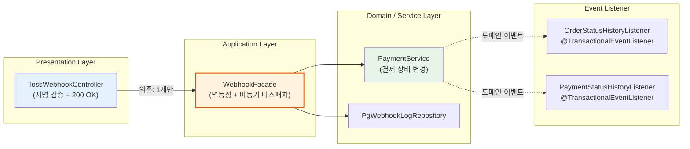
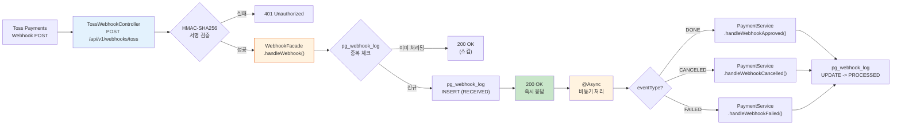
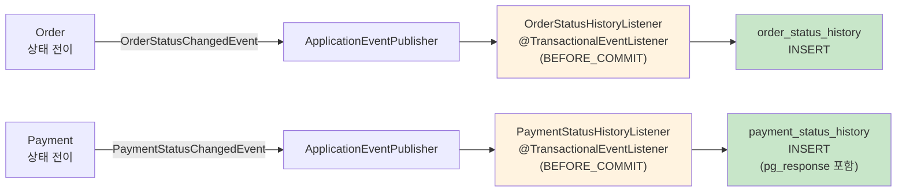

# [Ticket #15] Toss Webhook + 이력 관리

## 개요
- TDD 참조: tdd.md 섹션 3.3, 3.4, 4.1.6
- 선행 티켓: #10 (TossPaymentGateway 구현), #9c (PaymentService)
- 크기: M

## 작업 내용

### 설계 원칙

**Controller -> Facade -> Service 3-Layer SRP 구조**를 적용한다.

- **TossWebhookController**: HTTP 수신, 서명 검증, 즉시 200 OK 응답만 담당. WebhookFacade 하나만 의존.
- **WebhookFacade**: 멱등성 체크 + 비동기 처리 디스패치를 조합.
- **PaymentService**: 실제 결제 상태 변경 도메인 로직.

이력 관리는 도메인 이벤트 리스너(@TransactionalEventListener)로 자동 기록한다.

### 1. Controller -> Facade -> Service 레이어 구조



### 2. Toss Webhook 처리 흐름



### 3. 상태 이력 자동 기록 흐름



### 4. TossWebhookController 구현 (서명 검증 + 200 OK만)

```kotlin
@RestController
@RequestMapping("/api/v1/webhooks")
class TossWebhookController(
    private val webhookFacade: WebhookFacade,  // Facade 하나만 의존
    private val signatureVerifier: TossWebhookSignatureVerifier,
) {
    private val log = LoggerFactory.getLogger(javaClass)

    @PostMapping("/toss")
    fun handleTossWebhook(
        @RequestHeader("Toss-Signature") signature: String,
        @RequestBody rawPayload: String,
    ): ResponseEntity<Void> {
        // 1. 서명 검증 (Controller 책임)
        if (!signatureVerifier.verify(rawPayload, signature)) {
            log.warn("[TossWebhook] Signature verification failed")
            return ResponseEntity.status(HttpStatus.UNAUTHORIZED).build()
        }

        // 2. Facade에 위임 (멱등성 + 비동기 처리)
        webhookFacade.handleWebhook(rawPayload)

        // 3. 즉시 200 OK
        return ResponseEntity.ok().build()
    }
}
```

### 5. WebhookFacade 구현 (멱등성 + 비동기 디스패치)

```kotlin
@Service
class WebhookFacade(
    private val pgWebhookLogRepository: PgWebhookLogRepository,
    private val paymentService: PaymentService,
    private val objectMapper: ObjectMapper,
) {
    private val log = LoggerFactory.getLogger(javaClass)

    /**
     * 웹훅 수신 처리: 멱등성 체크 -> 로그 기록 -> 비동기 처리 디스패치
     */
    fun handleWebhook(rawPayload: String) {
        val accepted = acceptIfNew(rawPayload)
        if (!accepted) {
            log.info("[WebhookFacade] Duplicate webhook, skipping")
            return
        }
        processAsync(rawPayload)
    }

    @Transactional
    fun acceptIfNew(rawPayload: String): Boolean {
        val payload = objectMapper.readTree(rawPayload)
        val paymentKey = payload["paymentKey"].asText()
        val eventType = payload["eventType"]?.asText() ?: payload["status"].asText()

        val exists = pgWebhookLogRepository.existsByProviderAndPaymentKeyAndEventType(
            pgProvider = "TOSS",
            paymentKey = paymentKey,
            eventType = eventType
        )
        if (exists) return false

        val webhookLog = PgWebhookLog(
            pgProvider = "TOSS",
            eventType = eventType,
            paymentKey = paymentKey,
            payload = rawPayload,
            status = "RECEIVED",
            createdAt = LocalDateTime.now()
        )
        pgWebhookLogRepository.save(webhookLog)
        return true
    }

    @Async("webhookTaskExecutor")
    @Transactional
    fun processAsync(rawPayload: String) {
        val payload = objectMapper.readTree(rawPayload)
        val paymentKey = payload["paymentKey"].asText()
        val eventType = payload["eventType"]?.asText() ?: payload["status"].asText()

        try {
            when (eventType) {
                "DONE" -> paymentService.handleWebhookApproved(paymentKey, rawPayload)
                "CANCELED" -> paymentService.handleWebhookCancelled(paymentKey, rawPayload)
                "FAILED", "ABORTED", "EXPIRED" -> paymentService.handleWebhookFailed(paymentKey, rawPayload)
                else -> {
                    log.info("[WebhookFacade] Ignoring event type: $eventType")
                    updateWebhookStatus(paymentKey, eventType, "IGNORED")
                    return
                }
            }
            updateWebhookStatus(paymentKey, eventType, "PROCESSED")
        } catch (e: Exception) {
            log.error("[WebhookFacade] Processing failed: paymentKey=$paymentKey, event=$eventType", e)
            updateWebhookStatus(paymentKey, eventType, "FAILED", e.message)
        }
    }

    private fun updateWebhookStatus(
        paymentKey: String,
        eventType: String,
        status: String,
        errorMessage: String? = null,
    ) {
        pgWebhookLogRepository.updateStatus(
            pgProvider = "TOSS",
            paymentKey = paymentKey,
            eventType = eventType,
            status = status,
            processedAt = LocalDateTime.now(),
            errorMessage = errorMessage
        )
    }
}
```

### 6. 서명 검증 (HMAC-SHA256)

```kotlin
@Component
class TossWebhookSignatureVerifier(
    @Value("\${toss.webhook.secret-key}") private val secretKey: String,
) {

    fun verify(payload: String, signature: String): Boolean {
        val mac = Mac.getInstance("HmacSHA256")
        val secretKeySpec = SecretKeySpec(secretKey.toByteArray(Charsets.UTF_8), "HmacSHA256")
        mac.init(secretKeySpec)

        val expectedSignature = Base64.getEncoder().encodeToString(
            mac.doFinal(payload.toByteArray(Charsets.UTF_8))
        )

        return MessageDigest.isEqual(
            expectedSignature.toByteArray(Charsets.UTF_8),
            signature.toByteArray(Charsets.UTF_8)
        )
    }
}
```

### 7. 도메인 이벤트 정의

```kotlin
// Order 상태 변경 이벤트
data class OrderStatusChangedEvent(
    val orderId: Long,
    val fromStatus: String?,
    val toStatus: String,
    val changedBy: String?,
    val reason: String?,
)

// Payment 상태 변경 이벤트
data class PaymentStatusChangedEvent(
    val paymentId: Long,
    val fromStatus: String?,
    val toStatus: String,
    val pgResponse: String?,  // PG 원본 응답 JSON
)
```

### 8. Order 엔티티 -- 상태 변경 시 이벤트 발행

```kotlin
@Entity
@Table(name = "`order`")
class Order(
    // ... 필드
) : BaseEntity() {

    @Transient
    private val domainEvents = mutableListOf<Any>()

    fun getDomainEvents(): List<Any> = domainEvents.toList()
    fun clearDomainEvents() = domainEvents.clear()

    fun transitionTo(newStatus: String, changedBy: String? = null, reason: String? = null) {
        val allowed = OrderStatus.allowedTransitions[this.status]
            ?: throw IllegalStateException("No transitions defined for status=$status")
        require(newStatus in allowed) {
            "Invalid transition: $status -> $newStatus"
        }

        val event = OrderStatusChangedEvent(
            orderId = this.id,
            fromStatus = this.status,
            toStatus = newStatus,
            changedBy = changedBy,
            reason = reason,
        )
        this.status = newStatus
        domainEvents.add(event)
    }

    fun complete() = transitionTo("COMPLETED", changedBy = "SYSTEM")
    fun fail() = transitionTo("PAYMENT_FAILED", changedBy = "SYSTEM")
    fun cancel(cancelledBy: String, reason: String) = transitionTo("CANCELLED", changedBy = cancelledBy, reason = reason)
}
```

### 9. 이력 리스너 구현

```kotlin
@Component
class OrderStatusHistoryListener(
    private val orderStatusHistoryRepository: OrderStatusHistoryRepository,
) {

    @TransactionalEventListener(phase = TransactionPhase.BEFORE_COMMIT)
    fun onOrderStatusChanged(event: OrderStatusChangedEvent) {
        val history = OrderStatusHistory(
            orderId = event.orderId,
            fromStatus = event.fromStatus,
            toStatus = event.toStatus,
            changedBy = event.changedBy,
            reason = event.reason,
            createdAt = LocalDateTime.now()
        )
        orderStatusHistoryRepository.save(history)
    }
}

@Component
class PaymentStatusHistoryListener(
    private val paymentStatusHistoryRepository: PaymentStatusHistoryRepository,
) {

    @TransactionalEventListener(phase = TransactionPhase.BEFORE_COMMIT)
    fun onPaymentStatusChanged(event: PaymentStatusChangedEvent) {
        val history = PaymentStatusHistory(
            paymentId = event.paymentId,
            fromStatus = event.fromStatus,
            toStatus = event.toStatus,
            pgResponse = event.pgResponse,
            createdAt = LocalDateTime.now()
        )
        paymentStatusHistoryRepository.save(history)
    }
}
```

### 10. 도메인 이벤트 발행 -- OrderService에서 ApplicationEventPublisher 사용

```kotlin
/**
 * OrderService는 Order BC만 담당한다.
 * 상태 전이 시 도메인 이벤트를 발행하며, 이를 @TransactionalEventListener가 수신하여 이력을 기록한다.
 * 결제/Fulfillment 오케스트레이션은 OrderFacade(#8d)가 수행한다.
 */
@Service
class OrderService(
    private val orderRepository: OrderRepository,
    private val eventPublisher: ApplicationEventPublisher,
    // ... 기존 의존성 (OrderStatusHistoryRepository, SubscriptionRepository(read), CreditBalanceRepository(read))
) {
    @Transactional
    fun complete(order: Order): Order {
        val prev = order.status
        order.complete()

        // 도메인 이벤트 발행 (트랜잭션 내부 → @TransactionalEventListener가 이력 저장)
        order.getDomainEvents().forEach { event ->
            eventPublisher.publishEvent(event)
        }
        order.clearDomainEvents()
        return orderRepository.save(order)
    }
}
```

### 11. Async TaskExecutor 설정

```kotlin
@Configuration
@EnableAsync
class AsyncConfig {

    @Bean("webhookTaskExecutor")
    fun webhookTaskExecutor(): TaskExecutor {
        val executor = ThreadPoolTaskExecutor()
        executor.corePoolSize = 2
        executor.maxPoolSize = 5
        executor.queueCapacity = 100
        executor.setThreadNamePrefix("webhook-")
        executor.setRejectedExecutionHandler(ThreadPoolExecutor.CallerRunsPolicy())
        executor.initialize()
        return executor
    }
}
```

### 수정 파일 목록

| 레포 | 파일 경로 | 변경 유형 |
|------|----------|----------|
| greeting_payment-server | presentation/webhook/TossWebhookController.kt | 신규 |
| greeting_payment-server | application/WebhookFacade.kt | 신규 |
| greeting_payment-server | infrastructure/pg/TossWebhookSignatureVerifier.kt | 신규 |
| greeting_payment-server | domain/order/event/OrderStatusChangedEvent.kt | 신규 |
| greeting_payment-server | domain/payment/event/PaymentStatusChangedEvent.kt | 신규 |
| greeting_payment-server | infrastructure/event/OrderStatusHistoryListener.kt | 신규 |
| greeting_payment-server | infrastructure/event/PaymentStatusHistoryListener.kt | 신규 |
| greeting_payment-server | domain/order/Order.kt | 수정 (transitionTo + domainEvents 추가) |
| greeting_payment-server | domain/payment/Payment.kt | 수정 (transitionTo + domainEvents 추가) |
| greeting_payment-server | application/OrderService.kt | 수정 (도메인 이벤트 발행 추가) |
| greeting_payment-server | application/PaymentService.kt | 수정 (handleWebhookApproved/Cancelled/Failed 추가) |
| greeting_payment-server | config/AsyncConfig.kt | 신규 |

## 테스트 케이스

### 정상 케이스
| ID | 테스트명 | Given | When | Then |
|----|---------|-------|------|------|
| TC-01 | Webhook DONE 처리 | 유효 서명 + DONE 이벤트 | POST /api/v1/webhooks/toss | 200 OK, Payment APPROVED, pg_webhook_log PROCESSED |
| TC-02 | Webhook CANCELED 처리 | 유효 서명 + CANCELED 이벤트 | POST /api/v1/webhooks/toss | 200 OK, Payment CANCELLED |
| TC-03 | Order 상태 이력 기록 | Order CREATED -> PENDING_PAYMENT | 상태 전이 | order_status_history에 from=CREATED, to=PENDING_PAYMENT |
| TC-04 | Payment 이력 + PG 응답 | Payment REQUESTED -> APPROVED | PG 승인 | payment_status_history에 pg_response JSON 포함 |
| TC-05 | 전체 상태 이력 추적 | Order 전체 라이프사이클 | CREATED->PENDING->PAID->COMPLETED | 4건의 order_status_history |

### 예외/엣지 케이스
| ID | 테스트명 | Given | When | Then |
|----|---------|-------|------|------|
| TC-E01 | 서명 검증 실패 | 잘못된 Toss-Signature | POST /api/v1/webhooks/toss | 401 Unauthorized |
| TC-E02 | 중복 웹훅 (멱등성) | 동일 paymentKey + eventType 이미 처리 | 동일 웹훅 재전송 | 200 OK, 처리 스킵, 중복 INSERT 없음 |
| TC-E03 | 비동기 처리 실패 | 수신 성공, 비동기 중 에러 | processAsync 실패 | pg_webhook_log FAILED + errorMessage |
| TC-E04 | 알 수 없는 eventType | eventType="UNKNOWN" | POST /api/v1/webhooks/toss | 200 OK, pg_webhook_log IGNORED |
| TC-E05 | timing-safe 서명 비교 | 타이밍 공격 시도 | 서명 비교 | MessageDigest.isEqual 사용 |

## 그리팅 실제 적용 예시

### AS-IS (현재)
- 웹훅: Toss `confirmPayment` 결과를 직접 `PaymentLogsOnWorkspace`(MongoDB)에 저장. 별도의 웹훅 수신 엔드포인트 없이 결제 승인 응답을 직접 처리. 멱등성 보장 없음 (중복 결제 리스크).
- 이력 관리: 결제 이력은 MongoDB `PaymentLogsOnGroup`, SMS 이력은 `MessagePointLogsOnWorkspace`, 플랜 변경 이력은 `User_planlogsonbackoffice`에 분산.
- Controller가 Service를 직접 호출하여 웹훅 수신 + 멱등성 + 비동기 처리가 한 메서드에 혼재.

### TO-BE (리팩토링 후)
- **TossWebhookController -> WebhookFacade -> PaymentService** 3-Layer. Controller는 서명 검증 + 200 OK만. Facade가 멱등성 + 비동기 디스패치. Service가 결제 상태 변경.
- 이력 관리: @TransactionalEventListener로 상태 전이마다 자동 기록. PG 원본 응답도 payment_status_history에 보존.

### 향후 확장 예시
- 다른 PG 웹훅 추가: `KcpWebhookController`를 신규 생성하고 별도의 `KcpWebhookFacade`를 만들되, 동일한 `PaymentService` 메서드 호출. SRP 유지.
- 감사 로그 강화: `OrderStatusHistory`에 이미 changedBy, reason이 기록되므로 백오피스 감사 페이지 별도 테이블 불필요.

## 기대 결과 (AC)
- [ ] **TossWebhookController는 WebhookFacade 하나만 의존** (SRP: 서명 검증 + 200 OK만)
- [ ] **WebhookFacade가 멱등성 체크 + 비동기 처리 디스패치** 조합 담당
- [ ] **PaymentService는 순수 결제 상태 변경 로직**만 담당
- [ ] HMAC-SHA256 서명 검증 후 pg_webhook_log에 RECEIVED 기록, 즉시 200 OK
- [ ] pg_webhook_log의 UNIQUE(pg_provider, payment_key, event_type)으로 멱등성 보장
- [ ] Order 상태 전이마다 order_status_history 자동 기록 (@TransactionalEventListener)
- [ ] Payment 상태 전이마다 payment_status_history 자동 기록 (pg_response 포함)
- [ ] 비동기 처리 실패 시 pg_webhook_log에 FAILED + errorMessage 기록
