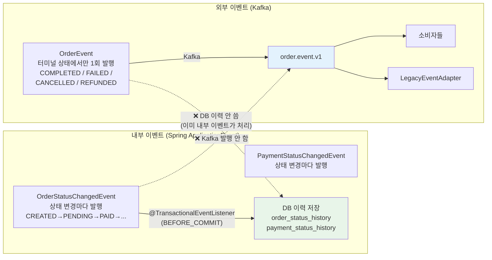
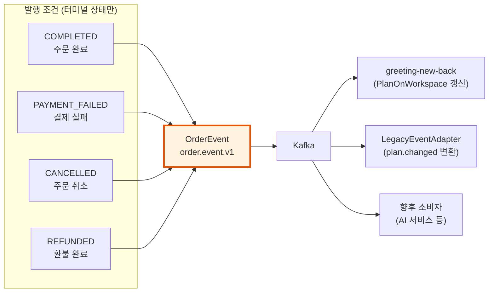
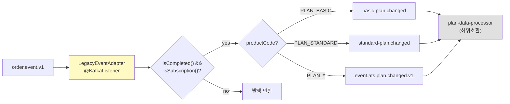

# [Ticket #16] Kafka 이벤트 (OrderEvent 단일 이벤트) + 레거시 어댑터

## 개요
- TDD 참조: tdd.md 섹션 5.2, 8.3
- 선행 티켓: #8d (OrderFacade), #15 (이력 관리)
- 크기: M

## 핵심 설계 원칙

### 이벤트 2종 분리: 내부 vs 외부



| 구분 | 내부 이벤트 (#15) | 외부 이벤트 (#16, 이 티켓) |
|------|------------------|----------------------|
| 대상 | Spring ApplicationEvent | Kafka |
| 발행 시점 | **모든 상태 변경마다** | **터미널 상태에서만 1회** |
| 용도 | DB 이력 저장 (audit) | 외부 소비자 알림 |
| 순서 보장 | 불필요 (동일 트랜잭션 내) | **보장됨 (1회만 발행)** |
| 토픽 | 없음 (Spring 내부) | `order.event.v1` |

---

## 작업 내용

### 1. OrderEvent — 단일 Kafka 이벤트

**터미널 상태에서만 1회 발행.** 페이로드에 소비자가 필요한 모든 정보를 포함.



### 2. OrderEvent 스키마

```kotlin
/**
 * 외부 Kafka 이벤트. 터미널 상태에서 1회만 발행.
 * 소비자는 status + orderType + productType + productCode 조합으로 처리를 분기한다.
 */
data class OrderEvent(
    // 이벤트 메타
    val eventId: String = UUID.randomUUID().toString(),
    val version: String = "v1",
    val timestamp: LocalDateTime = LocalDateTime.now(),

    // Order (누가, 무엇을, 어떻게)
    val orderNumber: String,
    val workspaceId: Int,
    val orderType: String,           // NEW, RENEWAL, UPGRADE, DOWNGRADE, PURCHASE, REFUND
    val status: String,              // COMPLETED, PAYMENT_FAILED, CANCELLED, REFUNDED

    // Product (어떤 상품)
    val productCode: String,         // PLAN_BASIC, SMS_PACK_1000, AI_CREDIT_100
    val productType: String,         // SUBSCRIPTION, CONSUMABLE, ONE_TIME
    val productName: String,

    // 금액
    val totalAmount: Int,
    val currency: String,

    // Fulfillment 결과 스냅샷 (해당 유형만 non-null)
    val subscription: SubscriptionSnapshot?,
    val credit: CreditSnapshot?,
) {
    data class SubscriptionSnapshot(
        val subscriptionId: Long,
        val subscriptionStatus: String,  // ACTIVE, CANCELLED, EXPIRED
        val periodStart: LocalDateTime,
        val periodEnd: LocalDateTime,
        val billingIntervalMonths: Int,
    )

    data class CreditSnapshot(
        val creditType: String,          // SMS, AI_EVALUATION
        val chargedAmount: Int,
        val balanceAfter: Int,
    )

    /** 소비자 편의 메서드 */
    fun isSubscription(): Boolean = productType == "SUBSCRIPTION"
    fun isCredit(): Boolean = productType == "CONSUMABLE"
    fun isOneTime(): Boolean = productType == "ONE_TIME"
    fun isCompleted(): Boolean = status == "COMPLETED"
    fun isFailed(): Boolean = status == "PAYMENT_FAILED"
}
```

### 3. OrderEvent 발행 — OrderFacade에서 호출

```kotlin
/**
 * 터미널 상태에서만 발행. 중간 상태(PENDING_PAYMENT, PAID)에서는 발행하지 않는다.
 */
@Component
class OrderEventPublisher(
    private val kafkaTemplate: KafkaTemplate<String, String>,
    private val objectMapper: ObjectMapper,
) {
    private val log = LoggerFactory.getLogger(javaClass)

    companion object {
        const val TOPIC = "order.event.v1"

        /** Kafka 발행 대상 터미널 상태 */
        val PUBLISHABLE_STATUSES = setOf("COMPLETED", "PAYMENT_FAILED", "CANCELLED", "REFUNDED")
    }

    fun publish(event: OrderEvent) {
        require(event.status in PUBLISHABLE_STATUSES) {
            "OrderEvent는 터미널 상태에서만 발행: status=${event.status}"
        }

        val key = event.workspaceId.toString()  // 파티션 키 = workspace → 동일 workspace 순서 보장
        val payload = objectMapper.writeValueAsString(event)

        kafkaTemplate.send(TOPIC, key, payload)
            .whenComplete { _, ex ->
                if (ex != null) {
                    log.error("[OrderEvent] 발행 실패: orderNumber=${event.orderNumber}, status=${event.status}", ex)
                } else {
                    log.info("[OrderEvent] 발행: orderNumber=${event.orderNumber}, status=${event.status}, productCode=${event.productCode}")
                }
            }
    }
}
```

### 4. OrderFacade에서의 발행 지점

```kotlin
// OrderFacade.processOrder() — COMPLETED일 때만
fun processOrder(order: Order): Order {
    // ... 결제 + Fulfillment ...
    orderService.complete(order)

    // 터미널 상태 → Kafka 발행
    orderEventPublisher.publish(OrderEvent.from(order, subscription, creditBalance))
    return order
}

// OrderFacade.cancelOrder() — CANCELLED일 때만
fun cancelOrder(orderNumber: String, reason: String?): Order {
    val order = orderService.cancel(...)

    // 터미널 상태 → Kafka 발행
    orderEventPublisher.publish(OrderEvent.from(order))
    return order
}

// compensate() — PAYMENT_FAILED일 때만
private fun compensate(order: Order, reason: String) {
    // ...
    orderService.fail(order, reason)

    // 터미널 상태 → Kafka 발행
    orderEventPublisher.publish(OrderEvent.from(order))
}
```

### 5. 소비자 처리 패턴

```kotlin
/** 소비자는 페이로드의 status + productType + orderType 조합으로 분기 */
@KafkaListener(topics = ["order.event.v1"])
fun handleOrderEvent(event: OrderEvent) {
    when {
        // 구독 완료 → PlanOnWorkspace 갱신
        event.isCompleted() && event.isSubscription() -> {
            updatePlanOnWorkspace(event.workspaceId, event.subscription!!)
        }
        // 구독 실패 → 만료 처리
        event.isFailed() && event.isSubscription() -> {
            handleSubscriptionFailure(event.workspaceId)
        }
        // 크레딧 충전 완료 → 로깅만
        event.isCompleted() && event.isCredit() -> {
            log.info("크레딧 충전: workspace=${event.workspaceId}, ${event.credit}")
        }
        // 그 외 → 무시 (향후 확장 시 추가)
    }
}
```

### 6. 레거시 어댑터



```kotlin
@Component
class LegacyEventAdapter(
    private val kafkaTemplate: KafkaTemplate<String, String>,
    private val featureFlagService: FeatureFlagService,
) {
    @KafkaListener(topics = ["order.event.v1"], groupId = "legacy-adapter")
    fun adapt(event: OrderEvent) {
        val enabled = featureFlagService.getFlag(
            LegacyFeatureKeys.EventAdapterEnabled, FeatureContext.ALL
        )
        if (!enabled) return

        // 구독 완료 이벤트만 레거시 변환
        if (!event.isCompleted() || !event.isSubscription()) return

        val workspaceId = event.workspaceId.toString()

        // plan.changed 토픽 (공통)
        kafkaTemplate.send("event.ats.plan.changed.v1", workspaceId,
            """{"workspaceId":${event.workspaceId},"plan":"${event.productCode}"}""")

        // 플랜별 토픽 (plan-data-processor용)
        when (event.productCode) {
            "PLAN_BASIC" -> kafkaTemplate.send("basic-plan.changed", workspaceId,
                """{"workspaceId":${event.workspaceId}}""")
            "PLAN_STANDARD" -> kafkaTemplate.send("standard-plan.changed", workspaceId,
                """{"workspaceId":${event.workspaceId}}""")
        }
    }
}
```

---

### 그리팅 실제 적용 예시

#### AS-IS (현재)
```
PlanServiceImpl.upgradePlan()
  → PlanDataProcessCommand.PlanChanged 이벤트 발행
  → PlanDataProcessCommand.BasicPlanProcess 이벤트 발행
  → PlanDataProcessCommand.StandardPlanProcess 이벤트 발행
  (상품별로 별도 이벤트, 3~4개 발행, 순서 보장 없음)
```

#### TO-BE (리팩토링 후)
```
OrderFacade.processOrder()
  → orderService.complete(order)
  → orderEventPublisher.publish(OrderEvent)  ← 터미널 상태에서 1회만

  OrderEvent 페이로드:
    status: COMPLETED
    orderType: UPGRADE
    productCode: PLAN_STANDARD
    productType: SUBSCRIPTION
    subscription: { status: ACTIVE, periodEnd: ... }

  소비자가 페이로드로 분기:
    greeting-new-back: "COMPLETED + SUBSCRIPTION → PlanOnWorkspace 갱신"
    LegacyAdapter: "PLAN_STANDARD → standard-plan.changed 발행"
```

#### 향후 확장 예시
- AI 크레딧 충전 이벤트: 동일 `OrderEvent`에 `productType=CONSUMABLE`, `credit={AI_EVALUATION, 100}` 포함. 새 이벤트 타입 불필요.

---

### 수정 파일 목록

| 레포 | 파일 경로 | 변경 유형 |
|------|----------|----------|
| greeting_payment-server | domain/event/OrderEvent.kt | 신규 |
| greeting_payment-server | infrastructure/event/OrderEventPublisher.kt | 신규 |
| greeting_payment-server | infrastructure/event/LegacyEventAdapter.kt | 신규 |
| greeting_payment-server | infrastructure/event/LegacyFeatureKeys.kt | 신규 |
| greeting_payment-server | application/OrderFacade.kt | 수정 (발행 지점 추가) |
| greeting-topic | environments/production | 수정 (order.event.v1 토픽 추가) |
| greeting-db-schema | migration | 신규 (legacy.event-adapter-enabled Flag INSERT) |

## 테스트 케이스

### 정상 케이스
| ID | 테스트명 | Given | When | Then |
|----|---------|-------|------|------|
| TC-01 | COMPLETED → 이벤트 발행 | Order COMPLETED | publish() | order.event.v1 토픽에 1건 |
| TC-02 | CANCELLED → 이벤트 발행 | Order CANCELLED | publish() | order.event.v1 토픽에 1건 |
| TC-03 | 레거시 어댑터: PLAN_BASIC | COMPLETED + SUBSCRIPTION + PLAN_BASIC | adapt() | basic-plan.changed 발행 |
| TC-04 | 레거시 어댑터: SMS 팩 무시 | COMPLETED + CONSUMABLE + SMS_PACK_1000 | adapt() | 레거시 토픽 발행 안 함 |
| TC-05 | 소비자 페이로드 분기 | OrderEvent(COMPLETED, SUBSCRIPTION) | handleOrderEvent() | PlanOnWorkspace 갱신 |

### 예외/엣지 케이스
| ID | 테스트명 | Given | When | Then |
|----|---------|-------|------|------|
| TC-E01 | 중간 상태 발행 시도 | status=PAID | publish() | IllegalArgumentException (터미널만 허용) |
| TC-E02 | 레거시 어댑터 Flag OFF | 비활성 | adapt() | 레거시 토픽 발행 안 함 |
| TC-E03 | Kafka 발행 실패 | Kafka 장애 | publish() | 에러 로그 (서비스 중단 없음) |

## 기대 결과 (AC)
- [ ] `OrderEvent` 단일 이벤트로 모든 상품 유형/상태를 커버
- [ ] **터미널 상태(COMPLETED/FAILED/CANCELLED/REFUNDED)에서만** 1회 발행
- [ ] 중간 상태(PENDING_PAYMENT, PAID)에서는 Kafka 발행 없음 (순서 문제 원천 차단)
- [ ] 내부 이력(#15)은 Spring Event로 DB에만 기록 (Kafka 무관)
- [ ] 소비자는 페이로드의 status + productType + productCode로 분기
- [ ] 레거시 어댑터가 plan.changed / basic-plan.changed / standard-plan.changed로 변환 발행
- [ ] Feature flag로 레거시 어댑터 on/off 제어
