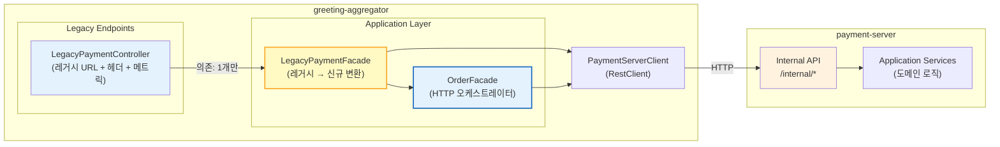
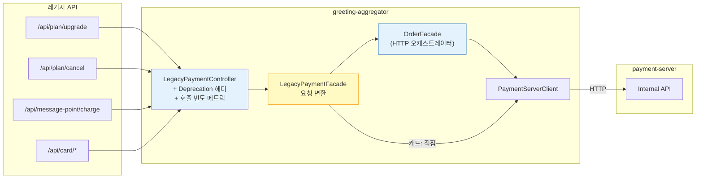
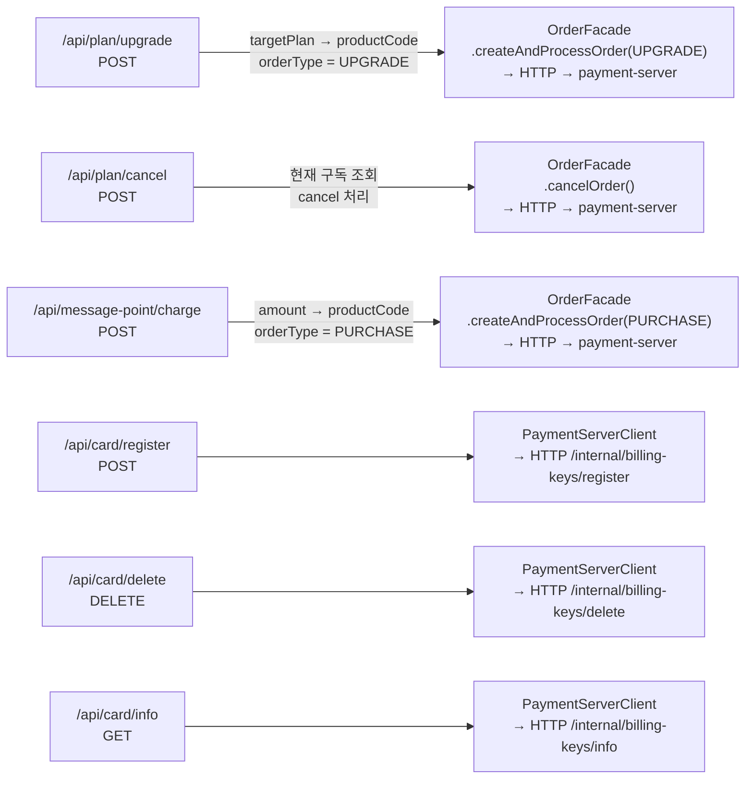

# [Ticket #17] 기존 API 하위호환 어댑터 (greeting-aggregator)

## 개요
- TDD 참조: tdd.md 섹션 3.1, 5.1
- 선행 티켓: #14 (Order API — External + Internal), #8d (OrderFacade in greeting-aggregator)
- 크기: M
- **레포: greeting-aggregator** (기존 greeting_payment-server에서 변경)

## 작업 내용

### 설계 원칙

**레거시 엔드포인트가 greeting-aggregator를 경유하여 OrderFacade(HTTP 오케스트레이터)를 호출한다.**

- **LegacyPaymentController (greeting-aggregator)**: 레거시 URL 매핑, Deprecation 헤더 추가, 호출 빈도 메트릭만 담당. LegacyPaymentFacade 하나만 의존.
- **LegacyPaymentFacade (greeting-aggregator)**: 레거시 요청을 OrderFacade 호출로 변환. 플랜/SMS → productCode 매핑.
- **OrderFacade (greeting-aggregator)**: HTTP 오케스트레이터. payment-server Internal API를 호출.
- **BillingKeyService 호출**: PaymentServerClient를 통해 payment-server Internal API로 라우팅.

### 1. 전체 레이어 구조



### 2. 레거시 → 신규 라우팅 흐름



### 3. 엔드포인트 매핑 상세



### 4. LegacyPaymentController 구현 (greeting-aggregator)

```kotlin
// greeting-aggregator/business/presentation/payment/legacy/LegacyPaymentController.kt
package doodlin.greeting.aggregator.business.presentation.payment.legacy

import doodlin.greeting.aggregator.business.application.payment.LegacyPaymentFacade
import io.micrometer.core.instrument.MeterRegistry
import jakarta.servlet.http.HttpServletResponse
import org.slf4j.LoggerFactory
import org.springframework.http.ResponseEntity
import org.springframework.web.bind.annotation.*

@RestController
@RequestMapping("/api")
class LegacyPaymentController(
    private val legacyPaymentFacade: LegacyPaymentFacade,  // Facade 하나만 의존
    private val meterRegistry: MeterRegistry,
) {
    private val log = LoggerFactory.getLogger(javaClass)

    // ============================================
    // 플랜 관련
    // ============================================

    @PostMapping("/plan/upgrade")
    fun upgradePlan(
        @RequestBody request: LegacyUpgradePlanRequest,
        @AuthWorkspace workspace: WorkspaceAuth,
        response: HttpServletResponse,
    ): ResponseEntity<LegacyPlanResponse> {
        trackLegacyCall("plan.upgrade")
        addDeprecationHeaders(response)

        val result = legacyPaymentFacade.upgradePlan(
            workspaceId = workspace.workspaceId,
            targetPlan = request.targetPlan,
            userId = workspace.userId.toString()
        )
        return ResponseEntity.ok(result)
    }

    @PostMapping("/plan/cancel")
    fun cancelPlan(
        @RequestBody request: LegacyCancelPlanRequest,
        @AuthWorkspace workspace: WorkspaceAuth,
        response: HttpServletResponse,
    ): ResponseEntity<LegacyPlanResponse> {
        trackLegacyCall("plan.cancel")
        addDeprecationHeaders(response)

        val result = legacyPaymentFacade.cancelPlan(
            workspaceId = workspace.workspaceId,
            reason = request.reason ?: "사용자 해지 요청",
            userId = workspace.userId.toString()
        )
        return ResponseEntity.ok(result)
    }

    // ============================================
    // SMS 포인트 관련
    // ============================================

    @PostMapping("/message-point/charge")
    fun chargeMessagePoint(
        @RequestBody request: LegacyChargePointRequest,
        @AuthWorkspace workspace: WorkspaceAuth,
        response: HttpServletResponse,
    ): ResponseEntity<LegacyPointResponse> {
        trackLegacyCall("message-point.charge")
        addDeprecationHeaders(response)

        val result = legacyPaymentFacade.chargeMessagePoint(
            workspaceId = workspace.workspaceId,
            amount = request.amount,
            userId = workspace.userId.toString()
        )
        return ResponseEntity.ok(result)
    }

    // ============================================
    // 카드(빌링키) 관련
    // ============================================

    @PostMapping("/card/register")
    fun registerCard(
        @RequestBody request: LegacyRegisterCardRequest,
        @AuthWorkspace workspace: WorkspaceAuth,
        response: HttpServletResponse,
    ): ResponseEntity<LegacyCardResponse> {
        trackLegacyCall("card.register")
        addDeprecationHeaders(response)

        val result = legacyPaymentFacade.registerCard(
            workspaceId = workspace.workspaceId,
            authKey = request.authKey,
            customerKey = request.customerKey
        )
        return ResponseEntity.ok(result)
    }

    @DeleteMapping("/card/delete")
    fun deleteCard(
        @AuthWorkspace workspace: WorkspaceAuth,
        response: HttpServletResponse,
    ): ResponseEntity<Void> {
        trackLegacyCall("card.delete")
        addDeprecationHeaders(response)

        legacyPaymentFacade.deleteCard(workspace.workspaceId)
        return ResponseEntity.ok().build()
    }

    @GetMapping("/card/info")
    fun getCardInfo(
        @AuthWorkspace workspace: WorkspaceAuth,
        response: HttpServletResponse,
    ): ResponseEntity<LegacyCardResponse> {
        trackLegacyCall("card.info")
        addDeprecationHeaders(response)

        val result = legacyPaymentFacade.getCardInfo(workspace.workspaceId)
        return ResponseEntity.ok(result)
    }

    // ============================================
    // 공통 유틸 (Controller 책임)
    // ============================================

    private fun addDeprecationHeaders(response: HttpServletResponse) {
        response.setHeader("Deprecation", "true")
        response.setHeader("Sunset", "2026-09-01")
        response.setHeader("Link", "</api/v1/orders>; rel=\"successor-version\"")
    }

    private fun trackLegacyCall(endpoint: String) {
        meterRegistry.counter("legacy.api.calls", "endpoint", endpoint).increment()
        log.info("[LegacyAPI] Call to deprecated endpoint: $endpoint")
    }
}
```

### 5. LegacyPaymentFacade 구현 (greeting-aggregator)

```kotlin
// greeting-aggregator/business/application/payment/LegacyPaymentFacade.kt
package doodlin.greeting.aggregator.business.application.payment

import doodlin.greeting.aggregator.business.application.payment.client.PaymentServerClient
import doodlin.greeting.aggregator.business.application.payment.client.dto.*
import org.springframework.stereotype.Service

/**
 * 레거시 요청을 OrderFacade(HTTP 오케스트레이터) 호출로 변환.
 * greeting-aggregator에 위치.
 */
@Service
class LegacyPaymentFacade(
    private val orderFacade: OrderFacade,
    private val paymentServerClient: PaymentServerClient,
    private val legacyResponseConverter: LegacyResponseConverter,
) {

    fun upgradePlan(workspaceId: Int, targetPlan: String, userId: String): LegacyPlanResponse {
        val productCode = resolveProductCode(targetPlan)

        // OrderFacade의 HTTP 파이프라인 재사용
        val order = orderFacade.createAndProcessOrder(
            CreateOrderRequest(
                workspaceId = workspaceId,
                productCode = productCode,
                orderType = "UPGRADE",
                createdBy = userId,
            )
        )

        // 현재 구독 조회 (HTTP)
        val subscription = orderFacade.getCurrentSubscription(workspaceId)

        return legacyResponseConverter.toPlanResponse(order, subscription)
    }

    fun cancelPlan(workspaceId: Int, reason: String, userId: String): LegacyPlanResponse {
        // 현재 구독 조회 (HTTP)
        val subscription = orderFacade.getCurrentSubscription(workspaceId)

        // 주문 취소 (HTTP)
        orderFacade.cancelOrder(subscription.orderNumber, reason)

        // 변경된 구독 상태 재조회
        val updatedSubscription = paymentServerClient.getCurrentSubscription(workspaceId)
        return legacyResponseConverter.toPlanResponse(null, updatedSubscription)
    }

    fun chargeMessagePoint(workspaceId: Int, amount: Int, userId: String): LegacyPointResponse {
        val productCode = resolveSmsPack(amount)

        // OrderFacade의 HTTP 파이프라인 재사용
        orderFacade.createAndProcessOrder(
            CreateOrderRequest(
                workspaceId = workspaceId,
                productCode = productCode,
                orderType = "PURCHASE",
                createdBy = userId,
            )
        )

        // 크레딧 잔액 조회 (HTTP)
        val balance = orderFacade.getCreditBalance(workspaceId, "SMS")
        return legacyResponseConverter.toPointResponse(balance)
    }

    fun registerCard(workspaceId: Int, authKey: String, customerKey: String): LegacyCardResponse {
        // payment-server Internal API로 빌링키 등록 (HTTP)
        val billingKey = paymentServerClient.registerBillingKey(
            RegisterBillingKeyRequest(
                workspaceId = workspaceId,
                authKey = authKey,
                customerKey = customerKey,
            )
        )
        return legacyResponseConverter.toCardResponse(billingKey)
    }

    fun deleteCard(workspaceId: Int) {
        // payment-server Internal API로 빌링키 삭제 (HTTP)
        paymentServerClient.deleteBillingKey(workspaceId)
    }

    fun getCardInfo(workspaceId: Int): LegacyCardResponse {
        // payment-server Internal API로 빌링키 조회 (HTTP)
        val billingKey = paymentServerClient.getBillingKey(workspaceId)
        return legacyResponseConverter.toCardResponse(billingKey)
    }

    // ============================================
    // 레거시 → 신규 매핑 (Facade 책임)
    // ============================================

    private fun resolveProductCode(targetPlan: String): String = when (targetPlan.uppercase()) {
        "BASIC" -> "PLAN_BASIC"
        "STANDARD" -> "PLAN_STANDARD"
        else -> throw IllegalArgumentException("Unknown plan: $targetPlan")
    }

    private fun resolveSmsPack(amount: Int): String = when (amount) {
        1000 -> "SMS_PACK_1000"
        5000 -> "SMS_PACK_5000"
        10000 -> "SMS_PACK_10000"
        else -> throw IllegalArgumentException("Unknown SMS pack amount: $amount")
    }
}
```

### 6. PaymentServerClient 추가 메서드 (빌링키 관련)

```kotlin
// PaymentServerClient.kt에 추가

fun registerBillingKey(request: RegisterBillingKeyRequest): BillingKeyResponse =
    paymentRestClient.post()
        .uri("/internal/billing-keys/register")
        .body(request)
        .retrieve()
        .body(BillingKeyResponse::class.java)!!

fun deleteBillingKey(workspaceId: Int) {
    paymentRestClient.delete()
        .uri("/internal/billing-keys?workspaceId={workspaceId}", workspaceId)
        .retrieve()
        .toBodilessEntity()
}

fun getBillingKey(workspaceId: Int): BillingKeyResponse =
    paymentRestClient.get()
        .uri("/internal/billing-keys?workspaceId={workspaceId}", workspaceId)
        .retrieve()
        .body(BillingKeyResponse::class.java)!!
```

### 7. 추가 DTO (greeting-aggregator)

```kotlin
// greeting-aggregator/business/application/payment/client/dto/

data class RegisterBillingKeyRequest(
    val workspaceId: Int,
    val authKey: String,
    val customerKey: String,
)

data class BillingKeyResponse(
    val workspaceId: Int,
    val cardCompany: String?,
    val cardNumberMasked: String?,
    val isPrimary: Boolean,
)
```

### 8. LegacyResponseConverter (greeting-aggregator)

```kotlin
// greeting-aggregator/business/application/payment/LegacyResponseConverter.kt
package doodlin.greeting.aggregator.business.application.payment

import doodlin.greeting.aggregator.business.application.payment.client.dto.*
import org.springframework.stereotype.Component
import java.time.LocalDateTime

@Component
class LegacyResponseConverter {

    fun toPlanResponse(order: OrderResponse?, subscription: SubscriptionResponse): LegacyPlanResponse {
        val planType = when {
            subscription.productCode.contains("BASIC", ignoreCase = true) -> "BASIC"
            subscription.productCode.contains("STANDARD", ignoreCase = true) -> "STANDARD"
            else -> "FREE"
        }
        return LegacyPlanResponse(
            planType = planType,
            startDate = subscription.currentPeriodStart.toLocalDate().toString(),
            endDate = subscription.currentPeriodEnd.toLocalDate().toString(),
            paymentStatus = if (order?.status == "COMPLETED") "SUCCESS" else "FAILED",
        )
    }

    fun toPointResponse(balance: CreditBalanceResponse): LegacyPointResponse = LegacyPointResponse(
        balance = balance.balance,
        chargedAt = LocalDateTime.now().toString(),
    )

    fun toCardResponse(billingKey: BillingKeyResponse?): LegacyCardResponse = LegacyCardResponse(
        cardCompany = billingKey?.cardCompany,
        cardNumber = billingKey?.cardNumberMasked,
        isRegistered = billingKey != null,
    )
}
```

### 9. 레거시 요청/응답 DTO

```kotlin
// greeting-aggregator/business/presentation/payment/legacy/dto/

// === Legacy Request DTOs ===

data class LegacyUpgradePlanRequest(
    val targetPlan: String,          // "BASIC", "STANDARD"
)

data class LegacyCancelPlanRequest(
    val reason: String? = null,
)

data class LegacyChargePointRequest(
    val amount: Int,                 // 1000, 5000, 10000
)

data class LegacyRegisterCardRequest(
    val authKey: String,
    val customerKey: String,
)

// === Legacy Response DTOs (기존 응답 형식 유지) ===

data class LegacyPlanResponse(
    val planType: String,            // "BASIC", "STANDARD", "FREE"
    val startDate: String,
    val endDate: String,
    val paymentStatus: String,       // "SUCCESS", "FAILED"
)

data class LegacyPointResponse(
    val balance: Int,
    val chargedAt: String,
)

data class LegacyCardResponse(
    val cardCompany: String?,
    val cardNumber: String?,         // "****-****-****-1234"
    val isRegistered: Boolean,
)
```

### 10. 호출 빈도 모니터링

```kotlin
// Grafana/Prometheus 쿼리 예시:
// sum(rate(legacy_api_calls_total[1h])) by (endpoint)
//
// 모든 endpoint의 호출 빈도가 0에 수렴하면 -> 레거시 엔드포인트 안전 제거 시점
//
// 알림 설정:
// legacy_api_calls_total > 0 for 7d -> "아직 레거시 API 사용 중" 알림
```

---

### 수정 파일 목록

| 레포 | 파일 경로 | 변경 유형 |
|------|----------|----------|
| **greeting-aggregator** | business/presentation/payment/legacy/LegacyPaymentController.kt | 신규 |
| **greeting-aggregator** | business/application/payment/LegacyPaymentFacade.kt | 신규 |
| **greeting-aggregator** | business/application/payment/LegacyResponseConverter.kt | 신규 |
| **greeting-aggregator** | business/presentation/payment/legacy/dto/LegacyUpgradePlanRequest.kt | 신규 |
| **greeting-aggregator** | business/presentation/payment/legacy/dto/LegacyCancelPlanRequest.kt | 신규 |
| **greeting-aggregator** | business/presentation/payment/legacy/dto/LegacyChargePointRequest.kt | 신규 |
| **greeting-aggregator** | business/presentation/payment/legacy/dto/LegacyRegisterCardRequest.kt | 신규 |
| **greeting-aggregator** | business/presentation/payment/legacy/dto/LegacyPlanResponse.kt | 신규 |
| **greeting-aggregator** | business/presentation/payment/legacy/dto/LegacyPointResponse.kt | 신규 |
| **greeting-aggregator** | business/presentation/payment/legacy/dto/LegacyCardResponse.kt | 신규 |
| **greeting-aggregator** | business/application/payment/client/PaymentServerClient.kt | 수정 (빌링키 HTTP 메서드 추가) |
| **greeting-aggregator** | business/application/payment/client/dto/RegisterBillingKeyRequest.kt | 신규 |
| **greeting-aggregator** | business/application/payment/client/dto/BillingKeyResponse.kt | 신규 |

## 테스트 케이스

### 정상 케이스
| ID | 테스트명 | Given | When | Then |
|----|---------|-------|------|------|
| TC-01 | 플랜 업그레이드 | /api/plan/upgrade { targetPlan: "STANDARD" } | POST | OrderFacade.createAndProcessOrder(UPGRADE) HTTP 호출, LegacyPlanResponse(STANDARD) |
| TC-02 | 플랜 해지 | /api/plan/cancel { reason: "비용" } | POST | OrderFacade.cancelOrder() HTTP 호출, LegacyPlanResponse |
| TC-03 | SMS 충전 | /api/message-point/charge { amount: 1000 } | POST | OrderFacade.createAndProcessOrder(PURCHASE) HTTP 호출, LegacyPointResponse(balance) |
| TC-04 | 카드 등록 | /api/card/register { authKey, customerKey } | POST | PaymentServerClient.registerBillingKey() HTTP 호출, LegacyCardResponse |
| TC-05 | 카드 삭제 | /api/card/delete | DELETE | PaymentServerClient.deleteBillingKey() HTTP 호출, 200 OK |
| TC-06 | 카드 조회 | /api/card/info | GET | PaymentServerClient.getBillingKey() HTTP 호출, LegacyCardResponse |
| TC-07 | Deprecation 헤더 | 모든 레거시 엔드포인트 | 호출 | Deprecation: true, Sunset: 2026-09-01, Link 헤더 |
| TC-08 | 호출 빈도 메트릭 | 레거시 API 호출 | 호출 | legacy.api.calls 카운터 +1, endpoint 태그 정확 |

### 예외/엣지 케이스
| ID | 테스트명 | Given | When | Then |
|----|---------|-------|------|------|
| TC-E01 | 알 수 없는 플랜 | targetPlan="ENTERPRISE" | /api/plan/upgrade | 400 Bad Request |
| TC-E02 | 알 수 없는 SMS 팩 | amount=999 | /api/message-point/charge | 400 Bad Request |
| TC-E03 | 빌링키 미등록에서 삭제 | workspace에 빌링키 없음 | /api/card/delete | 404 Not Found (HTTP) |
| TC-E04 | 구독 없는 상태에서 해지 | 활성 구독 없음 | /api/plan/cancel | 404 Not Found (HTTP) |
| TC-E05 | payment-server 통신 장애 | 네트워크 오류 | 모든 레거시 엔드포인트 | 502/503, 에러 핸들링 |

## 그리팅 실제 적용 예시

### AS-IS (현재)
- 프론트엔드가 직접 payment-server의 엔드포인트 호출: `/api/plan/upgrade`, `/api/plan/cancel`, `/api/message-point/charge`, `/api/card/*`. 각 엔드포인트가 별도의 서비스(`PlanService`, `MessagePointService`, `BillingService`)를 내부 메서드로 호출.
- Controller가 여러 Service를 직접 의존하여 SRP 위반. 비즈니스 로직이 Controller에 혼재.

### TO-BE (리팩토링 후)
- **레거시 엔드포인트가 greeting-aggregator에 위치**.
- LegacyPaymentController → LegacyPaymentFacade → OrderFacade(HTTP 오케스트레이터) → PaymentServerClient → payment-server Internal API.
- Controller는 HTTP 관심사(Deprecation 헤더, 메트릭)만 담당.
- Facade가 레거시→신규 변환(planName → productCode 등)을 책임.
- 모든 도메인 로직은 payment-server Internal API 뒤에 존재.
- 프론트엔드가 `/api/v1/orders`로 전환 완료 후 `legacy.api.calls` 메트릭 확인하여 안전 제거.

### 향후 확장 예시
- 향후 AI 결제 API는 처음부터 `/api/v1/orders` 사용. 레거시 어댑터 불필요.
- Sunset 헤더로 클라이언트에 마이그레이션 기한 안내.

## 기대 결과 (AC)
- [ ] **LegacyPaymentController가 greeting-aggregator에 위치** (payment-server가 아님)
- [ ] **LegacyPaymentController는 LegacyPaymentFacade 하나만 의존** (SRP: URL 매핑 + 헤더 + 메트릭만)
- [ ] **LegacyPaymentFacade가 OrderFacade(HTTP 오케스트레이터)를 호출**하여 payment-server Internal API로 라우팅
- [ ] 기존 /api/plan/upgrade → LegacyPaymentFacade.upgradePlan() → OrderFacade.createAndProcessOrder(UPGRADE) → HTTP → payment-server
- [ ] 기존 /api/plan/cancel → LegacyPaymentFacade.cancelPlan() → OrderFacade.cancelOrder() → HTTP → payment-server
- [ ] 기존 /api/message-point/charge → LegacyPaymentFacade.chargeMessagePoint() → OrderFacade.createAndProcessOrder(PURCHASE) → HTTP → payment-server
- [ ] 기존 /api/card/* → LegacyPaymentFacade → PaymentServerClient → HTTP → payment-server Internal API
- [ ] 모든 레거시 응답이 기존 형식과 동일 (클라이언트 변경 불필요)
- [ ] 모든 응답에 Deprecation, Sunset, Link 헤더 포함
- [ ] legacy.api.calls 메트릭으로 엔드포인트별 호출 빈도 추적 가능
- [ ] Kafka 이벤트 발행은 payment-server에서만 수행 (aggregator에서 발행하지 않음)
