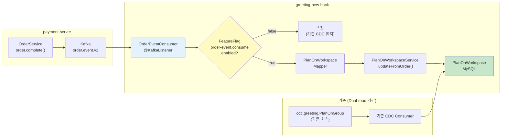
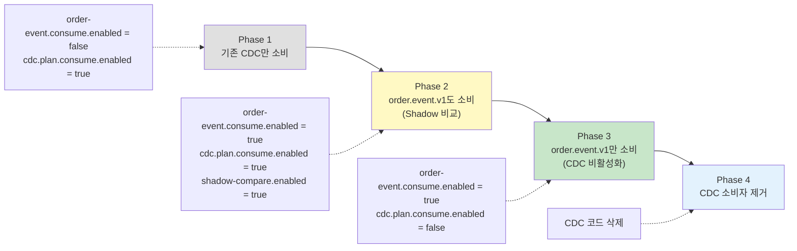
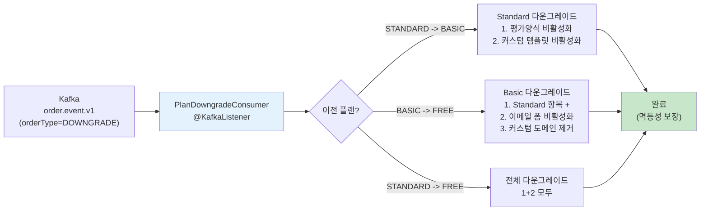

# [Ticket #18] greeting-new-back 연동 + plan-data-processor 이관

## 개요
- TDD 참조: tdd.md 섹션 5.1, 5.2
- 선행 티켓: #16 (Kafka 이벤트), #14 (Order API)
- 크기: L

## 작업 내용

### 설계 원칙

1. **greeting-new-back**: 새로운 `order.event.v1` 이벤트를 소비하여 `PlanOnWorkspace`를 업데이트. Dual-read 기간 동안 Feature Flag로 기존/신규 소스 전환.
2. **plan-data-processor 이관**: Node.js(NestJS) 기반 다운그레이드/클린업 로직을 greeting-new-back의 Kotlin Kafka Consumer로 포팅. 멱등성 보장.

### 1. greeting-new-back 연동 흐름



### 2. Dual-read 전환 흐름



### 3. Feature Flag 정의 (greeting-new-back)

```kotlin
object OrderEventFeatureKeys {

    /** order.event.v1 이벤트 소비 활성화 */
    object OrderEventConsumeEnabled : BooleanFeatureKey(
        key = "order-event.consume-enabled",
        defaultValue = false
    )

    /** 기존 CDC 소비 활성화 (Dual-read 기간 유지) */
    object CdcPlanConsumeEnabled : BooleanFeatureKey(
        key = "cdc.plan-consume-enabled",
        defaultValue = true  // 기본 활성 (기존 동작)
    )

    /** Shadow 비교 활성화 (불일치 로깅) */
    object ShadowCompareEnabled : BooleanFeatureKey(
        key = "order-event.shadow-compare-enabled",
        defaultValue = false
    )
}
```

### 4. OrderEventConsumer (greeting-new-back)

```kotlin
@Component
class OrderEventConsumer(
    private val planOnWorkspaceService: PlanOnWorkspaceService,
    private val featureFlagService: FeatureFlagService,
    private val objectMapper: ObjectMapper,
    private val meterRegistry: MeterRegistry,
) {
    private val log = LoggerFactory.getLogger(javaClass)

    @KafkaListener(
        topics = ["order.event.v1"],
        groupId = "greeting-new-back-order-completed",
        containerFactory = "kafkaListenerContainerFactory"
    )
    fun onOrderCompleted(record: ConsumerRecord<String, String>) {
        val enabled = featureFlagService.getFlag(
            OrderEventFeatureKeys.OrderEventConsumeEnabled,
            FeatureContext.ALL
        )
        if (!enabled) return

        val event = objectMapper.readValue(record.value(), OrderEvent::class.java)

        // 구독 상품만 PlanOnWorkspace 업데이트
        if (event.productType != "SUBSCRIPTION") return

        try {
            updatePlanOnWorkspace(event)
            meterRegistry.counter("order.event.consumed.success").increment()
        } catch (e: Exception) {
            log.error("[OrderEventConsumer] Failed to process: orderNumber=${event.orderNumber}, workspace=${event.workspaceId}", e)
            meterRegistry.counter("order.event.consumed.failure").increment()
            throw e  // Kafka retry
        }
    }

    private fun updatePlanOnWorkspace(event: OrderEvent) {
        val subscription = event.subscription
            ?: throw IllegalStateException("Subscription snapshot missing for SUBSCRIPTION order: ${event.orderNumber}")

        val planType = when {
            event.productCode.contains("BASIC", ignoreCase = true) -> PlanType.BASIC
            event.productCode.contains("STANDARD", ignoreCase = true) -> PlanType.STANDARD
            else -> PlanType.FREE
        }

        val command = UpdatePlanCommand(
            workspaceId = event.workspaceId.toLong(),
            planType = planType,
            periodStart = subscription.periodStart,
            periodEnd = subscription.periodEnd,
            orderType = event.orderType,
        )

        planOnWorkspaceService.updateFromOrder(command)

        log.info("[OrderEventConsumer] Updated PlanOnWorkspace: workspace=${event.workspaceId}, plan=$planType, orderType=${event.orderType}")
    }
}
```

### 5. PlanOnWorkspaceService 연동

```kotlin
@Service
class PlanOnWorkspaceService(
    private val planOnWorkspaceRepository: PlanOnWorkspaceRepository,
) {

    @Transactional
    fun updateFromOrder(command: UpdatePlanCommand) {
        val planOnWorkspace = planOnWorkspaceRepository.findByWorkspaceId(command.workspaceId)
            ?: PlanOnWorkspace.create(command.workspaceId, command.planType)

        when (command.orderType) {
            "NEW", "UPGRADE", "RENEWAL" -> {
                planOnWorkspace.updatePlan(
                    planType = command.planType,
                    periodStart = command.periodStart,
                    periodEnd = command.periodEnd,
                )
            }
            "DOWNGRADE" -> {
                planOnWorkspace.downgrade(
                    planType = command.planType,
                    periodStart = command.periodStart,
                    periodEnd = command.periodEnd,
                )
            }
        }

        planOnWorkspaceRepository.save(planOnWorkspace)
    }
}
```

### 6. plan-data-processor 다운그레이드 로직 이관



### 7. PlanDowngradeConsumer (Node.js -> Kotlin 포팅)

```kotlin
@Component
class PlanDowngradeConsumer(
    private val evaluationFormService: EvaluationFormService,
    private val templateService: TemplateService,
    private val emailFormService: EmailFormService,
    private val customDomainService: CustomDomainService,
    private val featureFlagService: FeatureFlagService,
    private val objectMapper: ObjectMapper,
) {
    private val log = LoggerFactory.getLogger(javaClass)

    @KafkaListener(
        topics = ["order.event.v1"],
        groupId = "greeting-new-back-plan-downgrade",
        containerFactory = "kafkaListenerContainerFactory"
    )
    fun onOrderCompleted(record: ConsumerRecord<String, String>) {
        val event = objectMapper.readValue(record.value(), OrderEvent::class.java)

        // 다운그레이드 이벤트만 처리
        if (event.orderType != "DOWNGRADE" || event.productType != "SUBSCRIPTION") return

        val workspaceId = event.workspaceId.toLong()
        val targetPlan = extractPlanType(event.productCode)

        log.info("[PlanDowngrade] Processing downgrade: workspace=$workspaceId, targetPlan=$targetPlan")

        try {
            executeDowngrade(workspaceId, targetPlan)
        } catch (e: Exception) {
            log.error("[PlanDowngrade] Failed: workspace=$workspaceId", e)
            throw e
        }
    }

    private fun executeDowngrade(workspaceId: Long, targetPlan: String) {
        when (targetPlan) {
            "FREE" -> {
                // Standard -> Free 또는 Basic -> Free: 모든 프리미엄 기능 비활성화
                deactivateStandardFeatures(workspaceId)
                deactivateBasicFeatures(workspaceId)
            }
            "BASIC" -> {
                // Standard -> Basic: Standard 전용 기능만 비활성화
                deactivateStandardFeatures(workspaceId)
            }
        }
    }

    /**
     * Standard 플랜 전용 기능 비활성화
     * - 평가양식(EvaluationForm) 중 Standard 전용 비활성화
     * - 커스텀 템플릿 비활성화
     */
    private fun deactivateStandardFeatures(workspaceId: Long) {
        // 멱등성: 이미 비활성화된 것은 스킵
        val deactivatedEvalForms = evaluationFormService.deactivateStandardOnlyForms(workspaceId)
        val deactivatedTemplates = templateService.deactivateCustomTemplates(workspaceId)

        log.info("[PlanDowngrade] Standard features deactivated: workspace=$workspaceId, evalForms=$deactivatedEvalForms, templates=$deactivatedTemplates")
    }

    /**
     * Basic 플랜 전용 기능 비활성화 (추가로)
     * - 이메일 폼 비활성화
     * - 커스텀 도메인 제거
     */
    private fun deactivateBasicFeatures(workspaceId: Long) {
        val deactivatedEmailForms = emailFormService.deactivateAll(workspaceId)
        customDomainService.removeCustomDomain(workspaceId)

        log.info("[PlanDowngrade] Basic features deactivated: workspace=$workspaceId, emailForms=$deactivatedEmailForms")
    }

    private fun extractPlanType(productCode: String): String = when {
        productCode.contains("STANDARD", ignoreCase = true) -> "STANDARD"
        productCode.contains("BASIC", ignoreCase = true) -> "BASIC"
        productCode.contains("FREE", ignoreCase = true) -> "FREE"
        else -> "FREE"
    }
}
```

### 8. 멱등성 보장 -- 비활성화 서비스 내부

```kotlin
@Service
class EvaluationFormService(
    private val evaluationFormRepository: EvaluationFormRepository,
) {

    /**
     * Standard 전용 평가양식 비활성화 (멱등)
     * 이미 비활성화된 양식은 변경하지 않음
     */
    @Transactional
    fun deactivateStandardOnlyForms(workspaceId: Long): Int {
        val forms = evaluationFormRepository.findByWorkspaceIdAndPlanLevelAndIsActive(
            workspaceId = workspaceId,
            planLevel = "STANDARD",
            isActive = true
        )
        forms.forEach { it.deactivate() }
        return forms.size
    }
}

@Service
class CustomDomainService(
    private val customDomainRepository: CustomDomainRepository,
) {

    /**
     * 커스텀 도메인 제거 (멱등)
     * 이미 없으면 아무 동작 안함
     */
    @Transactional
    fun removeCustomDomain(workspaceId: Long) {
        val domain = customDomainRepository.findByWorkspaceId(workspaceId) ?: return
        domain.softDelete()
        customDomainRepository.save(domain)
    }
}
```

### 수정 파일 목록

| 레포 | 파일 경로 | 변경 유형 |
|------|----------|----------|
| greeting-new-back | domain/.../event/OrderEventConsumer.kt | 신규 |
| greeting-new-back | domain/.../event/OrderEvent.kt | 신규 (DTO) |
| greeting-new-back | domain/.../event/PlanDowngradeConsumer.kt | 신규 |
| greeting-new-back | domain/.../service/PlanOnWorkspaceService.kt | 수정 (updateFromOrder 추가) |
| greeting-new-back | domain/.../command/UpdatePlanCommand.kt | 신규 |
| greeting-new-back | domain/.../service/EvaluationFormService.kt | 수정 (deactivateStandardOnlyForms 추가) |
| greeting-new-back | domain/.../service/TemplateService.kt | 수정 (deactivateCustomTemplates 추가) |
| greeting-new-back | domain/.../service/EmailFormService.kt | 수정 (deactivateAll 추가) |
| greeting-new-back | domain/.../service/CustomDomainService.kt | 수정 (removeCustomDomain 추가) |
| greeting-new-back | aggregate/service/OrderEventFeatureKeys.kt | 신규 |
| greeting-db-schema | migration/V{N}__insert_order_event_feature_flags.sql | 신규 |

## 테스트 케이스

### 정상 케이스
| ID | 테스트명 | Given | When | Then |
|----|---------|-------|------|------|
| TC-01 | PlanOnWorkspace 업데이트 (NEW) | OrderEvent (NEW, PLAN_BASIC) | Consumer 처리 | PlanOnWorkspace.planType = BASIC, period 설정 |
| TC-02 | PlanOnWorkspace 업데이트 (UPGRADE) | OrderEvent (UPGRADE, PLAN_STANDARD) | Consumer 처리 | PlanOnWorkspace.planType = STANDARD |
| TC-03 | PlanOnWorkspace 갱신 (RENEWAL) | OrderEvent (RENEWAL, PLAN_BASIC) | Consumer 처리 | periodEnd 갱신 |
| TC-04 | 다운그레이드 Standard->Basic | OrderEvent (DOWNGRADE, PLAN_BASIC) | PlanDowngradeConsumer | 평가양식/커스텀 템플릿 비활성화 |
| TC-05 | 다운그레이드 Basic->Free | OrderEvent (DOWNGRADE, PLAN_FREE) | PlanDowngradeConsumer | +이메일폼 비활성화, 커스텀 도메인 제거 |
| TC-06 | 비구독 이벤트 스킵 | OrderEvent (SMS_PACK_1000) | OrderEventConsumer | PlanOnWorkspace 변경 없음 |
| TC-07 | Feature flag off | order-event.consume-enabled = false | 이벤트 수신 | Consumer 처리 스킵 |

### 예외/엣지 케이스
| ID | 테스트명 | Given | When | Then |
|----|---------|-------|------|------|
| TC-E01 | 다운그레이드 멱등성 | 이미 비활성화된 평가양식 | 동일 이벤트 재처리 | 에러 없이 스킵 (isActive=true 조건) |
| TC-E02 | PlanOnWorkspace 미존재 | 신규 workspace | OrderEvent (NEW) | PlanOnWorkspace 자동 생성 |
| TC-E03 | 커스텀 도메인 없음 | 커스텀 도메인 미등록 workspace | 다운그레이드 | 에러 없이 스킵 |
| TC-E04 | Kafka 재처리 | 동일 이벤트 2회 수신 | Consumer 처리 | 멱등하게 처리 (중복 변경 없음) |
| TC-E05 | Subscription snapshot 누락 | 구독 이벤트인데 subscription=null | Consumer 처리 | IllegalStateException + Kafka retry |

## 그리팅 실제 적용 예시

### AS-IS (현재)
- plan-data-processor(Node.js NestJS): `basic-plan.changed`, `standard-plan.changed` Kafka 이벤트를 소비하여 MongoDB에서 직접 평가양식 삭제, 커스텀 도메인 제거 등 처리. ATS 도메인 데이터를 결제 관련 서비스가 직접 조작하는 구조.
- greeting-new-back: `cdc.greeting.PlanOnGroup` CDC 이벤트로 PlanOnWorkspace를 업데이트. payment-server의 MySQL 변경을 Debezium으로 감지하는 간접 연동.

### TO-BE (리팩토링 후)
- greeting-new-back가 `order.event.v1`을 직접 소비하여 PlanOnWorkspace 업데이트 + 다운그레이드 로직 처리. ATS 도메인 데이터는 ATS 서비스(greeting-new-back)가 직접 관리.
- plan-data-processor는 제거. Kafka Consumer 2개(OrderEventConsumer, PlanDowngradeConsumer)로 대체.

### 향후 확장 예시
- AI 크레딧 기반 기능 제한: order.event.v1의 credit 스냅샷을 소비하여, AI 크레딧 잔액에 따른 기능 활성화/비활성화를 greeting-new-back에서 직접 처리 가능.
- 새로운 다운그레이드 정책: PlanDowngradeConsumer에 메서드 추가만으로 대응. Node.js 빌드/배포 불필요.

## 기대 결과 (AC)
- [ ] greeting-new-back에 OrderEventConsumer가 order.event.v1 토픽을 소비
- [ ] 구독 이벤트 수신 시 PlanOnWorkspace가 정확히 업데이트
- [ ] Feature Flag로 기존 CDC / 신규 이벤트 소비를 런타임 전환 가능 (Dual-read)
- [ ] PlanDowngradeConsumer가 다운그레이드 시 Standard/Basic 전용 기능 비활성화
- [ ] Standard -> Basic: 평가양식 + 커스텀 템플릿 비활성화
- [ ] Basic -> Free: 위 + 이메일 폼 비활성화 + 커스텀 도메인 제거
- [ ] 모든 다운그레이드 연산이 멱등성 보장 (재처리 시 중복 변경 없음)
- [ ] plan-data-processor의 Node.js 로직이 Kotlin으로 완전 이관
