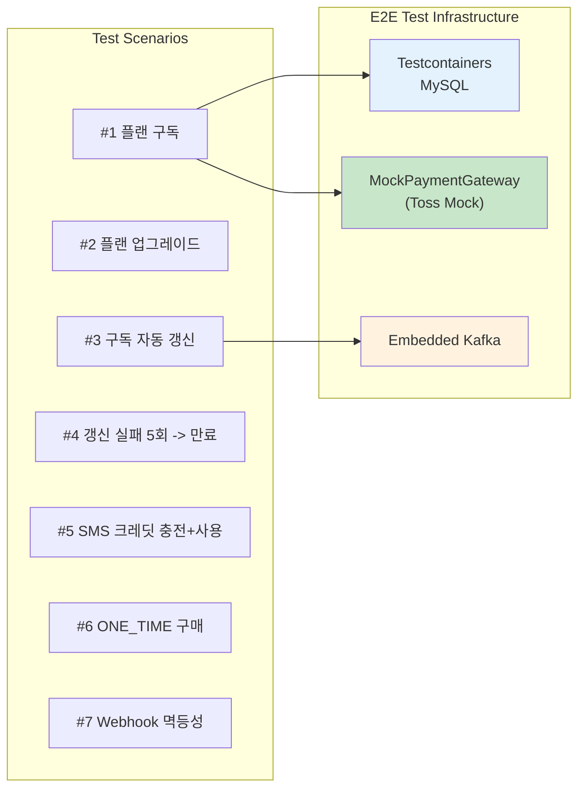
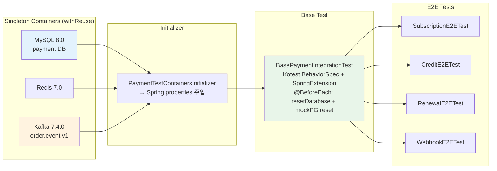
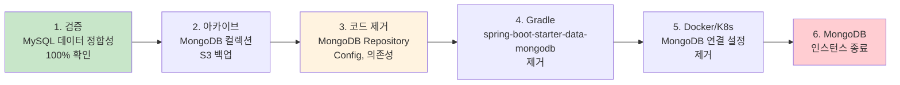
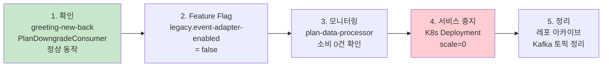

# [Ticket #19] 통합 테스트 + MongoDB 제거

## 개요
- TDD 참조: tdd.md 섹션 5.3 (Phase F), 6
- 선행 티켓: #13~#18 전체
- 크기: L

## 작업 내용

### 설계 원칙

1. **E2E 테스트**: 전체 주문 파이프라인을 관통하는 시나리오 테스트 7건 이상. 실제 DB(Testcontainers MySQL) + 임베디드 Kafka 사용.
2. **MongoDB 제거**: payment-server에서 MongoDB 의존성 완전 삭제. 컬렉션 아카이브 후 관련 코드 제거.
3. **plan-data-processor 폐기**: Node.js 서비스 비활성화 + Kafka 토픽 정리.

### 1. E2E 테스트 시나리오 구조



### 2. 테스트 인프라 설정 (greeting-new-back 패턴 준용)

greeting-new-back의 `TestContainers` object + `TestContainersInitializer` + `BaseIntegrationTest` 패턴을 payment-server에 동일하게 적용한다.

#### PaymentTestContainers (싱글턴 컨테이너)

```kotlin
/**
 * greeting-new-back의 TestContainers.kt와 동일한 패턴.
 * 싱글턴 object로 컨테이너를 관리하여 테스트 간 재사용 (withReuse).
 */
object PaymentTestContainers {
    private val SQL_SCRIPTS = listOf(
        "sql/init_payment.sql",   // 상품 시드 + 테이블 초기화
    )

    val mysql: MySQLContainer<Nothing> = MySQLContainer<Nothing>("mysql:8.0").apply {
        withDatabaseName("payment")
        withUsername("test_user")
        withPassword("test_password")
        withReuse(true)
        withCommand("--max_connections=500")
    }

    val redis: GenericContainer<*> = GenericContainer(DockerImageName.parse("redis:7.0-alpine"))
        .withExposedPorts(6379)
        .withReuse(true)

    val kafka: KafkaContainer = KafkaContainer(DockerImageName.parse("confluentinc/cp-kafka:7.4.0"))
        .withEnv("KAFKA_AUTO_CREATE_TOPICS_ENABLE", "false")
        .withReuse(true)

    // MongoDB는 더 이상 필요 없음 (MySQL 완전 전환 후)

    @Volatile
    private var started = false

    fun startOnce() {
        if (started) return
        synchronized(this) {
            if (started) return
            mysql.start()
            resetDatabase()
            redis.start()
            kafka.start()
            createDefaultTopics()
            started = true
        }
    }

    fun createDefaultTopics() {
        createKafkaTopic("order.event.v1")
        createKafkaTopic("event.ats.plan.changed.v1")  // 레거시 호환
    }

    fun createKafkaTopic(topicName: String, partitions: Int = 1, replicationFactor: Short = 1) {
        val adminClient = AdminClient.create(Properties().apply {
            put(AdminClientConfig.BOOTSTRAP_SERVERS_CONFIG, kafka.bootstrapServers)
        })
        adminClient.use { client ->
            val existingTopics = client.listTopics().names().get()
            if (existingTopics.contains(topicName)) return
            val newTopic = NewTopic(topicName, partitions, replicationFactor)
            try {
                client.createTopics(listOf(newTopic)).all().get()
            } catch (e: ExecutionException) {
                if (e.cause is TopicExistsException) return
                throw e
            }
        }
    }

    fun resetDatabase() {
        val conn = mysql.createConnection("")
        try {
            SQL_SCRIPTS.forEach { scriptPath ->
                ScriptUtils.executeSqlScript(conn, ClassPathResource(scriptPath))
            }
        } finally {
            runCatching { conn.close() }
        }
    }

    fun <T : Any> drainKafkaRecords(
        topic: String,
        valueType: Class<T>,
        timeout: Duration = Duration.ofSeconds(5),
    ): List<ConsumerRecord<String, T>> {
        // greeting-new-back의 drainKafkaRecords와 동일한 패턴
        val props = Properties().apply {
            put(ConsumerConfig.BOOTSTRAP_SERVERS_CONFIG, kafka.bootstrapServers)
            put(ConsumerConfig.GROUP_ID_CONFIG, "test-${UUID.randomUUID()}")
            put(ConsumerConfig.ENABLE_AUTO_COMMIT_CONFIG, "false")
            put(ConsumerConfig.AUTO_OFFSET_RESET_CONFIG, "earliest")
        }
        val consumer = KafkaConsumer(props, StringDeserializer(), JsonDeserializer(valueType).apply {
            addTrustedPackages("*")
        })
        consumer.use {
            it.subscribe(listOf(topic))
            val out = mutableListOf<ConsumerRecord<String, T>>()
            val deadline = System.nanoTime() + timeout.toNanos()
            var idle = 0
            while (System.nanoTime() < deadline && idle < 3) {
                val records = it.poll(Duration.ofMillis(200))
                if (records.isEmpty) idle++ else { idle = 0; records.forEach(out::add) }
            }
            return out
        }
    }
}
```

#### PaymentTestContainersInitializer

```kotlin
/**
 * greeting-new-back의 TestContainersInitializer.kt와 동일한 패턴.
 */
class PaymentTestContainersInitializer : ApplicationContextInitializer<ConfigurableApplicationContext> {
    override fun initialize(context: ConfigurableApplicationContext) {
        PaymentTestContainers.startOnce()

        TestPropertyValues.of(
            "spring.datasource.url=${PaymentTestContainers.mysql.jdbcUrl}",
            "spring.datasource.username=${PaymentTestContainers.mysql.username}",
            "spring.datasource.password=${PaymentTestContainers.mysql.password}",
            "spring.datasource.driver-class-name=com.mysql.cj.jdbc.Driver",

            "spring.redis.host=${PaymentTestContainers.redis.host}",
            "spring.redis.port=${PaymentTestContainers.redis.getMappedPort(6379)}",

            "spring.kafka.bootstrap-servers=${PaymentTestContainers.kafka.bootstrapServers}",
        ).applyTo(context.environment)
    }
}
```

#### BasePaymentIntegrationTest

```kotlin
/**
 * greeting-new-back의 BaseIntegrationTest.kt와 동일한 패턴.
 * Kotest BehaviorSpec + SpringExtension.
 */
@SpringBootTest
@ActiveProfiles("integration-test")
@ContextConfiguration(initializers = [PaymentTestContainersInitializer::class])
abstract class BasePaymentIntegrationTest : BehaviorSpec() {

    @Autowired
    lateinit var orderFacade: OrderFacade

    @Autowired
    lateinit var orderService: OrderService

    @Autowired
    lateinit var subscriptionRepository: SubscriptionRepository

    @Autowired
    lateinit var creditBalanceRepository: CreditBalanceRepository

    @Autowired
    lateinit var creditLedgerRepository: CreditLedgerRepository

    @Autowired
    lateinit var orderStatusHistoryRepository: OrderStatusHistoryRepository

    @Autowired
    lateinit var pgWebhookLogRepository: PgWebhookLogRepository

    @Autowired
    lateinit var productRepository: ProductRepository

    // MockPaymentGateway: @Primary @Profile("integration-test")로 Toss 대체
    @Autowired
    lateinit var mockPaymentGateway: MockPaymentGateway

    override fun extensions(): List<Extension> = listOf(SpringExtension)

    @BeforeEach
    fun setUp() {
        PaymentTestContainers.resetDatabase()
        mockPaymentGateway.reset()
    }
}
```

#### 테스트 인프라 구조도


```

### 3. MockPaymentGateway

```kotlin
@Component
@Primary
@Profile("test")
class MockPaymentGateway : PaymentGateway {
    override val gatewayName = "MOCK"

    private var shouldFail = false
    private var failureCount = 0
    private var maxFailures = 0

    fun reset() {
        shouldFail = false
        failureCount = 0
        maxFailures = 0
    }

    fun setAlwaysFail() {
        shouldFail = true
        maxFailures = Int.MAX_VALUE
    }

    fun setFailNTimes(n: Int) {
        shouldFail = true
        maxFailures = n
        failureCount = 0
    }

    override fun chargeByBillingKey(
        billingKey: String,
        orderId: String,
        amount: Int,
        orderName: String,
    ): PaymentResult {
        if (shouldFail && failureCount < maxFailures) {
            failureCount++
            return PaymentResult(
                success = false,
                paymentKey = null,
                receiptUrl = null,
                approvedAt = null,
                failureCode = "CARD_DECLINED",
                failureMessage = "Mock: Card declined (failure #$failureCount)",
                rawResponse = """{"error":"CARD_DECLINED","count":$failureCount}""",
            )
        }

        val paymentKey = "mock_pk_${UUID.randomUUID().toString().take(8)}"
        return PaymentResult(
            success = true,
            paymentKey = paymentKey,
            receiptUrl = "https://mock.receipt/$paymentKey",
            approvedAt = LocalDateTime.now(),
            failureCode = null,
            failureMessage = null,
            rawResponse = """{"paymentKey":"$paymentKey","status":"DONE"}""",
        )
    }

    override fun confirmPayment(paymentKey: String, orderId: String, amount: Int): PaymentResult {
        return PaymentResult(
            success = true, paymentKey = paymentKey,
            receiptUrl = "https://mock.receipt/$paymentKey",
            approvedAt = LocalDateTime.now(),
            failureCode = null, failureMessage = null,
            rawResponse = """{"paymentKey":"$paymentKey","status":"DONE"}""",
        )
    }

    override fun cancelPayment(paymentKey: String, cancelAmount: Int, cancelReason: String): PaymentResult {
        return PaymentResult(
            success = true, paymentKey = paymentKey,
            receiptUrl = null,
            approvedAt = null,
            failureCode = null, failureMessage = null,
            rawResponse = """{"paymentKey":"$paymentKey","status":"CANCELED"}""",
        )
    }
}
```

### 4. E2E 시나리오 #1: 플랜 구독 (신규) — Kotest BehaviorSpec

```kotlin
class SubscriptionE2ETest : BasePaymentIntegrationTest() {
    init {
        Given("워크스페이스에 빌링키가 등록되어 있고 PLAN_BASIC 상품이 존재할 때") {
            val workspaceId = createTestWorkspace()
            createTestBillingKey(workspaceId)

            When("플랜 신규 구독 주문을 생성하고 처리하면") {
                val order = orderFacade.createAndProcessOrder(
                    CreateOrderRequest(
                        workspaceId = workspaceId,
                        productCode = "PLAN_BASIC",
                        orderType = "NEW",
                    )
                )

                Then("주문 상태가 COMPLETED이다") {
                    order.status shouldBe "COMPLETED"
                }

                Then("구독이 ACTIVE 상태로 생성된다") {
                    val subscription = subscriptionRepository
                        .findByWorkspaceIdAndStatus(workspaceId, "ACTIVE")
                    subscription shouldNotBe null
                    subscription!!.currentPeriodEnd shouldBeAfter LocalDateTime.now()
                }

                Then("주문 상태 이력이 4건 기록된다 (CREATED→PENDING→PAID→COMPLETED)") {
                    val histories = orderStatusHistoryRepository.findByOrderId(order.id)
                    histories shouldHaveSize 4
                    histories.map { it.toStatus } shouldBe listOf(
                        "CREATED", "PENDING_PAYMENT", "PAID", "COMPLETED"
                    )
                }

                Then("Kafka에 order.event.v1 이벤트가 발행된다") {
                    val records = PaymentTestContainers.drainKafkaRecords(
                        "order.event.v1", OrderEvent::class.java
                    )
                    records shouldHaveAtLeastSize 1
                    records.first().value().productType shouldBe "SUBSCRIPTION"
                }
            }
        }
    }
}
```

### 5. E2E 시나리오 #4: 갱신 실패 5회 -> 만료

```kotlin
@Test
fun `시나리오 4 - 구독 갱신 5회 실패 후 만료`() {
    // Given: ACTIVE 구독 + 결제 항상 실패
    val workspace = createTestWorkspace()
    createTestBillingKey(workspace.id)
    val subscription = createActiveSubscription(workspace.id, periodEndTomorrow())
    mockPaymentGateway.setAlwaysFail()

    val renewalFacade = applicationContext.getBean(SubscriptionRenewalFacade::class.java)

    // When: 5번 스케줄러 실행
    for (attempt in 1..5) {
        renewalFacade.processRenewalBatch()

        val sub = subscriptionRepository.findById(subscription.id).get()
        if (attempt < 5) {
            // Then: retry_count 증가, PAST_DUE, period_end += 1일
            assertThat(sub.retryCount).isEqualTo(attempt)
            assertThat(sub.status).isEqualTo("PAST_DUE")
            assertThat(sub.currentPeriodEnd)
                .isEqualTo(periodEndTomorrow().plusDays(attempt.toLong()))
        } else {
            // Then: 5회 실패 -> EXPIRED
            assertThat(sub.retryCount).isEqualTo(5)
            assertThat(sub.status).isEqualTo("EXPIRED")
        }
    }
}
```

### 6. E2E 시나리오 #5: SMS 크레딧 충전 + 사용

```kotlin
@Test
fun `시나리오 5 - SMS 크레딧 충전 후 사용`() {
    // Given
    val workspace = createTestWorkspace()
    createTestBillingKey(workspace.id)
    createProduct("SMS_PACK_1000", "CONSUMABLE", mapOf("credit_type" to "SMS", "credit_amount" to "1000"))

    // When: 크레딧 충전
    val order = orderService.createOrder(
        CreateOrderCommand(
            workspaceId = workspace.id,
            productCode = "SMS_PACK_1000",
            orderType = OrderType.PURCHASE,
            createdBy = "test-user"
        )
    )
    orderService.processOrder(order.id)

    // Then: 잔액 1000
    val balance = creditBalanceRepository.findByWorkspaceIdAndCreditType(workspace.id, "SMS")
    assertThat(balance!!.balance).isEqualTo(1000)

    // Then: 원장에 CHARGE 기록
    val ledgers = creditLedgerRepository.findByWorkspaceIdAndCreditType(workspace.id, "SMS")
    assertThat(ledgers).hasSize(1)
    assertThat(ledgers[0].transactionType).isEqualTo("CHARGE")
    assertThat(ledgers[0].amount).isEqualTo(1000)
    assertThat(ledgers[0].balanceAfter).isEqualTo(1000)
}
```

### 7. E2E 시나리오 #7: Webhook 멱등성

```kotlin
@Test
fun `시나리오 7 - 동일 웹훅 중복 수신 시 멱등 처리`() {
    // Given: 결제 완료된 주문
    val workspace = createTestWorkspace()
    createTestBillingKey(workspace.id)
    val order = orderService.createOrder(
        CreateOrderCommand(
            workspaceId = workspace.id,
            productCode = "PLAN_BASIC",
            orderType = OrderType.NEW,
            createdBy = "test-user"
        )
    )
    orderService.processOrder(order.id)

    val webhookPayload = """
        {"paymentKey":"${getPaymentKey(order.id)}","status":"DONE","eventType":"DONE","orderId":"${order.orderNumber}"}
    """.trimIndent()
    val signature = generateValidSignature(webhookPayload)

    // When: 동일 웹훅 2회 전송
    val result1 = mockMvc.perform(
        post("/api/v1/webhooks/toss")
            .header("Toss-Signature", signature)
            .contentType(MediaType.APPLICATION_JSON)
            .content(webhookPayload)
    ).andExpect(status().isOk)

    val result2 = mockMvc.perform(
        post("/api/v1/webhooks/toss")
            .header("Toss-Signature", signature)
            .contentType(MediaType.APPLICATION_JSON)
            .content(webhookPayload)
    ).andExpect(status().isOk)

    // Then: pg_webhook_log에 1건만 존재
    val logs = pgWebhookLogRepository.findAll()
    val matchingLogs = logs.filter { it.paymentKey == getPaymentKey(order.id) && it.eventType == "DONE" }
    assertThat(matchingLogs).hasSize(1)
}
```

### 8. MongoDB 제거 계획



### 9. MongoDB 제거 대상 파일

```kotlin
// 삭제 대상 Repository
// - PaymentLogsOnGroupRepository (MongoDB)
// - MessagePointLogsOnWorkspaceRepository (MongoDB)
// - MessagePointChargeLogsOnWorkspaceRepository (MongoDB)

// 삭제 대상 Entity
// - PaymentLogsOnGroup
// - MessagePointLogsOnWorkspace
// - MessagePointChargeLogsOnWorkspace

// 삭제 대상 Config
// - MongoConfig.kt (or MongoDBConfiguration.kt)
// - MongoProperties 설정

// 삭제 대상 Dual Write 코드
// - DualWritePaymentLogService
// - DualWriteMessagePointLogService
// - DualWriteChargeLogService
// - DualReadPaymentLogService
// - DualReadCreditLogService
// - PaymentLogToOrderConverter

// 삭제 대상 Feature Flag
// - DualWriteFeatureKeys (6개 전부)
// - simple_runtime_config에서 dual-write.* 키 DELETE
```

### 10. plan-data-processor 폐기



### 11. Kafka 토픽 정리

```yaml
# 폐기 예정 토픽 (plan-data-processor 제거 후)
deprecated_topics:
  - name: basic-plan.changed       # LegacyAdapter가 발행 중지
  - name: standard-plan.changed    # LegacyAdapter가 발행 중지
  - name: cdc.greeting.PlanOnGroup # CDC 비활성화

# 유지 토픽
active_topics:
  - name: order.event.v1       # 신규 통합 이벤트
  - name: event.ats.plan.changed.v1 # 다른 소비자가 있을 수 있으므로 별도 확인 후 폐기
```

### 수정 파일 목록

| 레포 | 파일 경로 | 변경 유형 |
|------|----------|----------|
| greeting_payment-server | test/integration/e2e/SubscriptionE2ETest.kt | 신규 |
| greeting_payment-server | test/integration/e2e/CreditE2ETest.kt | 신규 |
| greeting_payment-server | test/integration/e2e/OneTimeE2ETest.kt | 신규 |
| greeting_payment-server | test/integration/e2e/WebhookE2ETest.kt | 신규 |
| greeting_payment-server | test/integration/e2e/RenewalSchedulerE2ETest.kt | 신규 |
| greeting_payment-server | test/integration/IntegrationTestBase.kt | 신규 |
| greeting_payment-server | test/integration/MockPaymentGateway.kt | 신규 |
| greeting_payment-server | domain/migration/DualWrite*.kt | 삭제 (6개 파일) |
| greeting_payment-server | infrastructure/mongo/*.kt | 삭제 (MongoDB Repository, Config) |
| greeting_payment-server | build.gradle.kts | 수정 (mongodb 의존성 제거) |
| greeting_payment-server | application.yml | 수정 (MongoDB 설정 제거) |
| greeting-db-schema | migration/V{N}__delete_dual_write_feature_flags.sql | 신규 |
| greeting-topic | deprecated/ 폴더에 폐기 토픽 정의 이동 | 수정 |

## 테스트 케이스

### 카테고리 A: TO-BE 기본 시나리오
| ID | 시나리오 | 검증 항목 |
|----|---------|----------|
| E2E-01 | 플랜 신규 구독 | Order COMPLETED, Subscription ACTIVE, OrderStatusHistory 4건, Kafka 이벤트 발행 |
| E2E-02 | 플랜 업그레이드 (BASIC→STANDARD) | 기존 구독 해지, 신규 구독 ACTIVE, 프로레이션 금액 계산 |
| E2E-03 | 구독 자동 갱신 성공 | Order(RENEWAL) COMPLETED, period 갱신, retry_count=0 |
| E2E-04 | 갱신 5회 실패 → 만료 | retry 1~4: PAST_DUE + period_end+=1day, retry 5: EXPIRED |
| E2E-05 | SMS 크레딧 충전 + 잔액 확인 | CreditBalance=1000, CreditLedger(CHARGE, amount=1000) |
| E2E-06 | ONE_TIME 단건 구매 | Order COMPLETED, Fulfillment 즉시 완료 |
| E2E-07 | Webhook 멱등성 | 동일 웹훅 2회 수신, pg_webhook_log 1건만 존재 |

### 카테고리 B: AS-IS ↔ TO-BE 동등성 검증

AS-IS(기존 PlanService/MessagePointService)와 TO-BE(OrderFacade)가 **동일한 입력에 동일한 결과**를 내는지 검증한다.

| ID | 시나리오 | AS-IS 실행 | TO-BE 실행 | 동등성 검증 항목 |
|----|---------|-----------|-----------|---------------|
| PARITY-01 | 플랜 Basic 신규 구독 | PlanServiceImpl.updatePlan() | OrderFacade.createAndProcessOrder(PLAN_BASIC, NEW) | 구독 상태(ACTIVE), 구독 기간(start/end), 결제 금액, 결제 상태 |
| PARITY-02 | 플랜 Basic→Standard 업그레이드 | OrderFacade.createUpgradePlanOrder() + PlanServiceImpl.upgradePlan() | OrderFacade.createAndProcessOrder(PLAN_STANDARD, UPGRADE) | 환불 금액(프로레이션), 신규 구독 기간, 총 결제액 |
| PARITY-03 | 플랜 해지 + 프로레이션 환불 | PlanServiceImpl.cancelPlan() | OrderFacade.cancelOrder() + Refund | 환불 금액 일치, 구독 만료일 일치 |
| PARITY-04 | 플랜 자동 갱신 (월간) | OrderServiceImpl.createUpdatePlanOrder() | RenewalScheduler → OrderFacade.processOrder(RENEWAL) | 갱신 후 기간(+1개월), 결제 금액, paymentKey 존재 |
| PARITY-05 | SMS 1000건 팩 충전 | MessagePointService.charge() | OrderFacade.createAndProcessOrder(SMS_PACK_1000, PURCHASE) | 잔액 증가량(+1000), 결제 금액 일치 |
| PARITY-06 | 백오피스 수동 플랜 부여 | PlanServiceImpl.updatePlanInBackOfficeV2() | OrderFacade.createAndProcessOrder(PLAN_STANDARD, NEW) via ManualGateway | 구독 상태, 기간, VAT 계산((price-credit)*1.1) |

```kotlin
class AsIsToBeParityTest : BasePaymentIntegrationTest() {
    // AS-IS 서비스 (레거시)
    @Autowired lateinit var legacyPlanService: PlanServiceImpl
    @Autowired lateinit var legacyOrderService: OrderServiceImpl
    @Autowired lateinit var legacyMessagePointService: MessagePointService

    init {
        Given("동일한 워크스페이스에 동일한 플랜을 AS-IS와 TO-BE로 구독할 때") {
            val workspaceA = createTestWorkspace("ws-asis")
            val workspaceB = createTestWorkspace("ws-tobe")
            createTestBillingKey(workspaceA)
            createTestBillingKey(workspaceB)

            When("AS-IS: 기존 PlanService로 Basic 구독") {
                legacyOrderService.createUpgradePlanOrder(workspaceA, Plans.BASIC, isAnnual = false)
                val asIsPlan = legacyPlanService.getPlanInfo(workspaceA)

                And("TO-BE: OrderFacade로 Basic 구독") {
                    val toBeOrder = orderFacade.createAndProcessOrder(
                        CreateOrderRequest(
                            workspaceId = workspaceB,
                            productCode = "PLAN_BASIC",
                            orderType = "NEW",
                        )
                    )
                    val toBeSub = orderService.findActiveSubscription(workspaceB)

                    Then("구독 상태가 동일하다") {
                        toBeSub!!.status shouldBe "ACTIVE"
                        asIsPlan.paymentStatus shouldBe PlanOnWorkspaceStatus.SUCCESS
                    }

                    Then("구독 기간이 동일하다 (1개월)") {
                        val asisDuration = ChronoUnit.DAYS.between(asIsPlan.startDate, asIsPlan.expiredDate)
                        val tobeDuration = ChronoUnit.DAYS.between(toBeSub!!.currentPeriodStart, toBeSub.currentPeriodEnd)
                        tobeDuration shouldBe asisDuration
                    }

                    Then("결제 금액이 동일하다") {
                        val asisAmount = legacyMessagePointService.getLastPaymentLog(workspaceA).totalPrice
                        toBeOrder.totalAmount shouldBe asisAmount
                    }
                }
            }
        }

        Given("동일한 SMS 팩을 AS-IS와 TO-BE로 충전할 때") {
            val workspaceA = createTestWorkspace("ws-sms-asis")
            val workspaceB = createTestWorkspace("ws-sms-tobe")
            createTestBillingKey(workspaceA)
            createTestBillingKey(workspaceB)

            When("AS-IS: MessagePointService로 1000건 충전") {
                legacyMessagePointService.chargePoint(workspaceA, 1000)
                val asisBalance = legacyMessagePointService.getBalance(workspaceA)

                And("TO-BE: OrderFacade로 1000건 충전") {
                    orderFacade.createAndProcessOrder(
                        CreateOrderRequest(
                            workspaceId = workspaceB,
                            productCode = "SMS_PACK_1000",
                            orderType = "PURCHASE",
                        )
                    )
                    val tobeBalance = orderService.getCreditBalance(workspaceB, "SMS")

                    Then("잔액이 동일하다") {
                        tobeBalance shouldBe asisBalance
                    }
                }
            }
        }
    }
}
```

### 카테고리 C: 신규 상품 시나리오 (현재 시스템에 없는 상품)

**코드 변경 없이 DB INSERT만으로 새 상품을 주문할 수 있는지** 검증한다.

| ID | 시나리오 | 상품 | ProductType | 검증 |
|----|---------|------|------------|------|
| NEW-01 | AI 서류평가 크레딧 100건 충전 | AI_CREDIT_100 | CONSUMABLE | CreditBalance(AI_EVALUATION)=100, CreditLedger(CHARGE) |
| NEW-02 | AI 서류평가 무제한 구독 | AI_EVAL_UNLIMITED | SUBSCRIPTION | Subscription(ACTIVE), period 1개월 |
| NEW-03 | AI 서류평가 단건 구매 | AI_EVAL_SINGLE | ONE_TIME | Order COMPLETED, 즉시 완료 |
| NEW-04 | 프리미엄 리포트 구매 | PREMIUM_REPORT | ONE_TIME | Order COMPLETED, 이벤트 발행 |
| NEW-05 | 신규 상품 환불 | AI_CREDIT_100 구매 후 환불 | CONSUMABLE | Refund COMPLETED, CreditBalance 차감 |

```kotlin
class NewProductE2ETest : BasePaymentIntegrationTest() {
    init {
        Given("시스템에 없던 AI 크레딧 상품을 DB에 추가하고") {
            // 코드 변경 없이 DB INSERT만으로 신규 상품 등록
            insertProduct(
                code = "AI_CREDIT_100",
                name = "AI 서류평가 크레딧 100건",
                productType = "CONSUMABLE",
            )
            insertProductMetadata("AI_CREDIT_100", "credit_type", "AI_EVALUATION")
            insertProductMetadata("AI_CREDIT_100", "credit_amount", "100")
            insertProductPrice("AI_CREDIT_100", price = 50000, currency = "KRW")

            val workspaceId = createTestWorkspace()
            createTestBillingKey(workspaceId)

            When("기존 파이프라인으로 AI 크레딧을 주문하면") {
                val order = orderFacade.createAndProcessOrder(
                    CreateOrderRequest(
                        workspaceId = workspaceId,
                        productCode = "AI_CREDIT_100",
                        orderType = "PURCHASE",
                    )
                )

                Then("주문이 COMPLETED 된다") {
                    order.status shouldBe "COMPLETED"
                }

                Then("AI_EVALUATION 크레딧 잔액이 100이다") {
                    val balance = orderService.getCreditBalance(workspaceId, "AI_EVALUATION")
                    balance shouldBe 100
                }

                Then("크레딧 원장에 CHARGE 기록이 있다") {
                    val ledgers = creditLedgerRepository
                        .findByWorkspaceIdAndCreditType(workspaceId, "AI_EVALUATION")
                    ledgers shouldHaveSize 1
                    ledgers[0].transactionType shouldBe "CHARGE"
                    ledgers[0].amount shouldBe 100
                }

                Then("Kafka 이벤트에 productType=CONSUMABLE로 발행된다") {
                    val records = PaymentTestContainers.drainKafkaRecords(
                        "order.event.v1", OrderEvent::class.java
                    )
                    records shouldHaveAtLeastSize 1
                    records.first().value().productCode shouldBe "AI_CREDIT_100"
                    records.first().value().productType shouldBe "CONSUMABLE"
                }
            }
        }

        Given("시스템에 없던 AI 구독 상품을 DB에 추가하고") {
            insertProduct(
                code = "AI_EVAL_UNLIMITED",
                name = "AI 서류평가 무제한 구독",
                productType = "SUBSCRIPTION",
            )
            insertProductMetadata("AI_EVAL_UNLIMITED", "plan_level", "10")
            insertProductPrice("AI_EVAL_UNLIMITED", price = 300000, billingIntervalMonths = 1)

            val workspaceId = createTestWorkspace()
            createTestBillingKey(workspaceId)

            When("기존 파이프라인으로 AI 구독을 주문하면") {
                val order = orderFacade.createAndProcessOrder(
                    CreateOrderRequest(
                        workspaceId = workspaceId,
                        productCode = "AI_EVAL_UNLIMITED",
                        orderType = "NEW",
                    )
                )

                Then("Subscription이 ACTIVE로 생성된다") {
                    val sub = orderService.findActiveSubscription(workspaceId)
                    sub shouldNotBe null
                    sub!!.status shouldBe "ACTIVE"
                    sub.currentPeriodEnd shouldBeAfter LocalDateTime.now()
                }
            }
        }

        Given("시스템에 없던 프리미엄 리포트 단건 상품을 DB에 추가하고") {
            insertProduct(
                code = "PREMIUM_REPORT",
                name = "프리미엄 채용 리포트",
                productType = "ONE_TIME",
            )
            insertProductPrice("PREMIUM_REPORT", price = 100000)

            val workspaceId = createTestWorkspace()
            createTestBillingKey(workspaceId)

            When("기존 파이프라인으로 리포트를 구매하면") {
                val order = orderFacade.createAndProcessOrder(
                    CreateOrderRequest(
                        workspaceId = workspaceId,
                        productCode = "PREMIUM_REPORT",
                        orderType = "PURCHASE",
                    )
                )

                Then("즉시 COMPLETED 된다 (별도 Fulfillment 저장 없음)") {
                    order.status shouldBe "COMPLETED"
                    // Subscription, CreditBalance 변동 없음
                    orderService.findActiveSubscription(workspaceId) shouldBe null
                }
            }
        }
    }

    /** 테스트용: SQL로 직접 상품 INSERT (코드 변경 없이 상품 추가 가능함을 증명) */
    private fun insertProduct(code: String, name: String, productType: String) {
        jdbcTemplate.update(
            "INSERT INTO product (code, name, product_type, is_active, created_at, updated_at) VALUES (?, ?, ?, 1, NOW(6), NOW(6))",
            code, name, productType
        )
    }

    private fun insertProductMetadata(productCode: String, key: String, value: String) {
        jdbcTemplate.update(
            "INSERT INTO product_metadata (product_id, meta_key, meta_value, created_at) VALUES ((SELECT id FROM product WHERE code=?), ?, ?, NOW(6))",
            productCode, key, value
        )
    }

    private fun insertProductPrice(productCode: String, price: Int, currency: String = "KRW", billingIntervalMonths: Int? = null) {
        jdbcTemplate.update(
            "INSERT INTO product_price (product_id, price, currency, billing_interval_months, valid_from, created_at) VALUES ((SELECT id FROM product WHERE code=?), ?, ?, ?, NOW(6), NOW(6))",
            productCode, price, currency, billingIntervalMonths
        )
    }
}
```

### 예외/엣지 케이스
| ID | 테스트명 | Given | When | Then |
|----|---------|-------|------|------|
| TC-E01 | MongoDB 의존성 완전 제거 확인 | build.gradle에서 mongodb 제거 | 빌드 | 컴파일 에러 없음 |
| TC-E02 | Dual Write 코드 제거 확인 | DualWrite* 클래스 삭제 | 빌드 + 테스트 | 전체 테스트 통과 |
| TC-E03 | plan-data-processor 중지 후 | LegacyAdapter 비활성, PDP 중지 | 다운그레이드 발생 | greeting-new-back PlanDowngradeConsumer가 정상 처리 |
| TC-E04 | 레거시 토픽 폐기 후 | basic-plan.changed 토픽 삭제 | 구독 변경 | order.event.v1만 발행, 에러 없음 |
| TC-E05 | 미등록 상품 주문 시도 | productCode="NOT_EXIST" | createAndProcessOrder() | ProductNotFoundException |
| TC-E06 | 신규 상품 환불 | AI_CREDIT_100 충전 후 환불 | cancelOrder() | Refund COMPLETED, CreditBalance -= 100 |

## 그리팅 실제 적용 예시

### AS-IS (현재)
- 결제 이력은 MongoDB `PaymentLogsOnGroup`, SMS 이력은 `MessagePointLogsOnWorkspace`에 분산 저장. 통합 조회 불가.
- plan-data-processor(Node.js): Kafka 이벤트를 소비하여 다운그레이드 처리. 별도 서비스로 배포/관리 필요.
- 테스트: MongoDB + MySQL 이원 환경에서 트랜잭션 일관성 테스트 불가.

### TO-BE (리팩토링 후)
- 모든 거래 이력이 MySQL `order` + `payment` + `*_status_history` 테이블에 통합. 단일 쿼리로 전체 거래 추적 가능.
- plan-data-processor 폐기. 다운그레이드 로직은 greeting-new-back의 Kotlin Consumer로 이관 완료.
- E2E 테스트: Testcontainers MySQL + Embedded Kafka로 전체 파이프라인 검증.

### 향후 확장 예시
- 새로운 상품 E2E 테스트: MockPaymentGateway + IntegrationTestBase 재사용. Product INSERT + 기존 테스트 패턴 복사로 빠르게 추가.
- MongoDB 인스턴스 비용 절감: 결제 서버의 MongoDB 의존성 완전 제거로 인프라 단순화.

## 기대 결과 (AC)

### 카테고리 A: 기본 시나리오
- [ ] 7개 E2E 시나리오가 전부 통과 (Testcontainers + Kafka)
- [ ] 플랜 구독/업그레이드/갱신/갱신실패 시나리오가 전체 파이프라인 관통 검증
- [ ] SMS 크레딧 충전 + 잔액 확인 시나리오 통과
- [ ] Webhook 멱등성 시나리오 통과

### 카테고리 B: AS-IS ↔ TO-BE 동등성
- [ ] 6개 PARITY 시나리오 전부 통과
- [ ] AS-IS와 TO-BE의 구독 상태/기간/금액이 동일
- [ ] AS-IS와 TO-BE의 크레딧 잔액이 동일
- [ ] VAT 계산 ((price - credit) * 1.1) 결과 일치

### 카테고리 C: 신규 상품
- [ ] 5개 NEW 시나리오 전부 통과
- [ ] **코드 변경 없이 DB INSERT만으로** AI 크레딧/AI 구독/프리미엄 리포트 주문 성공
- [ ] CreditFulfillment가 AI_EVALUATION 크레딧 타입을 정상 처리
- [ ] SubscriptionFulfillment가 신규 구독 상품을 정상 처리
- [ ] OneTimeFulfillment가 신규 단건 상품을 정상 처리
- [ ] MongoDB 의존성이 build.gradle에서 완전 제거
- [ ] MongoDB Repository, Entity, Config, DualWrite 코드가 전부 삭제
- [ ] 삭제 후 빌드 + 전체 테스트 통과
- [ ] plan-data-processor 서비스 중지 (K8s scale=0)
- [ ] Kafka 토픽 정리: basic-plan.changed, standard-plan.changed 폐기 예정 마킹
- [ ] LegacyAdapter Feature Flag off 후 레거시 토픽 발행 중단 확인
