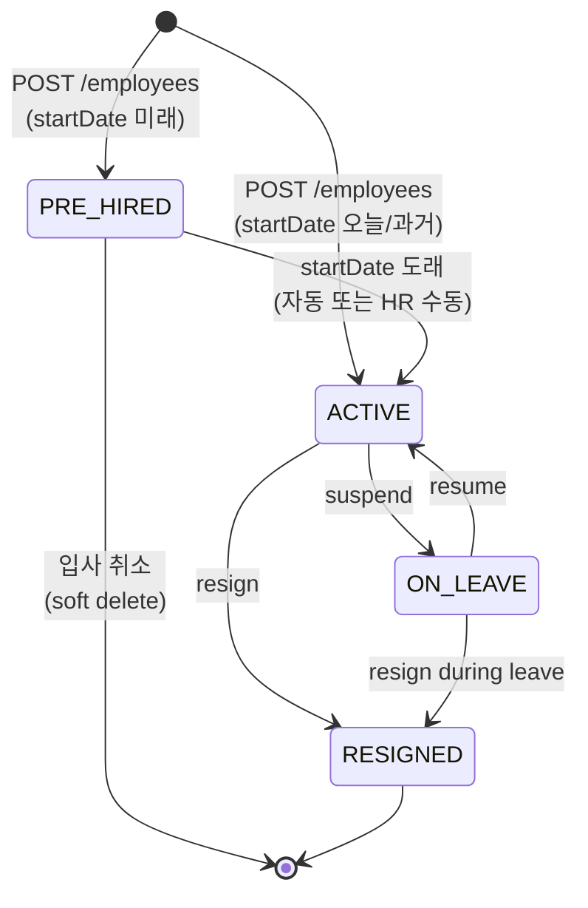
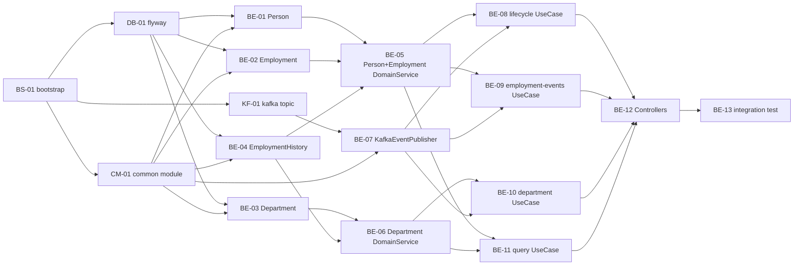

# TPM 분석 — employee-service (M1)

**분석 일자**: 2026-05-16
**대상**: hr-platform / employee-service 도메인 단일
**입력**: PRD 5.1·5.2·6.1·9.2·11.2·12.6 X1/X4·14.1 M1 + 사전 리뷰
**현재 상태**: 코드 0줄, Gradle 멀티모듈 미설정
**판정**: READY_FOR_TDD (PRD 보강 사항은 §10 미결 사항 참조)

---

## 1. 영향 범위

| 항목 | 내용 |
|---|---|
| 영향 서비스 | `hr-platform/employee-service` (신규, 코드 0줄) |
| 공통 인프라 | Gradle 멀티모듈 부트스트랩(선행), MySQL 8.0 + Flyway, Kafka(`event.hr.employee` 토픽), Redis(세션·캐시) |
| 외부 의존 | 없음 — auth-service는 별도 도메인(M1 동시 개발이나 본 분석 범위 외). 권한 검증은 JWT claim 검증으로 동기 처리, 퇴사 권한 회수는 Kafka 이벤트 비동기로 통보 |
| 빌드/배포 | GitHub Actions(가정), Kotlin 2.0.x + Spring Boot 3.3.x + JDK 21(M1 부트스트랩 티켓에서 확정) |

---

## 2. API 변경 (신규)

원본 11개 + 보강 11개 = **22개**.

### 2.1 직원 (Person + Employment)

| # | 메서드 | 경로 | 책임 | 권한 | 비고 |
|---|---|---|---|---|---|
| 1 | GET | `/employees` | 직원 목록(필터·페이지네이션·자동 범위 필터) | HR_MANAGER / ADMIN: 전사 / TEAM_LEAD: 자기 부서+자손 / EMPLOYEE: 본인만 | 자동 범위 필터 적용 |
| 2 | GET | `/employees/{id}` | 직원 상세(프로필 + 발령 이력 요약 임베드) | HR_MANAGER / ADMIN: 전체 / TEAM_LEAD: 자기 부서+자손 / EMPLOYEE: 본인만 | 마스킹: 비대상자 연봉·주민번호 숨김 |
| 3 | POST | `/employees` | 입사 등록 단건(Person+Employment) | HR_MANAGER / ADMIN | `employee.hired` 발행 |
| 4 | POST | `/employees/bulk` | **(신규)** CSV 일괄 입사 등록 | HR_MANAGER / ADMIN | X4 시나리오, 트랜잭션 전부 성공 or 전부 롤백, 결과 리포트 반환 |
| 5 | PATCH | `/employees/{id}` | 직원 정보 수정(HR 영역) | HR_MANAGER / ADMIN | 변경 필드별 이벤트 발행 매핑은 TDD에서 확정 |
| 6 | POST | `/employees/{id}/resign` | 퇴사 처리 | HR_MANAGER / ADMIN | `employee.resigned` 발행, status=RESIGNED |
| 7 | POST | `/employees/{id}/suspend` | **(신규)** 휴직 시작(ON_LEAVE 전이) | HR_MANAGER / ADMIN | `employee.suspended` 발행 |
| 8 | POST | `/employees/{id}/resume` | **(신규)** 복직(ON_LEAVE→ACTIVE) | HR_MANAGER / ADMIN | `employee.resumed` 발행 |
| 9 | GET | `/employees/me` | 내 정보 | 본인 | — |
| 10 | PATCH | `/employees/me` | 내 정보 수정(개인 영역만) | 본인 | personalEmail·phoneNumber만 |
| 11 | PATCH | `/employees/{id}/emergency-contacts` | **(신규)** 비상연락처 등록·수정 | 본인 / HR_MANAGER / ADMIN | Person에 emergencyContact* 필드 추가 |

### 2.2 발령 (EmploymentHistory)

| # | 메서드 | 경로 | 책임 | 권한 | 비고 |
|---|---|---|---|---|---|
| 12 | POST | `/employees/{id}/employment-events` | 발령 단건(승진/부서이동/연봉변경 등) | HR_MANAGER / ADMIN | eventType별로 적절한 `employee.*` 이벤트 발행 |
| 13 | POST | `/employees/{id}/employment-events/bulk` | **(신규)** CSV 발령 일괄 | HR_MANAGER / ADMIN | 트랜잭션 보장 |
| 14 | GET | `/employees/{id}/employment-events` | **(신규)** 발령 이력 페이지네이션 조회 | 본인 / TEAM_LEAD(자기 부서+자손) / HR_MANAGER / ADMIN | — |
| 15 | DELETE | `/employees/{id}/employment-events/{eventId}` | **(신규)** 발령 취소(soft delete + 보상 이벤트) | HR_MANAGER / ADMIN | 직전 발령만 취소 가능(TDD에서 확정) |

### 2.3 부서 (Department)

| # | 메서드 | 경로 | 책임 | 권한 | 비고 |
|---|---|---|---|---|---|
| 16 | GET | `/departments` | 부서 트리 조회(전체·subtree) | 전 사용자(인증 필수) | `?rootId=` 옵션 |
| 17 | POST | `/departments` | 부서 생성 | HR_MANAGER / ADMIN | — |
| 18 | PATCH | `/departments/{id}` | 부서 수정(name·order·parentId 이동) | HR_MANAGER / ADMIN | parentId 변경 시 path 재계산 + 사이클 검증, `department.changed` 발행 |
| 19 | PATCH | `/departments/{id}/head` | **(신규)** 부서장 변경 | HR_MANAGER / ADMIN | `department.head_changed` 발행 |
| 20 | DELETE | `/departments/{id}` | **(신규)** 부서 비활성(effectiveTo 설정) | HR_MANAGER / ADMIN | 산하 직원 존재 시 차단 |
| 21 | GET | `/departments/{id}` | **(신규)** 단일 부서 상세 | 전 사용자(인증 필수) | — |
| 22 | GET | `/departments/{id}/members` | **(신규)** 부서 소속 직원 목록 | TEAM_LEAD(자기·자손) / HR_MANAGER / ADMIN | 자동 범위 필터 적용 |

---

## 3. Kafka 변경 (신규 토픽)

| 항목 | 값 |
|---|---|
| 토픽명 | `event.hr.employee` (PRD 5.1 명명 규칙) |
| 파티션 | 12 (제안 — 직원 ID 해시 키 기반 순서 보장) |
| 보존 기간 | 7일 |
| 키 | `employmentId` (string) — `consumer_facade` + `kafka_topic_naming` 룰 준수 |
| 직렬화 | JSON (Avro/Schema Registry는 Phase 1.5에서 검토) |
| 시간 형식 | ISO-8601 ZonedDateTime UTC (`zoned_datetime` 룰) |

### 이벤트 페이로드 (5종 → **9종**)

| 이벤트 | 트리거 | 페이로드 핵심 필드 |
|---|---|---|
| `employee.hired` | POST /employees 성공 시(또는 PRE_HIRED→ACTIVE 전이 시) | employmentId, personId, departmentId, startDate, employmentType |
| `employee.resigned` | POST /employees/{id}/resign 성공 시 | employmentId, effectiveDate, reason |
| `employee.promoted` | employment-events eventType=PROMOTION | employmentId, oldPositionId, newPositionId, effectiveDate |
| `employee.transferred` | employment-events eventType=DEPT_CHANGE | employmentId, oldDepartmentId, newDepartmentId, oldManagerEmploymentId, newManagerEmploymentId, effectiveDate |
| `employee.salary_changed` | employment-events eventType=SALARY_CHANGE | employmentId, oldSalary, newSalary, effectiveDate(minorUnits) |
| `employee.suspended` | **(신규)** POST /employees/{id}/suspend | employmentId, reason, startedAt |
| `employee.resumed` | **(신규)** POST /employees/{id}/resume | employmentId, resumedAt |
| `department.changed` | **(신규)** PATCH /departments/{id} (name·parentId·order 변경) | departmentId, oldParentId, newParentId, oldPath, newPath |
| `department.head_changed` | **(신규)** PATCH /departments/{id}/head | departmentId, oldHeadEmploymentId, newHeadEmploymentId |

> 컨슈머: attendance / leave-approval / payroll / performance / notification(M2 이후 개발). M1 범위에서는 본 토픽의 producer만 구현하면 됩니다.

---

## 4. Employment 상태 머신 (PRD 누락 보강)



### 전이 규칙

| From → To | 트리거 | 이벤트 발행 | 비고 |
|---|---|---|---|
| ∅ → PRE_HIRED | POST /employees + startDate 미래 | (발행 안 함, ACTIVE 진입 시 발행) | 입사 예약 |
| ∅ → ACTIVE | POST /employees + startDate 오늘·과거 | `employee.hired` | 즉시 입사 |
| PRE_HIRED → ACTIVE | 배치 잡 일일 1회(startDate 도래) 또는 HR 수동 활성화 | `employee.hired` | M1 배치는 M2 영역 — M1은 HR 수동 활성화만 |
| PRE_HIRED → ∅(취소) | 입사 취소 API(M1 범위 외, 단순 DELETE soft) | — | M1: PATCH로 메모만, 정식 취소는 Phase 1.5 |
| ACTIVE → ON_LEAVE | POST /employees/{id}/suspend | `employee.suspended` | — |
| ON_LEAVE → ACTIVE | POST /employees/{id}/resume | `employee.resumed` | — |
| ACTIVE → RESIGNED | POST /employees/{id}/resign | `employee.resigned` | — |
| ON_LEAVE → RESIGNED | POST /employees/{id}/resign | `employee.resigned` | 휴직 중 퇴사 허용 |
| **금지 전이** | | | |
| PRE_HIRED → RESIGNED 직접 | — | — | PRE_HIRED 직원은 입사 취소(soft delete)로 처리 |
| RESIGNED → 어떤 상태도 | — | — | 재입사는 새 Employment 행 생성(같은 personId, 다른 employmentId) |
| PRE_HIRED → ON_LEAVE | — | — | 미입사 직원의 휴직 개념 없음 |

### 불변 조건

- `RESIGNED` 직원의 EmploymentHistory 추가 금지(읽기 전용)
- `RESIGNED` 직원의 departmentId·positionId·salary 수정 금지
- `Employment.endDate`는 RESIGN 시점에 설정, 이후 변경 불가
- 퇴사 즉시성(AC #3): API 호출 트랜잭션 커밋 시점 = `effectiveDate` 기본값. `employee.resigned` 발행 → auth-service가 Kafka consume → JWT refresh token 무효화(비동기). 단, 다음 인증 검증부터 Employment.status 직접 조회로 동기 차단(JWT 짧은 만료 + DB 검증 조합).

---

## 5. 도메인 분리 결정

### 5.1 서비스 단위
- **단일 서비스 (`employee-service`)** — Person·Employment·Department·EmploymentHistory를 하나의 BC(Bounded Context)로 묶습니다.
- 이유: PRD 5.2에서 employee가 "전체 시스템의 SSOT"로 정의되어 트랜잭션 경계가 함께 묶여야 합니다(예: 입사 등록은 Person+Employment 동시 생성).

### 5.2 내부 도메인 패키지 분리 (`be-code-convention.md`)

| 패키지 | Entity | 책임 |
|---|---|---|
| `domain.person` | Person | 불변 신원, 비상연락처 |
| `domain.employment` | Employment | 고용 인스턴스, 상태 머신, 발령 기록 트리거 |
| `domain.department` | Department | 조직 트리, path 머터리얼라이즈 |
| `domain.history` | EmploymentHistory | 발령 이력(불변 객체) |
| `domain.common` | BaseEntity, DomainEvent, DomainEventPublisher interface | 공통 |

### 5.3 도메인 간 참조 규칙
- Entity 직접 참조 금지 — **ID(Long)만 보유**(`be-code-convention.md` 규칙 준수)
  - 예: `Employment.personId: Long`, `Employment.departmentId: Long`, `Employment.managerEmploymentId: Long?`
- 도메인 패키지 간 import 금지(`domain.person` ↔ `domain.employment` 직접 import 금지)
- 도메인 간 협력은 `application` 레이어의 UseCase 또는 `domain.common`만 경유

### 5.4 module 구조 (Gradle)

```
hr-platform/
├── settings.gradle.kts
├── build.gradle.kts (root)
├── common/
│   ├── common-domain/      (BaseEntity, DomainEvent, DomainEventPublisher)
│   ├── common-infra/       (Kafka·Flyway·ZonedDateTime Jackson 설정)
│   └── common-web/         (Security·Error·자동 권한 필터)
└── employee-service/
    ├── domain/             (4개 도메인 패키지)
    ├── application/        (UseCase)
    ├── infrastructure/     (JPA·Kafka·QueryDSL)
    └── presentation/       (Controller·EventWorker)
```

> attendance/leave-approval/payroll/performance는 M2 이후. M1 부트스트랩은 employee-service 1개만 빌드 가능하면 됩니다.

---

## 6. 권한 매트릭스 (보강)

권한 룰 `usecase_domain_service` + `extensible_design` 적용. 권한 결정은 `common-web` 의 인터셉터에서 JWT claim(role, employmentId) + Department.path 비교로 처리합니다.

| API | EMPLOYEE | TEAM_LEAD | HR_MANAGER | ADMIN |
|---|:-:|:-:|:-:|:-:|
| GET /employees | 본인만 반환 | 자기 부서+자손 직원만 | 전사 | 전사 |
| GET /employees/{id} | 본인만 | 자기 부서+자손 | 전사(마스킹 없음) | 전사 |
| POST /employees | 403 | 403 | OK | OK |
| POST /employees/bulk | 403 | 403 | OK | OK |
| PATCH /employees/{id} | 403 | 403 | OK | OK |
| POST /employees/{id}/resign | 403 | 403 | OK | OK |
| POST /employees/{id}/suspend | 403 | 403 | OK | OK |
| POST /employees/{id}/resume | 403 | 403 | OK | OK |
| GET /employees/me | OK | OK | OK | OK |
| PATCH /employees/me | OK(personalEmail·phone) | OK | OK | OK |
| PATCH /employees/{id}/emergency-contacts | 본인만 | 403 | OK | OK |
| POST /employees/{id}/employment-events | 403 | 403 | OK | OK |
| POST /employees/{id}/employment-events/bulk | 403 | 403 | OK | OK |
| GET /employees/{id}/employment-events | 본인만 | 자기 부서+자손 | 전사 | 전사 |
| DELETE /employees/{id}/employment-events/{eventId} | 403 | 403 | OK | OK |
| GET /departments | OK(트리만, 직원 ID 미포함) | OK | OK | OK |
| POST /departments | 403 | 403 | OK | OK |
| PATCH /departments/{id} | 403 | 403 | OK | OK |
| PATCH /departments/{id}/head | 403 | 403 | OK | OK |
| DELETE /departments/{id} | 403 | 403 | OK | OK |
| GET /departments/{id} | OK | OK | OK | OK |
| GET /departments/{id}/members | 403 | 자기·자손만 | 전사 | 전사 |

**"팀"의 정의**: TEAM_LEAD는 자기가 head인 Department의 `path` 접두사로 매칭되는 모든 자손 부서 소속 직원을 볼 수 있습니다(material path prefix match).

**X3 자기 정보 수정(HR_MANAGER가 자기 연봉 수정)**: PATCH /employees/{id}에서 `id == 본인.employmentId && 변경 필드 ∈ {salary, position}` 조건에 audit log 추가 + CFO 알림 이벤트 발행. UseCase 내부 가드로 처리(별도 API 분리 안 함).

---

## 7. 티켓 목록 (1명 / 1일 / 1PR)

| ID | 제목 | 카테고리 | 사이즈 | 선행 | 후행 카운트 | 비고 |
|---|---|---|:-:|---|:-:|---|
| BS-01 | infra-bootstrap (Gradle 멀티모듈 골격 + 버전 카탈로그 + 루트 build.gradle.kts + settings.gradle.kts + Spotless·detekt·Kotest 설정) | infra | M | — | 3 | 병목(공통 빌드 인프라) |
| DB-01 | Flyway employee 스키마 마이그레이션 V1__init.sql (person, employment, department, employment_history 4개 테이블 + 인덱스) | db | M | BS-01 | 4 | 병목(공통 DB 스키마) |
| KF-01 | Kafka 토픽 Terraform `event.hr.employee` 12 partition · retention 7d | kafka | S | BS-01 | 1 | 병목(Producer 작업이 모두 이 토픽 필요) |
| CM-01 | 공통 모듈 골격 (common-domain: BaseEntity·DomainEvent·DomainEventPublisher interface / common-infra: ZonedDateTime Jackson·Flyway·Kafka 설정 / common-web: Security 필터·자동 범위 권한 인터셉터·Error 핸들러) | common | M | BS-01 | 7 | 병목(모든 도메인이 import) |
| BE-01 | Person Entity + PersonJpaRepository + PersonRepository interface (Rich Domain: changeContact·validatePersonalEmailFormat·비상연락처 메서드) | domain | S | DB-01, CM-01 | 1 | 도메인 패키지 신규 — 같은 wave 내 다른 BE-0x와 파일 교집합 ∅ |
| BE-02 | Employment Entity + EmploymentJpaRepository + EmploymentRepository interface (Rich Domain: 상태 머신·hire·resign·suspend·resume·promote·transfer·changeSalary·assignManager + EmploymentStatus enum.canTransitTo) | domain | L | DB-01, CM-01 | 2 | 동 |
| BE-03 | Department Entity + DepartmentJpaRepository + DepartmentRepository interface (Rich Domain: moveTo·assignHead·recalculatePath·validateNoCircularReference·deactivate + DepartmentQueryDslRepositoryImpl 트리 조회) | domain | L | DB-01, CM-01 | 2 | 동 |
| BE-04 | EmploymentHistory Entity + EmploymentHistoryJpaRepository + Repository interface (불변 객체 · 정적 팩토리 record / eventType별 payload 표준 enum + JsonStringType 매핑) | domain | M | DB-01, CM-01 | 2 | 동 |
| BE-05 | PersonDomainService + EmploymentDomainService (hire·resign·suspend·resume·promote·transfer·changeSalary·assignManager 오케스트레이션 + DomainEventPublisher 호출) | domain-service | L | BE-01, BE-02, BE-04 | 3 | |
| BE-06 | DepartmentDomainService (CRUD + parentId 이동 + 부서장 변경 + 자손 path 재계산 + 사이클 검증) | domain-service | M | BE-03, BE-04 | 2 | |
| BE-07 | KafkaDomainEventPublisher 구현 (common-domain interface의 infra 구현, `event.hr.employee` 토픽 매핑, ZonedDateTime UTC 직렬화) | infrastructure | M | KF-01, CM-01 | 2 | |
| BE-08 | UseCase: HireEmployeeUseCase + ResignEmployeeUseCase + SuspendEmployeeUseCase + ResumeEmployeeUseCase (단일 직원 라이프사이클) | application | M | BE-05, BE-07 | 1 | |
| BE-09 | UseCase: 발령 단건/일괄 (RegisterEmploymentEventUseCase + BulkRegisterEmploymentEventUseCase + CancelEmploymentEventUseCase) + CSV 파서 (직원 일괄 입사 BulkHireEmployeeUseCase 포함) | application | L | BE-05, BE-07 | 1 | X4 트랜잭션 보장 |
| BE-10 | UseCase: 부서 CRUD + 이동 + 부서장 변경 + 비활성 (CreateDepartmentUseCase / UpdateDepartmentUseCase / ChangeDepartmentHeadUseCase / DeactivateDepartmentUseCase) | application | M | BE-06, BE-07 | 1 | |
| BE-11 | UseCase: 조회 (ListEmployeesUseCase·GetEmployeeUseCase·GetEmploymentHistoryUseCase·GetDepartmentTreeUseCase·GetDepartmentMembersUseCase) + 권한 자동 범위 필터 어댑터 | application | M | BE-05, BE-06 | 1 | TEAM_LEAD path prefix 필터 |
| BE-12 | Presentation: EmployeeApiController + DepartmentApiController + 권한 인터셉터 연결 (모든 22개 API 라우팅) | presentation | L | BE-08, BE-09, BE-10, BE-11 | 1 | wave 단독 — 공통 Controller 파일 |
| BE-13 | 통합 테스트 (Testcontainers MySQL+Kafka): 시나리오 X1(퇴사 → resigned 이벤트 + 진행 발령 중단) + X4(100명 일괄 입사 트랜잭션) + AC #1~#5 전체 | test | L | BE-12 | 0 | E2E 시나리오 |

**총 16개 티켓** (BS-01, DB-01, KF-01, CM-01, BE-01~13).

### 7.1 사이즈 합산 (참고)
- S=1, M=8, L=7. 평균 1명/1~2일 환산 시 약 25 PR-day. 4인 팀 기준 7일 wave 스케줄 가능.

### 7.2 패키지 이전 티켓 자동 reject 체크
- 본 분석은 신규 도메인이므로 패키지 이전 티켓 없음. `typealias` 호환 layer 없음.

---

## 8. 의존 그래프 (DAG)

| 티켓 | 선행 | 후행 카운트 | 비고 |
|---|---|:-:|---|
| BS-01 | — | 3 | 병목(루트 빌드) |
| DB-01 | BS-01 | 4 | 병목(공통 스키마) |
| KF-01 | BS-01 | 1 | 단일 — BE-07만 의존 |
| CM-01 | BS-01 | 7 | 병목(모든 도메인 import) |
| BE-01 | DB-01, CM-01 | 1 | |
| BE-02 | DB-01, CM-01 | 2 | |
| BE-03 | DB-01, CM-01 | 2 | |
| BE-04 | DB-01, CM-01 | 2 | |
| BE-05 | BE-01, BE-02, BE-04 | 3 | |
| BE-06 | BE-03, BE-04 | 2 | |
| BE-07 | KF-01, CM-01 | 2 | |
| BE-08 | BE-05, BE-07 | 1 | |
| BE-09 | BE-05, BE-07 | 1 | |
| BE-10 | BE-06, BE-07 | 1 | |
| BE-11 | BE-05, BE-06 | 1 | |
| BE-12 | BE-08, BE-09, BE-10, BE-11 | 1 | wave 단독(공통 Controller) |
| BE-13 | BE-12 | 0 | 단독 |

### 8.1 초기 ready 셋 (Wave 1)
- **BS-01** (단독)

### 8.2 위상정렬 시뮬레이션 (참고)

```
Wave 1: BS-01                              (너비 1)
Wave 2: DB-01, KF-01, CM-01                 (너비 3)
Wave 3: BE-01, BE-02, BE-03, BE-04          (너비 4) — 도메인 패키지 신규 생성, 파일 교집합 ∅
Wave 4: BE-05, BE-06, BE-07                 (너비 3) — BE-05·BE-06은 서로 다른 DomainService 파일, BE-07은 infra 파일
Wave 5: BE-08, BE-09, BE-10, BE-11          (너비 4) — UseCase 4개 모두 다른 application 파일
Wave 6: BE-12                               (너비 1) — Controller 공통 파일 단독
Wave 7: BE-13                               (너비 1) — 통합 테스트 단독
```

**Fan-out 통계**
- 평균 wave 너비: (1+3+4+3+4+1+1) / 7 ≈ **2.43**
- 최대 wave 너비: **4** (Wave 3·Wave 5)
- 직선화 비율: 3/7 ≈ **43%** (Wave 1·6·7)
- 4인 팀 가동률(평균 너비 ÷ 4): 약 **61%** — `ticket-guide.md`의 "70% 이상" 기준에 살짝 미달하나, Wave 3·5의 너비 4가 보장되어 피크에서는 100% 가동. 직선화 wave(부트스트랩·공통 컨트롤러·통합 테스트)는 본질적 병목으로 추가 분해 어려움.

### 8.3 Single Writer per File 검증

| Wave | 티켓 | 수정 파일 집합 | 교집합 |
|---|---|---|---|
| 2 | DB-01 | `common/db/migration/V1__init.sql` | — |
| 2 | KF-01 | `infra/terraform/topics.tf` (다른 레포) | — |
| 2 | CM-01 | `common/common-{domain,infra,web}/*` 신규 | — |
| 3 | BE-01~04 | 각각 `domain/{person,employment,department,history}/*` 신규 패키지 | ∅ |
| 4 | BE-05 | `domain/employment/EmploymentDomainService.kt` 등 | — |
| 4 | BE-06 | `domain/department/DepartmentDomainService.kt` | — |
| 4 | BE-07 | `infrastructure/kafka/KafkaDomainEventPublisher.kt` | — |
| 5 | BE-08~11 | 각각 `application/{lifecycle,event,department,query}/*` 신규 | ∅ |
| 6 | BE-12 | `presentation/api/{EmployeeApiController,DepartmentApiController}.kt` | — |
| 7 | BE-13 | `src/test/.../integration/*` | — |

**같은 wave 내 파일 교집합 ∅ 모두 확인.** Wave 5에서 UseCase 4개는 패키지 분리(`lifecycle`, `event`, `department`, `query`)로 충돌 없음.

### 8.4 시각화 (Mermaid)



---

## 9. 누락·리스크

| # | 항목 | 영향 | 완화 |
|---|---|---|---|
| R1 | PRE_HIRED → ACTIVE 자동 전이 배치 잡 | M1 범위 명확치 않음. 사전 리뷰는 M1에서 HR 수동 활성화만 권고 | TDD에서 "M1: 수동 활성화 / M2: 일배치" 명시 |
| R2 | EmploymentHistory.oldValue/newValue JSON 스키마 | eventType별 페이로드 형식 컨슈머 합의 필요 | TDD에 eventType별 표준 JSON 스키마 표 추가 |
| R3 | Position 엔티티 미정의 | Employment.positionId가 참조하는 Position 엔티티가 PRD에 없음 | M1: 단순 VARCHAR `positionTitle` 컬럼으로 시작, Position 엔티티는 M2(payroll 직급 체계 함께) — TDD에서 결정 |
| R4 | auth-service와의 권한 회수 동기/비동기 | X1 "즉시" 검증 메커니즘 | 본 분석: Kafka 비동기 통보 + Employment.status 동기 검증 조합. TDD에 JWT 만료 시간(15분 권고) 명시 |
| R5 | Person PII 컬럼(주민번호·외국인등록번호) | 10.2 컬럼 단위 암호화는 페이슬립·급여 한정 | M1: PII 컬럼 미보유(취업규칙·근로계약 영역). Phase 1.5 보강 |
| R6 | Department.path 형식 | 슬래시 구분 ID `/1/3/7/` 권고. 길이 제한 1024 | TDD에서 확정 |
| R7 | 발령 취소(DELETE /employment-events/{eventId})의 보상 이벤트 | 잘못 발행된 `employee.transferred`를 어떻게 취소 통보? | TDD에서 "직전 발령만 취소 가능 + `employee.*.cancelled` 이벤트 발행" 정책 결정 |
| R8 | X3 자기 연봉 수정 알림 | CFO 알림은 notification-service(M3) 미존재 | M1: audit log + Kafka 이벤트(`employee.salary_changed_by_self`) 발행만, 실제 알림 채널은 M3 |

---

## 10. 미결 사항 (PM/PO 확인)

사전 리뷰 §종합 판정 A 항목 중 본 TPM 분석에서 합리적 디폴트로 진행했으나 PM/PO 승인이 필요한 항목입니다.

1. **Position 엔티티 도입 시점** — M1 미도입, `Employment.positionTitle: String` 컬럼으로 시작. payroll 연계 시 M2에서 정식 엔티티 분리. (TDD 진행 차단 사항 아님)
2. **퇴사 즉시성 메커니즘** — JWT 15분 만료 + Employment.status 매 요청 동기 검증 + `employee.resigned` Kafka 비동기. 본 정책으로 진행해도 되는지 확인.
3. **EmploymentHistory JSON 페이로드 표준** — TDD에 eventType별 표준 스키마를 작성합니다. PM/PO 확인은 분석가가 BE 산출 후 검수.
4. **발령 취소 정책** — "직전 발령만 취소 가능 + soft delete + 보상 이벤트(`employee.*.cancelled`) 발행"으로 결정. 정정(잘못된 정보 재입력)은 별도 신규 발령으로 처리.
5. **PRE_HIRED → ACTIVE 자동 활성화** — M1은 HR 수동 활성화만, 일배치는 M2 attendance 함께 도입.
6. **Person 변경 시 이벤트 발행 정책** — `Person.name`·`personalEmail`·`phoneNumber` 변경 시 별도 이벤트 미발행(개인 정보 변경은 audit log만). 다른 도메인이 Person을 참조하지 않으므로 통보 불요.

---

## 11. 다음 단계

1. **Step 1-D (TDD 작성)** — 본 분석의 §4 상태 머신·§5 도메인 분리·§6 권한 매트릭스·§7 티켓 목록을 TDD 템플릿(`rules/tdd-template.md`)에 맞춰 정식 작성. ERD·Component Diagram·Sequence Diagram 포함.
2. **Step 2 (티켓 분해 및 Jira 등록)** — 본 분석 §7의 16개 티켓을 `rules/ticket-guide.md` 형식으로 md 파일 16개 생성. Jira 의존 링크 연결(`is blocked by`).
3. **Wave 1 스폰** — `BS-01`을 `infra` 담당 서브에이전트(또는 BE 담당이 겸업)에 단독 fan-out. 머지 완료 후 Wave 2 3개 동시 스폰.
4. **PR 가이드** — `rules/pr-guide.md` 준수. 브랜치 prefix는 `feat/HR-XXXX` 또는 프로젝트 접두사 확정 후 적용.

---

> **완료 단언 가드 (`rules/COMPLETION-RULE.md` 적용)**: 본 산출물은 분석 단계의 정적 산출물입니다. 코드 변경·서브에이전트 호출·빌드·테스트는 본 분석 범위 외이며, 위 §11 다음 단계 진입 시 메인 오케스트레이터가 후속 wave에서 진행합니다.
