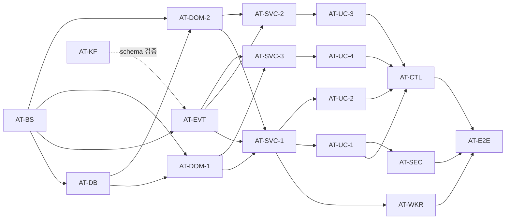

## TPM 분석 — hr-platform/auth-service (MVP)

### 요약
hr-platform 7 도메인 중 인증·인가를 담당하는 신규 auth-service 모듈을 추가합니다. UserAccount를 SSOT로 보유하고 employee-service의 `event.hr.employee.v1` 이벤트를 구독해 자동 동기화하며, 15개 REST API(공개 5 + 본인 6 + 관리자 4)와 신규 토픽 `event.hr.auth.v1`에 11종 DomainEvent를 발행합니다. 비밀번호 bcrypt(cost 12) + JWT(jjwt) + TOTP 2FA + 잠금/세션 정책을 모두 포함합니다.

### 영향 서비스
| 서비스 | 레포 | 변경 유형 |
|---|---|---|
| auth-service | hr-platform | 신규 모듈 (settings.gradle.kts include) |
| infrastructure/kafka | hr-platform | 토픽 1쌍 + 11 JSON Schema 추가 |
| employee-service | hr-platform | 변경 없음 (이벤트 발행/구독 변동 없음, AuthEmploymentIdArgumentResolver는 그대로 유지하되 향후 JWT 검증 필터로 대체 가능 — 본 MVP 범위 외) |

> **선행 main 머지본**: employee-service M1(Person·Employment·Department·EmploymentHistory + KafkaDomainEventPublisher + `event.hr.employee.v1` 토픽)이 이미 완료되어 있어 auth는 단순 구독자 입장으로 추가됩니다.

### API 변경 목록
신규 15개 — 영향 Consumer는 모두 FE(MVP 시점) + 외부 API client(AT-API-04~05).

| 경로 | 메서드 | 유형 | 권한 | 영향 Consumer |
|---|---|---|---|---|
| /auth/login | POST | 신규 | public | FE |
| /auth/logout | POST | 신규 | 인증 필요 | FE |
| /auth/refresh | POST | 신규 | refresh 토큰 | FE |
| /auth/password-reset/request | POST | 신규 | public | FE |
| /auth/password-reset/confirm | POST | 신규 | reset 토큰 | FE |
| /auth/2fa/enroll | POST | 신규 | 인증 필요 | FE |
| /auth/2fa/verify | POST | 신규 | 로그인 challenge 토큰 | FE |
| /auth/me | GET | 신규 | 인증 필요 | FE |
| /auth/password/change | POST | 신규 | 인증 필요 | FE |
| /auth/roles | GET | 신규 | HR_MANAGER+ | FE |
| /auth/users/{id}/roles | POST | 신규 | HR_MANAGER+ | FE |
| /auth/users/{id}/unlock | POST | 신규 | HR_MANAGER+ | FE |
| /auth/users/{id}/sessions/logout-all | POST | 신규 | HR_MANAGER+ | FE |
| /auth/api-tokens | POST | 신규 | HR_MANAGER+ | 외부 API client |
| /auth/api-tokens/{id} | DELETE | 신규 | HR_MANAGER+ | 외부 API client |

### Kafka 변경 목록
| 토픽 | 유형 | Producer | Consumer | 비고 |
|---|---|---|---|---|
| `event.hr.auth.v1` | 신규 | auth-service | (외부 — 알림/감사) | KF-02와 동일 정책 (retention 7d, lz4, ISR=2) |
| `event.hr.auth.v1.dlq` | 신규 | auth-service | — | DLQ, 30d retention |
| `event.hr.employee.v1` | 구독 추가 | (변경 없음) | **auth-service 신규 추가** | 4종 이벤트만 처리 (Hired/Resigned/Suspended/Resumed) |

**발행 이벤트 11종 (action+state 규약 준수)**:

| eventType | aggregateType | action.type | state.status | 발생 시점 |
|---|---|---|---|---|
| UserCreated | UserAccount | CREATE | ACTIVE | employee.hired 수신 후 |
| UserLocked | UserAccount | LOCK | LOCKED | 비밀번호 5회 실패 |
| UserUnlocked | UserAccount | UNLOCK | ACTIVE | 관리자 수동 / 15분 백오프 자동 |
| UserSuspended | UserAccount | SUSPEND | SUSPENDED | employee.suspended 수신 후 |
| UserReactivated | UserAccount | REACTIVATE | ACTIVE | employee.resumed 수신 후 |
| UserDeactivated | UserAccount | DEACTIVATE | DEACTIVATED | employee.resigned 수신 후 |
| UserRoleAssigned | UserAccount | ASSIGN_ROLE | ACTIVE | 역할 할당 API |
| UserRoleRevoked | UserAccount | REVOKE_ROLE | ACTIVE | 역할 취소 API |
| UserPasswordChanged | UserAccount | CHANGE_PASSWORD | ACTIVE | 본인 변경 / 재설정 |
| UserTwoFactorEnrolled | UserAccount | ENROLL_2FA | ACTIVE | 2FA enroll |
| UserTwoFactorDisabled | UserAccount | DISABLE_2FA | ACTIVE | 2FA 비활성 |

### UserAccount 상태 머신
```
[*] ─create→ ACTIVE ─lock(5회 실패)→ LOCKED ─unlock(수동/15분)→ ACTIVE
            ├─suspend→ SUSPENDED ─reactivate→ ACTIVE
            └─deactivate→ DEACTIVATED (종착, 재활성 불가)
```

전이 규칙은 `UserAccountStatus.canTransitTo(target)` enum 내부에 캡슐화. DEACTIVATED는 종착 상태로 어떤 전이도 거부.

### 권한 매트릭스 (역할 × 기능)
| 기능 | EMPLOYEE | TEAM_LEAD | HR_MANAGER | ADMIN |
|---|:-:|:-:|:-:|:-:|
| 로그인/로그아웃 | ● | ● | ● | ● |
| 자기 정보 보기 (/auth/me) | ● | ● | ● | ● |
| 자기 비밀번호 변경 | ● | ● | ● | ● |
| 2FA 등록 (자기) | ● | ● | ● | ● |
| 팀원 정보 보기 | ○ | ● | ● | ● |
| 전체 직원 정보 보기 | ○ | ○ | ● | ● |
| 역할 할당 | ○ | ○ | ● | ● |
| 계정 잠금/해제 | ○ | ○ | ● | ● |
| 세션 강제 종료 (타인) | ○ | ○ | ● | ● |
| 권한·역할 관리 | ○ | ○ | ◐(HR/EMP만) | ● |
| API 토큰 발급 | ○ | ○ | ● | ● |

> ◐ HR_MANAGER는 EMPLOYEE/TEAM_LEAD에 한정해 역할 변경 가능, ADMIN 역할은 ADMIN만 부여 가능 (티켓 AT-SVC-3 비즈니스 규칙).

### 티켓 목록
| 번호 | 제목 | 레포 | 담당 | 크기 | 선행 |
|---|---|---|---|:-:|---|
| AT-BS | auth-service 모듈 부트스트랩 (build.gradle.kts + Application + application.yml + settings.gradle.kts include) | hr-platform | BE | S | — |
| AT-DB | Flyway V1__create_auth_tables.sql (7 테이블 + 인덱스) | hr-platform | DB | M | AT-BS |
| AT-KF | Kafka 토픽 `event.hr.auth.v1` + DLQ Terraform + 11 JSON Schema | hr-platform | Infra | S | — |
| AT-DOM-1 | UserAccount + Role + UserAccountRole Entity + Repository + 상태 머신 enum | hr-platform | BE | M | AT-DB |
| AT-DOM-2 | RefreshToken + LoginAttempt + TwoFactorBackupCode + ApiToken Entity + Repository | hr-platform | BE | M | AT-DB |
| AT-EVT | 11종 DomainEvent (UserCreated/Locked/Unlocked/Suspended/Reactivated/Deactivated/RoleAssigned/RoleRevoked/PasswordChanged/TwoFactorEnrolled/TwoFactorDisabled) | hr-platform | BE | S | AT-BS |
| AT-SVC-1 | AuthDomainService (로그인/잠금/패스워드 검증) + PasswordHasher + JwtIssuer | hr-platform | BE | M | AT-DOM-1, AT-DOM-2, AT-EVT |
| AT-SVC-2 | TwoFactorDomainService (TOTP enroll/verify + 백업코드) + ApiTokenDomainService (발급/폐기) | hr-platform | BE | M | AT-DOM-2, AT-EVT |
| AT-SVC-3 | RoleDomainService (역할 할당/취소 + 부여 권한 비즈니스 규칙) + AccountAdminDomainService (잠금 해제/세션 강제 종료) | hr-platform | BE | M | AT-DOM-1, AT-EVT |
| AT-WKR | EmployeeEventWorker (Hired/Resigned/Suspended/Resumed 구독 + UserAccountSyncUseCase 호출) | hr-platform | BE | M | AT-SVC-1 |
| AT-UC-1 | UseCase: Login + Logout + RefreshToken + Me | hr-platform | BE | M | AT-SVC-1 |
| AT-UC-2 | UseCase: PasswordResetRequest + PasswordResetConfirm + PasswordChange | hr-platform | BE | M | AT-SVC-1 |
| AT-UC-3 | UseCase: TwoFactorEnroll + TwoFactorVerify + ApiTokenIssue + ApiTokenRevoke | hr-platform | BE | M | AT-SVC-2 |
| AT-UC-4 | UseCase: ListRoles + AssignRole + UnlockUser + LogoutAllSessions | hr-platform | BE | M | AT-SVC-3 |
| AT-CTL | AuthApiController(/auth/*) + MyAuthController(/auth/me, /auth/password/change, /auth/2fa/*) + AdminAuthController(/auth/users/* + /auth/roles + /auth/api-tokens/*) + ApiError 매핑 | hr-platform | BE | M | AT-UC-1, AT-UC-2, AT-UC-3, AT-UC-4 |
| AT-SEC | JwtAuthenticationFilter + SecurityFilterChain + AuthPrincipalArgumentResolver (employee의 `X-Employment-Id` stub를 대체하지 않고 auth-service 내부에서만 적용, employee의 stub는 그대로 둠) | hr-platform | BE | M | AT-UC-1 |
| AT-E2E | E2E 시나리오 테스트 (로그인→리프레시→로그아웃 / 5회 실패 잠금→15분 자동해제 / 2FA enroll→verify / 역할 변경 후 메뉴 권한 반영 / employee.hired 수신→UserAccount 생성) | hr-platform | BE | M | AT-CTL, AT-SEC, AT-WKR |

총 17 티켓 (M 12개, S 3개, L 0개 — 1명/1일/1PR 목표 부합, L 분할 권고 적용됨).

### 티켓 상세

**AT-BS — auth-service 모듈 부트스트랩**
- 레포: hr-platform / 담당: BE / 크기: S / 선행: —
- 배경: 신규 도메인 모듈 추가. 빌드/실행 가능한 빈 컨테이너부터 만들어 후속 티켓이 모두 컴파일·테스트 가능하도록 합니다.
- 작업 범위:
  - [ ] `settings.gradle.kts`에 `include("auth-service")` 추가
  - [ ] `auth-service/build.gradle.kts` 작성 (employee-service와 동일 구조 + jjwt 0.12.6 + spring-boot-starter-security + spring-boot-starter-data-redis)
  - [ ] `AuthServiceApplication.kt`, `application.yml`, `application-local.yml`, `application-test.yml`
  - [ ] `com.hrplatform.auth` base 패키지 + `domain/application/infrastructure/presentation` 4 레이어 디렉토리
  - [ ] core, common-kafka 모듈 의존 추가
- 완료 기준: `./gradlew :auth-service:bootRun` 시 8081 포트로 기동되며, `./gradlew :auth-service:test` 시 SmokeTest 1건이 통과한다.

**AT-DB — Flyway V1__create_auth_tables.sql**
- 레포: hr-platform / 담당: DB / 크기: M / 선행: AT-BS
- 배경: 7개 테이블 + 인덱스를 단일 마이그레이션으로 생성합니다. employee-service의 Flyway 마이그레이션과 별도 디렉토리(`auth-service/src/main/resources/db/migration/`).
- 작업 범위:
  - [ ] `user_accounts` (id, employment_id, company_id, email UNIQUE, password_hash, status, failed_login_attempts, locked_until, last_login_at, two_factor_enabled, two_factor_secret, audit 6컬럼, deleted_at)
  - [ ] `roles` (id, company_id, code, name, description, is_system_role, audit)
  - [ ] `user_account_roles` (id, user_account_id, role_id, assigned_at, assigned_by, audit, UNIQUE(user_account_id, role_id))
  - [ ] `refresh_tokens` (id, user_account_id, token_hash UNIQUE, expires_at, device_info, ip_address, revoked_at, audit)
  - [ ] `login_attempts` (id, user_account_id NULLABLE, email, attempted_at, success, failure_reason, ip_address, user_agent — append-only, INDEX(email, attempted_at))
  - [ ] `two_factor_backup_codes` (id, user_account_id, code_hash, used_at, audit)
  - [ ] `api_tokens` (id, user_account_id, name, token_hash UNIQUE, scopes JSON, expires_at, last_used_at, revoked_at, audit)
  - [ ] `roles` 시드 INSERT (EMPLOYEE/TEAM_LEAD/HR_MANAGER/ADMIN, is_system_role=true) — companyId별 시드 시점은 별도 결정(미결사항 Q1)
- 완료 기준: TestContainers MySQL 기동 시 Flyway가 성공하고, `SHOW TABLES`가 정확히 7개를 반환한다.

**AT-KF — Kafka 토픽 Terraform + 11 JSON Schema**
- 레포: hr-platform / 담당: Infra / 크기: S / 선행: —
- 배경: employee의 KF-02 패턴과 동일하게 신규 토픽 + DLQ 1쌍을 추가하고, 11종 이벤트의 JSON Schema를 작성합니다.
- 작업 범위:
  - [ ] `infrastructure/kafka/main.tf`에 `kafka_topic.event_hr_auth_v1` + `kafka_topic.event_hr_auth_v1_dlq` 리소스 추가 (employee 토픽과 동일 설정)
  - [ ] `infrastructure/kafka/schemas/auth/` 디렉토리 + 11 JSON Schema 파일 (user.created.json, user.locked.json, user.unlocked.json, user.suspended.json, user.reactivated.json, user.deactivated.json, user.role_assigned.json, user.role_revoked.json, user.password_changed.json, user.two_factor_enrolled.json, user.two_factor_disabled.json)
  - [ ] 각 schema는 employee.hired.json 구조를 그대로 따름 (eventId/eventType/eventVersion=1/occurredAt/aggregateType=UserAccount/action/state)
  - [ ] `infrastructure/kafka/README.md` 업데이트
- 완료 기준: `terraform plan`이 두 토픽 신규 리소스만 보여주며 unintended diff가 없고, JSON Schema 11개가 `draft-07` 검증을 통과한다.

**AT-DOM-1 — UserAccount + Role + UserAccountRole**
- 레포: hr-platform / 담당: BE / 크기: M / 선행: AT-DB
- 배경: 핵심 인증 SSOT 엔티티. Rich Domain Model로 상태 전이/로그인 시도/잠금 로직을 Entity 내부에 캡슐화합니다.
- 작업 범위:
  - [ ] `UserAccount @Entity` (BaseEntity 상속, `recordFailedLogin()`, `recordSuccessfulLogin()`, `lock(until)`, `unlock()`, `suspend()`, `reactivate()`, `deactivate()`, `changePassword(hash)`, `enable2fa(secret)`, `disable2fa()` — 모두 도메인 메서드 + 도메인 이벤트 추가)
  - [ ] `UserAccountStatus` enum (`canTransitTo` 포함) — 4상태 + 전이 규칙
  - [ ] `Role @Entity` + `RoleCode` enum (EMPLOYEE/TEAM_LEAD/HR_MANAGER/ADMIN)
  - [ ] `UserAccountRole @Entity` (M:N 매핑, assignedBy audit)
  - [ ] Repository interface (domain layer) + JpaRepository + CustomRepositoryImpl (QueryDSL, `findByEmail`, `findActiveByCompany`)
  - [ ] `two_factor_secret` AES-256-GCM 컬럼 컨버터 (employee의 `AesGcmStringConverter` 재사용)
- 완료 기준: `UserAccount` BehaviorSpec 단위 테스트가 12종 전이/잠금/2FA enroll 시나리오를 모두 통과한다.

**AT-DOM-2 — RefreshToken + LoginAttempt + TwoFactorBackupCode + ApiToken**
- 레포: hr-platform / 담당: BE / 크기: M / 선행: AT-DB
- 배경: 인증 부산물(토큰/로그/백업코드) Entity. 모두 단일 사용 또는 append-only 규칙을 Entity 내부에 캡슐화.
- 작업 범위:
  - [ ] `RefreshToken @Entity` (`rotate()`, `revoke()`, `isExpired()`)
  - [ ] `LoginAttempt @Entity` (append-only, 정적 팩터리 `success(...)` / `failure(...)`)
  - [ ] `TwoFactorBackupCode @Entity` (`use()` — 1회 사용 후 usedAt 기록)
  - [ ] `ApiToken @Entity` (`revoke()`, `recordUse()`, `isExpired()`)
  - [ ] 각 Repository interface + JpaRepository + 필요한 CustomRepositoryImpl (`countRecentFailures(email, since)` 등)
- 완료 기준: 각 Entity의 단위 테스트(이중 사용 방지/만료/revoke)가 모두 통과한다.

**AT-EVT — 11 DomainEvent**
- 레포: hr-platform / 담당: BE / 크기: S / 선행: AT-BS
- 배경: action+state 규약을 따르는 11종 DomainEvent 데이터 클래스를 생성합니다. core 모듈의 `DomainEvent` 추상을 구현하고 KafkaDomainEventPublisher가 envelope으로 직렬화합니다.
- 작업 범위:
  - [ ] `com.hrplatform.auth.domain.event` 패키지에 11종 DomainEvent data class
  - [ ] 각 이벤트는 AT-KF의 JSON Schema와 1:1 매칭 (eventType/action.type/state.status/snapshot 필드 정합)
  - [ ] core `DomainEventAction` / `DomainEventState`를 활용해 envelope 변환 검증 테스트 1종 추가
- 완료 기준: 각 DomainEvent → `DomainEventEnvelope.from()` 변환 결과가 AT-KF의 JSON Schema 11종을 모두 통과한다(테스트로 검증).

**AT-SVC-1 — AuthDomainService + PasswordHasher + JwtIssuer**
- 레포: hr-platform / 담당: BE / 크기: M / 선행: AT-DOM-1, AT-DOM-2, AT-EVT
- 배경: 로그인 핵심 비즈니스 로직. 비밀번호 검증, 실패 카운팅, 5회 잠금, 잠금 알림 이벤트, JWT 발급/검증을 한 도메인 서비스에 집중합니다. UseCase는 이 서비스만 호출.
- 작업 범위:
  - [ ] `AuthDomainService.authenticate(email, password)` — UserAccount 조회 → 잠금 상태 확인 → bcrypt 검증 → 성공/실패 처리 → DomainEvent 적재
  - [ ] `AuthDomainService.issueTokens(userAccount, deviceInfo)` — access/refresh 발급 + RefreshToken 저장
  - [ ] `AuthDomainService.refresh(refreshToken)` — 검증 + rotate
  - [ ] `AuthDomainService.logout(userAccount, refreshToken)` — refresh revoke + Redis blacklist(jti)
  - [ ] `PasswordHasher` (bcrypt cost 12 wrapper)
  - [ ] `JwtIssuer` / `JwtVerifier` (jjwt 0.12.6, access 30분 / refresh 14일)
  - [ ] `RedisJtiBlacklist` (spring-boot-starter-data-redis, TTL=token remaining)
  - [ ] `DomainEventPublisher.publishAll()`로 이벤트 발행
- 완료 기준: 통합 테스트(TestContainers MySQL+Redis)에서 5회 연속 실패 시 6번째 시도가 `AccountLockedException`을 던지고 `UserLocked` 이벤트가 발행되며 알림 큐에 적재된다.

**AT-SVC-2 — TwoFactorDomainService + ApiTokenDomainService**
- 레포: hr-platform / 담당: BE / 크기: M / 선행: AT-DOM-2, AT-EVT
- 배경: 2FA TOTP + 백업코드 + 외부 API 토큰 발급/폐기 로직. AuthDomainService와 독립적으로 동작합니다.
- 작업 범위:
  - [ ] `TwoFactorDomainService.enroll(userAccount)` — TOTP secret 생성 + QR provisioning URI + 백업코드 5개 발급
  - [ ] `TwoFactorDomainService.verify(userAccount, code)` — TOTP/백업코드 매칭
  - [ ] `TwoFactorDomainService.disable(userAccount, code)` — 검증 후 비활성
  - [ ] `ApiTokenDomainService.issue(userAccount, name, scopes, ttl)` — token plain 1회 반환 + SHA-256 hash 저장
  - [ ] `ApiTokenDomainService.revoke(apiTokenId, actor)`
  - [ ] 이벤트 발행: UserTwoFactorEnrolled/Disabled (UserPasswordChanged는 SVC-1)
- 완료 기준: TOTP enroll → 30초 윈도우의 코드로 verify 성공, 잘못된 코드는 실패, 백업코드 1회 사용 후 재사용 거부.

**AT-SVC-3 — RoleDomainService + AccountAdminDomainService**
- 레포: hr-platform / 담당: BE / 크기: M / 선행: AT-DOM-1, AT-EVT
- 배경: 관리자 기능. 역할 할당의 비즈니스 규칙(HR_MANAGER는 ADMIN 부여 불가)과 잠금 해제/세션 강제 종료를 담당합니다.
- 작업 범위:
  - [ ] `RoleDomainService.listRolesForCompany(companyId)`
  - [ ] `RoleDomainService.assignRole(targetUserAccountId, roleId, actor)` — actor 권한 검증(◐ 매트릭스) + UserAccountRole upsert + 이벤트
  - [ ] `RoleDomainService.revokeRole(targetUserAccountId, roleId, actor)`
  - [ ] `AccountAdminDomainService.unlockUser(targetUserAccountId, actor)` — UserUnlocked 이벤트
  - [ ] `AccountAdminDomainService.logoutAllSessions(targetUserAccountId)` — 모든 RefreshToken revoke + Redis blacklist 일괄 등록
- 완료 기준: HR_MANAGER가 ADMIN 역할 할당 시도 시 `ForbiddenException`, EMPLOYEE→TEAM_LEAD 할당 시 성공 후 `UserRoleAssigned` 이벤트 발행.

**AT-WKR — EmployeeEventWorker**
- 레포: hr-platform / 담당: BE / 크기: M / 선행: AT-SVC-1
- 배경: employee-service의 4종 이벤트를 구독해 UserAccount를 자동 동기화합니다. presentation layer(외부 진입점) → UseCase 경유 패턴.
- 작업 범위:
  - [ ] `EmployeeEventWorker` (presentation/consumer, `@KafkaListener(topics = "event.hr.employee.v1")`)
  - [ ] DTO 직접 매핑 (envelope → `EmployeeHiredEvent`/`EmployeeResignedEvent`/`EmployeeSuspendedEvent`/`EmployeeResumedEvent`) — eventType 기반 라우팅
  - [ ] `UserAccountSyncUseCase.onHired/onResigned/onSuspended/onResumed` 4 메서드 호출
  - [ ] Idempotency: eventId 중복 처리 (Redis SETNX 또는 LoginAttempt 유사 테이블)
  - [ ] 처리 실패 시 DLQ(`event.hr.employee.v1.dlq`) 전송
  - [ ] `UserAccountSyncUseCase` (application layer, AuthDomainService 위임)
- 완료 기준: TestContainers Kafka 통합 테스트에서 4종 이벤트 발행 → UserAccount 상태가 정확히 ACTIVE/DEACTIVATED/SUSPENDED/ACTIVE로 전이되고, 중복 eventId 수신 시 1번만 처리된다.

**AT-UC-1 — Login/Logout/Refresh/Me UseCase**
- 레포: hr-platform / 담당: BE / 크기: M / 선행: AT-SVC-1
- 배경: 인증 핵심 UseCase 4종. 각 `execute()` 10줄 이내, DomainService만 호출.
- 작업 범위:
  - [ ] `LoginUseCase` (2FA 필요 시 challenge 토큰 반환)
  - [ ] `LogoutUseCase`
  - [ ] `RefreshTokenUseCase`
  - [ ] `MeUseCase` (UserAccount + Roles 반환)
  - [ ] 각 Command/Response data class
- 완료 기준: 각 UseCase 단위 테스트(MockK)가 DomainService 호출 1회만 일어남을 검증한다.

**AT-UC-2 — Password 관련 UseCase**
- 레포: hr-platform / 담당: BE / 크기: M / 선행: AT-SVC-1
- 배경: 비밀번호 재설정 요청/확정 + 본인 변경. 메일 발송은 Notification Gateway 인터페이스로 추상화(구현은 stub for MVP).
- 작업 범위:
  - [ ] `PasswordResetRequestUseCase` (1회용 토큰 발행 + 메일 발송)
  - [ ] `PasswordResetConfirmUseCase` (토큰 검증 + 새 비밀번호 정책 검증 + 변경)
  - [ ] `PasswordChangeUseCase` (현재 PW 검증 후 변경)
  - [ ] `NotificationGateway` interface (domain) + `LogNotificationGateway` 임시 구현체 (infrastructure)
  - [ ] 비밀번호 정책 검증: 최소 10자 + 영숫특 조합 (`PasswordPolicy` value object)
- 완료 기준: 약한 비밀번호(8자) 입력 시 `WeakPasswordException`, 올바른 입력 시 변경 성공 + `UserPasswordChanged` 이벤트 발행.

**AT-UC-3 — 2FA + ApiToken UseCase**
- 레포: hr-platform / 담당: BE / 크기: M / 선행: AT-SVC-2
- 배경: 2FA enroll/verify + API 토큰 발급/폐기 4 UseCase.
- 작업 범위:
  - [ ] `TwoFactorEnrollUseCase` (secret + QR provisioning URI + 백업코드 5개 반환)
  - [ ] `TwoFactorVerifyUseCase` (login challenge 토큰 검증 후 access/refresh 발급)
  - [ ] `ApiTokenIssueUseCase`
  - [ ] `ApiTokenRevokeUseCase`
- 완료 기준: ApiToken 발급 결과의 plain token이 응답에서만 1회 노출되고 DB에는 SHA-256 hash만 저장된다.

**AT-UC-4 — Role 관리 UseCase**
- 레포: hr-platform / 담당: BE / 크기: M / 선행: AT-SVC-3
- 배경: 관리자 4 UseCase. 권한 매트릭스 검증은 SecurityFilter + UseCase 양쪽 가드.
- 작업 범위:
  - [ ] `ListRolesUseCase`
  - [ ] `AssignRoleUseCase` (actor 검증은 DomainService에서)
  - [ ] `UnlockUserUseCase`
  - [ ] `LogoutAllSessionsUseCase`
- 완료 기준: EMPLOYEE 호출 시 SecurityFilter 단계에서 403, HR_MANAGER가 ADMIN 역할 부여 시 UseCase가 ForbiddenException.

**AT-CTL — 3 Controller + ApiError 매핑**
- 레포: hr-platform / 담당: BE / 크기: M / 선행: AT-UC-1, AT-UC-2, AT-UC-3, AT-UC-4
- 배경: 15 API의 HTTP 매핑. 공통 ApiError(401 TOKEN_EXPIRED 등) + bean validation.
- 작업 범위:
  - [ ] `AuthApiController` — public 5종 (/auth/login, /auth/logout, /auth/refresh, /auth/password-reset/request, /auth/password-reset/confirm)
  - [ ] `MyAuthController` — 본인 6종 (/auth/me, /auth/password/change, /auth/2fa/enroll, /auth/2fa/verify, /auth/api-tokens POST, /auth/api-tokens/{id} DELETE) — 단, /auth/api-tokens는 권한 매트릭스상 HR_MANAGER+이므로 AdminController로 이동 (작업 시 확정)
  - [ ] `AdminAuthController` — 관리자 4~6종 (/auth/roles GET, /auth/users/{id}/roles POST, /auth/users/{id}/unlock POST, /auth/users/{id}/sessions/logout-all POST, /auth/api-tokens POST·DELETE)
  - [ ] Request DTO + bean validation (`@Email`, `@Size(min=10)` 등)
  - [ ] `GlobalExceptionHandler` (TOKEN_EXPIRED, ACCOUNT_LOCKED, WEAK_PASSWORD, FORBIDDEN, 2FA_REQUIRED → 401/403/422)
- 완료 기준: 15 API의 MockMvc 통합 테스트가 모두 200/4xx 적절한 코드와 ApiError 페이로드를 반환한다.

**AT-SEC — Spring Security Filter Chain + Argument Resolver**
- 레포: hr-platform / 담당: BE / 크기: M / 선행: AT-UC-1
- 배경: JWT 검증 + 역할 기반 인가. employee-service의 `AuthEmploymentIdArgumentResolver` stub와 충돌 회피(다른 모듈이므로 무관, 그대로 유지).
- 작업 범위:
  - [ ] `JwtAuthenticationFilter` (Bearer 토큰 추출 → JwtVerifier → SecurityContext set, Redis blacklist 조회)
  - [ ] `SecurityConfig` (FilterChain — public path / authenticated / role-based 경로 매칭)
  - [ ] `AuthPrincipal` data class + `AuthPrincipalArgumentResolver` (auth-service 내부 한정, employee의 stub는 미변경)
  - [ ] `@PreAuthorize` 대신 url-pattern 기반 역할 매핑 (단순성 우선)
  - [ ] CORS / CSRF disable for stateless JWT
- 완료 기준: 만료된 JWT 호출 시 401 + body `{"code": "TOKEN_EXPIRED"}` 반환, 권한 부족 시 403, 정상 토큰은 통과.

**AT-E2E — E2E 시나리오 테스트**
- 레포: hr-platform / 담당: BE / 크기: M / 선행: AT-CTL, AT-SEC, AT-WKR
- 배경: PRD 인수 기준 5건 + 추가 시나리오를 TestContainers(MySQL+Redis+Kafka)로 통합 검증합니다.
- 작업 범위:
  - [ ] AC1: 로그인 성공 → access/refresh 발급 → /auth/me 200
  - [ ] AC2: 비밀번호 5회 실패 → 6번째 시도가 423 LOCKED + 알림 이벤트 발행 + 15분 후 자동 해제
  - [ ] AC3: 2FA 등록 사용자 로그인 → challenge 토큰 반환 → /auth/2fa/verify 후 access 발급
  - [ ] AC4: HR_MANAGER가 EMPLOYEE→TEAM_LEAD 부여 → 해당 사용자 /auth/me의 roles 변경
  - [ ] AC5: 만료된 access 토큰 → 401 TOKEN_EXPIRED
  - [ ] X1: employee.resigned 수신 → UserAccount.DEACTIVATED + 기존 refresh 토큰 전부 revoke
- 완료 기준: 6 시나리오 모두 GREEN, 커버리지 95% 이상 (BE 컨벤션 목표치).

### 의존 그래프 (DAG)

| 티켓 | 선행 | 후행 카운트 | 비고 |
|---|---|:-:|---|
| AT-BS | — | 3 | 병목 (모듈 부트스트랩) |
| AT-KF | — | 1 | 단독 진입점 (AT-E2E와는 무관, but envelope schema 검증) |
| AT-DB | AT-BS | 2 | 병목 (Domain 두 묶음 모두 의존) |
| AT-EVT | AT-BS | 3 | 병목 (3 SVC 모두 의존) |
| AT-DOM-1 | AT-DB | 2 | 중간 (SVC-1, SVC-3 의존) |
| AT-DOM-2 | AT-DB | 2 | 중간 (SVC-1, SVC-2 의존) |
| AT-SVC-1 | AT-DOM-1, AT-DOM-2, AT-EVT | 3 | 병목 (UC-1, UC-2, WKR 의존) |
| AT-SVC-2 | AT-DOM-2, AT-EVT | 1 | 중간 |
| AT-SVC-3 | AT-DOM-1, AT-EVT | 1 | 중간 |
| AT-WKR | AT-SVC-1 | 1 | 중간 (E2E 의존) |
| AT-UC-1 | AT-SVC-1 | 2 | 중간 (CTL, SEC) |
| AT-UC-2 | AT-SVC-1 | 1 | 중간 |
| AT-UC-3 | AT-SVC-2 | 1 | 중간 |
| AT-UC-4 | AT-SVC-3 | 1 | 중간 |
| AT-CTL | AT-UC-1, AT-UC-2, AT-UC-3, AT-UC-4 | 1 | 중간 |
| AT-SEC | AT-UC-1 | 1 | 중간 |
| AT-E2E | AT-CTL, AT-SEC, AT-WKR | 0 | 단독 (말단) |

**후행 카운트 ≥ 3 티켓**: AT-BS(3), AT-EVT(3), AT-SVC-1(3). 모두 진정한 공통 산출물(모듈 부트스트랩 / 이벤트 정의 / 로그인 핵심) — 추가 분해 시 응집도 손상 우려로 유지. AT-SVC-1을 "인증 검증"과 "토큰 발급"으로 더 쪼개려면 UC-1·UC-2가 양쪽 모두를 의존하므로 fan-out 이득 없음.

### 초기 ready 셋
선행 없는 티켓 — Wave 1 동시 스폰 대상:
- **AT-BS, AT-KF**

### Single Writer per File 검증

각 wave 안에서 두 티켓이 동일 파일을 수정하지 않습니다.

| 위상 | 동시 실행 가능 티켓 | 수정 파일 교집합 |
|---|---|---|
| W1 | AT-BS, AT-KF | ∅ (auth-service 모듈 vs infrastructure/kafka) |
| W2 | AT-DB, AT-EVT | ∅ (resources/db/migration vs domain/event) |
| W3 | AT-DOM-1, AT-DOM-2 | ∅ (domain/account·role·useraccountrole vs domain/token·attempt·backup·apitoken) |
| W4 | AT-SVC-1, AT-SVC-2, AT-SVC-3 | ∅ (각자 새 DomainService 파일) |
| W5 | AT-UC-1, AT-UC-2, AT-UC-3, AT-UC-4, AT-WKR | ∅ (UseCase별 새 파일 + presentation/consumer) |
| W6 | AT-CTL, AT-SEC | ∅ (presentation/controller vs infrastructure/security) — 단, AT-CTL의 `GlobalExceptionHandler`와 AT-SEC의 `SecurityConfig`는 별도 파일 |
| W7 | AT-E2E | 단독 |

> **주의**: `application.yml`은 AT-BS에서 최초 작성, 이후 다른 티켓이 손대지 않습니다. Redis/Kafka/JWT 설정 키를 AT-BS 시점에 모두 placeholder로 채워 후속 wave의 동시 수정을 방지합니다.

### 시각화 (Mermaid flowchart LR)



### 미결 사항 (PM/PO 확인 필요)

| ID | 항목 | 권장 결정 |
|---|---|---|
| Q1 | `roles` 시드 삽입 시점 — Flyway에 system role 4종 하드코딩 vs 회사 가입 시 동적 생성 | MVP는 Flyway에 system role 4종 + companyId=NULL 글로벌 시드, 회사별 override는 Phase 2 |
| Q2 | `/auth/api-tokens` 권한 — PRD 권한 매트릭스는 HR_MANAGER+, 본인 API 토큰 발급 use-case 여부 | MVP는 HR_MANAGER+ 전용으로 AdminAuthController에 배치 |
| Q3 | 메일 발송 인프라 — SES/SMTP/외부 SaaS 중 어느 것 | MVP는 `NotificationGateway` interface + LogStub, Phase 1.5에서 실제 구현 (AT-UC-2 범위 외) |
| Q4 | Redis 가용성 — 로컬/테스트는 TestContainers, prod는 ElastiCache 사용 여부 | application-{profile}.yml에 분리, infra 결정은 본 분석 외 |
| Q5 | `event.hr.employee.v1` 구독 시 컨슈머 그룹 ID 명명 규칙 | `auth-service.employee-sync.v1` 권장 |
| Q6 | 회사 SSO (PRD §9.1 "Phase 1.5") — MVP 제외 확정 여부 | 본 분석 범위 외 명시. MVP 종료 후 별도 TPM 분석 |

---

> 완료 단언은 `rules/COMPLETION-RULE.md` 의 §1~4 를 모두 충족해야 한다.
