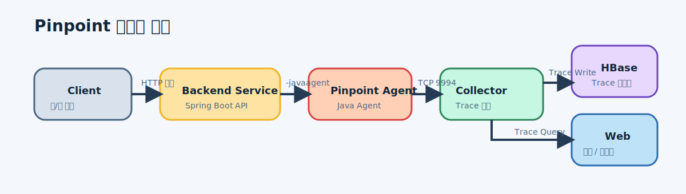
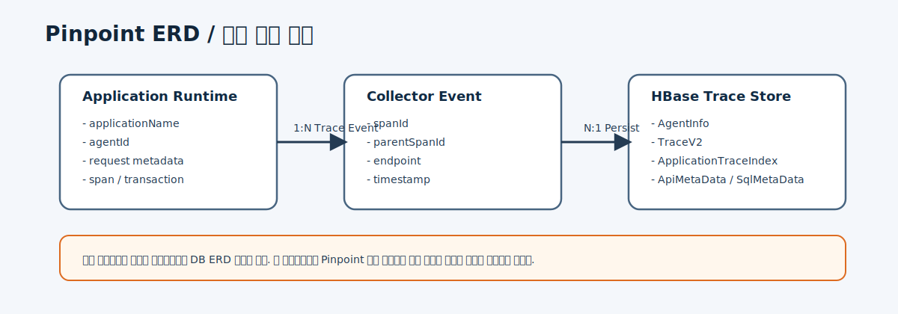
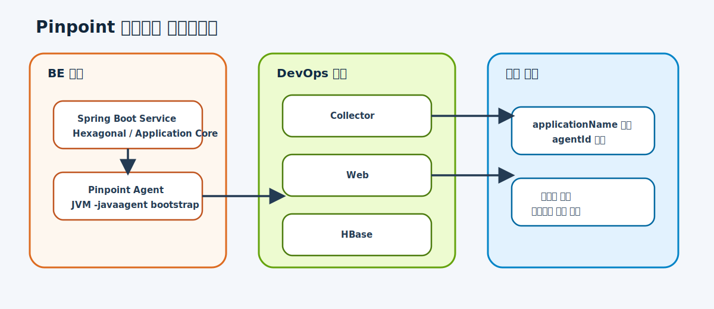
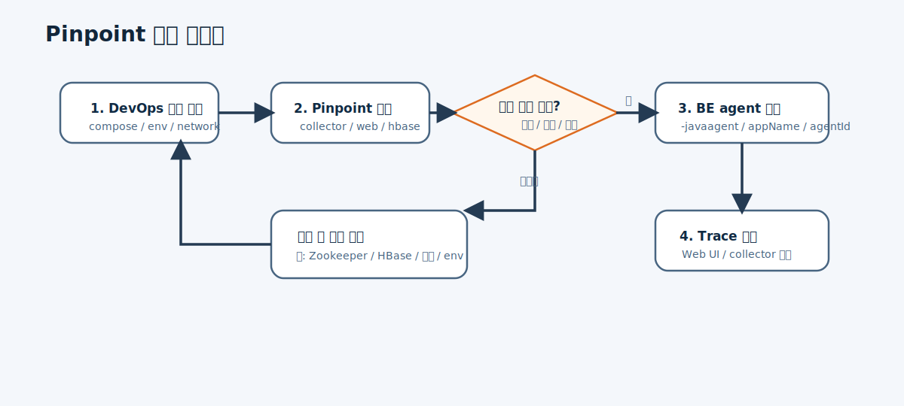

# Pinpoint 모니터링 부트스트랩

## 개요

- AI Orchestrator 프로젝트의 초기 모니터링 체계를 Pinpoint로 구성한다.
- 첫 단계에서는 `be`와 `devops`가 공통으로 참조할 수 있는 최소 운영 기준을 정한다.

## 목표

- 백엔드 서비스에 Pinpoint agent를 주입할 수 있는 기준을 정의한다.
- DevOps가 로컬/개발 환경에서 Pinpoint를 기동할 수 있는 기준을 정의한다.
- trace 범위, collector 연결 방식, 운영 체크리스트를 공통 문서로 고정한다.

## 설계

### 데이터 흐름

- Client Request -> Backend Application
- Backend Application -> Pinpoint Agent
- Pinpoint Agent -> Pinpoint Collector
- Pinpoint Collector -> Pinpoint Storage
- Pinpoint Web -> Trace Query / Visualization

### ERD

- 이번 단계에서는 애플리케이션 DB ERD 변경은 없다.
- Pinpoint 자체 저장소는 운영 인프라 범위로 관리한다.

### 컴포넌트 다이어그램

- `be`: Spring Boot service + Pinpoint Java agent
- `devops`: Pinpoint collector, web, storage, network, env configuration
- `common`: service naming rule, agent id rule, rollout policy

### 플로우 다이어그램

1. DevOps가 Pinpoint collector/web/storage를 기동한다.
2. Backend는 JVM 시작 시 Pinpoint agent를 주입한다.
3. Backend request/DB/Kafka 호출이 agent를 통해 collector로 전송된다.
4. 운영자는 Pinpoint web에서 trace를 확인한다.

## 결정 사항

- 첫 단계에서는 로컬/개발 환경 기준 구성을 먼저 확정한다.
- 서비스 이름과 agent id 규칙을 환경별로 분리한다.
- 민감 데이터가 포함될 수 있는 요청/응답은 추적 범위를 제한한다.

## 트레이드오프

- 장점: 빠르게 trace를 확보할 수 있고, `be`와 `devops`의 운영 인터페이스를 빨리 정할 수 있다.
- 단점: Pinpoint 인프라 운영 부담이 있고, 샘플링/추적 범위를 잘못 잡으면 오버헤드가 생긴다.

## 미결 사항

- 로컬/개발/운영 환경별 storage 구성을 어디까지 동일하게 가져갈지
- Kafka trace 범위를 첫 단계에 포함할지
- 샘플링 정책을 어떤 기본값으로 둘지
