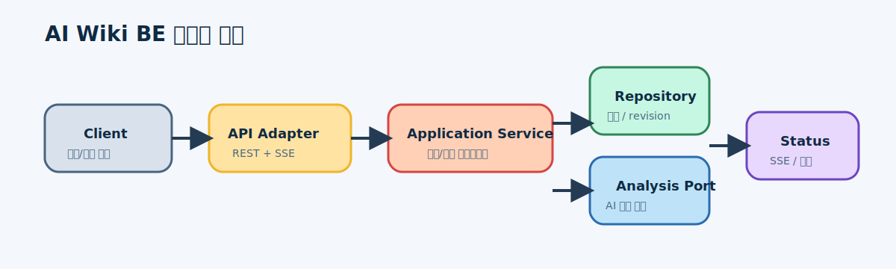
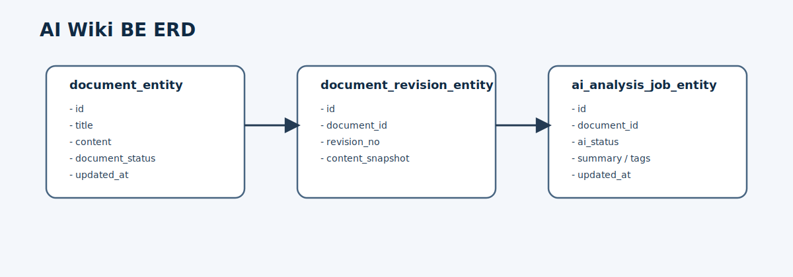
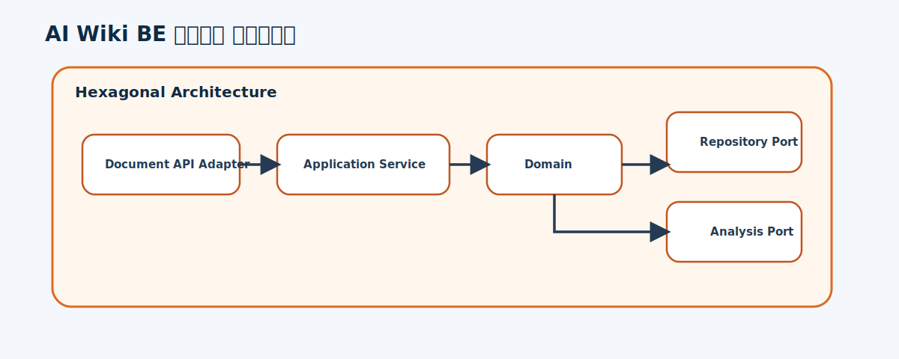
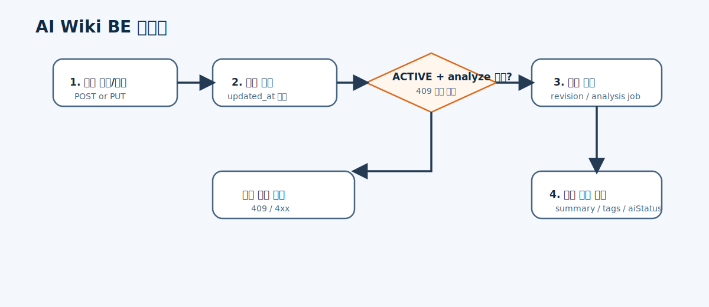

# AI Wiki 문서 및 분석 API 설계

## 개요

- AI Wiki의 문서 작성, 활성화, 분석 실행, 상태 조회를 담당하는 백엔드 API를 설계한다.
- 헥사고날 구조와 Entity/POJO 분리 규칙을 지키면서 MVP API 계약과 상태 전이 규칙을 고정한다.

## 목표

- 문서 생성/수정/조회와 `ACTIVE` 전환 API를 제공한다.
- `analyze` API는 `ACTIVE` 상태 문서에만 허용한다.
- `updated_at` 기반 낙관적 잠금과 revision 생성 규칙을 포함한다.

## 설계

### 데이터 흐름

- 클라이언트가 문서 저장 또는 조회 요청을 보낸다.
- API 어댑터가 애플리케이션 서비스로 요청을 전달한다.
- 도메인 서비스가 포트를 통해 문서 저장소와 AI 실행 포트를 호출한다.
- SSE 상태 조회 또는 상태 읽기 API가 최신 AI 상태를 반환한다.

### ERD

- `document_entity`
- `document_revision_entity`
- `ai_analysis_job_entity`
- 도메인에서는 `Document`, `DocumentRevision`, `AiAnalysisJob` POJO를 사용한다.

### 컴포넌트 다이어그램

- `document api adapter`
- `application service`
- `domain model`
- `analysis port`
- `repository adapter`

### 플로우 다이어그램

1. 문서 저장 또는 수정 요청 수신
2. 낙관적 잠금 검증
3. 상태 전이 확인
4. revision 생성 또는 분석 작업 생성
5. 상태 조회 응답 반환

## 결정 사항

- `analyze`는 `ACTIVE` 상태에서만 허용한다.
- `PROCESSING` 중 재요청은 `409 Conflict`를 반환한다.
- 수정 시 revision을 생성하고 최신 문서와 이력을 분리한다.

## 트레이드오프

- 장점: FE가 바로 붙을 수 있는 안정적인 계약을 먼저 만든다.
- 단점: 초기에는 실제 AI 서브시스템 대신 작업 큐/상태 저장 계약부터 고정하는 접근이 필요하다.

## 미결 사항

- 검색 인덱스 반영 시점을 `COMPLETED` 직후로 둘지
- revision 보존 정책을 얼마나 길게 둘지
- SSE 전용 endpoint와 일반 상태 조회 endpoint를 분리할지

