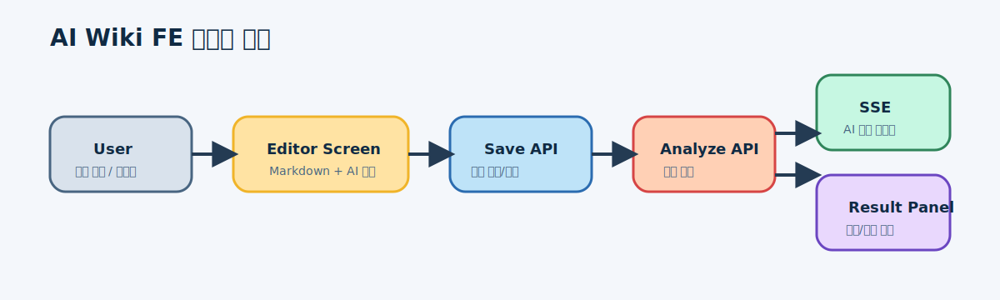
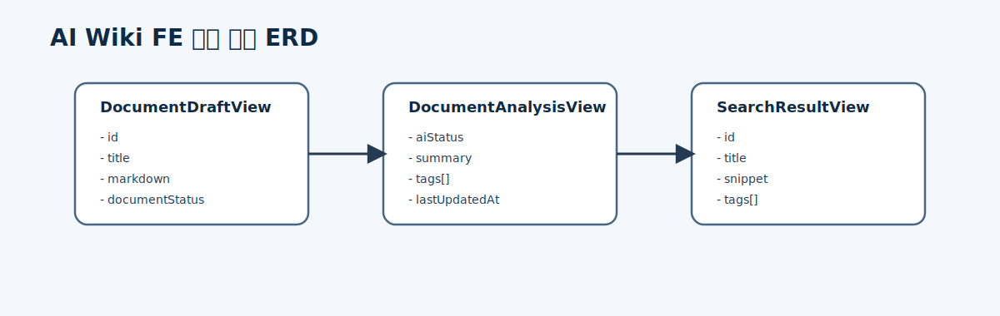
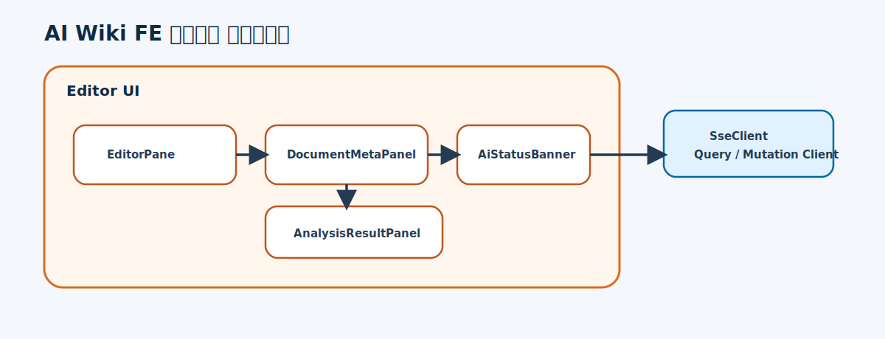
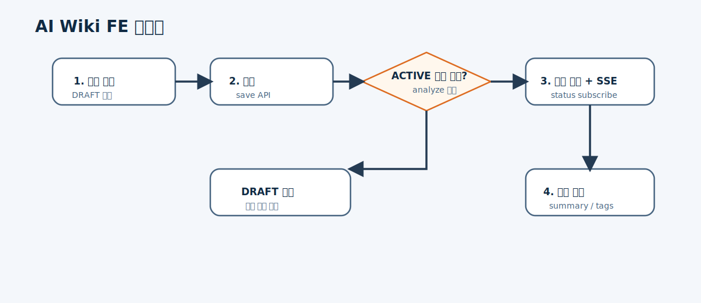

# AI Wiki 문서 작성 및 분석 상태 화면 설계

## 개요

- 사용자가 Markdown 문서를 작성하고 `ACTIVE` 전환 후 AI 분석 상태를 확인하는 FE 화면을 설계한다.
- 첫 단계에서는 문서 작성 화면, 분석 실행 액션, SSE 기반 상태 표시, 요약/태그 결과 패널을 정의한다.

## 목표

- 사용자는 문서를 `DRAFT`로 작성하고 저장할 수 있어야 한다.
- 사용자는 `ACTIVE` 전환과 분석 요청을 화면에서 수행할 수 있어야 한다.
- 사용자는 AI 상태(`NOT_STARTED`, `PENDING`, `PROCESSING`, `COMPLETED`, `FAILED`)를 실시간으로 확인할 수 있어야 한다.

## 설계

### 데이터 흐름

- 사용자가 문서를 작성하고 저장 API를 호출한다.
- 사용자가 `ACTIVE` 전환 후 `analyze` 요청을 보낸다.
- 클라이언트는 SSE 채널을 구독해 AI 상태를 갱신한다.
- 분석 완료 시 요약과 태그 패널을 갱신한다.

### ERD

- FE는 영속 DB 대신 화면 상태 모델을 관리한다.
- 주요 화면 모델은 `DocumentDraftView`, `DocumentAnalysisView`, `SearchResultView` 이다.

### 컴포넌트 다이어그램

- `EditorPane`
- `DocumentMetaPanel`
- `AiStatusBanner`
- `AnalysisResultPanel`
- `SseClient`

### 플로우 다이어그램

1. 사용자가 문서를 작성한다.
2. 저장 후 `ACTIVE` 전환을 수행한다.
3. 분석 요청 후 SSE 상태를 확인한다.
4. 완료 시 요약/태그 결과를 확인한다.

## 결정 사항

- 첫 화면은 문서 작성과 분석 상태 확인을 한 페이지에서 처리한다.
- AI 상태는 배지와 타임라인 2가지 형태로 동시에 표시한다.
- `PROCESSING` 중 재요청 시 버튼을 비활성화하고 서버 `409` 메시지를 노출한다.

## 트레이드오프

- 장점: 사용자가 분석 요청과 상태 확인을 같은 문맥에서 처리할 수 있다.
- 단점: 첫 버전에서는 문서 검색 화면을 분리하지 못하고 편집/상세 화면 중심으로 범위를 제한한다.

## 미결 사항

- 검색 화면을 별도 route로 분리할지
- revision 비교 UI를 MVP에 포함할지
- SSE 끊김 시 polling fallback을 둘지

