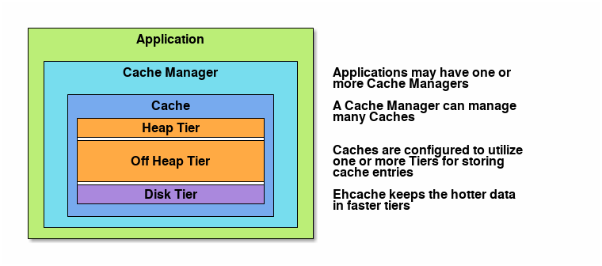

# 캐싱
캐시는 미리 계산된 결과, 이전에 사용된 결과 등을 저장소에 저장해두었다 동일 요청이 들어오면 빠르게 응답해줄 수 있는 장치입니다.

이 과정은 미리 적재된 데이터를 조회함으로써 원본 데이터 저장소를 거치지 않으므로 원본 저장소에 대한 부담을 줄여줄 수 있는 장점이 존재하며, 다른 저장소가 메모리라면 디스크에 접근하는 것보다 훨씬 빠른 결과를 제공합니다.
## 스프링 로컬 캐시
스프링 로컬 캐시는 애플리케이션 서버 메모리를 활용하여 데이터를 제공하는 기술입니다.   
메모리에 데이터를 미리 적재해두고, 이를 서빙한다면 외부 저장소를 거칠 필요도 없으며 디스크 io로 데이터를 가져올 필요 없이 빠르게 데이터를 제공할 수 있습니다.

## 캐싱 운영 방법
### 캐싱 읽기 전략
> Look Aside

1. Cache 저장소에 데이터가 있는지 확인 (Cache hit)
2. 저장소에 데이터가 없다면 DB에서 조회 (Cache miss)
3. DB에서 조회한 데이터를 Cache Store에 업데이트

조회 요청 시 Cache 저장소, DB를 전부 훑을 수 있기 때문에 서비스 오류는 발생시키지 않을 수 있습니다.  
다만, 첫 요청 그리고 TTL이 만료된 이후엔 Cache 저장소에 데이터가 없기 때문에 DB까지 요청이 흘러들어가는 단점이 존재합니다.

> Read Through

1. Cache 저장소에 데이터가 있는지 확인 (Cache hit)
2. Cache 저장소에 데이터가 없다면 DB에 데이터를 조회하여 애플리케이션이 아닌 저장소 자체가 업데이트 (Cache miss)
3. Cache 저장소에서 데이터를 가져옴

모든 조회는 Cache 저장소만이 진입점이므로 DB에 대한 접근을 줄일 수 있습니다.   
다만, Cache 저장소가 단일 장애 포인트이기 때문에 장애가 발생할 경우 서비스에 영향을 줄 수 있습니다.

### 캐싱 쓰기 전략

> Write Back 

1. 모든 데이터를 Cache 저장소에 저장 
2. 일정 시간이 지난 후 DB에 저장

Cache 저장소에서 한번에 DB로 전송하기 때문에 쓰기 횟수, 부하를 줄일 수 있습니다.     
다만, 이전에 Cache 저장소에 문제가 생긴다면 데이터가 유실될 수 있는 위험이 존재합니다.

> Write Through

1. Cache 저장소에 데이터를 저장한다. 
2. DB에도 마찬가지로 데이터 저장이 필요하면 저장한다.

데이터를 저장할 때마다 2곳에 저장해야하는 문제가 존재합니다.

> Write Around

1. 모든 데이터를 DB에 저장한다.

모든 데이터를 DB에 저장하기 때문에 Write Through보다는 빠르다는 장점이 존재합니다.   
다만, Cache 저장소에 데이터 업데이트가 바로 되지 않으므로 데이터 불일치가 발생할 수 있습니다.

## 캐싱 운영 문제상황
### 캐시 스템피드
캐시가 만료되고, 다수의 요청이 동시에 몰려들 때, DB로 트래픽이 몰리는 현상입니다.

ex) TTL이 매 정각일 때, 매 정각마다 DB로 다량의 요청이 발생한다.

> Lock

1. 1000개의 동일 요청이 발생
2. 캐시 미스가 발생한다면 첫번째 요청을 제외한 모든 요청은 Lock으로 대기 
3. 첫번째 요청은 캐시를 업데이트 
4. 나머지 요청들은 업데이트된 캐시를 이용하여 데이터를 조회

* 장점: 요청 1개로 캐시를 업데이트함으로써 나머지 요청에서 불필요한 캐시 업데이트, DB 접근이 발생하지 않습니다. 
* 단점: 요청이 많으면 많을수록 대기되는 요청이 많아지고, 캐시 업데이트가 오래 걸릴수록 스레드 점유 시간이 길어지는 문제가 발생합니다.

> 조기 갱신

1. TTL 주기는 30분 
2. 스케쥴러 혹은 크론잡을 이용하여 29분에 업데이트

* 장점: 모든 요청이 만료된 캐시를 접근하지 않는다. 
* 단점: 주기에 해당하는 전체 캐시를 업데이트하기 때문에 작업 비용이 상당량 소모된다.

> PER(Probabilistic Early Recomputation)

1. 키에 대한 value를 조회 
2. value가 없거나 (currentTime() - delta * beta * log(rand(0,1))) ≥ expiry 범위에 포함되면 캐시 갱신이 필요한 상태 
   * value: 캐싱된 값 
   * delta: 이전 재계산에 소요된 시간 
   * expiry: 캐시 만료 시각 
   * beta: 확률 파라미터로 beta가 높아질수록 캐시 갱신이 자주 발생 
   * 현재 시각이 만료 시점에 가까워질수록, 이전 재계산 시간이 길수록, beta값이 클수록 갱신 확률이 높아진다.
3. 캐시에 새로 갱신된 value, delta, ttl을 기록해준다.

### 캐시 페너트레이션
빈 값을 캐싱하지 않게 되면 캐시에 값이 없다고 판단하여 DB로 트래픽이 흘러가는 현상입니다.

ex) findByIdOrNull의 결과 중 하나는 null이나 이 null을 캐싱하지 않게 되면, DB에 쿼리가 발생합니다.

> 빈 값 캐싱

1. 캐시에 빈 값을 저장 
2. 요청이 들어올 경우 빈 값을 cache miss로 간주하지 않음 
3. DB로 트래픽이 흘러가지 않음

> 블룸 필터

1. m(bloom filter의 bit 사이즈) = 10, k(hashing function의 수) = 2이고 hashing function을 h1, h2로 간주합니다. 
2. 데이터 A를 삽입할 때 h1, h2를 거치고, 결과값에 해당하는 인덱스의 bit를 true로 변경합니다.
   * h1(A) = 3, h2(A) = 7
3. 데이터 A를 조회할 경우 h1, h2를 거치고, 그에 대한 결과 모두 true이므로 값이 있다고 판단합니다.
   * 빈 값을 블룸 필터에 적용하므로 빈 값이 캐싱되었다고 판단합니다.
4. 데이터 B를 조회할 경우 h1, h2를 거치고, 그에 대한 결과가 다음과 같습니다.
   * h1(B) = 6, h2(B) = 7 
5. 데이터 B에 대한 결과 중 1개가 false이므로 빈 값이 캐싱되어있지 않다고 판단합니다.

Bloom Filter 소개:  https://www.mimul.com/blog/bloom-filter/

### 핫키 만료
핫키는 많은 요청이 집중되는 키입니다.
핫키가 만료되는 순간 모든 요청이 DB로 흘러가게 되고, DB의 과부하가 발생합니다.

해결 방법은 캐싱 스템피드와 같은 방식으로 해결됩니다.

## 스프링 로컬 캐시 종류
### EHCache
Java 기반의 오픈소스 캐싱 라이브러리입니다.

> Storage Tier

* On Heap Store 
  * JVM의 heap memory를 사용하여 캐싱을 수행합니다. 
  * young generation에 캐싱이 되기 때문에 GC의 영향을 받고, 용량에도 제한이 있습니다. 
  * 다만, 속도가 가장 빠릅니다. 
* Off Heap Store 
  * heap memory가 아닌 DirectByteBuffer를 이용하여 캐싱을 수행합니다. 
  * heap memory에서 벗어났기 때문에 GC의 영향에서 벗어납니다. 
  * Heap 보다 속도가 느립니다. 
* Disk Storage 
  * disk를 이용하여 데이터를 저장합니다. 
  * 영구 저장 장치에 데이터를 저장하기 때문에 process가 재시작되어도 유지가 가능합니다. 
  * disk io이기 때문에 ram io보다 훨씬 느린 성능을 보여줍니다. 
* Clustered Store 
  * 원격 서버를 이용하여 각 노드에 캐싱된 데이터를 어느 노드에서든 사용 가능합니다. 
  * 네트워크 통신을 동반하기 때문에 off heap보다 느립니다..

> 사용 방법

3-tier로 동작하며, application load 시 데이터가 disk에 저장되어있다면, 조회하고 off-heap → heap 순서로 데이터를 캐싱합니다.

일반적인 캐시 어노테이션으로 사용할 수 있으며, 필요에 따라 heap만 사용한다던지 heap + off heap 조합으로 캐싱을 구성할 수 있습니다.

### Guava
> LoadingCache, Cache

* LoadingCache: 캐시 미스가 날 경우 자동으로 데이터를 로드합니다. 
  * size-based eviction: 특정 사이즈 이상, 가중치 이상으로 커질 경우 자주 사용되지 않는 캐시를 제거합니다. 
  * time-based eviction: 시간 기반으로 캐시를 삭제합니다. 
    * expireAfterAccess: 접근한지 특정 시간 이후 
    * expireAfterWriter: 생성된지 특정 시간 이후
* Cache: 캐시 미스가 발생해도 자동으로 데이터를 로드하지 않습니다.

> 사용 방법

Guava CacheBuilder를 이용하여 싱글톤 빈을 등록하고, 캐시 저장소를 주입받아 사용합니다.

### Caffeine
> Window TinyLfu
* LRU (Least Recently Used)방식의 단점 
  * 캐시 크기 3 
  * 1 → 2 → 3 → 4 → 5 → 6 → 1 -> 2 → … 와 같은 순으로 데이터 조회

| T | 요청 | 캐시      | 캐시 제거 |
|---|----|---------|-------|
| 1 | 1  | 1       | x     |
| 2 | 2  | 1, 2    | x     |
| 3 | 3  | 1, 2, 3 | x     |
| 4 | 4  | 2, 3, 4 | 1     |
| 5 | 5  | 3, 4, 5 | 2     |
| 6 | 6  | 4, 5, 6 | 3     |
| 7 | 1  | 5, 6, 1 | 4     |
| 8 | 2  | 6, 1, 2 | 5     |

순차적으로 데이터를 조회할 경 캐시 미스가 발생하면 캐시에 데이터를 업데이트하지만, LRU에 의해 이전 데이터가 캐시에서 제거됩니다.   
때문에 정작 필요한 시점에 캐시 데이터를 조회할 수 없습니다.   
가령 T=7 타이밍에 1을 요청했으나 캐시에서 이미 제거된 후이기 때문에 캐시를 사용할 수 없습니다.

* LFU (Least Frequently Used)방식의 단점

| 초기 (0 ~ 100초) |          |=>      | 이후      |  |
|---------------|----------|---------|---------|-------|
| A             | 1000번 요청 |        | 0번 요청   |
| B             | 50번 요청   |    | 100번 요청 |
| C             | 5번 요청    |  | 80번 요청  |

초기에는 A, B, C가 요청되고 캐시 저장소에 A, B, C가 저장됩니다.

이후에 A 데이터는 더 이상 사용되지 않지만 빈도수를 따졌을 때 가장 많으므로 새로운 D라는 데이터를 요청할 경우 빈도수가 가장 낮은 C가 캐시에서 제거됩니다.

* Window TinyLfu 동작 방법

newItem → Window(LRU, 1%) -> Probation(LRU, 20%) → Protected(LFU, 79%)

1. 새로운 데이터를 조회할 경우 window에 임시 저장하고, 지속적으로 사용(LRU)되면 Probation으로 승격됩니다. 
2. Probation으로 승격 이후 자주 호출(LRU)될 경우 Protected로 승격되고, 아니면 Window로 강등됩니다. 
3. Protected로 승격 이후 빈도수를 체크(LFU)한다. 빈도수의 여하에 따라 유지되거나 Probation으로 강등됩니다.

각 영역에서 LRU, LFU의 장점을 이용하여 캐싱을 하기 때문에 다른 캐시 구현체들보다 벤치마크에서 좋은 성능을 보입니다.