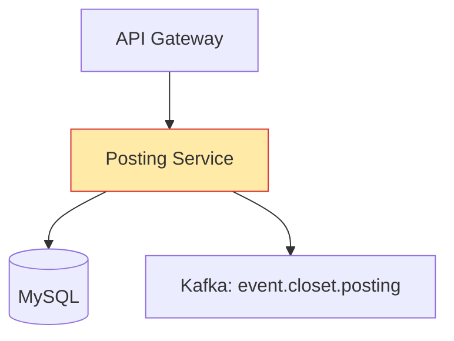
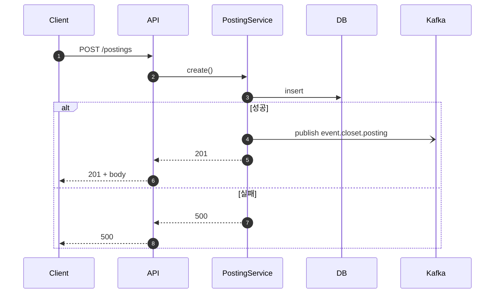
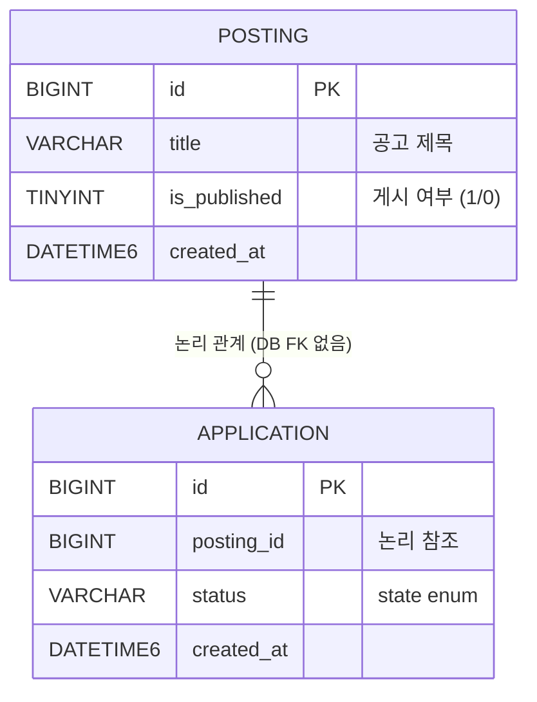

# Mermaid Diagrams Skill

## 언제 사용하나
- 설계 문서 Detail Design 섹션
- ADR, PR 본문, 장애 포스트모템

## 필수 3종

### 1. Component Diagram
- `graph TD` (top-down) 기본
- AS-IS/TO-BE 쌍으로 작성
- 변경 컴포넌트는 `classDef changed fill:#ffeaa7`로 강조



### 2. Sequence Diagram
- `sequenceDiagram`
- 동기/비동기 구분: `->>` 동기, `-->>` 응답, `-)` 비동기
- 실패 경로를 `alt`/`opt`로 표현



### 3. ERD
- `erDiagram`
- **DB FK 금지** — 관계선은 논리 관계, 실제 FK 컬럼/제약 없음을 코멘트로 명시
- 컬럼: `<타입> <이름> <제약> "<코멘트>"`
- `TINYINT(1)` for boolean, `DATETIME(6)` for 시간



## 스타일 규칙
- 노드/참여자 이름은 **한 단어 + 역할 태그** (`Svc as PostingService`)
- 숫자 라벨(`autonumber`) 사용해 시퀀스 추적 쉽게
- 색상은 변경/신규 하이라이트에만 사용 (남발 금지)
- 모든 다이어그램은 `.md` 내 ```` ```mermaid ``` ```` 블록

## 렌더 검증
- GitHub/Notion/Confluence에서 렌더되는지 확인
- 구문 오류 시 `mermaid.live` 에디터에서 수정
- 너무 복잡해지면 subgraph 또는 분할