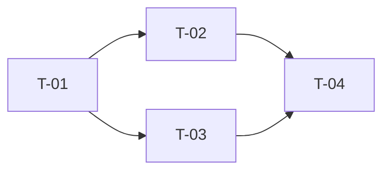

# Ticket Breakdown Skill

## 언제 사용하나
- 설계 완료 후 실제 작업 단위 분해
- "티켓 쪼개줘", "작업 목록 만들어줘"

## 원칙
- **1티켓 = 1PR = 1명 × 1일 이내**
- 티켓이 1일 초과 → 더 쪼갠다
- 티켓이 30분 이내 → 인접 티켓과 묶는다
- 애매한 부분은 `open_questions`로 남기고 임의 결정 금지

## 절차

### Step 1. 기능을 작업 유형별로 분리
- DB 마이그레이션
- Domain/Entity 추가
- Repository/Adapter
- Service/UseCase
- Controller/API
- FE 컴포넌트
- FE 페이지/라우팅
- 배포/설정 (feature flag, env)

### Step 2. 종속성 그래프 그리기
- 선행 완료가 필요한 티켓 `dependencies` 필드에 ID 나열
- 병렬 가능한 티켓은 동일 마일스톤으로 묶음

### Step 3. 각 티켓 작성

```yaml
- id: T-01
  title: "공고 엔티티 + 마이그레이션 추가"
  description: |
    배경: 공고 기능의 데이터 모델 구축
    구현 범위:
      - Posting 엔티티 (JPA)
      - V<version>__create_posting.sql 마이그레이션
      - PostingRepository (interface + QueryDSL Impl)
    비범위: Service/Controller는 T-02, T-03에서
  acceptance_criteria:
    - Given 빈 DB When 마이그레이션 실행 Then posting 테이블 생성 + 인덱스 존재
    - Given Posting 인스턴스 When save Then DB row 1개 (DATETIME(6) 정밀도)
  test_cases: [TC-01, TC-02]
  dependencies: []
  estimate: 0.5d
  labels: [be, db]
  open_questions: []
  assignee: null
```

### Step 4. 전체 검증
- 모든 FR이 ≥1 티켓에 연결되는지
- 모든 TC가 ≥1 티켓에 연결되는지
- Critical path 길이(종속 사슬 최대 깊이)가 스프린트에 맞는지

## 출력 형식

### 03-tickets.md 구조
```markdown
# <Feature> — Tickets

## Dependency Graph


## Tickets

### T-01: 공고 엔티티 + 마이그레이션
```yaml
<YAML 블록>
```

### T-02: ...
...

## Summary
- 총 티켓 수: N
- 총 추정: M일
- Critical path: T-01 → T-02 → T-04 (2.5d)
- 병렬 슬롯: 2 (T-02, T-03 동시 가능)
```

## Jira MCP 연동 (옵션)
`mcp__atlassian__*` 툴이 있으면 YAML을 그대로 `createIssue`로 올릴 수 있도록:
- `summary` = title
- `description` = description + acceptance_criteria
- `labels` = labels
- `customfield_<id>` = estimate, dependencies

## 완료 체크
- [ ] 모든 티켓 ≤ 1일
- [ ] 모든 티켓에 Acceptance Criteria + test_cases 링크
- [ ] 종속성 그래프 사이클 없음
- [ ] 모든 FR이 티켓 커버
- [ ] open_questions 비어 있지 않으면 담당자 지정됨