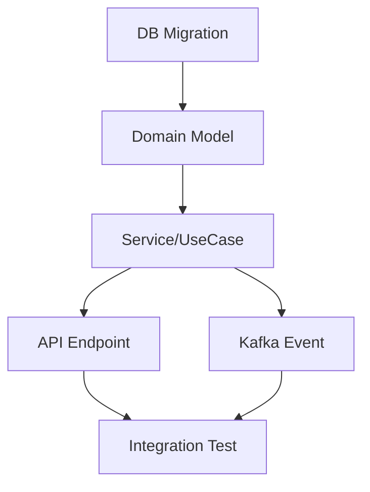
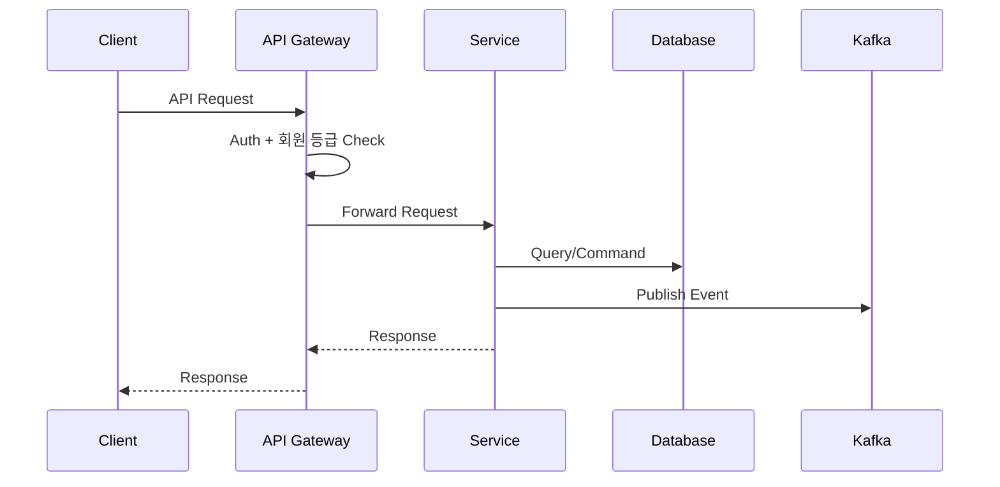

# BE 구현 설계 파이프라인

> PRD + 디자인(Optional) → 요구사항 검증 → 기술 분석 → TDD 작성 → 구현 티켓 작성

---

## 실행 원칙

**Phase 1 → 2 → 3 → 4 전체를 순서대로 수행한다.** 단, 각 Phase 내에서 분석 깊이는 작업 규모에 맞게 조절한다.
- 대규모 프로젝트: 각 Phase를 상세히
- 소규모 기능 추가: 각 Phase를 간결하게 (Phase 1 Gap이 0건이어도 "검토 완료, 이슈 없음"으로 기록)

---

## 파이프라인 흐름

```
[INPUT] PRD (Confluence/텍스트) + 디자인 (Figma, Optional)
    │
    ▼
━━ Phase 1: 요구사항 검증 & Gap 분석 ━━━━━━━━━━━━━━━━━━
    │  PRD/디자인에서 애매하거나 누락된 부분을 BE 관점으로 검출
    │
    │  ┌─ Agent 🔎(요구사항 검증): PRD 정밀 분석
    │  └─ Agent 🎨(디자인 검증): 디자인 ↔ PRD 정합성 (Optional)
    │
    │  출력: gap_analysis.md
    │    - 애매한 요구사항 (해석 분기점)
    │    - 누락된 요구사항 (BE 관점에서 반드시 필요하나 PRD에 없는 것)
    │    - 추가 고려사항 (엣지 케이스, 동시성, 권한, 성능)
    │    - 디자인 ↔ PRD 불일치 항목
    │    - 의사결정 필요 항목 (기획자/디자이너에게 질문할 목록)
    │
    ▼
━━ Phase 2: 기술 스택 분석 ━━━━━━━━━━━━━━━━━━━━━━━━━━━━
    │  요구사항을 기반으로 관련 코드베이스 심층 분석
    │
    │  ┌─ Agent 🏗️(아키텍처 분석): 관련 서비스/모듈/레이어 탐색
    │  └─ Agent 📊(데이터 분석): DB 스키마/Kafka/캐시 분석
    │
    │  분석 항목:
    │    - 관련 서비스/모듈 식별 (Hexagonal 레이어별)
    │    - 기존 도메인 모델 구조
    │    - 기존 API 패턴 (컨벤션, 인증/인가 흐름)
    │    - DB 테이블 관계 및 현재 스키마
    │    - Kafka 토픽/메시지 구조
    │    - 공유 라이브러리 의존성
    │    - 현재 테스트 패턴/프레임워크
    │
    ▼
━━ Phase 3: TDD (기술 설계 문서) 작성 ━━━━━━━━━━━━━━━━━━
    │  팀장이 Phase 1~2 결과를 종합하여 TDD 작성
    │
    │  출력: tdd.md
    │    - 목차:
    │      1. 개요 (배경, 목표, 범위)
    │      2. 현재 상태 (AS-IS 아키텍처/흐름)
    │      3. 제안 설계 (TO-BE 아키텍처/흐름)
    │      4. 상세 설계
    │         - API 스펙 (엔드포인트, Request/Response)
    │         - 도메인 모델 변경
    │         - DB 스키마 변경 (Flyway migration)
    │         - Kafka 이벤트 설계
    │         - 시퀀스 다이어그램
    │      5. 영향 범위
    │      6. 마이그레이션 전략 (필요 시)
    │      7. 리스크 & 대안
    │
    ▼
━━ Phase 4: 구현 티켓 작성 ━━━━━━━━━━━━━━━━━━━━━━━━━━━━
    │  TDD를 기반으로 실제 구현 티켓 본문 작성
    │
    │  ┌─ Agent 📋(티켓 분할): 작업 단위 분리 및 의존 관계 도출
    │  └─ Agent 🧪(테스트 설계): 테스트 케이스 및 기대 결과 작성
    │
    │  출력: tickets/
    │    - ticket_01_*.md ~ ticket_N_*.md
    │    - 각 티켓 구조:
    │      1. 작업 내용 (+ Mermaid 다이어그램 시각화)
    │      2. 영향 범위
    │      3. 테스트 케이스
    │      4. 기대 결과 (AC: Acceptance Criteria)
    │      5. 구현 순서 및 선행 조건
    │
    ▼
[OUTPUT]
  ├── gap_analysis.md       ← 요구사항 검증 결과
  ├── tdd.md                ← 기술 설계 문서
  └── tickets/
      ├── _overview.md      ← 티켓 전체 요약 & 의존 관계도
      ├── ticket_01_*.md    ← 개별 구현 티켓
      └── ticket_N_*.md
```

---

## 에이전트 역할 정의

### 팀장 (메인 Claude)
- PRD 수신 및 Phase 전환 관리
- Phase 3 TDD 직접 작성 (가장 중요한 산출물)
- Phase 간 결과 종합 및 품질 검토
- 사용자와의 커뮤니케이션

### Agent 🔎: 요구사항 검증가 (Phase 1)
**역할**: PRD를 BE 관점에서 정밀 검증

**검출 항목**:
1. **애매한 요구사항**
   - "~할 수 있다" → 권한 조건은? 어떤 사용자?
   - "목록을 보여준다" → 정렬 기준? 페이지네이션? 필터?
   - "알림을 보낸다" → 채널은? 타이밍은? 실패 시?
   - "데이터를 저장한다" → 어떤 형태? 유효성 검증?

2. **누락 사항 (BE 필수 고려)**
   - 동시성 제어 (동시 수정, Race condition)
   - 멱등성 (재시도 안전성)
   - 권한 & 인가 (RBAC, 회원 등급 기반)
   - 데이터 정합성 (트랜잭션 경계)
   - 에러 핸들링 (실패 시 사용자 경험)
   - 성능 (대량 데이터, N+1 쿼리)
   - 감사 로그 (누가 언제 무엇을 변경)
   - 하위 호환성 (기존 API 클라이언트)
   - 재고 정합성 (동시 주문, 재고 차감)

3. **추가 고려사항**
   - 기존 기능과의 상호작용
   - 배치/워커 영향
   - 캐시 무효화 전략
   - 국제화 (다국어 데이터)
   - 소프트 삭제 vs 하드 삭제

**탐색 방법**:
```
- PRD 텍스트에서 동사/조건 추출 → 구현 관점 질문 생성
- 기존 유사 기능 코드 확인 → 패턴 불일치 검출
- 도메인 모델 확인 → 누락 엔티티/관계 검출
```

### Agent 🎨: 디자인 검증가 (Phase 1, Optional)
**트리거 조건**: Figma 디자인이 제공된 경우에만 활성화

**검출 항목**:
1. 디자인에는 있지만 PRD에 명시되지 않은 기능
2. 디자인 상의 상태(로딩, 에러, 빈 상태)와 BE 응답 매핑
3. 디자인의 데이터 필드와 현재 API 응답 필드 불일치
4. 디자인의 인터랙션(정렬, 필터, 검색)에 필요한 BE 지원
5. 디자인의 권한별 분기와 BE 인가 로직 매핑

### Agent 🏗️: 아키텍처 분석가 (Phase 2)
**역할**: 관련 서비스/모듈의 현재 구조 파악

**분석 항목**:
1. 관련 서비스 식별 (closet-product, closet-order 등)
2. Hexagonal 레이어별 관련 코드 위치
   ```
   presentation/api/     → Controller, DTO
   business/application/ → UseCase, Service
   business/domain/      → Domain Model, Port
   adaptor/mysql/        → Entity, Repository
   adaptor/kafka/        → Producer, Consumer
   adaptor/redis/        → Cache
   ```
3. 기존 API 패턴 분석 (URL 컨벤션, 응답 형식, 에러 코드)
4. 인증/인가 흐름 (JWT → Gateway → 회원 등급 체크 → RBAC)
5. 관련 Kafka 이벤트 토폴로지
6. 공유 라이브러리 사용 현황 (closet-common 등)

### Agent 📊: 데이터 분석가 (Phase 2)
**역할**: 데이터 레이어 현황 파악

**분석 항목**:
1. 관련 MySQL 테이블 스키마 (각 서비스의 Flyway 마이그레이션)
2. 기존 Flyway 마이그레이션 히스토리
3. Redis 캐시 키 패턴
4. Elasticsearch 인덱스 매핑 (검색 관련 시)
5. Read/Write Split 고려사항
6. 인덱스 전략 및 쿼리 패턴

### Agent 📋: 티켓 분할가 (Phase 4)
**역할**: TDD를 구현 가능한 단위 티켓으로 분리

**분할 기준**:
1. 독립적으로 배포 가능한 단위
2. 하나의 PR로 리뷰 가능한 크기
3. 의존 관계가 명확한 순서
4. 레이어별 분리 (Domain → Service → API → Event)

**티켓 간 의존 관계 시각화**:


### Agent 🧪: 테스트 설계가 (Phase 4)
**역할**: 각 티켓별 테스트 케이스 및 기대 결과 작성

**테스트 레벨**:
1. **Unit Test**: Domain Model, Service 로직
2. **Integration Test**: Repository, Kafka, 외부 연동
3. **API Test**: Controller 엔드포인트 (MockMvc/WebTestClient)
4. **E2E Scenario**: 주요 비즈니스 플로우

**테스트 케이스 구조**:
```
[TC-001] {테스트명}
- Given: {사전 조건}
- When: {실행 액션}
- Then: {기대 결과}
- Edge Cases:
  - {경계값/예외 케이스 1}
  - {경계값/예외 케이스 2}
```

---

## 에이전트 동적 할당 규칙

| Phase | 조건 | 할당 에이전트 |
|-------|------|-------------|
| Phase 1 | PRD만 제공 | 🔎만 실행 |
| Phase 1 | PRD + Figma 제공 | 🔎 + 🎨 병렬 실행 |
| Phase 2 | 항상 | 🏗️ + 📊 병렬 실행 |
| Phase 3 | 항상 | 팀장 직접 작성 |
| Phase 4 | 항상 | 📋 + 🧪 병렬 실행 |

---

## TDD 작성 가이드

### TDD 구조

```markdown
# [기능명] 기술 설계 문서 (TDD)

## 1. 개요
### 1.1 배경
### 1.2 목표
### 1.3 범위 (In Scope / Out of Scope)
### 1.4 용어 정의

## 2. 현재 상태 (AS-IS)
### 2.1 아키텍처 다이어그램
### 2.2 주요 흐름 (시퀀스 다이어그램)
### 2.3 관련 데이터 모델

## 3. 제안 설계 (TO-BE)
### 3.1 아키텍처 다이어그램
### 3.2 주요 흐름 (시퀀스 다이어그램)
### 3.3 변경 데이터 모델

## 4. 상세 설계
### 4.1 API 스펙
  - Method, Path, Request Body, Response, Error Codes
### 4.2 도메인 모델 변경
  - 신규/수정 Entity, Value Object, Enum
### 4.3 DB 스키마 변경
  - ALTER/CREATE TABLE DDL (Flyway 스크립트)
  - 인덱스 전략
### 4.4 Kafka 이벤트 설계 (해당 시)
  - 토픽, 메시지 스키마, Producer/Consumer
### 4.5 캐시 전략 (해당 시)
### 4.6 시퀀스 다이어그램 (Mermaid)

## 5. 영향 범위
### 5.1 수정 대상 서비스/모듈
### 5.2 API 하위 호환성
### 5.3 데이터 마이그레이션

## 6. 리스크 & 대안
| 리스크 | 영향도 | 대안 |

## 7. 구현 계획
### 7.1 티켓 분할 요약
### 7.2 예상 구현 순서
```

### 다이어그램 시각화 규칙

모든 다이어그램은 **Mermaid** 문법으로 작성:



---

## 티켓 템플릿

### 개별 티켓 (ticket_N_*.md)

```markdown
# [CLT-XXXX] {티켓 제목}

## 개요
- 티켓: {PRD 티켓 링크}
- TDD: {TDD 문서 링크/섹션 참조}
- 선행 티켓: {의존하는 티켓 번호}

## 작업 내용

### 변경 사항
{구체적인 구현 내용}

### 다이어그램
{Mermaid 시퀀스/클래스/ER 다이어그램}

### 수정 파일 목록
| 서비스 | 모듈 | 파일 경로 | 변경 유형 |
|--------|------|----------|----------|
| | | | 신규/수정/삭제 |

## 영향 범위

### 직접 영향
- {수정되는 API/서비스}

### 간접 영향
- {수정으로 인해 동작이 달라지는 다른 기능}

### 하위 호환성
- {기존 클라이언트에 미치는 영향}

## 테스트 케이스

### 정상 케이스
| ID | 테스트명 | Given | When | Then |
|----|---------|-------|------|------|
| TC-001 | | | | |

### 예외/엣지 케이스
| ID | 테스트명 | Given | When | Then |
|----|---------|-------|------|------|
| TC-E01 | | | | |

## 기대 결과 (Acceptance Criteria)
- [ ] {AC 1: 구체적이고 검증 가능한 조건}
- [ ] {AC 2}
- [ ] {AC 3}

## 체크리스트
- [ ] 빌드 확인
- [ ] 테스트 통과
- [ ] API 문서 업데이트 (해당 시)
- [ ] Flyway 마이그레이션 검증 (해당 시)
- [ ] 하위 호환성 확인
```

### 티켓 전체 요약 (_overview.md)

```markdown
# 구현 티켓 요약

## PRD 참조
- {PRD 링크}

## 티켓 목록
| # | 티켓 | 레이어 | 의존성 | 예상 크기 |
|---|------|--------|--------|----------|
| 1 | {제목} | Domain | - | S/M/L |
| 2 | {제목} | Service | #1 | S/M/L |

## 의존 관계도
{Mermaid graph 다이어그램}

## 배포 순서
1. DB Migration
2. Domain + Service
3. API Endpoint
4. Kafka Event (해당 시)
5. Integration Test
```

---

## Gap 분석 템플릿 (gap_analysis.md)

```markdown
# 요구사항 Gap 분석

> PRD: {PRD 제목/링크}
> 분석일: {날짜}

## 1. 애매한 요구사항

| # | PRD 원문 | 애매한 점 | 해석 옵션 | 추천 |
|---|---------|----------|----------|------|
| A-1 | "~할 수 있다" | 권한 조건 불명확 | A: 전체 허용 / B: 판매자만 | B |

## 2. 누락된 요구사항

| # | 누락 항목 | 필요 이유 | 영향도 | 제안 |
|---|----------|----------|--------|------|
| M-1 | 동시 재고 차감 처리 | 여러 사용자 동시 주문 시 재고 충돌 | High | Optimistic Lock |

## 3. 추가 고려사항

| # | 고려사항 | 카테고리 | 상세 | 제안 |
|---|---------|---------|------|------|
| C-1 | | 동시성/권한/성능/보안/캐시 | | |

## 4. 디자인 ↔ PRD 불일치 (디자인 제공 시)

| # | 디자인 내용 | PRD 내용 | 불일치 유형 | 제안 |
|---|-----------|---------|-----------|------|
| D-1 | | | 누락/충돌/추가 | |

## 5. 의사결정 필요 항목

| # | 질문 | 대상 | 우선순위 | 디폴트 제안 |
|---|------|------|---------|-----------|
| Q-1 | | 기획자/디자이너/BE | High/Medium/Low | |
```

---

## 사용법

```
"이 PRD 기반으로 BE 구현 설계해줘: [PRD 링크 또는 내용]"
"이 PRD + 디자인 보고 TDD 작성해줘: [PRD 링크] [Figma 링크]"
"이 기능 구현 티켓 만들어줘: [기능 설명]"
```

---


---

## 출력 어조

산출물은 **팀원과 공유하는 문서**입니다. 읽는 사람이 지치지 않도록 아래 원칙을 따릅니다.

- **핵심부터** — 결론·액션 아이템을 앞에 씁니다. 이유와 배경은 뒤에 써도 됩니다.
- **짧게** — 한 문장으로 쓸 수 있으면 세 문장으로 쓰지 않습니다.
- **구체적으로** — "여러 곳" 대신 "3곳", "느릴 수 있음" 대신 "products 테이블 full scan" 처럼 씁니다.
- **표·불릿 우선** — 비교·목록은 문장보다 표나 불릿으로 씁니다.
- **중립적으로** — 문제를 발견해도 단정짓지 않고 확인 사항으로 전달합니다.

## 출력 형식

분석 결과는 `.analysis/be-implementation/results/{날짜}_{기능명}/` 디렉토리에 저장:

```
results/{날짜}_{기능명}/
├── gap_analysis.md          ← Phase 1 산출물
├── tdd.md                   ← Phase 3 산출물
└── tickets/
    ├── _overview.md          ← 티켓 전체 요약
    ├── ticket_01_*.md        ← 개별 티켓
    ├── ticket_02_*.md
    └── ...
```

---

## Closet 프로젝트 설계 원칙 (축적된 피드백)

> 이 섹션은 프로젝트에서 확정된 설계 원칙이다. 모든 산출물에 반드시 적용한다.

### 1. DB 설계

| 규칙 | 상세 |
|------|------|
| **FK 제약 없음** | 모든 외래키 참조는 앱 레벨 관리. DDL에 FOREIGN KEY 절 없음. 주석으로 참조 표시 |
| **JSON 타입 없음** | 비정형 데이터는 `TEXT`로 저장 |
| **ENUM 타입 없음** | 상태/유형은 `VARCHAR(30)` + 앱 레벨 enum |
| **BOOLEAN 없음** | `TINYINT(1)` 사용 (0/1) |
| **시간 컬럼** | `DATETIME(6)` 마이크로초 정밀도 |
| **Soft Delete** | `deleted_at DATETIME(6)` 컬럼 표준 적용 |
| **COMMENT 필수** | 모든 컬럼과 테이블에 COMMENT 작성 |
| **DDL은 단일 소스** | TDD에는 DDL을 인라인하지 않고 ticket 참조 링크 + 요약 테이블만. DDL 전문은 티켓에만 |

### 2. 도메인 모델 / 객체지향

| 규칙 | 상세 |
|------|------|
| **엔티티 캡슐화** | 비즈니스 로직(상태 전이, 검증, 계산)은 엔티티 메서드에 캡슐화. Service에 흩뿌리지 않음 |
| **enum 캡슐화** | 상태 전이 규칙은 enum 내부 `canTransitionTo()`, `validateTransitionTo()` |
| **Service는 얇게** | 엔티티 메서드 호출 → Repository 저장 → 이벤트 발행만. if/else 로직 없음 |
| **Bounded Context 분리** | 각 Service는 자기 BC의 Repository만 의존. 다른 BC 접근 금지 |

### 3. 레이어 아키텍처

| 규칙 | 상세 |
|------|------|
| **Controller → Facade → Service** | Controller는 Facade 하나만 의존. 여러 Service 직접 호출 금지 (SRP) |
| **Facade에 비즈니스 로직 없음** | Facade는 순수 오케스트레이터 (서비스 호출 순서만). if/else, DB 접근 없음 |
| **Strategy 패턴** | 상품 유형별 처리, 결제 수단별 처리 등 분기가 필요한 곳은 Strategy 인터페이스 + 구현체. when/if 분기 대신 |

### 4. 스케줄러

| 규칙 | 상세 |
|------|------|
| **@Scheduled 미사용** | Spring Batch `Tasklet`으로 구현 |
| **Tasklet은 트리거만** | 비즈니스 로직은 Facade에 캡슐화. API/Batch 양쪽에서 재사용 가능 |
| **Admin API 제공** | Admin에서 수동 실행 + 단건 디버깅 가능하도록 엔드포인트 제공 |

### 5. 이벤트

| 규칙 | 상세 |
|------|------|
| **내부 vs 외부 분리** | 내부(Spring ApplicationEvent): 상태 변경마다 DB 이력 저장. 외부(Kafka): 터미널 상태에서만 1회 발행 |
| **단일 이벤트 패턴** | 상태별 이벤트 타입을 나누지 않음. 단일 이벤트 + 페이로드(status, type, code)로 소비자가 분기 |
| **순서 보장** | 터미널 상태에서 1회만 발행하여 순서 문제 원천 차단 |
| **이벤트 발행 위치** | 도메인 서비스에서만 발행. Facade에서 발행하지 않음 |

### 6. Feature Flag

| 규칙 | 상세 |
|------|------|
| **SimpleRuntimeConfig 패턴** | `BooleanFeatureKey` + `FeatureFlagService` + `simple_runtime_config` 테이블 |
| **@ConfigurationProperties 미사용** | DB 기반 런타임 제어. Admin에서 배포 없이 on/off |
| **FeatureContext** | `FeatureContext.ALL` (전역) 또는 `FeatureContext.seller(id)` (셀러별) |

### 7. 티켓 작성

| 규칙 | 상세 |
|------|------|
| **사용자에게 하나씩 확인** | 티켓 1번부터 순서대로 "이 티켓 어떻게 할까요?" 질문. 자의적 분할 금지 |
| **하나의 PR 크기** | L 사이즈 이상이면 세분화 검토. 메서드 단위로 나눌 수 있게 명확히 구분 |
| **Mermaid flowchart LR** | 모든 다이어그램은 좌→우 흐름. `flowchart TD` 사용 안 함 |
| **실제 코드 예시** | 수도코드 대신 실제 Kotlin 코드. 주요 클래스/메서드 전체 구현 포함 |
| **AS-IS vs TO-BE** | AS-IS(현재 코드) vs TO-BE(리팩토링 후) + 향후 확장 예시 (코드 변경 없이 가능한 시나리오) |
| **E2E 테스트 카테고리** | A: 기본 시나리오 / B: AS-IS↔TO-BE 동등성 / C: 신규 상품 (DB INSERT만으로 가능) |

### 8. 테스트 인프라

| 규칙 | 상세 |
|------|------|
| **TestContainers 패턴** | `TestContainers` 싱글턴 object + `TestContainersInitializer` + `BaseIntegrationTest` 패턴 |
| **Kotest BehaviorSpec** | Given/When/Then 구조. JUnit `@Test` 대신 Kotest |
| **withReuse(true)** | 컨테이너 재사용으로 테스트 속도 확보 |
| **MockPaymentGateway** | `@Primary @Profile("integration-test")`로 PG Mock |

### 9. 무중단 마이그레이션

| 규칙 | 상세 |
|------|------|
| **Dual Write 전략** | Phase A(스키마) → B(듀얼라이트) → C(배치이관) → D(Shadow Read) → E(읽기전환) → F(제거) |
| **Feature Flag 제어** | 각 Phase를 SimpleRuntimeConfig Flag로 on/off. 5분 내 롤백 |
| **검증** | Batch Job(건수/금액/스팟체크) + Admin API(트리거/결과조회/CSV 다운로드) |
