# Phase 1 ERD 구현 현황

> 작성일: 2026-03-22
> 상태: Phase 1 MVP 구현 완료

## 1. 전체 테이블 목록

| 서비스 | 테이블 | 주요 컬럼 | 인덱스 |
|--------|--------|----------|--------|
| Member | member | id, email, password_hash, name, phone, grade, point_balance, status | uk_member_email, idx_member_status |
| Member | shipping_address | id, member_id, name, phone, zip_code, address, detail_address, is_default | idx_shipping_address_member(member_id, is_default, deleted_at) |
| Member | point_history | id, member_id, type, amount, balance_after, reason, reference_id | idx_point_history_member(member_id, created_at DESC) |
| Product | category | id, parent_id, name, depth, sort_order, status | idx_category_parent_id(parent_id, sort_order) |
| Product | brand | id, name, logo_url, description, seller_id, status | idx_brand_seller_id(seller_id) |
| Product | product | id, name, description, brand_id, category_id, base_price, sale_price, discount_rate, status, season, fit_type, gender | idx_product_category_id, idx_product_brand_id, idx_product_status |
| Product | product_option | id, product_id, size, color_name, color_hex, sku_code, additional_price | uk_sku_code, idx_product_option_product_id |
| Product | product_image | id, product_id, image_url, type, sort_order | idx_product_image_product_id(product_id, type, sort_order) |
| Product | size_guide | id, product_id, size, shoulder_width, chest_width, total_length, sleeve_length | idx_size_guide_product_id |
| Order | cart | id, member_id | (PK only) |
| Order | cart_item | id, cart_id, product_id, product_option_id, quantity, unit_price | (PK only) |
| Order | orders | id, order_number, member_id, seller_id, total_amount, discount_amount, shipping_fee, payment_amount, status, receiver_*, address, reservation_expires_at, ordered_at | idx_order_number(UNIQUE), idx_order_member, idx_order_seller_status |
| Order | order_item | id, order_id, product_id, product_option_id, product_name, option_name, category_id, quantity, unit_price, total_price, status | idx_orderitem_order |
| Order | order_status_history | id, order_id, from_status, to_status, reason, changed_by | idx_statushistory_order |

**총 14개 테이블** (3개 서비스)

## 2. 서비스별 DDL

### 2.1 Member Service (V1__init_member.sql)

```sql
CREATE TABLE member (
    id                BIGINT          NOT NULL AUTO_INCREMENT COMMENT '회원 고유 식별자',
    email             VARCHAR(200)    NOT NULL COMMENT '이메일 (로그인 ID)',
    password_hash     VARCHAR(200)    NULL     COMMENT '비밀번호 (BCrypt)',
    name              VARCHAR(50)     NOT NULL COMMENT '이름',
    phone             VARCHAR(20)     NULL     COMMENT '전화번호',
    grade             VARCHAR(30)     NOT NULL DEFAULT 'NORMAL' COMMENT '회원 등급 (NORMAL, SILVER, GOLD, PLATINUM)',
    point_balance     INT             NOT NULL DEFAULT 0 COMMENT '포인트 잔액',
    status            VARCHAR(30)     NOT NULL DEFAULT 'ACTIVE' COMMENT '회원 상태 (ACTIVE, INACTIVE, WITHDRAWN)',
    created_at        DATETIME(6)     NOT NULL DEFAULT CURRENT_TIMESTAMP(6) COMMENT '가입일시',
    updated_at        DATETIME(6)     NOT NULL DEFAULT CURRENT_TIMESTAMP(6) ON UPDATE CURRENT_TIMESTAMP(6) COMMENT '수정일시',
    deleted_at        DATETIME(6)     NULL     COMMENT '탈퇴일시 (soft delete)',
    PRIMARY KEY (id),
    UNIQUE KEY uk_member_email (email)
) ENGINE=InnoDB DEFAULT CHARSET=utf8mb4 COLLATE=utf8mb4_unicode_ci
COMMENT='회원 정보';

CREATE TABLE shipping_address (
    id                BIGINT          NOT NULL AUTO_INCREMENT COMMENT '배송지 고유 식별자',
    member_id         BIGINT          NOT NULL COMMENT '회원 ID',
    name              VARCHAR(50)     NOT NULL COMMENT '수령인 이름',
    phone             VARCHAR(20)     NOT NULL COMMENT '수령인 전화번호',
    zip_code          VARCHAR(10)     NOT NULL COMMENT '우편번호',
    address           VARCHAR(200)    NOT NULL COMMENT '주소',
    detail_address    VARCHAR(200)    NULL     COMMENT '상세주소',
    is_default        TINYINT(1)      NOT NULL DEFAULT 0 COMMENT '기본 배송지 여부 (1=기본, 0=일반)',
    created_at        DATETIME(6)     NOT NULL DEFAULT CURRENT_TIMESTAMP(6) COMMENT '생성일시',
    updated_at        DATETIME(6)     NOT NULL DEFAULT CURRENT_TIMESTAMP(6) ON UPDATE CURRENT_TIMESTAMP(6) COMMENT '수정일시',
    deleted_at        DATETIME(6)     NULL     COMMENT '삭제일시 (soft delete)',
    PRIMARY KEY (id)
) ENGINE=InnoDB DEFAULT CHARSET=utf8mb4 COLLATE=utf8mb4_unicode_ci
COMMENT='회원 배송지';

CREATE TABLE point_history (
    id                BIGINT          NOT NULL AUTO_INCREMENT COMMENT '포인트 이력 고유 식별자',
    member_id         BIGINT          NOT NULL COMMENT '회원 ID',
    type              VARCHAR(30)     NOT NULL COMMENT '유형 (EARN, USE, EXPIRE, CANCEL)',
    amount            INT             NOT NULL COMMENT '변동 금액',
    balance_after     INT             NOT NULL COMMENT '변동 후 잔액',
    reason            VARCHAR(200)    NOT NULL COMMENT '사유',
    reference_id      VARCHAR(100)    NULL     COMMENT '참조 ID (주문번호 등)',
    created_at        DATETIME(6)     NOT NULL DEFAULT CURRENT_TIMESTAMP(6) COMMENT '생성일시',
    PRIMARY KEY (id)
) ENGINE=InnoDB DEFAULT CHARSET=utf8mb4 COLLATE=utf8mb4_unicode_ci
COMMENT='포인트 변동 이력';

-- 인덱스
CREATE INDEX idx_shipping_address_member ON shipping_address (member_id, is_default, deleted_at);
CREATE INDEX idx_point_history_member ON point_history (member_id, created_at DESC);
CREATE INDEX idx_member_status ON member (status);
```

### 2.2 Product Service (V1__init_product.sql)

```sql
CREATE TABLE category (
    id                BIGINT          NOT NULL AUTO_INCREMENT COMMENT '카테고리 고유 식별자',
    parent_id         BIGINT          NULL     COMMENT '부모 카테고리 ID (최상위는 NULL)',
    name              VARCHAR(50)     NOT NULL COMMENT '카테고리명',
    depth             INT             NOT NULL COMMENT '깊이 (1=대분류, 2=중분류, 3=소분류)',
    sort_order        INT             NOT NULL DEFAULT 0 COMMENT '노출 순서',
    status            TINYINT(1)      NOT NULL DEFAULT 1 COMMENT '활성 여부 (1=활성, 0=비활성)',
    created_at        DATETIME(6)     NOT NULL DEFAULT CURRENT_TIMESTAMP(6) COMMENT '생성일시',
    updated_at        DATETIME(6)     NOT NULL DEFAULT CURRENT_TIMESTAMP(6) ON UPDATE CURRENT_TIMESTAMP(6) COMMENT '수정일시',
    deleted_at        DATETIME(6)     NULL     COMMENT '삭제일시 (soft delete)',
    PRIMARY KEY (id)
) ENGINE=InnoDB DEFAULT CHARSET=utf8mb4 COLLATE=utf8mb4_unicode_ci
COMMENT='상품 카테고리 (최대 3depth 계층 구조)';

CREATE INDEX idx_category_parent_id ON category (parent_id, sort_order);

CREATE TABLE brand (
    id                BIGINT          NOT NULL AUTO_INCREMENT COMMENT '브랜드 고유 식별자',
    name              VARCHAR(100)    NOT NULL COMMENT '브랜드명',
    logo_url          VARCHAR(500)    NULL     COMMENT '로고 이미지 URL',
    description       TEXT            NULL     COMMENT '브랜드 소개',
    seller_id         BIGINT          NOT NULL COMMENT '셀러 ID',
    status            TINYINT(1)      NOT NULL DEFAULT 1 COMMENT '활성 여부 (1=활성, 0=비활성)',
    created_at        DATETIME(6)     NOT NULL DEFAULT CURRENT_TIMESTAMP(6) COMMENT '생성일시',
    updated_at        DATETIME(6)     NOT NULL DEFAULT CURRENT_TIMESTAMP(6) ON UPDATE CURRENT_TIMESTAMP(6) COMMENT '수정일시',
    deleted_at        DATETIME(6)     NULL     COMMENT '삭제일시 (soft delete)',
    PRIMARY KEY (id)
) ENGINE=InnoDB DEFAULT CHARSET=utf8mb4 COLLATE=utf8mb4_unicode_ci
COMMENT='브랜드 정보';

CREATE INDEX idx_brand_seller_id ON brand (seller_id);

CREATE TABLE product (
    id                BIGINT          NOT NULL AUTO_INCREMENT COMMENT '상품 고유 식별자',
    name              VARCHAR(100)    NOT NULL COMMENT '상품명 (2~100자)',
    description       TEXT            NOT NULL COMMENT '상품 상세 설명',
    brand_id          BIGINT          NOT NULL COMMENT '브랜드 ID',
    category_id       BIGINT          NOT NULL COMMENT '카테고리 ID',
    base_price        BIGINT          NOT NULL COMMENT '정가 (원 단위)',
    sale_price        BIGINT          NOT NULL COMMENT '판매가 (원 단위)',
    discount_rate     INT             NOT NULL DEFAULT 0 COMMENT '할인율 (%)',
    status            VARCHAR(30)     NOT NULL DEFAULT 'DRAFT' COMMENT '상품 상태 (DRAFT, ACTIVE, SOLD_OUT, INACTIVE)',
    season            VARCHAR(30)     NULL     COMMENT '시즌 (SS, FW, ALL)',
    fit_type          VARCHAR(30)     NULL     COMMENT '핏 타입 (OVERSIZED, REGULAR, SLIM)',
    gender            VARCHAR(30)     NULL     COMMENT '성별 (MALE, FEMALE, UNISEX)',
    created_at        DATETIME(6)     NOT NULL DEFAULT CURRENT_TIMESTAMP(6) COMMENT '생성일시',
    updated_at        DATETIME(6)     NOT NULL DEFAULT CURRENT_TIMESTAMP(6) ON UPDATE CURRENT_TIMESTAMP(6) COMMENT '수정일시',
    deleted_at        DATETIME(6)     NULL     COMMENT '삭제일시 (soft delete)',
    PRIMARY KEY (id)
) ENGINE=InnoDB DEFAULT CHARSET=utf8mb4 COLLATE=utf8mb4_unicode_ci
COMMENT='상품 기본 정보';

CREATE INDEX idx_product_category_id ON product (category_id, status, deleted_at);
CREATE INDEX idx_product_brand_id ON product (brand_id, status, deleted_at);
CREATE INDEX idx_product_status ON product (status, created_at);

CREATE TABLE product_option (
    id                BIGINT          NOT NULL AUTO_INCREMENT COMMENT '상품 옵션 고유 식별자',
    product_id        BIGINT          NOT NULL COMMENT '상품 ID',
    size              VARCHAR(30)     NOT NULL COMMENT '사이즈 (XS, S, M, L, XL, XXL, XXXL, FREE)',
    color_name        VARCHAR(50)     NOT NULL COMMENT '색상명',
    color_hex         VARCHAR(7)      NOT NULL COMMENT '색상 HEX 코드',
    sku_code          VARCHAR(50)     NOT NULL COMMENT 'SKU 코드',
    additional_price  BIGINT          NOT NULL DEFAULT 0 COMMENT '추가 금액 (원 단위)',
    created_at        DATETIME(6)     NOT NULL DEFAULT CURRENT_TIMESTAMP(6) COMMENT '생성일시',
    updated_at        DATETIME(6)     NOT NULL DEFAULT CURRENT_TIMESTAMP(6) ON UPDATE CURRENT_TIMESTAMP(6) COMMENT '수정일시',
    PRIMARY KEY (id),
    UNIQUE KEY uk_sku_code (sku_code)
) ENGINE=InnoDB DEFAULT CHARSET=utf8mb4 COLLATE=utf8mb4_unicode_ci
COMMENT='상품 옵션 (사이즈/색상 조합)';

CREATE INDEX idx_product_option_product_id ON product_option (product_id);

CREATE TABLE product_image (
    id                BIGINT          NOT NULL AUTO_INCREMENT COMMENT '상품 이미지 고유 식별자',
    product_id        BIGINT          NOT NULL COMMENT '상품 ID',
    image_url         VARCHAR(500)    NOT NULL COMMENT '이미지 URL',
    type              VARCHAR(30)     NOT NULL COMMENT '이미지 유형 (MAIN, DETAIL)',
    sort_order        INT             NOT NULL DEFAULT 0 COMMENT '노출 순서',
    created_at        DATETIME(6)     NOT NULL DEFAULT CURRENT_TIMESTAMP(6) COMMENT '생성일시',
    PRIMARY KEY (id)
) ENGINE=InnoDB DEFAULT CHARSET=utf8mb4 COLLATE=utf8mb4_unicode_ci
COMMENT='상품 이미지';

CREATE INDEX idx_product_image_product_id ON product_image (product_id, type, sort_order);

CREATE TABLE size_guide (
    id                BIGINT          NOT NULL AUTO_INCREMENT COMMENT '사이즈 가이드 고유 식별자',
    product_id        BIGINT          NOT NULL COMMENT '상품 ID',
    size              VARCHAR(30)     NOT NULL COMMENT '사이즈명',
    shoulder_width    DECIMAL(6,1)    NULL     COMMENT '어깨너비 (cm)',
    chest_width       DECIMAL(6,1)    NULL     COMMENT '가슴단면 (cm)',
    total_length      DECIMAL(6,1)    NULL     COMMENT '총장 (cm)',
    sleeve_length     DECIMAL(6,1)    NULL     COMMENT '소매길이 (cm)',
    created_at        DATETIME(6)     NOT NULL DEFAULT CURRENT_TIMESTAMP(6) COMMENT '생성일시',
    PRIMARY KEY (id)
) ENGINE=InnoDB DEFAULT CHARSET=utf8mb4 COLLATE=utf8mb4_unicode_ci
COMMENT='사이즈 가이드 (실측 정보)';

CREATE INDEX idx_size_guide_product_id ON size_guide (product_id);
```

### 2.3 Order Service (V1__init_order.sql)

```sql
-- Cart
CREATE TABLE cart (
    id          BIGINT          NOT NULL AUTO_INCREMENT COMMENT '장바구니 ID',
    member_id   BIGINT          NOT NULL                COMMENT '회원 ID',
    created_at  DATETIME(6)     NOT NULL                COMMENT '생성일시',
    updated_at  DATETIME(6)     NOT NULL                COMMENT '수정일시',
    PRIMARY KEY (id)
) ENGINE=InnoDB DEFAULT CHARSET=utf8mb4 COLLATE=utf8mb4_unicode_ci COMMENT='장바구니';

-- Cart Item
CREATE TABLE cart_item (
    id                BIGINT          NOT NULL AUTO_INCREMENT COMMENT '장바구니 항목 ID',
    cart_id           BIGINT          NOT NULL                COMMENT '장바구니 ID',
    product_id        BIGINT          NOT NULL                COMMENT '상품 ID',
    product_option_id BIGINT          NOT NULL                COMMENT '상품 옵션 ID',
    quantity          INT             NOT NULL                COMMENT '수량',
    unit_price        DECIMAL(15,2)   NOT NULL                COMMENT '단가',
    created_at        DATETIME(6)     NOT NULL                COMMENT '생성일시',
    updated_at        DATETIME(6)     NOT NULL                COMMENT '수정일시',
    PRIMARY KEY (id)
) ENGINE=InnoDB DEFAULT CHARSET=utf8mb4 COLLATE=utf8mb4_unicode_ci COMMENT='장바구니 항목';

-- Orders
CREATE TABLE orders (
    id                      BIGINT          NOT NULL AUTO_INCREMENT  COMMENT '주문 ID',
    order_number            VARCHAR(30)     NOT NULL                 COMMENT '주문번호',
    member_id               BIGINT          NOT NULL                 COMMENT '회원 ID',
    seller_id               BIGINT          NOT NULL                 COMMENT '셀러 ID',
    total_amount            DECIMAL(15,2)   NOT NULL DEFAULT 0       COMMENT '총 상품금액',
    discount_amount         DECIMAL(15,2)   NOT NULL DEFAULT 0       COMMENT '할인금액',
    shipping_fee            DECIMAL(15,2)   NOT NULL DEFAULT 0       COMMENT '배송비',
    payment_amount          DECIMAL(15,2)   NOT NULL DEFAULT 0       COMMENT '결제금액',
    status                  VARCHAR(30)     NOT NULL                 COMMENT '주문상태',
    receiver_name           VARCHAR(50)     NOT NULL                 COMMENT '수령인명',
    receiver_phone          VARCHAR(20)     NOT NULL                 COMMENT '수령인 전화번호',
    zip_code                VARCHAR(10)     NOT NULL                 COMMENT '우편번호',
    address                 VARCHAR(200)    NOT NULL                 COMMENT '주소',
    detail_address          VARCHAR(200)    NOT NULL                 COMMENT '상세주소',
    reservation_expires_at  DATETIME(6)     NULL                     COMMENT '재고 예약 만료 시각',
    ordered_at              DATETIME(6)     NULL                     COMMENT '주문일시',
    created_at              DATETIME(6)     NOT NULL                 COMMENT '생성일시',
    updated_at              DATETIME(6)     NOT NULL                 COMMENT '수정일시',
    deleted_at              DATETIME(6)     NULL                     COMMENT '삭제일시',
    PRIMARY KEY (id),
    UNIQUE INDEX idx_order_number (order_number),
    INDEX idx_order_member (member_id),
    INDEX idx_order_seller_status (seller_id, status)
) ENGINE=InnoDB DEFAULT CHARSET=utf8mb4 COLLATE=utf8mb4_unicode_ci COMMENT='주문';

-- Order Item
CREATE TABLE order_item (
    id                BIGINT          NOT NULL AUTO_INCREMENT COMMENT '주문항목 ID',
    order_id          BIGINT          NOT NULL                COMMENT '주문 ID',
    product_id        BIGINT          NOT NULL                COMMENT '상품 ID',
    product_option_id BIGINT          NOT NULL                COMMENT '상품 옵션 ID',
    product_name      VARCHAR(200)    NOT NULL                COMMENT '상품명',
    option_name       VARCHAR(200)    NOT NULL                COMMENT '옵션명',
    category_id       BIGINT          NOT NULL                COMMENT '카테고리 ID',
    quantity          INT             NOT NULL                COMMENT '수량',
    unit_price        DECIMAL(15,2)   NOT NULL                COMMENT '단가',
    total_price       DECIMAL(15,2)   NOT NULL                COMMENT '합계금액',
    status            VARCHAR(30)     NOT NULL                COMMENT '주문항목 상태',
    created_at        DATETIME(6)     NOT NULL                COMMENT '생성일시',
    updated_at        DATETIME(6)     NOT NULL                COMMENT '수정일시',
    PRIMARY KEY (id),
    INDEX idx_orderitem_order (order_id)
) ENGINE=InnoDB DEFAULT CHARSET=utf8mb4 COLLATE=utf8mb4_unicode_ci COMMENT='주문 항목';

-- Order Status History
CREATE TABLE order_status_history (
    id          BIGINT          NOT NULL AUTO_INCREMENT COMMENT '상태이력 ID',
    order_id    BIGINT          NOT NULL                COMMENT '주문 ID',
    from_status VARCHAR(30)     NULL                    COMMENT '이전 상태',
    to_status   VARCHAR(30)     NOT NULL                COMMENT '변경 상태',
    reason      VARCHAR(500)    NULL                    COMMENT '사유',
    changed_by  VARCHAR(100)    NULL                    COMMENT '변경자',
    created_at  DATETIME(6)     NOT NULL                COMMENT '생성일시',
    PRIMARY KEY (id),
    INDEX idx_statushistory_order (order_id)
) ENGINE=InnoDB DEFAULT CHARSET=utf8mb4 COLLATE=utf8mb4_unicode_ci COMMENT='주문 상태 이력';
```

### 2.4 Payment Service

**Flyway 마이그레이션 SQL 파일 없음** (스켈레톤 상태)
- `application.yml`에 `jpa.hibernate.ddl-auto: update`로 설정되어 있어, JPA 엔티티 추가 시 자동 DDL 생성 예정
- Flyway 설정은 완료: `flyway_schema_history_payment` 테이블 사용

## 3. ERD 다이어그램 (Mermaid)

```mermaid
erDiagram
    %% ===== Member Service =====
    member {
        BIGINT id PK "회원 고유 식별자"
        VARCHAR email UK "이메일 (로그인 ID)"
        VARCHAR password_hash "비밀번호 (BCrypt)"
        VARCHAR name "이름"
        VARCHAR phone "전화번호"
        VARCHAR grade "회원 등급"
        INT point_balance "포인트 잔액"
        VARCHAR status "회원 상태"
        DATETIME created_at "가입일시"
        DATETIME updated_at "수정일시"
        DATETIME deleted_at "탈퇴일시"
    }

    shipping_address {
        BIGINT id PK "배송지 고유 식별자"
        BIGINT member_id "회원 ID"
        VARCHAR name "수령인 이름"
        VARCHAR phone "수령인 전화번호"
        VARCHAR zip_code "우편번호"
        VARCHAR address "주소"
        VARCHAR detail_address "상세주소"
        TINYINT is_default "기본 배송지 여부"
        DATETIME created_at "생성일시"
        DATETIME updated_at "수정일시"
        DATETIME deleted_at "삭제일시"
    }

    point_history {
        BIGINT id PK "포인트 이력 고유 식별자"
        BIGINT member_id "회원 ID"
        VARCHAR type "유형"
        INT amount "변동 금액"
        INT balance_after "변동 후 잔액"
        VARCHAR reason "사유"
        VARCHAR reference_id "참조 ID"
        DATETIME created_at "생성일시"
    }

    member ||--o{ shipping_address : "has"
    member ||--o{ point_history : "has"

    %% ===== Product Service =====
    category {
        BIGINT id PK "카테고리 고유 식별자"
        BIGINT parent_id "부모 카테고리 ID"
        VARCHAR name "카테고리명"
        INT depth "깊이"
        INT sort_order "노출 순서"
        TINYINT status "활성 여부"
        DATETIME created_at "생성일시"
        DATETIME updated_at "수정일시"
        DATETIME deleted_at "삭제일시"
    }

    brand {
        BIGINT id PK "브랜드 고유 식별자"
        VARCHAR name "브랜드명"
        VARCHAR logo_url "로고 이미지 URL"
        TEXT description "브랜드 소개"
        BIGINT seller_id "셀러 ID"
        TINYINT status "활성 여부"
        DATETIME created_at "생성일시"
        DATETIME updated_at "수정일시"
        DATETIME deleted_at "삭제일시"
    }

    product {
        BIGINT id PK "상품 고유 식별자"
        VARCHAR name "상품명"
        TEXT description "상품 상세 설명"
        BIGINT brand_id "브랜드 ID"
        BIGINT category_id "카테고리 ID"
        BIGINT base_price "정가"
        BIGINT sale_price "판매가"
        INT discount_rate "할인율"
        VARCHAR status "상품 상태"
        VARCHAR season "시즌"
        VARCHAR fit_type "핏 타입"
        VARCHAR gender "성별"
        DATETIME created_at "생성일시"
        DATETIME updated_at "수정일시"
        DATETIME deleted_at "삭제일시"
    }

    product_option {
        BIGINT id PK "상품 옵션 고유 식별자"
        BIGINT product_id "상품 ID"
        VARCHAR size "사이즈"
        VARCHAR color_name "색상명"
        VARCHAR color_hex "색상 HEX 코드"
        VARCHAR sku_code UK "SKU 코드"
        BIGINT additional_price "추가 금액"
        DATETIME created_at "생성일시"
        DATETIME updated_at "수정일시"
    }

    product_image {
        BIGINT id PK "상품 이미지 고유 식별자"
        BIGINT product_id "상품 ID"
        VARCHAR image_url "이미지 URL"
        VARCHAR type "이미지 유형"
        INT sort_order "노출 순서"
        DATETIME created_at "생성일시"
    }

    size_guide {
        BIGINT id PK "사이즈 가이드 고유 식별자"
        BIGINT product_id "상품 ID"
        VARCHAR size "사이즈명"
        DECIMAL shoulder_width "어깨너비"
        DECIMAL chest_width "가슴단면"
        DECIMAL total_length "총장"
        DECIMAL sleeve_length "소매길이"
        DATETIME created_at "생성일시"
    }

    category ||--o{ category : "self-ref (parent)"
    brand ||--o{ product : "has"
    category ||--o{ product : "has"
    product ||--o{ product_option : "has"
    product ||--o{ product_image : "has"
    product ||--o{ size_guide : "has"

    %% ===== Order Service =====
    cart {
        BIGINT id PK "장바구니 ID"
        BIGINT member_id "회원 ID"
        DATETIME created_at "생성일시"
        DATETIME updated_at "수정일시"
    }

    cart_item {
        BIGINT id PK "장바구니 항목 ID"
        BIGINT cart_id "장바구니 ID"
        BIGINT product_id "상품 ID"
        BIGINT product_option_id "상품 옵션 ID"
        INT quantity "수량"
        DECIMAL unit_price "단가"
        DATETIME created_at "생성일시"
        DATETIME updated_at "수정일시"
    }

    orders {
        BIGINT id PK "주문 ID"
        VARCHAR order_number UK "주문번호"
        BIGINT member_id "회원 ID"
        BIGINT seller_id "셀러 ID"
        DECIMAL total_amount "총 상품금액"
        DECIMAL discount_amount "할인금액"
        DECIMAL shipping_fee "배송비"
        DECIMAL payment_amount "결제금액"
        VARCHAR status "주문상태"
        VARCHAR receiver_name "수령인명"
        VARCHAR receiver_phone "수령인 전화번호"
        VARCHAR zip_code "우편번호"
        VARCHAR address "주소"
        VARCHAR detail_address "상세주소"
        DATETIME reservation_expires_at "재고 예약 만료"
        DATETIME ordered_at "주문일시"
        DATETIME created_at "생성일시"
        DATETIME updated_at "수정일시"
        DATETIME deleted_at "삭제일시"
    }

    order_item {
        BIGINT id PK "주문항목 ID"
        BIGINT order_id "주문 ID"
        BIGINT product_id "상품 ID"
        BIGINT product_option_id "상품 옵션 ID"
        VARCHAR product_name "상품명 (스냅샷)"
        VARCHAR option_name "옵션명 (스냅샷)"
        BIGINT category_id "카테고리 ID"
        INT quantity "수량"
        DECIMAL unit_price "단가"
        DECIMAL total_price "합계금액"
        VARCHAR status "주문항목 상태"
        DATETIME created_at "생성일시"
        DATETIME updated_at "수정일시"
    }

    order_status_history {
        BIGINT id PK "상태이력 ID"
        BIGINT order_id "주문 ID"
        VARCHAR from_status "이전 상태"
        VARCHAR to_status "변경 상태"
        VARCHAR reason "사유"
        VARCHAR changed_by "변경자"
        DATETIME created_at "생성일시"
    }

    cart ||--o{ cart_item : "has"
    orders ||--o{ order_item : "has"
    orders ||--o{ order_status_history : "has"
```



## 4. DB 규칙 준수 검증

| 규칙 | 준수 | 상세 |
|------|------|------|
| FK 없음 | O | 전 테이블에 FOREIGN KEY 제약 조건 없음. ID 참조만 사용 |
| ENUM 컬럼 미사용 | O | 모든 상태/유형 컬럼은 `VARCHAR(30)` 사용 |
| BOOLEAN -> TINYINT(1) | O | `shipping_address.is_default`, `category.status`, `brand.status` |
| DATETIME(6) | O | 전 테이블의 created_at, updated_at, deleted_at 모두 `DATETIME(6)` |
| COMMENT | O | 전 테이블, 전 컬럼에 COMMENT 기재 완료 |
| Soft Delete | O | `member`, `shipping_address`, `category`, `brand`, `product`, `orders`에 `deleted_at` 컬럼 존재 |
| utf8mb4 | O | 전 테이블 `utf8mb4_unicode_ci` |
| InnoDB | O | 전 테이블 `ENGINE=InnoDB` |

## 5. 인덱스 현황

### Member Service (3개)
| 인덱스명 | 테이블 | 컬럼 | 유형 |
|----------|--------|------|------|
| uk_member_email | member | email | UNIQUE |
| idx_member_status | member | status | INDEX |
| idx_shipping_address_member | shipping_address | member_id, is_default, deleted_at | INDEX |
| idx_point_history_member | point_history | member_id, created_at DESC | INDEX |

### Product Service (6개)
| 인덱스명 | 테이블 | 컬럼 | 유형 |
|----------|--------|------|------|
| idx_category_parent_id | category | parent_id, sort_order | INDEX |
| idx_brand_seller_id | brand | seller_id | INDEX |
| idx_product_category_id | product | category_id, status, deleted_at | INDEX |
| idx_product_brand_id | product | brand_id, status, deleted_at | INDEX |
| idx_product_status | product | status, created_at | INDEX |
| uk_sku_code | product_option | sku_code | UNIQUE |
| idx_product_option_product_id | product_option | product_id | INDEX |
| idx_product_image_product_id | product_image | product_id, type, sort_order | INDEX |
| idx_size_guide_product_id | size_guide | product_id | INDEX |

### Order Service (4개)
| 인덱스명 | 테이블 | 컬럼 | 유형 |
|----------|--------|------|------|
| idx_order_number | orders | order_number | UNIQUE |
| idx_order_member | orders | member_id | INDEX |
| idx_order_seller_status | orders | seller_id, status | INDEX |
| idx_orderitem_order | order_item | order_id | INDEX |
| idx_statushistory_order | order_status_history | order_id | INDEX |

## 6. 금액 타입 비교

| 서비스 | 테이블 | 금액 컬럼 타입 | 비고 |
|--------|--------|--------------|------|
| Product | product | BIGINT | 원 단위 정수 |
| Product | product_option | BIGINT | 원 단위 정수 |
| Order | cart_item | DECIMAL(15,2) | 소수점 2자리 |
| Order | orders | DECIMAL(15,2) | 소수점 2자리 |
| Order | order_item | DECIMAL(15,2) | 소수점 2자리 |

> 참고: Product 서비스는 BIGINT(원 단위), Order 서비스는 DECIMAL(15,2)로 금액 타입이 상이함.
> Phase 2에서 통일 여부 검토 필요.
