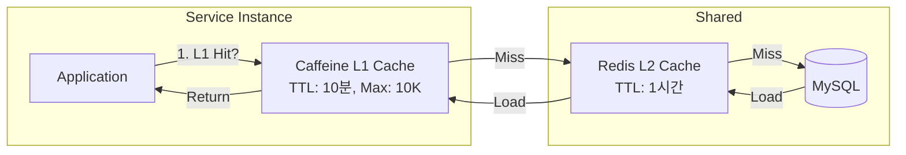
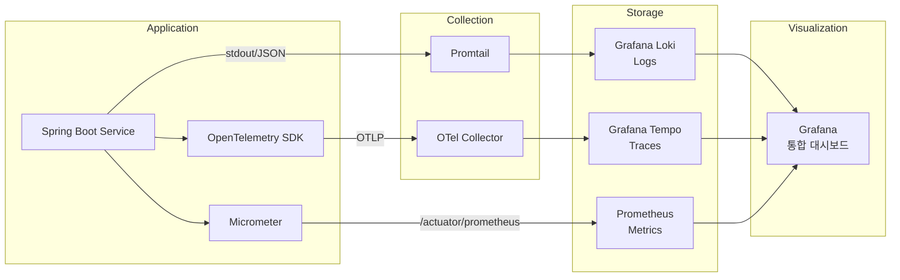

# 아키텍처 개선 후보군 비교

> 작성일: 2026-03-23
> 작성자: BE Architecture Team
> 상태: Draft

---

## 1. 서비스 간 통신

### 1.1 현재 상태

현재 서비스 간 통신은 BFF(closet-bff)에서 OpenFeign을 통한 동기 HTTP 호출로만 이루어진다.

```kotlin
// closet-bff/src/main/kotlin/com/closet/bff/client/ProductServiceClient.kt
@FeignClient(name = "product-service")
interface ProductServiceClient { ... }

// closet-bff/src/main/kotlin/com/closet/bff/client/OrderServiceClient.kt
@FeignClient(name = "order-service")
interface OrderServiceClient { ... }
```

문제점:
- BFF가 모든 서비스 호출의 중심 -- 단일 장애점
- 서비스 간 직접 통신 경로 없음
- 동기 호출 체인 길어질수록 응답 시간 증가 (Fan-out 문제)
- Circuit Breaker 미적용

### 1.2 후보군

#### A) REST + OpenFeign (현재 확장)

기존 방식을 유지하되 서비스 간 직접 Feign 호출을 추가하고, Resilience4j Circuit Breaker를 적용한다.

```kotlin
// Order Service → Promotion Service 직접 호출
@FeignClient(name = "promotion-service")
interface PromotionServiceClient {
    @PostMapping("/api/internal/v1/coupons/validate")
    fun validateCoupon(request: CouponValidationRequest): CouponValidationResponse
}
```

#### B) gRPC

서비스 간 통신을 gRPC (Protocol Buffers)로 전환한다.

```protobuf
// promotion.proto
service PromotionService {
  rpc ValidateCoupon(CouponValidationRequest) returns (CouponValidationResponse);
  rpc CalculateDiscount(DiscountCalculationRequest) returns (DiscountCalculationResponse);
}
```

#### C) Kafka Event + REST Fallback (하이브리드)

비동기 가능한 통신은 Kafka 이벤트, 동기 응답이 필요한 통신만 REST를 사용한다.

```
동기 필요: 쿠폰 검증, 재고 확인, 회원 조회 → REST/Feign
비동기 가능: 상태 변경 알림, 집계 갱신, 알림 발송 → Kafka Event
```

### 1.3 트레이드오프 비교

| 기준 | A) REST/Feign | B) gRPC | C) Kafka+REST |
|------|-------------|---------|---------------|
| **성능** | 보통 (JSON 직렬화, HTTP/1.1) | 높음 (Protobuf 직렬화, HTTP/2 멀티플렉싱) | 높음 (비동기 처리) |
| **지연 시간** | 중간 (네트워크 홉당 5-20ms) | 낮음 (네트워크 홉당 1-5ms) | 이벤트: 매우 낮음, REST: 중간 |
| **개발 편의성** | 매우 높음 (Spring 생태계 네이티브) | 중간 (proto 파일 관리, 코드 생성 빌드) | 높음 (REST는 기존 유지) |
| **디버깅** | 쉬움 (HTTP, JSON 가독성) | 어려움 (바이너리 프로토콜, 별도 도구 필요) | 중간 (이벤트 추적 필요) |
| **스키마 관리** | 느슨함 (API 문서 기반) | 엄격함 (proto 파일 중앙 관리) | 중간 (Avro/JSON Schema) |
| **호환성** | 매우 높음 (REST 표준) | 중간 (gRPC 클라이언트 필요) | 높음 |
| **브라우저 호환** | 완전 호환 | 불가 (gRPC-Web 별도 필요) | REST 부분만 호환 |
| **장애 격리** | Circuit Breaker 필요 | Circuit Breaker 필요 | 이벤트는 자연스럽게 격리 |
| **도입 비용** | 매우 낮음 (기존 유지) | 높음 (빌드 파이프라인, proto 관리) | 중간 (Kafka 인프라 필요) |
| **팀 러닝커브** | 없음 | 높음 | 중간 |

### 1.4 결정: C) Kafka Event + REST Fallback

**근거:**
1. **17개 서비스** 규모에서 동기 호출만으로는 장애 전파 위험이 너무 높음
2. gRPC의 성능 이점은 매력적이지만, 의류 이커머스에서 서비스 간 통신 지연이 비즈니스 병목이 아님 (DB I/O가 병목)
3. 이미 Kafka 인프라가 docker-compose에 구성되어 있고, 이벤트 클래스(OrderEvent.kt)가 정의됨
4. 동기 응답이 반드시 필요한 곳(쿠폰 검증, 재고 확인)만 REST를 유지하면 복잡도를 제어 가능
5. 개인 프로젝트 + 학습 목적이므로 이벤트 기반 아키텍처 학습 효과가 높음

**적용 기준:**

| 통신 유형 | 방식 | 예시 |
|----------|------|------|
| 실시간 응답 필수 (Query) | REST/Feign + Circuit Breaker | 쿠폰 검증, 재고 가용성 확인, 회원 정보 조회 |
| 상태 변경 전파 (Event) | Kafka Event | 주문 상태 변경, 배송 상태 변경, 상품 변경 |
| 집계/동기화 (Sync) | Kafka Event | 검색 인덱싱, 리뷰 집계, 전시 갱신 |
| 보상 트랜잭션 | Kafka Event | 재고 해제, 결제 환불, 쿠폰 복원 |

---

## 2. 데이터베이스 전략

### 2.1 현재 상태

모든 17개 서비스가 단일 MySQL 인스턴스의 단일 데이터베이스(closet)를 공유한다. 각 서비스는 자신의 테이블만 사용하지만, 물리적으로 같은 DB에 존재한다.

문제점:
- 서비스 간 직접 JOIN 가능 -- 서비스 경계 침범 유혹
- 단일 DB 장애 시 전체 플랫폼 중단
- 스키마 변경 시 다른 서비스에 영향 가능
- Connection Pool 경쟁

### 2.2 후보군

#### A) 공유 DB (현재)

```
closet (MySQL 8.0)
├── product 테이블들
├── order 테이블들
├── payment 테이블들
├── ... (17개 서비스 전체)
```

#### B) Database per Service

```
closet-product-db (MySQL)
closet-order-db (MySQL)
closet-payment-db (MySQL)
closet-inventory-db (MySQL)
... (17개 DB)
```

#### C) Schema per Service

```
closet (MySQL 8.0)
├── closet_product (schema)
├── closet_order (schema)
├── closet_payment (schema)
├── closet_inventory (schema)
├── ... (17개 schema)
```

### 2.3 트레이드오프 비교

| 기준 | A) 공유 DB | B) DB per Service | C) Schema per Service |
|------|----------|------------------|---------------------|
| **데이터 격리** | 없음 (직접 JOIN 가능) | 완전 격리 | 논리적 격리 (물리적 공유) |
| **서비스 독립성** | 낮음 | 높음 | 중간 |
| **장애 격리** | 없음 (단일 장애점) | 완전 격리 | 부분 격리 (리소스 경쟁) |
| **운영 복잡도** | 낮음 (DB 1개 관리) | 매우 높음 (17개 DB 관리) | 낮음 (DB 1개, 스키마 17개) |
| **비용** | 최저 | 최고 (17개 인스턴스) | 낮음 |
| **트랜잭션** | 로컬 트랜잭션 | 분산 트랜잭션 필수 | 크로스 스키마 트랜잭션 가능 |
| **마이그레이션** | 영향 범위 넓음 | 영향 범위 좁음 | 영향 범위 좁음 |
| **Connection Pool** | 경쟁 | 독립 | 경쟁 (제한적) |
| **백업/복구** | 전체 단위 | 서비스 단위 | 스키마 단위 가능 |
| **확장성** | 수직 확장만 | 수평 확장 가능 | 수직 확장 + 일부 수평 |

### 2.4 결정: C) Schema per Service (단기) -> B) DB per Service (장기)

**단기 (0-6개월): Schema per Service**

근거:
1. 현재 개발 단계에서 17개 DB를 운영하는 것은 과도한 인프라 부담
2. Schema 분리만으로도 서비스 경계를 명확히 할 수 있음
3. Flyway 마이그레이션을 스키마별로 분리하여 독립 배포 준비
4. Connection Pool을 스키마별로 분리하여 리소스 경쟁 완화

```yaml
# application.yml (Order Service)
spring:
  datasource:
    url: jdbc:mysql://localhost:3306/closet_order
    hikari:
      maximum-pool-size: 10
```

**장기 (6개월 이후): DB per Service**

- 트래픽 증가 시 핵심 서비스(Order, Product, Inventory)부터 독립 DB 분리
- 우선순위: Order > Product > Inventory > Payment > Member

### 2.5 서비스 그룹핑 (Schema per Service 적용 시)

| 그룹 | 스키마 | 서비스 | 근거 |
|------|--------|--------|------|
| Core Commerce | closet_order | Order | 주문 트래픽 가장 높음 |
| Core Commerce | closet_payment | Payment | 결제 데이터 민감, 독립 관리 |
| Core Commerce | closet_inventory | Inventory | 동시성 높음 (@Version) |
| Product | closet_product | Product | 읽기 빈도 매우 높음 |
| Product | closet_search | Search | ES가 주 저장소, MySQL 보조 |
| User | closet_member | Member | 인증 데이터 민감 |
| User | closet_seller | Seller | |
| Platform | closet_promotion | Promotion | |
| Platform | closet_display | Display | |
| Platform | closet_review | Review | |
| Platform | closet_notification | Notification | |
| Platform | closet_settlement | Settlement | 정산 데이터 감사 필요 |
| Platform | closet_shipping | Shipping | |
| Platform | closet_content | Content | |
| Platform | closet_cs | CS | |

---

## 3. 캐싱 전략

### 3.1 현재 상태

- Redis 7.0이 인프라에 포함되어 있으나, 일부 서비스(Display의 RankingSnapshot)에서만 사용
- 대부분의 읽기 요청이 DB 직접 조회
- 캐시 무효화 전략 미정의

### 3.2 후보군

#### A) Local Cache (Caffeine)

JVM 내 메모리 캐시. 네트워크 홉 없이 가장 빠른 응답.

```kotlin
@Bean
fun caffeineCache(): CacheManager {
    return CaffeineCacheManager().apply {
        setCaffeine(Caffeine.newBuilder()
            .maximumSize(10_000)
            .expireAfterWrite(5, TimeUnit.MINUTES))
    }
}
```

#### B) Distributed Cache (Redis)

Redis를 중앙 캐시 서버로 사용. 서비스 인스턴스 간 캐시 일관성 보장.

```kotlin
@Cacheable(value = ["product"], key = "#productId")
fun getProduct(productId: Long): ProductResponse { ... }
```

#### C) CDN + Redis 2-tier

정적 콘텐츠는 CDN(CloudFront), 동적 데이터는 Redis.

```
Client → CDN (상품 이미지, 정적 페이지)
       → Gateway → Redis (상품 정보, 카테고리)
                  → DB (재고, 주문)
```

#### D) Cache-Aside + Write-Through

읽기: Cache-Aside (캐시 미스 시 DB 조회 후 캐시 저장)
쓰기: Write-Through (DB 쓰기 시 캐시도 동시 갱신)

### 3.3 트레이드오프 비교

| 기준 | A) Caffeine | B) Redis | C) CDN+Redis | D) Cache-Aside+WT |
|------|-----------|---------|-------------|-------------------|
| **응답 시간** | 최고 (~1ms) | 높음 (~3-5ms) | CDN: 최고, Redis: 높음 | 높음 |
| **일관성** | 인스턴스별 상이 | 전역 일관 | CDN: Eventual, Redis: 일관 | 쓰기 즉시 반영 |
| **메모리 사용** | JVM 힙 소비 | 외부 Redis | CDN: 없음, Redis: 외부 | Redis 외부 |
| **확장성** | 인스턴스 수만큼 메모리 | Redis 클러스터 | CDN 글로벌 | Redis 클러스터 |
| **무효화** | TTL 기반 (지연) | 즉시 무효화 가능 | CDN: 지연, Redis: 즉시 | 쓰기 시 즉시 |
| **운영 복잡도** | 낮음 | 중간 | 높음 (CDN 설정) | 중간 |
| **비용** | 없음 | Redis 인스턴스 | CDN + Redis | Redis 인스턴스 |

### 3.4 결정: 대상별 혼합 전략

단일 전략이 아닌, 데이터 특성에 따른 혼합 전략을 적용한다.

| 대상 | 읽기 빈도 | 쓰기 빈도 | 일관성 요구 | 추천 전략 | TTL | 근거 |
|------|----------|----------|-----------|----------|-----|------|
| **카테고리 목록** | 매우 높음 | 매우 낮음 | 낮음 | Caffeine + Redis (L1/L2) | Local: 10분, Redis: 1시간 | 변경 거의 없음, 모든 페이지에서 사용 |
| **브랜드 목록** | 매우 높음 | 매우 낮음 | 낮음 | Caffeine + Redis (L1/L2) | Local: 10분, Redis: 1시간 | 카테고리와 동일 |
| **상품 상세** | 매우 높음 | 낮음 | 중간 | Redis Cache-Aside | 5분 | 상품 수정 시 캐시 무효화 |
| **상품 목록 (페이지)** | 매우 높음 | 낮음 | 중간 | Redis Cache-Aside | 3분 | 정렬/필터 조합이 다양 |
| **랭킹** | 높음 | 중간 (배치) | 낮음 | Redis ZSET (기존 유지) | 1시간 | 이미 RankingSnapshot으로 구현 |
| **재고 수량** | 높음 | 높음 | 높음 | 캐시 미적용 (DB 직접) | - | 재고 정합성이 가장 중요 |
| **회원 세션/토큰** | 높음 | 높음 | 높음 | Redis | 30분 | Gateway JWT 검증에 활용 |
| **쿠폰 목록** | 중간 | 낮음 | 중간 | Redis Cache-Aside | 10분 | 사용 가능 쿠폰 목록 |
| **검색 결과** | 높음 | 중간 | 낮음 | ES 자체 캐시 | - | ES Request Cache 활용 |
| **상품 이미지** | 매우 높음 | 매우 낮음 | 없음 | CDN (CloudFront + S3) | 24시간 | 정적 파일 |
| **배너/전시** | 높음 | 낮음 | 낮음 | Redis Cache-Aside | 5분 | 시간대별 변경 |
| **리뷰 집계** | 높음 | 중간 | 낮음 | Redis Hash | 10분 | 평균 별점, 리뷰 수 |

### 3.5 L1/L2 캐시 아키텍처



### 3.6 캐시 무효화 전략

| 이벤트 | 무효화 대상 | 방식 |
|--------|-----------|------|
| ProductUpdated | product:{id}, product-list:{categoryId}:* | Kafka 이벤트 수신 -> Redis DEL |
| ProductActivated/Deactivated | product:{id}, product-list:* | Kafka 이벤트 수신 -> Redis DEL |
| ReviewCreated/Deleted | review-summary:{productId} | Kafka 이벤트 수신 -> Redis DEL |
| SellerSuspended | product:{id} (해당 셀러) | Kafka 이벤트 수신 -> 패턴 DEL |
| BannerUpdated | banner:*, home:* | 직접 무효화 (관리자 API) |
| ExhibitionUpdated | exhibition:{id}, exhibition-list:* | 직접 무효화 |

### 3.7 예상 캐시 히트율 및 효과

| 대상 | 예상 히트율 | DB 쿼리 감소 | 응답 시간 개선 |
|------|-----------|------------|-------------|
| 카테고리/브랜드 | 99%+ | -99% | 50ms -> 1ms |
| 상품 상세 | 85-90% | -85% | 30ms -> 5ms |
| 상품 목록 | 70-80% | -70% | 100ms -> 10ms |
| 랭킹 | 95%+ | -95% | 80ms -> 3ms |
| 배너/전시 | 90%+ | -90% | 50ms -> 5ms |

---

## 4. API 버전 관리

### 4.1 현재 상태

API 버전 관리 전략이 없다. BFF와 내부 서비스 모두 `/api/v1/` prefix를 사용하고 있지만, 버전 변경 정책이 미정의.

### 4.2 후보군

#### A) URL Versioning

```
/api/v1/products
/api/v2/products
```

#### B) Header Versioning

```
GET /api/products
Accept: application/vnd.closet.v1+json
```

#### C) Query Parameter Versioning

```
/api/products?version=1
/api/products?version=2
```

### 4.3 트레이드오프 비교

| 기준 | A) URL | B) Header | C) Query |
|------|--------|----------|---------|
| **가독성** | 매우 높음 (URL에 버전 명시) | 낮음 (헤더 확인 필요) | 중간 |
| **캐싱** | 쉬움 (URL 기반 캐시) | 어려움 (Vary 헤더 필요) | 쉬움 |
| **라우팅** | 쉬움 (Gateway URL 기반) | 어려움 (헤더 파싱 필요) | 중간 |
| **클라이언트 편의성** | 높음 (URL 변경만) | 낮음 (헤더 설정 필요) | 높음 |
| **REST 순수성** | 낮음 (리소스 URI 변경) | 높음 (Content Negotiation) | 낮음 |
| **브라우저 테스트** | 쉬움 | 어려움 (curl 필요) | 쉬움 |
| **API 문서** | 쉬움 (별도 엔드포인트) | 복잡함 | 쉬움 |
| **업계 사용** | 가장 많음 (Google, Twitter) | 일부 (GitHub) | 드묾 |

### 4.4 결정: A) URL Versioning

**근거:**
1. 가장 직관적이고 팀 러닝커브가 없음
2. Gateway에서 URL 기반 라우팅이 이미 구현되어 있음
3. 캐시(Redis, CDN) 키에 URL이 자연스럽게 포함
4. 무신사 등 국내 이커머스 대부분 URL Versioning 사용
5. Swagger/OpenAPI 문서화가 버전별로 깔끔하게 분리

**적용 규칙:**

```
외부 API (BFF → Client):  /api/v{n}/{resource}
내부 API (서비스 간):      /api/internal/v{n}/{resource}
```

| 규칙 | 설명 |
|------|------|
| Major 버전만 관리 | v1, v2 (Minor는 하위 호환) |
| 하위 호환 변경 | 필드 추가, 옵셔널 파라미터 추가 -- 버전 유지 |
| 비호환 변경 | 필드 제거, 타입 변경, 필수 파라미터 추가 -- 새 버전 |
| 이전 버전 유지 기간 | 새 버전 출시 후 6개월 Deprecation 기간 |
| Deprecation 알림 | 응답 헤더 `Sunset: <date>` + `Deprecation: true` |

---

## 5. 인증/인가 아키텍처

### 5.1 현재 상태

Gateway에서 JWT 검증 (`JwtAuthenticationFilter`)이 이루어지고 있다. 서비스 간 통신은 인증 없이 이루어진다.

문제점:
- 서비스 간 통신에 인증/인가 없음 -- 내부 API를 외부에서 직접 호출 가능
- JWT 토큰 검증만 존재 -- 리소스별 인가(RBAC) 없음
- 셀러/관리자/일반 회원의 권한 분리 미흡

### 5.2 후보군

#### A) Gateway JWT 검증 (현재 확장)

Gateway에서 JWT 검증 + 역할(Role) 기반 라우팅. 서비스는 Gateway가 전달한 헤더를 신뢰.

```
Client → Gateway (JWT 검증 + Role 추출) → Service (X-User-Id, X-User-Role 헤더 신뢰)
```

#### B) Spring Security + OAuth2 Resource Server

각 서비스가 독립적으로 JWT를 검증하는 Resource Server로 동작.

```
Client → Gateway (JWT 전달) → Service (자체 JWT 검증 + @PreAuthorize)
```

#### C) API Key + JWT 이중 인증

외부: JWT (사용자 인증), 내부: API Key (서비스 인증)

```
Client → Gateway (JWT 검증) → Service (API Key 검증 + JWT 클레임 전파)
서비스 → 서비스: API Key 인증
```

#### D) mTLS (서비스 간 Mutual TLS)

서비스 간 통신에 클라이언트 인증서 기반 상호 인증.

```
Service A ←mTLS→ Service B (상호 인증서 검증)
```

### 5.3 트레이드오프 비교

| 기준 | A) Gateway JWT | B) OAuth2 RS | C) API Key+JWT | D) mTLS |
|------|---------------|-------------|---------------|---------|
| **보안 수준** | 중간 (Gateway 우회 시 취약) | 높음 (각 서비스 독립 검증) | 높음 (이중 인증) | 매우 높음 |
| **성능** | 높음 (1회 검증) | 중간 (서비스마다 검증) | 중간 | 낮음 (TLS 핸드셰이크) |
| **구현 복잡도** | 낮음 | 중간 | 중간 | 높음 (인증서 관리) |
| **서비스 간 인증** | 없음 | JWT 전파 | API Key | 인증서 |
| **권한 관리** | Gateway 레벨 | 서비스 레벨 (@PreAuthorize) | 서비스 레벨 | 서비스 레벨 |
| **운영 부담** | 낮음 | 중간 | 중간 (Key 관리) | 높음 (인증서 갱신) |
| **팀 러닝커브** | 낮음 | 중간 | 낮음 | 높음 |

### 5.4 결정: A) Gateway JWT 확장 + C) 내부 API Key (하이브리드)

**근거:**
1. 외부 요청은 Gateway에서 JWT 검증 -- 기존 방식 유지
2. 서비스 간 내부 통신은 API Key로 보호 -- Gateway 우회 방지
3. 역할(Role) 기반 인가를 Gateway 레벨에서 처리
4. mTLS는 Kubernetes 환경에서 서비스 메시(Istio 등) 도입 시 고려

**적용 구조:**

```mermaid
graph TB
    subgraph "External"
        CLIENT[Client<br/>JWT Bearer Token]
    end

    subgraph "Edge"
        GW[Gateway<br/>JWT 검증 + Role 추출]
    end

    subgraph "Internal"
        SVC_A[Order Service<br/>API Key 검증]
        SVC_B[Promotion Service<br/>API Key 검증]
    end

    CLIENT -->|Authorization: Bearer {jwt}| GW
    GW -->|X-User-Id, X-User-Role,<br/>X-Internal-Api-Key| SVC_A
    SVC_A -->|X-Internal-Api-Key| SVC_B

    style GW fill:#f9f,stroke:#333
```

**Role 기반 접근 제어:**

| Role | 접근 가능 API 패턴 | 비고 |
|------|------------------|------|
| MEMBER | /api/v1/orders/**, /api/v1/reviews/**, /api/v1/mypage/** | 일반 회원 |
| SELLER | /api/v1/seller/**, /api/v1/products/** (자기 상품만) | 셀러 |
| ADMIN | /api/v1/admin/** | 관리자 |
| INTERNAL | /api/internal/** | 서비스 간 (API Key) |

---

## 6. 로깅/트레이싱 아키텍처

### 6.1 현재 상태

- Gateway에 `RequestLoggingFilter` 구현
- Docker Compose에 SigNoz, Grafana Tempo, Zipkin이 설정되어 있음
- 서비스별 로깅은 Spring Boot 기본 (Logback → stdout)
- 분산 트레이싱: SigNoz/Tempo 구성은 있으나 서비스 간 trace 전파 미구현

### 6.2 후보군

#### A) 로컬 파일 + Grafana Tempo (현재)

```
Service → stdout → Docker Log → Grafana Tempo (Trace)
                              → Grafana (Metrics via Prometheus)
```

#### B) ELK Stack

```
Service → Logback → Filebeat → Logstash → Elasticsearch → Kibana
                                                         → Alerts
```

#### C) Grafana Loki + Tempo + Prometheus (현재 인프라 활용)

```
Service → Promtail → Loki (Logs)
       → Micrometer → Prometheus (Metrics)
       → OpenTelemetry → Tempo (Traces)
       → Grafana (통합 대시보드)
```

#### D) Datadog SaaS

```
Service → Datadog Agent → Datadog Cloud (Logs + Metrics + Traces + APM)
```

### 6.3 트레이드오프 비교

| 기준 | A) 현재 | B) ELK | C) Loki+Tempo+Prometheus | D) Datadog |
|------|--------|--------|-------------------------|-----------|
| **초기 비용** | 무료 | 무료 (OSS) | 무료 (OSS) | 유료 (per host) |
| **운영 비용** | 낮음 | 높음 (ES 리소스) | 중간 | 매우 높음 |
| **로그 검색** | 없음 | 매우 강력 (전문 검색) | 좋음 (LogQL) | 매우 강력 |
| **메트릭** | Prometheus 기반 | Metricbeat | Prometheus (네이티브) | APM 자동 |
| **트레이싱** | Tempo/Zipkin (구성만) | 별도 구성 필요 | Tempo (네이티브) | 자동 |
| **통합 대시보드** | Grafana | Kibana | Grafana | Datadog |
| **리소스 사용** | 낮음 | 높음 (ES 3-node) | 중간 | Agent만 |
| **알림** | Grafana Alerting | ElastAlert | Grafana Alerting | 네이티브 |
| **러닝커브** | 낮음 | 중간 | 중간 | 낮음 |
| **기존 인프라 활용** | 부분 | 별도 구축 | 최대 활용 | 별도 |

### 6.4 결정: C) Grafana Loki + Tempo + Prometheus

**근거:**
1. Docker Compose에 이미 Grafana, Tempo, SigNoz가 구성되어 있음 -- 기존 인프라 최대 활용
2. Loki는 ELK 대비 리소스 사용이 훨씬 적고, 개인 프로젝트에 적합
3. Prometheus는 Spring Boot Actuator + Micrometer와 네이티브 연동
4. Grafana 하나로 Logs(Loki) + Metrics(Prometheus) + Traces(Tempo)를 통합 조회
5. Datadog은 비용이 과도하고, ELK는 ES 운영 부담이 높음

**구성 상세:**



**핵심 대시보드:**

| 대시보드 | 데이터 소스 | 주요 패널 |
|---------|-----------|----------|
| Service Overview | Prometheus | 요청수, 응답시간 P50/P95/P99, 에러율, JVM 메모리 |
| Kafka Consumer Lag | Prometheus | 컨슈머 그룹별 랙, 처리 속도 |
| Saga Monitoring | Loki + Prometheus | Saga 상태 분포, 실패율, 평균 완료 시간 |
| API Performance | Tempo + Prometheus | 엔드포인트별 응답시간, 분산 트레이싱 |
| Error Tracking | Loki | 에러 로그 검색, 에러 발생 추이 |
| DB Performance | Prometheus | Connection Pool 사용률, 슬로우 쿼리 수 |

**서비스 간 Trace 전파:**

```kotlin
// Kafka 이벤트에 TraceContext 전파
@Bean
fun kafkaProducerInterceptor(): ProducerInterceptor<String, String> {
    // OpenTelemetry W3C TraceContext를 Kafka 헤더에 주입
    // traceparent: 00-{traceId}-{spanId}-01
}
```

---

## 7. 에러 처리 및 복원력

### 7.1 후보군

#### A) Circuit Breaker (Resilience4j)

서비스 호출 실패 시 빠르게 실패하여 장애 전파 방지.

#### B) Retry + Exponential Backoff

일시적 장애에 대한 자동 재시도.

#### C) Bulkhead (격벽 패턴)

서비스별 스레드 풀/세마포어 분리로 리소스 격리.

#### D) Timeout + Fallback

타임아웃 설정 + 대안 응답 제공.

### 7.2 트레이드오프

| 기준 | A) Circuit Breaker | B) Retry | C) Bulkhead | D) Timeout+Fallback |
|------|-------------------|---------|------------|-------------------|
| **장애 전파 방지** | 매우 높음 | 낮음 (재시도 부하) | 높음 | 중간 |
| **가용성** | 높음 (빠른 실패) | 중간 | 높음 | 높음 |
| **복잡도** | 중간 | 낮음 | 중간 | 낮음 |
| **부하** | 낮음 (차단 시) | 높음 (재시도) | 중간 | 낮음 |

### 7.3 결정: 전체 적용

모든 패턴을 조합하여 적용한다. 이들은 상호 보완적이다.

```kotlin
@CircuitBreaker(name = "promotionService", fallbackMethod = "fallbackDiscount")
@Retry(name = "promotionService")
@Bulkhead(name = "promotionService")
@TimeLimiter(name = "promotionService")
fun validateCoupon(request: CouponValidationRequest): CouponValidationResponse { ... }

fun fallbackDiscount(request: CouponValidationRequest, e: Exception): CouponValidationResponse {
    log.warn("Promotion 서비스 장애 -- 할인 없이 진행: ${e.message}")
    return CouponValidationResponse(discountAmount = Money.ZERO, valid = false)
}
```

**서비스별 Resilience4j 설정:**

| 서비스 | Circuit Breaker | Retry | Timeout | Fallback |
|--------|----------------|-------|---------|----------|
| Promotion (쿠폰 검증) | 실패율 50%, 5회 | 3회, 500ms 간격 | 3초 | 할인 없이 진행 |
| Inventory (재고 확인) | 실패율 50%, 5회 | 3회, 300ms 간격 | 2초 | 일시 품절 표시 |
| Member (회원 조회) | 실패율 50%, 5회 | 2회, 500ms 간격 | 3초 | 캐시 데이터 반환 |
| Payment (PG 호출) | 실패율 30%, 10회 | 2회, 1000ms 간격 | 30초 | 결제 실패 반환 |

---

## 8. 종합 아키텍처 결정 요약

| # | 영역 | 결정 | 핵심 근거 |
|---|------|------|----------|
| 1 | 서비스 간 통신 | Kafka Event + REST Fallback | 장애 격리 + 기존 인프라 활용 |
| 2 | 데이터베이스 | Schema per Service (단기) | 운영 부담 최소화 + 서비스 경계 확립 |
| 3 | 캐싱 | 대상별 혼합 (Caffeine L1 + Redis L2) | 데이터 특성에 맞는 최적 전략 |
| 4 | API 버전 관리 | URL Versioning | 직관적 + Gateway 라우팅 호환 |
| 5 | 인증/인가 | Gateway JWT + 내부 API Key | 보안 + 구현 용이성 균형 |
| 6 | 로깅/트레이싱 | Grafana Loki + Tempo + Prometheus | 기존 인프라 활용 + 통합 대시보드 |
| 7 | 에러 처리 | Resilience4j 풀 스택 | 서비스별 맞춤 복원력 |

---

## 9. 구현 로드맵

| 단계 | 기간 | 작업 | 의존성 |
|------|------|------|--------|
| Phase 1 | 1주 | Schema per Service 분리 (Flyway 마이그레이션) | 없음 |
| Phase 2 | 1주 | Resilience4j + Circuit Breaker 적용 | 없음 |
| Phase 3 | 2주 | Kafka 이벤트 인프라 + Outbox 구현 | Phase 1 |
| Phase 4 | 1주 | Redis 캐싱 전략 적용 (상품, 카테고리) | 없음 |
| Phase 5 | 1주 | Gateway 인증 강화 + 내부 API Key | 없음 |
| Phase 6 | 2주 | Loki + Tempo + Prometheus 모니터링 | Phase 3 |
| Phase 7 | 1주 | L1/L2 캐시 + 캐시 무효화 이벤트 연동 | Phase 3, 4 |
