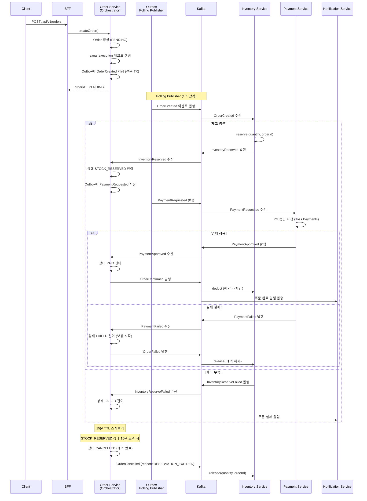
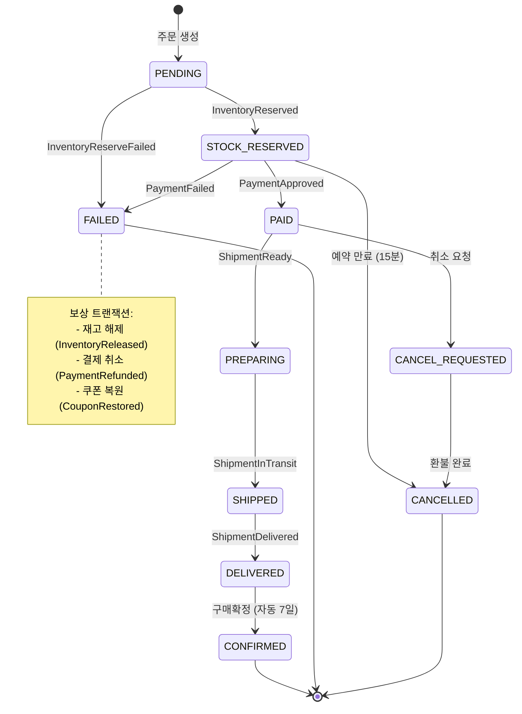
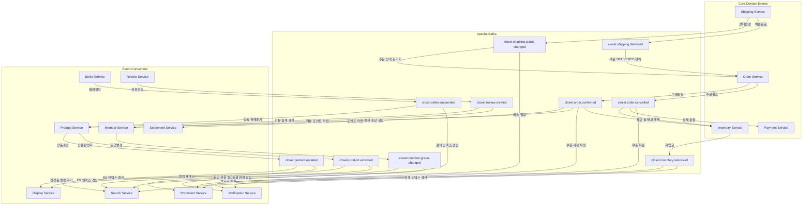
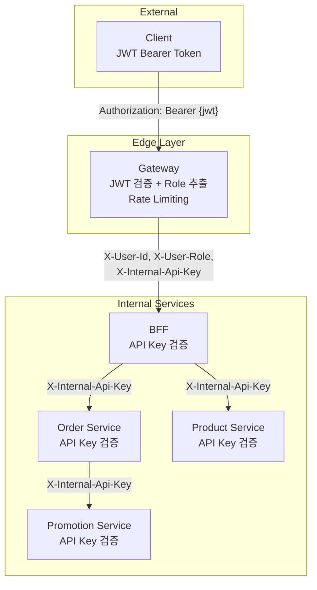

# BE 자체 개선 로드맵

> 작성일: 2026-03-23
> 대상: 17개 서비스 (Product, Order, Payment, Shipping, Inventory, Member, Display, Search, Promotion, Review, CS, Settlement, Notification, Content, Seller, Gateway, BFF)
> 기간: 24주 (6개 Sprint)
> 근거 문서:
> - `.analysis/verification/results/2026-03-23_tech-debt/tech_debt_full_analysis.md`
> - `.analysis/be-implementation/results/2026-03-23_domain-integration/domain_integration_design.md`
> - `.analysis/be-implementation/results/2026-03-23_performance-plan/performance_improvement_plan.md`
> - `.analysis/be-implementation/results/2026-03-23_architecture-improvement/architecture_candidates.md`

---

## 1. 현재 상태 진단 요약

### 1.1 정량 요약

| 카테고리 | Critical | High | Medium | Low | 합계 |
|---------|----------|------|--------|-----|------|
| 아키텍처 | 2 | 3 | 2 | 1 | 8 |
| 코드 품질 | 0 | 3 | 4 | 3 | 10 |
| 테스트 | 1 | 2 | 2 | 1 | 6 |
| 보안 | 2 | 2 | 1 | 0 | 5 |
| 성능 | 1 | 2 | 2 | 1 | 6 |
| 인프라 | 1 | 2 | 2 | 1 | 6 |
| 문서 | 0 | 1 | 2 | 1 | 4 |
| **합계** | **7** | **15** | **15** | **8** | **45** |

### 1.2 영역별 핵심 이슈

| 영역 | 상태 | 핵심 이슈 | 근거 문서 |
|------|------|----------|----------|
| 기술 부채 | Critical 7건, High 15건 | JWT 하드코딩(S-01), Saga 미구현(A-01), Payment 테스트 0건(T-02) | tech_debt_full_analysis |
| 도메인 통합 | 17개 서비스 고립 | Kafka Producer/Consumer 0건, 이벤트 발행 0건, BFF Feign 동기 호출만 | domain_integration_design |
| 성능 | 기준선 미측정 | N+1 7곳(Product 41쿼리/요청), 캐싱 0건, Connection Pool 기본값(10) 서비스 존재 | performance_improvement_plan |
| 아키텍처 | 모놀리스 상태 | 공유 DB(closet), Gateway 5개만 등록, BFF 4개 클라이언트만 | architecture_candidates |
| 테스트 | 단위만 | 통합 0건(BaseIntegrationTest 미활용), E2E 0건, Payment 테스트 0건 | tech_debt_full_analysis |
| 보안 | 취약 | Spring Security 없음, JWT Secret 하드코딩, Phase 2~4 인증 미적용 | tech_debt_full_analysis |

### 1.3 잘 된 부분 (유지 대상)

- **enum 상태 전이 패턴**: 13/15개 상태 enum에 `canTransitionTo`/`validateTransitionTo` 구현
- **BaseEntity + JPA Auditing**: closet-common에 정의, 다수 서비스 활용
- **Money VO**: 금액 연산 캡슐화 (연산자 오버로딩, 불변 보장)
- **ApiResponse 표준화**: `ok()`, `created()`, `fail()` 전 서비스 통일
- **Virtual Thread**: 대부분 서비스에서 `spring.threads.virtual.enabled: true`
- **분산 락**: InventoryLockService (Redis SETNX + Lua)
- **모니터링 인프라**: Prometheus + Grafana + Loki + Tempo + Zipkin

---

## 2. Sprint 로드맵

### Sprint 1 (2주): 긴급 안정화

**목표**: 보안 취약점 0건 + 전 서비스 운영 인프라 확보

| # | 작업 | 트랙 | 심각도 | 예상 공수 | 관련 이슈 | 후보군/트레이드오프 |
|---|------|------|--------|----------|----------|-----------------|
| 1 | JWT Secret 환경변수 이관 | 보안 | P0 | 2h | S-01 | 환경변수 vs Vault vs AWS Secrets Manager -- 환경변수 선택 (단순, Sprint 6에서 Vault 검토) |
| 2 | DB 비밀번호 환경변수화 | 보안 | P0 | 2h | S-03 | application-local.yml(gitignore) + application-docker.yml(환경변수 참조) 분리 |
| 3 | Payment 도메인 보강 + 테스트 작성 | 부채 | P0 | 1d | T-02, C-05 | PaymentStatus에 canTransitionTo 패턴 적용, 단위 테스트 최소 10 TC |
| 4 | Gateway Phase 2~4 라우팅 등록 (12개) | 부채 | P0 | 2h | A-03, S-04 | 개별 라우팅 vs BFF 전용 -- BFF 전용 (Client->BFF만, 서비스 직접 접근 차단) |
| 5 | Docker Compose Phase 2~4 서비스 추가 | 인프라 | P0 | 4h | I-01 | 12개 서비스 + 표준 Dockerfile (multi-stage build) |
| 6 | 입력 검증 (@Valid) 전 서비스 적용 | 보안 | P0 | 1d | S-05 | Payment DTO 최우선, 나머지 서비스 감사 |
| 7 | BaseEntity 상속 일관성 통일 | 부채 | P1 | 1d | C-01 | 직접 정의 엔티티 18개를 BaseEntity 상속으로 전환 |
| 8 | Flyway 테이블명 통일 | 부채 | P1 | 2h | C-08 | 전 서비스 `flyway_schema_history_{service}` 명시 |
| 9 | HikariCP 설정 통일 | 성능 | P1 | 2h | P-04 | 미설정 4개 서비스(promotion, display, cs, seller)에 기본값 적용 |
| 10 | Zipkin/트레이싱 설정 통일 | 인프라 | P1 | 2h | I-02, I-03 | notification, content에 Zipkin 설정 추가 |

**Sprint 1 완료 기준**:
- [ ] 보안 P0 이슈 0건 (JWT, DB 비밀번호 환경변수화)
- [ ] 전 17개 서비스 Docker Compose 기동 성공
- [ ] Payment 서비스 테스트 10 TC 이상
- [ ] Gateway에 17개 서비스 라우팅 등록

---

### Sprint 2 (2주): 핵심 인프라

**목표**: Kafka 인프라 + Transactional Outbox 기반 구축 + Connection Pool 안정화

| # | 작업 | 트랙 | 예상 공수 | 관련 이슈 | 후보군 비교 |
|---|------|------|----------|----------|-----------|
| 11 | Kafka Producer/Consumer 공통 모듈 (closet-common) | 통합 | 2d | A-02, C-09 | **A) Avro** vs **B) JSON** -- JSON 선택 (단순, 스키마 레지스트리 불필요, Sprint 6에서 Avro 검토) |
| 12 | Transactional Outbox 테이블 + Polling Publisher | 통합 | 3d | A-01 | **A) Outbox+Polling** vs **B) CDC(Debezium)** -- Outbox 선택 (운영 단순, Debezium 인프라 불필요) |
| 13 | 이벤트 공통 엔벨로프 (DomainEvent<T>) | 통합 | 1d | D-04 | eventId(UUID), eventType, aggregateType, aggregateId, payload, metadata, occurredAt |
| 14 | 멱등성 보장 모듈 (processed_event 테이블) | 통합 | 1d | - | eventId 기반 중복 처리 방지, 30일 TTL 스케줄러 |
| 15 | HikariCP 서비스별 차등 최적화 | 성능 | 1d | P-04 | **A) 30 통일** vs **B) 서비스별 차등** -- 차등 선택 (Order/Product/Inventory 20, Payment/Member 등 10, CS/Content 등 5) |
| 16 | MySQL max_connections 조정 (151 -> 250) | 성능 | 2h | - | 총 Connection 165 + 여유분 확보 |
| 17 | Connection Pool 모니터링 대시보드 (Grafana) | 성능 | 1d | - | HikariCP active/pending/idle 메트릭 시각화 |
| 18 | 핵심 테이블 인덱스 14개 추가 | 성능 | 1d | - | Flyway 마이그레이션으로 추가 (product, orders, review, member_coupon 등) |

**Sprint 2 완료 기준**:
- [ ] Kafka Producer/Consumer 공통 모듈 완성 + 단위 테스트
- [ ] Outbox 테이블 생성 + Polling Publisher 기동 확인
- [ ] 이벤트 엔벨로프 + 멱등성 모듈 완성
- [ ] 서비스별 HikariCP 차등 적용 + Grafana 대시보드

---

### Sprint 3 (4주): 주문-결제-재고 Saga

**목표**: 핵심 비즈니스 플로우 이벤트 기반 전환 + 데이터 정합성 보장

| # | 작업 | 트랙 | 예상 공수 | 관련 이슈 | 후보군 비교 |
|---|------|------|----------|----------|-----------|
| 19 | Order Saga Orchestrator 구현 | 통합 | 5d | A-01 | **A) Choreography** vs **B) Orchestration** -- Orchestration 선택 (디버깅 용이, 중앙 복구, OrderStatus 상태 머신 확장) |
| 20 | Inventory 이벤트 수신 (Reserve/Release/Deduct) | 통합 | 3d | A-01 | OrderCreated -> reserve, OrderFailed/Cancelled -> release, OrderConfirmed -> deduct |
| 21 | Payment 이벤트 수신 (Requested/Approved/Failed) | 통합 | 3d | A-01 | PaymentRequested -> PG 승인, 결과를 PaymentApproved/Failed로 발행 |
| 22 | Saga 상태 테이블 (saga_execution) | 통합 | 2d | A-01 | sagaId, orderId, currentStep, status, compensating, createdAt, completedAt |
| 23 | 보상 트랜잭션 구현 | 통합 | 3d | A-01 | 결제 실패 -> 재고 해제, 재고 부족 -> 주문 실패, 타임아웃 -> 전체 롤백 |
| 24 | 재고 예약 TTL 스케줄러 (15분 만료) | 부채 | 2d | A-06 | @Scheduled로 15분 초과 STOCK_RESERVED 주문 스캔 -> 재고 해제 + 주문 취소 |
| 25 | N+1 쿼리 해결 (Order->Items, Product->Options) | 성능 | 3d | P-01 | **A) @EntityGraph** vs **B) JOIN FETCH** vs **C) BatchSize** -- 용도별 혼합 (상세: Fetch Join, 목록: DTO 프로젝션, 리뷰: batch_fetch_size) |
| 26 | 상품 목록 DTO 프로젝션 적용 | 성능 | 2d | P-01 | 41쿼리 -> 2쿼리 (95% 감소) |
| 27 | Saga 통합 테스트 (Testcontainers + Kafka) | 테스트 | 3d | T-01, T-04 | 주문 생성 -> 재고 예약 -> 결제 -> 확정 전체 플로우 검증 |

#### Sprint 3 Saga 시퀀스 다이어그램



#### Saga 상태 머신



**Sprint 3 완료 기준**:
- [ ] 주문-결제-재고 Saga 정상 동작 (성공/실패/만료 3가지 시나리오)
- [ ] 보상 트랜잭션 검증 (결제 실패 시 재고 자동 해제)
- [ ] N+1 쿼리 해결: 상품 목록 41 -> 2쿼리, 상품 상세 4 -> 1쿼리
- [ ] Saga 통합 테스트 최소 5 TC (정상, 재고 부족, 결제 실패, 만료, 동시성)

---

### Sprint 4 (2주): 캐싱 + 읽기 최적화

**목표**: 읽기 API P95 응답시간 70% 개선

| # | 작업 | 트랙 | 예상 공수 | 후보군 비교 |
|---|------|------|----------|-----------|
| 28 | 카테고리/브랜드 Local Cache (Caffeine L1, TTL 10분) | 성능 | 1d | **A) Caffeine** vs **B) Redis만** -- Caffeine+Redis L1/L2 선택 (변경 거의 없음, 네트워크 홉 제거) |
| 29 | 상품 목록 Redis Cache-Aside (TTL 3분) | 성능 | 2d | **A) Cache-Aside** vs **B) Write-Through** -- Cache-Aside 선택 (쓰기 빈도 낮음, 구현 단순) |
| 30 | 상품 상세 Redis Cache-Aside (TTL 5분) | 성능 | 1d | 상품 수정 시 캐시 무효화 이벤트 연동 |
| 31 | BFF 응답 캐시 (홈 TTL 1분, 랭킹 TTL 1시간) | 성능 | 2d | BFF Fan-out 결과를 Redis에 캐싱, 가장 느린 호출(80ms) 기준 대폭 개선 |
| 32 | Cache Invalidation 이벤트 (ProductUpdated -> Cache Evict) | 성능+통합 | 2d | Kafka 이벤트 수신 -> Redis DEL (product:{id}, product-list:{categoryId}:*) |
| 33 | BFF 병렬 호출 (Coroutines / CompletableFuture) | 성능 | 2d | 순차 240ms -> 병렬 80ms (67% 개선). 부분 실패 허용 fallback 추가 |
| 34 | Redis ZSET 랭킹 고도화 | 성능 | 1d | 기존 RankingSnapshot 활용, 실시간성 향상 |

#### L1/L2 캐시 아키텍처

```
요청 흐름:
  Application -> [L1] Caffeine (TTL 10분, Max 10K) -- Hit? -> 응답
                      |
                      Miss
                      v
                 [L2] Redis (TTL 1시간) -- Hit? -> L1 저장 -> 응답
                      |
                      Miss
                      v
                 [DB] MySQL -> L2 저장 -> L1 저장 -> 응답
```

#### 예상 캐시 효과

| 대상 | 현재 예상 | 캐시 적용 후 | 히트율 | 개선율 |
|------|----------|-----------|--------|--------|
| 카테고리 목록 | 10-20ms | 1ms (Local) | 99%+ | 95% |
| 상품 상세 | 30-50ms | 3-5ms | 85-90% | 90% |
| 상품 목록 (페이지) | 100-150ms | 10-15ms | 70-80% | 90% |
| 랭킹 목록 | 80-100ms | 3-5ms | 95%+ | 95% |
| 홈 페이지 (BFF) | 240ms | 80ms (병렬) -> 5ms (캐시) | 90%+ | 98% |

**Sprint 4 완료 기준**:
- [ ] 상품 목록 P95 < 30ms (캐시 히트 시)
- [ ] BFF 홈페이지 P95 < 100ms (병렬 호출)
- [ ] 캐시 무효화 이벤트 정상 동작 (상품 수정 -> 캐시 즉시 삭제)
- [ ] Redis 히트율 모니터링 대시보드

---

### Sprint 5 (4주): 비즈니스 도메인 연동

**목표**: 나머지 도메인 이벤트 연결, 23개 Kafka 토픽 중 나머지 구현

| # | 작업 | 트랙 | 예상 공수 | 관련 토픽 |
|---|------|------|----------|----------|
| 35 | 배송 상태 -> 주문 상태 동기화 | 통합 | 3d | closet.shipping.status-changed, closet.shipping.delivered |
| 36 | 자동 구매확정 스케줄러 (DELIVERED 7일 후) | 통합 | 2d | closet.order.confirmed |
| 37 | 구매확정 -> 정산 대상 등록 + 포인트 적립 | 통합 | 3d | closet.order.confirmed -> Settlement, Member |
| 38 | 리뷰 생성 -> 상품 리뷰 집계 + 포인트 적립 | 통합 | 2d | closet.review.created -> Product, Member |
| 39 | 상품 변경 -> ES 인덱싱 + 전시 갱신 | 통합 | 3d | closet.product.created/updated/activated/deactivated |
| 40 | 재입고 -> 알림 발송 | 통합 | 2d | closet.inventory.restocked -> Notification |
| 41 | 쿠폰 사용/복원 이벤트 | 통합 | 2d | closet.order.confirmed -> Promotion (사용), closet.order.cancelled -> Promotion (복원) |
| 42 | 셀러 승인/정지 -> 상품 권한 + 검색 | 통합 | 3d | closet.seller.approved, closet.seller.suspended -> Product, Search |
| 43 | 등급 변경 -> 쿠폰 발급 + 알림 | 통합 | 1d | closet.member.grade-changed -> Promotion, Notification |
| 44 | 이벤트 연동 통합 테스트 | 테스트 | 3d | 전체 이벤트 플로우 검증 |

#### Sprint 5 이벤트 플로우 다이어그램



#### ShipmentStatus -> OrderStatus 매핑

| ShipmentStatus | OrderStatus 전이 | 트리거 |
|----------------|-----------------|--------|
| READY | PAID -> PREPARING | 셀러 상품 준비 |
| IN_TRANSIT | PREPARING -> SHIPPED | 배송 중 |
| DELIVERED | SHIPPED -> DELIVERED | 배송 완료 |
| (7일 경과) | DELIVERED -> CONFIRMED | 자동 구매확정 스케줄러 |

#### 리뷰 보상 정책

| 리뷰 유형 | 포인트 | 이벤트 |
|----------|--------|--------|
| 텍스트 리뷰 | +100P | ReviewCreated (hasImages=false) |
| 포토 리뷰 | +300P | ReviewCreated (hasImages=true) |
| 리뷰 삭제 | -포인트 회수 | ReviewDeleted |

**Sprint 5 완료 기준**:
- [ ] 23개 Kafka 토픽 중 20개+ 구현 완료
- [ ] 배송 -> 주문 상태 자동 동기화 정상 동작
- [ ] 구매확정 -> 정산 + 포인트 플로우 검증
- [ ] 상품 변경 -> ES 실시간 인덱싱 지연 < 5초
- [ ] 이벤트 연동 통합 테스트 10 TC+

---

### Sprint 6 (4주): 보안 + 테스트 + 고도화

**목표**: Spring Security 도입 + 테스트 커버리지 80%+ + 아키텍처 고도화

| # | 작업 | 트랙 | 예상 공수 | 후보군 비교 |
|---|------|------|----------|-----------|
| 45 | Spring Security + JWT Resource Server | 보안 | 5d | **A) Gateway JWT확장** vs **B) OAuth2 Resource Server** vs **C) API Key+JWT** -- A+C 하이브리드 선택 (외부: Gateway JWT, 내부: API Key) |
| 46 | 서비스 간 API Key 인증 | 보안 | 2d | X-Internal-Api-Key 헤더 기반, 서비스 직접 접근 차단 |
| 47 | OAuth2 소셜 로그인 (카카오, 네이버) | 보안 | 3d | **A) Spring OAuth2 Client** vs **B) 직접 구현** -- Spring OAuth2 선택 (표준, 유지보수 용이) |
| 48 | API Rate Limiting (Bucket4j) | 보안 | 2d | **A) Gateway 레벨** vs **B) 서비스별** -- Gateway 선택 (중앙 관리, 설정 일원화) |
| 49 | 통합 테스트 (Testcontainers) 전 서비스 | 테스트 | 5d | T-01: BaseIntegrationTest 상속 활용, 서비스별 최소 1개 Repository+Service 통합 테스트 |
| 50 | E2E 테스트 (주문-결제-배송 플로우) | 테스트 | 3d | T-04: Testcontainers + 실제 Kafka + MySQL로 전체 플로우 검증 |
| 51 | 도메인 모델 테스트 보강 | 테스트 | 2d | T-05: 모든 enum canTransitionTo 파라미터화 테스트 |
| 52 | Swagger/OpenAPI 전 서비스 적용 | 문서 | 3d | D-01: **springdoc** vs springfox -- springdoc 선택 (Spring Boot 3 호환) |
| 53 | Schema per Service 분리 | 아키텍처 | 5d | **A) 공유 DB** vs **B) DB per Service** vs **C) Schema per Service** -- C 선택 (단기), B는 장기 |
| 54 | Resilience4j Circuit Breaker (BFF) | 성능 | 2d | P-06: 부분 서비스 장애 시 fallback 반환, 전체 실패 방지 |

#### 인증/인가 아키텍처



| Role | 접근 가능 API | 비고 |
|------|-------------|------|
| MEMBER | /api/v1/orders/**, /api/v1/reviews/**, /api/v1/mypage/** | 일반 회원 |
| SELLER | /api/v1/seller/**, /api/v1/products/** (자기 상품만) | 셀러 |
| ADMIN | /api/v1/admin/** | 관리자 |
| INTERNAL | /api/internal/** | 서비스 간 (API Key 필수) |

#### Schema per Service 분리 계획

| 그룹 | 스키마 | 서비스 | Connection Pool | 근거 |
|------|--------|--------|----------------|------|
| Core Commerce | closet_order | Order | 20 | 주문 트래픽 최고 |
| Core Commerce | closet_payment | Payment | 10 | 결제 데이터 민감 |
| Core Commerce | closet_inventory | Inventory | 20 | 동시성 높음 (@Version) |
| Product | closet_product | Product | 20 | 읽기 빈도 최고 |
| Product | closet_search | Search | - | ES가 주 저장소 |
| User | closet_member | Member | 10 | 인증 데이터 민감 |
| User | closet_seller | Seller | 5 | |
| Platform | closet_promotion | Promotion | 5 | |
| Platform | closet_display | Display | 5 | |
| Platform | closet_review | Review | 5 | |
| Platform | closet_notification | Notification | 5 | |
| Platform | closet_settlement | Settlement | 5 | 정산 데이터 감사 |
| Platform | closet_shipping | Shipping | 10 | |
| Platform | closet_content | Content | 5 | |
| Platform | closet_cs | CS | 5 | |

**Sprint 6 완료 기준**:
- [ ] 전 서비스 Spring Security 적용 (외부 JWT + 내부 API Key)
- [ ] 테스트 커버리지 80%+ (통합 + E2E 포함)
- [ ] Swagger UI 전 서비스 접근 가능
- [ ] Schema per Service 분리 완료 (Flyway 마이그레이션)
- [ ] Circuit Breaker 적용 (BFF -> 서비스 호출)

---

## 3. Sprint별 KPI 목표

| Sprint | 기술 부채 | 이벤트 연동 | P95 응답 (읽기) | P95 응답 (쓰기) | 테스트 커버리지 | 보안 |
|--------|---------|-----------|---------------|---------------|-------------|------|
| 1 | P0 0건 | 0개 (인프라 미구축) | 기준선 측정 | 기준선 측정 | Payment +10 TC | JWT 환경변수화 |
| 2 | P0 0건 | Kafka 인프라 Ready | -30% (인덱스) | 기준선 | +Outbox 테스트 | DB 비밀번호 환경변수화 |
| 3 | N+1 해결 | 3개 (주문-결제-재고) | -50% | -30% (비동기) | +Saga 통합 테스트 | - |
| 4 | 캐시 적용 | 3개 (유지) | -70% (캐시) | -30% | +캐시 테스트 | - |
| 5 | 이벤트 완성 | 20개+ | -70% (유지) | -50% (이벤트) | +연동 테스트 | - |
| 6 | P1 0건 | 전체 23개 | -70% (유지) | -50% (유지) | 80%+ | Spring Security |

### 목표 API 응답 시간 (SLO)

| API 유형 | 현재 예상 | Sprint 6 목표 | SLO |
|----------|----------|-------------|-----|
| 상품 목록 | 150ms | 15ms (캐시) | P95 < 300ms |
| 상품 상세 | 100ms | 5ms (캐시) | P95 < 150ms |
| 검색 (키워드) | 200ms | 100ms | P95 < 300ms |
| 주문 생성 | 300ms | 100ms (비동기) | P95 < 500ms |
| 결제 승인 | 500ms | 500ms (PG 의존) | P95 < 1000ms |
| 메인 페이지 (BFF) | 300ms | 50ms (병렬+캐시) | P95 < 500ms |
| 마이페이지 (BFF) | 250ms | 40ms (병렬+캐시) | P95 < 400ms |

---

## 4. 각 결정의 후보군 + 트레이드오프 상세

### 4.1 이벤트 직렬화: Avro vs JSON

| 기준 | A) Avro | B) JSON |
|------|--------|---------|
| **스키마 관리** | Schema Registry 필수 -- 엄격한 스키마 진화 | 자유 형식 -- 호환성 검증 수동 |
| **직렬화 크기** | 바이너리 -- 50-70% 작음 | 텍스트 -- 가독성 높음 |
| **성능** | 높음 (바이너리 파싱) | 중간 (JSON 파싱) |
| **디버깅** | 어려움 (바이너리, 별도 도구 필요) | 쉬움 (JSON 가독성) |
| **인프라 비용** | Schema Registry 운영 필요 | 추가 인프라 없음 |
| **러닝커브** | 높음 (Avro IDL, Schema 진화 규칙) | 낮음 |
| **호환성** | Kafka 네이티브 지원 | Jackson으로 처리 |

**결정: JSON (Sprint 2)** -- 개인 프로젝트에서 Schema Registry 운영 부담 과도. 메시지 크기가 병목이 아님. Sprint 6 이후 트래픽 증가 시 Avro 전환 검토.

### 4.2 Saga 패턴: Choreography vs Orchestration

| 기준 | A) Choreography | B) Orchestration |
|------|----------------|------------------|
| **복잡도** | 낮음 -- 각 서비스 독립 처리 | 중간 -- 오케스트레이터 필요 |
| **결합도** | 느슨 -- 서비스 간 직접 의존 없음 | 중간 -- 오케스트레이터가 전체 인지 |
| **디버깅** | 어려움 -- 이벤트 체인 추적 필요 | 쉬움 -- saga_execution 테이블에서 상태 확인 |
| **장애 복구** | 어려움 -- 보상 트랜잭션 분산 | 쉬움 -- 중앙 집중 복구 |
| **서비스 수 증가 시** | 이벤트 순환 위험 | 오케스트레이터만 수정 |
| **테스트** | 어려움 -- 전체 체인 모킹 | 쉬움 -- 오케스트레이터 단위 테스트 |

**결정: Orchestration (Sprint 3)** -- 주문-결제-재고는 핵심 트랜잭션으로 가시성과 장애 복구가 최우선. 3개 이상 서비스 관여 시 Choreography의 이벤트 순환 위험이 높음. Order Service가 자연스러운 오케스트레이터 (OrderStatus 상태 머신 활용).

### 4.3 Outbox 구현: Polling vs CDC (Debezium)

| 기준 | A) Outbox + Polling | B) CDC (Debezium) |
|------|--------------------|--------------------|
| **구현 복잡도** | 중간 -- Outbox 테이블 + 스케줄러 | 높음 -- Debezium + Kafka Connect 설정 |
| **지연 시간** | 폴링 간격 (1-5초) | 거의 실시간 (100ms) |
| **운영 복잡도** | 낮음 -- 애플리케이션 레벨 | 높음 -- Debezium 운영 + 스키마 변경 대응 |
| **인프라 비용** | 없음 (기존 DB+앱) | Kafka Connect 클러스터 필요 |
| **데이터 정합성** | 높음 (같은 TX) | 높음 (binlog 기반) |
| **스케일링** | 폴링 주기 조절 | Connector 병렬화 |

**결정: Outbox + Polling (Sprint 2)** -- 개인 프로젝트에서 Debezium 인프라 과도. 1-5초 지연은 이커머스에서 충분히 수용 가능. 트래픽 증가 시 Debezium 전환 경로가 열려 있음 (Outbox 테이블 구조 동일).

### 4.4 캐싱 전략: Cache-Aside vs Write-Through vs CQRS

| 기준 | A) Cache-Aside | B) Write-Through | C) CQRS |
|------|---------------|-----------------|---------|
| **구현 복잡도** | 낮음 (@Cacheable) | 중간 (쓰기 시 캐시 갱신) | 높음 (이벤트 + 프로젝션) |
| **데이터 신선도** | TTL 의존 (지연 가능) | 즉시 반영 | Eventual (이벤트 지연) |
| **캐시 미스 시** | DB 조회 후 캐시 저장 | 항상 캐시에 존재 | 항상 읽기 모델에 존재 |
| **쓰기 성능** | 영향 없음 | 쓰기 시 캐시 갱신 오버헤드 | 별도 프로젝션 |
| **적합 대상** | 읽기 빈도 >> 쓰기 빈도 | 읽기/쓰기 균형 | 읽기 모델 최적화 필요 |

**결정: Cache-Aside (Sprint 4)** -- 상품/카테고리/브랜드는 읽기 빈도 >> 쓰기 빈도. 가장 단순한 구현으로 90%+ 히트율 달성 가능. CQRS는 현 단계에서 과도한 복잡도. Kafka 이벤트 기반 캐시 무효화로 신선도 보완.

### 4.5 N+1 해결: EntityGraph vs Fetch Join vs BatchSize vs DTO 프로젝션

| 기준 | A) @EntityGraph | B) Fetch Join | C) BatchSize | D) DTO 프로젝션 |
|------|----------------|--------------|-------------|----------------|
| **쿼리 수** | 1 (조인) | 1 (JPQL 조인) | 1 + ceil(N/100) | 1 (서브쿼리) |
| **데이터 전송량** | 조인으로 증가 | 조인으로 증가 | 배치 IN 쿼리 | 필요한 컬럼만 |
| **영속성 컨텍스트** | 엔티티 로딩 | 엔티티 로딩 | 엔티티 로딩 | DTO 직접 (비영속) |
| **적합 대상** | 상세 조회 (항상 관계 필요) | 상세 조회 | 목록 (관계 다양) | 목록 (최소 데이터) |
| **Pagination** | 주의 (MultipleBagFetch) | 주의 | 안전 | 안전 |

**결정: 용도별 혼합 (Sprint 3)**
- 상품 상세: Fetch Join (options + images + sizeGuides 항상 필요)
- 상품 목록: DTO 프로젝션 (대표 이미지 1장, 옵션 불필요) -- 41쿼리 -> 2쿼리
- 주문 목록: BatchSize + DTO 프로젝션 (아이템 수 다양)
- 리뷰 목록: BatchSize (이미지 유무 다양)
- 기획전 상세: Fetch Join (ExhibitionProduct 항상 필요)

### 4.6 DB 전략: 공유 DB vs Schema per Service vs DB per Service

| 기준 | A) 공유 DB (현재) | B) Schema per Service | C) DB per Service |
|------|-----------------|---------------------|------------------|
| **데이터 격리** | 없음 (직접 JOIN 가능) | 논리적 격리 | 완전 격리 |
| **장애 격리** | 없음 (단일 장애점) | 부분 (리소스 경쟁) | 완전 |
| **운영 복잡도** | 낮음 (DB 1개) | 낮음 (스키마 17개) | 매우 높음 (DB 17개) |
| **비용** | 최저 | 낮음 | 최고 |
| **마이그레이션** | 전체 단위 | 스키마 단위 | 서비스 단위 |
| **Connection Pool** | 경쟁 | 경쟁 (제한적) | 독립 |

**결정: Schema per Service (Sprint 6, 단기) -> DB per Service (장기)**
- 단기: 17개 DB 운영은 과도. Schema 분리만으로도 서비스 경계 명확화.
- 장기: 트래픽 증가 시 핵심 서비스(Order, Product, Inventory)부터 독립 DB 분리.
- 우선순위: Order > Product > Inventory > Payment > Member

### 4.7 인증/인가: Gateway JWT vs OAuth2 Resource Server vs mTLS

| 기준 | A) Gateway JWT | B) OAuth2 RS | C) API Key + JWT | D) mTLS |
|------|---------------|-------------|-----------------|---------|
| **보안 수준** | 중간 (우회 시 취약) | 높음 (독립 검증) | 높음 (이중) | 매우 높음 |
| **성능** | 높음 (1회 검증) | 중간 (서비스마다) | 중간 | 낮음 (TLS) |
| **구현 복잡도** | 낮음 | 중간 | 중간 | 높음 |
| **서비스 간 인증** | 없음 | JWT 전파 | API Key | 인증서 |
| **운영 부담** | 낮음 | 중간 | 중간 | 높음 (인증서 갱신) |

**결정: A + C 하이브리드 (Sprint 6)** -- 외부 요청은 Gateway JWT (기존 유지), 서비스 간 내부 통신은 API Key로 보호. mTLS는 Kubernetes + 서비스 메시(Istio) 도입 시 고려.

### 4.8 서비스 간 통신: REST vs gRPC vs Kafka+REST

| 기준 | A) REST/Feign | B) gRPC | C) Kafka + REST |
|------|-------------|---------|----------------|
| **성능** | 보통 (JSON, HTTP/1.1) | 높음 (Protobuf, HTTP/2) | 높음 (비동기) |
| **개발 편의성** | 매우 높음 (Spring 네이티브) | 중간 (proto 관리) | 높음 |
| **디버깅** | 쉬움 (JSON 가독성) | 어려움 (바이너리) | 중간 |
| **장애 격리** | Circuit Breaker 필요 | Circuit Breaker 필요 | 이벤트 자연 격리 |
| **도입 비용** | 최저 | 높음 | 중간 (Kafka 인프라) |

**결정: C) Kafka + REST Fallback** -- 상태 변경 전파/집계는 Kafka 이벤트, 실시간 응답 필수(쿠폰 검증, 재고 확인)만 REST 유지. gRPC는 DB I/O가 병목인 이커머스에서 서비스 간 통신 최적화보다 우선순위 낮음.

---

## 5. Kafka 토픽 전체 목록

Sprint 2~5에서 순차 구현하는 23개 토픽의 전체 명세.

### 토픽 네이밍 컨벤션

```
closet.{service}.{event-type}
```

### 전체 토픽

| # | 토픽 | Partition Key | Partitions | Producer | Consumer(s) | Sprint |
|---|------|--------------|------------|----------|-------------|--------|
| 1 | `closet.order.created` | orderId | 12 | Order | Inventory | 3 |
| 2 | `closet.order.confirmed` | orderId | 12 | Order | Settlement, Member, Inventory, Promotion | 5 |
| 3 | `closet.order.cancelled` | orderId | 12 | Order | Inventory, Payment, Promotion | 3 |
| 4 | `closet.order.failed` | orderId | 12 | Order | Inventory, Notification | 3 |
| 5 | `closet.inventory.reserved` | orderId | 12 | Inventory | Order | 3 |
| 6 | `closet.inventory.reserve-failed` | orderId | 6 | Inventory | Order | 3 |
| 7 | `closet.inventory.restocked` | productOptionId | 6 | Inventory | Notification, Search | 5 |
| 8 | `closet.payment.requested` | orderId | 12 | Order | Payment | 3 |
| 9 | `closet.payment.approved` | orderId | 12 | Payment | Order | 3 |
| 10 | `closet.payment.failed` | orderId | 6 | Payment | Order | 3 |
| 11 | `closet.payment.refunded` | orderId | 6 | Payment | Order, Member | 5 |
| 12 | `closet.shipping.status-changed` | shipmentId | 12 | Shipping | Order, Notification | 5 |
| 13 | `closet.shipping.delivered` | orderId | 6 | Shipping | Order | 5 |
| 14 | `closet.product.created` | productId | 6 | Product | Search, Inventory | 5 |
| 15 | `closet.product.updated` | productId | 6 | Product | Search, Display | 5 |
| 16 | `closet.product.activated` | productId | 6 | Product | Search, Display | 5 |
| 17 | `closet.product.deactivated` | productId | 6 | Product | Search, Display | 5 |
| 18 | `closet.review.created` | productId | 6 | Review | Product, Member | 5 |
| 19 | `closet.review.deleted` | productId | 6 | Review | Product, Member | 5 |
| 20 | `closet.seller.approved` | sellerId | 3 | Seller | Product | 5 |
| 21 | `closet.seller.suspended` | sellerId | 3 | Seller | Product, Search | 5 |
| 22 | `closet.promotion.coupon-issued` | memberId | 6 | Promotion | Notification | 5 |
| 23 | `closet.member.grade-changed` | memberId | 3 | Member | Promotion, Notification | 5 |

### Consumer Group 설계

| Consumer Group | 구독 토픽 | 인스턴스 수 | Sprint |
|---------------|----------|-----------|--------|
| `order-saga-consumer` | inventory.reserved, inventory.reserve-failed, payment.approved, payment.failed, shipping.status-changed | 3 | 3 |
| `inventory-order-consumer` | order.created, order.confirmed, order.cancelled, order.failed | 3 | 3 |
| `payment-order-consumer` | payment.requested | 3 | 3 |
| `search-indexer` | product.created, product.updated, product.activated, product.deactivated, seller.suspended, inventory.restocked | 2 | 5 |
| `display-updater` | product.activated, product.updated | 2 | 5 |
| `notification-sender` | shipping.status-changed, inventory.restocked, order.confirmed, order.failed, promotion.coupon-issued, member.grade-changed | 2 | 5 |
| `settlement-collector` | order.confirmed | 2 | 5 |
| `member-point-consumer` | order.confirmed, review.created, review.deleted, payment.refunded | 2 | 5 |
| `promotion-order-consumer` | order.confirmed, order.cancelled | 2 | 5 |

---

## 6. 리스크 + 완화 전략

| 리스크 | 영향 | 확률 | 완화 전략 |
|--------|------|------|----------|
| Saga 구현 복잡도 예상 초과 | Sprint 3 지연 | 중 | 주문-결제-재고 3개 서비스만 먼저, 나머지는 Sprint 5로 이동 |
| Kafka 인프라 안정성 | 이벤트 유실 | 중 | Transactional Outbox로 이벤트 유실 방지 + Dead Letter Topic |
| 캐시 무효화 누락 | 데이터 불일치 | 중 | TTL 기반 자연 만료 + 이벤트 기반 즉시 무효화 이중 보장 |
| Connection Pool 부족 | DB 타임아웃 | 높 | Sprint 2에서 차등 설정 + MySQL max_connections 확대 |
| Schema 분리 시 기존 데이터 마이그레이션 | 서비스 중단 | 낮 | Flyway 마이그레이션으로 무중단 분리, 단계별 적용 |
| 테스트 커버리지 80% 미달 | 회귀 버그 | 중 | Sprint 3~5에서 각 기능 구현과 함께 테스트 작성, Sprint 6은 보충 |

---

## 7. 의존성 그래프

Sprint 간 의존 관계:

```
Sprint 1 (안정화)
    |
    v
Sprint 2 (Kafka 인프라 + Outbox)
    |
    +-----> Sprint 3 (Saga) -----> Sprint 5 (도메인 연동)
    |                                    |
    +-----> Sprint 4 (캐싱)              v
                |                   Sprint 6 (보안 + 고도화)
                +---->-----------/
```

- Sprint 1은 독립 실행 가능 (전제 조건 없음)
- Sprint 2는 Sprint 1 완료 필수 (인프라 정비 후 Kafka 구축)
- Sprint 3, 4는 Sprint 2 이후 **병렬 가능** (Saga와 캐싱은 독립)
- Sprint 5는 Sprint 3 완료 필수 (Saga 기반 위에 나머지 이벤트 구축)
- Sprint 6는 Sprint 4, 5 완료 후 (전체 기반 위에 보안/테스트/고도화)

---

## 8. 작업량 요약

| Sprint | 기간 | 작업 수 | 핵심 산출물 |
|--------|------|---------|-----------|
| Sprint 1 | 2주 | 10개 | 보안 P0 해결, Docker/CI 전 서비스 |
| Sprint 2 | 2주 | 8개 | Kafka 공통 모듈, Outbox, 인덱스, Pool 최적화 |
| Sprint 3 | 4주 | 9개 | Saga Orchestrator, 보상 TX, N+1 해결 |
| Sprint 4 | 2주 | 7개 | L1/L2 캐시, BFF 병렬, 캐시 무효화 |
| Sprint 5 | 4주 | 10개 | 도메인 이벤트 20개+, 배송/정산/리뷰/검색 연동 |
| Sprint 6 | 4주 | 10개 | Spring Security, 통합/E2E 테스트, Schema 분리 |
| **합계** | **18주** (버퍼 6주) | **54개** | |

> 총 24주 = 18주 실작업 + 6주 버퍼 (예상 초과, QA, 리팩토링)

---

## 9. 성공 지표 (Sprint 6 완료 시)

| 지표 | 현재 | 목표 | 측정 방법 |
|------|------|------|----------|
| 보안 P0 이슈 | 7건 | 0건 | tech_debt 재분석 |
| Kafka 이벤트 토픽 | 0개 | 23개 | 토픽 목록 확인 |
| P95 읽기 응답 | 150ms+ | < 30ms (캐시) | k6 부하 테스트 |
| P95 쓰기 응답 | 300ms+ | < 150ms (비동기) | k6 부하 테스트 |
| 테스트 커버리지 | ~20% (추정) | 80%+ | JaCoCo 리포트 |
| N+1 쿼리 | 7곳 | 0곳 | Hibernate 로그 분석 |
| Redis 캐시 히트율 | 0% | 85%+ | Redis INFO 통계 |
| DB 스키마 격리 | 공유 1개 | 서비스별 15개 | MySQL SHOW DATABASES |
| API 문서 | 0개 | 17개 (Swagger) | Swagger UI 접근 |
| Docker 서비스 | 5개 | 17개 | docker-compose ps |
