# 도메인 통합 설계 -- 17개 서비스 연동

> 작성일: 2026-03-23
> 작성자: BE Architecture Team
> 상태: Draft

---

## 1. 현재 상태 (AS-IS)

### 1.1 서비스 현황

Closet 이커머스 플랫폼은 17개 서비스(+ gateway, BFF, common)로 구성되어 있다.

| # | 서비스 | 모듈명 | 핵심 도메인 엔티티 |
|---|--------|--------|-------------------|
| 1 | Product | closet-product | Product, ProductOption, Category, Brand, SizeGuide |
| 2 | Order | closet-order | Order, OrderItem, Cart, CartItem, OrderStatusHistory |
| 3 | Payment | closet-payment | Payment (PaymentStatus, PaymentMethod) |
| 4 | Shipping | closet-shipping | Shipment, ShipmentStatusHistory, ReturnRequest |
| 5 | Inventory | closet-inventory | InventoryItem, InventoryTransaction |
| 6 | Member | closet-member | Member, MemberGrade, PointHistory, ShippingAddress |
| 7 | Display | closet-display | Banner, Exhibition, ExhibitionProduct, RankingSnapshot |
| 8 | Search | closet-search | ProductDocument (ES) |
| 9 | Promotion | closet-promotion | Coupon, MemberCoupon, PointPolicy, TimeSale |
| 10 | Review | closet-review | Review, ReviewImage |
| 11 | CS | closet-cs | Inquiry, InquiryReply, Faq |
| 12 | Settlement | closet-settlement | Settlement, SettlementItem, CommissionRate |
| 13 | Notification | closet-notification | Notification, NotificationTemplate, RestockSubscription |
| 14 | Content | closet-content | Magazine, Coordination, OotdSnap |
| 15 | Seller | closet-seller | Seller, SellerApplication, SellerSettlementAccount |
| 16 | Gateway | closet-gateway | JWT 필터, RateLimiter, CORS |
| 17 | BFF | closet-bff | HomeBffFacade, OrderBffFacade, ProductBffFacade, MyPageBffFacade |

### 1.2 현재 통신 방식

```
BFF ──Feign──> Product Service
BFF ──Feign──> Order Service
BFF ──Feign──> Payment Service
BFF ──Feign──> Member Service
Search ──REST──> Product Service (상품 데이터 동기화)
```

- 모든 서비스 간 통신은 BFF에서 Feign 동기 호출로만 이루어짐
- Kafka 이벤트: `OrderEvent.kt`에 이벤트 클래스가 정의되어 있으나 Producer/Consumer 미구현
- Saga 패턴: 미구현 -- 주문-결제-재고 간 트랜잭션 보장 없음
- 데이터 정합성: 각 서비스가 독립 테이블을 사용하지만, 공유 DB(closet) 위에 존재
- Inventory에 `@Version` (Optimistic Lock)만 적용됨

### 1.3 문제점

1. **데이터 정합성 부재**: 주문 생성 후 결제 실패 시 재고 복원 로직 없음
2. **강결합**: BFF가 모든 서비스를 직접 호출 -- 하나의 서비스 장애가 전체에 전파
3. **이벤트 미발행**: 상품 변경 시 검색 인덱스/전시 갱신이 수동
4. **보상 트랜잭션 없음**: 실패 시 rollback 시나리오 미정의
5. **확장성 제약**: 동기 호출 체인이 길어질수록 응답 시간 증가

---

## 2. 목표 상태 (TO-BE)

### 2.1 설계 원칙

1. **Eventual Consistency**: 서비스 간 강한 일관성 대신 최종 일관성 채택
2. **Event-Driven**: 핵심 비즈니스 플로우는 Kafka 이벤트 기반
3. **Saga Pattern**: 분산 트랜잭션이 필요한 플로우에 Saga 적용
4. **멱등성 보장**: 모든 이벤트 컨슈머는 멱등성을 보장
5. **관심사 분리**: 각 서비스는 자신의 도메인 이벤트만 발행하고, 필요한 이벤트만 구독

### 2.2 통합 아키텍처 개요

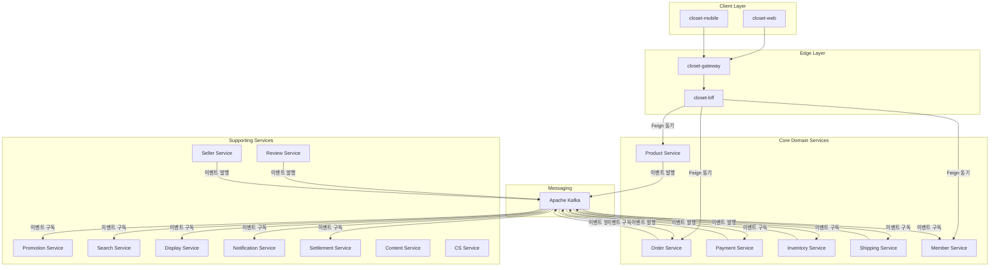

---

## 3. 핵심 통합 플로우 설계

### 3.1 주문-결제-재고 Saga

#### 비즈니스 플로우

```
주문 생성(PENDING)
  → 재고 예약(STOCK_RESERVED)
    → 결제 승인(PAID)
      → 주문 확정(PREPARING)

실패 시:
  결제 실패 → 재고 해제(InventoryReleased) → 주문 실패(FAILED)
  재고 부족 → 주문 실패(FAILED)
  예약 만료(15분) → 재고 해제 → 주문 취소(CANCELLED)
```

#### 후보군 분석

| 기준 | A) Choreography Saga | B) Orchestration Saga | C) Transactional Outbox |
|------|---------------------|----------------------|------------------------|
| **복잡도** | 낮음 -- 각 서비스가 독립적으로 이벤트 처리 | 중간 -- 오케스트레이터 서비스 필요 | 높음 -- Outbox 테이블 + Polling Publisher 필요 |
| **결합도** | 느슨함 -- 서비스 간 직접 의존 없음 | 중간 -- 오케스트레이터가 전체 플로우 인지 | 느슨함 -- DB 트랜잭션과 이벤트 발행 보장 |
| **디버깅** | 어려움 -- 이벤트 체인 추적 필요 | 쉬움 -- 오케스트레이터에서 전체 상태 확인 | 중간 -- Outbox 테이블에서 이벤트 이력 확인 |
| **성능** | 높음 -- 비동기 이벤트 | 중간 -- 오케스트레이터 병목 가능 | 높음 -- 비동기 + DB 레벨 보장 |
| **데이터 일관성** | Eventual | Eventual | Strong Eventual |
| **장애 복구** | 어려움 -- 보상 트랜잭션 분산 | 쉬움 -- 중앙 집중 복구 | 쉬움 -- 재시도 용이 |
| **서비스 수 증가 시** | 이벤트 순환 위험 | 오케스트레이터만 수정 | 서비스별 Outbox 테이블 추가 |

#### 결정: B) Orchestration Saga + C) Transactional Outbox 결합

**근거:**
1. 주문-결제-재고는 이커머스의 핵심 트랜잭션으로, 플로우 가시성과 장애 복구가 가장 중요
2. Choreography는 3개 이상 서비스가 관여하면 이벤트 순환과 디버깅 난이도가 급증
3. Orchestration으로 플로우를 중앙 관리하되, 각 서비스는 Transactional Outbox로 이벤트 발행의 원자성을 보장
4. Order Service가 자연스러운 오케스트레이터 역할 -- OrderStatus 상태 머신이 이미 잘 정의되어 있음
5. 기존 `OrderStatus` enum의 `canTransitionTo` 로직을 Saga 상태 머신으로 자연스럽게 확장 가능

#### 상세 시퀀스 다이어그램

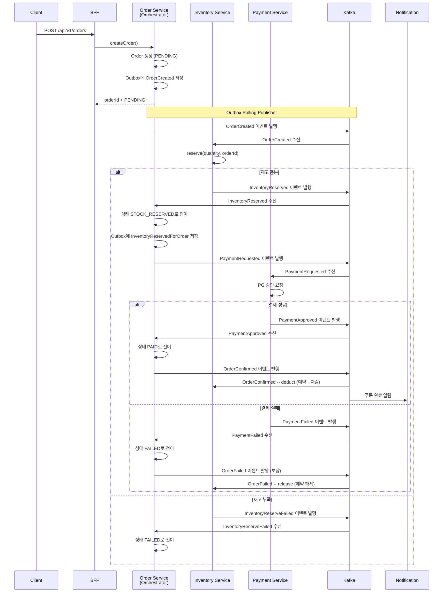

#### 예약 만료 처리

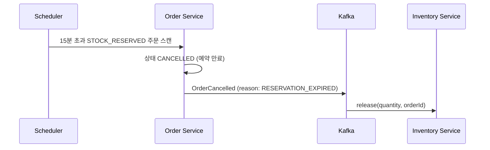

### 3.2 구매확정 -> 정산 + 포인트 적립

#### 비즈니스 규칙

- 배송 완료 후 7일 경과 시 자동 구매확정
- 구매확정 시 정산 대상 생성 + 구매 포인트 적립
- 정산은 셀러별 주간 단위로 집계

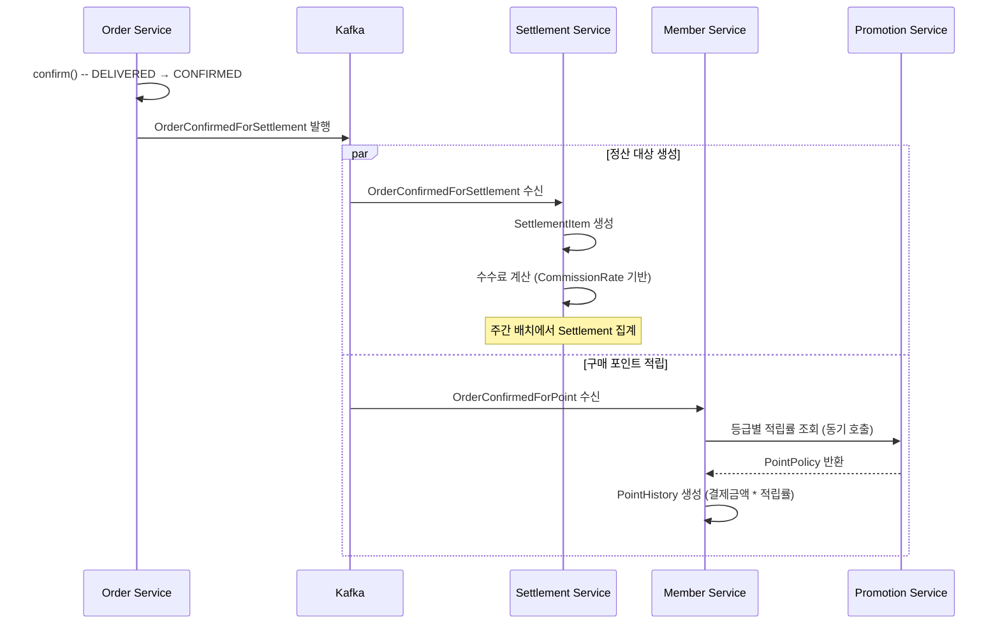

#### 이벤트 페이로드

```kotlin
data class OrderConfirmedEvent(
    val eventId: String,           // 멱등성 키 (UUID)
    val orderId: Long,
    val orderNumber: String,
    val memberId: Long,
    val sellerId: Long,
    val items: List<ConfirmedItem>,
    val totalAmount: BigDecimal,
    val paymentAmount: BigDecimal,
    val confirmedAt: LocalDateTime,
) {
    data class ConfirmedItem(
        val orderItemId: Long,
        val productId: Long,
        val productOptionId: Long,
        val quantity: Int,
        val unitPrice: BigDecimal,
        val totalPrice: BigDecimal,
    )
}
```

### 3.3 배송 상태 동기화

#### 비즈니스 규칙

- Shipping 상태 변경 시 Order 상태 자동 업데이트
- DELIVERED 후 7일 경과 시 자동 구매확정 스케줄러 동작
- 배송 상태 변경 시 회원에게 알림 발송

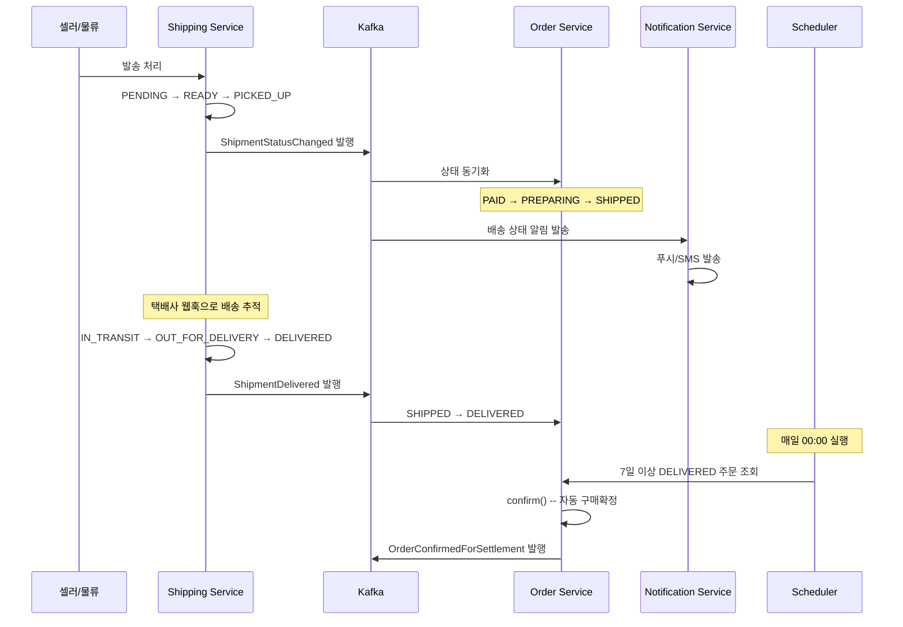

#### ShipmentStatus -> OrderStatus 매핑

| ShipmentStatus | OrderStatus 전이 | 비고 |
|----------------|-----------------|------|
| READY | PAID -> PREPARING | 셀러가 상품 준비 시작 |
| PICKED_UP | (변경 없음) | 택배사 수거 |
| IN_TRANSIT | PREPARING -> SHIPPED | 배송 중 |
| OUT_FOR_DELIVERY | (변경 없음) | 배달 중 |
| DELIVERED | SHIPPED -> DELIVERED | 배송 완료 |

### 3.4 상품 변경 -> 검색 인덱싱 + 전시 갱신

#### 비즈니스 규칙

- 상품 생성/수정/상태변경 시 검색 인덱스 실시간 갱신
- 상품 생성 시 Inventory에 재고 항목 자동 생성
- 상품 활성화 시 Display 랭킹 후보에 추가

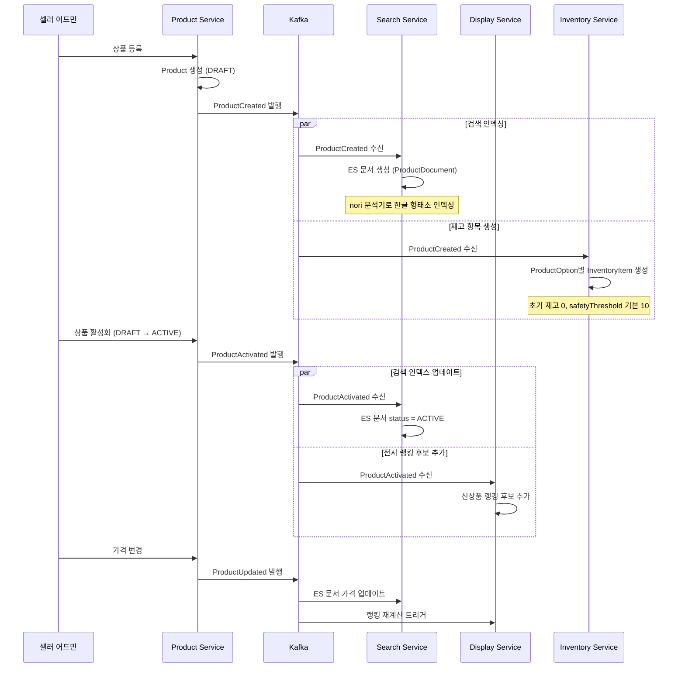

### 3.5 리뷰 -> 상품 집계 + 포인트

#### 비즈니스 규칙

- 리뷰 작성 시 상품 리뷰 집계(평균 별점, 리뷰 수) 갱신
- 리뷰 보상: 텍스트 리뷰 100P, 포토 리뷰 300P
- 리뷰 삭제 시 집계 재계산 + 포인트 회수

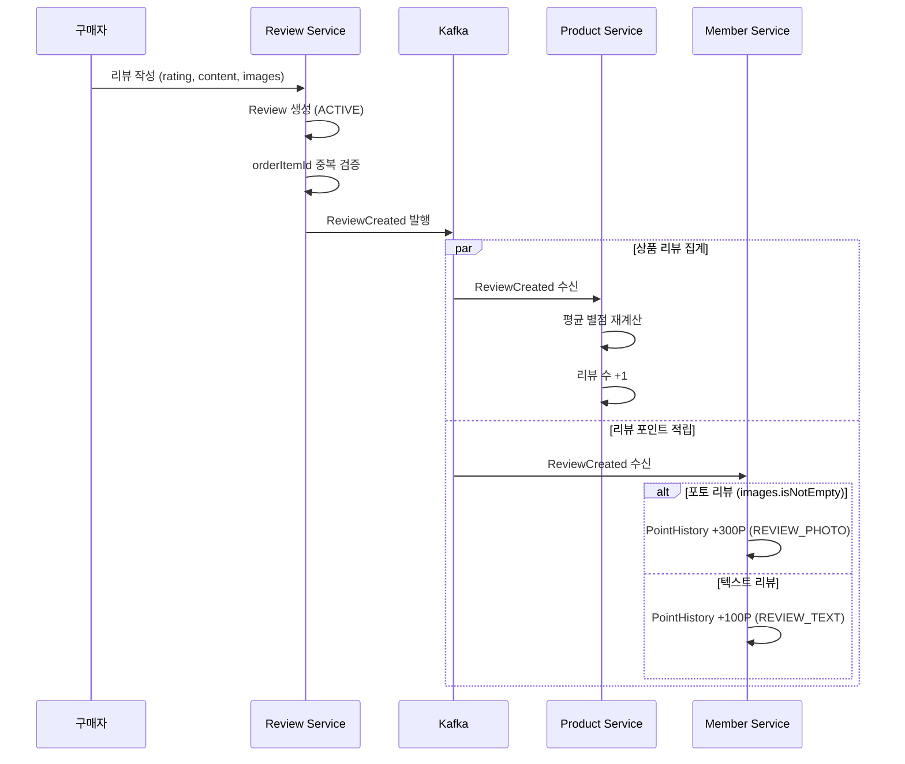

#### 이벤트 페이로드

```kotlin
data class ReviewCreatedEvent(
    val eventId: String,
    val reviewId: Long,
    val productId: Long,
    val memberId: Long,
    val orderItemId: Long,
    val rating: Int,
    val hasImages: Boolean,
    val imageCount: Int,
    val createdAt: LocalDateTime,
)

data class ReviewDeletedEvent(
    val eventId: String,
    val reviewId: Long,
    val productId: Long,
    val memberId: Long,
    val rating: Int,
    val hadImages: Boolean,
    val deletedAt: LocalDateTime,
)
```

### 3.6 쿠폰 -> 주문 할인

#### 비즈니스 규칙

- 주문 생성 시 쿠폰 검증 + 할인 계산은 **동기 호출** (금액 정합성 필수)
- 주문 확정 시 쿠폰 사용 처리는 **이벤트** (Eventual)
- 주문 취소 시 쿠폰 복원은 **이벤트** (Eventual)

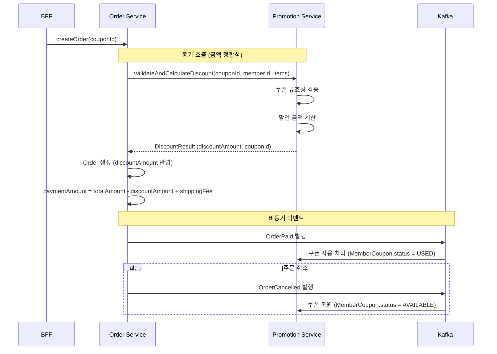

#### CouponScope별 할인 계산

| CouponScope | 할인 대상 | 계산 방식 |
|-------------|----------|----------|
| ALL | 전체 주문 금액 | totalAmount * discountRate |
| CATEGORY | 특정 카테고리 상품만 | 해당 카테고리 아이템 합계 * discountRate |
| BRAND | 특정 브랜드 상품만 | 해당 브랜드 아이템 합계 * discountRate |
| PRODUCT | 특정 상품만 | 해당 상품 금액 * discountRate |

### 3.7 재입고 알림

#### 비즈니스 규칙

- 재고 0인 옵션에 대해 회원이 재입고 알림 구독
- 입고 시 구독자에게 알림 발송
- 알림 1회 발송 후 구독 해제 (isNotified = true)

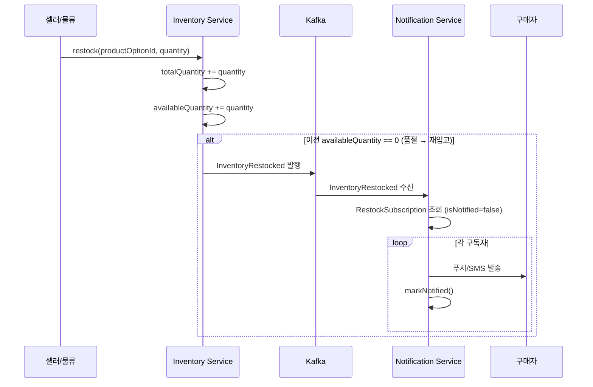

### 3.8 셀러 입점 -> 상품 등록 권한

#### 비즈니스 규칙

- 셀러 승인(PENDING -> ACTIVE) 시 상품 등록 가능
- 셀러 정지(ACTIVE -> SUSPENDED) 시 해당 셀러의 전 상품 판매중지
- 셀러 탈퇴(-> WITHDRAWN) 시 상품 비공개 + 진행 중 주문은 마무리

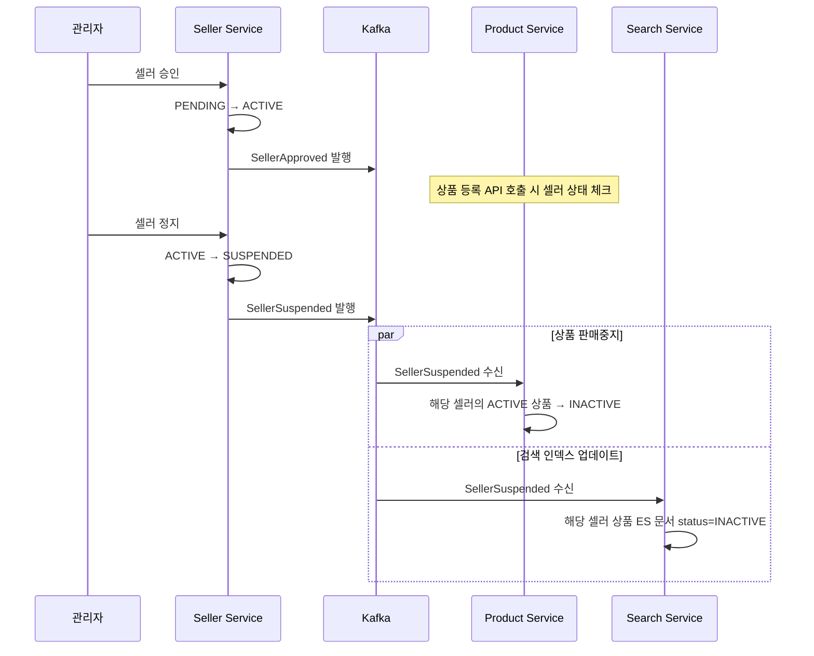

---

## 4. Kafka 토픽 설계

### 4.1 토픽 네이밍 컨벤션

```
closet.{service}.{event-type}
```

예: `closet.order.created`, `closet.payment.approved`

### 4.2 전체 토픽 목록

| # | 토픽 | Partition Key | Partitions | Producer | Consumer(s) | 메시지 |
|---|------|--------------|------------|----------|-------------|--------|
| 1 | `closet.order.created` | orderId | 12 | Order | Inventory | 주문 생성 -- 재고 예약 요청 |
| 2 | `closet.order.confirmed` | orderId | 12 | Order | Settlement, Member, Inventory | 구매확정 -- 정산 대상 생성, 포인트 적립, 재고 확정 차감 |
| 3 | `closet.order.cancelled` | orderId | 12 | Order | Inventory, Payment, Promotion | 주문 취소 -- 재고 해제, 결제 환불, 쿠폰 복원 |
| 4 | `closet.order.failed` | orderId | 12 | Order | Inventory, Notification | 주문 실패 -- 재고 해제, 실패 알림 |
| 5 | `closet.inventory.reserved` | orderId | 12 | Inventory | Order | 재고 예약 완료 |
| 6 | `closet.inventory.reserve-failed` | orderId | 6 | Inventory | Order | 재고 예약 실패 (품절) |
| 7 | `closet.inventory.restocked` | productOptionId | 6 | Inventory | Notification, Search | 재입고 |
| 8 | `closet.payment.requested` | orderId | 12 | Order | Payment | 결제 요청 |
| 9 | `closet.payment.approved` | orderId | 12 | Payment | Order | 결제 승인 |
| 10 | `closet.payment.failed` | orderId | 6 | Payment | Order | 결제 실패 |
| 11 | `closet.payment.refunded` | orderId | 6 | Payment | Order, Member | 환불 완료 |
| 12 | `closet.shipping.status-changed` | shipmentId | 12 | Shipping | Order, Notification | 배송 상태 변경 |
| 13 | `closet.shipping.delivered` | orderId | 6 | Shipping | Order | 배송 완료 |
| 14 | `closet.product.created` | productId | 6 | Product | Search, Inventory | 상품 생성 |
| 15 | `closet.product.updated` | productId | 6 | Product | Search, Display | 상품 수정 |
| 16 | `closet.product.activated` | productId | 6 | Product | Search, Display | 상품 활성화 |
| 17 | `closet.product.deactivated` | productId | 6 | Product | Search, Display | 상품 비활성화 |
| 18 | `closet.review.created` | productId | 6 | Review | Product, Member | 리뷰 작성 |
| 19 | `closet.review.deleted` | productId | 6 | Review | Product, Member | 리뷰 삭제 |
| 20 | `closet.seller.approved` | sellerId | 3 | Seller | Product | 셀러 승인 |
| 21 | `closet.seller.suspended` | sellerId | 3 | Seller | Product, Search | 셀러 정지 |
| 22 | `closet.promotion.coupon-issued` | memberId | 6 | Promotion | Notification | 쿠폰 발급 알림 |
| 23 | `closet.member.grade-changed` | memberId | 3 | Member | Promotion, Notification | 등급 변경 |

### 4.3 파티셔닝 전략

- **주문 관련 토픽 (12 partitions)**: orderId를 파티션 키로 사용하여, 동일 주문의 이벤트가 동일 파티션에 순서 보장
- **상품 관련 토픽 (6 partitions)**: productId 기반, 동일 상품의 변경 이벤트 순서 보장
- **셀러 관련 토픽 (3 partitions)**: 이벤트 빈도가 낮으므로 3개로 충분
- **리텐션**: 기본 7일, 정산 관련 토픽은 30일

### 4.4 Consumer Group 설계

| Consumer Group | 토픽 | 인스턴스 수 | 비고 |
|---------------|------|-----------|------|
| `order-saga-consumer` | inventory.reserved, inventory.reserve-failed, payment.approved, payment.failed, shipping.status-changed | 3 | Saga 오케스트레이터 |
| `inventory-order-consumer` | order.created, order.confirmed, order.cancelled, order.failed | 3 | 재고 예약/해제/차감 |
| `payment-order-consumer` | payment.requested | 3 | 결제 처리 |
| `search-indexer` | product.created, product.updated, product.activated, product.deactivated, seller.suspended | 2 | ES 인덱싱 |
| `display-updater` | product.activated, product.updated | 2 | 전시 갱신 |
| `notification-sender` | shipping.status-changed, inventory.restocked, order.confirmed, order.failed, promotion.coupon-issued | 2 | 알림 발송 |
| `settlement-collector` | order.confirmed | 2 | 정산 대상 수집 |
| `member-point-consumer` | order.confirmed, review.created, review.deleted | 2 | 포인트 적립/회수 |
| `promotion-order-consumer` | order.confirmed, order.cancelled | 2 | 쿠폰 사용/복원 |

---

## 5. 이벤트 스키마 설계

### 5.1 공통 이벤트 엔벨로프

```kotlin
data class DomainEvent<T>(
    val eventId: String,              // UUID -- 멱등성 키
    val eventType: String,            // e.g. "OrderCreated"
    val aggregateType: String,        // e.g. "Order"
    val aggregateId: String,          // e.g. orderId
    val payload: T,                   // 이벤트별 페이로드
    val metadata: EventMetadata,
    val occurredAt: LocalDateTime,
)

data class EventMetadata(
    val correlationId: String,        // 요청 추적용 (Saga 단위)
    val causationId: String?,         // 이 이벤트를 유발한 이벤트 ID
    val userId: Long?,                // 요청자
    val source: String,               // 발행 서비스명
    val version: Int = 1,             // 스키마 버전
)
```

### 5.2 주요 이벤트 페이로드

#### OrderCreated

```kotlin
data class OrderCreatedPayload(
    val orderId: Long,
    val orderNumber: String,
    val memberId: Long,
    val sellerId: Long,
    val items: List<OrderItemPayload>,
    val totalAmount: BigDecimal,
    val discountAmount: BigDecimal,
    val shippingFee: BigDecimal,
    val paymentAmount: BigDecimal,
    val receiverName: String,
    val receiverPhone: String,
    val address: String,
    val reservationExpiresAt: LocalDateTime,
)

data class OrderItemPayload(
    val orderItemId: Long,
    val productId: Long,
    val productOptionId: Long,
    val quantity: Int,
    val unitPrice: BigDecimal,
)
```

#### InventoryReserved

```kotlin
data class InventoryReservedPayload(
    val orderId: Long,
    val reservations: List<ReservationDetail>,
)

data class ReservationDetail(
    val productOptionId: Long,
    val quantity: Int,
    val remainingAvailable: Int,
)
```

#### PaymentApproved

```kotlin
data class PaymentApprovedPayload(
    val paymentId: Long,
    val orderId: Long,
    val paymentKey: String,
    val method: String,       // CARD, BANK_TRANSFER, etc.
    val finalAmount: BigDecimal,
    val approvedAt: LocalDateTime,
)
```

#### ShipmentStatusChanged

```kotlin
data class ShipmentStatusChangedPayload(
    val shipmentId: Long,
    val orderId: Long,
    val previousStatus: String,
    val currentStatus: String,
    val carrier: String,
    val trackingNumber: String?,
    val changedAt: LocalDateTime,
)
```

#### ProductCreated

```kotlin
data class ProductCreatedPayload(
    val productId: Long,
    val name: String,
    val brandId: Long,
    val categoryId: Long,
    val basePrice: BigDecimal,
    val salePrice: BigDecimal,
    val discountRate: Int,
    val status: String,
    val season: String?,
    val fitType: String?,
    val gender: String?,
    val options: List<ProductOptionPayload>,
)

data class ProductOptionPayload(
    val optionId: Long,
    val size: String,
    val color: String,
    val additionalPrice: BigDecimal,
)
```

#### ReviewCreated

```kotlin
data class ReviewCreatedPayload(
    val reviewId: Long,
    val productId: Long,
    val memberId: Long,
    val orderItemId: Long,
    val rating: Int,
    val hasImages: Boolean,
    val imageCount: Int,
)
```

---

## 6. 보상 트랜잭션 설계

### 6.1 주문-결제-재고 Saga 보상 매트릭스

| 실패 지점 | 보상 액션 | 대상 서비스 | 이벤트 |
|----------|----------|-----------|--------|
| 재고 예약 실패 | 없음 (아직 변경 없음) | Order | OrderFailed |
| 결제 실패 | 재고 해제 (release) | Inventory | OrderFailed -> InventoryReleased |
| 결제 승인 후 주문 취소 | 결제 환불 + 재고 해제 | Payment, Inventory | OrderCancelled -> PaymentRefunded, InventoryReleased |
| 예약 만료 (15분) | 재고 해제 | Inventory | OrderCancelled(RESERVATION_EXPIRED) |

### 6.2 보상 트랜잭션 상태 관리

Order Service에 Saga 상태 테이블 추가:

```sql
CREATE TABLE order_saga_state (
    id              BIGINT AUTO_INCREMENT PRIMARY KEY,
    order_id        BIGINT NOT NULL,
    saga_id         VARCHAR(36) NOT NULL COMMENT 'correlationId와 동일',
    current_step    VARCHAR(50) NOT NULL COMMENT '현재 Saga 단계',
    status          VARCHAR(30) NOT NULL COMMENT 'STARTED, COMPENSATING, COMPLETED, FAILED',
    retry_count     INT NOT NULL DEFAULT 0,
    last_event_id   VARCHAR(36) COMMENT '마지막 처리 이벤트 ID',
    created_at      DATETIME(6) NOT NULL,
    updated_at      DATETIME(6) NOT NULL,
    UNIQUE KEY uk_order_saga (order_id),
    UNIQUE KEY uk_saga_id (saga_id)
) COMMENT '주문 Saga 상태 추적';
```

### 6.3 보상 플로우 상세

```
Saga Steps:
  1. ORDER_CREATED
  2. INVENTORY_RESERVING
  3. INVENTORY_RESERVED
  4. PAYMENT_REQUESTING
  5. PAYMENT_APPROVED
  6. ORDER_COMPLETED

Compensation Steps (역순):
  5c. PAYMENT_REFUNDING → PAYMENT_REFUNDED
  3c. INVENTORY_RELEASING → INVENTORY_RELEASED
  1c. ORDER_FAILING → ORDER_FAILED
```

### 6.4 구매확정 -> 정산 보상

| 실패 지점 | 보상 액션 | 비고 |
|----------|----------|------|
| SettlementItem 생성 실패 | DLQ + 수동 처리 | 정산은 배치 집계이므로 지연 허용 |
| 포인트 적립 실패 | DLQ + 재시도 | 3회 재시도 후 DLQ |

### 6.5 Dead Letter Queue 정책

```
토픽명: closet.{original-topic}.dlq
리텐션: 30일
처리: 운영자 대시보드에서 수동 확인 + 재처리 가능
알림: DLQ 메시지 발생 시 Slack 알림
```

---

## 7. 멱등성 보장

### 7.1 전략: 이벤트 ID 기반 중복 방지

모든 이벤트 컨슈머는 `eventId`를 기반으로 중복 수신을 감지한다.

```sql
CREATE TABLE processed_event (
    id          BIGINT AUTO_INCREMENT PRIMARY KEY,
    event_id    VARCHAR(36) NOT NULL COMMENT '이벤트 UUID',
    event_type  VARCHAR(100) NOT NULL,
    processed_at DATETIME(6) NOT NULL,
    UNIQUE KEY uk_event_id (event_id)
) COMMENT '처리된 이벤트 기록 (멱등성 보장)';
```

### 7.2 컨슈머 처리 흐름

```kotlin
@KafkaListener(topics = ["closet.order.created"])
fun handleOrderCreated(event: DomainEvent<OrderCreatedPayload>) {
    // 1. 멱등성 체크
    if (processedEventRepository.existsByEventId(event.eventId)) {
        log.info("이벤트 이미 처리됨: eventId=${event.eventId}")
        return
    }

    // 2. 비즈니스 로직 실행
    inventoryService.reserveForOrder(event.payload)

    // 3. 처리 기록 저장 (비즈니스 로직과 같은 트랜잭션)
    processedEventRepository.save(ProcessedEvent(
        eventId = event.eventId,
        eventType = event.eventType,
        processedAt = LocalDateTime.now(),
    ))
}
```

### 7.3 서비스별 멱등성 전략

| 서비스 | 멱등성 키 | 추가 전략 |
|--------|----------|----------|
| Inventory | eventId + orderId | Optimistic Lock (@Version) |
| Payment | eventId + orderId | PG사 중복 결제 방지 (paymentKey 유니크) |
| Settlement | eventId + orderId + sellerId | 동일 주문에 대한 SettlementItem 중복 생성 방지 |
| Member (Point) | eventId + memberId | 동일 이벤트에 대한 PointHistory 중복 방지 |
| Search | productId (최신 상태 덮어쓰기) | ES upsert -- 자연스럽게 멱등 |
| Notification | eventId | 동일 이벤트에 대한 알림 중복 발송 방지 |

### 7.4 processed_event 테이블 관리

- **TTL**: 30일 이후 자동 삭제 (스케줄러)
- **인덱스**: `event_id`에 유니크 인덱스
- **파티셔닝**: 월별 파티셔닝 (대용량 대비)

---

## 8. 시퀀스 다이어그램 (Mermaid)

### 8.1 전체 주문 플로우 (Happy Path)

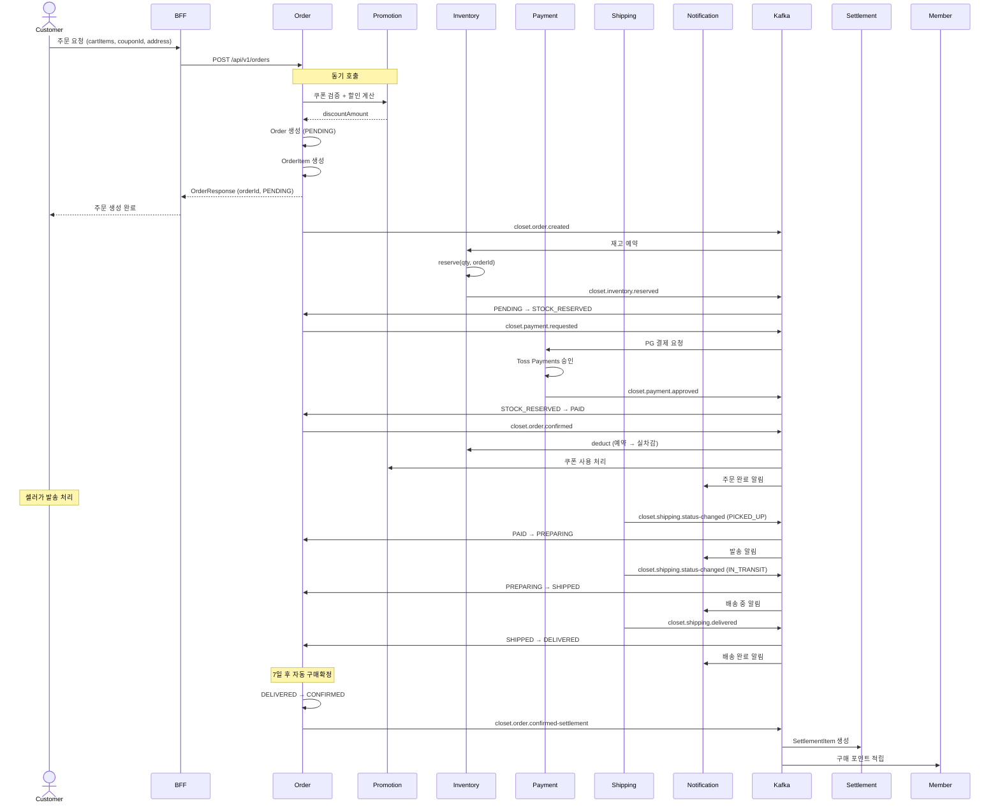

### 8.2 주문 취소 플로우 (결제 완료 후 취소)

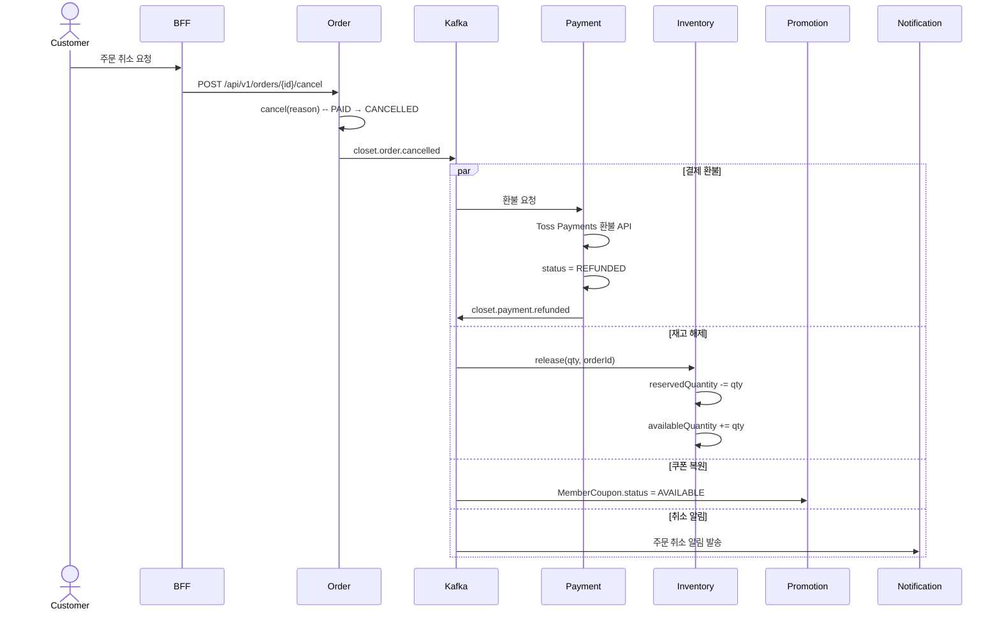

### 8.3 상품 등록 -> 전체 연동 플로우

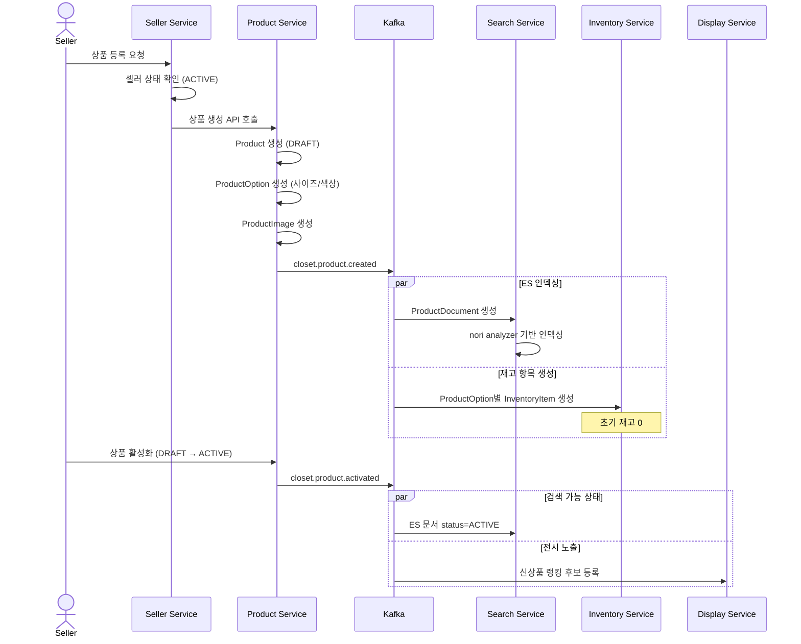

### 8.4 재입고 알림 전체 플로우

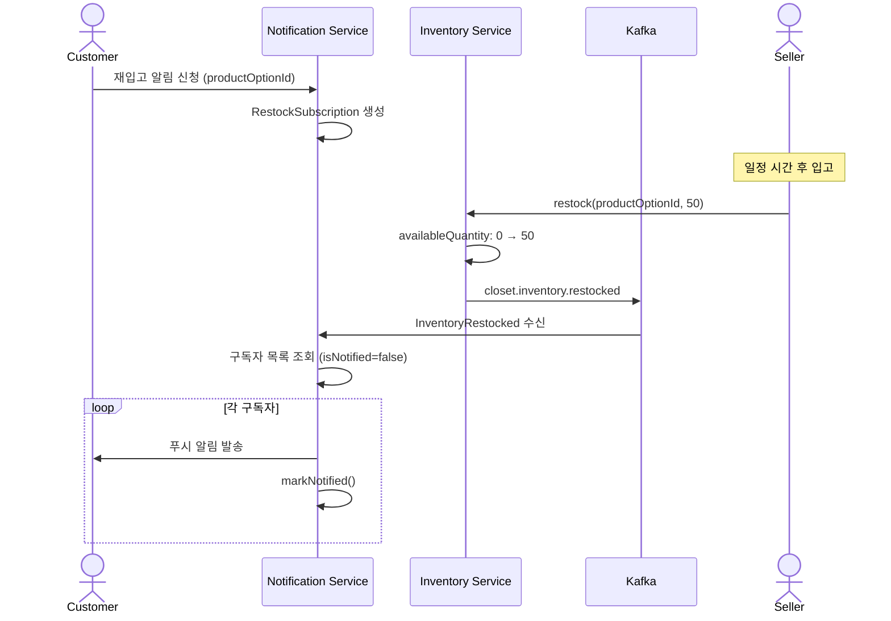

### 8.5 리뷰 작성 -> 포인트 + 상품 집계

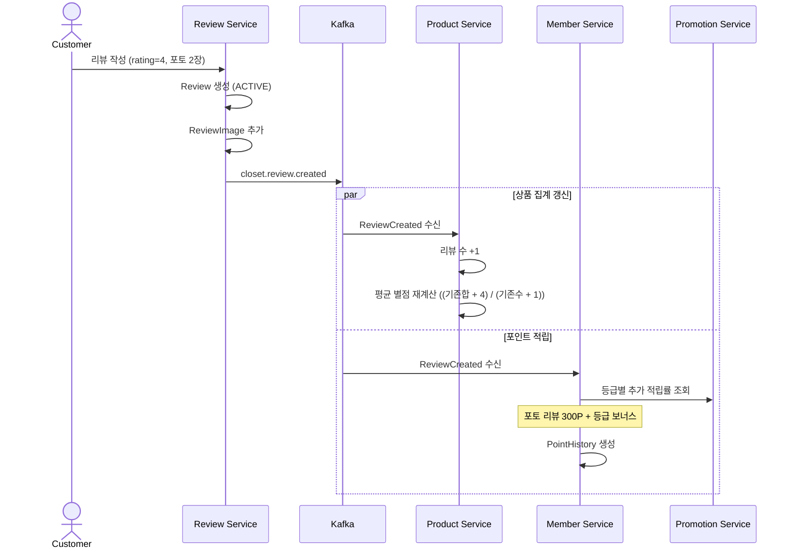

---

## 9. Transactional Outbox 설계

### 9.1 Outbox 테이블

```sql
CREATE TABLE outbox_event (
    id              BIGINT AUTO_INCREMENT PRIMARY KEY,
    aggregate_type  VARCHAR(50) NOT NULL COMMENT '집합 유형 (Order, Product 등)',
    aggregate_id    VARCHAR(50) NOT NULL COMMENT '집합 ID',
    event_type      VARCHAR(100) NOT NULL COMMENT '이벤트 유형',
    payload         JSON NOT NULL COMMENT '이벤트 페이로드 (JSON)',
    metadata        JSON COMMENT '메타데이터',
    topic           VARCHAR(100) NOT NULL COMMENT 'Kafka 토픽',
    partition_key   VARCHAR(50) NOT NULL COMMENT '파티션 키',
    status          VARCHAR(20) NOT NULL DEFAULT 'PENDING' COMMENT 'PENDING, PUBLISHED, FAILED',
    retry_count     INT NOT NULL DEFAULT 0,
    created_at      DATETIME(6) NOT NULL,
    published_at    DATETIME(6),
    INDEX idx_status_created (status, created_at),
    INDEX idx_aggregate (aggregate_type, aggregate_id)
) COMMENT 'Transactional Outbox 이벤트';
```

### 9.2 Polling Publisher

```kotlin
@Scheduled(fixedDelay = 100) // 100ms 간격
fun publishPendingEvents() {
    val events = outboxRepository.findTop100ByStatusOrderByCreatedAt("PENDING")
    events.forEach { event ->
        try {
            kafkaTemplate.send(event.topic, event.partitionKey, event.payload).get()
            event.status = "PUBLISHED"
            event.publishedAt = LocalDateTime.now()
        } catch (e: Exception) {
            event.retryCount++
            if (event.retryCount >= MAX_RETRY) {
                event.status = "FAILED"
                // DLQ 또는 알림
            }
        }
        outboxRepository.save(event)
    }
}
```

### 9.3 적용 대상

| 서비스 | Outbox 필요 여부 | 근거 |
|--------|----------------|------|
| Order | 필수 | Saga 오케스트레이터 -- 이벤트 유실 시 전체 플로우 중단 |
| Payment | 필수 | 결제 상태와 이벤트 발행의 원자성 보장 |
| Inventory | 필수 | 재고 변경과 이벤트 발행의 원자성 보장 |
| Product | 권장 | 상품 변경 -> 검색/전시 갱신 정합성 |
| Shipping | 권장 | 배송 상태 변경 -> Order 동기화 |
| Review | 선택 | 리뷰 집계 지연은 비즈니스에 큰 영향 없음 |
| Seller | 선택 | 셀러 상태 변경 빈도 낮음 |

---

## 10. 모니터링 및 운영

### 10.1 이벤트 모니터링 지표

| 지표 | 설명 | 임계값 |
|------|------|--------|
| `kafka.consumer.lag` | 컨슈머 랙 | > 1000: Warning, > 10000: Critical |
| `saga.duration.p99` | Saga 완료 시간 P99 | > 30초: Warning |
| `saga.failure.rate` | Saga 실패율 | > 1%: Warning, > 5%: Critical |
| `outbox.pending.count` | 미발행 Outbox 이벤트 수 | > 100: Warning |
| `dlq.message.count` | DLQ 메시지 수 | > 0: Alert |
| `event.processing.time` | 이벤트 처리 시간 | > 5초: Warning |

### 10.2 Saga 상태 대시보드

- Saga 상태별 건수 (STARTED, COMPENSATING, COMPLETED, FAILED)
- 평균 Saga 완료 시간
- 실패 Saga 목록 (수동 개입 대상)
- 보상 트랜잭션 실행 이력

### 10.3 트레이싱

- 기존 Grafana Tempo / Zipkin 연동
- correlationId를 Kafka 헤더에 전파하여 Saga 전체 플로우 추적
- 각 이벤트의 causationId로 이벤트 체인 시각화

---

## 11. 구현 우선순위

### Phase 1: 핵심 Saga (4주)

1. Transactional Outbox 인프라 구현 (closet-common)
2. 주문-재고-결제 Saga 구현 (3.1)
3. 멱등성 인프라 구현 (processed_event)
4. DLQ + 모니터링

### Phase 2: 비즈니스 연동 (3주)

5. 배송 상태 동기화 (3.3)
6. 구매확정 -> 정산 + 포인트 (3.2)
7. 주문 취소 보상 트랜잭션

### Phase 3: 지원 도메인 연동 (3주)

8. 상품 변경 -> 검색/전시/재고 (3.4)
9. 리뷰 -> 상품 집계 + 포인트 (3.5)
10. 쿠폰 -> 주문 할인 (3.6)

### Phase 4: 알림 + 셀러 (2주)

11. 재입고 알림 (3.7)
12. 셀러 입점 -> 상품 권한 (3.8)
13. 배송/주문 상태 알림

---

## 12. 리스크 및 대응

| 리스크 | 영향 | 대응 |
|--------|------|------|
| Kafka 브로커 장애 | 전체 이벤트 발행/소비 중단 | Outbox로 이벤트 유실 방지 + Kafka 클러스터 3개 브로커 |
| Consumer 무한 재시도 | 리소스 고갈 | 3회 재시도 후 DLQ 전송 |
| 이벤트 순서 역전 | 잘못된 상태 전이 | 파티션 키 기반 순서 보장 + 이벤트 타임스탬프 검증 |
| Saga 중간 장애 | 데이터 불일치 | Saga 상태 테이블 + 보상 트랜잭션 |
| Outbox 테이블 비대화 | DB 성능 저하 | 발행 완료 이벤트 7일 후 삭제 스케줄러 |
| 스키마 변경 호환성 | 이전 버전 컨슈머 실패 | 이벤트 버전 관리 (metadata.version) + Backward Compatible 스키마 변경 |
