# DDD Tactical Design 상세

> 작성일: 2026-03-22
> 15개 Bounded Context에 대한 전술적 설계
> Aggregate, Entity, Value Object, Domain Service, Application Service, Repository, Domain Event, ACL

---

## 1. Product (상품) Bounded Context

### 1.1 Aggregate 상세

#### Product Aggregate (Root)

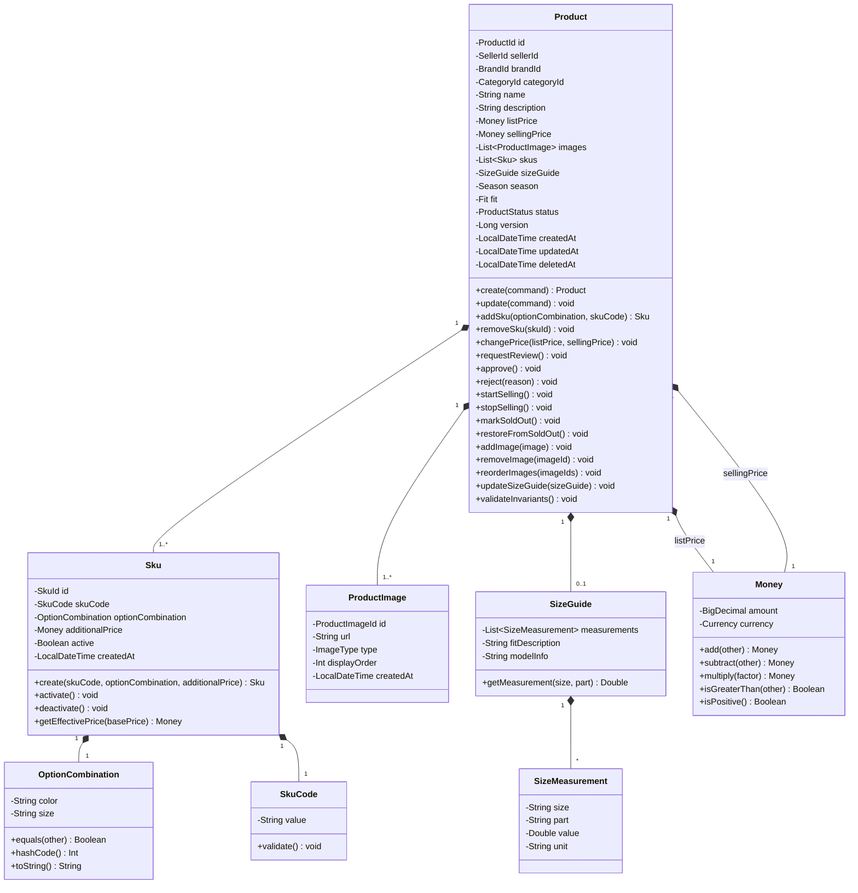
```mermaid
classDiagram
    class Product {
        -ProductId id
        -SellerId sellerId
        -BrandId brandId
        -CategoryId categoryId
        -String name
        -String description
        -Money listPrice
        -Money sellingPrice
        -List~ProductImage~ images
        -List~Sku~ skus
        -SizeGuide sizeGuide
        -Season season
        -Fit fit
        -ProductStatus status
        -Long version
        -LocalDateTime createdAt
        -LocalDateTime updatedAt
        -LocalDateTime deletedAt
        +create(command) Product
        +update(command) void
        +addSku(optionCombination, skuCode) Sku
        +removeSku(skuId) void
        +changePrice(listPrice, sellingPrice) void
        +requestReview() void
        +approve() void
        +reject(reason) void
        +startSelling() void
        +stopSelling() void
        +markSoldOut() void
        +restoreFromSoldOut() void
        +addImage(image) void
        +removeImage(imageId) void
        +reorderImages(imageIds) void
        +updateSizeGuide(sizeGuide) void
        +validateInvariants() void
    }

    class Sku {
        -SkuId id
        -SkuCode skuCode
        -OptionCombination optionCombination
        -Money additionalPrice
        -Boolean active
        -LocalDateTime createdAt
        +create(skuCode, optionCombination, additionalPrice) Sku
        +activate() void
        +deactivate() void
        +getEffectivePrice(basePrice) Money
    }

    class ProductImage {
        -ProductImageId id
        -String url
        -ImageType type
        -Int displayOrder
        -LocalDateTime createdAt
    }

    class SizeGuide {
        -List~SizeMeasurement~ measurements
        -String fitDescription
        -String modelInfo
        +getMeasurement(size, part) Double
    }

    class SizeMeasurement {
        -String size
        -String part
        -Double value
        -String unit
    }

    class OptionCombination {
        -String color
        -String size
        +equals(other) Boolean
        +hashCode() Int
        +toString() String
    }

    class Money {
        -BigDecimal amount
        -Currency currency
        +add(other) Money
        +subtract(other) Money
        +multiply(factor) Money
        +isGreaterThan(other) Boolean
        +isPositive() Boolean
    }

    class SkuCode {
        -String value
        +validate() void
    }

    Product "1" *-- "1..*" Sku
    Product "1" *-- "1..*" ProductImage
    Product "1" *-- "0..1" SizeGuide
    SizeGuide "1" *-- "*" SizeMeasurement
    Sku "1" *-- "1" OptionCombination
    Product "1" *-- "1" Money : listPrice
    Product "1" *-- "1" Money : sellingPrice
    Sku "1" *-- "1" SkuCode
```

**Product (Aggregate Root) 필드:**

| 필드 | 타입 | 설명 |
|------|------|------|
| id | ProductId (VO) | 상품 고유 식별자 |
| sellerId | SellerId (VO) | 셀러 참조 ID |
| brandId | BrandId (VO) | 브랜드 참조 ID |
| categoryId | CategoryId (VO) | 카테고리 참조 ID (반드시 leaf) |
| name | String | 상품명 (2~100자) |
| description | String | 상품 설명 (HTML) |
| listPrice | Money (VO) | 정가 |
| sellingPrice | Money (VO) | 판매가 (listPrice 이하) |
| images | List<ProductImage> (Entity) | 상품 이미지 목록 (1~10장) |
| skus | List<Sku> (Entity) | SKU 목록 (1개 이상) |
| sizeGuide | SizeGuide (VO) | 사이즈 가이드 (nullable) |
| season | Season (Enum) | 시즌 (SS/FW/PRE_SS/PRE_FW) |
| fit | Fit (Enum) | 핏 (OVERSIZED/REGULAR/SLIM) |
| status | ProductStatus (Enum) | 상품 상태 |
| version | Long | 낙관적 락 버전 |
| createdAt | LocalDateTime | 생성일시 |
| updatedAt | LocalDateTime | 수정일시 |
| deletedAt | LocalDateTime | 삭제일시 (soft delete) |

**Product 메서드:**

| 메서드 | 시그니처 | 설명 |
|--------|---------|------|
| create | `create(cmd: CreateProductCommand): Product` | 팩토리 메서드. 기본 검증 후 DRAFT 상태로 생성 |
| update | `update(cmd: UpdateProductCommand): void` | 이름, 설명, 시즌, 핏 등 기본 정보 수정 |
| addSku | `addSku(combo: OptionCombination, code: SkuCode): Sku` | SKU 추가. 동일 옵션 조합 중복 검사 |
| removeSku | `removeSku(skuId: SkuId): void` | SKU 제거. 판매중 상태에서 마지막 SKU 삭제 불가 |
| changePrice | `changePrice(list: Money, selling: Money): void` | 가격 변경. listPrice >= sellingPrice 검증. PriceChangedEvent 발행 |
| requestReview | `requestReview(): void` | 심사 요청. DRAFT → PENDING_REVIEW 전이 |
| approve | `approve(): void` | 승인. PENDING_REVIEW → APPROVED. ProductApprovedEvent 발행 |
| reject | `reject(reason: String): void` | 거부. PENDING_REVIEW → REJECTED |
| startSelling | `startSelling(): void` | 판매 시작. APPROVED → ON_SALE |
| stopSelling | `stopSelling(): void` | 판매 중지. ON_SALE → DISCONTINUED |
| markSoldOut | `markSoldOut(): void` | 품절 처리. ON_SALE → SOLD_OUT |
| restoreFromSoldOut | `restoreFromSoldOut(): void` | 품절 복원. SOLD_OUT → ON_SALE |
| validateInvariants | `validateInvariants(): void` | 모든 불변 조건 검증 |

**Enum: ProductStatus**

| 값 | 설명 | 전이 가능 대상 |
|----|------|-------------|
| DRAFT | 임시저장 | PENDING_REVIEW |
| PENDING_REVIEW | 심사중 | APPROVED, REJECTED |
| REJECTED | 심사거부 | DRAFT |
| APPROVED | 승인됨 | ON_SALE |
| ON_SALE | 판매중 | SOLD_OUT, DISCONTINUED |
| SOLD_OUT | 품절 | ON_SALE |
| DISCONTINUED | 판매중지 | - |

```kotlin
enum class ProductStatus {
    DRAFT, PENDING_REVIEW, REJECTED, APPROVED, ON_SALE, SOLD_OUT, DISCONTINUED;

    fun canTransitionTo(target: ProductStatus): Boolean = when (this) {
        DRAFT -> target == PENDING_REVIEW
        PENDING_REVIEW -> target in listOf(APPROVED, REJECTED)
        REJECTED -> target == DRAFT
        APPROVED -> target == ON_SALE
        ON_SALE -> target in listOf(SOLD_OUT, DISCONTINUED)
        SOLD_OUT -> target == ON_SALE
        DISCONTINUED -> false
    }

    fun validateTransitionTo(target: ProductStatus) {
        require(canTransitionTo(target)) {
            "Cannot transition from $this to $target"
        }
    }
}
```

**Enum: Fit**

| 값 | 설명 |
|----|------|
| OVERSIZED | 오버핏 |
| REGULAR | 레귤러핏 |
| SLIM | 슬림핏 |
| RELAXED | 릴렉스드핏 |

**Enum: Season**

| 값 | 설명 |
|----|------|
| SS | 봄/여름 |
| FW | 가을/겨울 |
| PRE_SS | 프리 봄/여름 |
| PRE_FW | 프리 가을/겨울 |
| ALL | 사계절 |

**Value Object: Money**
- `amount: BigDecimal` — 금액 (소수점 없음, 원 단위)
- `currency: Currency` — 통화 (기본 KRW)
- 검증: amount >= 0
- equals: amount와 currency 모두 일치
- 연산: add, subtract, multiply, isGreaterThan, isPositive

**Value Object: OptionCombination**
- `color: String` — 색상 (nullable)
- `size: String` — 사이즈 (nullable)
- equals: color + size 조합이 동일하면 같은 VO

**Value Object: SkuCode**
- `value: String` — 형식: `{브랜드코드}-{카테고리코드}-{시퀀스}-{옵션코드}`
- 검증: 정규식 `^[A-Z]{2,5}-[A-Z]{2,4}-\d{4}-[A-Z0-9]{2,6}$`

#### Category Aggregate

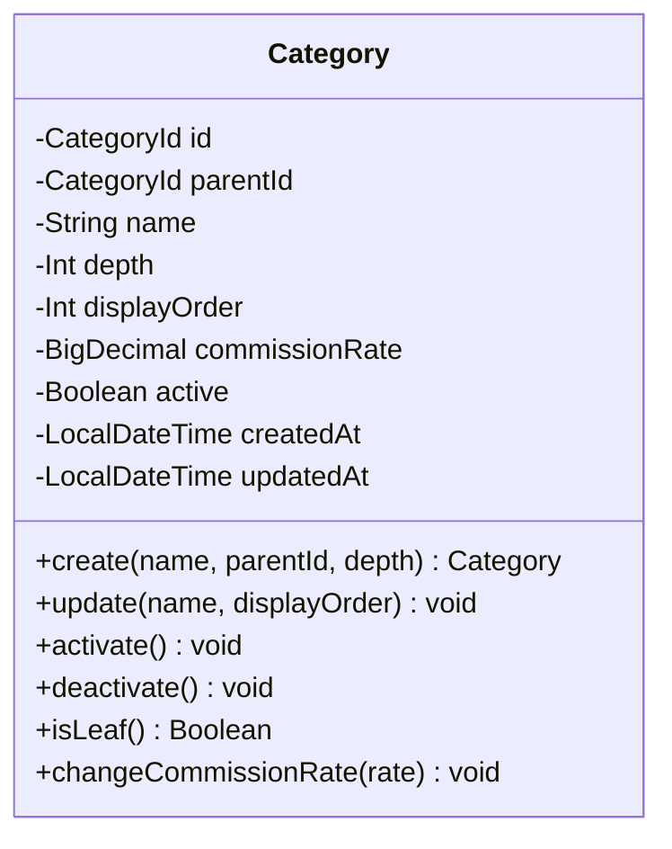
```mermaid
classDiagram
    class Category {
        -CategoryId id
        -CategoryId parentId
        -String name
        -Int depth
        -Int displayOrder
        -BigDecimal commissionRate
        -Boolean active
        -LocalDateTime createdAt
        -LocalDateTime updatedAt
        +create(name, parentId, depth) Category
        +update(name, displayOrder) void
        +activate() void
        +deactivate() void
        +isLeaf() Boolean
        +changeCommissionRate(rate) void
    }
```

#### Brand Aggregate

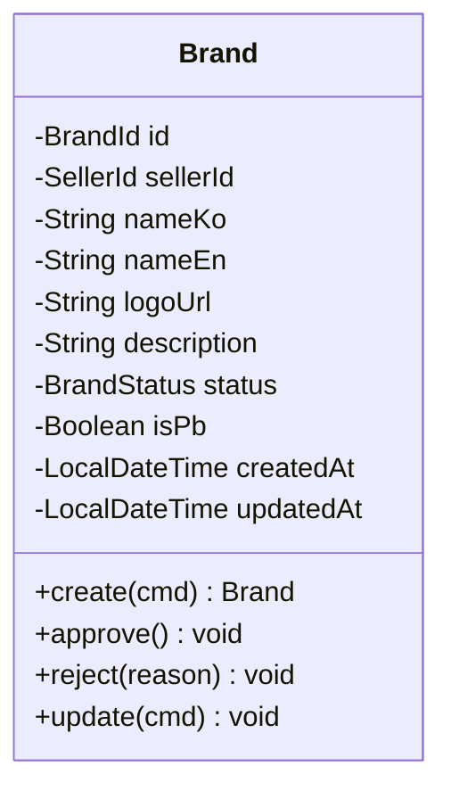
```mermaid
classDiagram
    class Brand {
        -BrandId id
        -SellerId sellerId
        -String nameKo
        -String nameEn
        -String logoUrl
        -String description
        -BrandStatus status
        -Boolean isPb
        -LocalDateTime createdAt
        -LocalDateTime updatedAt
        +create(cmd) Brand
        +approve() void
        +reject(reason) void
        +update(cmd) void
    }
```

### 1.2 Domain Service

```kotlin
class ProductDomainService(
    private val categoryRepository: CategoryRepository,
    private val brandRepository: BrandRepository
) {
    /** 카테고리가 leaf인지 검증 + 브랜드 승인 상태 검증 */
    fun validateProductCreation(categoryId: CategoryId, brandId: BrandId): void

    /** 카테고리 변경 시 수수료율 변경 영향 분석 */
    fun calculateCommissionImpact(productId: ProductId, newCategoryId: CategoryId): CommissionImpact

    /** SKU 코드 자동 생성 */
    fun generateSkuCode(brandCode: String, categoryCode: String, optionCombination: OptionCombination): SkuCode
}
```

### 1.3 Application Service (UseCase)

```kotlin
class CreateProductUseCase(
    private val productRepository: ProductRepository,
    private val productDomainService: ProductDomainService,
    private val eventPublisher: DomainEventPublisher
) {
    /**
     * 트랜잭션 경계: @Transactional
     * 1. 카테고리/브랜드 검증 (Domain Service)
     * 2. Product 생성 (Factory)
     * 3. 저장 (Repository)
     * 4. ProductCreatedEvent 발행
     */
    fun execute(command: CreateProductCommand): ProductId
}

class ChangeProductPriceUseCase(
    private val productRepository: ProductRepository,
    private val eventPublisher: DomainEventPublisher
) {
    /**
     * 트랜잭션 경계: @Transactional
     * 1. Product 조회
     * 2. changePrice() 호출
     * 3. 저장
     * 4. PriceChangedEvent 발행 → 위시리스트 알림 트리거
     */
    fun execute(command: ChangePriceCommand): void
}

class ApproveProductUseCase(
    private val productRepository: ProductRepository,
    private val eventPublisher: DomainEventPublisher
) {
    /**
     * 트랜잭션 경계: @Transactional
     * 1. Product 조회
     * 2. approve() 호출
     * 3. startSelling() 호출
     * 4. 저장
     * 5. ProductApprovedEvent 발행 → Inventory 초기화 + Search 인덱싱
     */
    fun execute(productId: ProductId): void
}
```

### 1.4 Repository (Port)

```kotlin
interface ProductRepository {
    fun save(product: Product): Product
    fun findById(id: ProductId): Product?
    fun findByIdOrThrow(id: ProductId): Product
    fun findBySellerId(sellerId: SellerId, pageable: Pageable): Page<Product>
    fun findByCategory(categoryId: CategoryId, pageable: Pageable): Page<Product>
    fun findByBrand(brandId: BrandId, pageable: Pageable): Page<Product>
    fun findByStatus(status: ProductStatus, pageable: Pageable): Page<Product>
    fun existsByBrandIdAndName(brandId: BrandId, name: String): Boolean
    fun delete(product: Product): void  // soft delete
}

interface CategoryRepository {
    fun save(category: Category): Category
    fun findById(id: CategoryId): Category?
    fun findByParentId(parentId: CategoryId): List<Category>
    fun findAllLeaf(): List<Category>
    fun findTree(): List<Category>  // 전체 트리 조회
}

interface BrandRepository {
    fun save(brand: Brand): Brand
    fun findById(id: BrandId): Brand?
    fun findBySellerId(sellerId: SellerId): List<Brand>
    fun existsByNameKo(nameKo: String): Boolean
    fun existsByNameEn(nameEn: String): Boolean
}
```

### 1.5 Domain Event

| 이벤트 | 페이로드 | Producer | Consumer | 처리 방식 |
|--------|---------|----------|----------|----------|
| ProductCreatedEvent | productId, sellerId, name, categoryId, brandId, skus[], timestamp | Product | Search, Display | Kafka |
| ProductApprovedEvent | productId, skus[{skuId, skuCode}], categoryId, timestamp | Product | Inventory, Search | Kafka |
| ProductUpdatedEvent | productId, changedFields{}, timestamp | Product | Search | Kafka |
| PriceChangedEvent | productId, oldPrice, newPrice, timestamp | Product | Search, Notification(위시리스트) | Kafka |
| ProductDiscontinuedEvent | productId, reason, timestamp | Product | Search, Display, Inventory | Kafka |
| SkuCreatedEvent | productId, skuId, skuCode, optionCombination, timestamp | Product | Inventory | Kafka |
| ProductSoldOutEvent | productId, timestamp | Product | Search, Display | Kafka |

### 1.6 Anti-Corruption Layer

```kotlin
/** S3 이미지 업로드 ACL */
class S3ImageUploadAdapter(private val s3Client: S3Client) : ImageUploadPort {
    fun upload(file: MultipartFile, path: String): ImageUrl {
        // S3 SDK 호출 → 내부 ImageUrl VO로 변환
    }
}
```

---

## 2. Order (주문) Bounded Context

### 2.1 Aggregate 상세

#### Order Aggregate (Root)

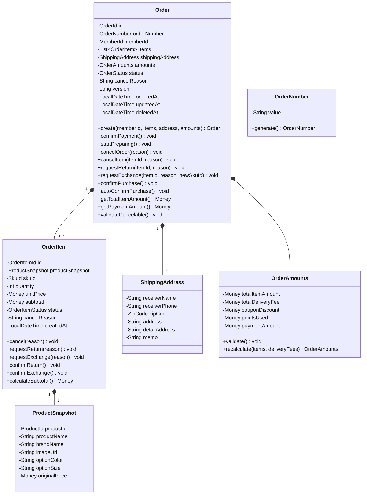
```mermaid
classDiagram
    class Order {
        -OrderId id
        -OrderNumber orderNumber
        -MemberId memberId
        -List~OrderItem~ items
        -ShippingAddress shippingAddress
        -OrderAmounts amounts
        -OrderStatus status
        -String cancelReason
        -Long version
        -LocalDateTime orderedAt
        -LocalDateTime updatedAt
        -LocalDateTime deletedAt
        +create(memberId, items, address, amounts) Order
        +confirmPayment() void
        +startPreparing() void
        +cancelOrder(reason) void
        +cancelItem(itemId, reason) void
        +requestReturn(itemId, reason) void
        +requestExchange(itemId, reason, newSkuId) void
        +confirmPurchase() void
        +autoConfirmPurchase() void
        +getTotalItemAmount() Money
        +getPaymentAmount() Money
        +validateCancelable() void
    }

    class OrderItem {
        -OrderItemId id
        -ProductSnapshot productSnapshot
        -SkuId skuId
        -Int quantity
        -Money unitPrice
        -Money subtotal
        -OrderItemStatus status
        -String cancelReason
        -LocalDateTime createdAt
        +cancel(reason) void
        +requestReturn(reason) void
        +requestExchange(reason) void
        +confirmReturn() void
        +confirmExchange() void
        +calculateSubtotal() Money
    }

    class ProductSnapshot {
        -ProductId productId
        -String productName
        -String brandName
        -String imageUrl
        -String optionColor
        -String optionSize
        -Money originalPrice
    }

    class ShippingAddress {
        -String receiverName
        -String receiverPhone
        -ZipCode zipCode
        -String address
        -String detailAddress
        -String memo
    }

    class OrderAmounts {
        -Money totalItemAmount
        -Money totalDeliveryFee
        -Money couponDiscount
        -Money pointsUsed
        -Money paymentAmount
        +validate() void
        +recalculate(items, deliveryFees) OrderAmounts
    }

    class OrderNumber {
        -String value
        +generate() OrderNumber
    }

    Order "1" *-- "1..*" OrderItem
    Order "1" *-- "1" ShippingAddress
    Order "1" *-- "1" OrderAmounts
    OrderItem "1" *-- "1" ProductSnapshot
```

**Order 메서드 상세:**

| 메서드 | 설명 | 전이 | 이벤트 |
|--------|------|------|--------|
| create | 주문 생성, 상품 스냅샷 저장, 금액 계산 | → ORDER_CREATED | OrderCreatedEvent |
| confirmPayment | 결제 완료 확인 | ORDER_CREATED → PAYMENT_COMPLETED | PaymentConfirmedOnOrderEvent |
| startPreparing | 셀러 출고 준비 시작 | PAYMENT_COMPLETED → PREPARING | - |
| cancelOrder | 전체 주문 취소 | → ORDER_CANCELLED | OrderCancelledEvent |
| cancelItem | 부분 취소 | 항목 → CANCELLED | OrderItemCancelledEvent |
| requestReturn | 반품 요청 | 항목 → RETURN_REQUESTED | ReturnRequestedEvent |
| confirmPurchase | 수동 구매확정 | DELIVERED → PURCHASE_CONFIRMED | PurchaseConfirmedEvent |
| autoConfirmPurchase | 자동 구매확정 (D+7) | DELIVERED → PURCHASE_CONFIRMED | PurchaseConfirmedEvent |

**Enum: OrderStatus**

| 값 | 전이 가능 | 설명 |
|----|----------|------|
| ORDER_CREATED | PAYMENT_COMPLETED, ORDER_CANCELLED | 주문 생성됨 |
| PAYMENT_COMPLETED | PREPARING, CANCEL_REQUESTED | 결제 완료 |
| PREPARING | SHIPPED, CANCEL_REQUESTED | 출고 준비중 |
| SHIPPED | IN_TRANSIT | 출고 완료 |
| IN_TRANSIT | DELIVERED | 배송중 |
| DELIVERED | PURCHASE_CONFIRMED, RETURN_REQUESTED, EXCHANGE_REQUESTED | 배송 완료 |
| PURCHASE_CONFIRMED | - (최종) | 구매확정 |
| ORDER_CANCELLED | - (최종) | 주문취소 |
| CANCEL_REQUESTED | ORDER_CANCELLED | 취소요청 |

**Enum: OrderItemStatus**

| 값 | 전이 가능 |
|----|----------|
| ORDERED | CANCELLED, RETURN_REQUESTED, EXCHANGE_REQUESTED, PURCHASE_CONFIRMED |
| CANCELLED | - |
| RETURN_REQUESTED | RETURN_COMPLETED, RETURN_REJECTED |
| RETURN_COMPLETED | - |
| RETURN_REJECTED | ORDERED |
| EXCHANGE_REQUESTED | EXCHANGE_COMPLETED, EXCHANGE_REJECTED |
| EXCHANGE_COMPLETED | - |
| EXCHANGE_REJECTED | ORDERED |
| PURCHASE_CONFIRMED | - |

#### Cart Aggregate

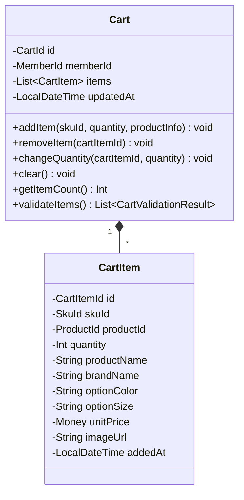
```mermaid
classDiagram
    class Cart {
        -CartId id
        -MemberId memberId
        -List~CartItem~ items
        -LocalDateTime updatedAt
        +addItem(skuId, quantity, productInfo) void
        +removeItem(cartItemId) void
        +changeQuantity(cartItemId, quantity) void
        +clear() void
        +getItemCount() Int
        +validateItems() List~CartValidationResult~
    }

    class CartItem {
        -CartItemId id
        -SkuId skuId
        -ProductId productId
        -Int quantity
        -String productName
        -String brandName
        -String optionColor
        -String optionSize
        -Money unitPrice
        -String imageUrl
        -LocalDateTime addedAt
    }

    Cart "1" *-- "*" CartItem
```

### 2.2 Domain Service

```kotlin
class OrderDomainService(
    private val deliveryFeePolicyRepository: DeliveryFeePolicyRepository
) {
    /** 셀러별 배송비 계산 (무료배송 기준 적용) */
    fun calculateDeliveryFees(items: List<OrderItem>): Map<SellerId, Money>

    /** 부분 취소 시 금액 재계산 (쿠폰/적립금 비례 배분) */
    fun recalculateAmountsForPartialCancel(
        order: Order,
        cancelledItemIds: List<OrderItemId>
    ): OrderAmounts

    /** 주문 번호 생성 */
    fun generateOrderNumber(): OrderNumber
}
```

### 2.3 Application Service

```kotlin
class CreateOrderUseCase(
    private val orderRepository: OrderRepository,
    private val productClient: ProductClient,
    private val memberClient: MemberClient,
    private val promotionClient: PromotionClient,
    private val orderDomainService: OrderDomainService,
    private val eventPublisher: DomainEventPublisher
) {
    /**
     * @Transactional
     * 1. 상품 정보 조회 (Product API) → 스냅샷 생성
     * 2. 회원 배송지 조회 (Member API)
     * 3. 쿠폰/적립금 적용 가능 여부 확인 (Promotion API)
     * 4. 배송비 계산 (Domain Service)
     * 5. Order 생성
     * 6. 저장
     * 7. OrderCreatedEvent 발행 → Inventory 재고 예약
     */
    fun execute(command: CreateOrderCommand): OrderId
}

class CancelOrderUseCase(
    private val orderRepository: OrderRepository,
    private val eventPublisher: DomainEventPublisher
) {
    /**
     * @Transactional
     * 1. Order 조회
     * 2. 취소 가능 상태 검증
     * 3. cancelOrder() 호출
     * 4. 저장
     * 5. OrderCancelledEvent 발행 → Payment 취소 + Inventory 복원 + Promotion 쿠폰 반환
     */
    fun execute(orderId: OrderId, reason: String): void
}

class AutoConfirmPurchaseUseCase(
    private val orderRepository: OrderRepository,
    private val eventPublisher: DomainEventPublisher
) {
    /**
     * @Scheduled(cron = "0 0 0 * * *")
     * 1. 배송완료 후 7일 경과 + 반품/교환 미접수 주문 조회
     * 2. 각 주문에 autoConfirmPurchase() 호출
     * 3. PurchaseConfirmedEvent 발행 → Settlement 정산 등록
     */
    fun execute(): void
}
```

### 2.4 Repository

```kotlin
interface OrderRepository {
    fun save(order: Order): Order
    fun findById(id: OrderId): Order?
    fun findByOrderNumber(orderNumber: OrderNumber): Order?
    fun findByMemberId(memberId: MemberId, pageable: Pageable): Page<Order>
    fun findByStatus(status: OrderStatus, pageable: Pageable): Page<Order>
    fun findDeliveredBefore(dateTime: LocalDateTime): List<Order>  // 자동 구매확정 대상
    fun findBySellerId(sellerId: SellerId, pageable: Pageable): Page<Order>  // 셀러 주문 관리
}

interface CartRepository {
    fun save(cart: Cart): Cart
    fun findByMemberId(memberId: MemberId): Cart?
    fun deleteByMemberId(memberId: MemberId): void
}
```

### 2.5 Domain Event

| 이벤트 | 페이로드 | Consumer | 처리 |
|--------|---------|----------|------|
| OrderCreatedEvent | orderId, orderNumber, memberId, items[{skuId, quantity}], amounts, timestamp | Inventory | 재고 예약 |
| OrderCancelledEvent | orderId, items[{skuId, quantity}], paymentId, couponId, pointsUsed, timestamp | Payment, Inventory, Promotion, Member | 결제취소, 재고복원, 쿠폰반환, 포인트반환 |
| OrderItemCancelledEvent | orderId, itemId, skuId, quantity, refundAmount, timestamp | Payment, Inventory | 부분환불, 재고복원 |
| PurchaseConfirmedEvent | orderId, items[{skuId, sellerId, amount}], timestamp | Settlement, Review | 정산등록, 리뷰가능 |

---

## 3. Payment (결제) Bounded Context

### 3.1 Aggregate 상세

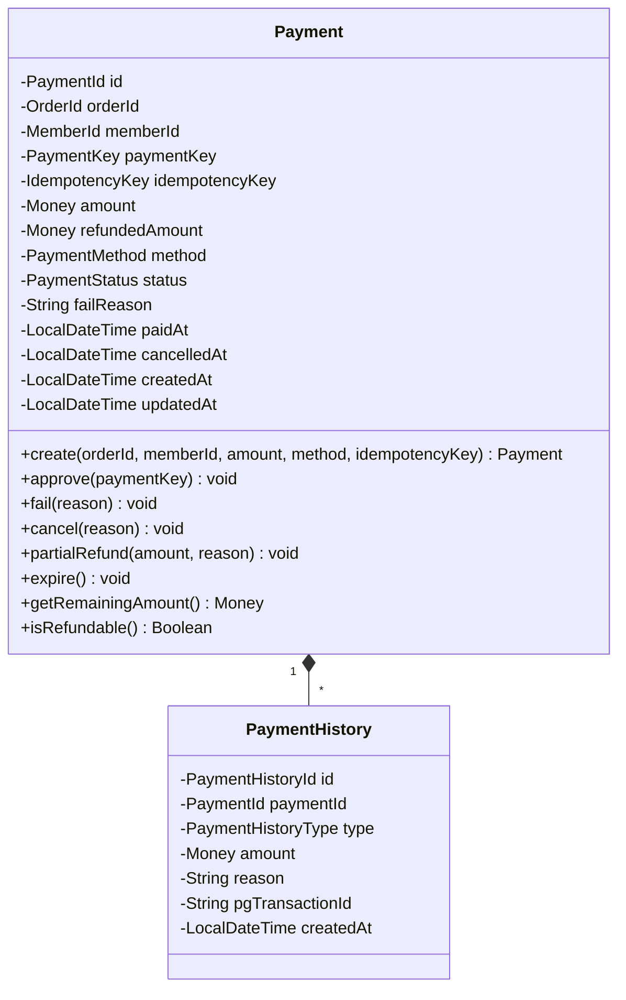
```mermaid
classDiagram
    class Payment {
        -PaymentId id
        -OrderId orderId
        -MemberId memberId
        -PaymentKey paymentKey
        -IdempotencyKey idempotencyKey
        -Money amount
        -Money refundedAmount
        -PaymentMethod method
        -PaymentStatus status
        -String failReason
        -LocalDateTime paidAt
        -LocalDateTime cancelledAt
        -LocalDateTime createdAt
        -LocalDateTime updatedAt
        +create(orderId, memberId, amount, method, idempotencyKey) Payment
        +approve(paymentKey) void
        +fail(reason) void
        +cancel(reason) void
        +partialRefund(amount, reason) void
        +expire() void
        +getRemainingAmount() Money
        +isRefundable() Boolean
    }

    class PaymentHistory {
        -PaymentHistoryId id
        -PaymentId paymentId
        -PaymentHistoryType type
        -Money amount
        -String reason
        -String pgTransactionId
        -LocalDateTime createdAt
    }

    Payment "1" *-- "*" PaymentHistory
```

**Enum: PaymentStatus**

| 값 | 전이 가능 | 설명 |
|----|----------|------|
| READY | IN_PROGRESS, EXPIRED | 결제 준비 |
| IN_PROGRESS | DONE, FAILED | 결제 진행중 |
| DONE | PARTIAL_CANCELLED, CANCELLED | 결제 완료 |
| PARTIAL_CANCELLED | PARTIAL_CANCELLED, CANCELLED | 부분 취소 |
| CANCELLED | - | 전체 취소 |
| FAILED | - | 결제 실패 |
| EXPIRED | - | 만료 (가상계좌) |

**Enum: PaymentMethod**

| 값 | 설명 |
|----|------|
| CARD | 신용/체크카드 |
| KAKAO_PAY | 카카오페이 |
| NAVER_PAY | 네이버페이 |
| TOSS_PAY | 토스페이 |
| VIRTUAL_ACCOUNT | 가상계좌 |
| BANK_TRANSFER | 무통장입금 |

### 3.2 Domain Service

```kotlin
class PaymentDomainService {
    /** 부분 환불 가능 금액 계산 */
    fun calculateRefundableAmount(payment: Payment, requestedAmount: Money): Money

    /** 가상계좌 만료 시간 계산 (24시간) */
    fun calculateVirtualAccountExpiry(): LocalDateTime

    /** 멱등성 검증 */
    fun validateIdempotency(idempotencyKey: IdempotencyKey): Payment?
}
```

### 3.3 Application Service

```kotlin
class ApprovePaymentUseCase(
    private val paymentRepository: PaymentRepository,
    private val pgClient: PgClient,
    private val eventPublisher: DomainEventPublisher
) {
    /**
     * @Transactional
     * 1. 멱등성 키 검증
     * 2. Payment 조회
     * 3. PG사 승인 API 호출 (ACL 통해)
     * 4. 승인 결과에 따라 approve() or fail()
     * 5. 저장 + 이력 기록
     * 6. PaymentCompletedEvent or PaymentFailedEvent 발행
     */
    fun execute(command: ApprovePaymentCommand): PaymentResult
}

class CancelPaymentUseCase(
    private val paymentRepository: PaymentRepository,
    private val pgClient: PgClient,
    private val eventPublisher: DomainEventPublisher
) {
    /**
     * @Transactional
     * 1. Payment 조회
     * 2. PG사 취소 API 호출
     * 3. cancel() 호출
     * 4. 저장 + 이력 기록
     * 5. PaymentCancelledEvent 발행
     */
    fun execute(paymentId: PaymentId, reason: String): void
}
```

### 3.4 Repository

```kotlin
interface PaymentRepository {
    fun save(payment: Payment): Payment
    fun findById(id: PaymentId): Payment?
    fun findByOrderId(orderId: OrderId): Payment?
    fun findByIdempotencyKey(key: IdempotencyKey): Payment?
    fun findByPaymentKey(paymentKey: PaymentKey): Payment?
    fun findByStatusAndCreatedBefore(status: PaymentStatus, dateTime: LocalDateTime): List<Payment>
}
```

### 3.5 Domain Event

| 이벤트 | 페이로드 | Consumer |
|--------|---------|----------|
| PaymentCompletedEvent | paymentId, orderId, amount, method, paymentKey, timestamp | Order, Inventory |
| PaymentFailedEvent | paymentId, orderId, reason, timestamp | Order, Inventory |
| PaymentCancelledEvent | paymentId, orderId, refundAmount, timestamp | Order, Inventory, Promotion, Member |
| PartialRefundedEvent | paymentId, orderId, refundAmount, remainingAmount, timestamp | Order |

### 3.6 Anti-Corruption Layer

```kotlin
/** Toss Payments PG ACL */
class TossPaymentsAdapter(private val tossClient: TossPaymentsClient) : PgPort {

    fun approve(paymentKey: String, orderId: String, amount: Long): PgApprovalResult {
        val response = tossClient.confirmPayment(paymentKey, orderId, amount)
        return PgApprovalResult(
            pgTransactionId = response.transactionKey,
            approvedAt = response.approvedAt.toLocalDateTime(),
            method = mapMethod(response.method),
            receiptUrl = response.receipt?.url
        )
    }

    fun cancel(paymentKey: String, reason: String, amount: Long?): PgCancelResult {
        val response = tossClient.cancelPayment(paymentKey, reason, amount)
        return PgCancelResult(
            pgTransactionId = response.transactionKey,
            cancelledAt = response.cancelledAt.toLocalDateTime(),
            refundAmount = Money.of(response.cancelAmount)
        )
    }

    private fun mapMethod(pgMethod: String): PaymentMethod = when (pgMethod) {
        "카드" -> PaymentMethod.CARD
        "가상계좌" -> PaymentMethod.VIRTUAL_ACCOUNT
        "간편결제" -> PaymentMethod.TOSS_PAY  // 세부 분류 필요
        else -> throw UnsupportedPaymentMethodException(pgMethod)
    }
}
```

---

## 4. Inventory (재고) Bounded Context

### 4.1 Aggregate 상세

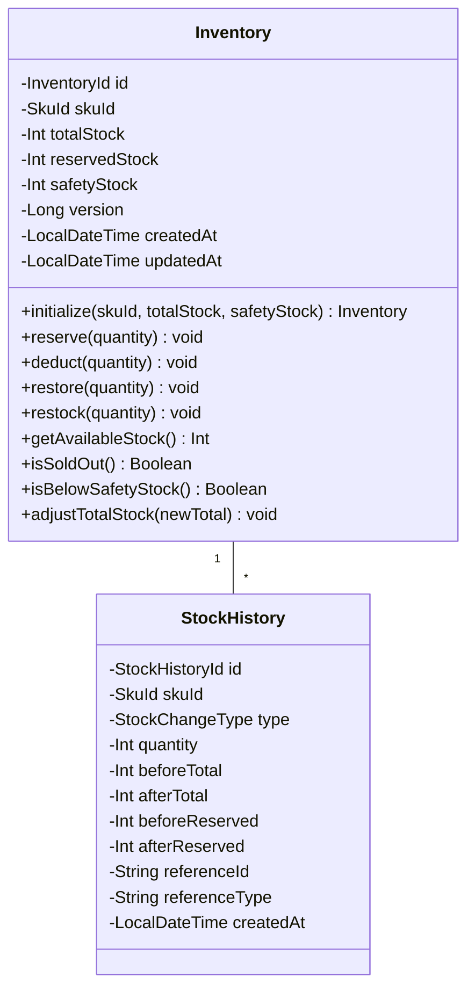
```mermaid
classDiagram
    class Inventory {
        -InventoryId id
        -SkuId skuId
        -Int totalStock
        -Int reservedStock
        -Int safetyStock
        -Long version
        -LocalDateTime createdAt
        -LocalDateTime updatedAt
        +initialize(skuId, totalStock, safetyStock) Inventory
        +reserve(quantity) void
        +deduct(quantity) void
        +restore(quantity) void
        +restock(quantity) void
        +getAvailableStock() Int
        +isSoldOut() Boolean
        +isBelowSafetyStock() Boolean
        +adjustTotalStock(newTotal) void
    }

    class StockHistory {
        -StockHistoryId id
        -SkuId skuId
        -StockChangeType type
        -Int quantity
        -Int beforeTotal
        -Int afterTotal
        -Int beforeReserved
        -Int afterReserved
        -String referenceId
        -String referenceType
        -LocalDateTime createdAt
    }

    Inventory "1" -- "*" StockHistory
```

**Inventory 메서드 상세:**

| 메서드 | 시그니처 | 설명 | 불변 조건 |
|--------|---------|------|----------|
| reserve | `reserve(qty: Int)` | 가용재고에서 qty만큼 예약 | availableStock >= qty |
| deduct | `deduct(qty: Int)` | 예약재고에서 qty만큼 확정 차감 | reservedStock >= qty |
| restore | `restore(qty: Int)` | 예약 취소, 가용재고 복원 | reservedStock >= qty |
| restock | `restock(qty: Int)` | 반품/입고로 실물재고 증가 | qty > 0 |

**Enum: StockChangeType**

| 값 | 설명 |
|----|------|
| RESERVE | 주문 시 예약 |
| DEDUCT | 결제 완료 시 차감 |
| RESTORE | 취소 시 복원 |
| RESTOCK | 입고/반품 시 증가 |
| ADJUST | 관리자 수동 조정 |

### 4.2 Domain Service

```kotlin
class InventoryDomainService {
    /** 여러 SKU 동시 예약 (데드락 방지: SKU ID 오름차순 락) */
    fun reserveMultiple(reservations: List<StockReservation>): ReservationResult

    /** 품절 → 재입고 전환 판단 */
    fun checkRestockTransition(inventory: Inventory, addedQuantity: Int): Boolean
}
```

### 4.3 Application Service

```kotlin
class ReserveStockUseCase(
    private val inventoryRepository: InventoryRepository,
    private val eventPublisher: DomainEventPublisher
) {
    /**
     * @Transactional
     * 1. SKU ID 오름차순 정렬
     * 2. 각 SKU에 대해 SELECT FOR UPDATE (비관적 락)
     * 3. 가용재고 확인 → reserve()
     * 4. StockHistory 기록
     * 5. StockReservedEvent 발행
     * 실패 시: StockReservationFailedEvent 발행
     */
    fun execute(command: ReserveStockCommand): void
}
```

### 4.4 Repository

```kotlin
interface InventoryRepository {
    fun save(inventory: Inventory): Inventory
    fun findBySkuId(skuId: SkuId): Inventory?
    fun findBySkuIdWithLock(skuId: SkuId): Inventory?  // SELECT FOR UPDATE
    fun findBySkuIds(skuIds: List<SkuId>): List<Inventory>
    fun findSoldOut(): List<Inventory>
    fun findBelowSafetyStock(): List<Inventory>
}

interface StockHistoryRepository {
    fun save(history: StockHistory): StockHistory
    fun findBySkuId(skuId: SkuId, pageable: Pageable): Page<StockHistory>
    fun findByReferenceId(referenceId: String): List<StockHistory>
}
```

### 4.5 Domain Event

| 이벤트 | 페이로드 | Consumer |
|--------|---------|----------|
| StockReservedEvent | orderId, items[{skuId, quantity}], timestamp | Order |
| StockReservationFailedEvent | orderId, failedSkuId, availableStock, requestedQuantity, timestamp | Order |
| StockDeductedEvent | orderId, items[{skuId, quantity}], timestamp | - |
| StockRestoredEvent | orderId, items[{skuId, quantity}], timestamp | - |
| SoldOutEvent | skuId, productId, timestamp | Product, Search, Notification |
| RestockedEvent | skuId, productId, quantity, timestamp | Product, Search, Notification |
| SafetyStockAlertEvent | skuId, currentStock, safetyStock, timestamp | Notification(셀러 알림) |

---

## 5. Shipping (배송) Bounded Context

### 5.1 Aggregate 상세

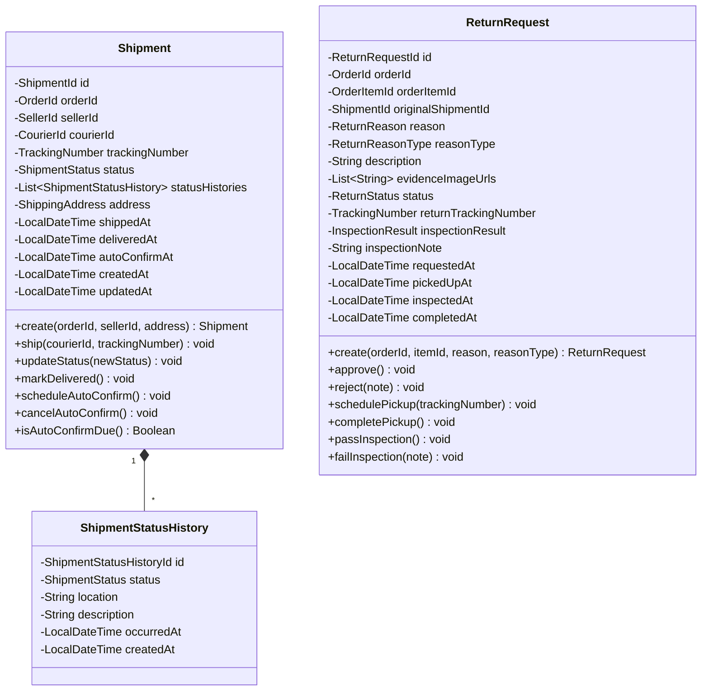
```mermaid
classDiagram
    class Shipment {
        -ShipmentId id
        -OrderId orderId
        -SellerId sellerId
        -CourierId courierId
        -TrackingNumber trackingNumber
        -ShipmentStatus status
        -List~ShipmentStatusHistory~ statusHistories
        -ShippingAddress address
        -LocalDateTime shippedAt
        -LocalDateTime deliveredAt
        -LocalDateTime autoConfirmAt
        -LocalDateTime createdAt
        -LocalDateTime updatedAt
        +create(orderId, sellerId, address) Shipment
        +ship(courierId, trackingNumber) void
        +updateStatus(newStatus) void
        +markDelivered() void
        +scheduleAutoConfirm() void
        +cancelAutoConfirm() void
        +isAutoConfirmDue() Boolean
    }

    class ShipmentStatusHistory {
        -ShipmentStatusHistoryId id
        -ShipmentStatus status
        -String location
        -String description
        -LocalDateTime occurredAt
        -LocalDateTime createdAt
    }

    class ReturnRequest {
        -ReturnRequestId id
        -OrderId orderId
        -OrderItemId orderItemId
        -ShipmentId originalShipmentId
        -ReturnReason reason
        -ReturnReasonType reasonType
        -String description
        -List~String~ evidenceImageUrls
        -ReturnStatus status
        -TrackingNumber returnTrackingNumber
        -InspectionResult inspectionResult
        -String inspectionNote
        -LocalDateTime requestedAt
        -LocalDateTime pickedUpAt
        -LocalDateTime inspectedAt
        -LocalDateTime completedAt
        +create(orderId, itemId, reason, reasonType) ReturnRequest
        +approve() void
        +reject(note) void
        +schedulePickup(trackingNumber) void
        +completePickup() void
        +passInspection() void
        +failInspection(note) void
    }

    Shipment "1" *-- "*" ShipmentStatusHistory
```

**Enum: ShipmentStatus**

| 값 | 전이 가능 |
|----|----------|
| READY_TO_SHIP | SHIPPED |
| SHIPPED | IN_TRANSIT |
| IN_TRANSIT | OUT_FOR_DELIVERY |
| OUT_FOR_DELIVERY | DELIVERED |
| DELIVERED | AUTO_CONFIRMED |
| AUTO_CONFIRMED | - |

**Enum: ReturnStatus**

| 값 | 전이 가능 |
|----|----------|
| REQUESTED | APPROVED, REJECTED |
| APPROVED | PICKUP_SCHEDULED |
| REJECTED | - |
| PICKUP_SCHEDULED | PICKUP_COMPLETED |
| PICKUP_COMPLETED | INSPECTING |
| INSPECTING | INSPECTION_PASSED, INSPECTION_FAILED |
| INSPECTION_PASSED | RETURN_COMPLETED |
| INSPECTION_FAILED | RETURN_REJECTED |
| RETURN_COMPLETED | - |
| RETURN_REJECTED | - |

**Enum: ReturnReasonType**

| 값 | 설명 | 배송비 부담 |
|----|------|-----------|
| CHANGE_OF_MIND | 단순변심 | 구매자 |
| WRONG_SIZE | 사이즈 불일치 | 구매자 |
| DEFECTIVE | 상품 불량 | 셀러 |
| WRONG_PRODUCT | 오배송 | 셀러 |
| DAMAGED_IN_TRANSIT | 배송 중 파손 | 셀러 |

### 5.2 Domain Service

```kotlin
class ShippingDomainService(
    private val courierClient: CourierClient
) {
    /** 자동 구매확정 대상 조회 (배송완료 후 7일 경과) */
    fun findAutoConfirmTargets(): List<Shipment>

    /** 택배사별 송장 번호 형식 검증 */
    fun validateTrackingNumber(courierId: CourierId, trackingNumber: String): Boolean
}
```

### 5.3 Anti-Corruption Layer

```kotlin
/** 택배사 API ACL */
class CourierApiAdapter(private val courierClients: Map<CourierId, CourierApiClient>) : CourierPort {

    fun registerShipment(courierId: CourierId, trackingNumber: String): CourierRegistrationResult {
        val client = courierClients[courierId] ?: throw UnsupportedCourierException(courierId)
        val response = client.register(trackingNumber)
        return CourierRegistrationResult(
            registered = response.success,
            estimatedDelivery = response.eta?.toLocalDate()
        )
    }

    fun getTrackingStatus(courierId: CourierId, trackingNumber: String): DeliveryTrackingResult {
        val client = courierClients[courierId] ?: throw UnsupportedCourierException(courierId)
        val response = client.track(trackingNumber)
        return DeliveryTrackingResult(
            status = mapStatus(response.status),
            location = response.currentLocation,
            updatedAt = response.lastUpdate.toLocalDateTime()
        )
    }

    fun requestPickup(courierId: CourierId, address: ShippingAddress): PickupRequestResult {
        // 반품 수거 요청
    }

    private fun mapStatus(courierStatus: String): ShipmentStatus = when (courierStatus) {
        "집하" -> ShipmentStatus.SHIPPED
        "간선상차", "간선하차" -> ShipmentStatus.IN_TRANSIT
        "배달출발" -> ShipmentStatus.OUT_FOR_DELIVERY
        "배달완료" -> ShipmentStatus.DELIVERED
        else -> ShipmentStatus.IN_TRANSIT
    }
}
```

---

## 6. Member (회원) Bounded Context

### 6.1 Aggregate 상세

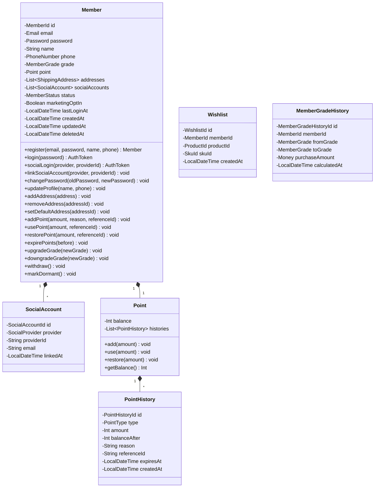
```mermaid
classDiagram
    class Member {
        -MemberId id
        -Email email
        -Password password
        -String name
        -PhoneNumber phone
        -MemberGrade grade
        -Point point
        -List~ShippingAddress~ addresses
        -List~SocialAccount~ socialAccounts
        -MemberStatus status
        -Boolean marketingOptIn
        -LocalDateTime lastLoginAt
        -LocalDateTime createdAt
        -LocalDateTime updatedAt
        -LocalDateTime deletedAt
        +register(email, password, name, phone) Member
        +login(password) AuthToken
        +socialLogin(provider, providerId) AuthToken
        +linkSocialAccount(provider, providerId) void
        +changePassword(oldPassword, newPassword) void
        +updateProfile(name, phone) void
        +addAddress(address) void
        +removeAddress(addressId) void
        +setDefaultAddress(addressId) void
        +addPoint(amount, reason, referenceId) void
        +usePoint(amount, referenceId) void
        +restorePoint(amount, referenceId) void
        +expirePoints(before) void
        +upgradeGrade(newGrade) void
        +downgradeGrade(newGrade) void
        +withdraw() void
        +markDormant() void
    }

    class SocialAccount {
        -SocialAccountId id
        -SocialProvider provider
        -String providerId
        -String email
        -LocalDateTime linkedAt
    }

    class Point {
        -Int balance
        -List~PointHistory~ histories
        +add(amount) void
        +use(amount) void
        +restore(amount) void
        +getBalance() Int
    }

    class PointHistory {
        -PointHistoryId id
        -PointType type
        -Int amount
        -Int balanceAfter
        -String reason
        -String referenceId
        -LocalDateTime expiresAt
        -LocalDateTime createdAt
    }

    class Wishlist {
        -WishlistId id
        -MemberId memberId
        -ProductId productId
        -SkuId skuId
        -LocalDateTime createdAt
    }

    class MemberGradeHistory {
        -MemberGradeHistoryId id
        -MemberId memberId
        -MemberGrade fromGrade
        -MemberGrade toGrade
        -Money purchaseAmount
        -LocalDateTime calculatedAt
    }

    Member "1" *-- "*" SocialAccount
    Member "1" *-- "1" Point
    Point "1" *-- "*" PointHistory
```

**Enum: MemberGrade**

| 값 | 조건 (6개월) | 적립률 | 전이 가능 |
|----|-------------|--------|----------|
| BASIC | 기본 | 1% | SILVER |
| SILVER | 30만원+ | 2% | BASIC, GOLD |
| GOLD | 100만원+ | 3% | SILVER, PLATINUM |
| PLATINUM | 300만원+ | 5% | GOLD |

```kotlin
enum class MemberGrade {
    BASIC, SILVER, GOLD, PLATINUM;

    fun canTransitionTo(target: MemberGrade): Boolean = when (this) {
        BASIC -> target == SILVER
        SILVER -> target in listOf(BASIC, GOLD)
        GOLD -> target in listOf(SILVER, PLATINUM)
        PLATINUM -> target == GOLD
    }

    fun getPointRate(): BigDecimal = when (this) {
        BASIC -> BigDecimal("0.01")
        SILVER -> BigDecimal("0.02")
        GOLD -> BigDecimal("0.03")
        PLATINUM -> BigDecimal("0.05")
    }
}
```

**Enum: SocialProvider**

| 값 | 설명 |
|----|------|
| KAKAO | 카카오 |
| NAVER | 네이버 |
| GOOGLE | 구글 |
| APPLE | 애플 |

### 6.2 Domain Event

| 이벤트 | 페이로드 | Consumer |
|--------|---------|----------|
| MemberRegisteredEvent | memberId, email, name, timestamp | Notification, Promotion(가입쿠폰) |
| GradeChangedEvent | memberId, fromGrade, toGrade, timestamp | Promotion(등급쿠폰), Notification |
| PointEarnedEvent | memberId, amount, reason, balance, timestamp | - |
| PointUsedEvent | memberId, amount, orderId, balance, timestamp | - |
| PointRestoredEvent | memberId, amount, orderId, balance, timestamp | - |

---

## 7. Search (검색) Bounded Context

### 7.1 Aggregate 상세

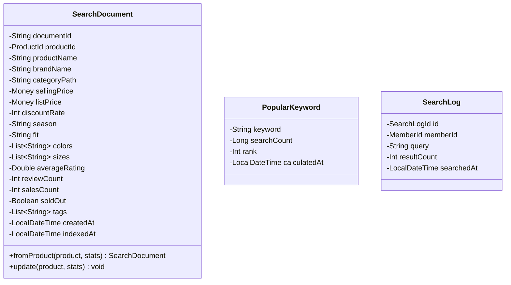
```mermaid
classDiagram
    class SearchDocument {
        -String documentId
        -ProductId productId
        -String productName
        -String brandName
        -String categoryPath
        -Money sellingPrice
        -Money listPrice
        -Int discountRate
        -String season
        -String fit
        -List~String~ colors
        -List~String~ sizes
        -Double averageRating
        -Int reviewCount
        -Int salesCount
        -Boolean soldOut
        -List~String~ tags
        -LocalDateTime createdAt
        -LocalDateTime indexedAt
        +fromProduct(product, stats) SearchDocument
        +update(product, stats) void
    }

    class PopularKeyword {
        -String keyword
        -Long searchCount
        -Int rank
        -LocalDateTime calculatedAt
    }

    class SearchLog {
        -SearchLogId id
        -MemberId memberId
        -String query
        -Int resultCount
        -LocalDateTime searchedAt
    }
```

### 7.2 Domain Service

```kotlin
class SearchDomainService {
    /** 검색어 전처리 (동의어 치환, 오타 교정, 영한 변환) */
    fun preprocessQuery(query: String): ProcessedQuery

    /** 인기검색어 집계 (Redis ZSET) */
    fun calculatePopularKeywords(period: PopularKeywordPeriod): List<PopularKeyword>

    /** 검색 점수 계산 (텍스트 관련도 + 판매량 + 리뷰 가중치) */
    fun calculateRelevanceScore(query: String, document: SearchDocument): Double
}
```

### 7.3 Anti-Corruption Layer

```kotlin
/** Elasticsearch ACL */
class ElasticsearchAdapter(private val esClient: RestHighLevelClient) : SearchIndexPort {

    fun index(document: SearchDocument): void {
        val indexRequest = IndexRequest("products")
            .id(document.documentId)
            .source(mapToEsDocument(document))
        esClient.index(indexRequest, RequestOptions.DEFAULT)
    }

    fun search(query: SearchQuery): SearchResult {
        val searchRequest = buildEsQuery(query)  // nori 분석기 + 필터 + 정렬 + 페이징
        val response = esClient.search(searchRequest, RequestOptions.DEFAULT)
        return mapToSearchResult(response)
    }

    fun suggest(prefix: String): List<String> {
        // completion suggester 사용
    }

    fun delete(documentId: String): void {
        esClient.delete(DeleteRequest("products", documentId), RequestOptions.DEFAULT)
    }

    private fun buildEsQuery(query: SearchQuery): SearchRequest {
        // bool query + nori analyzer + filters + sort + pagination
    }
}
```

---

## 8. Review (리뷰) Bounded Context

### 8.1 Aggregate 상세

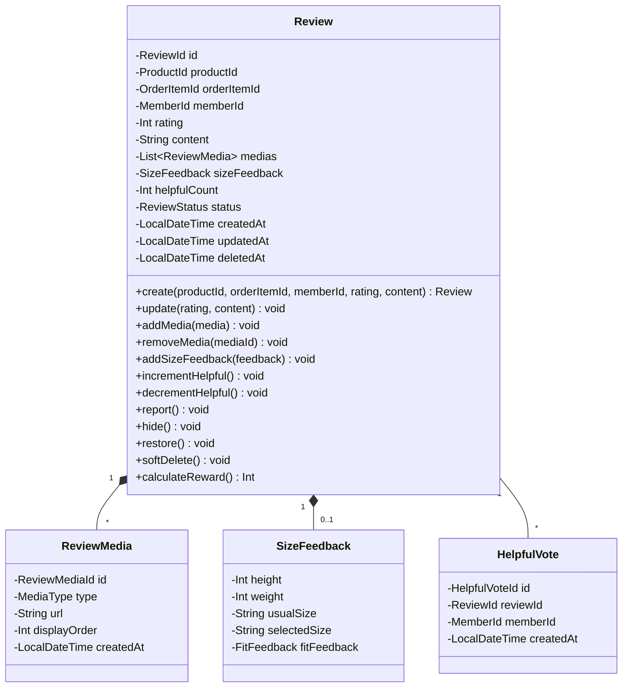
```mermaid
classDiagram
    class Review {
        -ReviewId id
        -ProductId productId
        -OrderItemId orderItemId
        -MemberId memberId
        -Int rating
        -String content
        -List~ReviewMedia~ medias
        -SizeFeedback sizeFeedback
        -Int helpfulCount
        -ReviewStatus status
        -LocalDateTime createdAt
        -LocalDateTime updatedAt
        -LocalDateTime deletedAt
        +create(productId, orderItemId, memberId, rating, content) Review
        +update(rating, content) void
        +addMedia(media) void
        +removeMedia(mediaId) void
        +addSizeFeedback(feedback) void
        +incrementHelpful() void
        +decrementHelpful() void
        +report() void
        +hide() void
        +restore() void
        +softDelete() void
        +calculateReward() Int
    }

    class ReviewMedia {
        -ReviewMediaId id
        -MediaType type
        -String url
        -Int displayOrder
        -LocalDateTime createdAt
    }

    class SizeFeedback {
        -Int height
        -Int weight
        -String usualSize
        -String selectedSize
        -FitFeedback fitFeedback
    }

    class HelpfulVote {
        -HelpfulVoteId id
        -ReviewId reviewId
        -MemberId memberId
        -LocalDateTime createdAt
    }

    Review "1" *-- "*" ReviewMedia
    Review "1" *-- "0..1" SizeFeedback
    Review "1" -- "*" HelpfulVote
```

**Enum: FitFeedback**

| 값 | 설명 |
|----|------|
| SMALL | 작아요 |
| TRUE_TO_SIZE | 정사이즈 |
| LARGE | 커요 |

**Enum: ReviewStatus**

| 값 | 설명 |
|----|------|
| ACTIVE | 공개 |
| HIDDEN | 숨김 (신고 3회 이상) |
| DELETED | 삭제됨 (soft delete) |

### 8.2 Domain Service

```kotlin
class ReviewDomainService {
    /** 리뷰 보상 포인트 계산 */
    fun calculateReward(review: Review): Int {
        var reward = 200  // 기본 텍스트
        if (review.medias.any { it.type == MediaType.IMAGE }) reward = 500
        if (review.medias.any { it.type == MediaType.VIDEO }) reward = 1000
        if (review.sizeFeedback != null) reward += 100
        return reward
    }

    /** 사이즈 피드백 요약 집계 */
    fun aggregateSizeFeedback(productId: ProductId): SizeFeedbackSummary
}
```

### 8.3 Domain Event

| 이벤트 | 페이로드 | Consumer |
|--------|---------|----------|
| ReviewCreatedEvent | reviewId, productId, memberId, rating, reward, timestamp | Member(포인트), Product(평점), Search(인덱스) |
| ReviewUpdatedEvent | reviewId, productId, oldRating, newRating, timestamp | Product(평점), Search |
| ReviewDeletedEvent | reviewId, productId, rating, reward, timestamp | Member(포인트회수), Product(평점), Search |

---

## 9. Promotion (프로모션) Bounded Context

### 9.1 Aggregate 상세

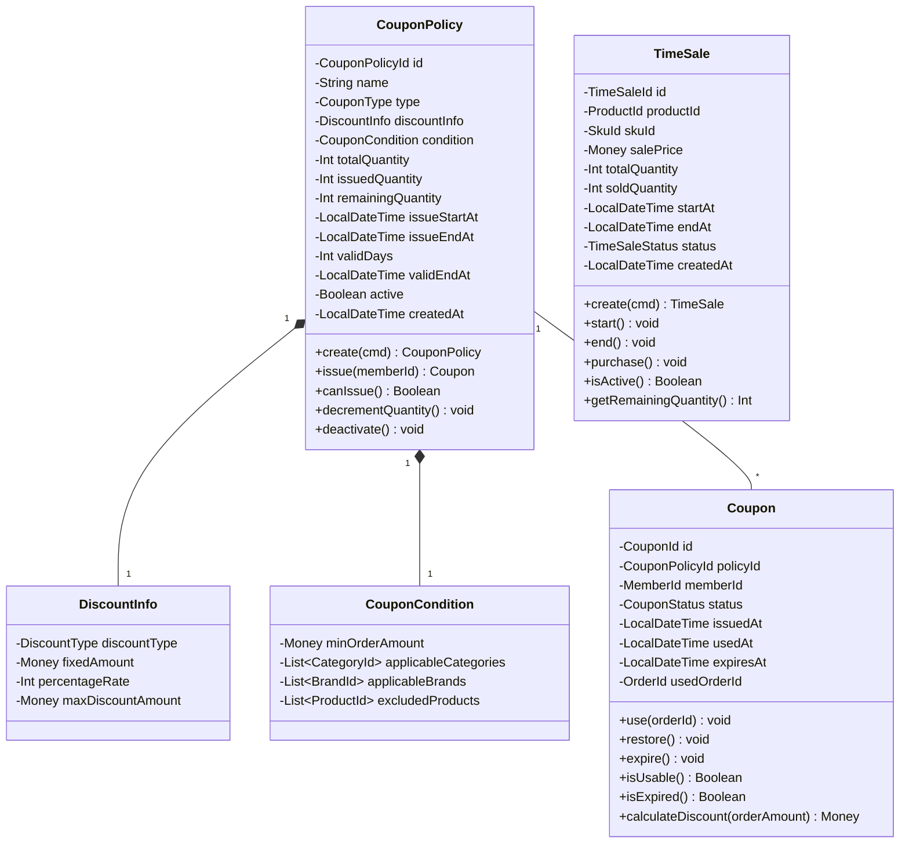
```mermaid
classDiagram
    class CouponPolicy {
        -CouponPolicyId id
        -String name
        -CouponType type
        -DiscountInfo discountInfo
        -CouponCondition condition
        -Int totalQuantity
        -Int issuedQuantity
        -Int remainingQuantity
        -LocalDateTime issueStartAt
        -LocalDateTime issueEndAt
        -Int validDays
        -LocalDateTime validEndAt
        -Boolean active
        -LocalDateTime createdAt
        +create(cmd) CouponPolicy
        +issue(memberId) Coupon
        +canIssue() Boolean
        +decrementQuantity() void
        +deactivate() void
    }

    class Coupon {
        -CouponId id
        -CouponPolicyId policyId
        -MemberId memberId
        -CouponStatus status
        -LocalDateTime issuedAt
        -LocalDateTime usedAt
        -LocalDateTime expiresAt
        -OrderId usedOrderId
        +use(orderId) void
        +restore() void
        +expire() void
        +isUsable() Boolean
        +isExpired() Boolean
        +calculateDiscount(orderAmount) Money
    }

    class DiscountInfo {
        -DiscountType discountType
        -Money fixedAmount
        -Int percentageRate
        -Money maxDiscountAmount
    }

    class CouponCondition {
        -Money minOrderAmount
        -List~CategoryId~ applicableCategories
        -List~BrandId~ applicableBrands
        -List~ProductId~ excludedProducts
    }

    class TimeSale {
        -TimeSaleId id
        -ProductId productId
        -SkuId skuId
        -Money salePrice
        -Int totalQuantity
        -Int soldQuantity
        -LocalDateTime startAt
        -LocalDateTime endAt
        -TimeSaleStatus status
        -LocalDateTime createdAt
        +create(cmd) TimeSale
        +start() void
        +end() void
        +purchase() void
        +isActive() Boolean
        +getRemainingQuantity() Int
    }

    CouponPolicy "1" *-- "1" DiscountInfo
    CouponPolicy "1" *-- "1" CouponCondition
    CouponPolicy "1" -- "*" Coupon
```

**Enum: CouponType**

| 값 | 설명 |
|----|------|
| DOWNLOAD | 다운로드 쿠폰 (회원이 직접 받기) |
| AUTO_ISSUE | 자동 발급 (등급 변경, 가입 등) |
| FIRST_COME | 선착순 쿠폰 |
| ADMIN | 관리자 직접 발급 |

**Enum: DiscountType**

| 값 | 설명 |
|----|------|
| FIXED | 정액 할인 |
| PERCENTAGE | 정률 할인 |
| FREE_SHIPPING | 무료배송 |

### 9.2 Domain Event

| 이벤트 | 페이로드 | Consumer |
|--------|---------|----------|
| CouponIssuedEvent | couponId, policyId, memberId, expiresAt, timestamp | Notification |
| CouponUsedEvent | couponId, memberId, orderId, discountAmount, timestamp | - |
| CouponRestoredEvent | couponId, memberId, orderId, timestamp | - |
| CouponExpiredEvent | couponId, memberId, timestamp | Notification |
| TimeSaleStartedEvent | timeSaleId, productId, salePrice, timestamp | Display, Search |
| TimeSaleEndedEvent | timeSaleId, productId, timestamp | Display, Search |

---

## 10. Display (전시) Bounded Context

### 10.1 Aggregate 상세

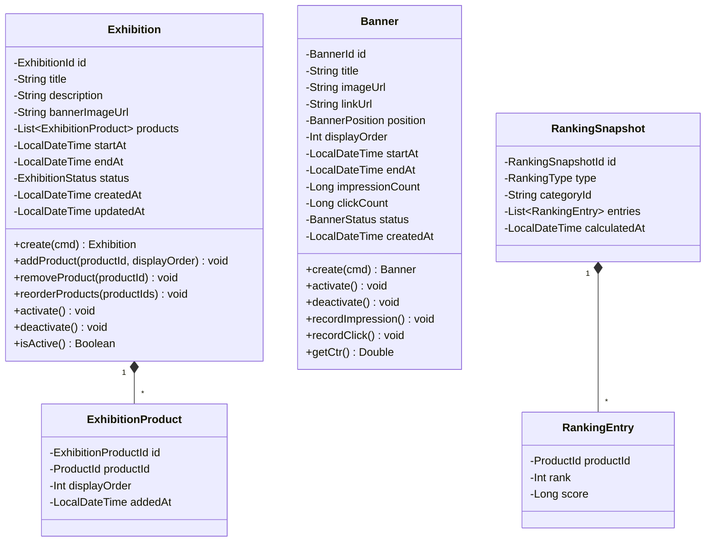
```mermaid
classDiagram
    class Exhibition {
        -ExhibitionId id
        -String title
        -String description
        -String bannerImageUrl
        -List~ExhibitionProduct~ products
        -LocalDateTime startAt
        -LocalDateTime endAt
        -ExhibitionStatus status
        -LocalDateTime createdAt
        -LocalDateTime updatedAt
        +create(cmd) Exhibition
        +addProduct(productId, displayOrder) void
        +removeProduct(productId) void
        +reorderProducts(productIds) void
        +activate() void
        +deactivate() void
        +isActive() Boolean
    }

    class ExhibitionProduct {
        -ExhibitionProductId id
        -ProductId productId
        -Int displayOrder
        -LocalDateTime addedAt
    }

    class Banner {
        -BannerId id
        -String title
        -String imageUrl
        -String linkUrl
        -BannerPosition position
        -Int displayOrder
        -LocalDateTime startAt
        -LocalDateTime endAt
        -Long impressionCount
        -Long clickCount
        -BannerStatus status
        -LocalDateTime createdAt
        +create(cmd) Banner
        +activate() void
        +deactivate() void
        +recordImpression() void
        +recordClick() void
        +getCtr() Double
    }

    class RankingSnapshot {
        -RankingSnapshotId id
        -RankingType type
        -String categoryId
        -List~RankingEntry~ entries
        -LocalDateTime calculatedAt
    }

    class RankingEntry {
        -ProductId productId
        -Int rank
        -Long score
    }

    Exhibition "1" *-- "*" ExhibitionProduct
    RankingSnapshot "1" *-- "*" RankingEntry
```

**Enum: BannerPosition**

| 값 | 설명 |
|----|------|
| MAIN_TOP | 메인 상단 |
| MAIN_MIDDLE | 메인 중간 |
| CATEGORY_TOP | 카테고리 상단 |
| BRAND_TOP | 브랜드관 상단 |

**Enum: RankingType**

| 값 | 설명 | 갱신 주기 |
|----|------|----------|
| REALTIME | 실시간 | 10분 |
| DAILY | 일간 | 매일 00시 |
| WEEKLY | 주간 | 매주 월요일 |
| MONTHLY | 월간 | 매월 1일 |

---

## 11. Settlement (정산) Bounded Context

### 11.1 Aggregate 상세

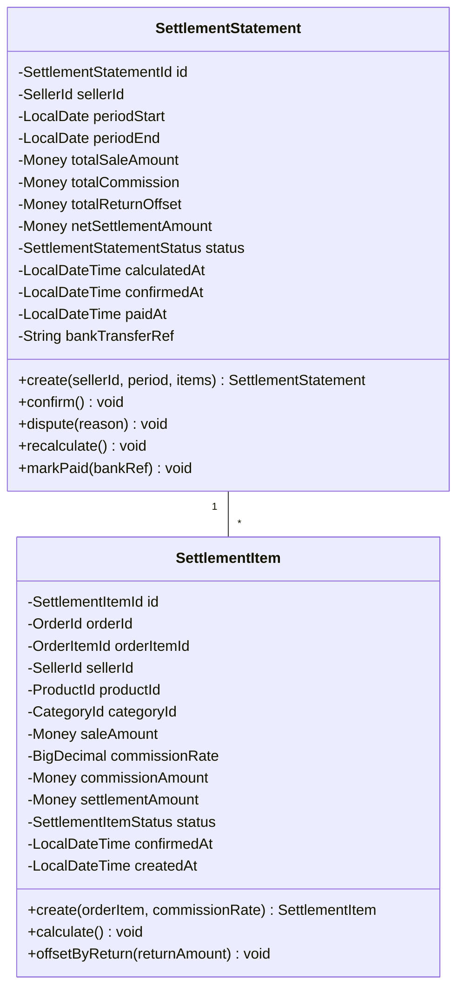
```mermaid
classDiagram
    class SettlementItem {
        -SettlementItemId id
        -OrderId orderId
        -OrderItemId orderItemId
        -SellerId sellerId
        -ProductId productId
        -CategoryId categoryId
        -Money saleAmount
        -BigDecimal commissionRate
        -Money commissionAmount
        -Money settlementAmount
        -SettlementItemStatus status
        -LocalDateTime confirmedAt
        -LocalDateTime createdAt
        +create(orderItem, commissionRate) SettlementItem
        +calculate() void
        +offsetByReturn(returnAmount) void
    }

    class SettlementStatement {
        -SettlementStatementId id
        -SellerId sellerId
        -LocalDate periodStart
        -LocalDate periodEnd
        -Money totalSaleAmount
        -Money totalCommission
        -Money totalReturnOffset
        -Money netSettlementAmount
        -SettlementStatementStatus status
        -LocalDateTime calculatedAt
        -LocalDateTime confirmedAt
        -LocalDateTime paidAt
        -String bankTransferRef
        +create(sellerId, period, items) SettlementStatement
        +confirm() void
        +dispute(reason) void
        +recalculate() void
        +markPaid(bankRef) void
    }

    SettlementStatement "1" -- "*" SettlementItem
```

**Enum: SettlementStatementStatus**

| 값 | 전이 가능 |
|----|----------|
| PENDING | CALCULATED |
| CALCULATED | CONFIRMED, DISPUTED |
| CONFIRMED | PAID |
| DISPUTED | RE_CALCULATED |
| RE_CALCULATED | CONFIRMED |
| PAID | - |

---

## 12. Notification (알림) Bounded Context

### 12.1 Aggregate 상세

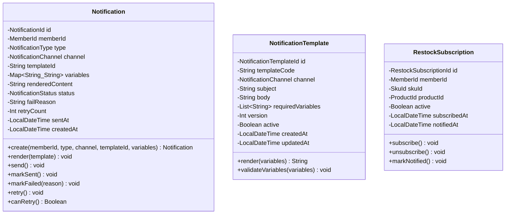
```mermaid
classDiagram
    class Notification {
        -NotificationId id
        -MemberId memberId
        -NotificationType type
        -NotificationChannel channel
        -String templateId
        -Map~String_String~ variables
        -String renderedContent
        -NotificationStatus status
        -String failReason
        -Int retryCount
        -LocalDateTime sentAt
        -LocalDateTime createdAt
        +create(memberId, type, channel, templateId, variables) Notification
        +render(template) void
        +send() void
        +markSent() void
        +markFailed(reason) void
        +retry() void
        +canRetry() Boolean
    }

    class NotificationTemplate {
        -NotificationTemplateId id
        -String templateCode
        -NotificationChannel channel
        -String subject
        -String body
        -List~String~ requiredVariables
        -Int version
        -Boolean active
        -LocalDateTime createdAt
        -LocalDateTime updatedAt
        +render(variables) String
        +validateVariables(variables) void
    }

    class RestockSubscription {
        -RestockSubscriptionId id
        -MemberId memberId
        -SkuId skuId
        -ProductId productId
        -Boolean active
        -LocalDateTime subscribedAt
        -LocalDateTime notifiedAt
        +subscribe() void
        +unsubscribe() void
        +markNotified() void
    }
```

**Enum: NotificationType**

| 값 | 설명 |
|----|------|
| ORDER_CONFIRMED | 주문 확인 |
| PAYMENT_COMPLETED | 결제 완료 |
| SHIPPED | 출고 완료 |
| DELIVERED | 배송 완료 |
| REFUND_COMPLETED | 환불 완료 |
| COUPON_ISSUED | 쿠폰 발급 |
| COUPON_EXPIRING | 쿠폰 만료 임박 |
| RESTOCK | 재입고 |
| PRICE_DROP | 가격 인하 |
| MARKETING | 마케팅 |

**Enum: NotificationChannel**

| 값 | 설명 |
|----|------|
| KAKAO_ALIMTALK | 카카오 알림톡 |
| SMS | 문자 메시지 |
| EMAIL | 이메일 |
| PUSH | 앱 푸시 |

---

## 13. CS (고객서비스) Bounded Context

### 13.1 Aggregate 상세

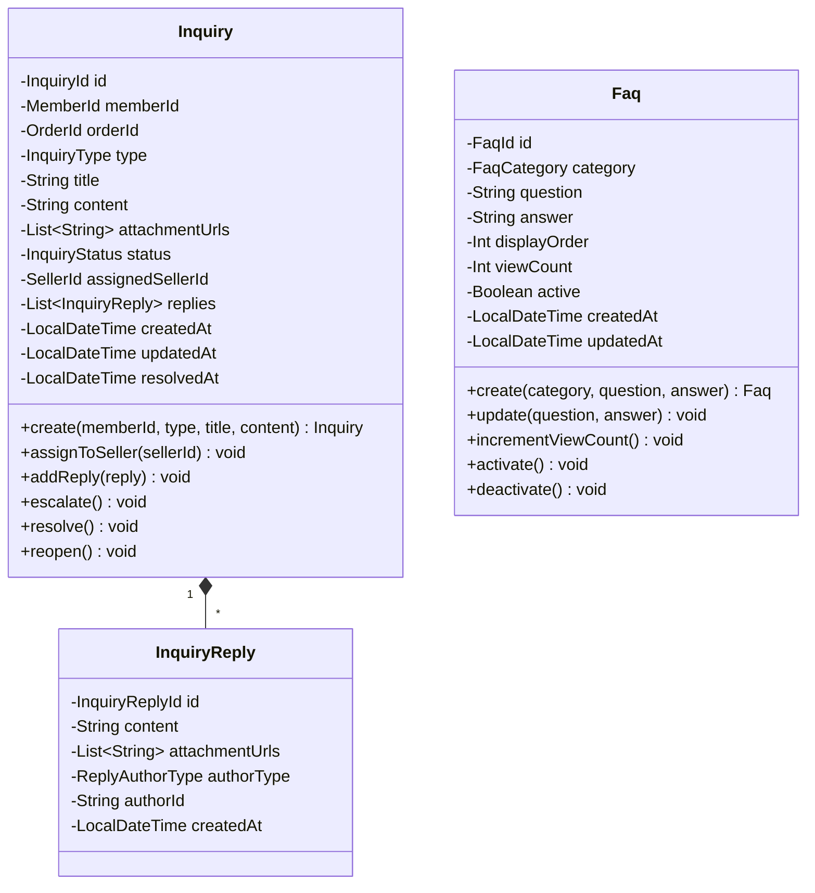
```mermaid
classDiagram
    class Inquiry {
        -InquiryId id
        -MemberId memberId
        -OrderId orderId
        -InquiryType type
        -String title
        -String content
        -List~String~ attachmentUrls
        -InquiryStatus status
        -SellerId assignedSellerId
        -List~InquiryReply~ replies
        -LocalDateTime createdAt
        -LocalDateTime updatedAt
        -LocalDateTime resolvedAt
        +create(memberId, type, title, content) Inquiry
        +assignToSeller(sellerId) void
        +addReply(reply) void
        +escalate() void
        +resolve() void
        +reopen() void
    }

    class InquiryReply {
        -InquiryReplyId id
        -String content
        -List~String~ attachmentUrls
        -ReplyAuthorType authorType
        -String authorId
        -LocalDateTime createdAt
    }

    class Faq {
        -FaqId id
        -FaqCategory category
        -String question
        -String answer
        -Int displayOrder
        -Int viewCount
        -Boolean active
        -LocalDateTime createdAt
        -LocalDateTime updatedAt
        +create(category, question, answer) Faq
        +update(question, answer) void
        +incrementViewCount() void
        +activate() void
        +deactivate() void
    }

    Inquiry "1" *-- "*" InquiryReply
```

**Enum: InquiryType**

| 값 | 설명 |
|----|------|
| PRODUCT | 상품 문의 |
| DELIVERY | 배송 문의 |
| RETURN_EXCHANGE | 반품/교환 문의 |
| PAYMENT_REFUND | 결제/환불 문의 |
| ACCOUNT | 계정 문의 |
| ETC | 기타 |

**Enum: InquiryStatus**

| 값 | 전이 가능 |
|----|----------|
| SUBMITTED | ANSWERED, ESCALATED |
| ANSWERED | RESOLVED, RE_OPENED |
| ESCALATED | ADMIN_ANSWERED |
| ADMIN_ANSWERED | RESOLVED, RE_OPENED |
| RE_OPENED | ANSWERED, ESCALATED |
| RESOLVED | - |

---

## 14. Seller (셀러) Bounded Context

### 14.1 Aggregate 상세

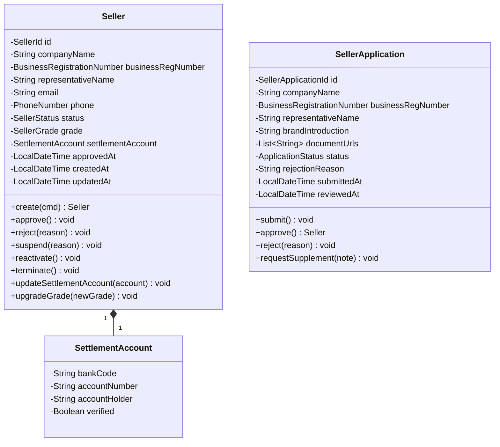
```mermaid
classDiagram
    class Seller {
        -SellerId id
        -String companyName
        -BusinessRegistrationNumber businessRegNumber
        -String representativeName
        -String email
        -PhoneNumber phone
        -SellerStatus status
        -SellerGrade grade
        -SettlementAccount settlementAccount
        -LocalDateTime approvedAt
        -LocalDateTime createdAt
        -LocalDateTime updatedAt
        +create(cmd) Seller
        +approve() void
        +reject(reason) void
        +suspend(reason) void
        +reactivate() void
        +terminate() void
        +updateSettlementAccount(account) void
        +upgradeGrade(newGrade) void
    }

    class SellerApplication {
        -SellerApplicationId id
        -String companyName
        -BusinessRegistrationNumber businessRegNumber
        -String representativeName
        -String brandIntroduction
        -List~String~ documentUrls
        -ApplicationStatus status
        -String rejectionReason
        -LocalDateTime submittedAt
        -LocalDateTime reviewedAt
        +submit() void
        +approve() Seller
        +reject(reason) void
        +requestSupplement(note) void
    }

    class SettlementAccount {
        -String bankCode
        -String accountNumber
        -String accountHolder
        -Boolean verified
    }

    Seller "1" *-- "1" SettlementAccount
```

**Enum: SellerStatus**

| 값 | 전이 가능 |
|----|----------|
| PENDING_REVIEW | APPROVED, REJECTED |
| APPROVED | ACTIVE |
| ACTIVE | SUSPENDED, TERMINATED |
| SUSPENDED | ACTIVE, TERMINATED |
| REJECTED | - |
| TERMINATED | - |

**Enum: SellerGrade**

| 값 | 조건 | 수수료 혜택 |
|----|------|-----------|
| STANDARD | 기본 | 0% |
| PREMIUM | 월 매출 1,000만+ / 반품률 5%이하 | -1%p |
| VIP | 월 매출 5,000만+ / 반품률 3%이하 | -2%p |

---

## 15. Content (콘텐츠) Bounded Context

### 15.1 Aggregate 상세

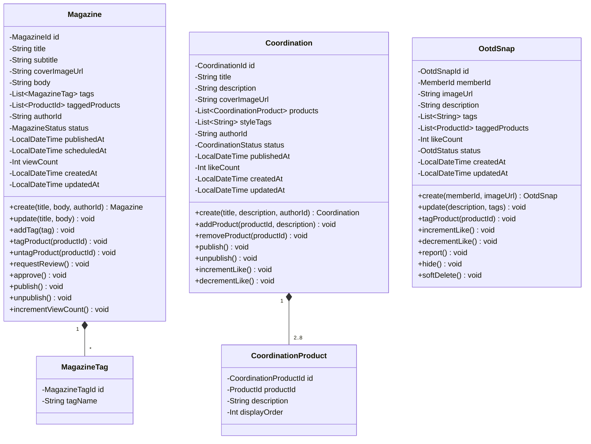
```mermaid
classDiagram
    class Magazine {
        -MagazineId id
        -String title
        -String subtitle
        -String coverImageUrl
        -String body
        -List~MagazineTag~ tags
        -List~ProductId~ taggedProducts
        -String authorId
        -MagazineStatus status
        -LocalDateTime publishedAt
        -LocalDateTime scheduledAt
        -Int viewCount
        -LocalDateTime createdAt
        -LocalDateTime updatedAt
        +create(title, body, authorId) Magazine
        +update(title, body) void
        +addTag(tag) void
        +tagProduct(productId) void
        +untagProduct(productId) void
        +requestReview() void
        +approve() void
        +publish() void
        +unpublish() void
        +incrementViewCount() void
    }

    class MagazineTag {
        -MagazineTagId id
        -String tagName
    }

    class Coordination {
        -CoordinationId id
        -String title
        -String description
        -String coverImageUrl
        -List~CoordinationProduct~ products
        -List~String~ styleTags
        -String authorId
        -CoordinationStatus status
        -LocalDateTime publishedAt
        -Int likeCount
        -LocalDateTime createdAt
        -LocalDateTime updatedAt
        +create(title, description, authorId) Coordination
        +addProduct(productId, description) void
        +removeProduct(productId) void
        +publish() void
        +unpublish() void
        +incrementLike() void
        +decrementLike() void
    }

    class CoordinationProduct {
        -CoordinationProductId id
        -ProductId productId
        -String description
        -Int displayOrder
    }

    class OotdSnap {
        -OotdSnapId id
        -MemberId memberId
        -String imageUrl
        -String description
        -List~String~ tags
        -List~ProductId~ taggedProducts
        -Int likeCount
        -OotdStatus status
        -LocalDateTime createdAt
        -LocalDateTime updatedAt
        +create(memberId, imageUrl) OotdSnap
        +update(description, tags) void
        +tagProduct(productId) void
        +incrementLike() void
        +decrementLike() void
        +report() void
        +hide() void
        +softDelete() void
    }

    Magazine "1" *-- "*" MagazineTag
    Coordination "1" *-- "2..8" CoordinationProduct
```

**Enum: MagazineStatus**

| 값 | 전이 가능 |
|----|----------|
| DRAFT | PENDING_REVIEW |
| PENDING_REVIEW | APPROVED, REJECTED |
| APPROVED | PUBLISHED |
| REJECTED | DRAFT |
| PUBLISHED | UNPUBLISHED |
| UNPUBLISHED | PUBLISHED |

---

## 부록: 전체 Domain Event 카탈로그

| # | 이벤트 | Bounded Context | Aggregate | 주요 Consumer |
|---|--------|----------------|-----------|--------------|
| 1 | ProductCreatedEvent | Product | Product | Search, Display |
| 2 | ProductApprovedEvent | Product | Product | Inventory, Search |
| 3 | ProductUpdatedEvent | Product | Product | Search |
| 4 | PriceChangedEvent | Product | Product | Search, Notification |
| 5 | ProductDiscontinuedEvent | Product | Product | Search, Display |
| 6 | SkuCreatedEvent | Product | Product | Inventory |
| 7 | ProductSoldOutEvent | Product | Product | Search, Display |
| 8 | OrderCreatedEvent | Order | Order | Inventory |
| 9 | OrderCancelledEvent | Order | Order | Payment, Inventory, Promotion, Member |
| 10 | OrderItemCancelledEvent | Order | Order | Payment, Inventory |
| 11 | PurchaseConfirmedEvent | Order | Order | Settlement, Review |
| 12 | PaymentCompletedEvent | Payment | Payment | Order, Inventory |
| 13 | PaymentFailedEvent | Payment | Payment | Order, Inventory |
| 14 | PaymentCancelledEvent | Payment | Payment | Order, Inventory, Promotion, Member |
| 15 | PartialRefundedEvent | Payment | Payment | Order |
| 16 | StockReservedEvent | Inventory | Inventory | Order |
| 17 | StockReservationFailedEvent | Inventory | Inventory | Order |
| 18 | SoldOutEvent | Inventory | Inventory | Product, Search, Notification |
| 19 | RestockedEvent | Inventory | Inventory | Product, Search, Notification |
| 20 | SafetyStockAlertEvent | Inventory | Inventory | Notification |
| 21 | ShippedEvent | Shipping | Shipment | Order, Notification |
| 22 | DeliveredEvent | Shipping | Shipment | Order, Notification |
| 23 | AutoConfirmedEvent | Shipping | Shipment | Order, Settlement |
| 24 | ReturnApprovedEvent | Shipping | ReturnRequest | Payment, Inventory |
| 25 | MemberRegisteredEvent | Member | Member | Notification, Promotion |
| 26 | GradeChangedEvent | Member | Member | Promotion, Notification |
| 27 | ReviewCreatedEvent | Review | Review | Member, Product, Search |
| 28 | ReviewDeletedEvent | Review | Review | Member, Product, Search |
| 29 | CouponIssuedEvent | Promotion | Coupon | Notification |
| 30 | TimeSaleStartedEvent | Promotion | TimeSale | Display, Search |
| 31 | SettlementCalculatedEvent | Settlement | SettlementStatement | Notification |
| 32 | SettlementPaidEvent | Settlement | SettlementStatement | Notification |
| 33 | InquirySubmittedEvent | CS | Inquiry | Seller, Notification |
| 34 | InquiryAnsweredEvent | CS | Inquiry | Notification |
| 35 | MagazinePublishedEvent | Content | Magazine | Search, Display |
| 36 | OotdSnapCreatedEvent | Content | OotdSnap | Display |
