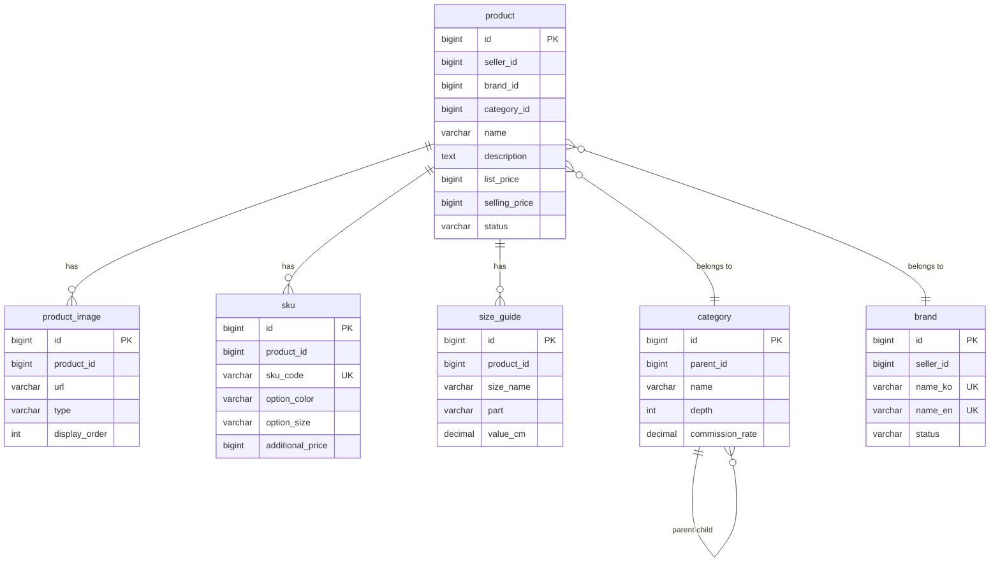
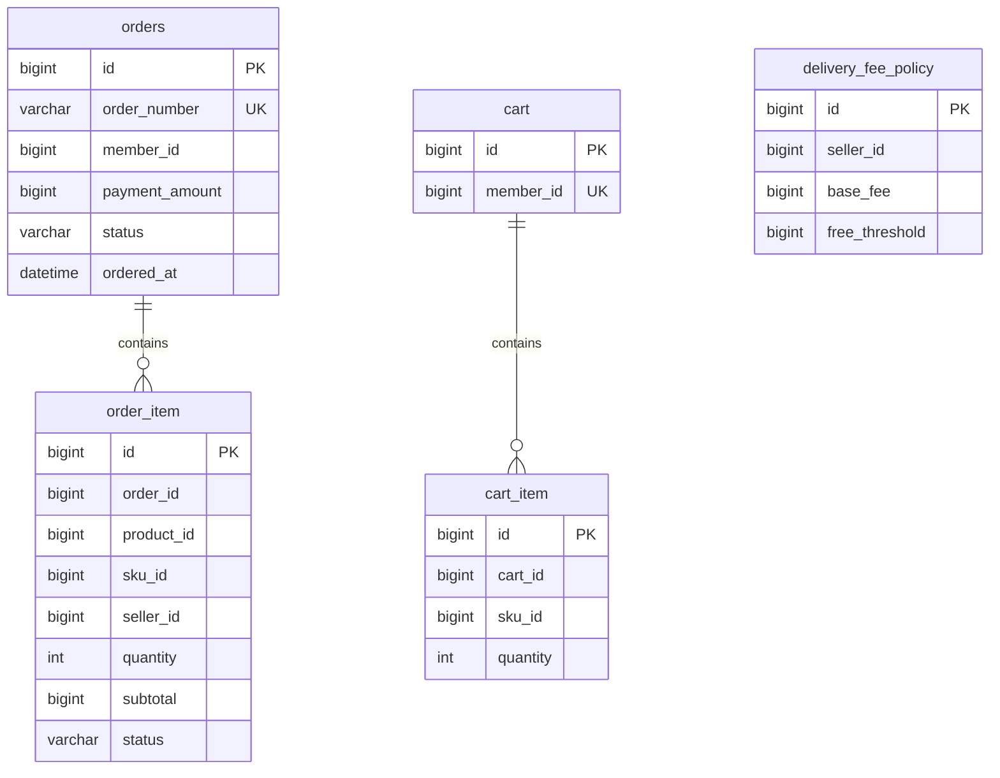
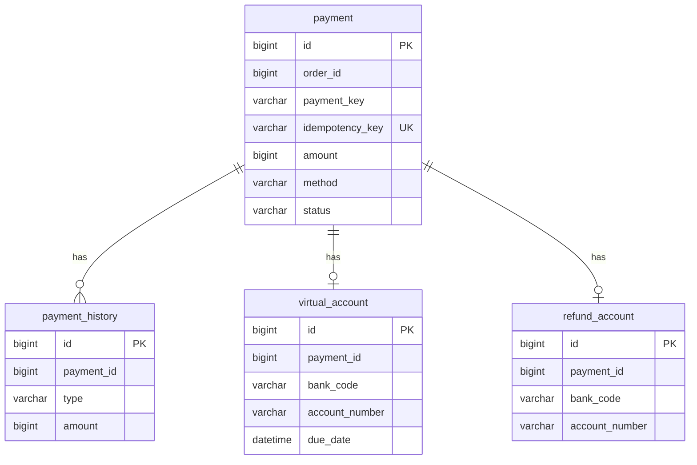
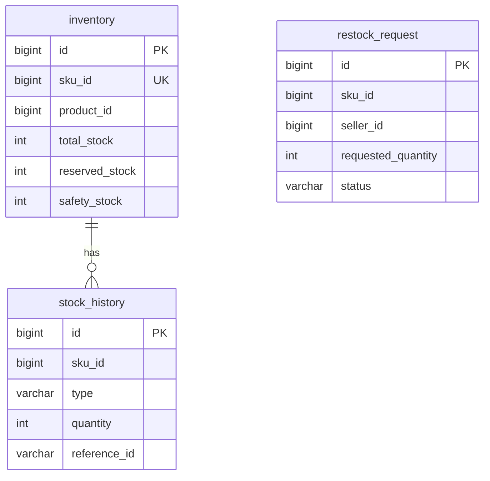
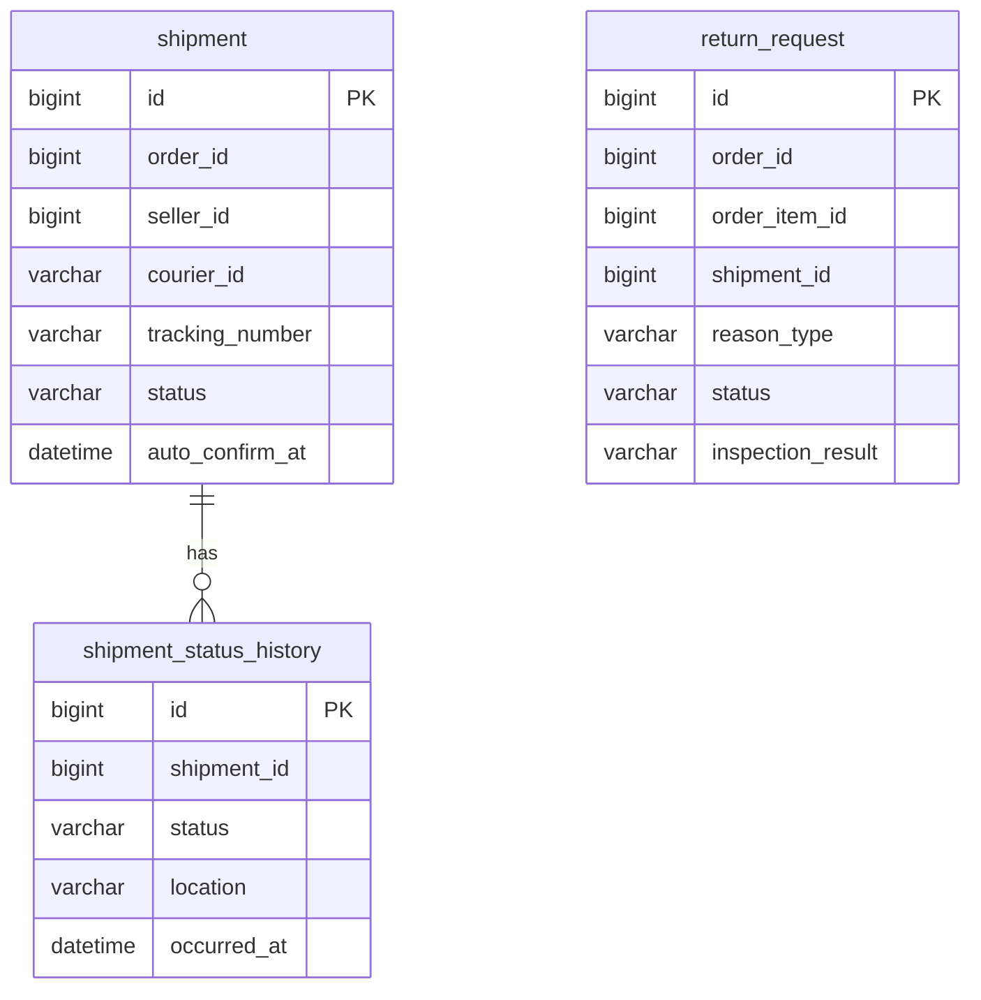
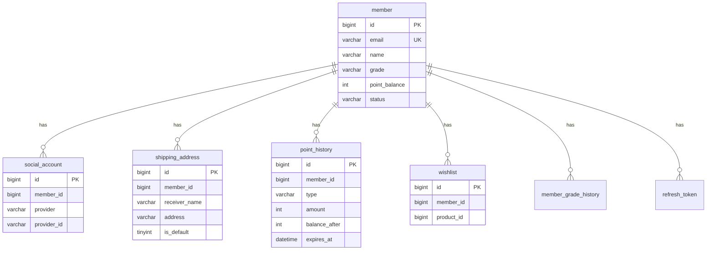
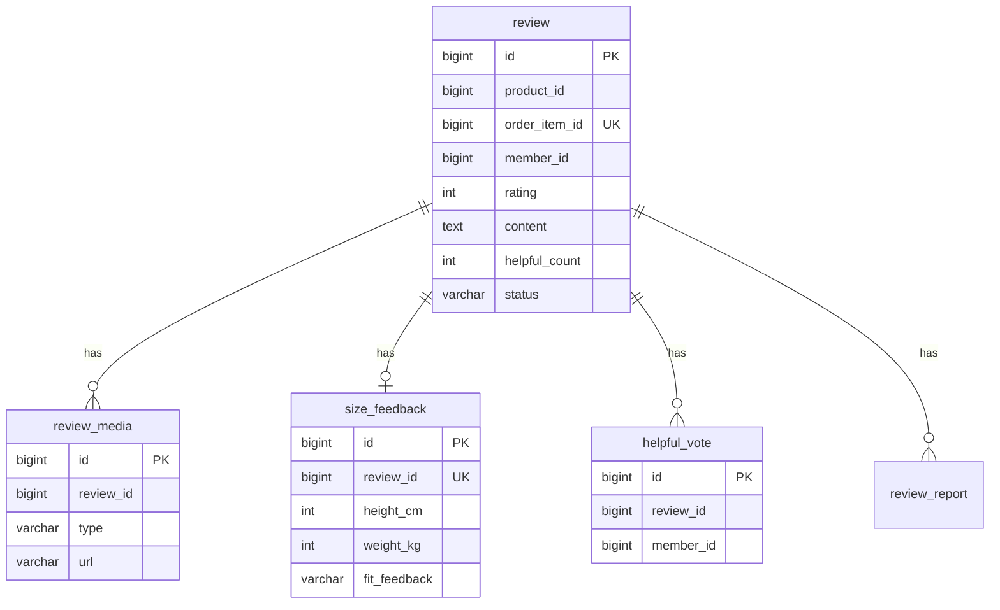
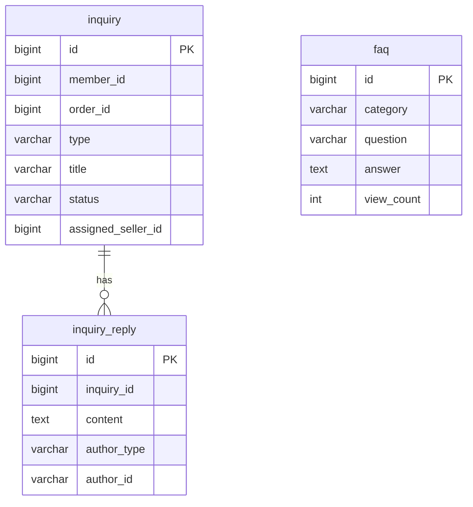
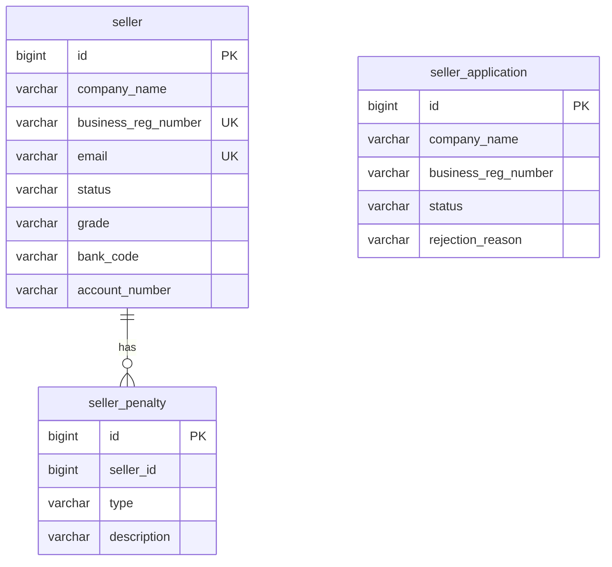
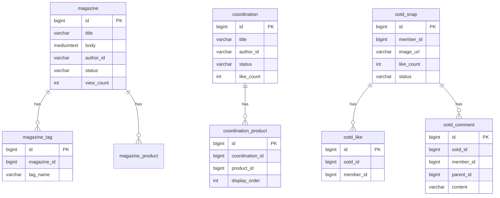

# 상세 ERD + 인덱스 + DDL

> 작성일: 2026-03-22
> 전체 15개 서비스의 DB 스키마 설계
> 규칙: FK 제약조건 없음, JSON 타입 없음, ENUM 타입 없음, BOOLEAN 없음 (TINYINT(1)), DATETIME(6), deleted_at soft delete, 모든 컬럼/테이블 COMMENT 필수

---

## 1. Product (상품) 서비스

### 1.1 DDL

```sql
-- ============================================================
-- Product Service Database Schema
-- ============================================================

CREATE TABLE product (
    id                BIGINT          NOT NULL AUTO_INCREMENT COMMENT '상품 고유 식별자',
    seller_id         BIGINT          NOT NULL COMMENT '셀러 ID (seller 테이블 참조)',
    brand_id          BIGINT          NOT NULL COMMENT '브랜드 ID (brand 테이블 참조)',
    category_id       BIGINT          NOT NULL COMMENT '카테고리 ID (category 테이블 참조, leaf만 허용)',
    name              VARCHAR(100)    NOT NULL COMMENT '상품명 (2~100자)',
    description       TEXT            NOT NULL COMMENT '상품 상세 설명 (HTML)',
    list_price        BIGINT          NOT NULL COMMENT '정가 (원 단위)',
    selling_price     BIGINT          NOT NULL COMMENT '판매가 (원 단위, list_price 이하)',
    season            VARCHAR(30)     NULL     COMMENT '시즌 (SS, FW, PRE_SS, PRE_FW, ALL)',
    fit               VARCHAR(30)     NULL     COMMENT '핏 (OVERSIZED, REGULAR, SLIM, RELAXED)',
    status            VARCHAR(30)     NOT NULL DEFAULT 'DRAFT' COMMENT '상품 상태 (DRAFT, PENDING_REVIEW, REJECTED, APPROVED, ON_SALE, SOLD_OUT, DISCONTINUED)',
    reject_reason     VARCHAR(500)    NULL     COMMENT '심사 거부 사유',
    version           BIGINT          NOT NULL DEFAULT 0 COMMENT '낙관적 락 버전',
    created_at        DATETIME(6)     NOT NULL DEFAULT CURRENT_TIMESTAMP(6) COMMENT '생성일시',
    updated_at        DATETIME(6)     NOT NULL DEFAULT CURRENT_TIMESTAMP(6) ON UPDATE CURRENT_TIMESTAMP(6) COMMENT '수정일시',
    deleted_at        DATETIME(6)     NULL     COMMENT '삭제일시 (soft delete)',
    PRIMARY KEY (id)
) ENGINE=InnoDB DEFAULT CHARSET=utf8mb4 COLLATE=utf8mb4_unicode_ci
COMMENT='상품 기본 정보';

CREATE TABLE product_image (
    id                BIGINT          NOT NULL AUTO_INCREMENT COMMENT '상품 이미지 고유 식별자',
    product_id        BIGINT          NOT NULL COMMENT '상품 ID',
    url               VARCHAR(500)    NOT NULL COMMENT '이미지 URL (S3)',
    type              VARCHAR(30)     NOT NULL COMMENT '이미지 유형 (MAIN, DETAIL, ADDITIONAL)',
    display_order     INT             NOT NULL DEFAULT 0 COMMENT '노출 순서',
    created_at        DATETIME(6)     NOT NULL DEFAULT CURRENT_TIMESTAMP(6) COMMENT '생성일시',
    deleted_at        DATETIME(6)     NULL     COMMENT '삭제일시 (soft delete)',
    PRIMARY KEY (id)
) ENGINE=InnoDB DEFAULT CHARSET=utf8mb4 COLLATE=utf8mb4_unicode_ci
COMMENT='상품 이미지';

CREATE TABLE sku (
    id                BIGINT          NOT NULL AUTO_INCREMENT COMMENT 'SKU 고유 식별자',
    product_id        BIGINT          NOT NULL COMMENT '상품 ID',
    sku_code          VARCHAR(50)     NOT NULL COMMENT 'SKU 코드 (브랜드코드-카테고리코드-시퀀스-옵션코드)',
    option_color      VARCHAR(50)     NULL     COMMENT '옵션: 색상',
    option_size       VARCHAR(50)     NULL     COMMENT '옵션: 사이즈',
    additional_price  BIGINT          NOT NULL DEFAULT 0 COMMENT '추가 금액 (원 단위)',
    active            TINYINT(1)      NOT NULL DEFAULT 1 COMMENT '활성 여부 (1=활성, 0=비활성)',
    created_at        DATETIME(6)     NOT NULL DEFAULT CURRENT_TIMESTAMP(6) COMMENT '생성일시',
    updated_at        DATETIME(6)     NOT NULL DEFAULT CURRENT_TIMESTAMP(6) ON UPDATE CURRENT_TIMESTAMP(6) COMMENT '수정일시',
    deleted_at        DATETIME(6)     NULL     COMMENT '삭제일시 (soft delete)',
    PRIMARY KEY (id),
    UNIQUE KEY uk_sku_code (sku_code)
) ENGINE=InnoDB DEFAULT CHARSET=utf8mb4 COLLATE=utf8mb4_unicode_ci
COMMENT='상품 SKU (옵션 조합별 최소 관리 단위)';

CREATE TABLE size_guide (
    id                BIGINT          NOT NULL AUTO_INCREMENT COMMENT '사이즈 가이드 고유 식별자',
    product_id        BIGINT          NOT NULL COMMENT '상품 ID',
    size_name         VARCHAR(30)     NOT NULL COMMENT '사이즈명 (S, M, L, XL 등)',
    part              VARCHAR(50)     NOT NULL COMMENT '측정 부위 (총장, 어깨너비, 가슴단면, 소매길이 등)',
    value_cm          DECIMAL(6,1)    NOT NULL COMMENT '측정값 (cm)',
    created_at        DATETIME(6)     NOT NULL DEFAULT CURRENT_TIMESTAMP(6) COMMENT '생성일시',
    PRIMARY KEY (id)
) ENGINE=InnoDB DEFAULT CHARSET=utf8mb4 COLLATE=utf8mb4_unicode_ci
COMMENT='사이즈 가이드 (실측 정보)';

CREATE TABLE category (
    id                BIGINT          NOT NULL AUTO_INCREMENT COMMENT '카테고리 고유 식별자',
    parent_id         BIGINT          NULL     COMMENT '부모 카테고리 ID (최상위는 NULL)',
    name              VARCHAR(50)     NOT NULL COMMENT '카테고리명',
    depth             INT             NOT NULL COMMENT '깊이 (1=대분류, 2=중분류, 3=소분류)',
    display_order     INT             NOT NULL DEFAULT 0 COMMENT '노출 순서',
    commission_rate   DECIMAL(5,2)    NOT NULL DEFAULT 20.00 COMMENT '수수료율 (%)',
    active            TINYINT(1)      NOT NULL DEFAULT 1 COMMENT '활성 여부',
    created_at        DATETIME(6)     NOT NULL DEFAULT CURRENT_TIMESTAMP(6) COMMENT '생성일시',
    updated_at        DATETIME(6)     NOT NULL DEFAULT CURRENT_TIMESTAMP(6) ON UPDATE CURRENT_TIMESTAMP(6) COMMENT '수정일시',
    PRIMARY KEY (id)
) ENGINE=InnoDB DEFAULT CHARSET=utf8mb4 COLLATE=utf8mb4_unicode_ci
COMMENT='상품 카테고리 (최대 3depth 계층 구조)';

CREATE TABLE brand (
    id                BIGINT          NOT NULL AUTO_INCREMENT COMMENT '브랜드 고유 식별자',
    seller_id         BIGINT          NOT NULL COMMENT '셀러 ID',
    name_ko           VARCHAR(100)    NOT NULL COMMENT '브랜드명 (한글)',
    name_en           VARCHAR(100)    NOT NULL COMMENT '브랜드명 (영문)',
    logo_url          VARCHAR(500)    NULL     COMMENT '로고 이미지 URL',
    description       TEXT            NULL     COMMENT '브랜드 소개',
    status            VARCHAR(30)     NOT NULL DEFAULT 'PENDING' COMMENT '브랜드 상태 (PENDING, APPROVED, REJECTED)',
    is_pb             TINYINT(1)      NOT NULL DEFAULT 0 COMMENT 'PB 브랜드 여부 (1=PB, 0=일반)',
    created_at        DATETIME(6)     NOT NULL DEFAULT CURRENT_TIMESTAMP(6) COMMENT '생성일시',
    updated_at        DATETIME(6)     NOT NULL DEFAULT CURRENT_TIMESTAMP(6) ON UPDATE CURRENT_TIMESTAMP(6) COMMENT '수정일시',
    deleted_at        DATETIME(6)     NULL     COMMENT '삭제일시 (soft delete)',
    PRIMARY KEY (id),
    UNIQUE KEY uk_brand_name_ko (name_ko),
    UNIQUE KEY uk_brand_name_en (name_en)
) ENGINE=InnoDB DEFAULT CHARSET=utf8mb4 COLLATE=utf8mb4_unicode_ci
COMMENT='브랜드 정보';
```

### 1.2 인덱스 전략

```sql
-- 셀러별 상품 조회 (파트너센터)
CREATE INDEX idx_product_seller_id ON product (seller_id, status, deleted_at);

-- 카테고리별 상품 조회 (카테고리 페이지)
CREATE INDEX idx_product_category_id ON product (category_id, status, deleted_at);

-- 브랜드별 상품 조회 (브랜드관)
CREATE INDEX idx_product_brand_id ON product (brand_id, status, deleted_at);

-- 상태별 조회 (심사 대기 목록 등)
CREATE INDEX idx_product_status ON product (status, created_at);

-- SKU: 상품별 조회
CREATE INDEX idx_sku_product_id ON sku (product_id, deleted_at);

-- 이미지: 상품별 조회
CREATE INDEX idx_product_image_product_id ON product_image (product_id, type, display_order);

-- 사이즈 가이드: 상품별 조회
CREATE INDEX idx_size_guide_product_id ON size_guide (product_id);

-- 카테고리: 부모별 조회
CREATE INDEX idx_category_parent_id ON category (parent_id, display_order);

-- 브랜드: 셀러별 조회
CREATE INDEX idx_brand_seller_id ON brand (seller_id);
```

### 1.3 데이터 볼륨 예측 (1년 운영)

| 테이블 | 예상 레코드 수 | 증가율/월 | 비고 |
|--------|-------------|----------|------|
| product | 100,000 | 5,000 | 입점 셀러 500개 × 평균 200상품 |
| product_image | 500,000 | 25,000 | 상품당 평균 5장 |
| sku | 400,000 | 20,000 | 상품당 평균 4 SKU (2색상 × 2사이즈) |
| size_guide | 300,000 | 15,000 | 상품당 평균 3 사이즈 × 4 부위 = 12행 |
| category | 500 | 5 | 대 20 × 중 50 × 소 150 수준 |
| brand | 1,000 | 50 | |

### 1.4 Mermaid ER Diagram



---

## 2. Order (주문) 서비스

### 2.1 DDL

```sql
CREATE TABLE orders (
    id                BIGINT          NOT NULL AUTO_INCREMENT COMMENT '주문 고유 식별자',
    order_number      VARCHAR(30)     NOT NULL COMMENT '주문번호 (ORD-yyyyMMdd-랜덤8자리)',
    member_id         BIGINT          NOT NULL COMMENT '주문자 회원 ID',
    receiver_name     VARCHAR(50)     NOT NULL COMMENT '수령인 이름',
    receiver_phone    VARCHAR(20)     NOT NULL COMMENT '수령인 전화번호',
    zip_code          VARCHAR(10)     NOT NULL COMMENT '우편번호',
    address           VARCHAR(200)    NOT NULL COMMENT '주소',
    detail_address    VARCHAR(200)    NULL     COMMENT '상세주소',
    delivery_memo     VARCHAR(200)    NULL     COMMENT '배송 메모',
    total_item_amount BIGINT          NOT NULL COMMENT '상품 총액 (원)',
    total_delivery_fee BIGINT         NOT NULL DEFAULT 0 COMMENT '총 배송비 (원)',
    coupon_discount   BIGINT          NOT NULL DEFAULT 0 COMMENT '쿠폰 할인 금액 (원)',
    points_used       BIGINT          NOT NULL DEFAULT 0 COMMENT '사용 포인트 (원)',
    payment_amount    BIGINT          NOT NULL COMMENT '실 결제 금액 (원)',
    status            VARCHAR(30)     NOT NULL DEFAULT 'ORDER_CREATED' COMMENT '주문 상태',
    cancel_reason     VARCHAR(500)    NULL     COMMENT '취소 사유',
    version           BIGINT          NOT NULL DEFAULT 0 COMMENT '낙관적 락 버전',
    ordered_at        DATETIME(6)     NOT NULL COMMENT '주문일시',
    updated_at        DATETIME(6)     NOT NULL DEFAULT CURRENT_TIMESTAMP(6) ON UPDATE CURRENT_TIMESTAMP(6) COMMENT '수정일시',
    deleted_at        DATETIME(6)     NULL     COMMENT '삭제일시 (soft delete)',
    PRIMARY KEY (id),
    UNIQUE KEY uk_order_number (order_number)
) ENGINE=InnoDB DEFAULT CHARSET=utf8mb4 COLLATE=utf8mb4_unicode_ci
COMMENT='주문';

CREATE TABLE order_item (
    id                BIGINT          NOT NULL AUTO_INCREMENT COMMENT '주문 항목 고유 식별자',
    order_id          BIGINT          NOT NULL COMMENT '주문 ID',
    product_id        BIGINT          NOT NULL COMMENT '상품 ID (스냅샷용)',
    sku_id            BIGINT          NOT NULL COMMENT 'SKU ID (스냅샷용)',
    seller_id         BIGINT          NOT NULL COMMENT '셀러 ID',
    product_name      VARCHAR(100)    NOT NULL COMMENT '상품명 (스냅샷)',
    brand_name        VARCHAR(100)    NOT NULL COMMENT '브랜드명 (스냅샷)',
    option_color      VARCHAR(50)     NULL     COMMENT '옵션 색상 (스냅샷)',
    option_size       VARCHAR(50)     NULL     COMMENT '옵션 사이즈 (스냅샷)',
    image_url         VARCHAR(500)    NULL     COMMENT '상품 이미지 URL (스냅샷)',
    quantity          INT             NOT NULL COMMENT '주문 수량',
    unit_price        BIGINT          NOT NULL COMMENT '개당 가격 (원)',
    subtotal          BIGINT          NOT NULL COMMENT '소계 (unit_price × quantity)',
    status            VARCHAR(30)     NOT NULL DEFAULT 'ORDERED' COMMENT '주문 항목 상태',
    cancel_reason     VARCHAR(500)    NULL     COMMENT '취소/반품 사유',
    created_at        DATETIME(6)     NOT NULL DEFAULT CURRENT_TIMESTAMP(6) COMMENT '생성일시',
    updated_at        DATETIME(6)     NOT NULL DEFAULT CURRENT_TIMESTAMP(6) ON UPDATE CURRENT_TIMESTAMP(6) COMMENT '수정일시',
    PRIMARY KEY (id)
) ENGINE=InnoDB DEFAULT CHARSET=utf8mb4 COLLATE=utf8mb4_unicode_ci
COMMENT='주문 항목 (주문 내 개별 상품)';

CREATE TABLE cart (
    id                BIGINT          NOT NULL AUTO_INCREMENT COMMENT '장바구니 고유 식별자',
    member_id         BIGINT          NOT NULL COMMENT '회원 ID',
    updated_at        DATETIME(6)     NOT NULL DEFAULT CURRENT_TIMESTAMP(6) ON UPDATE CURRENT_TIMESTAMP(6) COMMENT '수정일시',
    PRIMARY KEY (id),
    UNIQUE KEY uk_cart_member (member_id)
) ENGINE=InnoDB DEFAULT CHARSET=utf8mb4 COLLATE=utf8mb4_unicode_ci
COMMENT='장바구니';

CREATE TABLE cart_item (
    id                BIGINT          NOT NULL AUTO_INCREMENT COMMENT '장바구니 항목 고유 식별자',
    cart_id           BIGINT          NOT NULL COMMENT '장바구니 ID',
    sku_id            BIGINT          NOT NULL COMMENT 'SKU ID',
    product_id        BIGINT          NOT NULL COMMENT '상품 ID',
    quantity          INT             NOT NULL DEFAULT 1 COMMENT '수량 (1~10)',
    product_name      VARCHAR(100)    NOT NULL COMMENT '상품명 (캐시)',
    brand_name        VARCHAR(100)    NOT NULL COMMENT '브랜드명 (캐시)',
    option_color      VARCHAR(50)     NULL     COMMENT '옵션 색상',
    option_size       VARCHAR(50)     NULL     COMMENT '옵션 사이즈',
    unit_price        BIGINT          NOT NULL COMMENT '개당 가격 (캐시)',
    image_url         VARCHAR(500)    NULL     COMMENT '이미지 URL (캐시)',
    added_at          DATETIME(6)     NOT NULL DEFAULT CURRENT_TIMESTAMP(6) COMMENT '담은 일시',
    PRIMARY KEY (id)
) ENGINE=InnoDB DEFAULT CHARSET=utf8mb4 COLLATE=utf8mb4_unicode_ci
COMMENT='장바구니 항목';

CREATE TABLE delivery_fee_policy (
    id                BIGINT          NOT NULL AUTO_INCREMENT COMMENT '배송비 정책 고유 식별자',
    seller_id         BIGINT          NOT NULL COMMENT '셀러 ID',
    base_fee          BIGINT          NOT NULL DEFAULT 3000 COMMENT '기본 배송비 (원)',
    free_threshold    BIGINT          NOT NULL DEFAULT 50000 COMMENT '무료배송 기준 금액 (원)',
    island_extra_fee  BIGINT          NOT NULL DEFAULT 3000 COMMENT '제주/도서산간 추가 배송비 (원)',
    active            TINYINT(1)      NOT NULL DEFAULT 1 COMMENT '활성 여부',
    created_at        DATETIME(6)     NOT NULL DEFAULT CURRENT_TIMESTAMP(6) COMMENT '생성일시',
    updated_at        DATETIME(6)     NOT NULL DEFAULT CURRENT_TIMESTAMP(6) ON UPDATE CURRENT_TIMESTAMP(6) COMMENT '수정일시',
    PRIMARY KEY (id)
) ENGINE=InnoDB DEFAULT CHARSET=utf8mb4 COLLATE=utf8mb4_unicode_ci
COMMENT='배송비 정책 (셀러별)';
```

### 2.2 인덱스 전략

```sql
-- 회원별 주문 목록 (마이페이지)
CREATE INDEX idx_orders_member_id ON orders (member_id, ordered_at DESC);

-- 주문 상태별 조회 (관리자)
CREATE INDEX idx_orders_status ON orders (status, ordered_at DESC);

-- 자동 구매확정 대상 조회
CREATE INDEX idx_orders_status_ordered_at ON orders (status, ordered_at);

-- 주문 항목: 주문별 조회
CREATE INDEX idx_order_item_order_id ON order_item (order_id);

-- 주문 항목: 셀러별 조회 (파트너센터)
CREATE INDEX idx_order_item_seller_id ON order_item (seller_id, status);

-- 장바구니 항목: 장바구니별 조회
CREATE INDEX idx_cart_item_cart_id ON cart_item (cart_id);

-- 배송비 정책: 셀러별 조회
CREATE INDEX idx_delivery_fee_policy_seller ON delivery_fee_policy (seller_id, active);
```

### 2.3 데이터 볼륨 예측

| 테이블 | 예상 레코드 수 | 증가율/월 |
|--------|-------------|----------|
| orders | 3,000,000 | 250,000 |
| order_item | 6,000,000 | 500,000 |
| cart | 500,000 | 20,000 |
| cart_item | 1,500,000 | 변동 (삭제 빈번) |
| delivery_fee_policy | 1,000 | 50 |

### 2.4 Mermaid ER Diagram



---

## 3. Payment (결제) 서비스

### 3.1 DDL

```sql
CREATE TABLE payment (
    id                BIGINT          NOT NULL AUTO_INCREMENT COMMENT '결제 고유 식별자',
    order_id          BIGINT          NOT NULL COMMENT '주문 ID',
    member_id         BIGINT          NOT NULL COMMENT '회원 ID',
    payment_key       VARCHAR(200)    NULL     COMMENT 'PG사 결제 키',
    idempotency_key   VARCHAR(100)    NOT NULL COMMENT '멱등성 키 (중복 결제 방지)',
    amount            BIGINT          NOT NULL COMMENT '결제 금액 (원)',
    refunded_amount   BIGINT          NOT NULL DEFAULT 0 COMMENT '환불된 총 금액 (원)',
    method            VARCHAR(30)     NOT NULL COMMENT '결제 수단 (CARD, KAKAO_PAY, NAVER_PAY, TOSS_PAY, VIRTUAL_ACCOUNT, BANK_TRANSFER)',
    status            VARCHAR(30)     NOT NULL DEFAULT 'READY' COMMENT '결제 상태 (READY, IN_PROGRESS, DONE, PARTIAL_CANCELLED, CANCELLED, FAILED, EXPIRED)',
    fail_reason       VARCHAR(500)    NULL     COMMENT '실패 사유',
    pg_transaction_id VARCHAR(200)    NULL     COMMENT 'PG사 거래 ID',
    receipt_url       VARCHAR(500)    NULL     COMMENT '영수증 URL',
    paid_at           DATETIME(6)     NULL     COMMENT '결제 완료 일시',
    cancelled_at      DATETIME(6)     NULL     COMMENT '취소 일시',
    created_at        DATETIME(6)     NOT NULL DEFAULT CURRENT_TIMESTAMP(6) COMMENT '생성일시',
    updated_at        DATETIME(6)     NOT NULL DEFAULT CURRENT_TIMESTAMP(6) ON UPDATE CURRENT_TIMESTAMP(6) COMMENT '수정일시',
    PRIMARY KEY (id),
    UNIQUE KEY uk_payment_idempotency (idempotency_key)
) ENGINE=InnoDB DEFAULT CHARSET=utf8mb4 COLLATE=utf8mb4_unicode_ci
COMMENT='결제 정보';

CREATE TABLE payment_history (
    id                BIGINT          NOT NULL AUTO_INCREMENT COMMENT '결제 이력 고유 식별자',
    payment_id        BIGINT          NOT NULL COMMENT '결제 ID',
    type              VARCHAR(30)     NOT NULL COMMENT '이력 유형 (APPROVED, CANCELLED, PARTIAL_CANCELLED, FAILED)',
    amount            BIGINT          NOT NULL COMMENT '금액 (원)',
    reason            VARCHAR(500)    NULL     COMMENT '사유',
    pg_transaction_id VARCHAR(200)    NULL     COMMENT 'PG 거래 ID',
    created_at        DATETIME(6)     NOT NULL DEFAULT CURRENT_TIMESTAMP(6) COMMENT '생성일시',
    PRIMARY KEY (id)
) ENGINE=InnoDB DEFAULT CHARSET=utf8mb4 COLLATE=utf8mb4_unicode_ci
COMMENT='결제 변경 이력';

CREATE TABLE virtual_account (
    id                BIGINT          NOT NULL AUTO_INCREMENT COMMENT '가상계좌 고유 식별자',
    payment_id        BIGINT          NOT NULL COMMENT '결제 ID',
    bank_code         VARCHAR(10)     NOT NULL COMMENT '은행 코드',
    account_number    VARCHAR(30)     NOT NULL COMMENT '가상계좌 번호',
    account_holder    VARCHAR(50)     NOT NULL COMMENT '예금주',
    due_date          DATETIME(6)     NOT NULL COMMENT '입금 기한 (24시간)',
    deposited_at      DATETIME(6)     NULL     COMMENT '입금 일시',
    created_at        DATETIME(6)     NOT NULL DEFAULT CURRENT_TIMESTAMP(6) COMMENT '생성일시',
    PRIMARY KEY (id)
) ENGINE=InnoDB DEFAULT CHARSET=utf8mb4 COLLATE=utf8mb4_unicode_ci
COMMENT='가상계좌 정보';

CREATE TABLE refund_account (
    id                BIGINT          NOT NULL AUTO_INCREMENT COMMENT '환불 계좌 고유 식별자',
    payment_id        BIGINT          NOT NULL COMMENT '결제 ID',
    bank_code         VARCHAR(10)     NOT NULL COMMENT '은행 코드',
    account_number    VARCHAR(30)     NOT NULL COMMENT '계좌 번호',
    account_holder    VARCHAR(50)     NOT NULL COMMENT '예금주',
    created_at        DATETIME(6)     NOT NULL DEFAULT CURRENT_TIMESTAMP(6) COMMENT '생성일시',
    PRIMARY KEY (id)
) ENGINE=InnoDB DEFAULT CHARSET=utf8mb4 COLLATE=utf8mb4_unicode_ci
COMMENT='환불 계좌 정보 (가상계좌/무통장 결제 시)';
```

### 3.2 인덱스 전략

```sql
CREATE INDEX idx_payment_order_id ON payment (order_id);
CREATE INDEX idx_payment_member_id ON payment (member_id, created_at DESC);
CREATE INDEX idx_payment_status ON payment (status, created_at);
CREATE INDEX idx_payment_payment_key ON payment (payment_key);
CREATE INDEX idx_payment_history_payment_id ON payment_history (payment_id, created_at);
CREATE INDEX idx_virtual_account_payment_id ON virtual_account (payment_id);
CREATE INDEX idx_virtual_account_due_date ON virtual_account (due_date, deposited_at);
```

### 3.3 데이터 볼륨 예측

| 테이블 | 예상 레코드 수 | 증가율/월 |
|--------|-------------|----------|
| payment | 3,000,000 | 250,000 |
| payment_history | 4,000,000 | 350,000 |
| virtual_account | 300,000 | 25,000 |
| refund_account | 100,000 | 8,000 |

### 3.4 Mermaid ER Diagram



---

## 4. Inventory (재고) 서비스

### 4.1 DDL

```sql
CREATE TABLE inventory (
    id                BIGINT          NOT NULL AUTO_INCREMENT COMMENT '재고 고유 식별자',
    sku_id            BIGINT          NOT NULL COMMENT 'SKU ID',
    product_id        BIGINT          NOT NULL COMMENT '상품 ID',
    total_stock       INT             NOT NULL DEFAULT 0 COMMENT '실물 재고 수량',
    reserved_stock    INT             NOT NULL DEFAULT 0 COMMENT '예약 재고 수량',
    safety_stock      INT             NOT NULL DEFAULT 5 COMMENT '안전 재고 임계값',
    version           BIGINT          NOT NULL DEFAULT 0 COMMENT '낙관적 락 버전',
    created_at        DATETIME(6)     NOT NULL DEFAULT CURRENT_TIMESTAMP(6) COMMENT '생성일시',
    updated_at        DATETIME(6)     NOT NULL DEFAULT CURRENT_TIMESTAMP(6) ON UPDATE CURRENT_TIMESTAMP(6) COMMENT '수정일시',
    PRIMARY KEY (id),
    UNIQUE KEY uk_inventory_sku (sku_id)
) ENGINE=InnoDB DEFAULT CHARSET=utf8mb4 COLLATE=utf8mb4_unicode_ci
COMMENT='SKU별 재고 정보';

CREATE TABLE stock_history (
    id                BIGINT          NOT NULL AUTO_INCREMENT COMMENT '재고 이력 고유 식별자',
    sku_id            BIGINT          NOT NULL COMMENT 'SKU ID',
    type              VARCHAR(30)     NOT NULL COMMENT '변경 유형 (RESERVE, DEDUCT, RESTORE, RESTOCK, ADJUST)',
    quantity          INT             NOT NULL COMMENT '변경 수량',
    before_total      INT             NOT NULL COMMENT '변경 전 실물재고',
    after_total       INT             NOT NULL COMMENT '변경 후 실물재고',
    before_reserved   INT             NOT NULL COMMENT '변경 전 예약재고',
    after_reserved    INT             NOT NULL COMMENT '변경 후 예약재고',
    reference_id      VARCHAR(100)    NULL     COMMENT '참조 ID (주문번호 등)',
    reference_type    VARCHAR(30)     NULL     COMMENT '참조 유형 (ORDER, RETURN, MANUAL)',
    created_at        DATETIME(6)     NOT NULL DEFAULT CURRENT_TIMESTAMP(6) COMMENT '생성일시',
    PRIMARY KEY (id)
) ENGINE=InnoDB DEFAULT CHARSET=utf8mb4 COLLATE=utf8mb4_unicode_ci
COMMENT='재고 변동 이력';

CREATE TABLE restock_request (
    id                BIGINT          NOT NULL AUTO_INCREMENT COMMENT '재입고 요청 고유 식별자',
    sku_id            BIGINT          NOT NULL COMMENT 'SKU ID',
    product_id        BIGINT          NOT NULL COMMENT '상품 ID',
    seller_id         BIGINT          NOT NULL COMMENT '셀러 ID',
    requested_quantity INT            NOT NULL COMMENT '입고 요청 수량',
    status            VARCHAR(30)     NOT NULL DEFAULT 'REQUESTED' COMMENT '상태 (REQUESTED, COMPLETED, CANCELLED)',
    completed_at      DATETIME(6)     NULL     COMMENT '입고 완료 일시',
    created_at        DATETIME(6)     NOT NULL DEFAULT CURRENT_TIMESTAMP(6) COMMENT '생성일시',
    updated_at        DATETIME(6)     NOT NULL DEFAULT CURRENT_TIMESTAMP(6) ON UPDATE CURRENT_TIMESTAMP(6) COMMENT '수정일시',
    PRIMARY KEY (id)
) ENGINE=InnoDB DEFAULT CHARSET=utf8mb4 COLLATE=utf8mb4_unicode_ci
COMMENT='재입고 요청';
```

### 4.2 인덱스 전략

```sql
CREATE INDEX idx_inventory_product_id ON inventory (product_id);
CREATE INDEX idx_stock_history_sku_id ON stock_history (sku_id, created_at DESC);
CREATE INDEX idx_stock_history_reference ON stock_history (reference_id, reference_type);
CREATE INDEX idx_restock_request_sku ON restock_request (sku_id, status);
CREATE INDEX idx_restock_request_seller ON restock_request (seller_id, status);
```

### 4.3 데이터 볼륨 예측

| 테이블 | 예상 레코드 수 | 증가율/월 |
|--------|-------------|----------|
| inventory | 400,000 | 20,000 |
| stock_history | 30,000,000 | 2,500,000 |
| restock_request | 50,000 | 5,000 |

### 4.4 Mermaid ER Diagram



---

## 5. Shipping (배송) 서비스

### 5.1 DDL

```sql
CREATE TABLE shipment (
    id                BIGINT          NOT NULL AUTO_INCREMENT COMMENT '배송 고유 식별자',
    order_id          BIGINT          NOT NULL COMMENT '주문 ID',
    order_item_id     BIGINT          NULL     COMMENT '주문 항목 ID (부분 출고 시)',
    seller_id         BIGINT          NOT NULL COMMENT '셀러 ID',
    courier_id        VARCHAR(30)     NULL     COMMENT '택배사 코드 (CJ, HANJIN, LOTTE 등)',
    tracking_number   VARCHAR(50)     NULL     COMMENT '송장 번호',
    status            VARCHAR(30)     NOT NULL DEFAULT 'READY_TO_SHIP' COMMENT '배송 상태',
    receiver_name     VARCHAR(50)     NOT NULL COMMENT '수령인 이름',
    receiver_phone    VARCHAR(20)     NOT NULL COMMENT '수령인 전화번호',
    zip_code          VARCHAR(10)     NOT NULL COMMENT '우편번호',
    address           VARCHAR(200)    NOT NULL COMMENT '주소',
    detail_address    VARCHAR(200)    NULL     COMMENT '상세주소',
    shipped_at        DATETIME(6)     NULL     COMMENT '출고 일시',
    delivered_at      DATETIME(6)     NULL     COMMENT '배송 완료 일시',
    auto_confirm_at   DATETIME(6)     NULL     COMMENT '자동 구매확정 예정 일시 (배송완료 + 7일)',
    created_at        DATETIME(6)     NOT NULL DEFAULT CURRENT_TIMESTAMP(6) COMMENT '생성일시',
    updated_at        DATETIME(6)     NOT NULL DEFAULT CURRENT_TIMESTAMP(6) ON UPDATE CURRENT_TIMESTAMP(6) COMMENT '수정일시',
    PRIMARY KEY (id)
) ENGINE=InnoDB DEFAULT CHARSET=utf8mb4 COLLATE=utf8mb4_unicode_ci
COMMENT='배송 정보';

CREATE TABLE shipment_status_history (
    id                BIGINT          NOT NULL AUTO_INCREMENT COMMENT '배송 상태 이력 고유 식별자',
    shipment_id       BIGINT          NOT NULL COMMENT '배송 ID',
    status            VARCHAR(30)     NOT NULL COMMENT '배송 상태',
    location          VARCHAR(200)    NULL     COMMENT '현재 위치',
    description       VARCHAR(500)    NULL     COMMENT '상태 설명',
    occurred_at       DATETIME(6)     NOT NULL COMMENT '발생 일시',
    created_at        DATETIME(6)     NOT NULL DEFAULT CURRENT_TIMESTAMP(6) COMMENT '생성일시',
    PRIMARY KEY (id)
) ENGINE=InnoDB DEFAULT CHARSET=utf8mb4 COLLATE=utf8mb4_unicode_ci
COMMENT='배송 상태 변경 이력';

CREATE TABLE return_request (
    id                BIGINT          NOT NULL AUTO_INCREMENT COMMENT '반품 요청 고유 식별자',
    order_id          BIGINT          NOT NULL COMMENT '주문 ID',
    order_item_id     BIGINT          NOT NULL COMMENT '주문 항목 ID',
    shipment_id       BIGINT          NOT NULL COMMENT '원본 배송 ID',
    seller_id         BIGINT          NOT NULL COMMENT '셀러 ID',
    reason_type       VARCHAR(30)     NOT NULL COMMENT '반품 사유 유형 (CHANGE_OF_MIND, WRONG_SIZE, DEFECTIVE, WRONG_PRODUCT, DAMAGED_IN_TRANSIT)',
    description       TEXT            NULL     COMMENT '반품 상세 사유',
    evidence_urls     TEXT            NULL     COMMENT '증빙 이미지 URL 목록 (콤마 구분)',
    status            VARCHAR(30)     NOT NULL DEFAULT 'REQUESTED' COMMENT '반품 상태',
    return_courier_id VARCHAR(30)     NULL     COMMENT '반품 택배사 코드',
    return_tracking   VARCHAR(50)     NULL     COMMENT '반품 송장 번호',
    inspection_result VARCHAR(30)     NULL     COMMENT '검수 결과 (PASSED, FAILED)',
    inspection_note   VARCHAR(500)    NULL     COMMENT '검수 비고',
    return_fee        BIGINT          NOT NULL DEFAULT 0 COMMENT '반품 배송비 (원)',
    fee_payer         VARCHAR(30)     NOT NULL COMMENT '배송비 부담 주체 (BUYER, SELLER)',
    requested_at      DATETIME(6)     NOT NULL COMMENT '반품 요청 일시',
    approved_at       DATETIME(6)     NULL     COMMENT '승인 일시',
    picked_up_at      DATETIME(6)     NULL     COMMENT '수거 완료 일시',
    inspected_at      DATETIME(6)     NULL     COMMENT '검수 완료 일시',
    completed_at      DATETIME(6)     NULL     COMMENT '반품 완료 일시',
    created_at        DATETIME(6)     NOT NULL DEFAULT CURRENT_TIMESTAMP(6) COMMENT '생성일시',
    updated_at        DATETIME(6)     NOT NULL DEFAULT CURRENT_TIMESTAMP(6) ON UPDATE CURRENT_TIMESTAMP(6) COMMENT '수정일시',
    PRIMARY KEY (id)
) ENGINE=InnoDB DEFAULT CHARSET=utf8mb4 COLLATE=utf8mb4_unicode_ci
COMMENT='반품 요청';
```

### 5.2 인덱스 전략

```sql
CREATE INDEX idx_shipment_order_id ON shipment (order_id);
CREATE INDEX idx_shipment_seller_id ON shipment (seller_id, status);
CREATE INDEX idx_shipment_status ON shipment (status, auto_confirm_at);
CREATE INDEX idx_shipment_tracking ON shipment (courier_id, tracking_number);
CREATE INDEX idx_shipment_status_history ON shipment_status_history (shipment_id, occurred_at DESC);
CREATE INDEX idx_return_request_order ON return_request (order_id, order_item_id);
CREATE INDEX idx_return_request_seller ON return_request (seller_id, status);
CREATE INDEX idx_return_request_status ON return_request (status, requested_at);
```

### 5.3 데이터 볼륨 예측

| 테이블 | 예상 레코드 수 | 증가율/월 |
|--------|-------------|----------|
| shipment | 3,000,000 | 250,000 |
| shipment_status_history | 15,000,000 | 1,250,000 |
| return_request | 150,000 | 12,500 |

### 5.4 Mermaid ER Diagram



---

## 6. Member (회원) 서비스

### 6.1 DDL

```sql
CREATE TABLE member (
    id                BIGINT          NOT NULL AUTO_INCREMENT COMMENT '회원 고유 식별자',
    email             VARCHAR(200)    NOT NULL COMMENT '이메일 (로그인 ID)',
    password          VARCHAR(200)    NULL     COMMENT '비밀번호 (BCrypt, 소셜 전용 회원은 NULL)',
    name              VARCHAR(50)     NOT NULL COMMENT '이름',
    phone             VARCHAR(20)     NULL     COMMENT '전화번호',
    grade             VARCHAR(30)     NOT NULL DEFAULT 'BASIC' COMMENT '회원 등급 (BASIC, SILVER, GOLD, PLATINUM)',
    point_balance     INT             NOT NULL DEFAULT 0 COMMENT '포인트 잔액',
    status            VARCHAR(30)     NOT NULL DEFAULT 'ACTIVE' COMMENT '회원 상태 (ACTIVE, DORMANT, WITHDRAWN)',
    marketing_opt_in  TINYINT(1)      NOT NULL DEFAULT 0 COMMENT '마케팅 수신 동의 (1=동의, 0=거부)',
    last_login_at     DATETIME(6)     NULL     COMMENT '최근 로그인 일시',
    created_at        DATETIME(6)     NOT NULL DEFAULT CURRENT_TIMESTAMP(6) COMMENT '가입일시',
    updated_at        DATETIME(6)     NOT NULL DEFAULT CURRENT_TIMESTAMP(6) ON UPDATE CURRENT_TIMESTAMP(6) COMMENT '수정일시',
    deleted_at        DATETIME(6)     NULL     COMMENT '탈퇴일시 (soft delete)',
    PRIMARY KEY (id),
    UNIQUE KEY uk_member_email (email)
) ENGINE=InnoDB DEFAULT CHARSET=utf8mb4 COLLATE=utf8mb4_unicode_ci
COMMENT='회원 정보';

CREATE TABLE social_account (
    id                BIGINT          NOT NULL AUTO_INCREMENT COMMENT '소셜 계정 고유 식별자',
    member_id         BIGINT          NOT NULL COMMENT '회원 ID',
    provider          VARCHAR(30)     NOT NULL COMMENT '소셜 제공자 (KAKAO, NAVER, GOOGLE, APPLE)',
    provider_id       VARCHAR(200)    NOT NULL COMMENT '소셜 서비스 사용자 ID',
    email             VARCHAR(200)    NULL     COMMENT '소셜 계정 이메일',
    linked_at         DATETIME(6)     NOT NULL DEFAULT CURRENT_TIMESTAMP(6) COMMENT '연동 일시',
    PRIMARY KEY (id),
    UNIQUE KEY uk_social_provider_id (provider, provider_id)
) ENGINE=InnoDB DEFAULT CHARSET=utf8mb4 COLLATE=utf8mb4_unicode_ci
COMMENT='소셜 로그인 연동 계정';

CREATE TABLE shipping_address (
    id                BIGINT          NOT NULL AUTO_INCREMENT COMMENT '배송지 고유 식별자',
    member_id         BIGINT          NOT NULL COMMENT '회원 ID',
    label             VARCHAR(50)     NULL     COMMENT '배송지 별칭 (집, 회사 등)',
    receiver_name     VARCHAR(50)     NOT NULL COMMENT '수령인 이름',
    receiver_phone    VARCHAR(20)     NOT NULL COMMENT '수령인 전화번호',
    zip_code          VARCHAR(10)     NOT NULL COMMENT '우편번호',
    address           VARCHAR(200)    NOT NULL COMMENT '주소',
    detail_address    VARCHAR(200)    NULL     COMMENT '상세주소',
    is_default        TINYINT(1)      NOT NULL DEFAULT 0 COMMENT '기본 배송지 여부',
    created_at        DATETIME(6)     NOT NULL DEFAULT CURRENT_TIMESTAMP(6) COMMENT '생성일시',
    updated_at        DATETIME(6)     NOT NULL DEFAULT CURRENT_TIMESTAMP(6) ON UPDATE CURRENT_TIMESTAMP(6) COMMENT '수정일시',
    deleted_at        DATETIME(6)     NULL     COMMENT '삭제일시 (soft delete)',
    PRIMARY KEY (id)
) ENGINE=InnoDB DEFAULT CHARSET=utf8mb4 COLLATE=utf8mb4_unicode_ci
COMMENT='회원 배송지';

CREATE TABLE point_history (
    id                BIGINT          NOT NULL AUTO_INCREMENT COMMENT '포인트 이력 고유 식별자',
    member_id         BIGINT          NOT NULL COMMENT '회원 ID',
    type              VARCHAR(30)     NOT NULL COMMENT '유형 (EARN, USE, RESTORE, EXPIRE)',
    amount            INT             NOT NULL COMMENT '변동 금액 (양수=적립, 음수=사용/만료)',
    balance_after     INT             NOT NULL COMMENT '변동 후 잔액',
    reason            VARCHAR(200)    NOT NULL COMMENT '사유 (구매적립, 리뷰적립, 주문사용, 만료 등)',
    reference_id      VARCHAR(100)    NULL     COMMENT '참조 ID (주문번호, 리뷰 ID 등)',
    expires_at        DATETIME(6)     NULL     COMMENT '만료일시 (적립 시 +1년)',
    created_at        DATETIME(6)     NOT NULL DEFAULT CURRENT_TIMESTAMP(6) COMMENT '생성일시',
    PRIMARY KEY (id)
) ENGINE=InnoDB DEFAULT CHARSET=utf8mb4 COLLATE=utf8mb4_unicode_ci
COMMENT='포인트 변동 이력';

CREATE TABLE wishlist (
    id                BIGINT          NOT NULL AUTO_INCREMENT COMMENT '위시리스트 고유 식별자',
    member_id         BIGINT          NOT NULL COMMENT '회원 ID',
    product_id        BIGINT          NOT NULL COMMENT '상품 ID',
    sku_id            BIGINT          NULL     COMMENT 'SKU ID (특정 옵션 지정 시)',
    created_at        DATETIME(6)     NOT NULL DEFAULT CURRENT_TIMESTAMP(6) COMMENT '등록일시',
    PRIMARY KEY (id),
    UNIQUE KEY uk_wishlist_member_product (member_id, product_id)
) ENGINE=InnoDB DEFAULT CHARSET=utf8mb4 COLLATE=utf8mb4_unicode_ci
COMMENT='위시리스트 (관심 상품)';

CREATE TABLE member_grade_history (
    id                BIGINT          NOT NULL AUTO_INCREMENT COMMENT '등급 변경 이력 고유 식별자',
    member_id         BIGINT          NOT NULL COMMENT '회원 ID',
    from_grade        VARCHAR(30)     NOT NULL COMMENT '변경 전 등급',
    to_grade          VARCHAR(30)     NOT NULL COMMENT '변경 후 등급',
    purchase_amount   BIGINT          NOT NULL COMMENT '산정 기간 구매 금액 (원)',
    calculated_at     DATETIME(6)     NOT NULL COMMENT '산정 일시',
    created_at        DATETIME(6)     NOT NULL DEFAULT CURRENT_TIMESTAMP(6) COMMENT '생성일시',
    PRIMARY KEY (id)
) ENGINE=InnoDB DEFAULT CHARSET=utf8mb4 COLLATE=utf8mb4_unicode_ci
COMMENT='회원 등급 변경 이력';

CREATE TABLE refresh_token (
    id                BIGINT          NOT NULL AUTO_INCREMENT COMMENT 'Refresh Token 고유 식별자',
    member_id         BIGINT          NOT NULL COMMENT '회원 ID',
    token             VARCHAR(500)    NOT NULL COMMENT 'Refresh Token 값',
    device_info       VARCHAR(200)    NULL     COMMENT '기기 정보',
    expires_at        DATETIME(6)     NOT NULL COMMENT '만료일시',
    created_at        DATETIME(6)     NOT NULL DEFAULT CURRENT_TIMESTAMP(6) COMMENT '생성일시',
    PRIMARY KEY (id),
    UNIQUE KEY uk_refresh_token (token(191))
) ENGINE=InnoDB DEFAULT CHARSET=utf8mb4 COLLATE=utf8mb4_unicode_ci
COMMENT='Refresh Token 저장';
```

### 6.2 인덱스 전략

```sql
CREATE INDEX idx_social_account_member ON social_account (member_id);
CREATE INDEX idx_shipping_address_member ON shipping_address (member_id, is_default, deleted_at);
CREATE INDEX idx_point_history_member ON point_history (member_id, created_at DESC);
CREATE INDEX idx_point_history_expires ON point_history (expires_at, type);
CREATE INDEX idx_wishlist_member ON wishlist (member_id, created_at DESC);
CREATE INDEX idx_wishlist_product ON wishlist (product_id);
CREATE INDEX idx_member_grade_history_member ON member_grade_history (member_id, calculated_at DESC);
CREATE INDEX idx_refresh_token_member ON refresh_token (member_id);
CREATE INDEX idx_member_status ON member (status, last_login_at);
```

### 6.3 데이터 볼륨 예측

| 테이블 | 예상 레코드 수 | 증가율/월 |
|--------|-------------|----------|
| member | 2,000,000 | 100,000 |
| social_account | 1,500,000 | 80,000 |
| shipping_address | 3,000,000 | 100,000 |
| point_history | 20,000,000 | 1,500,000 |
| wishlist | 5,000,000 | 300,000 |
| member_grade_history | 2,000,000 | 100,000 (월 1회 배치) |
| refresh_token | 2,000,000 | 변동 (만료 삭제) |

### 6.4 Mermaid ER Diagram



---

## 7. Search (검색) 서비스

> 검색 서비스는 Elasticsearch를 주 저장소로 사용하며, MySQL은 보조 용도 (검색 로그, 동의어 사전 등)

### 7.1 DDL (MySQL 보조 테이블)

```sql
CREATE TABLE search_log (
    id                BIGINT          NOT NULL AUTO_INCREMENT COMMENT '검색 로그 고유 식별자',
    member_id         BIGINT          NULL     COMMENT '회원 ID (비회원은 NULL)',
    query             VARCHAR(200)    NOT NULL COMMENT '검색어',
    result_count      INT             NOT NULL DEFAULT 0 COMMENT '검색 결과 건수',
    filters           TEXT            NULL     COMMENT '적용된 필터 (콤마 구분 key=value)',
    sort_type         VARCHAR(30)     NULL     COMMENT '정렬 기준 (POPULAR, NEWEST, PRICE_ASC, PRICE_DESC, REVIEW)',
    searched_at       DATETIME(6)     NOT NULL DEFAULT CURRENT_TIMESTAMP(6) COMMENT '검색 일시',
    PRIMARY KEY (id)
) ENGINE=InnoDB DEFAULT CHARSET=utf8mb4 COLLATE=utf8mb4_unicode_ci
COMMENT='검색 로그';

CREATE TABLE synonym_dictionary (
    id                BIGINT          NOT NULL AUTO_INCREMENT COMMENT '동의어 고유 식별자',
    word              VARCHAR(100)    NOT NULL COMMENT '기준 단어',
    synonyms          TEXT            NOT NULL COMMENT '동의어 목록 (콤마 구분)',
    active            TINYINT(1)      NOT NULL DEFAULT 1 COMMENT '활성 여부',
    created_at        DATETIME(6)     NOT NULL DEFAULT CURRENT_TIMESTAMP(6) COMMENT '생성일시',
    updated_at        DATETIME(6)     NOT NULL DEFAULT CURRENT_TIMESTAMP(6) ON UPDATE CURRENT_TIMESTAMP(6) COMMENT '수정일시',
    PRIMARY KEY (id),
    UNIQUE KEY uk_synonym_word (word)
) ENGINE=InnoDB DEFAULT CHARSET=utf8mb4 COLLATE=utf8mb4_unicode_ci
COMMENT='검색 동의어 사전';

CREATE TABLE banned_keyword (
    id                BIGINT          NOT NULL AUTO_INCREMENT COMMENT '금지어 고유 식별자',
    keyword           VARCHAR(100)    NOT NULL COMMENT '금지 키워드',
    reason            VARCHAR(200)    NULL     COMMENT '금지 사유',
    created_at        DATETIME(6)     NOT NULL DEFAULT CURRENT_TIMESTAMP(6) COMMENT '생성일시',
    PRIMARY KEY (id),
    UNIQUE KEY uk_banned_keyword (keyword)
) ENGINE=InnoDB DEFAULT CHARSET=utf8mb4 COLLATE=utf8mb4_unicode_ci
COMMENT='검색 금지어';
```

### 7.2 인덱스 전략

```sql
CREATE INDEX idx_search_log_member ON search_log (member_id, searched_at DESC);
CREATE INDEX idx_search_log_query ON search_log (query, searched_at DESC);
CREATE INDEX idx_search_log_date ON search_log (searched_at);
```

### 7.3 데이터 볼륨 예측

| 테이블 | 예상 레코드 수 | 증가율/월 | 비고 |
|--------|-------------|----------|------|
| search_log | 100,000,000 | 8,000,000 | 30일 보관 후 아카이브 |
| synonym_dictionary | 5,000 | 100 | |
| banned_keyword | 1,000 | 20 | |

---

## 8. Review (리뷰) 서비스

### 8.1 DDL

```sql
CREATE TABLE review (
    id                BIGINT          NOT NULL AUTO_INCREMENT COMMENT '리뷰 고유 식별자',
    product_id        BIGINT          NOT NULL COMMENT '상품 ID',
    order_item_id     BIGINT          NOT NULL COMMENT '주문 항목 ID',
    member_id         BIGINT          NOT NULL COMMENT '작성자 회원 ID',
    rating            INT             NOT NULL COMMENT '별점 (1~5)',
    content           TEXT            NOT NULL COMMENT '리뷰 내용 (최소 20자)',
    helpful_count     INT             NOT NULL DEFAULT 0 COMMENT '도움돼요 수',
    report_count      INT             NOT NULL DEFAULT 0 COMMENT '신고 수',
    reward_point      INT             NOT NULL DEFAULT 0 COMMENT '지급된 보상 포인트',
    status            VARCHAR(30)     NOT NULL DEFAULT 'ACTIVE' COMMENT '상태 (ACTIVE, HIDDEN, DELETED)',
    created_at        DATETIME(6)     NOT NULL DEFAULT CURRENT_TIMESTAMP(6) COMMENT '작성일시',
    updated_at        DATETIME(6)     NOT NULL DEFAULT CURRENT_TIMESTAMP(6) ON UPDATE CURRENT_TIMESTAMP(6) COMMENT '수정일시',
    deleted_at        DATETIME(6)     NULL     COMMENT '삭제일시 (soft delete)',
    PRIMARY KEY (id),
    UNIQUE KEY uk_review_order_item (order_item_id)
) ENGINE=InnoDB DEFAULT CHARSET=utf8mb4 COLLATE=utf8mb4_unicode_ci
COMMENT='상품 리뷰';

CREATE TABLE review_media (
    id                BIGINT          NOT NULL AUTO_INCREMENT COMMENT '리뷰 미디어 고유 식별자',
    review_id         BIGINT          NOT NULL COMMENT '리뷰 ID',
    type              VARCHAR(30)     NOT NULL COMMENT '미디어 유형 (IMAGE, VIDEO)',
    url               VARCHAR(500)    NOT NULL COMMENT '미디어 URL',
    display_order     INT             NOT NULL DEFAULT 0 COMMENT '노출 순서',
    created_at        DATETIME(6)     NOT NULL DEFAULT CURRENT_TIMESTAMP(6) COMMENT '생성일시',
    PRIMARY KEY (id)
) ENGINE=InnoDB DEFAULT CHARSET=utf8mb4 COLLATE=utf8mb4_unicode_ci
COMMENT='리뷰 미디어 (사진/영상)';

CREATE TABLE size_feedback (
    id                BIGINT          NOT NULL AUTO_INCREMENT COMMENT '사이즈 피드백 고유 식별자',
    review_id         BIGINT          NOT NULL COMMENT '리뷰 ID',
    height_cm         INT             NULL     COMMENT '작성자 키 (cm)',
    weight_kg         INT             NULL     COMMENT '작성자 몸무게 (kg)',
    usual_size        VARCHAR(30)     NULL     COMMENT '평소 사이즈 (S, M, L 등)',
    selected_size     VARCHAR(30)     NULL     COMMENT '선택한 사이즈',
    fit_feedback      VARCHAR(30)     NOT NULL COMMENT '핏감 (SMALL, TRUE_TO_SIZE, LARGE)',
    created_at        DATETIME(6)     NOT NULL DEFAULT CURRENT_TIMESTAMP(6) COMMENT '생성일시',
    PRIMARY KEY (id),
    UNIQUE KEY uk_size_feedback_review (review_id)
) ENGINE=InnoDB DEFAULT CHARSET=utf8mb4 COLLATE=utf8mb4_unicode_ci
COMMENT='사이즈 피드백';

CREATE TABLE helpful_vote (
    id                BIGINT          NOT NULL AUTO_INCREMENT COMMENT '도움돼요 투표 고유 식별자',
    review_id         BIGINT          NOT NULL COMMENT '리뷰 ID',
    member_id         BIGINT          NOT NULL COMMENT '투표자 회원 ID',
    created_at        DATETIME(6)     NOT NULL DEFAULT CURRENT_TIMESTAMP(6) COMMENT '투표 일시',
    PRIMARY KEY (id),
    UNIQUE KEY uk_helpful_vote (review_id, member_id)
) ENGINE=InnoDB DEFAULT CHARSET=utf8mb4 COLLATE=utf8mb4_unicode_ci
COMMENT='리뷰 도움돼요 투표';

CREATE TABLE review_report (
    id                BIGINT          NOT NULL AUTO_INCREMENT COMMENT '리뷰 신고 고유 식별자',
    review_id         BIGINT          NOT NULL COMMENT '리뷰 ID',
    member_id         BIGINT          NOT NULL COMMENT '신고자 회원 ID',
    reason            VARCHAR(30)     NOT NULL COMMENT '신고 사유 (SPAM, INAPPROPRIATE, FAKE, OTHER)',
    description       VARCHAR(500)    NULL     COMMENT '신고 상세 설명',
    created_at        DATETIME(6)     NOT NULL DEFAULT CURRENT_TIMESTAMP(6) COMMENT '신고 일시',
    PRIMARY KEY (id),
    UNIQUE KEY uk_review_report (review_id, member_id)
) ENGINE=InnoDB DEFAULT CHARSET=utf8mb4 COLLATE=utf8mb4_unicode_ci
COMMENT='리뷰 신고';
```

### 8.2 인덱스 전략

```sql
CREATE INDEX idx_review_product ON review (product_id, status, created_at DESC);
CREATE INDEX idx_review_member ON review (member_id, created_at DESC);
CREATE INDEX idx_review_rating ON review (product_id, rating, status);
CREATE INDEX idx_review_helpful ON review (product_id, helpful_count DESC, status);
CREATE INDEX idx_review_media_review ON review_media (review_id, display_order);
CREATE INDEX idx_size_feedback_product ON size_feedback (review_id);
CREATE INDEX idx_helpful_vote_review ON helpful_vote (review_id);
CREATE INDEX idx_review_report_review ON review_report (review_id);
```

### 8.3 데이터 볼륨 예측

| 테이블 | 예상 레코드 수 | 증가율/월 |
|--------|-------------|----------|
| review | 1,500,000 | 100,000 |
| review_media | 2,000,000 | 150,000 |
| size_feedback | 800,000 | 60,000 |
| helpful_vote | 5,000,000 | 400,000 |
| review_report | 50,000 | 3,000 |

### 8.4 Mermaid ER Diagram



---

## 9. Promotion (프로모션) 서비스

### 9.1 DDL

```sql
CREATE TABLE coupon_policy (
    id                  BIGINT          NOT NULL AUTO_INCREMENT COMMENT '쿠폰 정책 고유 식별자',
    name                VARCHAR(100)    NOT NULL COMMENT '쿠폰 정책명',
    coupon_type         VARCHAR(30)     NOT NULL COMMENT '쿠폰 유형 (DOWNLOAD, AUTO_ISSUE, FIRST_COME, ADMIN)',
    discount_type       VARCHAR(30)     NOT NULL COMMENT '할인 유형 (FIXED, PERCENTAGE, FREE_SHIPPING)',
    discount_amount     BIGINT          NULL     COMMENT '정액 할인 금액 (원)',
    discount_rate       INT             NULL     COMMENT '정률 할인율 (%, 1~100)',
    max_discount_amount BIGINT          NULL     COMMENT '최대 할인 한도 (원, 정률일 때)',
    min_order_amount    BIGINT          NOT NULL DEFAULT 0 COMMENT '최소 주문 금액 (원)',
    applicable_categories TEXT          NULL     COMMENT '적용 가능 카테고리 ID 목록 (콤마 구분, NULL=전체)',
    applicable_brands   TEXT            NULL     COMMENT '적용 가능 브랜드 ID 목록 (콤마 구분, NULL=전체)',
    excluded_products   TEXT            NULL     COMMENT '제외 상품 ID 목록 (콤마 구분)',
    total_quantity      INT             NULL     COMMENT '총 발급 수량 (NULL=무제한)',
    issued_quantity     INT             NOT NULL DEFAULT 0 COMMENT '발급된 수량',
    issue_start_at      DATETIME(6)     NOT NULL COMMENT '발급 시작일시',
    issue_end_at        DATETIME(6)     NOT NULL COMMENT '발급 종료일시',
    valid_days          INT             NULL     COMMENT '유효기간 (발급일 기준 일수, NULL이면 valid_end_at 사용)',
    valid_end_at        DATETIME(6)     NULL     COMMENT '유효기간 고정 종료일시',
    active              TINYINT(1)      NOT NULL DEFAULT 1 COMMENT '활성 여부',
    created_at          DATETIME(6)     NOT NULL DEFAULT CURRENT_TIMESTAMP(6) COMMENT '생성일시',
    updated_at          DATETIME(6)     NOT NULL DEFAULT CURRENT_TIMESTAMP(6) ON UPDATE CURRENT_TIMESTAMP(6) COMMENT '수정일시',
    PRIMARY KEY (id)
) ENGINE=InnoDB DEFAULT CHARSET=utf8mb4 COLLATE=utf8mb4_unicode_ci
COMMENT='쿠폰 정책 (쿠폰 종류 정의)';

CREATE TABLE coupon (
    id                BIGINT          NOT NULL AUTO_INCREMENT COMMENT '쿠폰 고유 식별자',
    policy_id         BIGINT          NOT NULL COMMENT '쿠폰 정책 ID',
    member_id         BIGINT          NOT NULL COMMENT '소유 회원 ID',
    status            VARCHAR(30)     NOT NULL DEFAULT 'ISSUED' COMMENT '쿠폰 상태 (ISSUED, USED, EXPIRED, RESTORED)',
    used_order_id     BIGINT          NULL     COMMENT '사용된 주문 ID',
    issued_at         DATETIME(6)     NOT NULL DEFAULT CURRENT_TIMESTAMP(6) COMMENT '발급일시',
    used_at           DATETIME(6)     NULL     COMMENT '사용일시',
    expires_at        DATETIME(6)     NOT NULL COMMENT '만료일시',
    created_at        DATETIME(6)     NOT NULL DEFAULT CURRENT_TIMESTAMP(6) COMMENT '생성일시',
    updated_at        DATETIME(6)     NOT NULL DEFAULT CURRENT_TIMESTAMP(6) ON UPDATE CURRENT_TIMESTAMP(6) COMMENT '수정일시',
    PRIMARY KEY (id),
    UNIQUE KEY uk_coupon_policy_member (policy_id, member_id)
) ENGINE=InnoDB DEFAULT CHARSET=utf8mb4 COLLATE=utf8mb4_unicode_ci
COMMENT='발급된 쿠폰 (회원별)';

CREATE TABLE time_sale (
    id                BIGINT          NOT NULL AUTO_INCREMENT COMMENT '타임세일 고유 식별자',
    product_id        BIGINT          NOT NULL COMMENT '상품 ID',
    sku_id            BIGINT          NULL     COMMENT 'SKU ID (NULL이면 전체 SKU)',
    sale_price        BIGINT          NOT NULL COMMENT '세일 가격 (원)',
    total_quantity    INT             NULL     COMMENT '판매 한정 수량 (NULL=무제한)',
    sold_quantity     INT             NOT NULL DEFAULT 0 COMMENT '판매된 수량',
    start_at          DATETIME(6)     NOT NULL COMMENT '세일 시작일시',
    end_at            DATETIME(6)     NOT NULL COMMENT '세일 종료일시',
    status            VARCHAR(30)     NOT NULL DEFAULT 'SCHEDULED' COMMENT '상태 (SCHEDULED, ACTIVE, ENDED, CANCELLED)',
    created_at        DATETIME(6)     NOT NULL DEFAULT CURRENT_TIMESTAMP(6) COMMENT '생성일시',
    updated_at        DATETIME(6)     NOT NULL DEFAULT CURRENT_TIMESTAMP(6) ON UPDATE CURRENT_TIMESTAMP(6) COMMENT '수정일시',
    PRIMARY KEY (id)
) ENGINE=InnoDB DEFAULT CHARSET=utf8mb4 COLLATE=utf8mb4_unicode_ci
COMMENT='타임세일 (시간 한정 할인)';
```

### 9.2 인덱스 전략

```sql
CREATE INDEX idx_coupon_policy_active ON coupon_policy (active, issue_start_at, issue_end_at);
CREATE INDEX idx_coupon_member ON coupon (member_id, status, expires_at);
CREATE INDEX idx_coupon_status ON coupon (status, expires_at);
CREATE INDEX idx_coupon_policy_id ON coupon (policy_id, status);
CREATE INDEX idx_time_sale_status ON time_sale (status, start_at, end_at);
CREATE INDEX idx_time_sale_product ON time_sale (product_id, status);
```

### 9.3 데이터 볼륨 예측

| 테이블 | 예상 레코드 수 | 증가율/월 |
|--------|-------------|----------|
| coupon_policy | 2,000 | 100 |
| coupon | 10,000,000 | 800,000 |
| time_sale | 5,000 | 300 |

---

## 10. Display (전시) 서비스

### 10.1 DDL

```sql
CREATE TABLE banner (
    id                BIGINT          NOT NULL AUTO_INCREMENT COMMENT '배너 고유 식별자',
    title             VARCHAR(100)    NOT NULL COMMENT '배너 제목',
    image_url         VARCHAR(500)    NOT NULL COMMENT '배너 이미지 URL',
    link_url          VARCHAR(500)    NULL     COMMENT '클릭 시 이동 URL',
    position          VARCHAR(30)     NOT NULL COMMENT '배너 위치 (MAIN_TOP, MAIN_MIDDLE, CATEGORY_TOP, BRAND_TOP)',
    display_order     INT             NOT NULL DEFAULT 0 COMMENT '노출 순서',
    start_at          DATETIME(6)     NOT NULL COMMENT '노출 시작일시',
    end_at            DATETIME(6)     NOT NULL COMMENT '노출 종료일시',
    impression_count  BIGINT          NOT NULL DEFAULT 0 COMMENT '노출 수',
    click_count       BIGINT          NOT NULL DEFAULT 0 COMMENT '클릭 수',
    status            VARCHAR(30)     NOT NULL DEFAULT 'ACTIVE' COMMENT '상태 (ACTIVE, INACTIVE)',
    created_at        DATETIME(6)     NOT NULL DEFAULT CURRENT_TIMESTAMP(6) COMMENT '생성일시',
    updated_at        DATETIME(6)     NOT NULL DEFAULT CURRENT_TIMESTAMP(6) ON UPDATE CURRENT_TIMESTAMP(6) COMMENT '수정일시',
    deleted_at        DATETIME(6)     NULL     COMMENT '삭제일시 (soft delete)',
    PRIMARY KEY (id)
) ENGINE=InnoDB DEFAULT CHARSET=utf8mb4 COLLATE=utf8mb4_unicode_ci
COMMENT='배너';

CREATE TABLE exhibition (
    id                BIGINT          NOT NULL AUTO_INCREMENT COMMENT '기획전 고유 식별자',
    title             VARCHAR(100)    NOT NULL COMMENT '기획전 제목',
    description       TEXT            NULL     COMMENT '기획전 설명',
    banner_image_url  VARCHAR(500)    NOT NULL COMMENT '기획전 배너 이미지 URL',
    start_at          DATETIME(6)     NOT NULL COMMENT '시작일시',
    end_at            DATETIME(6)     NOT NULL COMMENT '종료일시',
    status            VARCHAR(30)     NOT NULL DEFAULT 'DRAFT' COMMENT '상태 (DRAFT, ACTIVE, ENDED, CANCELLED)',
    created_at        DATETIME(6)     NOT NULL DEFAULT CURRENT_TIMESTAMP(6) COMMENT '생성일시',
    updated_at        DATETIME(6)     NOT NULL DEFAULT CURRENT_TIMESTAMP(6) ON UPDATE CURRENT_TIMESTAMP(6) COMMENT '수정일시',
    deleted_at        DATETIME(6)     NULL     COMMENT '삭제일시 (soft delete)',
    PRIMARY KEY (id)
) ENGINE=InnoDB DEFAULT CHARSET=utf8mb4 COLLATE=utf8mb4_unicode_ci
COMMENT='기획전';

CREATE TABLE exhibition_product (
    id                BIGINT          NOT NULL AUTO_INCREMENT COMMENT '기획전 상품 고유 식별자',
    exhibition_id     BIGINT          NOT NULL COMMENT '기획전 ID',
    product_id        BIGINT          NOT NULL COMMENT '상품 ID',
    display_order     INT             NOT NULL DEFAULT 0 COMMENT '노출 순서',
    added_at          DATETIME(6)     NOT NULL DEFAULT CURRENT_TIMESTAMP(6) COMMENT '추가일시',
    PRIMARY KEY (id),
    UNIQUE KEY uk_exhibition_product (exhibition_id, product_id)
) ENGINE=InnoDB DEFAULT CHARSET=utf8mb4 COLLATE=utf8mb4_unicode_ci
COMMENT='기획전 포함 상품';

CREATE TABLE ranking_snapshot (
    id                BIGINT          NOT NULL AUTO_INCREMENT COMMENT '랭킹 스냅샷 고유 식별자',
    ranking_type      VARCHAR(30)     NOT NULL COMMENT '랭킹 유형 (REALTIME, DAILY, WEEKLY, MONTHLY)',
    category_id       BIGINT          NULL     COMMENT '카테고리 ID (NULL=전체)',
    gender            VARCHAR(10)     NULL     COMMENT '성별 필터 (MALE, FEMALE, UNISEX, NULL=전체)',
    product_id        BIGINT          NOT NULL COMMENT '상품 ID',
    rank_position     INT             NOT NULL COMMENT '순위',
    score             BIGINT          NOT NULL DEFAULT 0 COMMENT '점수',
    calculated_at     DATETIME(6)     NOT NULL COMMENT '산정 일시',
    created_at        DATETIME(6)     NOT NULL DEFAULT CURRENT_TIMESTAMP(6) COMMENT '생성일시',
    PRIMARY KEY (id)
) ENGINE=InnoDB DEFAULT CHARSET=utf8mb4 COLLATE=utf8mb4_unicode_ci
COMMENT='랭킹 스냅샷 (시점별 저장)';
```

### 10.2 인덱스 전략

```sql
CREATE INDEX idx_banner_position ON banner (position, status, start_at, end_at);
CREATE INDEX idx_exhibition_status ON exhibition (status, start_at, end_at);
CREATE INDEX idx_exhibition_product_exhibition ON exhibition_product (exhibition_id, display_order);
CREATE INDEX idx_ranking_snapshot_type ON ranking_snapshot (ranking_type, category_id, calculated_at DESC, rank_position);
CREATE INDEX idx_ranking_snapshot_product ON ranking_snapshot (product_id, ranking_type);
```

### 10.3 데이터 볼륨 예측

| 테이블 | 예상 레코드 수 | 증가율/월 |
|--------|-------------|----------|
| banner | 1,000 | 50 |
| exhibition | 500 | 30 |
| exhibition_product | 50,000 | 3,000 |
| ranking_snapshot | 50,000,000 | 4,000,000 (주기적 정리 필요) |

---

## 11. Settlement (정산) 서비스

### 11.1 DDL

```sql
CREATE TABLE settlement_item (
    id                BIGINT          NOT NULL AUTO_INCREMENT COMMENT '정산 항목 고유 식별자',
    order_id          BIGINT          NOT NULL COMMENT '주문 ID',
    order_item_id     BIGINT          NOT NULL COMMENT '주문 항목 ID',
    seller_id         BIGINT          NOT NULL COMMENT '셀러 ID',
    product_id        BIGINT          NOT NULL COMMENT '상품 ID',
    category_id       BIGINT          NOT NULL COMMENT '카테고리 ID (수수료율 기준)',
    sale_amount       BIGINT          NOT NULL COMMENT '판매 금액 (원)',
    commission_rate   DECIMAL(5,2)    NOT NULL COMMENT '수수료율 (%)',
    commission_amount BIGINT          NOT NULL COMMENT '수수료 금액 (원)',
    settlement_amount BIGINT          NOT NULL COMMENT '정산 금액 (판매금액 - 수수료)',
    status            VARCHAR(30)     NOT NULL DEFAULT 'PENDING' COMMENT '상태 (PENDING, CALCULATED, OFFSET)',
    confirmed_at      DATETIME(6)     NOT NULL COMMENT '구매확정 일시',
    created_at        DATETIME(6)     NOT NULL DEFAULT CURRENT_TIMESTAMP(6) COMMENT '생성일시',
    updated_at        DATETIME(6)     NOT NULL DEFAULT CURRENT_TIMESTAMP(6) ON UPDATE CURRENT_TIMESTAMP(6) COMMENT '수정일시',
    PRIMARY KEY (id)
) ENGINE=InnoDB DEFAULT CHARSET=utf8mb4 COLLATE=utf8mb4_unicode_ci
COMMENT='정산 항목 (구매확정 건별)';

CREATE TABLE settlement_statement (
    id                BIGINT          NOT NULL AUTO_INCREMENT COMMENT '정산서 고유 식별자',
    seller_id         BIGINT          NOT NULL COMMENT '셀러 ID',
    period_start      DATE            NOT NULL COMMENT '정산 기간 시작일',
    period_end        DATE            NOT NULL COMMENT '정산 기간 종료일',
    total_sale_amount BIGINT          NOT NULL COMMENT '총 판매 금액 (원)',
    total_commission  BIGINT          NOT NULL COMMENT '총 수수료 (원)',
    total_return_offset BIGINT        NOT NULL DEFAULT 0 COMMENT '반품 상계 금액 (원)',
    net_settlement    BIGINT          NOT NULL COMMENT '순 정산 금액 (원)',
    item_count        INT             NOT NULL COMMENT '정산 건수',
    status            VARCHAR(30)     NOT NULL DEFAULT 'CALCULATED' COMMENT '정산서 상태',
    dispute_reason    VARCHAR(500)    NULL     COMMENT '이의 제기 사유',
    bank_transfer_ref VARCHAR(100)    NULL     COMMENT '이체 참조번호',
    calculated_at     DATETIME(6)     NOT NULL COMMENT '산정 일시',
    confirmed_at      DATETIME(6)     NULL     COMMENT '확인 일시',
    paid_at           DATETIME(6)     NULL     COMMENT '지급 일시',
    created_at        DATETIME(6)     NOT NULL DEFAULT CURRENT_TIMESTAMP(6) COMMENT '생성일시',
    updated_at        DATETIME(6)     NOT NULL DEFAULT CURRENT_TIMESTAMP(6) ON UPDATE CURRENT_TIMESTAMP(6) COMMENT '수정일시',
    PRIMARY KEY (id)
) ENGINE=InnoDB DEFAULT CHARSET=utf8mb4 COLLATE=utf8mb4_unicode_ci
COMMENT='정산서 (주간 셀러별)';
```

### 11.2 인덱스 전략

```sql
CREATE INDEX idx_settlement_item_seller ON settlement_item (seller_id, status, confirmed_at);
CREATE INDEX idx_settlement_item_order ON settlement_item (order_id, order_item_id);
CREATE INDEX idx_settlement_statement_seller ON settlement_statement (seller_id, period_start DESC);
CREATE INDEX idx_settlement_statement_status ON settlement_statement (status, calculated_at);
```

### 11.3 데이터 볼륨 예측

| 테이블 | 예상 레코드 수 | 증가율/월 |
|--------|-------------|----------|
| settlement_item | 2,500,000 | 200,000 |
| settlement_statement | 25,000 | 2,000 (셀러 500 × 주 4회) |

---

## 12. Notification (알림) 서비스

### 12.1 DDL

```sql
CREATE TABLE notification (
    id                BIGINT          NOT NULL AUTO_INCREMENT COMMENT '알림 고유 식별자',
    member_id         BIGINT          NOT NULL COMMENT '수신 회원 ID',
    type              VARCHAR(30)     NOT NULL COMMENT '알림 유형 (ORDER_CONFIRMED, SHIPPED, DELIVERED, COUPON_ISSUED 등)',
    channel           VARCHAR(30)     NOT NULL COMMENT '발송 채널 (KAKAO_ALIMTALK, SMS, EMAIL, PUSH)',
    template_id       BIGINT          NULL     COMMENT '템플릿 ID',
    title             VARCHAR(200)    NULL     COMMENT '알림 제목',
    content           TEXT            NOT NULL COMMENT '알림 내용 (렌더링 완료된)',
    variables         TEXT            NULL     COMMENT '템플릿 변수 (콤마 구분 key=value)',
    status            VARCHAR(30)     NOT NULL DEFAULT 'PENDING' COMMENT '발송 상태 (PENDING, SENT, FAILED, SKIPPED)',
    fail_reason       VARCHAR(500)    NULL     COMMENT '실패 사유',
    retry_count       INT             NOT NULL DEFAULT 0 COMMENT '재시도 횟수',
    sent_at           DATETIME(6)     NULL     COMMENT '발송 일시',
    created_at        DATETIME(6)     NOT NULL DEFAULT CURRENT_TIMESTAMP(6) COMMENT '생성일시',
    updated_at        DATETIME(6)     NOT NULL DEFAULT CURRENT_TIMESTAMP(6) ON UPDATE CURRENT_TIMESTAMP(6) COMMENT '수정일시',
    PRIMARY KEY (id)
) ENGINE=InnoDB DEFAULT CHARSET=utf8mb4 COLLATE=utf8mb4_unicode_ci
COMMENT='알림 발송 내역';

CREATE TABLE notification_template (
    id                BIGINT          NOT NULL AUTO_INCREMENT COMMENT '알림 템플릿 고유 식별자',
    template_code     VARCHAR(50)     NOT NULL COMMENT '템플릿 코드 (고유)',
    channel           VARCHAR(30)     NOT NULL COMMENT '채널 (KAKAO_ALIMTALK, SMS, EMAIL, PUSH)',
    subject           VARCHAR(200)    NULL     COMMENT '제목 (이메일, 푸시용)',
    body              TEXT            NOT NULL COMMENT '본문 템플릿 (변수: {{variable}})',
    required_variables TEXT           NULL     COMMENT '필수 변수 목록 (콤마 구분)',
    version           INT             NOT NULL DEFAULT 1 COMMENT '버전',
    active            TINYINT(1)      NOT NULL DEFAULT 1 COMMENT '활성 여부',
    created_at        DATETIME(6)     NOT NULL DEFAULT CURRENT_TIMESTAMP(6) COMMENT '생성일시',
    updated_at        DATETIME(6)     NOT NULL DEFAULT CURRENT_TIMESTAMP(6) ON UPDATE CURRENT_TIMESTAMP(6) COMMENT '수정일시',
    PRIMARY KEY (id),
    UNIQUE KEY uk_template_code_channel (template_code, channel)
) ENGINE=InnoDB DEFAULT CHARSET=utf8mb4 COLLATE=utf8mb4_unicode_ci
COMMENT='알림 템플릿';

CREATE TABLE restock_subscription (
    id                BIGINT          NOT NULL AUTO_INCREMENT COMMENT '재입고 알림 구독 고유 식별자',
    member_id         BIGINT          NOT NULL COMMENT '구독 회원 ID',
    sku_id            BIGINT          NOT NULL COMMENT '구독 SKU ID',
    product_id        BIGINT          NOT NULL COMMENT '상품 ID',
    active            TINYINT(1)      NOT NULL DEFAULT 1 COMMENT '활성 여부 (발송 후 0)',
    subscribed_at     DATETIME(6)     NOT NULL DEFAULT CURRENT_TIMESTAMP(6) COMMENT '구독 일시',
    notified_at       DATETIME(6)     NULL     COMMENT '알림 발송 일시',
    PRIMARY KEY (id),
    UNIQUE KEY uk_restock_member_sku (member_id, sku_id)
) ENGINE=InnoDB DEFAULT CHARSET=utf8mb4 COLLATE=utf8mb4_unicode_ci
COMMENT='재입고 알림 구독';

CREATE TABLE device_token (
    id                BIGINT          NOT NULL AUTO_INCREMENT COMMENT '기기 토큰 고유 식별자',
    member_id         BIGINT          NOT NULL COMMENT '회원 ID',
    token             VARCHAR(500)    NOT NULL COMMENT '기기 토큰 (FCM/APNS)',
    platform          VARCHAR(30)     NOT NULL COMMENT '플랫폼 (ANDROID, IOS)',
    active            TINYINT(1)      NOT NULL DEFAULT 1 COMMENT '활성 여부',
    created_at        DATETIME(6)     NOT NULL DEFAULT CURRENT_TIMESTAMP(6) COMMENT '등록일시',
    updated_at        DATETIME(6)     NOT NULL DEFAULT CURRENT_TIMESTAMP(6) ON UPDATE CURRENT_TIMESTAMP(6) COMMENT '수정일시',
    PRIMARY KEY (id)
) ENGINE=InnoDB DEFAULT CHARSET=utf8mb4 COLLATE=utf8mb4_unicode_ci
COMMENT='푸시 알림용 기기 토큰';
```

### 12.2 인덱스 전략

```sql
CREATE INDEX idx_notification_member ON notification (member_id, created_at DESC);
CREATE INDEX idx_notification_status ON notification (status, retry_count, created_at);
CREATE INDEX idx_notification_type ON notification (type, channel, status);
CREATE INDEX idx_restock_sub_sku ON restock_subscription (sku_id, active);
CREATE INDEX idx_restock_sub_member ON restock_subscription (member_id, active);
CREATE INDEX idx_device_token_member ON device_token (member_id, active);
```

### 12.3 데이터 볼륨 예측

| 테이블 | 예상 레코드 수 | 증가율/월 | 비고 |
|--------|-------------|----------|------|
| notification | 50,000,000 | 4,000,000 | 90일 보관 후 아카이브 |
| notification_template | 200 | 10 | |
| restock_subscription | 500,000 | 30,000 | |
| device_token | 3,000,000 | 150,000 | |

---

## 13. CS (고객서비스) 서비스

### 13.1 DDL

```sql
CREATE TABLE inquiry (
    id                BIGINT          NOT NULL AUTO_INCREMENT COMMENT '문의 고유 식별자',
    member_id         BIGINT          NOT NULL COMMENT '문의자 회원 ID',
    order_id          BIGINT          NULL     COMMENT '관련 주문 ID (주문 관련 문의 시)',
    product_id        BIGINT          NULL     COMMENT '관련 상품 ID (상품 문의 시)',
    type              VARCHAR(30)     NOT NULL COMMENT '문의 유형 (PRODUCT, DELIVERY, RETURN_EXCHANGE, PAYMENT_REFUND, ACCOUNT, ETC)',
    title             VARCHAR(200)    NOT NULL COMMENT '문의 제목',
    content           TEXT            NOT NULL COMMENT '문의 내용',
    attachment_urls   TEXT            NULL     COMMENT '첨부 이미지 URL 목록 (콤마 구분, 최대 5장)',
    status            VARCHAR(30)     NOT NULL DEFAULT 'SUBMITTED' COMMENT '문의 상태 (SUBMITTED, ANSWERED, ESCALATED, ADMIN_ANSWERED, RE_OPENED, RESOLVED)',
    assigned_seller_id BIGINT         NULL     COMMENT '담당 셀러 ID (셀러 문의 시)',
    response_deadline DATETIME(6)     NULL     COMMENT '응답 기한 (접수 + 48시간)',
    created_at        DATETIME(6)     NOT NULL DEFAULT CURRENT_TIMESTAMP(6) COMMENT '접수일시',
    updated_at        DATETIME(6)     NOT NULL DEFAULT CURRENT_TIMESTAMP(6) ON UPDATE CURRENT_TIMESTAMP(6) COMMENT '수정일시',
    resolved_at       DATETIME(6)     NULL     COMMENT '해결일시',
    PRIMARY KEY (id)
) ENGINE=InnoDB DEFAULT CHARSET=utf8mb4 COLLATE=utf8mb4_unicode_ci
COMMENT='1:1 문의';

CREATE TABLE inquiry_reply (
    id                BIGINT          NOT NULL AUTO_INCREMENT COMMENT '답변 고유 식별자',
    inquiry_id        BIGINT          NOT NULL COMMENT '문의 ID',
    content           TEXT            NOT NULL COMMENT '답변 내용',
    attachment_urls   TEXT            NULL     COMMENT '첨부 이미지 URL 목록 (콤마 구분)',
    author_type       VARCHAR(30)     NOT NULL COMMENT '작성자 유형 (MEMBER, SELLER, ADMIN)',
    author_id         VARCHAR(100)    NOT NULL COMMENT '작성자 ID',
    created_at        DATETIME(6)     NOT NULL DEFAULT CURRENT_TIMESTAMP(6) COMMENT '작성일시',
    PRIMARY KEY (id)
) ENGINE=InnoDB DEFAULT CHARSET=utf8mb4 COLLATE=utf8mb4_unicode_ci
COMMENT='문의 답변';

CREATE TABLE faq (
    id                BIGINT          NOT NULL AUTO_INCREMENT COMMENT 'FAQ 고유 식별자',
    category          VARCHAR(30)     NOT NULL COMMENT 'FAQ 카테고리 (DELIVERY, PAYMENT, RETURN, ACCOUNT, MEMBERSHIP, ETC)',
    question          VARCHAR(500)    NOT NULL COMMENT '질문',
    answer            TEXT            NOT NULL COMMENT '답변',
    display_order     INT             NOT NULL DEFAULT 0 COMMENT '노출 순서',
    view_count        INT             NOT NULL DEFAULT 0 COMMENT '조회수',
    active            TINYINT(1)      NOT NULL DEFAULT 1 COMMENT '활성 여부',
    created_at        DATETIME(6)     NOT NULL DEFAULT CURRENT_TIMESTAMP(6) COMMENT '생성일시',
    updated_at        DATETIME(6)     NOT NULL DEFAULT CURRENT_TIMESTAMP(6) ON UPDATE CURRENT_TIMESTAMP(6) COMMENT '수정일시',
    PRIMARY KEY (id)
) ENGINE=InnoDB DEFAULT CHARSET=utf8mb4 COLLATE=utf8mb4_unicode_ci
COMMENT='자주 묻는 질문';
```

### 13.2 인덱스 전략

```sql
CREATE INDEX idx_inquiry_member ON inquiry (member_id, created_at DESC);
CREATE INDEX idx_inquiry_seller ON inquiry (assigned_seller_id, status, response_deadline);
CREATE INDEX idx_inquiry_status ON inquiry (status, created_at DESC);
CREATE INDEX idx_inquiry_order ON inquiry (order_id);
CREATE INDEX idx_inquiry_reply_inquiry ON inquiry_reply (inquiry_id, created_at);
CREATE INDEX idx_faq_category ON faq (category, active, display_order);
```

### 13.3 데이터 볼륨 예측

| 테이블 | 예상 레코드 수 | 증가율/월 |
|--------|-------------|----------|
| inquiry | 300,000 | 25,000 |
| inquiry_reply | 500,000 | 40,000 |
| faq | 500 | 10 |

### 13.4 Mermaid ER Diagram



---

## 14. Seller (셀러) 서비스

### 14.1 DDL

```sql
CREATE TABLE seller (
    id                      BIGINT          NOT NULL AUTO_INCREMENT COMMENT '셀러 고유 식별자',
    company_name            VARCHAR(100)    NOT NULL COMMENT '회사/상호명',
    business_reg_number     VARCHAR(20)     NOT NULL COMMENT '사업자등록번호',
    representative_name     VARCHAR(50)     NOT NULL COMMENT '대표자명',
    email                   VARCHAR(200)    NOT NULL COMMENT '담당자 이메일',
    phone                   VARCHAR(20)     NOT NULL COMMENT '담당자 전화번호',
    status                  VARCHAR(30)     NOT NULL DEFAULT 'PENDING_REVIEW' COMMENT '셀러 상태 (PENDING_REVIEW, APPROVED, ACTIVE, SUSPENDED, REJECTED, TERMINATED)',
    grade                   VARCHAR(30)     NOT NULL DEFAULT 'STANDARD' COMMENT '셀러 등급 (STANDARD, PREMIUM, VIP)',
    bank_code               VARCHAR(10)     NULL     COMMENT '정산 은행 코드',
    account_number          VARCHAR(30)     NULL     COMMENT '정산 계좌번호',
    account_holder          VARCHAR(50)     NULL     COMMENT '정산 예금주',
    account_verified        TINYINT(1)      NOT NULL DEFAULT 0 COMMENT '계좌 인증 여부',
    suspend_reason          VARCHAR(500)    NULL     COMMENT '정지 사유',
    approved_at             DATETIME(6)     NULL     COMMENT '승인 일시',
    created_at              DATETIME(6)     NOT NULL DEFAULT CURRENT_TIMESTAMP(6) COMMENT '생성일시',
    updated_at              DATETIME(6)     NOT NULL DEFAULT CURRENT_TIMESTAMP(6) ON UPDATE CURRENT_TIMESTAMP(6) COMMENT '수정일시',
    deleted_at              DATETIME(6)     NULL     COMMENT '삭제일시 (soft delete)',
    PRIMARY KEY (id),
    UNIQUE KEY uk_seller_brn (business_reg_number),
    UNIQUE KEY uk_seller_email (email)
) ENGINE=InnoDB DEFAULT CHARSET=utf8mb4 COLLATE=utf8mb4_unicode_ci
COMMENT='셀러 (입점 판매자)';

CREATE TABLE seller_application (
    id                      BIGINT          NOT NULL AUTO_INCREMENT COMMENT '입점 신청 고유 식별자',
    company_name            VARCHAR(100)    NOT NULL COMMENT '회사/상호명',
    business_reg_number     VARCHAR(20)     NOT NULL COMMENT '사업자등록번호',
    representative_name     VARCHAR(50)     NOT NULL COMMENT '대표자명',
    email                   VARCHAR(200)    NOT NULL COMMENT '담당자 이메일',
    phone                   VARCHAR(20)     NOT NULL COMMENT '담당자 전화번호',
    brand_introduction      TEXT            NOT NULL COMMENT '브랜드 소개',
    document_urls           TEXT            NOT NULL COMMENT '제출 서류 URL 목록 (콤마 구분)',
    status                  VARCHAR(30)     NOT NULL DEFAULT 'SUBMITTED' COMMENT '심사 상태 (SUBMITTED, IN_REVIEW, APPROVED, REJECTED, SUPPLEMENT_REQUESTED)',
    rejection_reason        VARCHAR(500)    NULL     COMMENT '거부 사유',
    supplement_note         VARCHAR(500)    NULL     COMMENT '보완 요청 내용',
    reviewer_id             VARCHAR(100)    NULL     COMMENT '심사자 ID',
    submitted_at            DATETIME(6)     NOT NULL COMMENT '제출 일시',
    reviewed_at             DATETIME(6)     NULL     COMMENT '심사 완료 일시',
    created_at              DATETIME(6)     NOT NULL DEFAULT CURRENT_TIMESTAMP(6) COMMENT '생성일시',
    updated_at              DATETIME(6)     NOT NULL DEFAULT CURRENT_TIMESTAMP(6) ON UPDATE CURRENT_TIMESTAMP(6) COMMENT '수정일시',
    PRIMARY KEY (id)
) ENGINE=InnoDB DEFAULT CHARSET=utf8mb4 COLLATE=utf8mb4_unicode_ci
COMMENT='입점 신청';

CREATE TABLE seller_penalty (
    id                      BIGINT          NOT NULL AUTO_INCREMENT COMMENT '페널티 고유 식별자',
    seller_id               BIGINT          NOT NULL COMMENT '셀러 ID',
    type                    VARCHAR(30)     NOT NULL COMMENT '페널티 유형 (LATE_RESPONSE, LATE_SHIPMENT, POLICY_VIOLATION)',
    description             VARCHAR(500)    NOT NULL COMMENT '페널티 상세 설명',
    reference_id            VARCHAR(100)    NULL     COMMENT '참조 ID (문의 ID, 주문 ID 등)',
    created_at              DATETIME(6)     NOT NULL DEFAULT CURRENT_TIMESTAMP(6) COMMENT '생성일시',
    PRIMARY KEY (id)
) ENGINE=InnoDB DEFAULT CHARSET=utf8mb4 COLLATE=utf8mb4_unicode_ci
COMMENT='셀러 페널티 기록';
```

### 14.2 인덱스 전략

```sql
CREATE INDEX idx_seller_status ON seller (status);
CREATE INDEX idx_seller_grade ON seller (grade);
CREATE INDEX idx_seller_application_status ON seller_application (status, submitted_at);
CREATE INDEX idx_seller_application_brn ON seller_application (business_reg_number);
CREATE INDEX idx_seller_penalty_seller ON seller_penalty (seller_id, created_at DESC);
```

### 14.3 데이터 볼륨 예측

| 테이블 | 예상 레코드 수 | 증가율/월 |
|--------|-------------|----------|
| seller | 1,000 | 50 |
| seller_application | 2,000 | 100 |
| seller_penalty | 5,000 | 500 |

### 14.4 Mermaid ER Diagram



---

## 15. Content (콘텐츠) 서비스

### 15.1 DDL

```sql
CREATE TABLE magazine (
    id                BIGINT          NOT NULL AUTO_INCREMENT COMMENT '매거진 고유 식별자',
    title             VARCHAR(200)    NOT NULL COMMENT '매거진 제목',
    subtitle          VARCHAR(300)    NULL     COMMENT '부제목',
    cover_image_url   VARCHAR(500)    NOT NULL COMMENT '커버 이미지 URL',
    body              MEDIUMTEXT      NOT NULL COMMENT '본문 (HTML)',
    author_id         VARCHAR(100)    NOT NULL COMMENT '작성자 ID (에디터)',
    status            VARCHAR(30)     NOT NULL DEFAULT 'DRAFT' COMMENT '상태 (DRAFT, PENDING_REVIEW, APPROVED, REJECTED, PUBLISHED, UNPUBLISHED)',
    view_count        INT             NOT NULL DEFAULT 0 COMMENT '조회수',
    published_at      DATETIME(6)     NULL     COMMENT '발행일시',
    scheduled_at      DATETIME(6)     NULL     COMMENT '예약 발행일시',
    created_at        DATETIME(6)     NOT NULL DEFAULT CURRENT_TIMESTAMP(6) COMMENT '생성일시',
    updated_at        DATETIME(6)     NOT NULL DEFAULT CURRENT_TIMESTAMP(6) ON UPDATE CURRENT_TIMESTAMP(6) COMMENT '수정일시',
    deleted_at        DATETIME(6)     NULL     COMMENT '삭제일시 (soft delete)',
    PRIMARY KEY (id)
) ENGINE=InnoDB DEFAULT CHARSET=utf8mb4 COLLATE=utf8mb4_unicode_ci
COMMENT='매거진 (에디터 기사)';

CREATE TABLE magazine_tag (
    id                BIGINT          NOT NULL AUTO_INCREMENT COMMENT '매거진 태그 고유 식별자',
    magazine_id       BIGINT          NOT NULL COMMENT '매거진 ID',
    tag_name          VARCHAR(50)     NOT NULL COMMENT '태그명',
    created_at        DATETIME(6)     NOT NULL DEFAULT CURRENT_TIMESTAMP(6) COMMENT '생성일시',
    PRIMARY KEY (id),
    UNIQUE KEY uk_magazine_tag (magazine_id, tag_name)
) ENGINE=InnoDB DEFAULT CHARSET=utf8mb4 COLLATE=utf8mb4_unicode_ci
COMMENT='매거진 태그';

CREATE TABLE magazine_product (
    id                BIGINT          NOT NULL AUTO_INCREMENT COMMENT '매거진 상품 연결 고유 식별자',
    magazine_id       BIGINT          NOT NULL COMMENT '매거진 ID',
    product_id        BIGINT          NOT NULL COMMENT '상품 ID',
    created_at        DATETIME(6)     NOT NULL DEFAULT CURRENT_TIMESTAMP(6) COMMENT '생성일시',
    PRIMARY KEY (id),
    UNIQUE KEY uk_magazine_product (magazine_id, product_id)
) ENGINE=InnoDB DEFAULT CHARSET=utf8mb4 COLLATE=utf8mb4_unicode_ci
COMMENT='매거진 내 상품 태깅';

CREATE TABLE coordination (
    id                BIGINT          NOT NULL AUTO_INCREMENT COMMENT '코디 추천 고유 식별자',
    title             VARCHAR(200)    NOT NULL COMMENT '코디 제목',
    description       TEXT            NULL     COMMENT '코디 설명',
    cover_image_url   VARCHAR(500)    NOT NULL COMMENT '커버 이미지 URL',
    author_id         VARCHAR(100)    NOT NULL COMMENT '작성자 ID (에디터/인플루언서)',
    style_tags        TEXT            NULL     COMMENT '스타일 태그 (콤마 구분: 스트릿,미니멀 등)',
    status            VARCHAR(30)     NOT NULL DEFAULT 'DRAFT' COMMENT '상태 (DRAFT, PUBLISHED, UNPUBLISHED)',
    like_count        INT             NOT NULL DEFAULT 0 COMMENT '좋아요 수',
    published_at      DATETIME(6)     NULL     COMMENT '발행일시',
    created_at        DATETIME(6)     NOT NULL DEFAULT CURRENT_TIMESTAMP(6) COMMENT '생성일시',
    updated_at        DATETIME(6)     NOT NULL DEFAULT CURRENT_TIMESTAMP(6) ON UPDATE CURRENT_TIMESTAMP(6) COMMENT '수정일시',
    deleted_at        DATETIME(6)     NULL     COMMENT '삭제일시 (soft delete)',
    PRIMARY KEY (id)
) ENGINE=InnoDB DEFAULT CHARSET=utf8mb4 COLLATE=utf8mb4_unicode_ci
COMMENT='코디 추천';

CREATE TABLE coordination_product (
    id                BIGINT          NOT NULL AUTO_INCREMENT COMMENT '코디 상품 고유 식별자',
    coordination_id   BIGINT          NOT NULL COMMENT '코디 ID',
    product_id        BIGINT          NOT NULL COMMENT '상품 ID',
    description       VARCHAR(200)    NULL     COMMENT '상품 설명 (코디 내 역할)',
    display_order     INT             NOT NULL DEFAULT 0 COMMENT '노출 순서',
    created_at        DATETIME(6)     NOT NULL DEFAULT CURRENT_TIMESTAMP(6) COMMENT '생성일시',
    PRIMARY KEY (id),
    UNIQUE KEY uk_coordination_product (coordination_id, product_id)
) ENGINE=InnoDB DEFAULT CHARSET=utf8mb4 COLLATE=utf8mb4_unicode_ci
COMMENT='코디 내 상품';

CREATE TABLE ootd_snap (
    id                BIGINT          NOT NULL AUTO_INCREMENT COMMENT 'OOTD 스냅 고유 식별자',
    member_id         BIGINT          NOT NULL COMMENT '작성자 회원 ID',
    image_url         VARCHAR(500)    NOT NULL COMMENT '스냅 이미지 URL',
    description       TEXT            NULL     COMMENT '설명',
    tags              TEXT            NULL     COMMENT '태그 (콤마 구분)',
    tagged_products   TEXT            NULL     COMMENT '태깅된 상품 ID 목록 (콤마 구분)',
    like_count        INT             NOT NULL DEFAULT 0 COMMENT '좋아요 수',
    report_count      INT             NOT NULL DEFAULT 0 COMMENT '신고 수',
    status            VARCHAR(30)     NOT NULL DEFAULT 'ACTIVE' COMMENT '상태 (ACTIVE, HIDDEN, DELETED)',
    created_at        DATETIME(6)     NOT NULL DEFAULT CURRENT_TIMESTAMP(6) COMMENT '생성일시',
    updated_at        DATETIME(6)     NOT NULL DEFAULT CURRENT_TIMESTAMP(6) ON UPDATE CURRENT_TIMESTAMP(6) COMMENT '수정일시',
    deleted_at        DATETIME(6)     NULL     COMMENT '삭제일시 (soft delete)',
    PRIMARY KEY (id)
) ENGINE=InnoDB DEFAULT CHARSET=utf8mb4 COLLATE=utf8mb4_unicode_ci
COMMENT='OOTD 스냅 (사용자 착용 사진)';

CREATE TABLE ootd_like (
    id                BIGINT          NOT NULL AUTO_INCREMENT COMMENT 'OOTD 좋아요 고유 식별자',
    ootd_id           BIGINT          NOT NULL COMMENT 'OOTD 스냅 ID',
    member_id         BIGINT          NOT NULL COMMENT '좋아요 회원 ID',
    created_at        DATETIME(6)     NOT NULL DEFAULT CURRENT_TIMESTAMP(6) COMMENT '생성일시',
    PRIMARY KEY (id),
    UNIQUE KEY uk_ootd_like (ootd_id, member_id)
) ENGINE=InnoDB DEFAULT CHARSET=utf8mb4 COLLATE=utf8mb4_unicode_ci
COMMENT='OOTD 좋아요';

CREATE TABLE ootd_comment (
    id                BIGINT          NOT NULL AUTO_INCREMENT COMMENT 'OOTD 댓글 고유 식별자',
    ootd_id           BIGINT          NOT NULL COMMENT 'OOTD 스냅 ID',
    member_id         BIGINT          NOT NULL COMMENT '작성자 회원 ID',
    parent_id         BIGINT          NULL     COMMENT '부모 댓글 ID (대댓글)',
    content           VARCHAR(500)    NOT NULL COMMENT '댓글 내용',
    status            VARCHAR(30)     NOT NULL DEFAULT 'ACTIVE' COMMENT '상태 (ACTIVE, DELETED)',
    created_at        DATETIME(6)     NOT NULL DEFAULT CURRENT_TIMESTAMP(6) COMMENT '생성일시',
    deleted_at        DATETIME(6)     NULL     COMMENT '삭제일시',
    PRIMARY KEY (id)
) ENGINE=InnoDB DEFAULT CHARSET=utf8mb4 COLLATE=utf8mb4_unicode_ci
COMMENT='OOTD 댓글';
```

### 15.2 인덱스 전략

```sql
CREATE INDEX idx_magazine_status ON magazine (status, published_at DESC);
CREATE INDEX idx_magazine_author ON magazine (author_id, status);
CREATE INDEX idx_magazine_tag_magazine ON magazine_tag (magazine_id);
CREATE INDEX idx_magazine_tag_name ON magazine_tag (tag_name);
CREATE INDEX idx_magazine_product_magazine ON magazine_product (magazine_id);
CREATE INDEX idx_magazine_product_product ON magazine_product (product_id);
CREATE INDEX idx_coordination_status ON coordination (status, published_at DESC);
CREATE INDEX idx_coordination_product_coord ON coordination_product (coordination_id, display_order);
CREATE INDEX idx_coordination_product_product ON coordination_product (product_id);
CREATE INDEX idx_ootd_snap_member ON ootd_snap (member_id, status, created_at DESC);
CREATE INDEX idx_ootd_snap_status ON ootd_snap (status, like_count DESC);
CREATE INDEX idx_ootd_like_ootd ON ootd_like (ootd_id);
CREATE INDEX idx_ootd_comment_ootd ON ootd_comment (ootd_id, status, created_at);
CREATE INDEX idx_ootd_comment_parent ON ootd_comment (parent_id);
```

### 15.3 데이터 볼륨 예측

| 테이블 | 예상 레코드 수 | 증가율/월 |
|--------|-------------|----------|
| magazine | 1,000 | 30 |
| magazine_tag | 5,000 | 150 |
| magazine_product | 10,000 | 300 |
| coordination | 3,000 | 100 |
| coordination_product | 15,000 | 500 |
| ootd_snap | 500,000 | 50,000 |
| ootd_like | 3,000,000 | 300,000 |
| ootd_comment | 1,000,000 | 100,000 |

### 15.4 Mermaid ER Diagram



---

## 부록: 공통 테이블

### Outbox (이벤트 발행 보장)

```sql
CREATE TABLE outbox (
    id                BIGINT          NOT NULL AUTO_INCREMENT COMMENT 'Outbox 고유 식별자',
    aggregate_type    VARCHAR(50)     NOT NULL COMMENT 'Aggregate 유형 (Product, Order, Payment 등)',
    aggregate_id      VARCHAR(100)    NOT NULL COMMENT 'Aggregate ID',
    event_type        VARCHAR(100)    NOT NULL COMMENT '이벤트 유형 (ProductCreatedEvent 등)',
    payload           TEXT            NOT NULL COMMENT '이벤트 페이로드 (직렬화된 JSON 문자열)',
    trace_id          VARCHAR(100)    NULL     COMMENT '분산 추적 ID',
    published         TINYINT(1)      NOT NULL DEFAULT 0 COMMENT '발행 완료 여부',
    created_at        DATETIME(6)     NOT NULL DEFAULT CURRENT_TIMESTAMP(6) COMMENT '생성일시',
    published_at      DATETIME(6)     NULL     COMMENT '발행일시',
    PRIMARY KEY (id)
) ENGINE=InnoDB DEFAULT CHARSET=utf8mb4 COLLATE=utf8mb4_unicode_ci
COMMENT='이벤트 Outbox (Kafka 발행 보장)';

CREATE INDEX idx_outbox_unpublished ON outbox (published, created_at);
CREATE INDEX idx_outbox_aggregate ON outbox (aggregate_type, aggregate_id);
```

### 멱등성 (Consumer 중복 처리 방지)

```sql
CREATE TABLE processed_event (
    id                BIGINT          NOT NULL AUTO_INCREMENT COMMENT '처리 이벤트 고유 식별자',
    event_id          VARCHAR(100)    NOT NULL COMMENT '이벤트 ID (UUID)',
    event_type        VARCHAR(100)    NOT NULL COMMENT '이벤트 유형',
    processed_at      DATETIME(6)     NOT NULL DEFAULT CURRENT_TIMESTAMP(6) COMMENT '처리일시',
    PRIMARY KEY (id),
    UNIQUE KEY uk_processed_event (event_id)
) ENGINE=InnoDB DEFAULT CHARSET=utf8mb4 COLLATE=utf8mb4_unicode_ci
COMMENT='처리 완료 이벤트 (멱등성 보장)';

-- 7일 이후 자동 삭제를 위한 인덱스
CREATE INDEX idx_processed_event_date ON processed_event (processed_at);
```

---

## 전체 테이블 요약

| 서비스 | 테이블 수 | 주요 테이블 |
|--------|----------|-----------|
| Product | 6 | product, sku, product_image, size_guide, category, brand |
| Order | 4 | orders, order_item, cart, cart_item, delivery_fee_policy |
| Payment | 4 | payment, payment_history, virtual_account, refund_account |
| Inventory | 3 | inventory, stock_history, restock_request |
| Shipping | 3 | shipment, shipment_status_history, return_request |
| Member | 7 | member, social_account, shipping_address, point_history, wishlist, member_grade_history, refresh_token |
| Search | 3 | search_log, synonym_dictionary, banned_keyword |
| Review | 5 | review, review_media, size_feedback, helpful_vote, review_report |
| Promotion | 3 | coupon_policy, coupon, time_sale |
| Display | 4 | banner, exhibition, exhibition_product, ranking_snapshot |
| Settlement | 2 | settlement_item, settlement_statement |
| Notification | 4 | notification, notification_template, restock_subscription, device_token |
| CS | 3 | inquiry, inquiry_reply, faq |
| Seller | 3 | seller, seller_application, seller_penalty |
| Content | 8 | magazine, magazine_tag, magazine_product, coordination, coordination_product, ootd_snap, ootd_like, ootd_comment |
| 공통 | 2 | outbox, processed_event |
| **합계** | **64** | |
