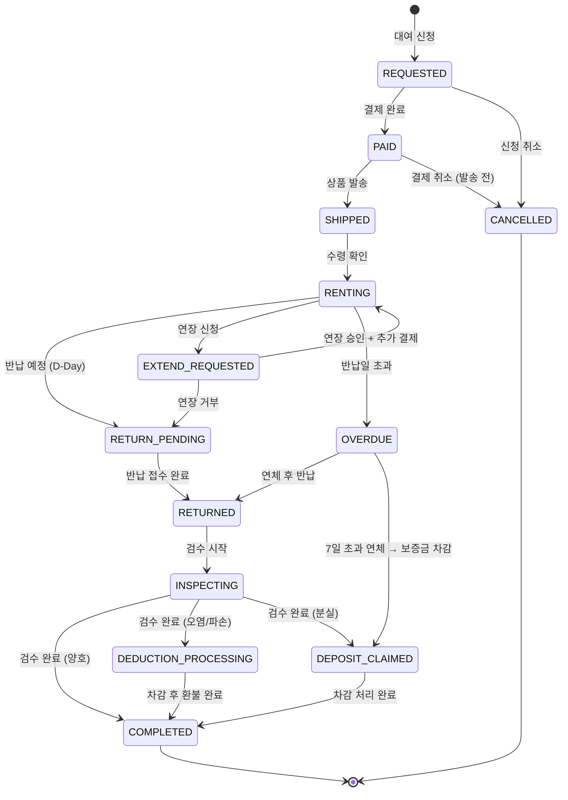
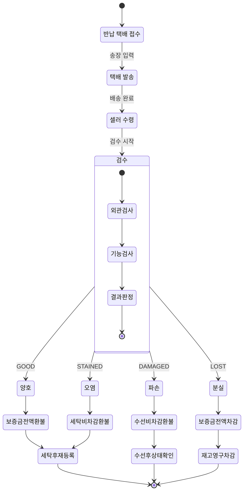

# 대여(Rental) 도메인 PRD

> 작성일: 2026-03-23
> 프로젝트: Closet E-commerce
> 도메인: 대여(Rental)
> 서비스: rental-service (:8099)
> 우선순위: High
> 상태: Draft

---

## 1. 비즈니스 배경

### 1.1 시장 트렌드

MZ세대를 중심으로 "소유보다 경험"이라는 소비 패러다임이 확산되고 있다. 특히 고가 의류(코트, 정장, 파티드레스, 브랜드백) 시장에서 구매 부담이 높아 대여 수요가 급증하고 있다.

국내외 주요 트렌드:
- **무신사 스탠다드 정장 대여**: 면접·결혼식용 정장을 3~7일 단위로 대여. 정가의 10~15% 수준으로 가격 경쟁력 확보.
- **29CM 파티복 렌탈**: 브랜드 파티드레스·원피스를 행사 단위로 대여. 20~30대 여성 고객 중심.
- **W컨셉 프리미엄 대여**: 디자이너 브랜드 의류를 구독 모델로 대여.
- **클로젯셰어**: 한국 명품 대여 선두. 명품백·코트 중심.
- **렌트더런웨이(Rent the Runway)**: 미국 의류 대여 선두. 구독 모델 + 단건 대여 병행. 2024년 매출 $320M.
- **프로젝트앤**: 명품백 대여. 월 구독 모델.

### 1.2 문제 정의

| 문제 | 현황 | 기회 |
|------|------|------|
| 고가 의류 구매 부담 | 30만원 이상 코트·정장은 구매 전환율 2% 미만 | 대여로 진입 장벽 낮춤 → 전환율 3배 향상 예상 |
| 1회성 착용 의류 | 결혼식·면접·파티복 구매 후 방치 비율 70% | 대여 모델로 자원 순환 + 고객 만족도 향상 |
| 의류 체험 기회 부족 | 고가 브랜드 온라인 구매 시 반품률 30% | 대여 후 구매(Rent-to-Own) 전환으로 반품률 감소 |
| 셀러 재고 부담 | 시즌 종료 후 재고 소진 어려움 | 대여로 재고 회전율 향상 + 추가 수익원 |

### 1.3 타겟 사용자

#### 1차 타겟: 이벤트성 대여 고객
- 연령: 25~35세
- 상황: 면접, 결혼식 참석, 파티, 졸업식
- 니즈: 1회 착용할 고가 의류를 합리적 가격에 대여
- 예상 평균 대여 기간: 3~7일

#### 2차 타겟: 패션 탐색형 고객
- 연령: 20~30세
- 상황: 고가 브랜드를 체험해보고 싶은 고객
- 니즈: 구매 전에 실제로 입어보고 판단
- 예상 평균 대여 기간: 7~14일

#### 3차 타겟: 시즌 대여 고객
- 연령: 전 연령
- 상황: 겨울 롱패딩, 여름 린넨 등 시즌 의류
- 니즈: 시즌에만 필요한 고가 아우터를 대여
- 예상 평균 대여 기간: 14~30일

### 1.4 수익 모델

| 항목 | 계산 방식 | 금액 예시 (30만원 코트 기준) |
|------|----------|--------------------------|
| 3일 대여료 | 정가 x 10% | 30,000원 |
| 7일 대여료 | 정가 x 15% | 45,000원 |
| 14일 대여료 | 정가 x 22% | 66,000원 |
| 30일 대여료 | 정가 x 30% | 90,000원 |
| 보증금 | 정가 x 50~100% | 150,000원 (50%) |
| 세탁비 | 고정 | 15,000원 |
| 연체료 (1일) | 대여료의 10%/일 | 4,500원 (7일 기준) |
| 파손 수선비 | 실비 | 10,000~50,000원 |

**수익 시뮬레이션 (월간)**:
- 대여 상품 수: 500개
- 평균 회전율: 3회/월
- 평균 대여료: 50,000원
- 월 대여 수익: 500 x 3 x 50,000 = **75,000,000원**
- 세탁비 수익: 500 x 3 x 15,000 = **22,500,000원**
- 연체료 수익 (10% 연체 가정): 약 **3,375,000원**
- **월 총 수익 예상: ~1억원**

### 1.5 경쟁사 벤치마크

| 경쟁사 | 대여 기간 | 보증금 | 대여료 | 특징 |
|--------|----------|--------|--------|------|
| 무신사 정장 대여 | 3~7일 | 정가 50% | 정가 10~15% | 면접·결혼식 특화 |
| 렌트더런웨이 | 4~8일 / 구독 | 없음 (보험료 포함) | $50~$300 | 구독 모델, 무료 배송 |
| 클로젯셰어 | 7~30일 | 정가 30~50% | 정가 15~25% | 명품 특화 |
| 프로젝트앤 | 월 구독 | 없음 | 월 99,000~199,000원 | 명품백 구독 |
| 29CM 렌탈 | 3~7일 | 정가 50% | 정가 12~18% | 파티복 특화 |

---

## 2. 핵심 기능 요구사항

### 2.1 서비스 구성

| 서비스 | 포트 | 기술 스택 | 역할 |
|--------|------|----------|------|
| rental-service | 8099 | Kotlin, Spring Boot 3.x, JPA, Redis | 대여 상품 관리, 대여 주문, 반납, 검수, 정산 연동 |

### 2.2 대여 상태 머신



### 2.3 대여 상태 전이 규칙

| 현재 상태 | 다음 상태 | 트리거 | 조건 |
|-----------|----------|--------|------|
| REQUESTED | PAID | 결제 완료 콜백 | PG 결제 성공 |
| REQUESTED | CANCELLED | 사용자 취소 | 결제 전 |
| PAID | SHIPPED | 셀러 발송 처리 | 송장번호 입력 |
| PAID | CANCELLED | 사용자/셀러 취소 | 발송 전 |
| SHIPPED | RENTING | 수령 확인 | 배송 완료 확인 |
| RENTING | RETURN_PENDING | 시스템 자동 | 반납일 당일 |
| RENTING | EXTEND_REQUESTED | 사용자 연장 신청 | 반납일 D-3 이전 |
| RENTING | OVERDUE | 시스템 자동 | 반납일 초과 |
| EXTEND_REQUESTED | RENTING | 셀러 승인 + 추가 결제 | 다음 예약 없음 |
| EXTEND_REQUESTED | RETURN_PENDING | 셀러 거부 | 다음 예약 있음 |
| RETURN_PENDING | RETURNED | 반납 접수 | 반납 물류 접수 |
| OVERDUE | RETURNED | 연체 후 반납 | 7일 이내 |
| OVERDUE | DEPOSIT_CLAIMED | 시스템 자동 | 7일 초과 |
| RETURNED | INSPECTING | 셀러 검수 시작 | 반납 물품 도착 |
| INSPECTING | COMPLETED | 셀러 검수 완료 | 양호 판정 |
| INSPECTING | DEDUCTION_PROCESSING | 셀러 검수 완료 | 오염/파손 판정 |
| INSPECTING | DEPOSIT_CLAIMED | 셀러 검수 완료 | 분실 판정 |
| DEDUCTION_PROCESSING | COMPLETED | 차감 처리 완료 | 환불 처리 완료 |
| DEPOSIT_CLAIMED | COMPLETED | 차감 처리 완료 | 보증금 전액 차감 |

---

## 3. 유저 스토리

### US-2301: 대여 상품 등록

**As a** 셀러
**I want to** 기존 상품을 대여 가능으로 설정할 수 있다
**So that** 구매 외에 대여로도 수익을 낼 수 있다

#### Acceptance Criteria
- [ ] 기존 상품에 대여 옵션을 추가할 수 있다 (대여료율, 대여 기간, 보증금율)
- [ ] 대여 가능 재고(rental stock)를 판매 재고와 별도로 관리한다
- [ ] 대여 기간은 3일, 7일, 14일, 30일 중 선택 가능하며, 기간별 대여율을 개별 설정한다
- [ ] 대여료 = 상품 정가 x 기간별 대여율 (소수점 이하 절사)
- [ ] 보증금 = 상품 정가 x 보증금율 (50~100% 범위)
- [ ] 대여 상품 상태는 ACTIVE / INACTIVE로 관리한다
- [ ] INACTIVE 상태의 대여 상품은 고객에게 노출되지 않는다
- [ ] 대여 옵션 등록 시 상품 옵션(사이즈) 단위로 설정한다
- [ ] 이미 대여 중인 상품 옵션의 대여 설정은 변경할 수 없다 (대여 완료 후 변경 가능)

#### 데이터 모델

```sql
-- 대여 상품 설정
CREATE TABLE rental_product (
    id                  BIGINT          NOT NULL AUTO_INCREMENT,
    product_id          BIGINT          NOT NULL COMMENT '상품 ID (product-service)',
    product_option_id   BIGINT          NOT NULL COMMENT '상품 옵션 ID (사이즈/색상)',
    rental_stock        INT             NOT NULL DEFAULT 0 COMMENT '대여 가능 재고',
    deposit_rate        DECIMAL(5,2)    NOT NULL COMMENT '보증금 비율 (0.50~1.00)',
    rate_3d             DECIMAL(5,2)    NOT NULL COMMENT '3일 대여율 (예: 0.10)',
    rate_7d             DECIMAL(5,2)    NOT NULL COMMENT '7일 대여율 (예: 0.15)',
    rate_14d            DECIMAL(5,2)    NOT NULL COMMENT '14일 대여율 (예: 0.22)',
    rate_30d            DECIMAL(5,2)    NOT NULL COMMENT '30일 대여율 (예: 0.30)',
    cleaning_fee        DECIMAL(15,2)   NOT NULL DEFAULT 0 COMMENT '세탁비',
    min_condition_grade VARCHAR(20)     NOT NULL DEFAULT 'GOOD' COMMENT '최소 상품 상태 등급',
    total_rental_count  INT             NOT NULL DEFAULT 0 COMMENT '누적 대여 횟수',
    status              VARCHAR(30)     NOT NULL DEFAULT 'ACTIVE' COMMENT 'ACTIVE / INACTIVE',
    created_at          DATETIME(6)     NOT NULL DEFAULT CURRENT_TIMESTAMP(6),
    updated_at          DATETIME(6)     NOT NULL DEFAULT CURRENT_TIMESTAMP(6) ON UPDATE CURRENT_TIMESTAMP(6),
    PRIMARY KEY (id),
    INDEX idx_product_id (product_id),
    INDEX idx_product_option_id (product_option_id),
    INDEX idx_status (status)
) ENGINE=InnoDB DEFAULT CHARSET=utf8mb4 COMMENT='대여 상품 설정';
```

#### API 스펙

```
POST /api/v1/rentals/products
Authorization: Bearer {token}
Content-Type: application/json

Request:
{
    "productId": 12345,
    "productOptionId": 67890,
    "rentalStock": 5,
    "depositRate": 0.50,
    "rate3d": 0.10,
    "rate7d": 0.15,
    "rate14d": 0.22,
    "rate30d": 0.30,
    "cleaningFee": 15000
}

Response: 201 Created
{
    "id": 1,
    "productId": 12345,
    "productOptionId": 67890,
    "rentalStock": 5,
    "depositRate": 0.50,
    "rate3d": 0.10,
    "rate7d": 0.15,
    "rate14d": 0.22,
    "rate30d": 0.30,
    "cleaningFee": 15000,
    "status": "ACTIVE",
    "createdAt": "2026-03-23T10:00:00.000000"
}
```

```
PUT /api/v1/rentals/products/{id}
Authorization: Bearer {token}
Content-Type: application/json

Request:
{
    "rentalStock": 8,
    "depositRate": 0.60,
    "rate3d": 0.12,
    "rate7d": 0.17,
    "rate14d": 0.24,
    "rate30d": 0.32,
    "cleaningFee": 18000,
    "status": "ACTIVE"
}

Response: 200 OK
```

---

### US-2302: 대여 신청

**As a** 구매자
**I want to** 상품을 대여 신청할 수 있다
**So that** 고가 의류를 합리적으로 입을 수 있다

#### Acceptance Criteria
- [ ] 대여 기간(3/7/14/30일)을 선택하여 대여 신청할 수 있다
- [ ] 대여료 + 보증금 + 세탁비를 합산하여 결제한다
- [ ] 대여 시작일은 상품 수령 예정일 기준이다
- [ ] 대여 종료일은 시작일 + 대여 기간으로 자동 계산된다
- [ ] 동일 상품에 대해 동시에 중복 대여 신청은 불가하다
- [ ] 대여 가능 재고가 0인 경우 대여 신청이 불가하다
- [ ] 대여 신청 시 대여 재고를 1 차감한다 (선점)
- [ ] 결제 실패 시 차감된 재고를 복원한다
- [ ] 대여 신청 상태: REQUESTED → 결제 진행

#### 데이터 모델

```sql
-- 대여 주문
CREATE TABLE rental_order (
    id                  BIGINT          NOT NULL AUTO_INCREMENT,
    order_number        VARCHAR(30)     NOT NULL COMMENT '대여 주문번호 (RNT-yyyyMMdd-XXXXX)',
    rental_product_id   BIGINT          NOT NULL COMMENT '대여 상품 ID',
    member_id           BIGINT          NOT NULL COMMENT '회원 ID',
    rental_period       INT             NOT NULL COMMENT '대여 기간 (일): 3, 7, 14, 30',
    rental_fee          DECIMAL(15,2)   NOT NULL COMMENT '대여료',
    deposit             DECIMAL(15,2)   NOT NULL COMMENT '보증금',
    cleaning_fee        DECIMAL(15,2)   NOT NULL DEFAULT 0 COMMENT '세탁비',
    total_amount        DECIMAL(15,2)   NOT NULL COMMENT '총 결제 금액 (대여료 + 보증금 + 세탁비)',
    status              VARCHAR(30)     NOT NULL DEFAULT 'REQUESTED' COMMENT '대여 상태',
    start_date          DATETIME(6)     NOT NULL COMMENT '대여 시작일',
    end_date            DATETIME(6)     NOT NULL COMMENT '대여 종료일',
    actual_return_date  DATETIME(6)     NULL COMMENT '실제 반납일',
    extended_days       INT             NOT NULL DEFAULT 0 COMMENT '연장 일수',
    overdue_days        INT             NOT NULL DEFAULT 0 COMMENT '연체 일수',
    overdue_fee         DECIMAL(15,2)   NOT NULL DEFAULT 0 COMMENT '연체료',
    inspection_result   VARCHAR(30)     NULL COMMENT '검수 결과 (GOOD/STAINED/DAMAGED/LOST)',
    inspection_note     VARCHAR(1000)   NULL COMMENT '검수 상세 메모',
    deduction_amount    DECIMAL(15,2)   NOT NULL DEFAULT 0 COMMENT '보증금 차감액',
    refund_amount       DECIMAL(15,2)   NULL COMMENT '보증금 환불액',
    cancel_reason       VARCHAR(500)    NULL COMMENT '취소 사유',
    cancelled_at        DATETIME(6)     NULL COMMENT '취소 일시',
    created_at          DATETIME(6)     NOT NULL DEFAULT CURRENT_TIMESTAMP(6),
    updated_at          DATETIME(6)     NOT NULL DEFAULT CURRENT_TIMESTAMP(6) ON UPDATE CURRENT_TIMESTAMP(6),
    PRIMARY KEY (id),
    UNIQUE KEY uk_order_number (order_number),
    INDEX idx_rental_product_id (rental_product_id),
    INDEX idx_member_id (member_id),
    INDEX idx_status (status),
    INDEX idx_end_date (end_date),
    INDEX idx_start_date_end_date (start_date, end_date)
) ENGINE=InnoDB DEFAULT CHARSET=utf8mb4 COMMENT='대여 주문';
```

#### API 스펙

```
POST /api/v1/rentals/orders
Authorization: Bearer {token}
Content-Type: application/json

Request:
{
    "rentalProductId": 1,
    "rentalPeriod": 7,
    "startDate": "2026-03-25T00:00:00"
}

Response: 201 Created
{
    "id": 1,
    "orderNumber": "RNT-20260323-00001",
    "rentalProductId": 1,
    "memberId": 100,
    "rentalPeriod": 7,
    "rentalFee": 45000,
    "deposit": 150000,
    "cleaningFee": 15000,
    "totalAmount": 210000,
    "status": "REQUESTED",
    "startDate": "2026-03-25T00:00:00.000000",
    "endDate": "2026-04-01T00:00:00.000000",
    "createdAt": "2026-03-23T10:30:00.000000"
}
```

```
GET /api/v1/rentals/orders/my?status=RENTING&page=0&size=20
Authorization: Bearer {token}

Response: 200 OK
{
    "content": [
        {
            "id": 1,
            "orderNumber": "RNT-20260323-00001",
            "productName": "더뮤지엄비지터 오버사이즈 울 코트",
            "productOptionName": "블랙 / L",
            "rentalPeriod": 7,
            "rentalFee": 45000,
            "deposit": 150000,
            "status": "RENTING",
            "startDate": "2026-03-25T00:00:00.000000",
            "endDate": "2026-04-01T00:00:00.000000",
            "remainingDays": 5
        }
    ],
    "totalElements": 1,
    "totalPages": 1
}
```

---

### US-2303: 대여 기간 관리

**As a** 시스템
**I want to** 대여 기간을 자동 관리한다
**So that** 연체 없이 원활한 대여 순환이 이루어진다

#### Acceptance Criteria
- [ ] 반납 D-3 알림을 구매자에게 발송한다 (푸시 + 이메일)
- [ ] 반납 D-1 알림을 구매자에게 발송한다 (푸시 + 이메일 + SMS)
- [ ] 반납일(D-Day) 자동으로 상태를 RENTING → RETURN_PENDING으로 변경한다
- [ ] 반납일 익일부터 연체 상태(OVERDUE)로 전환한다
- [ ] 연체 시 일 단위 연체료를 자동 계산한다 (대여료의 10%/일)
- [ ] 연체 7일 초과 시 보증금에서 자동 차감한다 (DEPOSIT_CLAIMED)
- [ ] 매일 00:05 스케줄러로 반납 예정/연체 상태를 일괄 처리한다

#### 스케줄러 설계

```
[RentalScheduler]
├── processReturnAlerts()        # 매일 08:00 — D-3, D-1 알림 발송
├── processReturnPending()       # 매일 00:05 — D-Day 상태 변경
├── processOverdue()             # 매일 00:10 — 연체 전환 + 연체료 계산
└── processDepositClaim()        # 매일 00:15 — 7일 초과 연체 보증금 차감
```

#### 알림 발송 규칙

| 시점 | 알림 채널 | 메시지 |
|------|----------|--------|
| D-3 | 푸시 + 이메일 | "[Closet] {상품명} 반납일이 3일 남았습니다. 반납 준비를 해주세요." |
| D-1 | 푸시 + 이메일 + SMS | "[Closet] {상품명} 내일이 반납일입니다. 반납 택배를 접수해주세요." |
| D-Day | 푸시 + 이메일 | "[Closet] {상품명} 오늘이 반납일입니다. 미반납 시 연체료가 부과됩니다." |
| D+1 (연체 시작) | 푸시 + 이메일 + SMS | "[Closet] {상품명} 반납일이 지났습니다. 일 {연체료}원의 연체료가 부과됩니다." |
| D+3 (연체 경고) | 푸시 + 이메일 + SMS | "[Closet] {상품명} 연체 3일차입니다. 7일 초과 시 보증금에서 차감됩니다." |
| D+7 (보증금 차감) | 푸시 + 이메일 + SMS | "[Closet] {상품명} 연체 7일 초과로 보증금에서 차감 처리됩니다." |

---

### US-2304: 반납 처리

**As a** 셀러
**I want to** 반납된 상품을 검수할 수 있다
**So that** 상태에 따라 보증금 처리를 한다

#### Acceptance Criteria
- [ ] 구매자가 반납 접수를 하면 반납 택배 송장을 입력한다
- [ ] 셀러가 반납 물품 수령 후 검수를 시작한다 (RETURNED → INSPECTING)
- [ ] 검수 결과를 4단계로 입력한다: 양호(GOOD), 오염(STAINED), 파손(DAMAGED), 분실(LOST)
- [ ] **양호(GOOD)**: 보증금 전액 환불 → 세탁 후 대여 재고 복원
- [ ] **오염(STAINED)**: 세탁비 차감 후 보증금 환불 → 세탁 후 대여 재고 복원
- [ ] **파손(DAMAGED)**: 수선비 차감 후 보증금 환불 → 수선 후 상태 확인
- [ ] **분실(LOST)**: 보증금 전액 차감 + 부족 시 추가 청구 → 대여 재고 영구 차감
- [ ] 검수 완료 시 보증금 환불/차감 금액을 자동 계산한다
- [ ] 검수 상세 메모를 기록할 수 있다 (사진 포함 예정)

#### 보증금 처리 로직

```
보증금 환불액 = 보증금 - 차감액(세탁비/수선비/전액)

양호:   환불액 = 보증금 - 0
오염:   환불액 = 보증금 - 세탁비
파손:   환불액 = 보증금 - 수선비(실비)
분실:   환불액 = 0 (보증금 전액 차감)
        추가 청구 = max(0, 상품 정가 - 보증금)
```

#### API 스펙

```
POST /api/v1/rentals/orders/{id}/return
Authorization: Bearer {token}
Content-Type: application/json

Request:
{
    "carrier": "CJ_LOGISTICS",
    "trackingNumber": "1234567890123"
}

Response: 200 OK
{
    "id": 1,
    "orderNumber": "RNT-20260323-00001",
    "status": "RETURNED",
    "actualReturnDate": "2026-03-31T14:00:00.000000"
}
```

```
PATCH /api/v1/rentals/orders/{id}/inspect
Authorization: Bearer {token}
Content-Type: application/json

Request:
{
    "inspectionResult": "STAINED",
    "inspectionNote": "우측 소매 부분 커피 얼룩. 드라이클리닝 필요.",
    "deductionAmount": 15000
}

Response: 200 OK
{
    "id": 1,
    "orderNumber": "RNT-20260323-00001",
    "status": "DEDUCTION_PROCESSING",
    "inspectionResult": "STAINED",
    "inspectionNote": "우측 소매 부분 커피 얼룩. 드라이클리닝 필요.",
    "deposit": 150000,
    "deductionAmount": 15000,
    "refundAmount": 135000
}
```

---

### US-2305: 대여 연장

**As a** 구매자
**I want to** 대여 기간을 연장할 수 있다
**So that** 더 오래 입고 싶을 때 반납 없이 연장할 수 있다

#### Acceptance Criteria
- [ ] 반납일 D-3 이전에만 연장 신청이 가능하다
- [ ] 연장 기간: 3일, 7일, 14일 중 선택 가능하다
- [ ] 연장 시 추가 대여료를 결제한다 (해당 기간 대여율 적용)
- [ ] 다른 예약자가 있는 경우 연장이 불가하다
- [ ] 최대 연장 횟수: 2회 (총 대여 기간 60일 초과 불가)
- [ ] 연장 승인 시 종료일이 자동 갱신된다
- [ ] 연장 이력을 별도 테이블에 기록한다

#### 데이터 모델

```sql
-- 대여 연장 이력
CREATE TABLE rental_extension (
    id                  BIGINT          NOT NULL AUTO_INCREMENT,
    rental_order_id     BIGINT          NOT NULL COMMENT '대여 주문 ID',
    extension_period    INT             NOT NULL COMMENT '연장 기간 (일)',
    extension_fee       DECIMAL(15,2)   NOT NULL COMMENT '추가 대여료',
    original_end_date   DATETIME(6)     NOT NULL COMMENT '기존 종료일',
    new_end_date        DATETIME(6)     NOT NULL COMMENT '새 종료일',
    payment_id          BIGINT          NULL COMMENT '추가 결제 ID',
    status              VARCHAR(30)     NOT NULL DEFAULT 'REQUESTED' COMMENT 'REQUESTED/APPROVED/REJECTED',
    reject_reason       VARCHAR(500)    NULL COMMENT '거부 사유',
    created_at          DATETIME(6)     NOT NULL DEFAULT CURRENT_TIMESTAMP(6),
    updated_at          DATETIME(6)     NOT NULL DEFAULT CURRENT_TIMESTAMP(6) ON UPDATE CURRENT_TIMESTAMP(6),
    PRIMARY KEY (id),
    INDEX idx_rental_order_id (rental_order_id)
) ENGINE=InnoDB DEFAULT CHARSET=utf8mb4 COMMENT='대여 연장 이력';
```

#### API 스펙

```
POST /api/v1/rentals/orders/{id}/extend
Authorization: Bearer {token}
Content-Type: application/json

Request:
{
    "extensionPeriod": 7
}

Response: 200 OK
{
    "id": 1,
    "rentalOrderId": 1,
    "extensionPeriod": 7,
    "extensionFee": 45000,
    "originalEndDate": "2026-04-01T00:00:00.000000",
    "newEndDate": "2026-04-08T00:00:00.000000",
    "status": "REQUESTED"
}
```

---

### US-2306: 대여 이력 + 리뷰

**As a** 구매자
**I want to** 대여 이력을 보고 리뷰를 남길 수 있다
**So that** 다음 대여자가 참고할 수 있다

#### Acceptance Criteria
- [ ] 내 대여 이력을 조회할 수 있다 (진행 중 + 완료)
- [ ] 대여 완료(COMPLETED) 건에 대해 리뷰를 작성할 수 있다
- [ ] 리뷰 항목: 별점(1~5), 핏(오버핏/레귤러/슬림), 실제 착용 느낌(텍스트)
- [ ] 대여 리뷰는 일반 구매 리뷰와 "대여 리뷰" 태그로 구분된다
- [ ] 셀러별 대여 평점을 집계한다
- [ ] 리뷰 작성 시 포인트 적립 (500P)

#### 데이터 모델

```sql
-- 대여 리뷰
CREATE TABLE rental_review (
    id                  BIGINT          NOT NULL AUTO_INCREMENT,
    rental_order_id     BIGINT          NOT NULL COMMENT '대여 주문 ID',
    member_id           BIGINT          NOT NULL COMMENT '회원 ID',
    rental_product_id   BIGINT          NOT NULL COMMENT '대여 상품 ID',
    rating              TINYINT         NOT NULL COMMENT '별점 (1~5)',
    fit_type            VARCHAR(20)     NOT NULL COMMENT '핏 (OVERSIZED/REGULAR/SLIM)',
    content             VARCHAR(2000)   NOT NULL COMMENT '리뷰 내용',
    rental_period       INT             NOT NULL COMMENT '대여 기간 (참고용)',
    is_deleted          TINYINT(1)      NOT NULL DEFAULT 0 COMMENT '삭제 여부',
    created_at          DATETIME(6)     NOT NULL DEFAULT CURRENT_TIMESTAMP(6),
    updated_at          DATETIME(6)     NOT NULL DEFAULT CURRENT_TIMESTAMP(6) ON UPDATE CURRENT_TIMESTAMP(6),
    PRIMARY KEY (id),
    UNIQUE KEY uk_rental_order_id (rental_order_id),
    INDEX idx_rental_product_id (rental_product_id),
    INDEX idx_member_id (member_id)
) ENGINE=InnoDB DEFAULT CHARSET=utf8mb4 COMMENT='대여 리뷰';
```

#### API 스펙

```
POST /api/v1/rentals/reviews
Authorization: Bearer {token}
Content-Type: application/json

Request:
{
    "rentalOrderId": 1,
    "rating": 5,
    "fitType": "REGULAR",
    "content": "면접용으로 7일 대여했는데 핏이 정말 좋았습니다. 울 소재 코트라 고급스럽고, 세탁 상태도 깨끗했어요. 대여 추천합니다!"
}

Response: 201 Created
{
    "id": 1,
    "rentalOrderId": 1,
    "rating": 5,
    "fitType": "REGULAR",
    "content": "면접용으로 7일 대여했는데 핏이 정말 좋았습니다...",
    "rentalPeriod": 7,
    "pointEarned": 500,
    "createdAt": "2026-04-02T10:00:00.000000"
}
```

```
GET /api/v1/rentals/reviews?rentalProductId=1&page=0&size=20
Authorization: Bearer {token}

Response: 200 OK
{
    "content": [
        {
            "id": 1,
            "memberNickname": "패션러버",
            "rating": 5,
            "fitType": "REGULAR",
            "content": "면접용으로 7일 대여했는데 핏이 정말 좋았습니다...",
            "rentalPeriod": 7,
            "createdAt": "2026-04-02T10:00:00.000000"
        }
    ],
    "averageRating": 4.5,
    "fitDistribution": {
        "OVERSIZED": 20,
        "REGULAR": 60,
        "SLIM": 20
    },
    "totalElements": 15,
    "totalPages": 1
}
```

---

## 4. 상태 이력 관리

### 데이터 모델

```sql
-- 대여 상태 이력
CREATE TABLE rental_status_history (
    id                  BIGINT          NOT NULL AUTO_INCREMENT,
    rental_order_id     BIGINT          NOT NULL COMMENT '대여 주문 ID',
    from_status         VARCHAR(30)     NOT NULL COMMENT '이전 상태',
    to_status           VARCHAR(30)     NOT NULL COMMENT '다음 상태',
    reason              VARCHAR(500)    NULL COMMENT '변경 사유',
    actor_type          VARCHAR(20)     NOT NULL COMMENT '변경 주체 (SYSTEM/MEMBER/SELLER)',
    actor_id            BIGINT          NULL COMMENT '변경 주체 ID',
    created_at          DATETIME(6)     NOT NULL DEFAULT CURRENT_TIMESTAMP(6),
    PRIMARY KEY (id),
    INDEX idx_rental_order_id (rental_order_id),
    INDEX idx_created_at (created_at)
) ENGINE=InnoDB DEFAULT CHARSET=utf8mb4 COMMENT='대여 상태 이력';
```

모든 상태 전이 시 이력을 기록하여 추적 가능성(traceability)을 확보한다. 분쟁 발생 시 상태 이력을 기반으로 타임라인을 재구성할 수 있다.

---

## 5. 대여 반납 물류 흐름



---

## 6. 이벤트 설계 (Kafka)

대여 서비스는 이벤트 기반으로 타 서비스와 연동한다. 모든 이벤트는 Kafka를 통해 비동기로 발행/소비한다.

### 6.1 발행 이벤트

| 이벤트 | 토픽 | 발행 시점 | 소비자 |
|--------|------|----------|--------|
| RentalOrderCreated | rental.order.created | 대여 결제 완료 | inventory-service (대여 재고 차감) |
| RentalShipped | rental.order.shipped | 발송 처리 | notification-service (발송 알림) |
| RentalStarted | rental.order.started | 수령 확인 | notification-service (대여 시작 알림) |
| RentalReturnAlert | rental.return.alert | D-3, D-1 알림 | notification-service (반납 알림) |
| RentalReturned | rental.order.returned | 반납 접수 | inventory-service (대여 재고 복원 대기) |
| RentalOverdue | rental.order.overdue | 연체 전환 | notification-service (연체 알림) |
| RentalInspected | rental.order.inspected | 검수 완료 | inventory-service (재고 복원/차감), settlement-service (정산) |
| RentalCompleted | rental.order.completed | 대여 완료 | settlement-service (최종 정산), member-service (포인트 적립) |
| RentalCancelled | rental.order.cancelled | 취소 처리 | inventory-service (재고 복원), payment-service (환불) |
| RentalExtended | rental.order.extended | 연장 승인 | notification-service (연장 알림) |

### 6.2 소비 이벤트

| 이벤트 | 토픽 | 발행자 | 처리 |
|--------|------|--------|------|
| PaymentCompleted | payment.completed | payment-service | 대여 상태 REQUESTED → PAID |
| PaymentFailed | payment.failed | payment-service | 대여 상태 REQUESTED → CANCELLED, 재고 복원 |
| ShippingDelivered | shipping.delivered | shipping-service | 대여 상태 SHIPPED → RENTING |

### 6.3 이벤트 페이로드 예시

```json
// RentalOrderCreated
{
    "eventId": "evt-20260323-00001",
    "eventType": "RentalOrderCreated",
    "timestamp": "2026-03-23T10:30:00.000000",
    "payload": {
        "rentalOrderId": 1,
        "orderNumber": "RNT-20260323-00001",
        "rentalProductId": 1,
        "productId": 12345,
        "productOptionId": 67890,
        "memberId": 100,
        "rentalPeriod": 7,
        "rentalFee": 45000,
        "deposit": 150000,
        "totalAmount": 210000
    }
}
```

```json
// RentalOverdue
{
    "eventId": "evt-20260401-00042",
    "eventType": "RentalOverdue",
    "timestamp": "2026-04-02T00:10:00.000000",
    "payload": {
        "rentalOrderId": 1,
        "orderNumber": "RNT-20260323-00001",
        "memberId": 100,
        "overdueDays": 1,
        "dailyOverdueFee": 4500,
        "accumulatedOverdueFee": 4500,
        "deposit": 150000
    }
}
```

---

## 7. 연관 서비스 영향 분석

| 서비스 | 영향 | 변경 내용 |
|--------|------|----------|
| **product-service** | 중간 | 상품 상세에 "대여 가능" 뱃지 표시를 위한 API 확장 |
| **inventory-service** | 높음 | 대여 재고(rental_stock) 관리 로직 추가. 판매 재고와 분리 관리 |
| **payment-service** | 높음 | 대여료+보증금 분리 결제, 보증금 환불/차감 처리 |
| **shipping-service** | 중간 | 반납 택배 흐름 추가 (역방향 물류) |
| **settlement-service** | 높음 | 대여 정산 로직 추가 (대여료 수수료, 세탁비 정산) |
| **notification-service** | 낮음 | 대여 관련 알림 템플릿 추가 |
| **member-service** | 낮음 | 대여 완료 시 포인트 적립 이벤트 소비 |
| **review-service** | 낮음 | 대여 리뷰 태그 구분 (rental-service 자체 처리도 가능) |
| **search-service** | 중간 | 대여 가능 상품 필터 추가 |
| **display-service** | 낮음 | 대여 상품 전시 영역 추가 |

---

## 8. API 스펙 종합

### 8.1 대여 상품 API

| Method | Path | 설명 | 권한 |
|--------|------|------|------|
| POST | /api/v1/rentals/products | 대여 상품 등록 | SELLER |
| PUT | /api/v1/rentals/products/{id} | 대여 상품 수정 | SELLER |
| DELETE | /api/v1/rentals/products/{id} | 대여 상품 비활성화 | SELLER |
| GET | /api/v1/rentals/products | 대여 가능 상품 목록 | ALL |
| GET | /api/v1/rentals/products/{id} | 대여 상품 상세 (대여료 계산) | ALL |
| GET | /api/v1/rentals/products/{id}/availability | 대여 가능 일자 조회 | ALL |

### 8.2 대여 주문 API

| Method | Path | 설명 | 권한 |
|--------|------|------|------|
| POST | /api/v1/rentals/orders | 대여 신청 | MEMBER |
| GET | /api/v1/rentals/orders/my | 내 대여 내역 | MEMBER |
| GET | /api/v1/rentals/orders/{id} | 대여 상세 | MEMBER/SELLER |
| POST | /api/v1/rentals/orders/{id}/cancel | 대여 취소 | MEMBER |
| POST | /api/v1/rentals/orders/{id}/extend | 대여 연장 | MEMBER |
| POST | /api/v1/rentals/orders/{id}/return | 반납 접수 | MEMBER |
| PATCH | /api/v1/rentals/orders/{id}/inspect | 검수 결과 입력 | SELLER |
| POST | /api/v1/rentals/orders/{id}/ship | 발송 처리 | SELLER |
| GET | /api/v1/rentals/orders/seller | 셀러 대여 관리 목록 | SELLER |

### 8.3 대여 리뷰 API

| Method | Path | 설명 | 권한 |
|--------|------|------|------|
| POST | /api/v1/rentals/reviews | 대여 리뷰 작성 | MEMBER |
| GET | /api/v1/rentals/reviews | 대여 리뷰 목록 | ALL |
| GET | /api/v1/rentals/reviews/{id} | 대여 리뷰 상세 | ALL |
| DELETE | /api/v1/rentals/reviews/{id} | 대여 리뷰 삭제 | MEMBER |

---

## 9. 비기능 요구사항

### 9.1 성능 요구사항

| 항목 | 목표 |
|------|------|
| 대여 신청 API 응답 시간 | p95 < 500ms |
| 대여 상품 목록 조회 | p95 < 200ms |
| 대여 상태 변경 | p95 < 300ms |
| 스케줄러 일괄 처리 | 10,000건 / 5분 이내 |

### 9.2 가용성

- 대여 신청/결제 흐름: 99.9% 가용성
- 스케줄러: 단일 실행 보장 (Redis 분산 락)
- 이벤트 발행: at-least-once 보장 (Outbox 패턴)

### 9.3 데이터 정합성

- 대여 재고 차감: 비관적 락(SELECT FOR UPDATE) 사용
- 보증금 환불: 멱등성 보장 (idempotency key)
- 상태 전이: 이전 상태 검증 + 이력 기록

### 9.4 보안

- 보증금/결제 관련 API: 본인 확인 필수
- 셀러 API: 셀러 인증 + 상품 소유권 검증
- 개인정보: 대여 이력은 본인만 조회 가능

---

## 10. 마일스톤

### Phase A: 기본 대여 흐름 (3주)
- Sprint 1: 대여 상품 등록/조회, 대여 신청/결제 연동
- Sprint 2: 발송/수령, 반납 접수, 기본 검수 흐름

### Phase B: 자동화 + 연장 (2주)
- Sprint 3: 스케줄러 (반납 알림, 연체 처리), 대여 연장

### Phase C: 리뷰 + 정산 (2주)
- Sprint 4: 대여 리뷰, 정산 서비스 연동, 대시보드

### Phase D: 고도화 (2주)
- Sprint 5: Rent-to-Own (대여 후 구매 전환), 대여 추천 알고리즘, 구독 모델 검토

---

## 11. KPI 및 성공 지표

| KPI | 목표 | 측정 방법 |
|-----|------|----------|
| 대여 전환율 (상품 조회 → 대여) | 3% | 대여 신청 수 / 대여 상품 상세 조회 수 |
| 반납 준수율 (기한 내 반납) | 90% | 기한 내 반납 수 / 전체 대여 완료 수 |
| 대여 리뷰 작성률 | 30% | 리뷰 작성 수 / 대여 완료 수 |
| 평균 대여 기간 | 7일 | 전체 대여 기간 합 / 대여 건수 |
| 대여 재이용률 (30일 내 재대여) | 20% | 30일 내 재대여 회원 수 / 대여 완료 회원 수 |
| 대여 NPS | 40+ | 분기별 설문 |
| 보증금 분쟁률 | 2% 미만 | 보증금 이의 건 / 전체 검수 건 |
| 대여 상품 회전율 | 3회/월 | 월 대여 건수 / 대여 가능 상품 수 |
| Rent-to-Own 전환율 | 5% (Phase D) | 대여 후 구매 건 / 대여 완료 건 |

---

## 12. 리스크 및 대응 방안

| 리스크 | 영향도 | 대응 방안 |
|--------|--------|----------|
| 보증금 분쟁 (검수 결과 이의) | 높음 | 검수 사진 필수 촬영, 발송 전 상태 사진 기록, CS 프로세스 정의 |
| 연체 장기화 (반납 거부) | 높음 | D+7 보증금 자동 차감, D+14 법적 안내문 발송, 블랙리스트 |
| 위생 문제 (세탁 품질) | 중간 | 제휴 세탁소 지정, 세탁 인증서 발급, 세탁 전/후 사진 기록 |
| 대여 재고 부족 (인기 상품) | 중간 | 대여 예약 시스템(예약 대기), 셀러 대여 재고 확대 인센티브 |
| 시즌 편중 (결혼식 시즌 등) | 낮음 | 비수기 할인 프로모션, 시즌별 추천 알고리즘 |
| 사이즈 불만 (핏 차이) | 중간 | 대여 리뷰 핏 정보 강화, AI 사이즈 추천 연동 |

---

## 13. Feature Flag

대여 도메인은 Feature Flag를 통해 점진적으로 출시한다.

| Flag Key | 설명 | 기본값 |
|----------|------|--------|
| RENTAL_ENABLED | 대여 기능 전체 활성화 | false |
| RENTAL_EXTENSION_ENABLED | 대여 연장 기능 | false |
| RENTAL_REVIEW_ENABLED | 대여 리뷰 기능 | false |
| RENTAL_OVERDUE_AUTO_CLAIM | 연체 자동 보증금 차감 | false |
| RENTAL_RENT_TO_OWN | Rent-to-Own 기능 | false |

```kotlin
enum class RentalFeatureKey(override val key: String, override val defaultValue: Boolean) : BooleanFeatureKey {
    RENTAL_ENABLED("rental.enabled", false),
    RENTAL_EXTENSION_ENABLED("rental.extension.enabled", false),
    RENTAL_REVIEW_ENABLED("rental.review.enabled", false),
    RENTAL_OVERDUE_AUTO_CLAIM("rental.overdue.auto-claim", false),
    RENTAL_RENT_TO_OWN("rental.rent-to-own", false),
}
```

---

## 14. 미래 확장 계획

### 14.1 Rent-to-Own (대여 후 구매)
대여 기간 중 또는 대여 완료 후 해당 상품을 구매로 전환할 수 있다. 이미 납부한 대여료의 일부를 구매가에서 차감한다.

### 14.2 대여 구독 모델
월 정액제로 N벌의 의류를 교체하며 입을 수 있는 구독 모델. 렌트더런웨이의 구독 모델을 벤치마크한다.

### 14.3 AI 사이즈 추천
대여 리뷰의 핏 데이터를 학습하여 사용자 체형에 맞는 사이즈를 추천한다.

### 14.4 대여 보험
보증금 대신 대여 보험 상품을 도입하여 진입 장벽을 더 낮춘다. 보험사 제휴 필요.

### 14.5 기업 대여 (B2B)
기업 단체 정장 대여(면접, 행사) 서비스. 대량 할인 + 기업 정산.

---

## 15. 부록

### 15.1 대여 상품 카테고리 우선순위

| 우선순위 | 카테고리 | 평균 단가 | 대여 수요 |
|----------|----------|----------|----------|
| 1 | 코트/아우터 | 300,000~800,000원 | 높음 (겨울 시즌) |
| 2 | 정장/수트 | 200,000~500,000원 | 높음 (면접/결혼식) |
| 3 | 파티드레스/원피스 | 150,000~400,000원 | 중간 (행사) |
| 4 | 브랜드백 | 500,000~3,000,000원 | 높음 (명품) |
| 5 | 스니커즈/슈즈 | 200,000~500,000원 | 중간 (한정판) |

### 15.2 용어 정의

| 용어 | 정의 |
|------|------|
| 대여료 (Rental Fee) | 대여 기간에 대한 이용 요금 |
| 보증금 (Deposit) | 분실/파손 대비 선납 금액. 반납 후 환불 |
| 세탁비 (Cleaning Fee) | 반납 후 세탁 비용 (선불) |
| 연체료 (Overdue Fee) | 반납일 초과 시 일 단위 추가 요금 |
| 검수 (Inspection) | 반납 상품의 상태를 확인하는 과정 |
| 대여율 (Rental Rate) | 기간별 대여료를 산정하기 위한 비율 (정가 대비) |
| Rent-to-Own | 대여 후 구매 전환 |
| 대여 재고 (Rental Stock) | 대여 전용으로 배정된 재고. 판매 재고와 분리 |

### 15.3 참고 자료

- 렌트더런웨이 S-1 Filing (SEC, 2021): 의류 대여 비즈니스 모델 분석
- 무신사 2025 패션 트렌드 리포트: 대여/구독 소비 트렌드
- 한국소비자원 의류 렌탈 실태 조사 (2025): 분쟁 유형 및 소비자 보호 가이드라인
