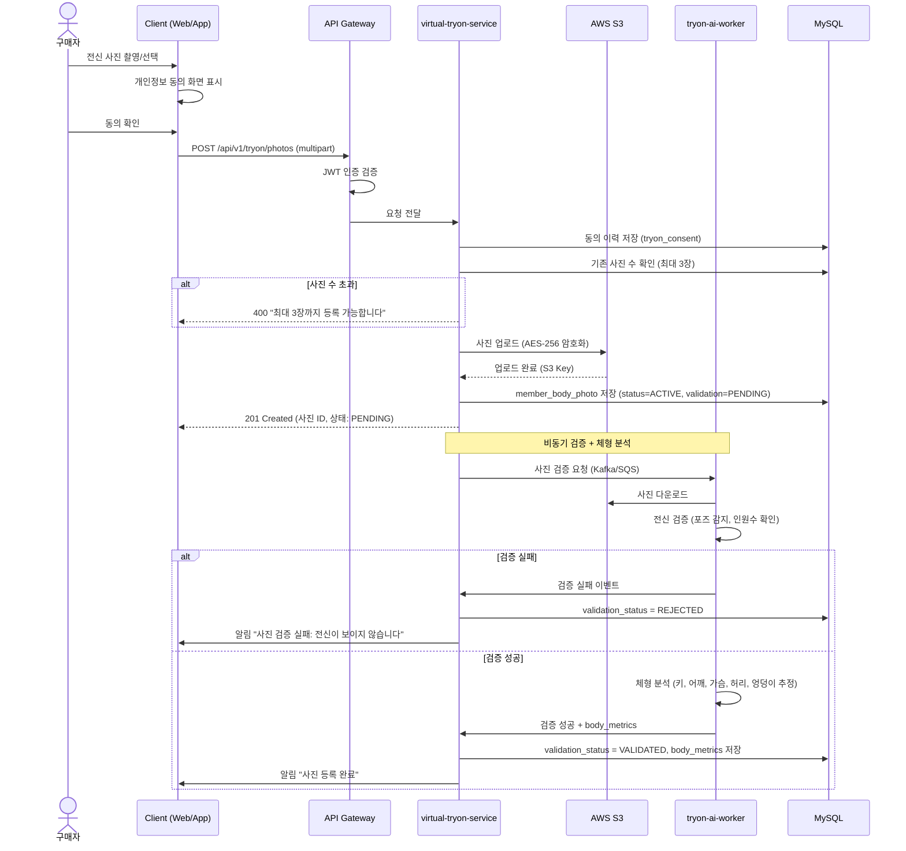
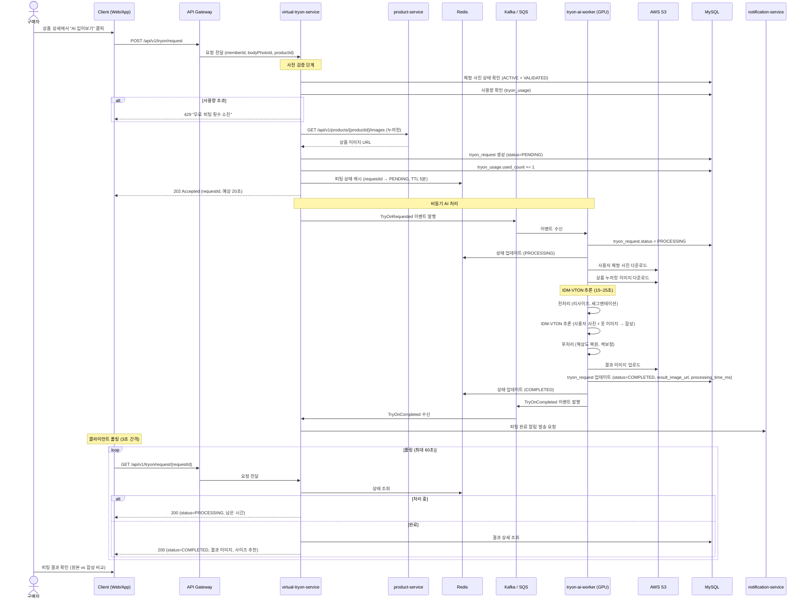
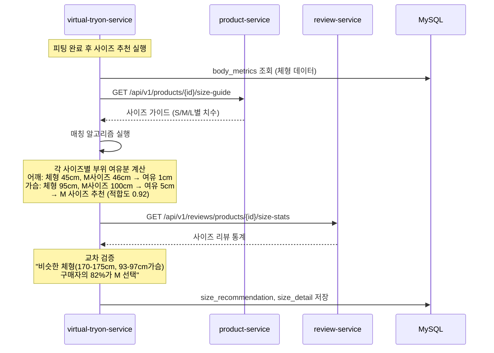
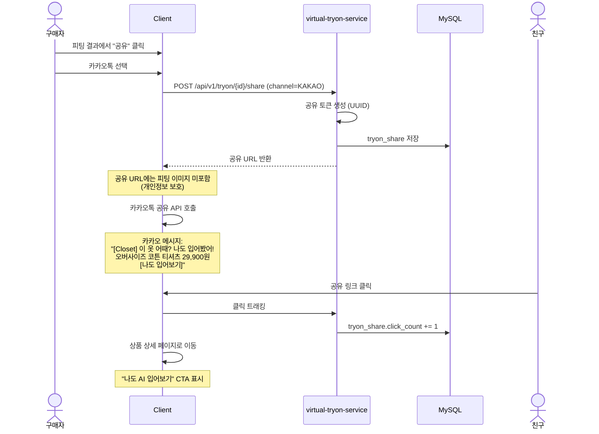

# Virtual Try-On (가상 피팅) PRD

> 작성일: 2026-03-23
> 프로젝트: Closet E-commerce
> 도메인: AI 가상 피팅 (Virtual Try-On)
> 작성자: PM/PO
> 상태: Draft
> 버전: v1.0

---

## 목차

1. [비즈니스 배경 및 문제 정의](#1-비즈니스-배경-및-문제-정의)
2. [시장 분석 및 벤치마크](#2-시장-분석-및-벤치마크)
3. [기술 후보군 비교](#3-기술-후보군-비교)
4. [제품 비전 및 목표](#4-제품-비전-및-목표)
5. [서비스 구성](#5-서비스-구성)
6. [사용자 스토리 및 Acceptance Criteria](#6-사용자-스토리-및-acceptance-criteria)
7. [데이터 모델](#7-데이터-모델)
8. [API 스펙](#8-api-스펙)
9. [아키텍처](#9-아키텍처)
10. [시퀀스 다이어그램](#10-시퀀스-다이어그램)
11. [이벤트 설계](#11-이벤트-설계)
12. [Feature Flag 전략](#12-feature-flag-전략)
13. [개인정보 보호 및 보안](#13-개인정보-보호-및-보안)
14. [수익 모델](#14-수익-모델)
15. [KPI 및 성과 지표](#15-kpi-및-성과-지표)
16. [릴리스 계획](#16-릴리스-계획)
17. [리스크 및 완화 방안](#17-리스크-및-완화-방안)
18. [향후 확장 로드맵](#18-향후-확장-로드맵)

---

## 1. 비즈니스 배경 및 문제 정의

### 1.1 핵심 문제

온라인 의류 구매에서 소비자의 최대 페인포인트는 **"입어보지 못한다"** 는 점이다.
통계적으로 온라인 의류 반품률은 평균 30%를 상회하며, 반품 사유의 70% 이상이 사이즈/핏 불일치이다.

| 문제 | 현황 | 영향 |
|------|------|------|
| 사이즈 불일치 | 반품 사유 1위 (약 52%) | 물류비 증가, CS 부담 |
| 핏/실루엣 불확실 | "내가 입으면 어떨까" 확인 불가 | 구매 전환 저하 |
| 색상/소재 차이 | 모니터 색상 ≠ 실물 | 만족도 저하 |
| 코디 고민 | 기존 옷과 조합 확인 불가 | 구매 결정 지연 |
| 반품 물류 비용 | 건당 3,000~5,000원 | 셀러/플랫폼 수익 감소 |

### 1.2 기존 해결 시도와 한계

| 방식 | 설명 | 한계 |
|------|------|------|
| 사이즈 표 제공 | 어깨, 가슴, 총장 등 수치 | 수치 해석이 어려움, 브랜드마다 편차 |
| 사이즈 후기 | "170cm 55kg M 착용" | 체형이 달라 참고만 가능 |
| 모델 착용컷 | 여러 체형 모델 사진 | 모델 체형 ≠ 내 체형 |
| 사이즈 추천 AI | 과거 구매 기반 추천 | 시각적 확인 불가 |
| AR 가상 피팅 | 실시간 카메라 오버레이 | 기술 성숙도 낮음, UX 떨어짐 |

### 1.3 왜 지금인가?

2024~2026년 사이에 AI 기반 가상 피팅 기술이 급속도로 성숙했다.

- **IDM-VTON** (2024): 의류 가상 착용에 특화된 Diffusion 모델. 기존 대비 품질 혁신
- **OOTDiffusion** (2024): 옷의 디테일(주름, 패턴, 질감)을 정확히 보존하는 모델
- **Kolors Virtual Try-On** (2025): 다양한 체형/포즈 지원, 상용화 수준 품질
- **GPU 비용 하락**: AWS g4dn 인스턴스 비용이 2년 전 대비 40% 절감
- **경쟁사 도입**: ASOS, Zara, Amazon 등 글로벌 브랜드가 가상 피팅 기능 런칭

### 1.4 기대 효과

| 효과 | 목표 | 산정 근거 |
|------|------|----------|
| 반품률 감소 | -30% (절대값 약 9%p) | ASOS 사례: 피팅 사용자 반품률 26% 감소 |
| 구매 전환율 향상 | +100% (2배) | 피팅 사용자 vs 미사용자 전환율 비교 |
| 체류 시간 증가 | +40% | 피팅 인터랙션에 의한 체류 시간 증가 |
| 재방문율 향상 | +25% | 피팅 갤러리 → 재방문 유도 |
| 반품 물류비 절감 | 월 약 500만원 (규모 의존) | 월 주문 5만건, 반품률 9%p 감소 기준 |
| 브랜드 차별화 | 국내 패션 이커머스 최초 | 경쟁 우위 확보 |

---

## 2. 시장 분석 및 벤치마크

### 2.1 글로벌 벤치마크

| 서비스 | 기술 | 특징 | 결과 |
|--------|------|------|------|
| **ASOS "See My Fit"** | 2D AI 합성 | 16개 모델 체형에 옷을 합성하여 표시 | 반품률 26% 감소 |
| **Zara AR** | AR 카메라 (매장) | 매장 내 AR 미러, 포즈 인식 | 매장 체험 강화 |
| **Amazon "Virtual Try-On"** | 2D AI (신발) | 발 사진으로 신발 피팅 | 신발 카테고리 전환율 +35% |
| **Google Shopping** | AI 합성 | 다양한 체형/피부색 모델에 옷 합성 | 검색 → 클릭 전환율 +60% |
| **Kering (구찌)** | 3D AR | 신발/액세서리 AR 착용 | 프리미엄 UX |
| **Walmart** | 2D AI 합성 | 자체 사진 업로드 → 옷 합성 | 테스트 중 |
| **Zalando** | AI 기반 사이즈 추천 + 2D 합성 | 체형 분석 기반 추천 연동 | 반품률 개선 |

### 2.2 국내 시장

| 서비스 | 현황 |
|--------|------|
| **무신사** | 사이즈 후기 + AI 사이즈 추천. 가상 피팅 미도입 |
| **지그재그** | 사이즈 추천 AI. 가상 피팅 미도입 |
| **W컨셉** | 사이즈 가이드만 제공 |
| **에이블리** | 리뷰 기반 사이즈 정보. 가상 피팅 미도입 |
| **29CM** | 에디토리얼 콘텐츠 중심. 피팅 기능 없음 |

**결론**: 국내 패션 이커머스에서 AI 가상 피팅을 도입한 사례가 없다.
Closet이 선점할 경우 강력한 차별화 포인트가 된다.

### 2.3 기술 생태계

```
2023         2024         2025         2026
  │            │            │            │
  │ TryOnGAN   │ IDM-VTON   │ Kolors VT  │ Closet
  │ (논문급)   │ (오픈소스)  │ (상용급)   │ (도입)
  │            │            │            │
  │            │ OOTDiffusion│            │
  │            │ (오픈소스)  │            │
  │            │            │            │
  ▼────────────▼────────────▼────────────▼
     학술 연구      오픈소스 성숙     상용화 단계
```

---

## 3. 기술 후보군 비교

### 3.1 후보군

#### 후보 A: 2D AI 합성 (IDM-VTON 기반)

- **원리**: Diffusion 모델이 사용자 사진 + 의류 이미지를 합성하여 착용 이미지 생성
- **장점**: 사진급 품질, 오픈소스, 서버 사이드 처리로 디바이스 무관
- **단점**: GPU 서버 필요, 처리 시간 10~30초
- **비용**: GPU 인스턴스 (g4dn.xlarge: ~$0.526/hr)

#### 후보 B: 3D 아바타 렌더링

- **원리**: 사용자 체형 데이터로 3D 아바타 생성 후 의류 3D 모델 착용
- **장점**: 360도 회전, 매우 사실적
- **단점**: 의류마다 3D 모델 제작 필요 (건당 $50~200), 초기 비용 막대
- **비용**: 3D 모델링 + 렌더 서버

#### 후보 C: AR 실시간 카메라

- **원리**: 스마트폰 카메라로 실시간 의류 오버레이
- **장점**: 실시간, 인터랙티브
- **단점**: ARKit/ARCore 의존, 조명/배경 영향, 의류 표현 한계
- **비용**: 클라이언트 처리 (서버 비용 낮음)

### 3.2 비교표

| 기준 | 2D AI 합성 (A) | 3D 아바타 (B) | AR 실시간 (C) |
|------|:---:|:---:|:---:|
| **품질** | 높음 (사진급) | 매우 높음 | 중간 |
| **처리 속도** | 10~30초 (GPU) | 2~5초 (렌더링) | 실시간 |
| **초기 비용** | 낮음 (오픈소스) | 매우 높음 (3D 모델링) | 중간 |
| **운영 비용** | 중간 (GPU 서버) | 낮음 | 낮음 |
| **확장성** | 높음 (상품 이미지만 필요) | 낮음 (상품마다 3D) | 중간 |
| **모바일 지원** | 서버 처리 | 서버 처리 | 디바이스 의존 |
| **구현 난이도** | 중~높 | 매우 높음 | 높음 |
| **오픈소스** | IDM-VTON, OOTDiffusion | Three.js, ReadyPlayerMe | ARKit, MediaPipe |
| **상품 대응** | 기존 상품 이미지 활용 | 상품별 3D 모델 필요 | 상품별 AR 에셋 필요 |

### 3.3 의사결정

**선택: 후보 A — 2D AI 합성 (IDM-VTON 기반)**

선정 근거:
1. **확장성**: 기존 상품 이미지(누끼컷)만 있으면 모든 상품에 즉시 적용 가능. 상품별 추가 작업 불필요
2. **품질**: IDM-VTON은 의류의 패턴, 질감, 주름까지 사실적으로 합성. 상용 수준 품질 달성
3. **비용 효율**: 오픈소스 모델 기반으로 라이선스 비용 없음. GPU 비용만 발생
4. **기술 리스크 낮음**: 다수의 오픈소스 구현체 존재. 커뮤니티 활발
5. **모바일 친화**: 서버 사이드 처리이므로 사용자 디바이스 성능 무관

향후 3D 아바타(후보 B)를 Phase 2로 검토 가능.

---

## 4. 제품 비전 및 목표

### 4.1 비전

> "Closet에서는 온라인에서도 옷을 입어볼 수 있다"
>
> AI 가상 피팅으로 사이즈 고민 없이, 내 모습으로 확인하고 구매하는
> 새로운 온라인 쇼핑 경험을 제공한다.

### 4.2 목표

#### 단기 (Phase 1 — MVP, 4주)
- 사용자 전신 사진 업로드 + 상품 가상 피팅 기능 출시
- 상위 카테고리(상의, 하의, 아우터) 지원
- 기본 피팅 결과 조회 및 갤러리

#### 중기 (Phase 2 — 고도화, 4주)
- 사이즈 추천 연동
- 피팅 결과 공유 (SNS)
- 피드백 기반 모델 개선
- 원피스, 세트 지원

#### 장기 (Phase 3 — 확장, 8주)
- 코디 합성 (상의 + 하의 동시 피팅)
- 신발/액세서리 AR 확장
- 셀러 대시보드 (피팅 데이터 기반 인사이트)
- 3D 아바타 연동 검토

### 4.3 대상 사용자

| 페르소나 | 설명 | 니즈 |
|----------|------|------|
| **사이즈 고민러** | 온라인 구매 시 항상 사이즈 때문에 고민 | "내 체형에 이 옷이 맞을까?" |
| **신중 구매자** | 반품 경험으로 온라인 구매 주저 | "반품하기 귀찮아서 매장 가야 하나" |
| **코디 매니아** | 다양한 옷을 조합해보고 싶음 | "이 상의에 저 하의를 매치하면?" |
| **선물 구매자** | 타인에게 옷 선물 시 사이즈 불확실 | "이 옷이 저 사람에게 맞을까?" |
| **인플루언서** | 팔로워에게 피팅 결과 공유 | "이 옷 피팅해봤는데 어때?" |

---

## 5. 서비스 구성

### 5.1 신규 서비스

| 서비스 | 포트 | 기술 스택 | 역할 |
|--------|------|----------|------|
| **virtual-tryon-service** | 8100 | Kotlin, Spring Boot 3.x, JPA | 피팅 요청 관리, 이력, 피드백, BFF 역할 |
| **tryon-ai-worker** | 9100 | Python, FastAPI, PyTorch, IDM-VTON | AI 추론 워커 (GPU) |

### 5.2 기존 서비스 연동

| 서비스 | 연동 내용 |
|--------|----------|
| **product-service** | 상품 이미지(누끼컷) 조회, 사이즈 정보 조회 |
| **member-service** | 회원 인증, 등급 확인 (무료/프리미엄 분기) |
| **notification-service** | 피팅 완료 알림 발송 |
| **review-service** | 사이즈 리뷰 데이터 활용 (사이즈 추천 교차검증) |
| **api-gateway** | 라우팅, 인증, 레이트 리밋 |

### 5.3 인프라 요소

| 구성 요소 | 용도 |
|----------|------|
| **AWS S3** | 체형 사진, 피팅 결과 이미지 저장 (암호화) |
| **AWS SQS / Kafka** | 피팅 요청 큐 (virtual-tryon-service → tryon-ai-worker) |
| **AWS g4dn.xlarge** | GPU 인스턴스 (NVIDIA T4, 16GB VRAM) |
| **Redis** | 피팅 상태 캐시, 레이트 리밋 카운터 |
| **MySQL** | 피팅 요청/이력/피드백 데이터 |

---

## 6. 사용자 스토리 및 Acceptance Criteria

### US-2401: 체형 사진 업로드

**As a** 구매자
**I want to** 내 전신 사진을 업로드할 수 있다
**So that** AI가 내 체형에 옷을 입혀볼 수 있다

#### Acceptance Criteria

- [ ] 구매자는 전신 사진을 업로드할 수 있다 (정면, 서 있는 자세)
- [ ] 사진 형식은 JPG, PNG, WEBP를 지원한다 (최대 10MB)
- [ ] 업로드된 사진에 대해 AI 검증을 수행한다
  - 전신이 보이는지 (머리~발끝)
  - 정면 자세인지
  - 1명만 있는지
  - 충분한 해상도인지 (최소 512x768)
- [ ] 검증 실패 시 구체적인 안내 메시지를 보여준다
  - "전신이 보이도록 다시 촬영해주세요"
  - "정면을 바라보고 촬영해주세요"
  - "1명만 나오도록 촬영해주세요"
- [ ] 사진은 S3에 AES-256 서버 사이드 암호화로 저장한다
- [ ] 업로드 전 개인정보 수집 및 이용 동의를 받아야 한다
- [ ] 동의 항목: 체형 사진 수집 목적, 보관 기간, 파기 방법
- [ ] 사진 보관 기간은 30일이며, 만료 시 자동 삭제된다
- [ ] 회원당 최대 3장의 체형 사진을 보관할 수 있다
- [ ] 카메라 직접 촬영 및 갤러리 선택을 모두 지원한다

#### 데이터 흐름

```
사용자 → [사진 선택] → [개인정보 동의] → [업로드 API] → [AI 검증]
                                                           │
                                               ┌───────────┴───────────┐
                                               │                       │
                                          [검증 성공]             [검증 실패]
                                               │                       │
                                      [S3 암호화 저장]        [에러 메시지 반환]
                                               │
                                      [체형 분석 (비동기)]
                                               │
                                      [body_metrics 저장]
```

---

### US-2402: 가상 피팅 요청

**As a** 구매자
**I want to** 상품 상세 페이지에서 "AI 입어보기" 버튼을 눌러 가상 피팅 결과를 볼 수 있다
**So that** 구매 전에 내 모습을 시각적으로 확인할 수 있다

#### Acceptance Criteria

- [ ] 상품 상세 페이지에 "AI 입어보기" 버튼이 표시된다
  - 지원 카테고리: 상의, 하의, 아우터 (MVP)
  - 미지원 카테고리는 버튼 비활성화 + "준비 중" 표시
- [ ] 버튼 클릭 시 체형 사진이 등록되어 있는지 확인한다
  - 미등록 시: 사진 업로드 바텀시트 표시
  - 등록 시: 사진 선택 화면 표시 (복수 사진 중 선택)
- [ ] 피팅 요청 시 tryon_request가 생성된다 (상태: PENDING)
- [ ] AI 처리 중 로딩 UI를 표시한다
  - 예상 처리 시간 표시 ("약 20초 소요")
  - 프로그레스 인디케이터 (불확정 진행 표시줄)
  - 대기 중 상품 정보/추천 상품 노출
- [ ] 처리 완료 시 결과 화면을 표시한다
  - 원본 사진 vs 피팅 결과 슬라이드 비교
  - 확대/축소 가능
  - "비슷한 상품 피팅" 추천
- [ ] 결과 이미지를 갤러리에 저장할 수 있다
- [ ] 동일 사진으로 다른 옷을 연속으로 피팅할 수 있다 (사진 재업로드 불필요)
- [ ] 처리 실패 시 재시도 버튼을 제공한다
- [ ] 폴링 방식으로 결과를 확인한다 (3초 간격, 최대 60초)
  - 60초 초과 시: "처리가 지연되고 있습니다. 완료되면 알림을 보내드립니다."

#### 비동기 처리 상세

```
상태 전이: PENDING → PROCESSING → COMPLETED
                                → FAILED
                                → TIMEOUT (60초 초과)
```

---

### US-2403: 피팅 결과 갤러리

**As a** 구매자
**I want to** 내가 입어본 결과를 모아볼 수 있다
**So that** 여러 옷을 비교하고 구매 결정을 내릴 수 있다

#### Acceptance Criteria

- [ ] "내 피팅" 메뉴에서 피팅 이력을 목록으로 조회할 수 있다
- [ ] 이력은 최근 30일간의 결과를 보여준다
- [ ] 각 항목에 표시되는 정보:
  - 피팅 결과 이미지 (썸네일)
  - 상품명, 브랜드, 가격
  - 피팅 일시
  - 상품 현재 재고 상태 (품절 여부)
- [ ] 비교 모드를 지원한다
  - 2~4개 결과를 나란히 비교
  - 동일 카테고리 필터 (상의끼리, 하의끼리)
- [ ] 피팅 결과에서 바로 상품 상세/장바구니/구매로 이동할 수 있다
- [ ] 피팅 결과를 개별 삭제할 수 있다
- [ ] 무한 스크롤 페이지네이션 (20개씩)

---

### US-2404: 사이즈 추천 연동

**As a** 시스템
**I want to** 피팅 결과 기반으로 사이즈를 추천한다
**So that** 사이즈 선택 실수를 줄인다

#### Acceptance Criteria

- [ ] 체형 사진 업로드 시 AI가 체형 데이터를 추정한다
  - 추정 항목: 키(cm), 어깨 너비(cm), 가슴둘레(cm), 허리둘레(cm), 엉덩이둘레(cm)
  - 오차 범위: +-3cm 이내
- [ ] 상품의 사이즈 가이드 데이터와 체형 데이터를 매칭한다
  - 매칭 알고리즘: 각 부위별 여유분 계산 → 최적 사이즈 선택
- [ ] 피팅 결과 화면에 사이즈 추천을 함께 표시한다
  - "회원님의 체형에는 **M 사이즈**가 가장 잘 맞습니다"
  - 부위별 핏 분석: "어깨: 딱맞음, 가슴: 여유있음, 허리: 적당"
- [ ] 리뷰의 사이즈 후기 데이터와 교차 검증한다
  - "비슷한 체형의 구매자 80%가 M 사이즈를 선택했습니다"
- [ ] 사이즈 추천 정확도를 피드백으로 수집한다
  - "추천 사이즈를 구매하셨나요?" → 구매 후 "사이즈가 맞으셨나요?"

---

### US-2405: 피팅 결과 공유 (SNS)

**As a** 구매자
**I want to** 피팅 결과를 친구에게 공유할 수 있다
**So that** 의견을 물어보고 구매 결정에 참고할 수 있다

#### Acceptance Criteria

- [ ] 피팅 결과 화면에서 공유 버튼을 제공한다
- [ ] 공유 채널: 카카오톡, 인스타그램 스토리, 링크 복사
- [ ] 공유 이미지에 "Closet Virtual Try-On" 워터마크가 삽입된다
  - 워터마크 위치: 하단 우측 (반투명)
  - 워터마크 크기: 이미지 너비의 20%
- [ ] 공유 링크를 통해 해당 상품 페이지로 연결된다
  - UTM 파라미터 포함: `utm_source=tryon_share&utm_medium={channel}`
- [ ] 공유 링크에는 피팅 이미지가 포함되지 않는다 (개인정보 보호)
  - 상품 정보만 표시, "나도 입어보기" CTA 버튼
- [ ] 공유 횟수를 트래킹한다 (바이럴 지표)

---

### US-2406: 피팅 만족도 피드백

**As a** 구매자
**I want to** 피팅 결과에 대한 만족도를 평가할 수 있다
**So that** 서비스 품질이 개선된다

#### Acceptance Criteria

- [ ] 피팅 결과 확인 후 만족도 평가를 요청한다 (비침투적 UI)
  - 1~5점 별점
  - 선택형 피드백: "사실적이에요", "어색해요", "색상이 달라요", "핏이 다를 것 같아요"
- [ ] 피드백은 선택 사항이다 (스킵 가능)
- [ ] 해당 상품을 이후 구매했는지 추적한다 (tryon → purchase 전환)
- [ ] 피드백 데이터는 AI 모델 개선에 활용한다 (배치 학습 데이터)
- [ ] 피드백 분석 대시보드를 제공한다 (어드민)

---

### US-2407: 무료/프리미엄 사용량 관리

**As a** 시스템
**I want to** 회원 등급별로 피팅 사용량을 관리한다
**So that** 수익화 모델을 운영할 수 있다

#### Acceptance Criteria

- [ ] 비회원: 사용 불가 (회원 가입 유도)
- [ ] 일반 회원: 월 3회 무료
- [ ] 실버 등급: 월 5회 무료
- [ ] 골드 등급: 월 10회 무료
- [ ] 플래티넘 등급: 무제한
- [ ] 프리미엄 구독 (월 2,900원): 무제한
- [ ] 잔여 횟수를 UI에 표시한다 ("이번 달 남은 피팅: 2/3회")
- [ ] 무료 횟수 소진 시 프리미엄 업그레이드 유도
- [ ] 사용량은 매월 1일 자정에 리셋된다

---

## 7. 데이터 모델

### 7.1 member_body_photo (회원 체형 사진)

```sql
CREATE TABLE member_body_photo (
    id              BIGINT          NOT NULL AUTO_INCREMENT,
    member_id       BIGINT          NOT NULL COMMENT '회원 ID',
    image_url       VARCHAR(500)    NOT NULL COMMENT 'S3 이미지 URL (AES-256 암호화)',
    image_key       VARCHAR(200)    NOT NULL COMMENT 'S3 오브젝트 키',
    body_metrics    TEXT            NULL     COMMENT 'AI 추정 체형 데이터 (JSON-like TEXT)',
    validation_status VARCHAR(30)   NOT NULL DEFAULT 'PENDING' COMMENT 'PENDING / VALIDATED / REJECTED',
    rejection_reason VARCHAR(200)   NULL     COMMENT '검증 실패 사유',
    status          VARCHAR(30)     NOT NULL DEFAULT 'ACTIVE' COMMENT 'ACTIVE / EXPIRED / DELETED',
    expires_at      DATETIME(6)     NOT NULL COMMENT '자동 삭제 일시 (업로드 후 30일)',
    created_at      DATETIME(6)     NOT NULL DEFAULT CURRENT_TIMESTAMP(6),
    updated_at      DATETIME(6)     NOT NULL DEFAULT CURRENT_TIMESTAMP(6) ON UPDATE CURRENT_TIMESTAMP(6),
    PRIMARY KEY (id),
    INDEX idx_member_status (member_id, status),
    INDEX idx_expires_at (expires_at)
) ENGINE=InnoDB DEFAULT CHARSET=utf8mb4 COMMENT='회원 체형 사진';
```

**body_metrics 구조 (TEXT 필드, JSON-like)**:
```
{
  "estimated_height_cm": 172.5,
  "shoulder_width_cm": 45.0,
  "chest_cm": 95.0,
  "waist_cm": 80.0,
  "hip_cm": 98.0,
  "arm_length_cm": 62.0,
  "leg_length_cm": 78.0,
  "body_type": "STANDARD",
  "confidence_score": 0.87
}
```

### 7.2 tryon_request (가상 피팅 요청)

```sql
CREATE TABLE tryon_request (
    id                  BIGINT          NOT NULL AUTO_INCREMENT,
    member_id           BIGINT          NOT NULL COMMENT '회원 ID',
    body_photo_id       BIGINT          NOT NULL COMMENT '체형 사진 ID',
    product_id          BIGINT          NOT NULL COMMENT '상품 ID',
    product_option_id   BIGINT          NULL     COMMENT '상품 옵션 ID (사이즈/색상)',
    product_image_url   VARCHAR(500)    NOT NULL COMMENT '상품 이미지 URL (누끼컷)',
    result_image_url    VARCHAR(500)    NULL     COMMENT '피팅 결과 이미지 URL',
    result_image_key    VARCHAR(200)    NULL     COMMENT 'S3 오브젝트 키',
    status              VARCHAR(30)     NOT NULL DEFAULT 'PENDING' COMMENT 'PENDING / PROCESSING / COMPLETED / FAILED / TIMEOUT',
    failure_reason      VARCHAR(500)    NULL     COMMENT '실패 사유',
    retry_count         INT             NOT NULL DEFAULT 0 COMMENT '재시도 횟수',
    processing_time_ms  INT             NULL     COMMENT '처리 시간 (ms)',
    size_recommendation VARCHAR(10)     NULL     COMMENT '추천 사이즈 (XS/S/M/L/XL/XXL)',
    size_detail         TEXT            NULL     COMMENT '부위별 핏 분석 (JSON-like TEXT)',
    created_at          DATETIME(6)     NOT NULL DEFAULT CURRENT_TIMESTAMP(6),
    completed_at        DATETIME(6)     NULL     COMMENT '완료 일시',
    PRIMARY KEY (id),
    INDEX idx_member_created (member_id, created_at DESC),
    INDEX idx_status (status),
    INDEX idx_product (product_id)
) ENGINE=InnoDB DEFAULT CHARSET=utf8mb4 COMMENT='가상 피팅 요청';
```

### 7.3 tryon_feedback (피팅 피드백)

```sql
CREATE TABLE tryon_feedback (
    id                  BIGINT          NOT NULL AUTO_INCREMENT,
    tryon_request_id    BIGINT          NOT NULL COMMENT '피팅 요청 ID',
    member_id           BIGINT          NOT NULL COMMENT '회원 ID',
    rating              INT             NOT NULL COMMENT '만족도 (1~5)',
    feedback_tags       VARCHAR(500)    NULL     COMMENT '피드백 태그 (콤마 구분)',
    comment             VARCHAR(1000)   NULL     COMMENT '자유 의견',
    purchased           TINYINT(1)      NOT NULL DEFAULT 0 COMMENT '이후 구매 여부',
    purchased_size      VARCHAR(10)     NULL     COMMENT '실제 구매 사이즈',
    size_matched        TINYINT(1)      NULL     COMMENT '추천 사이즈와 구매 사이즈 일치 여부',
    created_at          DATETIME(6)     NOT NULL DEFAULT CURRENT_TIMESTAMP(6),
    PRIMARY KEY (id),
    UNIQUE KEY uk_tryon_member (tryon_request_id, member_id),
    INDEX idx_member (member_id)
) ENGINE=InnoDB DEFAULT CHARSET=utf8mb4 COMMENT='피팅 피드백';
```

### 7.4 tryon_share (공유 이력)

```sql
CREATE TABLE tryon_share (
    id                  BIGINT          NOT NULL AUTO_INCREMENT,
    tryon_request_id    BIGINT          NOT NULL COMMENT '피팅 요청 ID',
    member_id           BIGINT          NOT NULL COMMENT '회원 ID',
    share_channel       VARCHAR(30)     NOT NULL COMMENT 'KAKAO / INSTAGRAM / LINK',
    share_token         VARCHAR(100)    NOT NULL COMMENT '공유 토큰 (URL용)',
    click_count         INT             NOT NULL DEFAULT 0 COMMENT '클릭 수',
    created_at          DATETIME(6)     NOT NULL DEFAULT CURRENT_TIMESTAMP(6),
    PRIMARY KEY (id),
    UNIQUE KEY uk_share_token (share_token),
    INDEX idx_tryon (tryon_request_id)
) ENGINE=InnoDB DEFAULT CHARSET=utf8mb4 COMMENT='피팅 공유 이력';
```

### 7.5 tryon_usage (사용량 관리)

```sql
CREATE TABLE tryon_usage (
    id              BIGINT          NOT NULL AUTO_INCREMENT,
    member_id       BIGINT          NOT NULL COMMENT '회원 ID',
    year_month      VARCHAR(7)      NOT NULL COMMENT '사용 월 (YYYY-MM)',
    used_count      INT             NOT NULL DEFAULT 0 COMMENT '사용 횟수',
    max_count       INT             NOT NULL COMMENT '최대 허용 횟수 (-1: 무제한)',
    created_at      DATETIME(6)     NOT NULL DEFAULT CURRENT_TIMESTAMP(6),
    updated_at      DATETIME(6)     NOT NULL DEFAULT CURRENT_TIMESTAMP(6) ON UPDATE CURRENT_TIMESTAMP(6),
    PRIMARY KEY (id),
    UNIQUE KEY uk_member_month (member_id, year_month)
) ENGINE=InnoDB DEFAULT CHARSET=utf8mb4 COMMENT='피팅 사용량 관리';
```

### 7.6 tryon_consent (개인정보 동의)

```sql
CREATE TABLE tryon_consent (
    id              BIGINT          NOT NULL AUTO_INCREMENT,
    member_id       BIGINT          NOT NULL COMMENT '회원 ID',
    consent_version VARCHAR(10)     NOT NULL COMMENT '동의서 버전 (v1.0, v1.1 등)',
    consented       TINYINT(1)      NOT NULL COMMENT '동의 여부',
    consented_at    DATETIME(6)     NOT NULL COMMENT '동의 일시',
    ip_address      VARCHAR(45)     NULL     COMMENT '동의 시 IP',
    created_at      DATETIME(6)     NOT NULL DEFAULT CURRENT_TIMESTAMP(6),
    PRIMARY KEY (id),
    INDEX idx_member (member_id)
) ENGINE=InnoDB DEFAULT CHARSET=utf8mb4 COMMENT='피팅 개인정보 동의';
```

---

## 8. API 스펙

### 8.1 체형 사진 관련

#### POST /api/v1/tryon/photos — 체형 사진 업로드

```
Authorization: Bearer {token}
Content-Type: multipart/form-data

Request (form-data):
  photo: (binary) 전신 사진 파일

Response: 201 Created
{
    "id": 1,
    "memberId": 12345,
    "imageUrl": "https://cdn.closet.com/tryon/photos/***",
    "validationStatus": "PENDING",
    "bodyMetrics": null,
    "expiresAt": "2026-04-22T10:30:00.000000",
    "createdAt": "2026-03-23T10:30:00.000000"
}

Error: 400 Bad Request
{
    "code": "TRYON_PHOTO_INVALID",
    "message": "전신이 보이도록 다시 촬영해주세요",
    "details": {
        "reason": "BODY_NOT_FULLY_VISIBLE"
    }
}
```

#### GET /api/v1/tryon/photos/my — 내 체형 사진 목록

```
Authorization: Bearer {token}

Response: 200 OK
{
    "photos": [
        {
            "id": 1,
            "imageUrl": "https://cdn.closet.com/tryon/photos/***",
            "validationStatus": "VALIDATED",
            "bodyMetrics": {
                "estimatedHeightCm": 172.5,
                "shoulderWidthCm": 45.0,
                "chestCm": 95.0,
                "waistCm": 80.0,
                "hipCm": 98.0,
                "bodyType": "STANDARD"
            },
            "expiresAt": "2026-04-22T10:30:00.000000",
            "createdAt": "2026-03-23T10:30:00.000000"
        }
    ]
}
```

#### DELETE /api/v1/tryon/photos/{photoId} — 체형 사진 삭제

```
Authorization: Bearer {token}

Response: 204 No Content

Error: 404 Not Found
{
    "code": "TRYON_PHOTO_NOT_FOUND",
    "message": "사진을 찾을 수 없습니다"
}
```

### 8.2 피팅 요청 관련

#### POST /api/v1/tryon/request — 가상 피팅 요청

```
Authorization: Bearer {token}
Content-Type: application/json

Request:
{
    "bodyPhotoId": 1,
    "productId": 5678,
    "productOptionId": 9012
}

Response: 202 Accepted
{
    "id": 100,
    "status": "PENDING",
    "estimatedSeconds": 20,
    "remainingUsage": {
        "used": 1,
        "max": 3,
        "unlimited": false
    },
    "createdAt": "2026-03-23T10:35:00.000000"
}

Error: 429 Too Many Requests
{
    "code": "TRYON_USAGE_EXCEEDED",
    "message": "이번 달 무료 피팅 횟수를 모두 사용했습니다",
    "details": {
        "used": 3,
        "max": 3,
        "upgradeUrl": "/premium/tryon"
    }
}
```

#### GET /api/v1/tryon/request/{requestId} — 피팅 결과 조회 (폴링)

```
Authorization: Bearer {token}

Response (처리 중): 200 OK
{
    "id": 100,
    "status": "PROCESSING",
    "estimatedSeconds": 15,
    "elapsedSeconds": 5,
    "createdAt": "2026-03-23T10:35:00.000000"
}

Response (완료): 200 OK
{
    "id": 100,
    "status": "COMPLETED",
    "bodyPhotoUrl": "https://cdn.closet.com/tryon/photos/***",
    "resultImageUrl": "https://cdn.closet.com/tryon/results/***",
    "product": {
        "id": 5678,
        "name": "오버사이즈 코튼 티셔츠",
        "brand": "CLOSET BASIC",
        "price": 29900,
        "imageUrl": "https://cdn.closet.com/products/5678/main.jpg"
    },
    "sizeRecommendation": {
        "recommended": "M",
        "detail": {
            "shoulder": "딱맞음",
            "chest": "여유있음",
            "waist": "적당",
            "length": "적당"
        },
        "reviewBased": "비슷한 체형의 구매자 82%가 M 사이즈를 선택했습니다"
    },
    "processingTimeMs": 18500,
    "createdAt": "2026-03-23T10:35:00.000000",
    "completedAt": "2026-03-23T10:35:18.500000"
}
```

#### GET /api/v1/tryon/history — 피팅 이력

```
Authorization: Bearer {token}
Query Params: page=0&size=20&category=TOP

Response: 200 OK
{
    "content": [
        {
            "id": 100,
            "resultImageUrl": "https://cdn.closet.com/tryon/results/***",
            "product": {
                "id": 5678,
                "name": "오버사이즈 코튼 티셔츠",
                "brand": "CLOSET BASIC",
                "price": 29900,
                "inStock": true
            },
            "sizeRecommendation": "M",
            "createdAt": "2026-03-23T10:35:00.000000"
        }
    ],
    "page": 0,
    "size": 20,
    "totalElements": 15,
    "totalPages": 1
}
```

### 8.3 피드백 및 공유

#### POST /api/v1/tryon/{requestId}/feedback — 피드백 제출

```
Authorization: Bearer {token}
Content-Type: application/json

Request:
{
    "rating": 4,
    "feedbackTags": ["REALISTIC", "COLOR_ACCURATE"],
    "comment": "거의 실물과 비슷해요"
}

Response: 201 Created
{
    "id": 1,
    "tryonRequestId": 100,
    "rating": 4,
    "feedbackTags": ["REALISTIC", "COLOR_ACCURATE"],
    "createdAt": "2026-03-23T10:40:00.000000"
}
```

#### POST /api/v1/tryon/{requestId}/share — 공유 링크 생성

```
Authorization: Bearer {token}
Content-Type: application/json

Request:
{
    "channel": "KAKAO"
}

Response: 201 Created
{
    "shareUrl": "https://closet.com/s/abc123xyz",
    "channel": "KAKAO",
    "productId": 5678,
    "productName": "오버사이즈 코튼 티셔츠",
    "createdAt": "2026-03-23T10:42:00.000000"
}
```

### 8.4 사용량 조회

#### GET /api/v1/tryon/usage — 내 사용량 조회

```
Authorization: Bearer {token}

Response: 200 OK
{
    "yearMonth": "2026-03",
    "used": 2,
    "max": 3,
    "unlimited": false,
    "memberGrade": "NORMAL",
    "premiumSubscribed": false,
    "resetAt": "2026-04-01T00:00:00.000000"
}
```

---

## 9. 아키텍처

### 9.1 전체 구조

```
┌─────────────────────────────────────────────────────────────────┐
│                         Client (Web/App)                         │
└─────────────────────────┬───────────────────────────────────────┘
                          │
                    ┌─────▼──────┐
                    │API Gateway │
                    │(인증/라우팅)│
                    └─────┬──────┘
                          │
              ┌───────────▼───────────┐
              │ virtual-tryon-service  │
              │ (Kotlin, Spring Boot) │
              │ :8100                 │
              │                       │
              │ - 사진 관리           │
              │ - 피팅 요청 관리      │
              │ - 사용량 관리         │
              │ - 피드백/공유         │
              │ - 사이즈 추천         │
              └──┬──────┬──────┬──────┘
                 │      │      │
        ┌────────┘      │      └────────┐
        │               │               │
   ┌────▼────┐   ┌──────▼──────┐  ┌─────▼─────┐
   │  MySQL  │   │ Kafka / SQS │  │   Redis   │
   │(데이터) │   │ (작업 큐)   │  │ (캐시/상태)│
   └─────────┘   └──────┬──────┘  └───────────┘
                        │
              ┌─────────▼─────────┐
              │  tryon-ai-worker  │
              │ (Python, FastAPI) │
              │ :9100             │
              │                   │
              │ - IDM-VTON 추론   │
              │ - 체형 분석       │
              │ - 이미지 후처리   │
              └──┬──────┬─────────┘
                 │      │
           ┌─────┘      └─────┐
           │                  │
      ┌────▼────┐       ┌────▼────┐
      │ GPU     │       │  AWS S3 │
      │(T4 16GB)│       │(이미지) │
      └─────────┘       └─────────┘
```

### 9.2 외부 서비스 연동

```
virtual-tryon-service ──→ product-service   : 상품 이미지(누끼컷), 사이즈 가이드
                     ──→ member-service     : 회원 등급, 인증 정보
                     ──→ review-service     : 사이즈 리뷰 데이터
                     ──→ notification-svc   : 피팅 완료 알림
                     ──→ payment-service    : 프리미엄 구독 결제
```

### 9.3 GPU 인프라 설계

| 항목 | 설계 |
|------|------|
| 인스턴스 | AWS g4dn.xlarge (T4 16GB VRAM, 4 vCPU, 16GB RAM) |
| 오토스케일링 | 큐 깊이 기반 (큐 > 10 → 스케일 아웃) |
| 최소 인스턴스 | 1대 (비용 최적화: 비피크 시 0대 → 콜드 스타트 허용) |
| 최대 인스턴스 | 4대 (피크 시) |
| 모델 로딩 | 서버 시작 시 모델 사전 로딩 (약 30초) |
| 배치 처리 | 단건 처리 (GPU 메모리 제약) |
| 헬스체크 | /health 엔드포인트 (GPU 메모리, 모델 로딩 상태) |

---

## 10. 시퀀스 다이어그램

### 10.1 체형 사진 업로드 플로우



### 10.2 가상 피팅 요청 플로우 (핵심)



### 10.3 사이즈 추천 플로우



### 10.4 공유 플로우



---

## 11. 이벤트 설계

### 11.1 Kafka 토픽

| 토픽 | Producer | Consumer | 설명 |
|------|----------|----------|------|
| `tryon.photo.validate` | virtual-tryon-service | tryon-ai-worker | 사진 검증 요청 |
| `tryon.photo.validated` | tryon-ai-worker | virtual-tryon-service | 사진 검증 완료 |
| `tryon.request.created` | virtual-tryon-service | tryon-ai-worker | 피팅 요청 생성 |
| `tryon.request.completed` | tryon-ai-worker | virtual-tryon-service | 피팅 완료 |
| `tryon.request.failed` | tryon-ai-worker | virtual-tryon-service | 피팅 실패 |
| `tryon.feedback.submitted` | virtual-tryon-service | analytics-service | 피드백 제출 |

### 11.2 이벤트 스키마

#### TryOnRequested

```
{
    "eventId": "uuid",
    "eventType": "TRYON_REQUESTED",
    "timestamp": "2026-03-23T10:35:00.000000Z",
    "payload": {
        "requestId": 100,
        "memberId": 12345,
        "bodyPhotoS3Key": "tryon/photos/12345/photo_001.jpg",
        "productImageUrl": "https://cdn.closet.com/products/5678/nuki.png",
        "productId": 5678,
        "productOptionId": 9012
    }
}
```

#### TryOnCompleted

```
{
    "eventId": "uuid",
    "eventType": "TRYON_COMPLETED",
    "timestamp": "2026-03-23T10:35:18.500000Z",
    "payload": {
        "requestId": 100,
        "memberId": 12345,
        "resultImageS3Key": "tryon/results/100/result.jpg",
        "processingTimeMs": 18500,
        "sizeRecommendation": "M"
    }
}
```

#### TryOnFailed

```
{
    "eventId": "uuid",
    "eventType": "TRYON_FAILED",
    "timestamp": "2026-03-23T10:36:00.000000Z",
    "payload": {
        "requestId": 100,
        "memberId": 12345,
        "failureReason": "GPU_OUT_OF_MEMORY",
        "retryable": true
    }
}
```

### 11.3 재시도 정책

| 이벤트 | 재시도 횟수 | 간격 | DLQ |
|--------|:-----------:|------|-----|
| TRYON_REQUESTED | 3회 | 10초, 30초, 60초 (지수 백오프) | tryon.request.dlq |
| PHOTO_VALIDATE | 2회 | 5초, 15초 | tryon.photo.dlq |
| TRYON_COMPLETED | 1회 | 5초 | tryon.completed.dlq |

---

## 12. Feature Flag 전략

프로젝트 컨벤션에 따라 `BooleanFeatureKey` 패턴으로 Feature Flag를 관리한다.

### 12.1 Feature Flag 목록

| Key | 설명 | 기본값 | 비고 |
|-----|------|:------:|------|
| `VIRTUAL_TRYON_ENABLED` | 가상 피팅 기능 전체 on/off | `false` | 런칭 시 `true` |
| `TRYON_SIZE_RECOMMENDATION_ENABLED` | 사이즈 추천 연동 | `false` | Phase 2 |
| `TRYON_SHARE_ENABLED` | 공유 기능 | `false` | Phase 2 |
| `TRYON_PREMIUM_BILLING_ENABLED` | 프리미엄 구독 과금 | `false` | 수익화 단계 |
| `TRYON_CATEGORY_DRESS_ENABLED` | 원피스 카테고리 지원 | `false` | Phase 2 |
| `TRYON_CATEGORY_SET_ENABLED` | 세트(코디) 지원 | `false` | Phase 3 |

### 12.2 롤아웃 전략

```
Phase 1 (MVP):
  VIRTUAL_TRYON_ENABLED = true
  나머지 = false

Phase 2 (고도화):
  TRYON_SIZE_RECOMMENDATION_ENABLED = true
  TRYON_SHARE_ENABLED = true
  TRYON_CATEGORY_DRESS_ENABLED = true

Phase 3 (확장):
  TRYON_PREMIUM_BILLING_ENABLED = true
  TRYON_CATEGORY_SET_ENABLED = true
```

---

## 13. 개인정보 보호 및 보안

### 13.1 개인정보 처리 원칙

| 원칙 | 적용 |
|------|------|
| **최소 수집** | 전신 사진 1장만 수집. 추가 개인정보 수집 없음 |
| **목적 명시** | "가상 피팅 서비스 제공" 목적으로만 사용 |
| **기간 제한** | 30일 보관 후 자동 파기 |
| **암호화** | S3 서버 사이드 암호화 (AES-256-SSE) |
| **접근 제한** | 본인만 조회 가능. 관리자도 직접 열람 불가 |
| **동의 기반** | 명시적 동의 없이 사진 수집 불가 |

### 13.2 개인정보 처리 동의서 항목

```
[필수] 가상 피팅 서비스 개인정보 수집 및 이용 동의

1. 수집 항목: 전신 사진
2. 수집 목적: AI 가상 피팅 서비스 제공, 체형 분석 및 사이즈 추천
3. 보유 기간: 수집일로부터 30일 (이후 자동 파기)
4. 처리 방식:
   - 사진은 암호화하여 안전하게 저장합니다
   - AI 추론 시에만 일시적으로 사용되며, 추론 완료 후 메모리에서 즉시 삭제됩니다
   - 제3자에게 제공되지 않습니다
5. 동의 거부 권리: 동의를 거부할 수 있으며, 거부 시 가상 피팅 서비스를 이용할 수 없습니다
6. 삭제 요청: 마이페이지 > 내 피팅 > 사진 삭제로 언제든 삭제 가능합니다
```

### 13.3 기술적 보안 조치

| 항목 | 조치 |
|------|------|
| **전송 구간** | HTTPS/TLS 1.3 |
| **저장 암호화** | S3 SSE-S3 (AES-256) |
| **AI Worker** | 추론 완료 후 메모리에서 즉시 해제. 디스크 캐시 미사용 |
| **접근 로그** | 사진 접근 시 audit log 기록 |
| **자동 삭제** | 스케줄러가 매일 00:00에 만료 사진 삭제 (S3 + DB) |
| **CDN** | 사진 URL에 서명된 URL (Signed URL) 사용, 유효기간 1시간 |
| **관리자 접근** | 사진 원본 열람 불가. 메타데이터만 조회 가능 |

### 13.4 법적 준수

| 법률 | 대응 |
|------|------|
| **개인정보보호법 (PIPA)** | 수집 동의, 보관 기간 고지, 파기 절차 준수 |
| **정보통신망법** | 서비스 이용약관에 가상 피팅 관련 조항 추가 |
| **GDPR** (글로벌 확장 시) | Right to erasure, Data portability 지원 |
| **AI 기본법** (시행 예정) | AI 처리 사실 고지, 이의제기 경로 제공 |

---

## 14. 수익 모델

### 14.1 프리미엄 구독 모델

| 등급 | 월 피팅 횟수 | 가격 |
|------|:-----------:|------|
| 비회원 | 0 | - |
| 일반 회원 | 3 | 무료 |
| 실버 | 5 | 무료 (등급 혜택) |
| 골드 | 10 | 무료 (등급 혜택) |
| 플래티넘 | 무제한 | 무료 (등급 혜택) |
| 프리미엄 구독 | 무제한 | 월 2,900원 |

### 14.2 수익 시뮬레이션

**가정**: MAU 10만, 피팅 사용률 10%, 프리미엄 전환율 5%

```
무료 사용자: 10,000명 x 3회 = 30,000 피팅/월
프리미엄 사용자: 500명 x 2,900원 = 1,450,000원/월

GPU 비용:
  - 피팅 건수: ~35,000건/월
  - 건당 비용: ~$0.015 (g4dn.xlarge, 건당 20초)
  - 월 GPU 비용: ~$525 (약 70만원)

순이익: 145만원 - 70만원 = 약 75만원/월 (인프라만 고려 시)
```

### 14.3 간접 수익 효과

| 효과 | 추정 |
|------|------|
| 반품률 감소 → 물류비 절감 | 월 300~500만원 (규모 의존) |
| 전환율 향상 → 매출 증가 | 피팅 사용자 GMV 2배 |
| 체류시간 증가 → 광고 수익 | 피팅 중 상품 추천 노출 |
| 바이럴 (공유) → 신규 유입 | 공유 1건당 평균 0.3 신규 방문 |

---

## 15. KPI 및 성과 지표

### 15.1 핵심 KPI

| KPI | 정의 | 목표 | 측정 주기 |
|-----|------|:----:|----------|
| **피팅 사용률** | 상품 상세 조회 대비 피팅 시도 비율 | 10% | 주간 |
| **피팅 완료율** | 피팅 시도 대비 결과 확인 비율 | 95% | 주간 |
| **피팅 후 전환율** | 피팅 완료 후 구매 비율 | 30% | 주간 |
| **반품률 감소** | 피팅 사용 구매자의 반품률 vs 미사용자 | -30% (상대) | 월간 |
| **피팅 만족도** | 피드백 평균 점수 (1~5) | 3.5+ | 주간 |
| **평균 처리 시간** | 요청 → 완료까지 평균 시간 | < 30초 | 일간 |
| **GPU 비용/건** | 피팅 1건당 인프라 비용 | < $0.02 | 월간 |

### 15.2 보조 지표

| 지표 | 정의 | 목표 |
|------|------|:----:|
| 사진 업로드 완료율 | 업로드 시도 대비 검증 통과 | 80% |
| 사진 검증 실패율 | 업로드 대비 REJECTED 비율 | < 20% |
| 연속 피팅률 | 1회 피팅 후 추가 피팅 비율 | 40% |
| 공유 전환율 | 공유 링크 → 방문 → 피팅 시도 | 5% |
| 프리미엄 전환율 | 무료 한도 소진 → 구독 전환 | 5% |
| 사이즈 추천 정확도 | 추천 사이즈 = 실제 구매 사이즈 | 75% |
| AI 처리 성공률 | COMPLETED / (COMPLETED + FAILED) | 98% |
| P95 처리 시간 | 95% 요청의 처리 시간 | < 45초 |

### 15.3 모니터링 대시보드 구성

```
[실시간 모니터링]
├── 현재 큐 깊이 (대기 중 피팅 요청 수)
├── GPU 사용률 (인스턴스별)
├── 평균 처리 시간 (1분 이동 평균)
├── 에러율 (최근 1시간)
└── 활성 GPU 인스턴스 수

[일간 리포트]
├── 총 피팅 요청 수
├── 피팅 사용률 (상품 조회 대비)
├── 피팅 후 구매 전환율
├── 처리 시간 분포 (히스토그램)
├── 실패 사유 분석 (파이 차트)
└── GPU 비용

[주간 리포트]
├── KPI 추이 (주간 변화)
├── 피드백 분석 (만족도 분포, 주요 의견)
├── 반품률 비교 (피팅 사용자 vs 미사용자)
├── 카테고리별 사용 분포
└── 프리미엄 전환 퍼널
```

---

## 16. 릴리스 계획

### 16.1 Phase 1 — MVP (4주)

| 주차 | 작업 | 산출물 |
|------|------|--------|
| **1주차** | 인프라 셋업, AI Worker 기본 구조 | GPU 서버, FastAPI 프로젝트, IDM-VTON 모델 로딩 |
| **1주차** | 데이터 모델 + 마이그레이션 | Flyway 스크립트, 테이블 생성 |
| **2주차** | 사진 업로드 API (US-2401) | 업로드, 검증, S3 저장, 동의 |
| **2주차** | AI Worker 추론 파이프라인 | 사진 → IDM-VTON → 결과 저장 |
| **3주차** | 피팅 요청 API (US-2402) | 비동기 요청, 폴링, 결과 조회 |
| **3주차** | 피팅 갤러리 API (US-2403) | 이력 조회, 비교 모드 |
| **4주차** | 사용량 관리 (US-2407) | 등급별 제한, 사용량 조회 |
| **4주차** | 통합 테스트 + QA | E2E 테스트, 성능 테스트 |

### 16.2 Phase 2 — 고도화 (4주)

| 주차 | 작업 |
|------|------|
| **5주차** | 사이즈 추천 연동 (US-2404) |
| **6주차** | 피팅 공유 (US-2405) |
| **7주차** | 피드백 수집 및 분석 (US-2406) |
| **8주차** | 원피스 카테고리 확장, 모델 파인튜닝 |

### 16.3 Phase 3 — 확장 (8주)

| 주차 | 작업 |
|------|------|
| **9-10주차** | 코디 합성 (상의 + 하의 동시) |
| **11-12주차** | 프리미엄 구독 과금 연동 |
| **13-14주차** | 셀러 대시보드 (피팅 인사이트) |
| **15-16주차** | 3D 아바타 PoC, 신발/액세서리 AR 검토 |

### 16.4 런칭 체크리스트

- [ ] GPU 서버 프로비저닝 및 오토스케일링 설정
- [ ] IDM-VTON 모델 배포 및 추론 테스트
- [ ] S3 버킷 생성 + 암호화 설정 + 라이프사이클 정책 (30일 삭제)
- [ ] 개인정보 처리 동의서 법무 검토 완료
- [ ] Feature Flag `VIRTUAL_TRYON_ENABLED` = false 상태에서 배포
- [ ] 부하 테스트 (동시 50건 피팅 요청 처리)
- [ ] 모니터링 대시보드 구성 (Grafana/Datadog)
- [ ] 알림 설정 (GPU 사용률 > 90%, 에러율 > 5%, 큐 깊이 > 20)
- [ ] 롤백 계획 수립 (Feature Flag OFF)
- [ ] CS 대응 가이드 작성

---

## 17. 리스크 및 완화 방안

### 17.1 기술 리스크

| 리스크 | 심각도 | 발생 확률 | 완화 방안 |
|--------|:------:|:---------:|----------|
| **AI 품질 불량** (어색한 합성) | 높음 | 중간 | 카테고리별 품질 테스트 후 단계적 오픈. 피드백 기반 모델 개선 |
| **GPU 비용 초과** | 중간 | 중간 | 오토스케일링 + 비피크 시 0대 축소. 사용량 제한으로 비용 통제 |
| **처리 지연** (> 30초) | 중간 | 높음 | 모델 경량화 (distillation), 큐 우선순위, 캐시 (동일 상품 재활용) |
| **GPU 장애** | 높음 | 낮음 | 멀티 AZ, 대기 인스턴스, 장애 시 "일시적 서비스 점검" 안내 |
| **모델 업데이트 다운타임** | 낮음 | 중간 | Blue-Green 배포, 롤링 업데이트 |

### 17.2 비즈니스 리스크

| 리스크 | 심각도 | 발생 확률 | 완화 방안 |
|--------|:------:|:---------:|----------|
| **사용률 저조** (10% 미만) | 높음 | 중간 | 상품 상세 페이지 내 눈에 띄는 CTA. 첫 피팅 무료 이벤트 |
| **개인정보 유출** | 매우 높음 | 매우 낮음 | 암호화, 접근 통제, 자동 삭제, 침투 테스트 |
| **부정 사용** (음란물 업로드) | 중간 | 낮음 | AI 기반 부적절 이미지 필터링 (NSFW 감지) |
| **저작권 이슈** (합성 이미지) | 중간 | 낮음 | 이용약관에 합성 이미지 용도 제한 명시 |
| **경쟁사 빠른 추격** | 중간 | 높음 | 선점 우위 확보, 피드백 기반 빠른 개선, 데이터 축적 |

### 17.3 운영 리스크

| 리스크 | 완화 방안 |
|--------|----------|
| 피팅 결과 CS 문의 증가 | FAQ 및 가이드 사전 준비. "AI 합성이므로 실제와 다를 수 있습니다" 면책 고지 |
| 사진 검증 실패 불만 | 검증 안내 UX 강화. 예시 사진 제공 |
| 처리 대기열 폭주 | 레이트 리밋, 큐 깊이 모니터링, 자동 스케일링 |

---

## 18. 향후 확장 로드맵

### 18.1 기능 확장

| 기능 | 시기 | 설명 |
|------|------|------|
| **코디 합성** | Phase 3 | 상의 + 하의 동시 합성. "이 상의에 저 하의를 매치하면?" |
| **영상 피팅** | Phase 4 | 정지 이미지 → 짧은 영상 (회전, 움직임) |
| **신발/액세서리 AR** | Phase 4 | ARKit/ARCore 기반 실시간 AR |
| **3D 아바타** | Phase 5 | 체형 데이터 → 3D 아바타 생성 → 360도 착용 |
| **AI 코디 추천** | Phase 5 | "이 상의에 어울리는 하의 추천" + 피팅 |
| **그룹 피팅** | Phase 5 | 커플/친구 함께 피팅 결과 비교 |

### 18.2 기술 개선

| 항목 | 계획 |
|------|------|
| **모델 경량화** | Distillation으로 추론 시간 10초 이내 달성 |
| **온디바이스 추론** | 모바일 GPU 활용 (향후 기기 성능 향상 시) |
| **캐시 전략** | 인기 상품 사전 합성 (Popular Photo x Top Products) |
| **멀티 모달** | 텍스트 → 이미지 (상품 설명만으로 피팅) |
| **실시간 처리** | WebSocket 기반 스트리밍 결과 (생성 과정 실시간 표시) |

### 18.3 데이터 활용

| 활용 | 설명 |
|------|------|
| **체형 분포 분석** | 사용자 체형 데이터 → 상품 기획 참고 (익명화) |
| **사이즈 리핏** | 피드백 데이터 → 사이즈 추천 모델 개선 |
| **셀러 인사이트** | "이 상품은 M 사이즈 피팅이 가장 많습니다" → 재고 계획 |
| **트렌드 분석** | 피팅 인기 상품 → 트렌드 지표 |
| **A/B 테스트** | 피팅 버튼 위치, UI, 안내 문구 최적화 |

---

## 변경 이력

| 버전 | 날짜 | 변경 내용 | 작성자 |
|------|------|----------|--------|
| v1.0 | 2026-03-23 | 초안 작성 | PM/PO |

---

## 용어 정의

| 용어 | 설명 |
|------|------|
| **IDM-VTON** | Improved Diffusion Models for Virtual Try-On. 2D AI 의류 합성 모델 |
| **OOTDiffusion** | Outfitting with Diffusion. 의류 디테일 보존에 특화된 합성 모델 |
| **누끼컷** | 배경이 제거된 상품 이미지. AI 합성의 입력으로 사용 |
| **체형 분석** | 사진에서 AI가 키, 어깨, 가슴, 허리 등을 추정하는 과정 |
| **폴링** | 클라이언트가 주기적으로 서버에 상태를 확인하는 방식 |
| **DLQ** | Dead Letter Queue. 처리 실패한 이벤트를 보관하는 큐 |
| **Signed URL** | 유효 기간이 있는 인증된 URL. S3 이미지 접근에 사용 |
| **Feature Flag** | 코드 배포 없이 기능을 on/off 할 수 있는 런타임 설정 |
