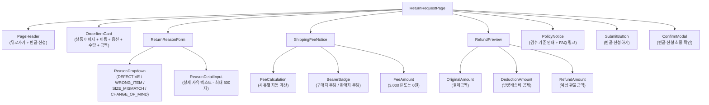
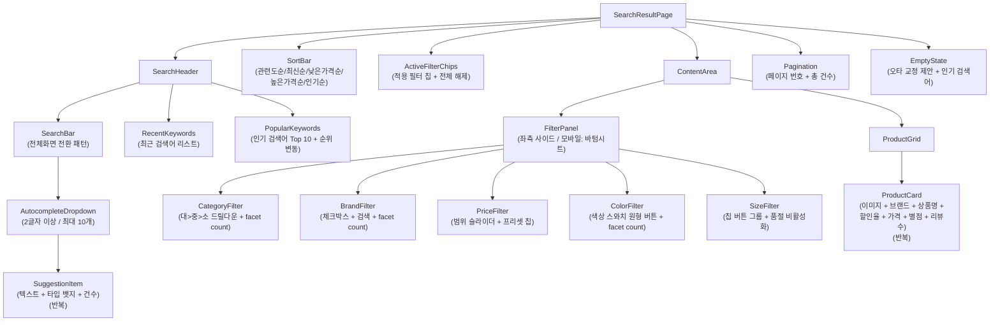
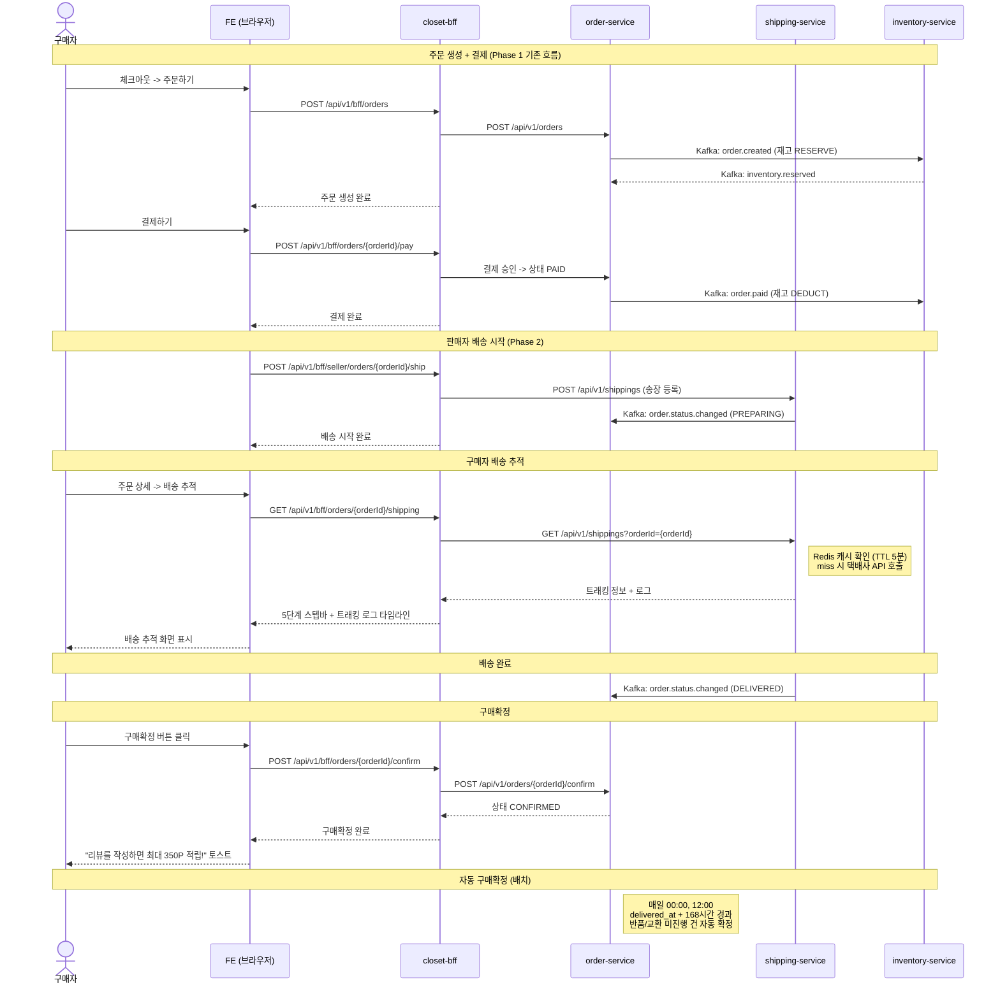
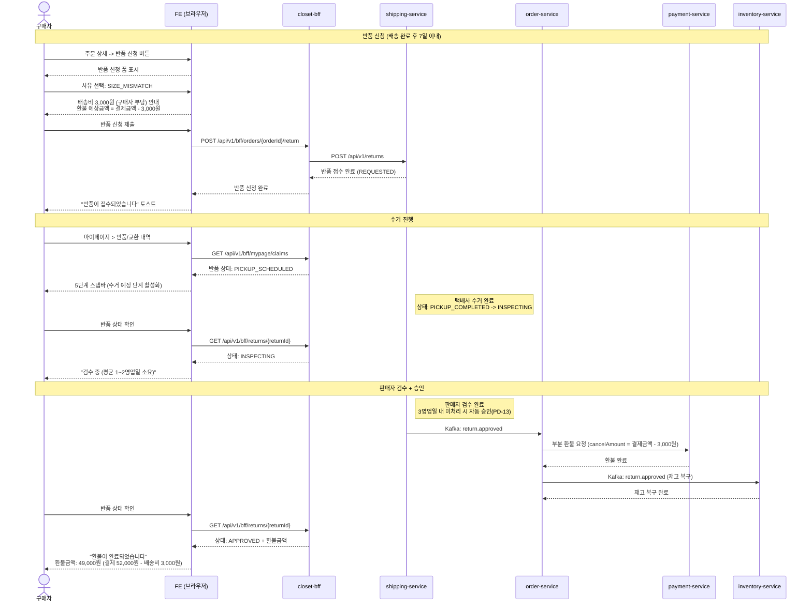
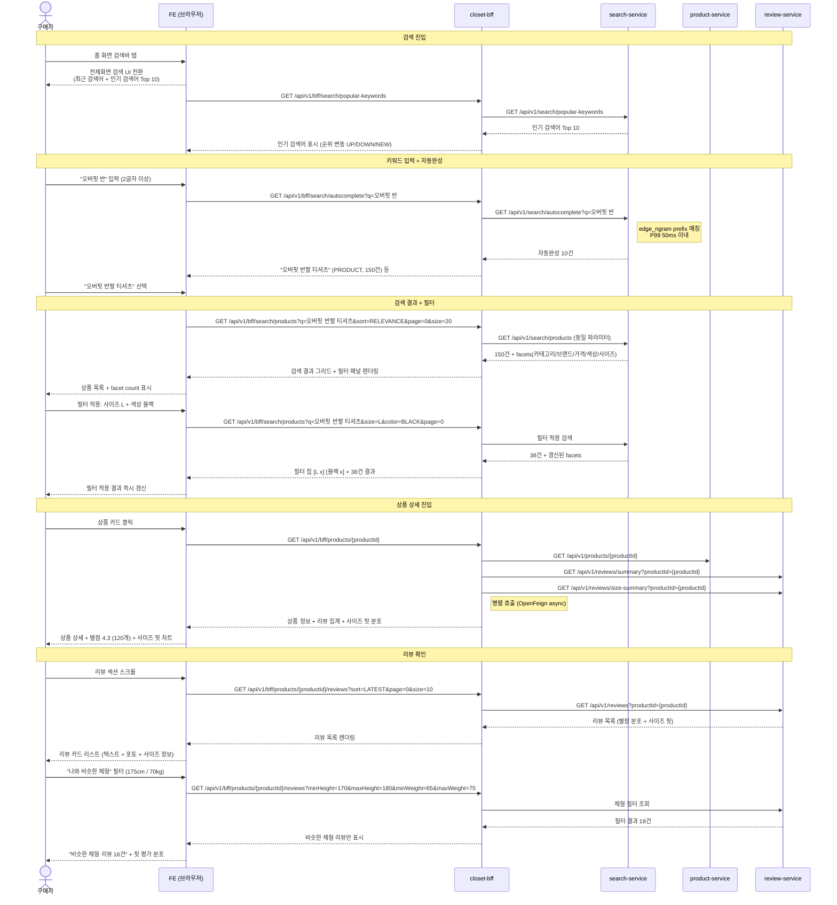

# Phase 2 FE Design Document

> 작성일: 2026-04-04
> 프로젝트: Closet E-commerce
> Phase: 2 (성장) -- 배송 추적, 재고 관리, 검색, 리뷰
> 역할: FE Lead
> 기반 문서: Phase 2 PRD, UX Research, PM Decisions

---

## 1. 페이지/라우트 구조

### 1-1. Phase 2 신규 페이지

| # | URL | 페이지명 | 설명 | 권한 |
|---|-----|---------|------|------|
| N-01 | `/search` | 검색 결과 페이지 | 키워드 검색 결과 + 필터 + 정렬 + facet count. 쿼리파라미터: `q`, `sort`, `category`, `brand`, `minPrice`, `maxPrice`, `color`, `size`, `page` | 전체 |
| N-02 | `/search/popular` | 인기 검색어 페이지 | 실시간 인기 검색어 Top 10 + 순위 변동(UP/DOWN/NEW/SAME) | 전체 |
| N-03 | `/orders/{orderId}/shipping` | 배송 추적 페이지 | 5단계 스텝바(READY > PICKED_UP > IN_TRANSIT > OUT_FOR_DELIVERY > DELIVERED) + 트래킹 로그 타임라인 + 예상 도착일 | 구매자 |
| N-04 | `/orders/{orderId}/return` | 반품 신청 페이지 | 반품 사유 선택(4종) + 상세 사유 입력 + 배송비 안내 모달 | 구매자 |
| N-05 | `/orders/{orderId}/exchange` | 교환 신청 페이지 | 교환 사유 선택 + 교환 옵션(사이즈/색상) 선택 + 재고 확인 + 배송비 안내 | 구매자 |
| N-06 | `/mypage/returns` | 반품/교환 내역 페이지 | 반품 목록(5단계 상태 트래커) + 교환 목록(5단계 상태 트래커) + 환불 금액 안내 | 구매자 |
| N-07 | `/mypage/reviews` | 리뷰 관리 페이지 | 작성 가능한 리뷰(뱃지) + 작성한 리뷰 리스트 + 수정/삭제 | 구매자 |
| N-08 | `/mypage/reviews/write/{orderItemId}` | 리뷰 작성 페이지 | 별점 입력 + 텍스트(20~1000자) + 포토(최대 5장, 5MB/장) + 사이즈 정보(키/몸무게/핏) + 포인트 적립 안내 | 구매자 |
| N-09 | `/mypage/reviews/edit/{reviewId}` | 리뷰 수정 페이지 | 텍스트 + 이미지 수정(별점 수정 불가). 최대 3회 수정 제한 (PD-32) | 구매자 |
| N-10 | `/mypage/restock-alerts` | 재입고 알림 관리 페이지 | 대기중(WAITING) 알림 리스트 + 완료(NOTIFIED) 알림 + 알림 취소 | 구매자 |
| N-11 | `/products/{id}/reviews` | 상품 리뷰 전체보기 페이지 | 리뷰 목록 + 정렬(최신순/평점/도움순) + 포토 리뷰 필터 + 사이즈 핏 분포 + "나와 비슷한 체형" 필터 | 전체 |
| N-12 | `/seller/orders` | 판매자 주문관리 페이지 | 주문 목록(상태별 탭) + 송장 등록(자동 채번 + 수동 입력) + 반품/교환 처리 + 검수 승인/거절 | 판매자 |
| N-13 | `/seller/inventory` | 판매자 재고관리 페이지 | SKU별 재고 조회 + 안전재고 설정 + 입고 등록 + 재고 변경 이력 | 판매자 |
| N-14 | `/admin/reviews` | 관리자 리뷰 관리 페이지 | 리뷰 목록 + HIDDEN 처리 + 금칙어 관리 CRUD (PD-35, PD-39) | 관리자 |
| N-15 | `/mypage/points` | 포인트 내역 페이지 | 보유 잔액 + 적립/사용 내역(기간 필터) + 소멸 예정 안내 | 구매자 |
| N-16 | `/orders/{orderId}/confirm` | 구매확정 확인 페이지 | 구매확정 안내 + 자동 구매확정 D-day 카운트다운 + 확인 버튼 | 구매자 |

### 1-2. Phase 1 기존 페이지 수정

| # | URL | 페이지명 | 수정 내용 |
|---|-----|---------|----------|
| M-01 | `/` | 홈 화면 | 검색바 추가 (전체화면 전환 패턴), 인기 검색어 Top 10 영역 추가 |
| M-02 | `/products/{id}` | 상품 상세 | 리뷰 요약(별점 평균 + 분포 차트 + 리뷰수) 추가, 사이즈 핏 분포 시각화 추가, 재입고 알림 신청 버튼(품절 옵션), 재고 잔여수량 표시, "나와 비슷한 체형" 필터 리뷰 섹션 |
| M-03 | `/mypage` | 마이페이지 | 주문 현황 대시보드(결제완료/배송준비/배송중/배송완료/구매확정 N건) 추가, 상태별 동적 액션 버튼(배송 추적/구매확정/반품 신청/교환 신청/리뷰 작성), 반품/교환 내역 메뉴 추가, 리뷰 관리 메뉴 추가, 재입고 알림 메뉴 추가, 포인트 내역 메뉴 추가 |
| M-04 | `/mypage/orders/{id}` | 주문 상세 | 배송 정보 섹션 추가(택배사/송장번호/배송 추적 링크), 배송 추적 타임라인 요약(최근 3건), 반품/교환 신청 버튼(DELIVERED 상태 + 7일 이내), 구매확정 버튼(DELIVERED 상태), 리뷰 작성 버튼(CONFIRMED 상태), 반품 가능 기간 D-day 표시 |
| M-05 | `/cart` | 장바구니 | 품절 상품 알림(재고 부족 시 비활성화), 재고 부족 시 "재입고 알림 신청" 링크 |
| M-06 | `/checkout` | 체크아웃 | 재고 실시간 검증(주문 생성 시 All or Nothing), 부족 SKU 에러 메시지 |
| M-07 | GNB (Global Navigation) | 전역 네비게이션 | 검색 아이콘 추가(전체화면 검색 전환), 마이페이지 뱃지(새 상태 변경 알림) |

---

## 2. 컴포넌트 트리 (Mermaid)

### 2-1. 배송 추적 페이지 (`/orders/{orderId}/shipping`)

```mermaid
flowchart TD
    ShippingTrackingPage["ShippingTrackingPage"]
    ShippingTrackingPage --> PageHeader["PageHeader\n(뒤로가기 + 주문번호)"]
    ShippingTrackingPage --> ShippingStepBar["ShippingStepBar\n(5단계 진행 바)"]
    ShippingStepBar --> StepItem_READY["StepItem\n(READY: 배송 준비)"]
    ShippingStepBar --> StepItem_PICKED["StepItem\n(PICKED_UP: 상품 인수)"]
    ShippingStepBar --> StepItem_TRANSIT["StepItem\n(IN_TRANSIT: 배송 중)"]
    ShippingStepBar --> StepItem_OUT["StepItem\n(OUT_FOR_DELIVERY: 배달 출발)"]
    ShippingStepBar --> StepItem_DONE["StepItem\n(DELIVERED: 배송 완료)"]
    ShippingTrackingPage --> EstimatedDelivery["EstimatedDeliveryBanner\n(예상 도착일)"]
    ShippingTrackingPage --> ShippingInfoCard["ShippingInfoCard"]
    ShippingInfoCard --> CarrierInfo["CarrierInfo\n(택배사명 + 송장번호 + 복사)"]
    ShippingInfoCard --> RecipientInfo["RecipientInfo\n(수령인 + 연락처 + 주소)"]
    ShippingTrackingPage --> TrackingTimeline["TrackingTimeline\n(시간순 로그 리스트)"]
    TrackingTimeline --> TrackingLogItem["TrackingLogItem\n(상태 + 위치 + 설명 + 시각)\n(반복)"]
    ShippingTrackingPage --> ActionButtons["ActionButtons"]
    ActionButtons --> ConfirmPurchaseBtn["ConfirmPurchaseBtn\n(구매확정 - DELIVERED 시)"]
    ActionButtons --> ReturnRequestBtn["ReturnRequestBtn\n(반품 신청 - DELIVERED 후 7일 이내)"]
    ActionButtons --> ExchangeRequestBtn["ExchangeRequestBtn\n(교환 신청 - DELIVERED 후 7일 이내)"]
```

### 2-2. 반품/교환 신청 페이지 (`/orders/{orderId}/return`)

### 2-3. 상품 검색 결과 페이지 (`/search`)

### 2-4. 리뷰 작성 페이지 (`/mypage/reviews/write/{orderItemId}`)

```mermaid
flowchart TD
    ReviewWritePage["ReviewWritePage"]
    ReviewWritePage --> PageHeader["PageHeader\n(뒤로가기 + 리뷰 작성)"]
    ReviewWritePage --> ProductInfoCard["ProductInfoCard\n(상품 이미지 + 이름 + 옵션 + 구매일)"]
    ReviewWritePage --> RatingInput["RatingInput\n(별점 1~5 선택 / 터치 가능)"]
    ReviewWritePage --> ContentInput["ContentInput\n(텍스트 영역 / 최소 20자 ~ 최대 1000자\n글자수 카운터)"]
    ReviewWritePage --> PhotoUploader["PhotoUploader\n(최대 5장 / 5MB 제한)"]
    PhotoUploader --> ImagePreview["ImagePreview\n(썸네일 미리보기 + 삭제 버튼)\n(반복)"]
    PhotoUploader --> AddPhotoButton["AddPhotoButton\n(카메라/갤러리 선택)"]
    ReviewWritePage --> SizeInfoForm["SizeInfoForm\n(선택 입력 + 추가 50P 안내)"]
    SizeInfoForm --> HeightInput["HeightInput\n(키 cm)"]
    SizeInfoForm --> WeightInput["WeightInput\n(몸무게 kg)"]
    SizeInfoForm --> UsualSizeSelect["UsualSizeSelect\n(평소 사이즈 S~XXL)"]
    SizeInfoForm --> PurchasedSizeDisplay["PurchasedSizeDisplay\n(구매 사이즈 - 자동 표시)"]
    SizeInfoForm --> SizeFitSelect["SizeFitSelect\n(작아요 / 딱맞아요 / 커요)"]
    ReviewWritePage --> PointPreview["PointPreview\n(적립 예정 포인트 실시간 계산)"]
    PointPreview --> TextRewardBadge["TextRewardBadge\n(텍스트 리뷰 100P)"]
    PointPreview --> PhotoRewardBadge["PhotoRewardBadge\n(포토 리뷰 +200P)"]
    PointPreview --> SizeRewardBadge["SizeRewardBadge\n(사이즈 정보 +50P)"]
    PointPreview --> TotalReward["TotalReward\n(합계: 최대 350P)"]
    ReviewWritePage --> SubmitButton["SubmitButton\n(리뷰 등록)"]
```

### 2-5. 판매자 주문관리 페이지 (`/seller/orders`)

```mermaid
flowchart TD
    SellerOrderPage["SellerOrderPage"]
    SellerOrderPage --> PageHeader["PageHeader\n(판매자 주문관리)"]
    SellerOrderPage --> OrderStatusTabs["OrderStatusTabs"]
    OrderStatusTabs --> TabAll["Tab: 전체"]
    OrderStatusTabs --> TabPaid["Tab: 결제완료(N)"]
    OrderStatusTabs --> TabPreparing["Tab: 배송준비(N)"]
    OrderStatusTabs --> TabShipped["Tab: 배송중(N)"]
    OrderStatusTabs --> TabDelivered["Tab: 배송완료(N)"]
    OrderStatusTabs --> TabReturn["Tab: 반품/교환(N)"]
    SellerOrderPage --> OrderSearchBar["OrderSearchBar\n(주문번호/구매자명 검색 + 기간 필터)"]
    SellerOrderPage --> OrderTable["OrderTable"]
    OrderTable --> OrderRow["OrderRow\n(반복)"]
    OrderRow --> OrderBasicInfo["OrderBasicInfo\n(주문번호 + 주문일 + 구매자)"]
    OrderRow --> OrderItemInfo["OrderItemInfo\n(상품명 + 옵션 + 수량 + 금액)"]
    OrderRow --> OrderStatusBadge["OrderStatusBadge\n(상태별 색상 구분)"]
    OrderRow --> OrderActions["OrderActions"]
    OrderActions --> ShipButton["ShipButton\n(배송 시작 - PAID 상태)"]
    OrderActions --> TrackingLink["TrackingLink\n(배송 추적 - SHIPPED 상태)"]
    OrderActions --> ReturnProcessBtn["ReturnProcessBtn\n(반품 처리 - RETURN_REQUESTED)"]
    OrderActions --> ExchangeProcessBtn["ExchangeProcessBtn\n(교환 처리 - EXCHANGE_REQUESTED)"]
    SellerOrderPage --> ShipModal["ShipModal\n(배송 시작 모달)"]
    ShipModal --> CarrierSelect["CarrierSelect\n(택배사 선택: CJ/로젠/롯데/우체국)"]
    ShipModal --> AutoTrackingToggle["AutoTrackingToggle\n(시스템 자동 채번 ON/OFF)"]
    ShipModal --> ManualTrackingInput["ManualTrackingInput\n(수동 송장 입력 - 자동 채번 OFF 시)"]
    ShipModal --> TrackingValidation["TrackingValidation\n(형식 검증: [A-Z]{0,4}[0-9]{10,15})"]
    ShipModal --> ShipConfirmBtn["ShipConfirmBtn\n(배송 시작 확인)"]
    SellerOrderPage --> ReturnInspectionModal["ReturnInspectionModal\n(반품 검수 모달)"]
    ReturnInspectionModal --> InspectionChecklist["InspectionChecklist\n(태그 부착/사용 흔적/포장 상태)"]
    ReturnInspectionModal --> ApproveBtn["ApproveBtn\n(승인 -> 환불 처리)"]
    ReturnInspectionModal --> RejectBtn["RejectBtn\n(거절 + 사유 입력)"]
```

---

## 3. 상태 관리 설계

| 상태 | 스코프 | 관리 방식 | 설명 |
|------|--------|----------|------|
| `searchQuery` | 글로벌 | URL 쿼리파라미터 + Zustand | 검색 키워드, 정렬, 필터(카테고리/브랜드/가격/색상/사이즈), 페이지. URL 동기화로 뒤로가기/공유 지원 |
| `searchResults` | 서버 | React Query (TanStack Query) | 검색 결과 목록 + facets + totalCount. `staleTime: 30s`, 필터 변경 시 자동 refetch |
| `autocomplete` | 서버 | React Query + debounce 200ms | 자동완성 결과. `staleTime: 10s`, 2글자 미만 시 비활성화 |
| `popularKeywords` | 서버 | React Query | 인기 검색어 Top 10. `staleTime: 5min` (1시간 sliding window 기반이므로 여유 있는 캐싱) |
| `recentKeywords` | 로컬 | localStorage + Zustand | 최근 검색어 목록(최대 20개). 클라이언트 로컬 저장 + 서버 동기화(Redis List) |
| `shippingTracking` | 서버 | React Query | 배송 추적 정보(스텝바 + 트래킹 로그). `staleTime: 5min` (서버 Redis 캐싱 TTL과 동기화), 수동 새로고침 지원 |
| `orderDetail` | 서버 | React Query | 주문 상세 + 결제 + 배송 정보. `staleTime: 30s` |
| `returnRequest` | 로컬(폼) | React Hook Form + Zod | 반품 신청 폼 상태(사유/상세사유). 사유 선택 시 배송비/환불금액 실시간 계산 |
| `exchangeRequest` | 로컬(폼) | React Hook Form + Zod | 교환 신청 폼 상태(사유/교환 옵션). 옵션 변경 시 재고 실시간 조회 |
| `returnExchangeList` | 서버 | React Query | 반품/교환 내역 리스트 + 상태 트래커. `staleTime: 1min` |
| `reviewForm` | 로컬(폼) | React Hook Form + Zod | 리뷰 작성 폼(별점/텍스트/이미지/사이즈 정보). 이미지 업로드 프로그레스 로컬 관리 |
| `reviewList` | 서버 | React Query (Infinite Query) | 상품별 리뷰 목록. 무한 스크롤, 정렬/필터 변경 시 reset |
| `reviewSummary` | 서버 | React Query | 리뷰 집계(평균 별점/분포/사이즈 핏). `staleTime: 5min` |
| `sizeFitFilter` | 로컬 | Zustand | "나와 비슷한 체형" 필터 상태(키/몸무게 범위). 상품 상세 리뷰 섹션에서 사용 |
| `inventoryStatus` | 서버 | React Query | SKU별 재고 상태(잔여수량/품절 여부). 상품 상세 옵션 선택 시 조회, `staleTime: 30s` |
| `restockAlerts` | 서버 | React Query | 재입고 알림 목록(WAITING/NOTIFIED). `staleTime: 1min` |
| `sellerOrders` | 서버 | React Query | 판매자 주문 리스트(상태별 탭 + 검색). `staleTime: 30s` |
| `sellerInventory` | 서버 | React Query | 판매자 SKU별 재고 + 안전재고 설정. `staleTime: 1min` |
| `pointHistory` | 서버 | React Query (Infinite Query) | 포인트 적립/사용 내역. 기간 필터 변경 시 reset |
| `myPageDashboard` | 서버 | React Query | 주문 현황 대시보드(상태별 건수). `staleTime: 1min` |
| `imageUploadProgress` | 로컬 | Zustand | 리뷰 이미지 업로드 진행률(파일별 %). 업로드 완료 후 초기화 |
| `toastNotification` | 글로벌 | Zustand | 토스트 알림 큐(포인트 적립 완료, 반품 신청 완료 등). 자동 소멸 3초 |
| `authUser` | 글로벌 | Zustand + JWT | 로그인 사용자 정보(role: BUYER/SELLER/ADMIN). JWT claim에서 역할 판별 (PD-03) |

---

## 4. BFF API 연동

### 4-1. Phase 2 신규 BFF API 전수 목록

| # | BFF API | Method | Path | 호출 페이지 | 요청 | 응답 | 에러 |
|---|---------|--------|------|------------|------|------|------|
| B-01 | 상품 검색 | GET | `/api/v1/bff/search/products` | 검색 결과(N-01) | `q`, `sort(RELEVANCE/LATEST/PRICE_ASC/PRICE_DESC/POPULAR)`, `category`, `brand[]`, `minPrice`, `maxPrice`, `color[]`, `size[]`, `page`, `size` | `{ totalCount, items: ProductSearchItem[], facets: { categories, brands, priceRanges, colors, sizes } }` | 400: 빈 키워드, 429: Rate Limit 초과(IP 분당 120회 / 사용자 분당 60회) |
| B-02 | 자동완성 | GET | `/api/v1/bff/search/autocomplete` | 검색바(M-01, N-01) | `q` (최소 2글자) | `{ suggestions: [{ text, type(PRODUCT/BRAND/CATEGORY), count }] }` (최대 10건) | 400: 2글자 미만 |
| B-03 | 인기 검색어 | GET | `/api/v1/bff/search/popular-keywords` | 홈(M-01), 검색(N-01, N-02) | 없음 | `{ updatedAt, keywords: [{ rank, keyword, change(UP/DOWN/NEW/SAME), searchCount }] }` (Top 10) | - |
| B-04 | 최근 검색어 저장 | POST | `/api/v1/bff/search/recent-keywords` | 검색 결과(N-01) | `{ keyword }` | `204 No Content` | 401: 미인증 |
| B-05 | 최근 검색어 조회 | GET | `/api/v1/bff/search/recent-keywords` | 검색바(M-01, N-01) | 없음 | `{ keywords: string[] }` (최대 20건) | 401: 미인증 |
| B-06 | 최근 검색어 삭제 | DELETE | `/api/v1/bff/search/recent-keywords` | 검색바(M-01, N-01) | `{ keyword }` 또는 전체 삭제 | `204 No Content` | 401: 미인증 |
| B-07 | 배송 추적 조회 | GET | `/api/v1/bff/orders/{orderId}/shipping` | 배송 추적(N-03), 주문 상세(M-04) | `orderId` (path) | `{ shippingId, carrier, trackingNumber, currentStatus, estimatedDelivery, trackingLogs: [{ status, location, description, trackedAt }] }` | 404: 배송 정보 없음, 403: 타인 주문 |
| B-08 | 구매확정 | POST | `/api/v1/bff/orders/{orderId}/confirm` | 배송 추적(N-03), 주문 상세(M-04), 구매확정(N-16) | `orderId` (path) | `{ orderId, status: "CONFIRMED", confirmedAt }` | 409: 이미 확정됨, 400: DELIVERED 상태 아님 |
| B-09 | 반품 신청 | POST | `/api/v1/bff/orders/{orderId}/return` | 반품 신청(N-04) | `{ orderItemId, reason(DEFECTIVE/WRONG_ITEM/SIZE_MISMATCH/CHANGE_OF_MIND), reasonDetail? }` | `{ id, orderId, orderItemId, reason, status: "REQUESTED", shippingFeeBearer, shippingFee, expectedRefundAmount, requestedAt }` | 400: 7일 초과, 409: 이미 반품 신청, 409: 구매확정 완료 |
| B-10 | 교환 신청 | POST | `/api/v1/bff/orders/{orderId}/exchange` | 교환 신청(N-05) | `{ orderItemId, reason, reasonDetail?, exchangeOptionId }` | `{ id, orderId, orderItemId, reason, exchangeOptionId, status: "REQUESTED", shippingFeeBearer, shippingFee, requestedAt }` | 400: 7일 초과, 409: 재고 부족, 409: 가격 상이(동일 가격만 허용 - PD-14) |
| B-11 | 반품/교환 내역 조회 | GET | `/api/v1/bff/mypage/claims` | 반품/교환 내역(N-06) | `type(RETURN/EXCHANGE)?`, `page`, `size` | `{ returns: [{ id, orderId, reason, status, shippingFeeBearer, shippingFee, expectedRefundAmount, requestedAt, completedAt }], exchanges: [{ id, orderId, reason, exchangeOptionId, status, shippingFee, requestedAt, completedAt }] }` | 401: 미인증 |
| B-12 | 반품 상세 조회 | GET | `/api/v1/bff/returns/{returnId}` | 반품/교환 내역(N-06) | `returnId` (path) | `{ id, orderId, orderItemId, reason, reasonDetail, status, shippingFeeBearer, shippingFee, rejectReason?, requestedAt, completedAt?, statusHistory: [{ status, changedAt }] }` | 404: 반품 없음 |
| B-13 | 리뷰 작성 | POST | `/api/v1/bff/reviews` | 리뷰 작성(N-08) | `multipart/form-data: rating(1-5), content(20-1000자), orderItemId, productId, images?(최대 5장, 5MB/장), sizeInfo?{ height, weight, usualSize, purchasedSize, sizeFit(SMALL/PERFECT/LARGE) }` | `{ id, rating, content, hasPhoto, images, sizeInfo?, earnedPoint, createdAt }` | 400: 글자수 미달, 400: 이미지 크기 초과, 409: 이미 작성됨, 403: CONFIRMED 아님 |
| B-14 | 리뷰 수정 | PUT | `/api/v1/bff/reviews/{reviewId}` | 리뷰 수정(N-09) | `multipart/form-data: content, images?` (별점 수정 불가) | `{ id, content, hasPhoto, images, editCount, updatedAt }` | 400: 수정 3회 초과(PD-32), 400: 작성 후 7일 초과 |
| B-15 | 리뷰 삭제 | DELETE | `/api/v1/bff/reviews/{reviewId}` | 리뷰 관리(N-07) | `reviewId` (path) | `204 No Content` (포인트 회수 비동기 처리) | 403: 본인 아님 |
| B-16 | 상품 리뷰 목록 조회 | GET | `/api/v1/bff/products/{productId}/reviews` | 상품 상세(M-02), 리뷰 전체보기(N-11) | `productId(path)`, `sort(LATEST/RATING_HIGH/RATING_LOW/HELPFUL)`, `photoOnly?`, `minHeight?`, `maxHeight?`, `minWeight?`, `maxWeight?`, `page`, `size` | `{ totalCount, avgRating, ratingDistribution: {1-5}, items: ReviewItem[], sizeFitDistribution: { SMALL, PERFECT, LARGE } }` | - |
| B-17 | 리뷰 도움됐어요 | POST | `/api/v1/bff/reviews/{reviewId}/helpful` | 리뷰 전체보기(N-11), 상품 상세(M-02) | `reviewId` (path) | `{ helpfulCount }` | 409: 이미 눌렀음 |
| B-18 | 리뷰 집계 조회 | GET | `/api/v1/bff/products/{productId}/review-summary` | 상품 상세(M-02) | `productId` (path) | `{ productId, reviewCount, avgRating, ratingDistribution, photoReviewCount, sizeFitDistribution, sizeFitRecommendation }` | - |
| B-19 | 사이즈 핏 요약 조회 | GET | `/api/v1/bff/products/{productId}/size-summary` | 상품 상세(M-02) | `productId` (path) | `{ productId, totalSizeReviews, fitDistribution: { SMALL, PERFECT, LARGE }, recommendation }` | - |
| B-20 | 재입고 알림 신청 | POST | `/api/v1/bff/restock-notifications` | 상품 상세(M-02) | `{ productId, optionId }` | `{ id, productId, optionId, status: "WAITING", createdAt }` | 409: 이미 신청됨, 400: 최대 50건 초과(PD-21) |
| B-21 | 재입고 알림 취소 | DELETE | `/api/v1/bff/restock-notifications/{notificationId}` | 재입고 알림 관리(N-10) | `notificationId` (path) | `204 No Content` | 404: 알림 없음 |
| B-22 | 재입고 알림 목록 조회 | GET | `/api/v1/bff/mypage/restock-notifications` | 재입고 알림 관리(N-10) | `status(WAITING/NOTIFIED)?`, `page`, `size` | `{ items: [{ id, productId, productName, optionName, imageUrl, status, createdAt }] }` | 401: 미인증 |
| B-23 | 재고 상태 조회 | GET | `/api/v1/bff/products/{productId}/inventory` | 상품 상세(M-02), 교환 신청(N-05) | `productId` (path) | `{ items: [{ optionId, optionName, sku, available, isOutOfStock }] }` | - |
| B-24 | 마이페이지 대시보드 | GET | `/api/v1/bff/mypage/dashboard` | 마이페이지(M-03) | 없음 | `{ orderCounts: { paid, preparing, shipped, delivered, confirmed }, pendingReviewCount, activeReturnCount, activeExchangeCount }` | 401: 미인증 |
| B-25 | 작성 가능 리뷰 목록 | GET | `/api/v1/bff/mypage/reviews/writable` | 리뷰 관리(N-07) | `page`, `size` | `{ items: [{ orderItemId, productId, productName, optionName, imageUrl, orderedAt, confirmedAt }] }` | 401: 미인증 |
| B-26 | 내 리뷰 목록 | GET | `/api/v1/bff/mypage/reviews` | 리뷰 관리(N-07) | `page`, `size` | `{ items: [{ id, productId, productName, rating, content, hasPhoto, helpfulCount, earnedPoint, editCount, createdAt }] }` | 401: 미인증 |
| B-27 | 포인트 내역 조회 | GET | `/api/v1/bff/mypage/points` | 포인트 내역(N-15) | `startDate?`, `endDate?`, `type(EARN/USE)?`, `page`, `size` | `{ balance, items: [{ id, type, amount, reason, referenceType, referenceId, createdAt }], expiringPoints: { amount, expireDate } }` | 401: 미인증 |
| B-28 | 판매자 주문 목록 | GET | `/api/v1/bff/seller/orders` | 판매자 주문관리(N-12) | `status?`, `keyword?`, `startDate?`, `endDate?`, `page`, `size` | `{ items: [{ orderId, orderNumber, buyerName, items, totalAmount, status, orderedAt }], statusCounts: { paid, preparing, shipped, delivered, returnRequested, exchangeRequested } }` | 403: 판매자 권한 없음 |
| B-29 | 판매자 배송 시작 | POST | `/api/v1/bff/seller/orders/{orderId}/ship` | 판매자 주문관리(N-12) | `{ carrier(CJ_LOGISTICS/LOGEN/LOTTE/KOREA_POST), trackingNumber?(수동입력 시), autoTracking: boolean }` | `{ shippingId, orderId, carrier, trackingNumber, status: "READY" }` | 400: 송장번호 형식 오류, 409: 이미 발송됨 |
| B-30 | 판매자 반품 처리(승인/거절) | POST | `/api/v1/bff/seller/returns/{returnId}/inspect` | 판매자 주문관리(N-12) | `{ decision(APPROVED/REJECTED), rejectReason? }` | `{ returnId, status, refundAmount?, rejectReason? }` | 400: INSPECTING 상태 아님 |
| B-31 | 판매자 재고 조회 | GET | `/api/v1/bff/seller/inventory` | 판매자 재고관리(N-13) | `productId?`, `lowStockOnly?`, `page`, `size` | `{ items: [{ inventoryId, productId, productName, optionName, sku, total, available, reserved, safetyStock }] }` | 403: 판매자 권한 없음 |
| B-32 | 판매자 안전재고 설정 | PATCH | `/api/v1/bff/seller/inventory/{inventoryId}/safety-stock` | 판매자 재고관리(N-13) | `{ safetyStock }` | `{ inventoryId, sku, safetyStock }` | 400: 음수 값 |
| B-33 | 판매자 재고 입고 | POST | `/api/v1/bff/seller/inventory/{inventoryId}/inbound` | 판매자 재고관리(N-13) | `{ quantity }` | `{ inventoryId, sku, beforeQuantity, afterQuantity }` | 400: 0 이하 수량 |
| B-34 | 관리자 리뷰 목록 | GET | `/api/v1/bff/admin/reviews` | 관리자 리뷰 관리(N-14) | `status?`, `keyword?`, `page`, `size` | `{ items: [{ id, memberId, productId, productName, rating, content, status, createdAt }] }` | 403: 관리자 권한 없음 |
| B-35 | 관리자 리뷰 숨김 처리 | PATCH | `/api/v1/bff/admin/reviews/{reviewId}/hide` | 관리자 리뷰 관리(N-14) | `reviewId` (path) | `{ reviewId, status: "HIDDEN" }` | 403: 관리자 권한 없음 |
| B-36 | 관리자 금칙어 CRUD | GET/POST/PUT/DELETE | `/api/v1/bff/admin/forbidden-words` | 관리자 리뷰 관리(N-14) | GET: `page`, `size` / POST: `{ word }` / DELETE: `{ wordId }` | GET: `{ items: [{ id, word }] }` / POST: `{ id, word }` / DELETE: `204` | 403: 관리자 권한 없음 |
| B-37 | 상품 상세 (확장) | GET | `/api/v1/bff/products/{id}` | 상품 상세(M-02) | `id` (path) | 기존 응답 + `reviewSummary: { avgRating, totalCount, sizeFitDistribution }` + `inventoryStatus: [{ optionId, available, isOutOfStock }]` | 404: 상품 없음 |

### 4-2. Phase 1 기존 BFF API 수정

| # | BFF API | 수정 내용 |
|---|---------|----------|
| E-01 | `GET /api/v1/bff/home` | `popularKeywords: [{ rank, keyword, change }]` 필드 추가, 검색바 데이터 포함 |
| E-02 | `GET /api/v1/bff/orders/{id}` | `shipment` 필드 활성화 (Phase 1에서 placeholder). `returnRequest`, `exchangeRequest` 필드 추가 |
| E-03 | `GET /api/v1/bff/mypage` | `orderStatusCounts`, `pendingReviewCount` 필드 추가 |
| E-04 | `GET /api/v1/bff/checkout` | 재고 검증 결과(`inventoryCheck: { allAvailable, insufficientItems? }`) 추가 |

---

## 5. 사용자 흐름 (Mermaid sequenceDiagram)

### 5-1. 주문 -> 배송 추적 -> 구매확정

### 5-2. 반품 신청 -> 수거 -> 환불 확인

### 5-3. 검색 -> 필터 -> 상품 상세 -> 리뷰 확인

---

## 6. FE 티켓 목록

### Sprint 5 (Week 1-2): 인프라 + 검색 기초

| # | 티켓명 | 페이지 | 의존성 | 크기 | 스프린트 |
|---|--------|--------|--------|------|---------|
| FE-01 | React Query + Zustand 상태 관리 기반 구축 | 전역 | 없음 | M | Sprint 5 |
| FE-02 | 전체화면 검색 UI 컴포넌트 (SearchBar + 전체화면 전환) | M-01, N-01 | FE-01 | M | Sprint 5 |
| FE-03 | 자동완성 드롭다운 컴포넌트 (debounce 200ms + 하이라이팅) | M-01, N-01 | FE-02, B-02 | M | Sprint 5 |
| FE-04 | 인기 검색어 컴포넌트 (Top 10 + 순위 변동 배지) | M-01, N-02 | FE-02, B-03 | S | Sprint 5 |
| FE-05 | 최근 검색어 컴포넌트 (localStorage + 서버 동기화) | M-01, N-01 | FE-02, B-04/B-05/B-06 | S | Sprint 5 |
| FE-06 | GNB 검색 아이콘 + 마이페이지 알림 뱃지 추가 | M-07 | FE-02 | S | Sprint 5 |

### Sprint 6 (Week 3-4): 검색 결과 + 배송

| # | 티켓명 | 페이지 | 의존성 | 크기 | 스프린트 |
|---|--------|--------|--------|------|---------|
| FE-07 | 검색 결과 페이지 (상품 그리드 + 정렬 + 페이지네이션) | N-01 | FE-03, B-01 | L | Sprint 6 |
| FE-08 | 필터 패널 (카테고리 드릴다운 + 브랜드 체크박스 + 가격 슬라이더 + 색상 스와치 + 사이즈 칩) | N-01 | FE-07, B-01 | L | Sprint 6 |
| FE-09 | 필터 칩 바 + URL 쿼리 파라미터 동기화 | N-01 | FE-08 | M | Sprint 6 |
| FE-10 | 모바일 필터 바텀 시트 (반응형) | N-01 | FE-08 | M | Sprint 6 |
| FE-11 | 검색 결과 빈 상태 (오타 교정 제안 + 인기 검색어) | N-01 | FE-07, B-01 | S | Sprint 6 |
| FE-12 | 배송 추적 페이지 (5단계 스텝바 + 트래킹 로그 타임라인) | N-03 | B-07 | L | Sprint 6 |
| FE-13 | 주문 상세 배송 정보 섹션 확장 (송장번호 + 추적 요약) | M-04 | FE-12, B-07 | M | Sprint 6 |
| FE-14 | 구매확정 페이지 + 버튼 (D-day 카운트다운) | N-16, M-04 | B-08 | S | Sprint 6 |

### Sprint 7 (Week 5-6): 반품/교환 + 판매자

| # | 티켓명 | 페이지 | 의존성 | 크기 | 스프린트 |
|---|--------|--------|--------|------|---------|
| FE-15 | 반품 신청 페이지 (사유 선택 + 배송비 자동 계산 + 환불 미리보기) | N-04 | B-09 | L | Sprint 7 |
| FE-16 | 교환 신청 페이지 (옵션 선택 + 재고 실시간 확인) | N-05 | B-10, B-23 | L | Sprint 7 |
| FE-17 | 반품/교환 내역 페이지 (5단계 상태 트래커 + 환불 안내) | N-06 | B-11, B-12 | M | Sprint 7 |
| FE-18 | 마이페이지 주문 현황 대시보드 (상태별 건수 요약) | M-03 | B-24 | M | Sprint 7 |
| FE-19 | 마이페이지 주문 카드 동적 액션 버튼 (상태별 버튼 분기) | M-03, M-04 | FE-18 | M | Sprint 7 |
| FE-20 | 판매자 주문관리 페이지 (상태별 탭 + 주문 테이블) | N-12 | B-28 | L | Sprint 7 |
| FE-21 | 판매자 배송 시작 모달 (택배사 선택 + 자동 채번/수동 입력) | N-12 | FE-20, B-29 | M | Sprint 7 |
| FE-22 | 판매자 반품 검수 모달 (승인/거절 + 사유 입력) | N-12 | FE-20, B-30 | M | Sprint 7 |

### Sprint 8 (Week 7-8): 리뷰 + 재고 + 통합

| # | 티켓명 | 페이지 | 의존성 | 크기 | 스프린트 |
|---|--------|--------|--------|------|---------|
| FE-23 | 리뷰 작성 페이지 (별점 + 텍스트 + 포토 업로드 + 사이즈 정보) | N-08 | B-13 | L | Sprint 8 |
| FE-24 | 리뷰 이미지 업로더 (5장 제한 + 5MB 검증 + 프로그레스 바) | N-08 | FE-23 | M | Sprint 8 |
| FE-25 | 리뷰 포인트 적립 미리보기 (실시간 계산 100P/300P/+50P) | N-08 | FE-23 | S | Sprint 8 |
| FE-26 | 상품 상세 리뷰 섹션 (집계 + 별점 분포 차트 + 사이즈 핏 시각화) | M-02 | B-18, B-19 | L | Sprint 8 |
| FE-27 | 상품 리뷰 전체보기 페이지 (정렬 + 포토 필터 + 체형 필터 + 무한 스크롤) | N-11 | B-16, B-17 | L | Sprint 8 |
| FE-28 | 리뷰 수정 페이지 (텍스트/이미지만 수정, 별점 고정, 3회 제한) | N-09 | FE-23, B-14 | M | Sprint 8 |
| FE-29 | 리뷰 관리 페이지 (작성 가능 + 작성 완료 탭) | N-07 | B-25, B-26, B-15 | M | Sprint 8 |
| FE-30 | 재입고 알림 신청 버튼 (상품 상세 품절 옵션) | M-02 | B-20, B-23 | S | Sprint 8 |
| FE-31 | 재입고 알림 관리 페이지 (WAITING/NOTIFIED 리스트) | N-10 | B-22, B-21 | M | Sprint 8 |
| FE-32 | 상품 상세 재고 상태 표시 (옵션별 잔여수량 + 품절 뱃지) | M-02 | B-23 | S | Sprint 8 |
| FE-33 | 장바구니 품절 상품 비활성화 + 재입고 알림 링크 | M-05 | B-23, FE-30 | S | Sprint 8 |
| FE-34 | 체크아웃 재고 검증 에러 처리 (All or Nothing) | M-06 | B-37 | S | Sprint 8 |
| FE-35 | 포인트 내역 페이지 (기간 필터 + 적립/사용 구분) | N-15 | B-27 | M | Sprint 8 |
| FE-36 | 판매자 재고관리 페이지 (SKU 조회 + 안전재고 설정 + 입고) | N-13 | B-31, B-32, B-33 | L | Sprint 8 |
| FE-37 | 관리자 리뷰 관리 페이지 (HIDDEN 처리 + 금칙어 CRUD) | N-14 | B-34, B-35, B-36 | M | Sprint 8 |
| FE-38 | E2E 통합 테스트 (검색 -> 상세 -> 주문 -> 배송 -> 리뷰 full flow) | 전체 | FE-01~FE-37 | L | Sprint 8 |

### 티켓 요약

| 스프린트 | S | M | L | 합계 |
|---------|---|---|---|------|
| Sprint 5 | 3 | 2 | 0 | 6 |
| Sprint 6 | 2 | 3 | 3 | 8 |
| Sprint 7 | 0 | 4 | 3 | 8 (추가 1) |
| Sprint 8 | 4 | 5 | 5 | 16 (추가 2) |
| **합계** | **9** | **14** | **11** | **38** |

> 참고: Sprint 8은 리뷰 + 재고 + 통합 테스트가 집중되어 있으므로 일부 S 티켓(FE-30, FE-32, FE-33)을 Sprint 7로 앞당기는 것을 검토할 수 있습니다.
