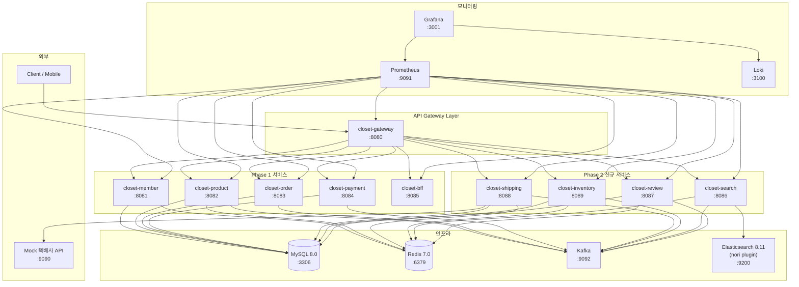
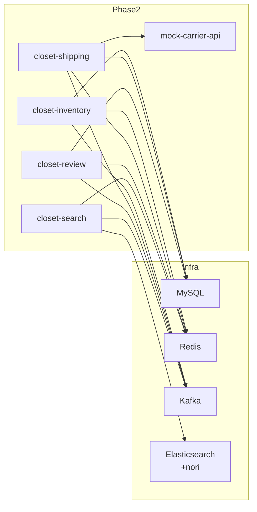
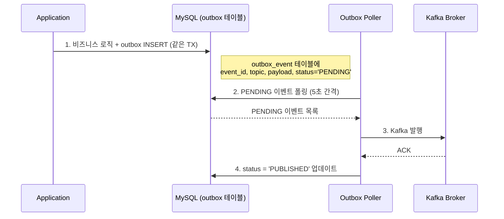
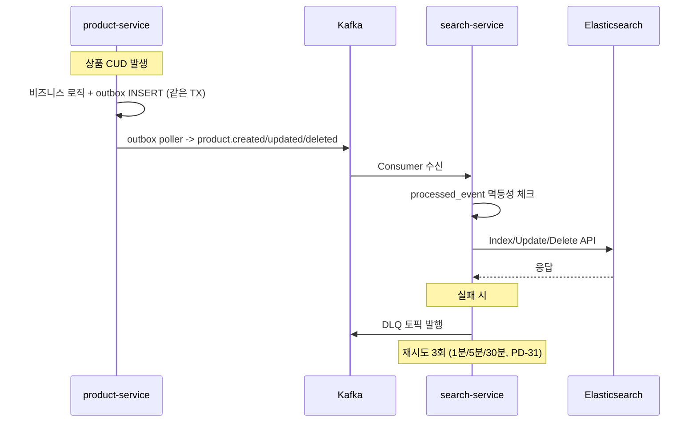
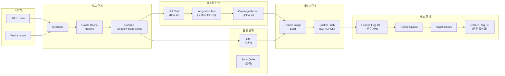

# Phase 2 인프라 설계서

> 작성일: 2026-04-04
> 작성자: DevOps Engineer
> 프로젝트: Closet E-commerce Phase 2 (배송 + 재고 + 검색 + 리뷰)
> 참조: phase2_prd.md, pm_decisions.md, 비기능요구사항.md

---

## 1. 서비스 토폴로지

### 1.1 Phase 2 전체 서비스 구성도



### 1.2 서비스 포트 할당 (최종 확정 - PD-05)

| 서비스 | 포트 | Phase | 비고 |
|--------|------|-------|------|
| closet-gateway | 8080 | 1 | API Gateway |
| closet-member | 8081 | 1 | 회원/인증 |
| closet-product | 8082 | 1 | 상품 관리 |
| closet-order | 8083 | 1 | 주문 관리 |
| closet-payment | 8084 | 1 | 결제 |
| closet-bff | 8085 | 1 | BFF |
| closet-search | 8086 | **2** | 검색 (ES) |
| closet-review | 8087 | **2** | 리뷰 |
| closet-shipping | 8088 | **2** | 배송/반품/교환 |
| closet-inventory | 8089 | **2** | 재고 관리 |
| mock-carrier-api | 9090 | **2** | Mock 택배사 API |

### 1.3 서비스 간 통신 방식

| 통신 유형 | 방식 | 인증 | 사용처 |
|-----------|------|------|--------|
| 외부 -> Gateway | HTTP REST | Bearer JWT | 클라이언트 요청 |
| Gateway -> 서비스 | HTTP REST | JWT 전파 | 라우팅 |
| 서비스 -> 서비스 (동기) | HTTP REST | `X-Internal-Api-Key` (PD-03) | BFF -> 각 서비스 |
| 서비스 -> 서비스 (비동기) | Kafka | 없음 (내부 네트워크) | 이벤트 기반 연동 |
| 서비스 -> Mock API | HTTP REST | 없음 | 택배사 연동 |

---

## 2. docker-compose 확장 설계

### 2.1 신규 서비스 정의

기존 `docker/docker-compose.yml`에 다음 서비스를 추가한다.

```yaml
  # === Phase 2 Application Services ===

  closet-search:
    build:
      context: ../closet-search
      dockerfile: Dockerfile
    ports:
      - "8086:8086"
    environment:
      SPRING_PROFILES_ACTIVE: docker
      SPRING_ELASTICSEARCH_URIS: http://elasticsearch:9200
      SPRING_KAFKA_BOOTSTRAP_SERVERS: kafka:9092
      SPRING_REDIS_HOST: redis
      SPRING_REDIS_PORT: 6379
    healthcheck:
      test: ["CMD", "curl", "-f", "http://localhost:8086/actuator/health"]
      interval: 30s
      timeout: 10s
      retries: 3
      start_period: 60s
    depends_on:
      elasticsearch:
        condition: service_healthy
      kafka:
        condition: service_started
      redis:
        condition: service_started

  closet-review:
    build:
      context: ../closet-review
      dockerfile: Dockerfile
    ports:
      - "8087:8087"
    environment:
      SPRING_PROFILES_ACTIVE: docker
      SPRING_DATASOURCE_URL: jdbc:mysql://mysql:3306/closet?useSSL=false&allowPublicKeyRetrieval=true&serverTimezone=Asia/Seoul
      SPRING_DATASOURCE_USERNAME: root
      SPRING_DATASOURCE_PASSWORD: closet
      SPRING_KAFKA_BOOTSTRAP_SERVERS: kafka:9092
      SPRING_REDIS_HOST: redis
      SPRING_REDIS_PORT: 6379
      REVIEW_IMAGE_STORAGE_PATH: /app/uploads/reviews
    volumes:
      - review-images:/app/uploads/reviews
    healthcheck:
      test: ["CMD", "curl", "-f", "http://localhost:8087/actuator/health"]
      interval: 30s
      timeout: 10s
      retries: 3
      start_period: 60s
    depends_on:
      mysql:
        condition: service_healthy
      kafka:
        condition: service_started
      redis:
        condition: service_started

  closet-shipping:
    build:
      context: ../closet-shipping
      dockerfile: Dockerfile
    ports:
      - "8088:8088"
    environment:
      SPRING_PROFILES_ACTIVE: docker
      SPRING_DATASOURCE_URL: jdbc:mysql://mysql:3306/closet?useSSL=false&allowPublicKeyRetrieval=true&serverTimezone=Asia/Seoul
      SPRING_DATASOURCE_USERNAME: root
      SPRING_DATASOURCE_PASSWORD: closet
      SPRING_KAFKA_BOOTSTRAP_SERVERS: kafka:9092
      SPRING_REDIS_HOST: redis
      SPRING_REDIS_PORT: 6379
      CARRIER_MOCK_API_BASE_URL: http://mock-carrier-api:9090
    healthcheck:
      test: ["CMD", "curl", "-f", "http://localhost:8088/actuator/health"]
      interval: 30s
      timeout: 10s
      retries: 3
      start_period: 60s
    depends_on:
      mysql:
        condition: service_healthy
      kafka:
        condition: service_started
      redis:
        condition: service_started
      mock-carrier-api:
        condition: service_started

  closet-inventory:
    build:
      context: ../closet-inventory
      dockerfile: Dockerfile
    ports:
      - "8089:8089"
    environment:
      SPRING_PROFILES_ACTIVE: docker
      SPRING_DATASOURCE_URL: jdbc:mysql://mysql:3306/closet?useSSL=false&allowPublicKeyRetrieval=true&serverTimezone=Asia/Seoul
      SPRING_DATASOURCE_USERNAME: root
      SPRING_DATASOURCE_PASSWORD: closet
      SPRING_KAFKA_BOOTSTRAP_SERVERS: kafka:9092
      SPRING_REDIS_HOST: redis
      SPRING_REDIS_PORT: 6379
    healthcheck:
      test: ["CMD", "curl", "-f", "http://localhost:8089/actuator/health"]
      interval: 30s
      timeout: 10s
      retries: 3
      start_period: 60s
    depends_on:
      mysql:
        condition: service_healthy
      kafka:
        condition: service_started
      redis:
        condition: service_started

  mock-carrier-api:
    build:
      context: ../mock-carrier-api
      dockerfile: Dockerfile
    ports:
      - "9090:9090"
    environment:
      SERVER_PORT: 9090
    healthcheck:
      test: ["CMD", "curl", "-f", "http://localhost:9090/health"]
      interval: 15s
      timeout: 5s
      retries: 3
      start_period: 10s
```

### 2.2 Elasticsearch nori 플러그인 확장

기존 elasticsearch 서비스 정의를 교체한다.

```yaml
  elasticsearch:
    build:
      context: ./elasticsearch
      dockerfile: Dockerfile
    ports:
      - "9200:9200"
    environment:
      discovery.type: single-node
      xpack.security.enabled: "false"
      ES_JAVA_OPTS: "-Xms512m -Xmx512m"
    volumes:
      - es-data:/usr/share/elasticsearch/data
    healthcheck:
      test: ["CMD-SHELL", "curl -sf http://localhost:9200/_cluster/health | grep -q '\"status\":\"green\"\\|\"status\":\"yellow\"'"]
      interval: 30s
      timeout: 10s
      retries: 5
      start_period: 60s
```

`docker/elasticsearch/Dockerfile`:

```dockerfile
FROM elasticsearch:8.11.0
RUN bin/elasticsearch-plugin install analysis-nori
```

### 2.3 Gateway 의존 관계 업데이트

```yaml
  closet-gateway:
    build:
      context: ../closet-gateway
      dockerfile: Dockerfile
    ports:
      - "8080:8080"
    environment:
      SPRING_PROFILES_ACTIVE: docker
    depends_on:
      closet-member:
        condition: service_started
      closet-product:
        condition: service_started
      closet-order:
        condition: service_started
      closet-payment:
        condition: service_started
      closet-search:
        condition: service_started
      closet-review:
        condition: service_started
      closet-shipping:
        condition: service_started
      closet-inventory:
        condition: service_started
```

### 2.4 추가 볼륨

```yaml
volumes:
  mysql-data:
  es-data:
  prometheus-data:
  grafana-data:
  loki-data:
  review-images:        # Phase 2: 리뷰 이미지 로컬 스토리지 (PD-33)
```

### 2.5 서비스 의존 관계 요약



---

## 3. Kafka 토픽 설계

### 3.1 토픽 목록 (파티션 3개, PD-50 확정)

| 토픽 | 파티션 | Producer | Consumer | 파티션 키 | 설명 |
|------|--------|----------|----------|----------|------|
| `order.created` | 3 | order-service | inventory-service, shipping-service | orderId | 주문 생성 -> 재고 예약, 배송 준비 |
| `order.cancelled` | 3 | order-service | inventory-service | orderId | 주문 취소 -> 재고 복구(RELEASE) |
| `order.status.changed` | 3 | shipping-service, order-service | order-service, bff-service | orderId | 주문 상태 변경 (PREPARING, SHIPPED, DELIVERED) |
| `order.confirmed` | 3 | order-service (배치) | shipping-service | orderId | 구매확정 -> 정산 트리거 |
| `product.created` | 3 | product-service | search-service | productId | 상품 등록 -> ES 인덱싱 (PD-43) |
| `product.updated` | 3 | product-service | search-service | productId | 상품 수정 -> ES 업데이트 |
| `product.deleted` | 3 | product-service | search-service | productId | 상품 삭제 -> ES 삭제 |
| `inventory.insufficient` | 1 | inventory-service | order-service | - | 재고 부족 알림 (PD-19: All or Nothing) |
| `inventory.low_stock` | 1 | inventory-service | notification-service | - | 안전재고 이하 알림 (US-603) |
| `inventory.out_of_stock` | 1 | inventory-service | notification-service | - | 재고 소진 알림 |
| `inventory.restock_notification` | 3 | inventory-service | notification-service | memberId | 재입고 알림 발행 (US-604) |
| `return.approved` | 3 | shipping-service | inventory-service, payment-service | orderId | 반품 승인 -> 재고 복구 + 환불 |
| `review.created` | 3 | review-service | member-service | memberId | 리뷰 생성 -> 포인트 적립 (US-803) |
| `review.summary.updated` | 3 | review-service | search-service | productId | 리뷰 집계 변경 -> ES 동기화 |
| `shipping.status.changed` | 3 | shipping-service | order-service | orderId | 배송 상태 변경 -> 주문 상태 업데이트 |
| `confirm.reminder` | 3 | order-service (배치) | notification-service | memberId | 자동 구매확정 D-1 알림 (PD-45) |

### 3.2 Transactional Outbox 패턴 (PD-04, PD-51)



#### outbox_event 테이블

```sql
CREATE TABLE outbox_event (
    id              BIGINT          NOT NULL AUTO_INCREMENT,
    event_id        VARCHAR(36)     NOT NULL COMMENT 'UUID',
    aggregate_type  VARCHAR(50)     NOT NULL COMMENT '집합 타입: ORDER, PRODUCT, INVENTORY 등',
    aggregate_id    BIGINT          NOT NULL COMMENT '집합 ID',
    event_type      VARCHAR(50)     NOT NULL COMMENT '이벤트 유형',
    topic           VARCHAR(100)    NOT NULL COMMENT 'Kafka 토픽명',
    payload         JSON            NOT NULL COMMENT '이벤트 페이로드 (JSON)',
    status          VARCHAR(20)     NOT NULL DEFAULT 'PENDING' COMMENT 'PENDING, PUBLISHED, FAILED',
    retry_count     INT             NOT NULL DEFAULT 0 COMMENT '재시도 횟수',
    created_at      DATETIME(6)     NOT NULL DEFAULT CURRENT_TIMESTAMP(6),
    published_at    DATETIME(6)     NULL COMMENT '발행 완료 시각',
    PRIMARY KEY (id),
    UNIQUE KEY uk_event_id (event_id),
    INDEX idx_status_created (status, created_at)
) ENGINE=InnoDB DEFAULT CHARSET=utf8mb4 COMMENT='Transactional Outbox';
```

### 3.3 Consumer Group 설계

| Consumer Group | 구독 토픽 | 인스턴스 | 비고 |
|---------------|----------|---------|------|
| `inventory-service` | order.created, order.cancelled, return.approved | 1 | 재고 정합성 최우선 |
| `shipping-service` | order.created, order.confirmed | 1 | 배송 관리 |
| `search-service` | product.created, product.updated, product.deleted, review.summary.updated | 1 | ES 인덱싱 |
| `review-service` | order.confirmed | 1 | 리뷰 작성 가능 상태 동기화 |
| `member-service` | review.created | 1 | 포인트 적립 |
| `order-service` | shipping.status.changed, inventory.insufficient | 1 | 주문 상태 업데이트 |
| `payment-service` | return.approved | 1 | 환불 처리 (PD-12) |

### 3.4 이벤트 멱등성 (PD-04)

모든 Consumer에서 `processed_event` 테이블 기반 중복 방지:

```sql
CREATE TABLE processed_event (
    id              BIGINT          NOT NULL AUTO_INCREMENT,
    event_id        VARCHAR(100)    NOT NULL COMMENT '이벤트 고유 ID (UUID)',
    event_type      VARCHAR(50)     NOT NULL COMMENT '이벤트 유형',
    source_service  VARCHAR(30)     NOT NULL COMMENT '발행 서비스',
    processed_at    DATETIME(6)     NOT NULL DEFAULT CURRENT_TIMESTAMP(6),
    PRIMARY KEY (id),
    UNIQUE KEY uk_event_id (event_id),
    INDEX idx_event_type_processed (event_type, processed_at)
) ENGINE=InnoDB DEFAULT CHARSET=utf8mb4 COMMENT='처리 완료 이벤트 (멱등성)';
```

### 3.5 DLQ 재처리 (PD-31)

- 최대 3회 재시도, 지수 백오프 (1분 / 5분 / 30분)
- 최종 실패 시 `*.dlq` 토픽으로 이동
- 수동 재처리 API: `POST /api/v1/admin/events/{eventId}/retry`

---

## 4. Redis 키 설계

### 4.1 키 패턴 목록

| 키 패턴 | 용도 | TTL | 데이터 타입 | 서비스 | 설명 |
|---------|------|-----|-----------|--------|------|
| `inventory:lock:{sku}` | 재고 분산 락 | 3s (leaseTime) | Redisson Lock | inventory | SKU 단위 분산 락 (PD-04, US-602) |
| `shipping:tracking:{carrier}:{trackingNumber}` | 배송 추적 캐시 | 300s (5분) | String (JSON) | shipping | 택배사 API 응답 캐싱 (PD-41) |
| `search:popular_keywords` | 인기검색어 | - (영구) | Sorted Set | search | score=timestamp, sliding window 1h (PD-25) |
| `search:recent:{memberId}` | 최근 검색어 | 30d | List | search | 최근 검색어 20개 (PD-48) |
| `review:summary:{productId}` | 리뷰 집계 캐시 | 3600s (1시간) | String (JSON) | review | 리뷰 수, 평균 별점, 분포 (US-804) |
| `review:daily_point:{memberId}` | 리뷰 포인트 일일 한도 | 86400s (24시간) | String (정수) | review | KST 00:00 리셋, 일 5,000P (PD-37) |
| `inventory:low_stock_alert:{sku}` | 안전재고 알림 중복 방지 | 86400s (24시간) | String ("1") | inventory | 동일 SKU 24시간 내 중복 알림 방지 (US-603) |
| `inventory:restock:{productId}:{optionId}` | 재입고 알림 대기 | - (영구) | Set (memberId) | inventory | 재입고 알림 신청 회원 (US-604) |
| `search:rate_limit:ip:{ip}` | 검색 Rate Limit (IP) | 60s | String (Counter) | gateway | IP당 분당 120회 (PD-30) |
| `search:rate_limit:user:{memberId}` | 검색 Rate Limit (사용자) | 60s | String (Counter) | gateway | 사용자당 분당 60회 (PD-30) |
| `order:auto_confirm:lock` | 자동 구매확정 배치 락 | 600s (10분) | String ("locked") | order | 배치 중복 실행 방지 (PD-17) |
| `search:synonym:version` | 유의어 사전 버전 | - (영구) | String (버전 번호) | search | 유의어 변경 감지용 (PD-24) |

### 4.2 Redis 메모리 예측

| 키 유형 | 예상 키 수 | 평균 크기 | 총 메모리 |
|---------|-----------|----------|----------|
| 분산 락 | 최대 30 (동시 TPS) | 200B | ~6KB |
| 배송 추적 캐시 | 100건 (배송 중) | 2KB | ~200KB |
| 인기검색어 | 1개 (Sorted Set) | 50KB | ~50KB |
| 최근 검색어 | 500 (MAU 기준) | 1KB | ~500KB |
| 리뷰 집계 | 500 (상품 수) | 500B | ~250KB |
| 일일 포인트 | 100 (일 활성 사용자) | 50B | ~5KB |
| Rate Limit | 500 (동시 접속) | 50B | ~25KB |
| **합계** | | | **~1MB** |

Redis 기본 메모리 128MB로 충분하다.

---

## 5. Elasticsearch 인덱스 설계

### 5.1 closet-products 인덱스 매핑

```json
{
  "settings": {
    "number_of_shards": 1,
    "number_of_replicas": 0,
    "refresh_interval": "1s",
    "analysis": {
      "analyzer": {
        "nori_analyzer": {
          "type": "custom",
          "tokenizer": "nori_tokenizer",
          "filter": ["nori_readingform", "lowercase", "nori_part_of_speech_filter"]
        },
        "nori_search_analyzer": {
          "type": "custom",
          "tokenizer": "nori_tokenizer",
          "filter": ["nori_readingform", "lowercase", "synonym_filter"]
        },
        "autocomplete_index_analyzer": {
          "type": "custom",
          "tokenizer": "autocomplete_tokenizer",
          "filter": ["lowercase"]
        },
        "autocomplete_search_analyzer": {
          "type": "custom",
          "tokenizer": "standard",
          "filter": ["lowercase"]
        }
      },
      "tokenizer": {
        "nori_tokenizer": {
          "type": "nori_tokenizer",
          "decompound_mode": "mixed"
        },
        "autocomplete_tokenizer": {
          "type": "edge_ngram",
          "min_gram": 2,
          "max_gram": 20,
          "token_chars": ["letter", "digit"]
        }
      },
      "filter": {
        "nori_part_of_speech_filter": {
          "type": "nori_part_of_speech",
          "stoptags": ["E", "IC", "J", "MAG", "MAJ", "MM", "SP", "SSC", "SSO", "SC", "SE", "XPN", "XSA", "XSN", "XSV", "UNA", "NA", "VSV"]
        },
        "synonym_filter": {
          "type": "synonym",
          "synonyms": [
            "바지,팬츠,pants",
            "상의,탑,top",
            "원피스,드레스,dress",
            "맨투맨,스웨트셔츠,sweatshirt",
            "후드,후디,hoodie",
            "반팔,반소매",
            "긴팔,장소매",
            "청바지,데님,denim,진",
            "운동화,스니커즈,sneakers",
            "가방,백,bag"
          ]
        }
      }
    }
  },
  "mappings": {
    "properties": {
      "productId": { "type": "long" },
      "name": {
        "type": "text",
        "analyzer": "nori_analyzer",
        "search_analyzer": "nori_search_analyzer",
        "fields": {
          "keyword": { "type": "keyword" },
          "autocomplete": {
            "type": "text",
            "analyzer": "autocomplete_index_analyzer",
            "search_analyzer": "autocomplete_search_analyzer"
          }
        }
      },
      "brand": {
        "type": "text",
        "analyzer": "nori_analyzer",
        "fields": {
          "keyword": { "type": "keyword" },
          "autocomplete": {
            "type": "text",
            "analyzer": "autocomplete_index_analyzer",
            "search_analyzer": "autocomplete_search_analyzer"
          }
        }
      },
      "category": { "type": "keyword" },
      "subCategory": { "type": "keyword" },
      "price": { "type": "integer" },
      "salePrice": { "type": "integer" },
      "discountRate": { "type": "float" },
      "colors": { "type": "keyword" },
      "sizes": { "type": "keyword" },
      "tags": { "type": "keyword" },
      "description": {
        "type": "text",
        "analyzer": "nori_analyzer"
      },
      "imageUrl": { "type": "keyword", "index": false },
      "salesCount": { "type": "integer" },
      "reviewCount": { "type": "integer" },
      "avgRating": { "type": "float" },
      "popularityScore": { "type": "float" },
      "status": { "type": "keyword" },
      "sellerId": { "type": "long" },
      "createdAt": { "type": "date", "format": "yyyy-MM-dd'T'HH:mm:ss||yyyy-MM-dd'T'HH:mm:ss.SSSSSS||epoch_millis" },
      "updatedAt": { "type": "date", "format": "yyyy-MM-dd'T'HH:mm:ss||yyyy-MM-dd'T'HH:mm:ss.SSSSSS||epoch_millis" }
    }
  }
}
```

### 5.2 인덱스 설정 근거

| 설정 | 값 | 근거 |
|------|-----|------|
| shards | 1 | 상품 10만건 이하, 단일 노드. 1 shard로 충분 |
| replicas | 0 | 단일 노드(개발환경). 프로덕션에서 1로 변경 |
| refresh_interval | 1s | 기본값. 인덱싱 지연 3초 목표 대비 여유 (PD-29) |
| edge_ngram min_gram | 2 | 2글자 이상 입력 시 자동완성 (US-704). 비기능 분석 권장에 따라 1->2 상향 |
| decompound_mode | mixed | "반팔티셔츠" -> "반팔", "티셔츠" + "반팔티셔츠" 모두 매칭 |
| synonym_filter | 초기 10개 | 패션 도메인 유의어 seed. DB search_synonym 테이블과 동기화 (PD-24) |

### 5.3 인덱싱 파이프라인



### 5.4 벌크 인덱싱 (초기 마이그레이션)

- API: `POST /api/v1/search/reindex` (ADMIN 권한)
- 배치 크기: 500건/요청
- 상품 10만건 기준 5분 이내 (PD-28)
- 진행 상황: Redis에 `search:reindex:progress` 키로 추적

### 5.5 인기순(POPULAR) 점수 계산 (PD-23)

```
popularityScore = salesCount * 0.4 + reviewCount * 0.3 + avgRating * 0.2 + viewCount * 0.1
```

- Sprint 5: `salesCount` 단순 정렬
- Sprint 7: 복합 점수로 고도화
- 30일 sliding window 기반 산정

---

## 6. CI/CD 파이프라인

### 6.1 빌드/배포 파이프라인



### 6.2 GitHub Actions 워크플로우 구조

```
.github/workflows/
  ci.yml                    # PR 시 실행: build + test + lint
  cd-{service}.yml          # main push 시 실행: image build + deploy (서비스별)
  reindex.yml               # 수동: ES 벌크 리인덱싱 트리거
```

### 6.3 서비스별 빌드 매트릭스

| 서비스 | Gradle 모듈 | Dockerfile | 이미지 태그 |
|--------|------------|------------|-----------|
| closet-search | `:closet-search` | `closet-search/Dockerfile` | `closet-search:{git-sha}` |
| closet-review | `:closet-review` | `closet-review/Dockerfile` | `closet-review:{git-sha}` |
| closet-shipping | `:closet-shipping` | `closet-shipping/Dockerfile` | `closet-shipping:{git-sha}` |
| closet-inventory | `:closet-inventory` | `closet-inventory/Dockerfile` | `closet-inventory:{git-sha}` |

### 6.4 테스트 전략

| 단계 | 도구 | 대상 | 기준 |
|------|------|------|------|
| Unit Test | Kotest (BehaviorSpec) + MockK | 서비스 로직, 도메인 | 커버리지 80% 이상 |
| Integration Test | Testcontainers | DB, Redis, Kafka, ES | 핵심 시나리오 100% |
| 동시성 Test | JUnit5 + CountDownLatch | 재고 차감 100스레드 | 정합성 100% (US-602) |
| E2E Test | REST Assured | 전체 플로우 | 주문->배송->구매확정 |

---

## 7. 모니터링/알림

### 7.1 Prometheus 스크래핑 설정 추가

기존 `docker/monitoring/prometheus/prometheus.yml`에 추가:

```yaml
  # Phase 2 서비스
  - job_name: 'closet-search'
    metrics_path: /actuator/prometheus
    static_configs:
      - targets: ['host.docker.internal:8086']
        labels:
          service: search

  - job_name: 'closet-review'
    metrics_path: /actuator/prometheus
    static_configs:
      - targets: ['host.docker.internal:8087']
        labels:
          service: review

  - job_name: 'closet-shipping'
    metrics_path: /actuator/prometheus
    static_configs:
      - targets: ['host.docker.internal:8088']
        labels:
          service: shipping

  - job_name: 'closet-inventory'
    metrics_path: /actuator/prometheus
    static_configs:
      - targets: ['host.docker.internal:8089']
        labels:
          service: inventory

  # Elasticsearch exporter
  - job_name: 'elasticsearch'
    static_configs:
      - targets: ['elasticsearch-exporter:9114']
```

### 7.2 Phase 2 Alert Rule 추가

기존 `docker/monitoring/prometheus/alert-rules.yml`에 추가:

```yaml
  - name: closet-phase2-alerts
    rules:
      # 재고 초과판매 방지 (Critical)
      - alert: InventoryOverselling
        expr: sum(inventory_deduct_failure_total{reason="INSUFFICIENT"}) > 10
        for: 5m
        labels:
          severity: critical
        annotations:
          summary: "재고 부족 차감 실패 10건 초과 (5분)"

      # 분산 락 타임아웃 (Critical)
      - alert: DistributedLockTimeout
        expr: rate(inventory_lock_timeout_total[5m]) > 0.1
        for: 5m
        labels:
          severity: critical
        annotations:
          summary: "분산 락 타임아웃 비율 10% 초과"

      # 택배사 API 장애 (Warning)
      - alert: ShippingAPIFailure
        expr: rate(shipping_carrier_api_failure_total[5m]) > 0.3
        for: 5m
        labels:
          severity: warning
        annotations:
          summary: "택배사 API 실패율 30% 초과"

      # ES 인덱싱 지연 (Warning)
      - alert: ESIndexingLag
        expr: es_indexing_lag_seconds > 10
        for: 5m
        labels:
          severity: warning
        annotations:
          summary: "ES 인덱싱 지연 10초 초과 (목표: 3초)"

      # 검색 응답 시간 (Warning)
      - alert: SearchSlowQuery
        expr: histogram_quantile(0.99, sum(rate(search_query_duration_seconds_bucket[5m])) by (le)) > 0.3
        for: 5m
        labels:
          severity: warning
        annotations:
          summary: "검색 P99 응답시간 300ms 초과"

      # 리뷰 스팸 감지 (Warning)
      - alert: ReviewSpamDetected
        expr: rate(review_created_total[1h]) > 10
        for: 0m
        labels:
          severity: warning
        annotations:
          summary: "리뷰 스팸 의심 (시간당 10건 초과)"

      # Kafka Consumer Lag - Phase 2 전용
      - alert: InventoryConsumerLag
        expr: kafka_consumergroup_lag{consumergroup="inventory-service"} > 100
        for: 2m
        labels:
          severity: critical
        annotations:
          summary: "inventory-service Consumer Lag 100 초과 - 재고 정합성 위험"

      # 자동 구매확정 배치 실패 (PD-17)
      - alert: AutoConfirmBatchFailure
        expr: increase(auto_confirm_batch_failure_total[1h]) > 0
        for: 0m
        labels:
          severity: warning
        annotations:
          summary: "자동 구매확정 배치 실패 감지"
```

### 7.3 커스텀 비즈니스 메트릭

| 메트릭 | 유형 | 라벨 | 서비스 | 용도 |
|--------|------|------|--------|------|
| `inventory_deduct_total` | Counter | sku, result | inventory | 재고 차감 성공/실패 |
| `inventory_lock_duration_seconds` | Histogram | sku | inventory | 분산 락 보유 시간 |
| `inventory_lock_timeout_total` | Counter | sku | inventory | 분산 락 타임아웃 횟수 |
| `inventory_deduct_failure_total` | Counter | sku, reason | inventory | 차감 실패 사유별 집계 |
| `shipping_carrier_api_duration_seconds` | Histogram | carrier | shipping | 택배사 API 응답 시간 |
| `shipping_carrier_api_failure_total` | Counter | carrier | shipping | 택배사 API 실패 횟수 |
| `search_query_duration_seconds` | Histogram | query_type | search | 검색 쿼리 응답 시간 |
| `search_result_count` | Histogram | - | search | 검색 결과 건수 분포 |
| `es_indexing_lag_seconds` | Gauge | - | search | ES 인덱싱 지연 시간 |
| `review_created_total` | Counter | has_photo, has_size_info | review | 리뷰 유형별 작성 건수 |
| `auto_confirm_batch_total` | Counter | result | order | 자동 구매확정 처리 건수 |
| `auto_confirm_batch_failure_total` | Counter | - | order | 배치 실패 횟수 |

### 7.4 Grafana 대시보드 설계

| 대시보드 | 패널 | 주요 지표 |
|----------|------|----------|
| **Phase 2 Overview** | 서비스 상태 | 4개 서비스 UP/DOWN, 응답 시간, 에러율 |
| **Inventory** | 재고 차감 현황 | 차감 TPS, 성공/실패율, 분산 락 대기시간, 재고 부족 알림 |
| **Shipping** | 배송 현황 | 택배사 API 응답시간, 캐시 히트율, 배송 상태 분포 |
| **Search** | 검색 성능 | 검색 QPS, P50/P95/P99, 인덱싱 지연, 자동완성 응답시간 |
| **Review** | 리뷰 현황 | 리뷰 작성 TPS, 포인트 적립 건수, 이미지 업로드 크기 |
| **Kafka** | 이벤트 처리 | 토픽별 메시지 처리량, Consumer Lag, DLQ 적재량 |
| **ES Cluster** | Elasticsearch | 인덱스 크기, 쿼리 캐시 히트율, GC 시간 |

### 7.5 임계값 및 알림 채널

| 메트릭 | 임계값 | Severity | 알림 채널 | 대응 |
|--------|--------|----------|----------|------|
| 서비스 DOWN | 1분 이상 응답 없음 | Critical | Slack #alert-critical | 즉시 확인, 롤백 검토 |
| 재고 차감 실패 | 5분간 10건 초과 | Critical | Slack #alert-critical | 분산 락 상태 확인, 재고 데이터 검증 |
| 분산 락 타임아웃 | 5분간 10% 초과 | Critical | Slack #alert-critical | Redis 상태 확인, leaseTime 조정 검토 |
| 택배사 API 실패율 | 30% 초과 5분 지속 | Warning | Slack #alert-warning | Circuit Breaker 상태 확인, 캐시 응답 확인 |
| ES 인덱싱 지연 | 10초 초과 5분 지속 | Warning | Slack #alert-warning | Kafka Consumer Lag 확인, ES 상태 확인 |
| 검색 P99 응답시간 | 300ms 초과 | Warning | Slack #alert-warning | ES slow log 확인, 쿼리 최적화 |
| Kafka Consumer Lag | inventory: 100 초과 | Critical | Slack #alert-critical | Consumer 상태 확인, 수동 재처리 준비 |
| Kafka Consumer Lag | 기타: 1000 초과 | Warning | Slack #alert-warning | Consumer 상태 확인 |
| JVM Heap | 80% 초과 5분 | Warning | Slack #alert-warning | 힙 덤프 분석, 메모리 누수 확인 |
| HTTP 5xx 에러율 | 5% 초과 5분 | Critical | Slack #alert-critical | 로그 분석, 롤백 검토 |
| 리뷰 스팸 | 시간당 10건 초과 | Warning | Slack #alert-warning | 회원 차단 검토 |
| 자동 구매확정 배치 실패 | 1회 이상 | Warning | Slack #alert-warning | 배치 로그 확인, 수동 실행 |

---

## 8. Gateway 라우팅 추가

### 8.1 신규 라우팅 설정

기존 `closet-gateway/src/main/resources/application.yml`에 추가할 라우팅:

```yaml
spring:
  cloud:
    gateway:
      routes:
        # === 기존 Phase 1 라우팅 ===
        - id: member-service
          uri: http://localhost:8081
          predicates:
            - Path=/api/v1/members/**, /api/v1/members/auth/**

        - id: product-service
          uri: http://localhost:8082
          predicates:
            - Path=/api/v1/products/**, /api/v1/categories/**, /api/v1/brands/**

        - id: order-service
          uri: http://localhost:8083
          predicates:
            - Path=/api/v1/orders/**, /api/v1/carts/**

        - id: payment-service
          uri: http://localhost:8084
          predicates:
            - Path=/api/v1/payments/**

        - id: bff-service
          uri: http://localhost:8085
          predicates:
            - Path=/api/v1/bff/**

        # === Phase 2 신규 라우팅 ===
        - id: search-service
          uri: http://localhost:8086
          predicates:
            - Path=/api/v1/search/**
          filters:
            - name: RequestRateLimiter
              args:
                redis-rate-limiter.replenishRate: 60
                redis-rate-limiter.burstCapacity: 120
                key-resolver: "#{@ipKeyResolver}"

        - id: review-service
          uri: http://localhost:8087
          predicates:
            - Path=/api/v1/reviews/**, /api/v1/restock-notifications/**

        - id: shipping-service
          uri: http://localhost:8088
          predicates:
            - Path=/api/v1/shippings/**, /api/v1/returns/**, /api/v1/exchanges/**

        - id: inventory-service
          uri: http://localhost:8089
          predicates:
            - Path=/api/v1/inventories/**
          filters:
            - name: RemoveRequestHeader
              args:
                name: X-Internal-Api-Key
```

### 8.2 Docker 프로파일별 URI 설정

`application-docker.yml`:

```yaml
spring:
  cloud:
    gateway:
      routes:
        # Phase 2 서비스 (docker 환경에서는 서비스명으로 접근)
        - id: search-service
          uri: http://closet-search:8086
          predicates:
            - Path=/api/v1/search/**

        - id: review-service
          uri: http://closet-review:8087
          predicates:
            - Path=/api/v1/reviews/**, /api/v1/restock-notifications/**

        - id: shipping-service
          uri: http://closet-shipping:8088
          predicates:
            - Path=/api/v1/shippings/**, /api/v1/returns/**, /api/v1/exchanges/**

        - id: inventory-service
          uri: http://closet-inventory:8089
          predicates:
            - Path=/api/v1/inventories/**
```

### 8.3 내부 API 보안 (PD-03)

Gateway에서 외부 요청의 `X-Internal-Api-Key` 헤더를 제거하여, 외부에서 내부 서비스 간 인증을 위장하는 것을 방지한다.

```yaml
# Gateway GlobalFilter로 적용
spring:
  cloud:
    gateway:
      default-filters:
        - RemoveRequestHeader=X-Internal-Api-Key
```

내부 서비스 간 직접 호출 시에만 `X-Internal-Api-Key` 헤더를 추가하여 인증한다.

### 8.4 Rate Limiting 설정 (PD-30)

검색 API에 Rate Limiting 적용:

- IP 기준: 분당 120회
- 사용자 기준: 분당 60회
- 구현: Spring Cloud Gateway + Redis Rate Limiter

---

## 9. DevOps 티켓 목록

### 9.1 티켓 일람

| # | 티켓명 | 카테고리 | 의존성 | 크기 | 스프린트 |
|---|--------|----------|--------|------|----------|
| DEVOPS-01 | ES nori 플러그인 Dockerfile 생성 | Docker | - | S | Sprint 5 |
| DEVOPS-02 | docker-compose Phase 2 서비스 추가 (search, review, shipping, inventory) | Docker | DEVOPS-01 | M | Sprint 5 |
| DEVOPS-03 | mock-carrier-api docker-compose 추가 | Docker | - | S | Sprint 5 |
| DEVOPS-04 | Kafka 토픽 자동 생성 스크립트 (16개 토픽) | Kafka | - | M | Sprint 5 |
| DEVOPS-05 | Transactional Outbox 테이블 Flyway 마이그레이션 | DB | - | S | Sprint 5 |
| DEVOPS-06 | processed_event 테이블 Flyway 마이그레이션 (멱등성) | DB | - | S | Sprint 5 |
| DEVOPS-07 | Gateway 라우팅 설정 추가 (4개 서비스) | Gateway | DEVOPS-02 | S | Sprint 5 |
| DEVOPS-08 | Gateway Rate Limiting 설정 (검색 API) | Gateway | DEVOPS-07 | S | Sprint 7 |
| DEVOPS-09 | Gateway 내부 API 키 헤더 제거 필터 | Gateway | DEVOPS-07 | S | Sprint 5 |
| DEVOPS-10 | Prometheus 스크래핑 설정 추가 (4개 서비스 + ES exporter) | Monitoring | DEVOPS-02 | S | Sprint 5 |
| DEVOPS-11 | Phase 2 Alert Rule 추가 (8개 알림 규칙) | Monitoring | DEVOPS-10 | M | Sprint 5 |
| DEVOPS-12 | Grafana Phase 2 대시보드 생성 (7개 대시보드) | Monitoring | DEVOPS-10 | L | Sprint 6 |
| DEVOPS-13 | ES closet-products 인덱스 생성 스크립트 (nori + synonym) | ES | DEVOPS-01 | M | Sprint 7 |
| DEVOPS-14 | ES 유의어 사전 초기 데이터 seed | ES | DEVOPS-13 | S | Sprint 7 |
| DEVOPS-15 | CI 파이프라인 확장 (Phase 2 서비스 4개 빌드/테스트) | CI/CD | - | M | Sprint 5 |
| DEVOPS-16 | CD 파이프라인 (서비스별 개별 배포) | CI/CD | DEVOPS-15 | L | Sprint 6 |
| DEVOPS-17 | 데이터 마이그레이션 스크립트 (inventory 초기화, ES 벌크, review_summary) | Migration | DEVOPS-05 | L | Sprint 5 |
| DEVOPS-18 | Feature Flag 초기 설정 (10개 플래그) | Config | - | S | Sprint 5 |
| DEVOPS-19 | 리뷰 이미지 로컬 스토리지 볼륨 설정 | Docker | - | S | Sprint 8 |
| DEVOPS-20 | 동시성 테스트 환경 구성 (100스레드 재고 차감) | Test | DEVOPS-02 | M | Sprint 5 |
| DEVOPS-21 | Elasticsearch exporter docker-compose 추가 | Monitoring | DEVOPS-01 | S | Sprint 5 |
| DEVOPS-22 | Loki 로그 수집 Phase 2 서비스 설정 | Monitoring | DEVOPS-02 | S | Sprint 6 |

### 9.2 스프린트별 요약

| 스프린트 | 티켓 수 | 주요 작업 |
|----------|--------|----------|
| **Sprint 5** | 14 | 인프라 기반 구축 (Docker, Kafka, DB, Prometheus, CI, 마이그레이션) |
| **Sprint 6** | 4 | 모니터링 고도화 (Grafana 대시보드, CD 파이프라인, Loki) |
| **Sprint 7** | 3 | 검색 인프라 (ES 인덱스, Rate Limiting, 유의어) |
| **Sprint 8** | 1 | 리뷰 스토리지 |

### 9.3 크기 추정 기준

| 크기 | Story Point | 예상 시간 |
|------|------------|----------|
| S | 1 | 0.5일 |
| M | 3 | 1-2일 |
| L | 5 | 2-3일 |

---

## 부록 A: docker-compose.yml 전체 (Phase 2 확장 후)

```yaml
services:
  # === Infrastructure ===
  mysql:
    image: mysql:8.0
    ports:
      - "3306:3306"
    environment:
      MYSQL_ROOT_PASSWORD: closet
      MYSQL_DATABASE: closet
    volumes:
      - mysql-data:/var/lib/mysql
      - ./init/init.sql:/docker-entrypoint-initdb.d/init.sql
    command: --character-set-server=utf8mb4 --collation-server=utf8mb4_unicode_ci
    healthcheck:
      test: ["CMD", "mysqladmin", "ping", "-h", "localhost", "-uroot", "-pcloset"]
      interval: 10s
      timeout: 5s
      retries: 5

  redis:
    image: redis:7.0-alpine
    ports:
      - "6379:6379"
    healthcheck:
      test: ["CMD", "redis-cli", "ping"]
      interval: 10s
      timeout: 5s
      retries: 3

  kafka:
    image: confluentinc/cp-kafka:7.5.0
    ports:
      - "9092:9092"
    environment:
      KAFKA_NODE_ID: 1
      KAFKA_PROCESS_ROLES: broker,controller
      KAFKA_LISTENERS: PLAINTEXT://0.0.0.0:9092,CONTROLLER://0.0.0.0:9093
      KAFKA_ADVERTISED_LISTENERS: PLAINTEXT://kafka:9092
      KAFKA_CONTROLLER_QUORUM_VOTERS: 1@localhost:9093
      KAFKA_CONTROLLER_LISTENER_NAMES: CONTROLLER
      KAFKA_OFFSETS_TOPIC_REPLICATION_FACTOR: 1
      CLUSTER_ID: MkU3OEVBNTcwNTJENDM2Qk
    healthcheck:
      test: ["CMD-SHELL", "kafka-broker-api-versions --bootstrap-server localhost:9092"]
      interval: 30s
      timeout: 10s
      retries: 5
      start_period: 30s

  elasticsearch:
    build:
      context: ./elasticsearch
      dockerfile: Dockerfile
    ports:
      - "9200:9200"
    environment:
      discovery.type: single-node
      xpack.security.enabled: "false"
      ES_JAVA_OPTS: "-Xms512m -Xmx512m"
    volumes:
      - es-data:/usr/share/elasticsearch/data
    healthcheck:
      test: ["CMD-SHELL", "curl -sf http://localhost:9200/_cluster/health | grep -q '\"status\":\"green\"\\|\"status\":\"yellow\"'"]
      interval: 30s
      timeout: 10s
      retries: 5
      start_period: 60s

  # === Monitoring Stack ===
  prometheus:
    image: prom/prometheus:v2.48.0
    ports:
      - "9091:9090"
    volumes:
      - ./monitoring/prometheus/prometheus.yml:/etc/prometheus/prometheus.yml
      - ./monitoring/prometheus/alert-rules.yml:/etc/prometheus/alert-rules.yml
      - prometheus-data:/prometheus
    command:
      - '--config.file=/etc/prometheus/prometheus.yml'
      - '--storage.tsdb.retention.time=15d'
      - '--web.enable-lifecycle'
    extra_hosts:
      - "host.docker.internal:host-gateway"

  grafana:
    image: grafana/grafana:10.2.0
    ports:
      - "3001:3000"
    environment:
      GF_SECURITY_ADMIN_USER: admin
      GF_SECURITY_ADMIN_PASSWORD: closet
      GF_USERS_ALLOW_SIGN_UP: "false"
    volumes:
      - ./monitoring/grafana/provisioning:/etc/grafana/provisioning
      - grafana-data:/var/lib/grafana
    depends_on:
      - prometheus

  loki:
    image: grafana/loki:2.9.0
    ports:
      - "3100:3100"
    command: -config.file=/etc/loki/local-config.yaml
    volumes:
      - loki-data:/loki

  mysql-exporter:
    image: prom/mysqld-exporter:v0.15.0
    ports:
      - "9104:9104"
    environment:
      MYSQLD_EXPORTER_PASSWORD: closet
    command:
      - "--mysqld.address=mysql:3306"
      - "--mysqld.username=root"
    depends_on:
      mysql:
        condition: service_healthy

  redis-exporter:
    image: oliver006/redis_exporter:v1.55.0
    ports:
      - "9121:9121"
    environment:
      REDIS_ADDR: "redis:6379"
    depends_on:
      - redis

  kafka-exporter:
    image: danielqsj/kafka-exporter:v1.7.0
    ports:
      - "9308:9308"
    command: --kafka.server=kafka:9092
    depends_on:
      - kafka

  elasticsearch-exporter:
    image: quay.io/prometheuscommunity/elasticsearch-exporter:v1.7.0
    ports:
      - "9114:9114"
    command:
      - "--es.uri=http://elasticsearch:9200"
    depends_on:
      elasticsearch:
        condition: service_healthy

  node-exporter:
    image: prom/node-exporter:v1.7.0
    ports:
      - "9100:9100"
    volumes:
      - /proc:/host/proc:ro
      - /sys:/host/sys:ro
    command:
      - '--path.procfs=/host/proc'
      - '--path.sysfs=/host/sys'

  # === Phase 1 Application Services ===
  closet-gateway:
    build:
      context: ../closet-gateway
      dockerfile: Dockerfile
    ports:
      - "8080:8080"
    environment:
      SPRING_PROFILES_ACTIVE: docker
    depends_on:
      closet-member:
        condition: service_started
      closet-product:
        condition: service_started
      closet-order:
        condition: service_started
      closet-payment:
        condition: service_started
      closet-search:
        condition: service_started
      closet-review:
        condition: service_started
      closet-shipping:
        condition: service_started
      closet-inventory:
        condition: service_started

  closet-member:
    build:
      context: ../closet-member
      dockerfile: Dockerfile
    ports:
      - "8081:8081"
    depends_on:
      mysql:
        condition: service_healthy
      redis:
        condition: service_started
      kafka:
        condition: service_started

  closet-product:
    build:
      context: ../closet-product
      dockerfile: Dockerfile
    ports:
      - "8082:8082"
    depends_on:
      mysql:
        condition: service_healthy
      redis:
        condition: service_started
      kafka:
        condition: service_started

  closet-order:
    build:
      context: ../closet-order
      dockerfile: Dockerfile
    ports:
      - "8083:8083"
    depends_on:
      mysql:
        condition: service_healthy
      kafka:
        condition: service_started

  closet-payment:
    build:
      context: ../closet-payment
      dockerfile: Dockerfile
    ports:
      - "8084:8084"
    depends_on:
      mysql:
        condition: service_healthy
      kafka:
        condition: service_started

  # === Phase 2 Application Services ===
  closet-search:
    build:
      context: ../closet-search
      dockerfile: Dockerfile
    ports:
      - "8086:8086"
    environment:
      SPRING_PROFILES_ACTIVE: docker
      SPRING_ELASTICSEARCH_URIS: http://elasticsearch:9200
      SPRING_KAFKA_BOOTSTRAP_SERVERS: kafka:9092
      SPRING_REDIS_HOST: redis
      SPRING_REDIS_PORT: 6379
    healthcheck:
      test: ["CMD", "curl", "-f", "http://localhost:8086/actuator/health"]
      interval: 30s
      timeout: 10s
      retries: 3
      start_period: 60s
    depends_on:
      elasticsearch:
        condition: service_healthy
      kafka:
        condition: service_started
      redis:
        condition: service_started

  closet-review:
    build:
      context: ../closet-review
      dockerfile: Dockerfile
    ports:
      - "8087:8087"
    environment:
      SPRING_PROFILES_ACTIVE: docker
      SPRING_DATASOURCE_URL: jdbc:mysql://mysql:3306/closet?useSSL=false&allowPublicKeyRetrieval=true&serverTimezone=Asia/Seoul
      SPRING_DATASOURCE_USERNAME: root
      SPRING_DATASOURCE_PASSWORD: closet
      SPRING_KAFKA_BOOTSTRAP_SERVERS: kafka:9092
      SPRING_REDIS_HOST: redis
      SPRING_REDIS_PORT: 6379
      REVIEW_IMAGE_STORAGE_PATH: /app/uploads/reviews
    volumes:
      - review-images:/app/uploads/reviews
    healthcheck:
      test: ["CMD", "curl", "-f", "http://localhost:8087/actuator/health"]
      interval: 30s
      timeout: 10s
      retries: 3
      start_period: 60s
    depends_on:
      mysql:
        condition: service_healthy
      kafka:
        condition: service_started
      redis:
        condition: service_started

  closet-shipping:
    build:
      context: ../closet-shipping
      dockerfile: Dockerfile
    ports:
      - "8088:8088"
    environment:
      SPRING_PROFILES_ACTIVE: docker
      SPRING_DATASOURCE_URL: jdbc:mysql://mysql:3306/closet?useSSL=false&allowPublicKeyRetrieval=true&serverTimezone=Asia/Seoul
      SPRING_DATASOURCE_USERNAME: root
      SPRING_DATASOURCE_PASSWORD: closet
      SPRING_KAFKA_BOOTSTRAP_SERVERS: kafka:9092
      SPRING_REDIS_HOST: redis
      SPRING_REDIS_PORT: 6379
      CARRIER_MOCK_API_BASE_URL: http://mock-carrier-api:9090
    healthcheck:
      test: ["CMD", "curl", "-f", "http://localhost:8088/actuator/health"]
      interval: 30s
      timeout: 10s
      retries: 3
      start_period: 60s
    depends_on:
      mysql:
        condition: service_healthy
      kafka:
        condition: service_started
      redis:
        condition: service_started
      mock-carrier-api:
        condition: service_started

  closet-inventory:
    build:
      context: ../closet-inventory
      dockerfile: Dockerfile
    ports:
      - "8089:8089"
    environment:
      SPRING_PROFILES_ACTIVE: docker
      SPRING_DATASOURCE_URL: jdbc:mysql://mysql:3306/closet?useSSL=false&allowPublicKeyRetrieval=true&serverTimezone=Asia/Seoul
      SPRING_DATASOURCE_USERNAME: root
      SPRING_DATASOURCE_PASSWORD: closet
      SPRING_KAFKA_BOOTSTRAP_SERVERS: kafka:9092
      SPRING_REDIS_HOST: redis
      SPRING_REDIS_PORT: 6379
    healthcheck:
      test: ["CMD", "curl", "-f", "http://localhost:8089/actuator/health"]
      interval: 30s
      timeout: 10s
      retries: 3
      start_period: 60s
    depends_on:
      mysql:
        condition: service_healthy
      kafka:
        condition: service_started
      redis:
        condition: service_started

  mock-carrier-api:
    build:
      context: ../mock-carrier-api
      dockerfile: Dockerfile
    ports:
      - "9090:9090"
    environment:
      SERVER_PORT: 9090
    healthcheck:
      test: ["CMD", "curl", "-f", "http://localhost:9090/health"]
      interval: 15s
      timeout: 5s
      retries: 3
      start_period: 10s

volumes:
  mysql-data:
  es-data:
  prometheus-data:
  grafana-data:
  loki-data:
  review-images:
```

---

## 부록 B: Kafka 토픽 생성 스크립트

`docker/scripts/create-topics.sh`:

```bash
#!/bin/bash
KAFKA_BROKER="kafka:9092"

TOPICS_3=(
  "order.created"
  "order.cancelled"
  "order.status.changed"
  "order.confirmed"
  "product.created"
  "product.updated"
  "product.deleted"
  "inventory.restock_notification"
  "return.approved"
  "review.created"
  "review.summary.updated"
  "shipping.status.changed"
  "confirm.reminder"
)

TOPICS_1=(
  "inventory.insufficient"
  "inventory.low_stock"
  "inventory.out_of_stock"
)

for TOPIC in "${TOPICS_3[@]}"; do
  kafka-topics --create \
    --bootstrap-server $KAFKA_BROKER \
    --topic "$TOPIC" \
    --partitions 3 \
    --replication-factor 1 \
    --if-not-exists
  echo "Created topic: $TOPIC (partitions=3)"
done

for TOPIC in "${TOPICS_1[@]}"; do
  kafka-topics --create \
    --bootstrap-server $KAFKA_BROKER \
    --topic "$TOPIC" \
    --partitions 1 \
    --replication-factor 1 \
    --if-not-exists
  echo "Created topic: $TOPIC (partitions=1)"
done

# DLQ 토픽
for TOPIC in "${TOPICS_3[@]}" "${TOPICS_1[@]}"; do
  kafka-topics --create \
    --bootstrap-server $KAFKA_BROKER \
    --topic "${TOPIC}.dlq" \
    --partitions 1 \
    --replication-factor 1 \
    --if-not-exists
  echo "Created DLQ topic: ${TOPIC}.dlq"
done

echo "All Phase 2 Kafka topics created successfully."
```

---

## 부록 C: ES 인덱스 생성 스크립트

`docker/scripts/create-es-index.sh`:

```bash
#!/bin/bash
ES_HOST="http://localhost:9200"
INDEX_NAME="closet-products"

# 기존 인덱스 삭제 (있을 경우)
curl -X DELETE "${ES_HOST}/${INDEX_NAME}" 2>/dev/null

# 인덱스 생성 (매핑 + 설정)
curl -X PUT "${ES_HOST}/${INDEX_NAME}" \
  -H 'Content-Type: application/json' \
  -d @- << 'EOF'
{
  "settings": {
    "number_of_shards": 1,
    "number_of_replicas": 0,
    "refresh_interval": "1s",
    "analysis": {
      "analyzer": {
        "nori_analyzer": {
          "type": "custom",
          "tokenizer": "nori_tokenizer",
          "filter": ["nori_readingform", "lowercase", "nori_part_of_speech_filter"]
        },
        "nori_search_analyzer": {
          "type": "custom",
          "tokenizer": "nori_tokenizer",
          "filter": ["nori_readingform", "lowercase", "synonym_filter"]
        },
        "autocomplete_index_analyzer": {
          "type": "custom",
          "tokenizer": "autocomplete_tokenizer",
          "filter": ["lowercase"]
        },
        "autocomplete_search_analyzer": {
          "type": "custom",
          "tokenizer": "standard",
          "filter": ["lowercase"]
        }
      },
      "tokenizer": {
        "nori_tokenizer": {
          "type": "nori_tokenizer",
          "decompound_mode": "mixed"
        },
        "autocomplete_tokenizer": {
          "type": "edge_ngram",
          "min_gram": 2,
          "max_gram": 20,
          "token_chars": ["letter", "digit"]
        }
      },
      "filter": {
        "nori_part_of_speech_filter": {
          "type": "nori_part_of_speech",
          "stoptags": ["E", "IC", "J", "MAG", "MAJ", "MM", "SP", "SSC", "SSO", "SC", "SE", "XPN", "XSA", "XSN", "XSV", "UNA", "NA", "VSV"]
        },
        "synonym_filter": {
          "type": "synonym",
          "synonyms": [
            "바지,팬츠,pants",
            "상의,탑,top",
            "원피스,드레스,dress",
            "맨투맨,스웨트셔츠,sweatshirt",
            "후드,후디,hoodie",
            "반팔,반소매",
            "긴팔,장소매",
            "청바지,데님,denim,진",
            "운동화,스니커즈,sneakers",
            "가방,백,bag"
          ]
        }
      }
    }
  },
  "mappings": {
    "properties": {
      "productId": { "type": "long" },
      "name": {
        "type": "text",
        "analyzer": "nori_analyzer",
        "search_analyzer": "nori_search_analyzer",
        "fields": {
          "keyword": { "type": "keyword" },
          "autocomplete": {
            "type": "text",
            "analyzer": "autocomplete_index_analyzer",
            "search_analyzer": "autocomplete_search_analyzer"
          }
        }
      },
      "brand": {
        "type": "text",
        "analyzer": "nori_analyzer",
        "fields": {
          "keyword": { "type": "keyword" },
          "autocomplete": {
            "type": "text",
            "analyzer": "autocomplete_index_analyzer",
            "search_analyzer": "autocomplete_search_analyzer"
          }
        }
      },
      "category": { "type": "keyword" },
      "subCategory": { "type": "keyword" },
      "price": { "type": "integer" },
      "salePrice": { "type": "integer" },
      "discountRate": { "type": "float" },
      "colors": { "type": "keyword" },
      "sizes": { "type": "keyword" },
      "tags": { "type": "keyword" },
      "description": { "type": "text", "analyzer": "nori_analyzer" },
      "imageUrl": { "type": "keyword", "index": false },
      "salesCount": { "type": "integer" },
      "reviewCount": { "type": "integer" },
      "avgRating": { "type": "float" },
      "popularityScore": { "type": "float" },
      "status": { "type": "keyword" },
      "sellerId": { "type": "long" },
      "createdAt": { "type": "date", "format": "yyyy-MM-dd'T'HH:mm:ss||yyyy-MM-dd'T'HH:mm:ss.SSSSSS||epoch_millis" },
      "updatedAt": { "type": "date", "format": "yyyy-MM-dd'T'HH:mm:ss||yyyy-MM-dd'T'HH:mm:ss.SSSSSS||epoch_millis" }
    }
  }
}
EOF

echo ""
echo "Index '${INDEX_NAME}' created successfully."

# nori 플러그인 확인
curl -s "${ES_HOST}/_cat/plugins" | grep "analysis-nori"
if [ $? -eq 0 ]; then
  echo "nori plugin verified."
else
  echo "WARNING: nori plugin not found!"
fi
```
