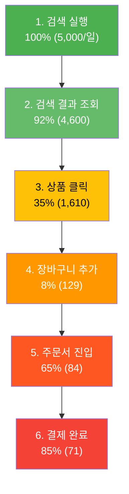
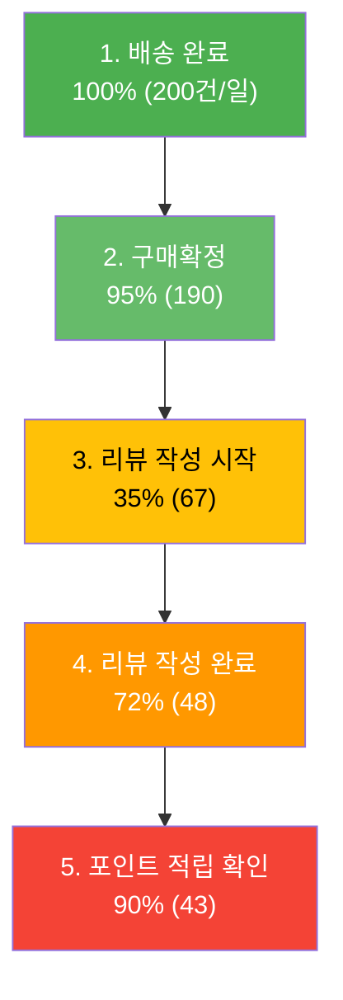
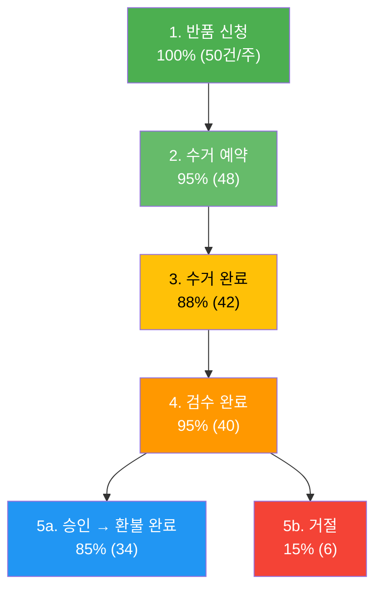

# Closet Phase 2 퍼널 분석 및 A/B 테스트 계획

> 작성일: 2026-04-04
> 프로젝트: Closet E-commerce Phase 2 (배송/재고/검색/리뷰)

---

## 1. 핵심 전환 퍼널

### 1.1 퍼널 A: 검색 퍼널

검색에서 시작하여 결제까지 도달하는 구매 전환 퍼널입니다.

#### 퍼널 다이어그램



#### 단계별 상세 분석

| 단계 | 설명 | 예상 전환율 | 예상 이탈률 | 이탈 원인 가설 |
|------|------|-----------|-----------|---------------|
| 1. 검색 실행 | 사용자가 키워드를 입력하고 검색 실행 | 100% (기준) | - | - |
| 2. 검색 결과 조회 | 검색 결과 페이지 로딩 완료 | 92% | 8% | (H1) 검색 응답 시간 > 500ms로 이탈, (H2) Zero Result(결과 없음)으로 즉시 이탈 |
| 3. 상품 클릭 | 검색 결과에서 상품 1개 이상 클릭 | 35% | 57% | (H3) 검색 결과 관련성 낮음(nori 형태소 분석 부정확), (H4) 썸네일/가격 정보 부족, (H5) 필터 미사용으로 원하는 상품 미노출 |
| 4. 장바구니 추가 | 상품 상세에서 장바구니 추가 | 8% | 27% | (H6) 원하는 사이즈/색상 품절, (H7) 가격 비교 목적 방문, (H8) 사이즈 정보 부족으로 구매 망설임 |
| 5. 주문서 진입 | 장바구니에서 주문서 페이지 진입 | 65% | 35% | (H9) 배송비 추가로 예상 금액 초과, (H10) 장바구니에 담아두고 나중에 구매 의향 |
| 6. 결제 완료 | PG 결제 완료 | 85% | 15% | (H11) 원하는 결제 수단 미지원, (H12) PG 결제 오류, (H13) 결제 과정 복잡 |

**전체 전환율 (검색 → 결제): 1.42%**

#### 개선 가설

| ID | 가설 | 타겟 단계 | 예상 개선 효과 | 우선순위 |
|----|------|----------|--------------|---------|
| SA-1 | 검색 결과 관련성 향상 (nori 사전 커스터마이징 + 유의어 사전 확장)을 하면 상품 클릭률이 35% → 42%로 증가한다 | 2→3 | +7%p CTR | P0 |
| SA-2 | 검색 결과에 리뷰 별점/리뷰 수를 표시하면 상품 클릭률이 35% → 40%로 증가한다 | 2→3 | +5%p CTR | P0 |
| SA-3 | 사이즈 후기 분포를 상품 상세에 표시하면 장바구니 추가율이 8% → 11%로 증가한다 | 3→4 | +3%p | P1 |
| SA-4 | 품절 상품에 "재입고 알림" 버튼을 노출하면 이탈률이 27% → 22%로 감소한다 | 3→4 | -5%p 이탈 | P1 |
| SA-5 | 자동완성에 인기 검색어를 함께 표시하면 검색 실행률이 15% 증가한다 | 진입→1 | +15% 검색 실행 | P2 |

---

### 1.2 퍼널 B: 리뷰 퍼널

배송 완료 후 리뷰를 작성하고 포인트를 적립받는 전환 퍼널입니다.

#### 퍼널 다이어그램



#### 단계별 상세 분석

| 단계 | 설명 | 예상 전환율 | 예상 이탈률 | 이탈 원인 가설 |
|------|------|-----------|-----------|---------------|
| 1. 배송 완료 | 택배사 API에서 배송 완료 확인 | 100% (기준) | - | - |
| 2. 구매확정 | 수동 구매확정 또는 자동 구매확정(7일) | 95% | 5% | (H14) 반품/교환 진행 중으로 구매확정 불가 |
| 3. 리뷰 작성 시작 | 리뷰 작성 페이지 진입 | 35% | 60% | (H15) 리뷰 작성 동기 부족(포인트 인지 부족), (H16) 리뷰 작성 진입점 찾기 어려움, (H17) 시간적 여유 부족 |
| 4. 리뷰 작성 완료 | 리뷰 텍스트/사진 업로드 후 제출 | 72% | 28% | (H18) 최소 20자 텍스트 요구로 부담, (H19) 사진 업로드 과정 번거로움 (5MB 제한), (H20) 사이즈 정보 입력 과정 복잡 |
| 5. 포인트 적립 확인 | 적립 완료 알림 확인 또는 포인트 내역 조회 | 90% | 10% | (H21) 비동기 처리로 즉시 적립이 안되어 혼란 |

**전체 전환율 (배송완료 → 리뷰 완료): 24%**

#### 리뷰 유형별 세부 전환

| 리뷰 유형 | 예상 비율 | 적립 포인트 | 월간 예상 건수 |
|----------|----------|-----------|-------------|
| 텍스트 리뷰 (사이즈 정보 X) | 55% | 100P | 792건 |
| 텍스트 리뷰 + 사이즈 정보 | 10% | 150P | 144건 |
| 포토 리뷰 (사이즈 정보 X) | 20% | 300P | 288건 |
| 포토 리뷰 + 사이즈 정보 | 15% | 350P | 216건 |
| **합계** | **100%** | **평균 192P** | **1,440건/월** |

#### 개선 가설

| ID | 가설 | 타겟 단계 | 예상 개선 효과 | 우선순위 |
|----|------|----------|--------------|---------|
| RV-1 | 구매확정 직후 리뷰 작성 푸시 알림을 보내면 리뷰 작성 시작률이 35% → 45%로 증가한다 | 2→3 | +10%p | P0 |
| RV-2 | 리뷰 작성 시 포인트 적립 금액을 실시간으로 표시("지금 작성하면 300P!")하면 작성 완료율이 72% → 80%로 증가한다 | 3→4 | +8%p | P0 |
| RV-3 | 텍스트 최소 글자수를 20자 → 10자로 낮추면 작성 완료율이 72% → 78%로 증가한다 | 3→4 | +6%p | P1 |
| RV-4 | 사이즈 정보 입력 UI를 탭 형태(작아요/딱맞아요/커요)로 간소화하면 사이즈 후기 포함률이 25% → 40%로 증가한다 | 3→4 | +15%p 사이즈 포함 | P1 |
| RV-5 | 포토 리뷰 작성 시 사진 자동 리사이즈(클라이언트 측)를 적용하면 업로드 실패율이 5% → 1%로 감소한다 | 3→4 | -4%p 실패율 | P2 |

---

### 1.3 퍼널 C: 반품 퍼널

반품 신청에서 환불 완료까지의 클레임 처리 퍼널입니다. 이 퍼널은 전환율을 높이는 것이 아니라, 처리 속도를 최적화하고 이탈(분쟁)을 최소화하는 방향으로 관리합니다.

#### 퍼널 다이어그램



#### 단계별 상세 분석

| 단계 | 설명 | 예상 전환율 | 예상 이탈률 | 이탈/지연 원인 가설 |
|------|------|-----------|-----------|-------------------|
| 1. 반품 신청 | 구매자가 반품 사유 선택 후 신청 | 100% (기준) | - | - |
| 2. 수거 예약 | 택배사 수거 예약 완료 | 95% | 5% | (H22) 수거 가능 일시 불일치(부재중), (H23) 반품 의사 철회 |
| 3. 수거 완료 | 택배사가 상품 수거 완료 | 88% | 7% | (H24) 고객 부재로 수거 실패(재시도 필요), (H25) 수거 지연(택배사 사정) |
| 4. 검수 완료 | 반품 상품 상태 검수 | 95% | 5% | (H26) 검수 인력 부족으로 지연, (H27) 상품 상태 확인 불가(포장 훼손) |
| 5a. 승인→환불 | 반품 승인 후 PG 환불 처리 | 85% | - | - |
| 5b. 거절 | 반품 거절 (사용 흔적, 태그 제거 등) | 15% | - | (H28) 거절 시 고객 불만 → CS 문의 증가 |

**전체 완료율 (반품 신청 → 환불 완료): 68%**
**평균 처리 기간: 7~10일 (목표: 5일 이내)**

#### 반품 사유 분포 (예상)

| 사유 | 비율 | 배송비 부담 | 금액 |
|------|------|-----------|------|
| SIZE_MISMATCH (사이즈 불일치) | 40% | 구매자 | 3,000원 |
| CHANGE_OF_MIND (단순 변심) | 30% | 구매자 | 3,000원 |
| DEFECTIVE (불량) | 20% | 판매자 | 0원 |
| WRONG_ITEM (오배송) | 10% | 판매자 | 0원 |

#### 개선 가설

| ID | 가설 | 타겟 단계 | 예상 개선 효과 | 우선순위 |
|----|------|----------|--------------|---------|
| RT-1 | 사이즈 후기(US-802)를 강화하면 SIZE_MISMATCH 반품이 40% → 25%로 감소한다 | 반품 예방 | -15%p 사이즈 반품 | P0 |
| RT-2 | 수거 예약 시 희망 날짜/시간대 선택 기능을 제공하면 수거 성공률이 88% → 95%로 증가한다 | 2→3 | +7%p | P1 |
| RT-3 | 반품 진행 상태를 실시간 알림(Kafka 이벤트 기반)으로 제공하면 CS 문의가 30% 감소한다 | 전체 | -30% CS 문의 | P1 |
| RT-4 | 반품 거절 시 상세 사유 + 사진 증거를 함께 제공하면 거절 관련 CS 재문의가 50% 감소한다 | 5b | -50% 재문의 | P2 |
| RT-5 | 교환(US-505) 옵션을 반품 신청 화면에 우선 노출하면 반품 중 20%가 교환으로 전환된다 | 반품→교환 전환 | -20% 반품, +20% 교환 | P2 |

---

## 2. A/B 테스트 계획

### 2.1 테스트 1: 검색 결과 리뷰 별점 노출

#### 기본 정보

| 항목 | 내용 |
|------|------|
| **테스트 ID** | AB-001 |
| **가설** | 검색 결과에 상품별 평균 별점과 리뷰 수를 함께 표시하면, 검색 결과 상품 클릭률(CTR)이 35%에서 40%로 증가한다 |
| **근거** | 무신사 검색 결과에서 리뷰 수/별점이 CTR에 유의미한 영향을 주는 것으로 알려져 있으며, 사회적 증거(social proof)가 클릭 의사결정에 영향을 미침 |

#### 실험 설계

| 항목 | 대조군 (Control) | 실험군 (Variant) |
|------|-----------------|-----------------|
| 검색 결과 카드 구성 | 썸네일 + 상품명 + 가격 | 썸네일 + 상품명 + 가격 + 별점(4.3) + 리뷰 수(120) |
| 데이터 소스 | 기존 ES 인덱스 | ES 인덱스 + review_summary 데이터 동기화 (US-804) |

#### 측정 지표

| 지표 | 유형 | 측정 방법 |
|------|------|----------|
| **검색 결과 CTR** | 핵심 | `search.result_click / search.query * 100` |
| 장바구니 추가율 | 보조 | `cart.add(source=search) / search.result_click * 100` |
| 검색→구매 전환율 | 보조 | 세션 기반 퍼널 |
| 평균 검색 결과 체류 시간 | 가드레일 | 세션 시간 측정 |

#### 표본 크기 및 기간

| 항목 | 수치 | 산출 근거 |
|------|------|----------|
| 현재 기준값 (baseline) | CTR 35% | 예상 전환율 |
| 최소 검출 효과 (MDE) | +5%p (35% → 40%) | 비즈니스 유의미 수준 |
| 유의 수준 (alpha) | 5% (양측) | 표준 |
| 통계적 검정력 (power) | 80% | 표준 |
| 그룹당 필요 표본 수 | **1,560건** | `n = 16 * p*(1-p) / MDE^2 = 16 * 0.35*0.65 / 0.05^2` |
| 일일 검색 트래픽 | 5,000건 | 예상 DAU 기반 |
| 예상 소요 기간 | **7일** | `(1,560 * 2) / (5,000 * 0.5) = 1.25일` (여유 포함 7일) |

#### 실행 계획

1. ES 인덱스에 `avgRating`, `reviewCount` 필드 동기화 확인 (US-804 의존)
2. BFF 검색 결과 응답에 별점/리뷰 수 포함
3. 프론트엔드에 A/B 분기 로직 구현 (Feature Flag: `SEARCH_RESULT_REVIEW_BADGE`)
4. 7일간 트래픽 50:50 분할
5. 결과 분석 후 승자 전체 적용

---

### 2.2 테스트 2: 리뷰 작성 유도 푸시 타이밍

#### 기본 정보

| 항목 | 내용 |
|------|------|
| **테스트 ID** | AB-002 |
| **가설** | 구매확정 직후(0시간) 리뷰 작성 푸시를 보내는 것이 24시간 후 보내는 것보다 리뷰 작성 시작률이 높다 (35% → 45%) |
| **근거** | 상품 수령 직후가 만족도/불만족도가 가장 높은 시점이며, 시간이 지날수록 리뷰 작성 의향이 감소함 |

#### 실험 설계

| 항목 | 대조군 (Control) | 실험군 A | 실험군 B |
|------|-----------------|---------|---------|
| 푸시 타이밍 | 구매확정 후 24시간 | 구매확정 즉시 (0시간) | 배송 완료 후 2시간 (구매확정 전) |
| 푸시 메시지 | "리뷰 작성하고 최대 350P 받으세요!" | 동일 | 동일 |
| 대상 | 구매확정 완료 사용자 | 구매확정 완료 사용자 | 배송 완료 사용자 |

#### 측정 지표

| 지표 | 유형 | 측정 방법 |
|------|------|----------|
| **리뷰 작성 시작률** | 핵심 | `review_page_enter / push_sent * 100` |
| 리뷰 작성 완료율 | 핵심 | `review_created / push_sent * 100` |
| 포토 리뷰 비율 | 보조 | `photo_review / total_review * 100` |
| 사이즈 후기 포함률 | 보조 | `size_info_review / total_review * 100` |
| 평균 별점 | 가드레일 | `AVG(rating)` (타이밍에 의한 별점 편향 체크) |

#### 표본 크기 및 기간

| 항목 | 수치 | 산출 근거 |
|------|------|----------|
| 현재 기준값 (baseline) | 리뷰 작성 시작률 35% | 예상 전환율 |
| 최소 검출 효과 (MDE) | +10%p (35% → 45%) | 비즈니스 유의미 수준 |
| 유의 수준 (alpha) | 5% (양측) | 표준 |
| 통계적 검정력 (power) | 80% | 표준 |
| 그룹당 필요 표본 수 | **365건** | `n = 16 * 0.35*0.65 / 0.10^2` |
| 일일 구매확정 건수 | 약 190건 | 배송 완료 200건 * 95% 확정율 |
| 예상 소요 기간 | **10일** | `(365 * 3) / (190 * 0.8) = 7.2일` (3그룹, 여유 포함 10일) |

#### 실행 계획

1. Kafka `order.confirmed` / `shipping.delivered` 이벤트 기반 알림 스케줄러 구현
2. 실험군 분배 로직 구현 (member_id % 3 기반)
3. Feature Flag: `REVIEW_PUSH_TIMING` (0=control, 1=variantA, 2=variantB)
4. 10일간 트래픽 33:33:34 분할
5. 결과 분석: 핵심 지표 유의성 검정 + 가드레일(별점 편향) 확인

---

### 2.3 테스트 3: 사이즈 후기 UI 간소화

#### 기본 정보

| 항목 | 내용 |
|------|------|
| **테스트 ID** | AB-003 |
| **가설** | 리뷰 작성 시 사이즈 정보 입력을 "작아요/딱맞아요/커요" 3단계 탭 UI로 간소화하면, 사이즈 후기 포함률이 25%에서 40%로 증가한다 |
| **근거** | 현재 키/몸무게/평소사이즈/구매사이즈/핏평가 5개 필드 입력이 부담되어 사이즈 정보를 건너뛰는 사용자가 많을 것으로 예상 |

#### 실험 설계

| 항목 | 대조군 (Control) | 실험군 (Variant) |
|------|-----------------|-----------------|
| 사이즈 입력 UI | 5개 필드 (키, 몸무게, 평소 사이즈, 구매 사이즈, 핏 평가) | 1단계: 핏 평가 3버튼 (작아요/딱맞아요/커요) + 2단계(선택): 키/몸무게 |
| 필수 입력 | 모두 선택 | 핏 평가만 필수, 나머지 선택 |
| 추가 포인트 | 50P (전체 입력 시) | 30P (핏 평가만) + 20P (키/몸무게 추가 시) |

#### 측정 지표

| 지표 | 유형 | 측정 방법 |
|------|------|----------|
| **사이즈 후기 포함률** | 핵심 | `size_info_review / total_review * 100` |
| 핏 평가만 입력 비율 | 보조 | `fit_only / size_info_review * 100` |
| 키/몸무게까지 입력 비율 | 보조 | `full_size_info / size_info_review * 100` |
| 리뷰 작성 완료율 | 가드레일 | `review_completed / review_started * 100` (간소화로 전체 완료율 영향 확인) |
| 리뷰 작성 소요 시간 | 보조 | `review_completed_at - review_started_at` (중앙값) |

#### 표본 크기 및 기간

| 항목 | 수치 | 산출 근거 |
|------|------|----------|
| 현재 기준값 (baseline) | 사이즈 후기 포함률 25% | 예상 전환율 |
| 최소 검출 효과 (MDE) | +15%p (25% → 40%) | 비즈니스 유의미 수준 |
| 유의 수준 (alpha) | 5% (양측) | 표준 |
| 통계적 검정력 (power) | 80% | 표준 |
| 그룹당 필요 표본 수 | **133건** | `n = 16 * 0.25*0.75 / 0.15^2` |
| 일일 리뷰 작성 건수 | 약 48건 | 퍼널 B 기준 |
| 예상 소요 기간 | **7일** | `(133 * 2) / (48 * 0.9) = 6.2일` (여유 포함 7일) |

#### 실행 계획

1. 리뷰 작성 UI에 사이즈 입력 간소화 버전 구현
2. Feature Flag: `REVIEW_SIZE_SIMPLE_UI` (Boolean)
3. 7일간 트래픽 50:50 분할
4. 결과 분석: 사이즈 후기 포함률 유의성 검정 + 가드레일(리뷰 완료율) 확인
5. 승자 확정 후 포인트 정책 조정

---

### 2.4 테스트 4: 검색 필터 기본 노출 방식

#### 기본 정보

| 항목 | 내용 |
|------|------|
| **테스트 ID** | AB-004 |
| **가설** | 검색 결과 페이지에서 인기 필터(카테고리/가격대)를 상단 칩 형태로 기본 노출하면, 필터 사용률이 15%에서 30%로 증가하고 검색→장바구니 전환율이 향상된다 |
| **근거** | 사이드바 필터는 발견성이 낮아 사용률이 저조하며, 무신사의 상단 필터 칩 UX가 높은 사용률을 보임 |

#### 실험 설계

| 항목 | 대조군 (Control) | 실험군 (Variant) |
|------|-----------------|-----------------|
| 필터 UI | 좌측 사이드바 필터 (접힌 상태) | 상단 수평 칩 필터 (카테고리/가격대/색상 기본 노출) + 사이드바 |
| facet 표시 | 사이드바 내 | 칩 위에 상품 수 뱃지 표시 |

#### 측정 지표

| 지표 | 유형 | 측정 방법 |
|------|------|----------|
| **필터 사용률** | 핵심 | `search.filter_apply / search.query * 100` |
| 검색→장바구니 전환율 | 핵심 | `cart.add(source=search) / search.query * 100` |
| 평균 필터 적용 횟수 | 보조 | `AVG(filter_apply_count per session)` |
| 검색 결과 체류 시간 | 가드레일 | 세션 시간 측정 |

#### 표본 크기 및 기간

| 항목 | 수치 | 산출 근거 |
|------|------|----------|
| 현재 기준값 (baseline) | 필터 사용률 15% | 예상 전환율 |
| 최소 검출 효과 (MDE) | +15%p (15% → 30%) | 비즈니스 유의미 수준 |
| 유의 수준 (alpha) | 5% (양측) | 표준 |
| 통계적 검정력 (power) | 80% | 표준 |
| 그룹당 필요 표본 수 | **91건** | `n = 16 * 0.15*0.85 / 0.15^2` |
| 일일 검색 트래픽 | 5,000건 | 예상 |
| 예상 소요 기간 | **3일** | `(91 * 2) / (5,000 * 0.5) = 0.07일` (최소 관찰 기간 3일) |

#### 실행 계획

1. 검색 결과 UI에 상단 칩 필터 컴포넌트 구현
2. Feature Flag: `SEARCH_CHIP_FILTER` (Boolean)
3. 3~7일간 트래픽 50:50 분할 (요일 효과 제거를 위해 최소 7일 권장)
4. 결과 분석 후 승자 전체 적용

---

## 3. A/B 테스트 실행 우선순위 종합

| 순위 | 테스트 ID | 테스트명 | 기간 | 의존 기능 | 예상 임팩트 |
|------|----------|---------|------|----------|-----------|
| 1 | AB-001 | 검색 결과 리뷰 별점 노출 | 7일 | US-804 (리뷰 집계) + US-701 (ES 인덱싱) | CTR +5%p -> GMV +3~5% |
| 2 | AB-002 | 리뷰 작성 유도 푸시 타이밍 | 10일 | US-503 (구매확정) + US-801 (리뷰) | 리뷰 작성률 +10%p -> 리뷰 콘텐츠 30% 증가 |
| 3 | AB-003 | 사이즈 후기 UI 간소화 | 7일 | US-802 (사이즈 후기) | 사이즈 후기 +15%p -> SIZE_MISMATCH 반품 감소 |
| 4 | AB-004 | 검색 필터 기본 노출 | 7일 | US-703 (필터) | 필터 사용률 +15%p -> 검색 전환율 향상 |

### 테스트 타임라인 (Phase 2 완료 후)

```
Week 1-2: AB-001 (검색 별점) + AB-004 (검색 필터) — 검색 도메인 동시 진행 가능
Week 2-3: AB-002 (리뷰 푸시 타이밍) — 리뷰 도메인
Week 3-4: AB-003 (사이즈 후기 UI) — AB-002 결과 반영 후 진행
```

---

## 4. 퍼널 모니터링 알림 규칙

퍼널 전환율이 기준치 이하로 떨어지면 Slack 알림을 발송합니다.

| 퍼널 | 단계 | 임계값 | 알림 채널 | 대응 |
|------|------|-------|----------|------|
| 검색 | Zero Result Rate | > 12% | #alert-search | 검색어 분석 + 유의어 사전 업데이트 |
| 검색 | CTR | < 25% | #alert-search | 검색 결과 관련성 점검 |
| 검색 | 검색→결제 전환율 | < 1% | #alert-growth | 퍼널 단계별 이탈 분석 |
| 리뷰 | 리뷰 작성률 | < 15% | #alert-review | 푸시 알림 + 포인트 인센티브 점검 |
| 리뷰 | 리뷰 작성 완료율 | < 60% | #alert-review | 작성 UX 점검 (이미지 업로드 실패 등) |
| 반품 | 반품률 | > 8% | #alert-cs | 사유별 분석 + 사이즈 후기 강화 |
| 반품 | 반품 처리 기간 | > 10일 | #alert-cs | 수거/검수 병목 분석 |
| 반품 | 반품 거절률 | > 25% | #alert-cs | 반품 정책/가이드 점검 |
