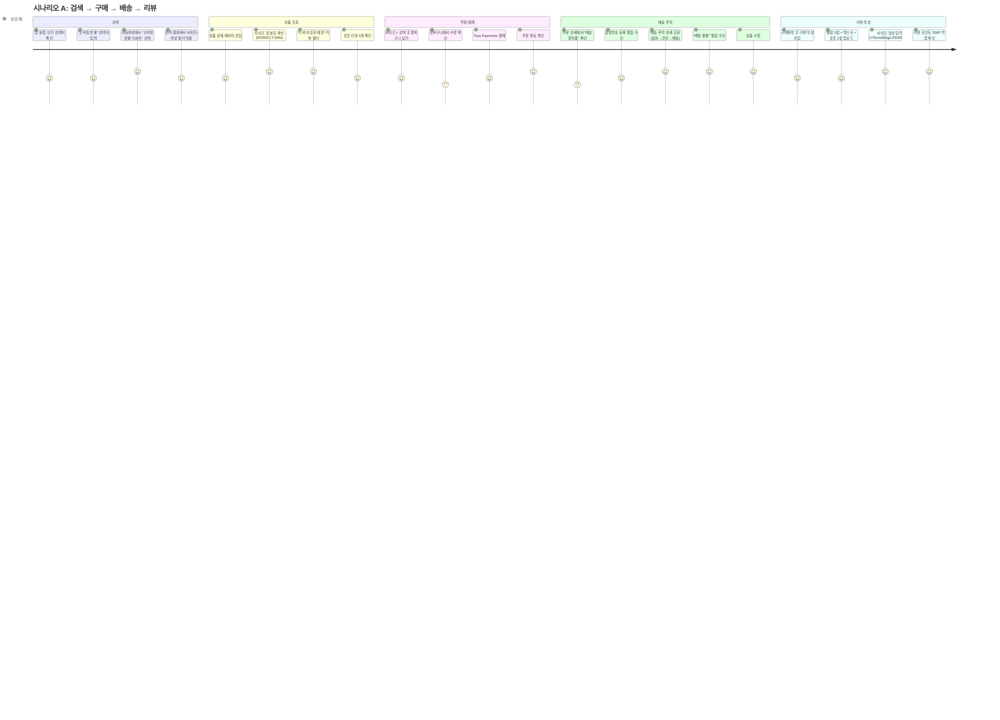
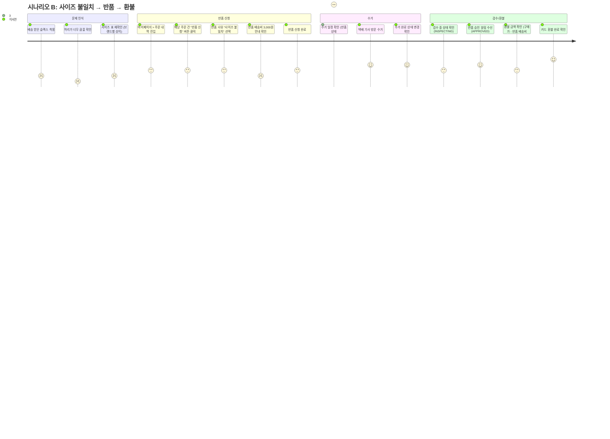
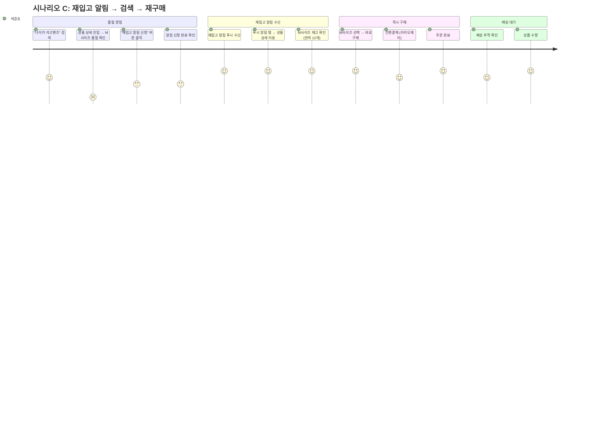

# Closet Phase 2 — UX Research

> 작성일: 2026-04-04
> 프로젝트: Closet E-commerce (무신사 벤치마킹)
> Phase: 2 (성장) — 배송 추적, 재고 관리, 검색, 리뷰
> 역할: UX Researcher

---

## 목차

1. [타깃 페르소나](#1-타깃-페르소나)
2. [사용자 여정 지도](#2-사용자-여정-지도)
3. [경쟁사 UX 벤치마킹](#3-경쟁사-ux-벤치마킹)
4. [정보 구조(IA) 제안](#4-정보-구조ia-제안)

---

## 1. 타깃 페르소나

### 페르소나 A: "트렌드 서퍼" — 김민재 (25세, 남성)

| 항목 | 내용 |
|------|------|
| **직업** | 스타트업 프론트엔드 개발자 (3년차) |
| **라이프스타일** | 판교 출퇴근, 퇴근 후 러닝/헬스, 인스타그램 스트리트 패션 피드 구독, 스니커즈 수집 |
| **월 의류 지출** | 약 15~25만원 |
| **쇼핑 빈도** | 주 2~3회 앱 브라우징, 월 3~4회 구매 |
| **선호 채널** | 모바일 앱 90%, PC 10% (회사 점심시간) |
| **평균 구매 단가** | 3~5만원 (티셔츠, 팬츠 위주) |

**쇼핑 행동 패턴:**
- 인스타그램에서 코디 영감을 받고 → 무신사/Closet에서 동일 아이템 검색합니다
- "반팔 오버핏", "카고팬츠 와이드" 같은 구체적 키워드로 검색합니다
- 리뷰에서 **체형 정보(175cm/68kg)** 와 **핏 사진**을 반드시 확인합니다
- 인기 검색어·트렌드 키워드에 민감하게 반응합니다
- 장바구니에 담아두고 할인 알림을 기다리는 경향이 있습니다

**니즈:**
- 내 체형과 비슷한 사람의 사이즈 리뷰를 보고 정확한 사이즈를 선택하고 싶습니다
- 검색 시 색상/사이즈 필터로 재고 있는 상품만 빠르게 걸러내고 싶습니다
- 주문 후 배송 상태를 실시간으로 확인하고 싶습니다

**페인포인트:**
- 사이즈 표기가 브랜드마다 달라서 교환이 잦습니다 (월 1회 이상 반품/교환 경험)
- 검색 결과에 품절 상품이 섞여 나오면 시간 낭비라고 느낍니다
- "배송중"이라는 단 한 줄 상태만 보이면 답답합니다

**Phase 2 연결점:**

| Phase 2 기능 | 연결 |
|-------------|------|
| 검색 (US-702~704) | 한글 형태소 분석 + 자동완성 → "오버핏 반팔" 정확 검색 |
| 필터 (US-703) | 색상/사이즈/가격 필터 → 재고 있는 상품만 노출 |
| 배송 추적 (US-502) | 실시간 트래킹 로그 → 배송 불안감 해소 |
| 사이즈 리뷰 (US-802) | 키/몸무게/핏 평가 → 교환율 감소 |
| 인기 검색어 (US-705) | 트렌드 파악 → 구매 전환율 향상 |

---

### 페르소나 B: "실용 쇼퍼" — 이서연 (32세, 여성)

| 항목 | 내용 |
|------|------|
| **직업** | 대기업 마케팅 팀장 (7년차) |
| **라이프스타일** | 강남 오피스 출퇴근, 주말 요가, 세미 미니멀 라이프, 출장 잦음 |
| **월 의류 지출** | 약 30~50만원 |
| **쇼핑 빈도** | 월 2~3회 집중 구매 (한 번에 여러 아이템) |
| **선호 채널** | PC 60% (회사), 모바일 40% (퇴근 후) |
| **평균 구매 단가** | 5~10만원 (블라우스, 슬랙스, 미니멀 아우터) |

**쇼핑 행동 패턴:**
- "오피스룩 슬랙스", "출장 자켓" 같은 TPO 기반 검색을 합니다
- 브랜드 필터를 적극 활용합니다 (COS, ZARA, Theory 등 선호 브랜드 고정)
- 리뷰 수 100개 이상, 평균 별점 4.0 이상 상품 위주로 구매합니다
- 한 번에 3~5개 상품을 주문하고, 맞지 않는 것은 반품 처리합니다
- 반품 프로세스가 복잡하면 재방문율이 급격히 떨어집니다

**니즈:**
- 반품/교환 절차가 3단계 이내로 간단해야 합니다
- 환불 처리 현황을 투명하게 확인하고 싶습니다
- 여러 건 동시 주문 시 묶음 배송 상태를 한눈에 보고 싶습니다

**페인포인트:**
- 반품 신청 후 수거 일정을 모르면 불안합니다 (현재 CS 전화 확인 필요)
- "사이즈 불일치"로 반품할 때 배송비 3,000원이 아깝다고 느낍니다
- 환불 완료 알림이 없어서 카드 내역을 직접 확인해야 합니다

**Phase 2 연결점:**

| Phase 2 기능 | 연결 |
|-------------|------|
| 반품/교환 (US-504, 505) | 간편 반품 → 반품 상태 실시간 트래킹 |
| 배송 추적 (US-502) | 여러 주문의 배송 현황 통합 조회 |
| 리뷰 필터 (US-801) | 별점순/포토리뷰 필터 → 빠른 의사결정 |
| 검색 필터 (US-703) | 브랜드/가격/카테고리 복합 필터 |
| 자동 구매확정 (US-503) | 7일 자동 확정 → 반품 가능 기간 명확 인지 |

---

### 페르소나 C: "가성비 헌터" — 박준호 (20세, 남성)

| 항목 | 내용 |
|------|------|
| **직업** | 대학생 (경영학과 2학년) |
| **라이프스타일** | 학교 통학, 동아리 활동, 중고거래 활발, 가격 비교 습관화 |
| **월 의류 지출** | 약 5~10만원 |
| **쇼핑 빈도** | 주 5~7회 앱 브라우징 (구경), 월 1~2회 구매 |
| **선호 채널** | 모바일 앱 100% |
| **평균 구매 단가** | 1~3만원 (기본템 위주) |

**쇼핑 행동 패턴:**
- 인기 검색어와 랭킹 페이지를 매일 확인합니다
- 가격순 정렬 + 최저가 필터를 가장 많이 사용합니다
- 리뷰 사진을 하나하나 꼼꼼히 확인합니다 (텍스트 리뷰는 건너뜀)
- 품절된 상품에 재입고 알림을 자주 신청합니다 (월 5~10건)
- 무료 배송 기준 금액을 맞추기 위해 장바구니에서 추가 상품을 탐색합니다

**니즈:**
- 품절 상품이 재입고되면 즉시 알림을 받고 싶습니다
- 가격대별 필터로 예산 내 상품만 빠르게 찾고 싶습니다
- 포토 리뷰만 모아보는 기능이 필요합니다

**페인포인트:**
- 재입고 알림을 신청해도 이미 품절되는 경우가 많습니다
- 검색 시 "맨투맨"과 "스웨트셔츠"가 다른 결과를 보여주면 혼란스럽습니다
- 배송비가 추가되면 최종 결제 금액이 예산을 초과합니다

**Phase 2 연결점:**

| Phase 2 기능 | 연결 |
|-------------|------|
| 재입고 알림 (US-604) | 품절 상품 재입고 즉시 푸시 → 구매 전환 |
| 인기 검색어 (US-705) | 트렌드 탐색 → 앱 체류 시간 증가 |
| 검색 유의어 (US-702) | "맨투맨"="스웨트셔츠" → 검색 만족도 향상 |
| 포토 리뷰 필터 (US-801) | photoOnly 필터 → 시각적 판단 지원 |
| 가격 필터 (US-703) | minPrice/maxPrice → 예산 내 상품 탐색 |

---

### 페르소나 D: "브랜드 로열리스트" — 최예은 (28세, 여성)

| 항목 | 내용 |
|------|------|
| **직업** | 프리랜서 그래픽 디자이너 |
| **라이프스타일** | 홈오피스, 카페 작업, 전시/팝업 스토어 방문, 인스타 스타일 블로거 |
| **월 의류 지출** | 약 20~40만원 |
| **쇼핑 빈도** | 주 3~4회 브라우징, 월 2~3회 구매 |
| **선호 채널** | 모바일 앱 80%, PC 20% |
| **평균 구매 단가** | 5~15만원 (디자이너 브랜드, 유니크 아이템) |

**쇼핑 행동 패턴:**
- 특정 브랜드를 팔로우하고 신상품 알림을 받습니다
- 상세한 리뷰를 직접 작성하며 (포토 리뷰 + 사이즈 정보), 리뷰 포인트를 적극 활용합니다
- 구매 후 스타일링 사진을 찍어 SNS에 공유합니다
- 배송 추적을 수시로 확인하며, 예상 도착일을 중요하게 생각합니다

**니즈:**
- 리뷰 작성 시 보상(포인트)이 충분해야 합니다
- 배송 예상 도착일이 정확해야 합니다
- "나와 비슷한 체형" 리뷰 필터가 정확하게 동작해야 합니다

**페인포인트:**
- 리뷰를 정성스럽게 작성해도 보상이 미미하면 동기가 줄어듭니다
- 배송 예정일이 틀리면 신뢰가 하락합니다
- 디자이너 브랜드는 사이즈 편차가 커서 사이즈 리뷰가 더 필요합니다

**Phase 2 연결점:**

| Phase 2 기능 | 연결 |
|-------------|------|
| 리뷰 포인트 (US-803) | 포토 300P + 사이즈 50P = 350P → 리뷰 작성 동기 |
| 사이즈 후기 (US-802) | 키/몸무게/핏 평가 → 커뮤니티 기여감 |
| 배송 추적 (US-502) | 예상 도착일 + 실시간 로그 → 신뢰도 향상 |
| 검색 자동완성 (US-704) | 브랜드명 자동완성 → 빠른 탐색 |
| 리뷰 집계 (US-804) | 별점 분포 시각화 → 구매 결정 근거 |

---

## 2. 사용자 여정 지도

### 시나리오 A: 검색 → 상품 조회 → 주문 → 결제 → 배송 추적 → 리뷰 작성

> **페르소나:** 김민재 (25세, 트렌드 서퍼)
> **목표:** 여름 오버핏 반팔 티셔츠 구매 후 사이즈 리뷰 작성



#### 단계별 상세 분석

| 단계 | 행동 | 감정 | 터치포인트 | 이탈 포인트 | 개선 기회 |
|------|------|------|-----------|------------|----------|
| **검색 진입** | 앱 실행 → 인기 검색어 확인 | 호기심 (보통) | 홈 화면, 인기 검색어 Top 10 | 인기 검색어가 관심사와 무관하면 이탈 | 성별/연령 기반 개인화 인기 검색어 (Phase 3) |
| **키워드 입력** | "오버핏 반팔" 입력 | 기대 (높음) | 검색바, 자동완성 드롭다운 | 자동완성 지연(50ms 초과)이면 직접 입력 후 부정확한 결과 | 자동완성 응답 50ms 이내 유지 (US-704) |
| **필터 적용** | 사이즈 L + 블랙 색상 필터 | 효율적 (높음) | 필터 UI (사이드 패널/칩) | 재고 없는 옵션이 필터에 포함되면 실망 | 재고 0인 옵션은 비활성화 처리 |
| **사이즈 리뷰 확인** | "나와 비슷한 체형" 리뷰 탐색 | 안심 (매우 높음) | 사이즈 핏 분포 차트, 체형 필터 | 비슷한 체형 리뷰가 5건 미만이면 불안 | 사이즈 리뷰 작성 유도 팝업 (300P 강조) |
| **결제** | Toss Payments 간편결제 | 신속 (높음) | 결제 페이지, PG 위젯 | 결제 수단 추가 절차가 길면 이탈 | 최근 결제 수단 자동 선택 |
| **배송 추적** | 트래킹 로그 시간순 확인 | 안심 (매우 높음) | 마이페이지 > 주문 상세 > 배송 추적 | "배송중" 한 줄만 표시되면 불안 | 단계별 트래킹 로그 + 예상 도착일 (US-502) |
| **리뷰 작성** | 포토 + 사이즈 정보 작성 | 보람 (높음) | 리뷰 작성 폼, 이미지 업로더 | 이미지 업로드 5MB 제한 초과 시 에러 | 자동 이미지 압축 + 크롭 UI |
| **포인트 적립** | 350P 적립 확인 | 만족 (매우 높음) | 리뷰 완료 화면, 포인트 내역 | 적립 금액이 보이지 않으면 보상 인지 부족 | 리뷰 완료 시 적립 금액 Toast 알림 |

---

### 시나리오 B: 배송 받은 상품 사이즈 불일치 → 반품 신청 → 수거 → 환불

> **페르소나:** 이서연 (32세, 실용 쇼퍼)
> **목표:** L사이즈 슬랙스가 너무 커서 반품 후 환불



#### 단계별 상세 분석

| 단계 | 행동 | 감정 | 터치포인트 | 이탈 포인트 | 개선 기회 |
|------|------|------|-----------|------------|----------|
| **문제 인식** | 상품 착용 후 사이즈 불일치 확인 | 실망 (매우 낮음) | 실물 상품 | 반품 절차를 모르면 CS 전화 → 대기 시간 불만 | 주문 상세에서 "반품 신청" 버튼 눈에 띄게 배치 |
| **반품 사유 선택** | "SIZE_MISMATCH" 선택 | 번거로움 (낮음) | 반품 신청 폼 | 사유가 4개뿐이라 해당 없으면 기타 입력 필요 | 사유별 FAQ 링크 + 기타 사유 텍스트 입력 |
| **배송비 안내** | 반품 배송비 3,000원 부담 안내 | 불만 (낮음) | 반품 비용 안내 모달 | 배송비 부담 기준이 불명확하면 CS 문의 증가 | 사유별 배송비 부담 주체 명시 (판매자/구매자) |
| **수거 일정 확인** | PICKUP_SCHEDULED 상태 확인 | 불안 → 안심 | 반품 상태 트래커 | 수거 일정이 안 보이면 "언제 오는지" 불안 | 수거 예정일 + 택배 기사 연락처 노출 |
| **검수 대기** | INSPECTING 상태 확인 | 초조 (보통) | 반품 상태 페이지 | 검수 소요 시간 불명확 → 환불 언제? 불안 | "검수 평균 1~2영업일" 예상 소요 시간 안내 |
| **환불 확인** | APPROVED + 환불 금액 확인 | 안도 (높음) | 푸시 알림, 마이페이지 | 환불 완료 알림이 없으면 카드사 직접 확인 | 환불 완료 시 푸시 알림 + 환불 상세 내역 |

**핵심 이탈 포인트:** 반품 프로세스 중 **수거 일정 미고지**와 **검수 소요 시간 불명확**이 가장 큰 불안 요인입니다. 각 단계별 예상 소요 시간과 현재 상태를 명확하게 보여주는 것이 핵심입니다.

---

### 시나리오 C: 재입고 알림 → 검색 → 재구매

> **페르소나:** 박준호 (20세, 가성비 헌터)
> **목표:** 품절된 나이키 카고팬츠 M사이즈 재입고 시 즉시 구매



#### 단계별 상세 분석

| 단계 | 행동 | 감정 | 터치포인트 | 이탈 포인트 | 개선 기회 |
|------|------|------|-----------|------------|----------|
| **품절 확인** | M사이즈 옵션 선택 → "품절" 표시 | 실망 (매우 낮음) | 상품 상세 옵션 선택 UI | 품절 표시가 불명확하면 결제 시도 후 에러 | 옵션 버튼에 "품절" 뱃지 + 비활성화 |
| **재입고 알림 신청** | "재입고 알림" 버튼 클릭 | 기대 (보통) | 상품 상세 하단 버튼 | 알림 신청 버튼이 눈에 안 띄면 포기 | 품절 옵션 선택 시 자동 알림 신청 유도 모달 |
| **알림 수신** | 푸시 알림 "나이키 카고팬츠 M 재입고!" | 흥분 (매우 높음) | 푸시 알림, 앱 딥링크 | 알림이 늦으면 이미 재품절 | inventory.restock → 알림 발송 지연 최소화 (10초 이내) |
| **재고 확인** | M사이즈 잔여 재고 12개 확인 | 안심 (높음) | 상품 상세 옵션 UI | 잔여 재고가 안 보이면 다시 품절될까 불안 | "잔여 12개" 남은 수량 표시 (긴급 구매 유도) |
| **즉시 구매** | "바로 구매" 원클릭 | 조급 → 만족 | 바로 구매 버튼, PG 위젯 | 결제 과정이 길면 재품절 위험 | 알림 → 상품 상세 딥링크 + "바로 구매" CTA |
| **배송 대기** | 배송 추적 확인 | 기대 (높음) | 마이페이지 배송 추적 | 특이사항 없음 | 배송 완료 후 리뷰 작성 유도 |

**핵심 이탈 포인트:** 재입고 알림 **발송 지연**이 가장 치명적입니다. 인기 상품은 재입고 후 수 분 내 재품절되므로, `inventory.restock_notification` 이벤트 처리 시간을 10초 이내로 보장해야 합니다.

---

## 3. 경쟁사 UX 벤치마킹

### 비교 대상
- **무신사** (MUSINSA): 국내 1위 패션 이커머스 (MAU 800만+)
- **올리브영** (Olive Young): 뷰티/헬스 옴니채널 커머스 (물류 시스템 벤치마킹)
- **29CM**: 프리미엄 셀렉트숍 커머스 (UX 디자인 우수)

### 3-1. 검색 UX 비교

| 패턴 | 무신사 | 올리브영 | 29CM | Closet 제안 |
|------|--------|---------|------|-------------|
| **검색바 위치** | 상단 고정, 홈 화면 중앙 배치 | 상단 고정, 카테고리와 통합 | 상단 미니멀 검색 아이콘 → 전체화면 전환 | 상단 고정 + 전체화면 전환 (29CM 참고) |
| **자동완성** | 2글자부터 실시간 추천, 카테고리/브랜드 구분 표시 | 인기 검색어 + 자동완성 혼합, 최근 검색어 노출 | 2글자부터 추천, 추천 상품 썸네일 함께 노출 | 2글자부터, 상품명/브랜드/카테고리 구분 (US-704) |
| **인기 검색어** | Top 20, 실시간 갱신, 순위 변동(UP/DOWN/NEW) 표시, 성별 탭 | Top 10, 1시간 갱신, 카테고리별 인기 검색어 | 편집팀 큐레이션 키워드, 비실시간 | Top 10, 1시간 갱신, 순위 변동 표시 (US-705) |
| **필터 구조** | 좌측 사이드바 + 상단 칩, 카테고리>서브 카테고리 드릴다운, 가격 슬라이더 | 상단 수평 필터 바, 탭으로 전환, 쿠폰 적용가 필터 | 상단 칩 기반, 최소한의 필터(카테고리/브랜드/가격) | 상단 칩 + 사이드 패널 복합 (US-703) |
| **필터 결과** | facet count 표시, 필터 조합 시 즉시 갱신, URL 파라미터 연동 | facet count 표시, 매장 재고 연동 | facet count 미표시, 결과 개수만 표시 | facet count 표시 + 즉시 갱신 (무신사 참고) |
| **정렬 옵션** | 인기순/신상품순/낮은가격순/높은가격순/할인율순/리뷰많은순 | 추천순/판매순/낮은가격순/높은가격순/신상품순/평점순 | 추천순/인기순/최신순/낮은가격순/높은가격순 | 관련도순/최신순/가격(오름/내림)/인기순 (US-702) |
| **검색 결과 없음** | "이 키워드는 어때요?" 추천, 유사 검색어 제안 | 인기 상품 추천, 카테고리 바로가기 | 큐레이션 상품 추천 | 오타 교정 제안 + 인기 검색어 노출 (US-702) |

**핵심 인사이트:**
- 무신사의 **facet count + 실시간 갱신** 패턴이 필터 UX의 표준입니다. Closet도 이를 따라야 합니다.
- 29CM의 **전체화면 검색 전환** 패턴이 몰입감이 높습니다. 자동완성 + 인기 검색어를 한 화면에 배치할 수 있습니다.
- 무신사의 **성별 탭 기반 인기 검색어**는 패션 플랫폼에 필수적인 패턴입니다.

---

### 3-2. 배송 추적 UX 비교

| 패턴 | 무신사 | 올리브영 | 29CM | Closet 제안 |
|------|--------|---------|------|-------------|
| **배송 상태 표시** | 5단계 스텝바 (결제완료→상품준비→배송시작→배송중→배송완료) | 4단계 스텝바 (주문접수→상품준비→배송중→배송완료), 물류센터 출고 시점 표시 | 3단계 심플 스텝바 (준비중→배송중→완료) | 5단계 스텝바 (READY→PICKED_UP→IN_TRANSIT→OUT_FOR_DELIVERY→DELIVERED) |
| **트래킹 로그** | 택배사 API 연동, 시간순 로그 리스트, "집하→간선→배달" 위치 표시 | 자체 물류 + 택배사 혼합, 물류센터 출고 상세 로그, 시간순 리스트 | 택배사 API 연동, 간결한 로그 리스트 | 시간순 로그 리스트 + 위치 정보 (US-502) |
| **예상 도착일** | "내일 도착 예정" 텍스트 표시, 택배사 API 기반 | 도착 예정일 + 시간대 표시 ("오후 2시~6시"), 물류센터 기반 정확도 높음 | "N일 이내 도착" 범위 표시 | 예상 도착일 텍스트 표시 (US-502 estimatedDelivery) |
| **알림** | 주요 상태 변경 시 앱 푸시, 카카오톡 알림 | 출고/배송시작/배송완료 푸시, 도착 1시간 전 알림 | 배송시작/완료 푸시 | 상태 변경 시 Kafka 이벤트 → 푸시 (Phase 3) |
| **묶음 배송** | 동일 판매자 묶음, 배송비 안내 | 물류센터 단위 묶음, 분리 배송 시 안내 | 묶음 배송 미지원 (개별 배송) | Phase 2에서는 개별 배송, 추후 묶음 배송 |
| **외부 추적 연동** | "택배사 사이트에서 보기" 링크, CJ/롯데/로젠 등 | 자체 물류라 외부 연동 최소화 | "택배사에서 직접 확인" 링크 | Mock 택배사 4개 연동 (CJ/로젠/롯데/우체국) |

**핵심 인사이트:**
- 올리브영의 **도착 시간대 예측** ("오후 2시~6시")이 사용자 만족도가 가장 높습니다. 자체 물류 기반이라 가능한 수준이지만, 택배사 API 데이터로 범위 예측을 시도할 수 있습니다.
- 무신사의 **5단계 스텝바** 패턴이 패션 이커머스 표준입니다. Closet도 5단계로 구현합니다.
- 올리브영의 **도착 1시간 전 알림**은 사용자 경험을 크게 향상시키는 패턴입니다 (Phase 3 알림 서비스에서 구현 권장).

---

### 3-3. 리뷰 UX 비교

| 패턴 | 무신사 | 올리브영 | 29CM | Closet 제안 |
|------|--------|---------|------|-------------|
| **리뷰 점수 표시** | 별점 평균 + 별점 분포 바 차트 + 리뷰 수, 상품 목록에도 별점 표시 | 별점 평균 + 분포 + 리뷰 수, "뷰티 컨설턴트 추천" 뱃지 | 별점 평균 + 리뷰 수 (심플), 에디터 추천 뱃지 | 별점 평균 + 분포 바 차트 + 리뷰 수 (US-804) |
| **사이즈 리뷰** | **핵심 차별화:** 키/몸무게/평소사이즈 입력, "작아요/딱맞아요/커요" 비율 바, "나와 비슷한 체형" 필터 | 피부 타입/나이대 필터 (뷰티 특화), 사이즈 리뷰 없음 | 사이즈 리뷰 없음, 텍스트 리뷰에 의존 | 키/몸무게/핏 평가 + "나와 비슷한 체형" 필터 (US-802) |
| **포토 리뷰** | 포토/영상 탭 분리, 리뷰 이미지 갤러리 뷰, 포토 리뷰만 필터 가능 | 포토 리뷰 탭, 성분/효과 태그, 이미지 갤러리 | 포토 리뷰 필터, 풀스크린 이미지 뷰어 | 포토 리뷰 탭 + photoOnly 필터 (US-801) |
| **리뷰 정렬** | 최신순/추천순/평점높은순/평점낮은순 | 추천순/최신순/평점높은순/평점낮은순 | 최신순/도움순 (2가지만) | 최신순/높은평점순/낮은평점순/도움순 (US-801) |
| **리뷰 보상** | 텍스트 500원, 포토 1,000원, 한달사용 1,500원, 스타일 500원 | 텍스트 100P, 포토 300P, 영상 500P | 텍스트 300P, 포토 500P | 텍스트 100P, 포토 300P, 사이즈 정보 +50P (US-803) |
| **리뷰 도움됐어요** | "도움이 됐어요" 카운트, 리뷰 정렬 기준으로 활용 | "도움이 됐어요" 카운트 | "도움이 됐어요" 카운트 | helpful_count 기반 정렬 (US-801) |
| **리뷰 작성 유도** | 구매확정 후 리뷰 작성 알림, 마이페이지 "작성 가능한 리뷰" 뱃지 | 구매 7일 후 리뷰 작성 알림 푸시 | 구매확정 후 리뷰 알림 | 구매확정 이벤트 (order.confirmed) → 리뷰 작성 유도 |

**핵심 인사이트:**
- 무신사의 **사이즈 리뷰 시스템**은 패션 이커머스의 킬러 기능입니다. "나와 비슷한 체형" 필터는 반품률을 평균 15~20% 감소시키는 것으로 알려져 있습니다. Closet Phase 2에서 반드시 구현해야 합니다.
- 리뷰 보상 금액은 경쟁사 대비 낮은 편입니다 (무신사 텍스트 500원 vs Closet 100P). 초기에는 보상을 높여 리뷰 데이터를 축적하는 전략을 고려해야 합니다.
- 올리브영의 **성분/효과 태그** 패턴을 패션에 맞게 변환하면 "소재감/핏감/가성비" 태그로 활용할 수 있습니다 (Phase 3 고려).

---

### 3-4. 반품 UX 비교

| 패턴 | 무신사 | 올리브영 | 29CM | Closet 제안 |
|------|--------|---------|------|-------------|
| **반품 신청 진입** | 마이페이지 > 주문 상세 > "반품/교환" 버튼, 개별 상품 단위 | 마이페이지 > 주문 상세 > "반품/교환" 버튼, CS 채팅 연동 | 마이페이지 > 주문 상세 > "반품 요청", CS 이메일 연동 | 주문 상세 > "반품 신청" 버튼, 개별 상품 단위 (US-504) |
| **반품 사유** | 드롭다운 선택 + 상세 사유 텍스트, 사진 첨부 가능 (불량 증거) | 드롭다운 선택 + 상세 사유, 사진 필수 (불량/파손) | 드롭다운 선택 + 텍스트, 사진 선택 | 드롭다운 4종 + 상세 사유 텍스트 (US-504) |
| **배송비 안내** | 사유 선택 시 배송비 부담 주체 즉시 표시, 금액 명시 | 사유별 배송비 부담 안내, 무료 반품 쿠폰 제공 시 표시 | 사유 선택 시 배송비 안내, "무료 반품" 뱃지 상품 존재 | 사유별 자동 계산 (단순변심 3,000원/불량 0원) (US-504) |
| **수거 방식** | 자동 수거 접수 (택배사 연동), 편의점 반품 옵션, 방문 수거 예약 | 매장 반품 + 택배 반품, 자동 수거 접수 | 자동 수거 접수, CJ대한통운 고정 | 자동 수거 접수 (택배사 API 연동) |
| **반품 상태 추적** | 5단계 표시 (신청→수거예정→수거완료→검수중→완료), 실시간 업데이트 | 4단계 표시, 매장/물류 분리 추적 | 3단계 심플 표시 (신청→진행중→완료) | 5단계 (REQUESTED→PICKUP_SCHEDULED→PICKUP_COMPLETED→INSPECTING→APPROVED/REJECTED) |
| **환불 안내** | 환불 예정일 표시, 결제 수단별 환불 소요 기간 안내, 부분 환불 지원 | 환불 예정일 + 금액 명시, 포인트/카드 분리 환불 | 환불 완료 시 알림, 소요 기간 안내 | 환불 금액 명시 + 결제 취소 API 연동 (US-504) |
| **교환 프로세스** | 반품 + 재주문 자동화, 동일 상품 사이즈 교환 지원 | 교환 불가 (반품 후 재주문 안내) | 교환 불가 (반품 후 재주문) | 동일 상품 다른 옵션 교환 지원 (US-505) |

**핵심 인사이트:**
- 무신사의 **편의점 반품** 옵션은 MZ 세대 사용자의 만족도를 크게 높이는 패턴입니다 (Phase 3 고려).
- 올리브영의 **매장 반품** 옵션은 옴니채널 전략이지만 온라인 전용인 Closet에는 해당 없습니다.
- Closet이 경쟁사 대비 차별화할 수 있는 포인트는 **교환 기능**입니다. 올리브영과 29CM은 교환을 지원하지 않지만, Closet은 Phase 2에서 사이즈 교환을 지원합니다 (US-505).

---

## 4. 정보 구조(IA) 제안

### 4-1. 카테고리 네비게이션 구조

Phase 2에서 검색 서비스 도입과 함께 카테고리 구조를 정비해야 합니다. 무신사의 계층 구조를 참고합니다.

```
Closet 카테고리 구조 (3 depth)
├── 상의 (TOP)
│   ├── 반팔 티셔츠
│   ├── 긴팔 티셔츠
│   ├── 맨투맨/스웨트셔츠
│   ├── 후드/집업
│   ├── 셔츠/블라우스
│   ├── 니트/스웨터
│   └── 민소매/슬리브리스
│
├── 하의 (BOTTOM)
│   ├── 데님 팬츠
│   ├── 코튼 팬츠
│   ├── 슬랙스
│   ├── 숏팬츠
│   ├── 트레이닝/조거
│   ├── 레깅스
│   └── 스커트
│
├── 아우터 (OUTER)
│   ├── 후드 집업
│   ├── 블루종/MA-1
│   ├── 레더/라이더스
│   ├── 트러커 재킷
│   ├── 코트
│   ├── 패딩/다운
│   └── 가디건
│
├── 원피스/세트 (DRESS)
│   ├── 미니 원피스
│   ├── 미디/롱 원피스
│   └── 투피스/세트
│
├── 신발 (SHOES)
│   ├── 스니커즈
│   ├── 부츠
│   ├── 로퍼
│   ├── 샌들/슬리퍼
│   └── 구두
│
├── 가방 (BAG)
│   ├── 백팩
│   ├── 크로스백
│   ├── 토트백
│   ├── 숄더백
│   └── 클러치/파우치
│
└── 액세서리 (ACC)
    ├── 모자
    ├── 양말
    ├── 아이웨어
    ├── 주얼리
    ├── 벨트
    └── 시계
```

**네비게이션 패턴 제안:**

| 패턴 | 적용 위치 | 설명 |
|------|----------|------|
| **메가 메뉴** | PC 상단 GNB | 대카테고리 호버 시 중/소 카테고리 드롭다운 |
| **하단 탭 바** | 모바일 하단 | 홈/카테고리/검색/마이 4탭 |
| **드릴다운** | 모바일 카테고리 페이지 | 대카테고리 → 중카테고리 → 상품 목록 |
| **브레드크럼** | 상품 상세 상단 | "홈 > 상의 > 반팔 티셔츠" |
| **성별 탭** | 카테고리 최상위 | "남성 / 여성 / 공용" 탭으로 분리 |

---

### 4-2. 검색 필터 UI 패턴

Phase 2 검색 서비스(US-703)의 필터 UI 구조를 제안합니다.

#### 필터 영역 레이아웃

```
┌────────────────────────────────────────────────────┐
│ 검색바: [🔍 오버핏 반팔                    ✕ ]    │
├────────────────────────────────────────────────────┤
│ 정렬: [관련도순 ▼] [최신순] [낮은가격순] [인기순] │
├────────────────────────────────────────────────────┤
│ 필터 칩: [상의 ✕] [블랙 ✕] [M ✕] [전체 해제]    │
├───────────┬────────────────────────────────────────┤
│ 필터 패널 │  상품 목록                              │
│           │                                        │
│ 카테고리  │  ┌──────┐ ┌──────┐ ┌──────┐           │
│ ▸ 상의    │  │ 상품1 │ │ 상품2 │ │ 상품3 │           │
│   하의    │  │ ★4.5  │ │ ★4.2  │ │ ★4.8  │           │
│   아우터  │  │ 19,900│ │ 29,000│ │ 35,000│           │
│           │  └──────┘ └──────┘ └──────┘           │
│ 브랜드    │                                        │
│ □ Nike(15)│  ┌──────┐ ┌──────┐ ┌──────┐           │
│ □ Adidas  │  │ 상품4 │ │ 상품5 │ │ 상품6 │           │
│   (10)    │  └──────┘ └──────┘ └──────┘           │
│           │                                        │
│ 가격      │  총 150개 상품                          │
│ [▓▓▓░░░]  │  [1] [2] [3] ... [8]                   │
│ 0~100,000 │                                        │
│           │                                        │
│ 색상      │                                        │
│ ● ● ● ●  │                                        │
│ 블랙 화이트│                                       │
│           │                                        │
│ 사이즈    │                                        │
│ [S][M][L] │                                        │
│ [XL][XXL] │                                        │
└───────────┴────────────────────────────────────────┘
```

#### 필터 유형별 UI 패턴

| 필터 | UI 패턴 | 상세 |
|------|---------|------|
| **카테고리** | 좌측 리스트 + 드릴다운 | 대카테고리 클릭 → 소카테고리 펼침, 선택 시 facet count 표시 |
| **브랜드** | 체크박스 리스트 + 검색 | 복수 선택, 5개 이상이면 "더보기" + 브랜드명 검색, facet count |
| **가격** | 범위 슬라이더 + 프리셋 칩 | ~3만원 / 3~5만원 / 5~10만원 / 10만원~ 프리셋 + 직접 입력 |
| **색상** | 색상 스와치 원형 버튼 | 복수 선택, 선택 시 체크 표시, facet count |
| **사이즈** | 칩(Chip) 버튼 그룹 | S/M/L/XL/XXL/FREE, 복수 선택, 품절 사이즈 비활성화 |

#### 모바일 필터 패턴

| 패턴 | 설명 |
|------|------|
| **바텀 시트** | "필터" 버튼 탭 → 바텀 시트 올라옴 (무신사 패턴) |
| **수평 스크롤 칩** | 상단에 적용된 필터 칩 수평 스크롤 |
| **적용/초기화 버튼** | 바텀 시트 하단 고정 "N개 상품 보기" / "전체 초기화" |
| **실시간 갱신** | 필터 변경 시 상품 수 즉시 업데이트 ("153개 상품 보기") |

---

### 4-3. 마이페이지 > 주문/배송/반품 정보 구조

Phase 2에서 배송 추적, 반품/교환 기능이 추가되면서 마이페이지 구조를 재설계해야 합니다.

```
마이페이지
├── 📊 주문 현황 대시보드 (상단 요약)
│   ├── 결제 완료 (N)
│   ├── 배송 준비 (N)
│   ├── 배송중 (N)
│   ├── 배송 완료 (N)
│   └── 구매 확정 (N)
│
├── 📦 주문/배송 조회
│   ├── 주문 목록 (기간 필터: 1주/1개월/3개월/6개월)
│   │   ├── 주문 카드
│   │   │   ├── 주문 번호 / 주문일
│   │   │   ├── 상품 정보 (이미지 + 이름 + 옵션 + 수량)
│   │   │   ├── 주문 상태 뱃지 (색상 구분)
│   │   │   ├── [배송 추적] 버튼 (배송중일 때)
│   │   │   ├── [구매 확정] 버튼 (배송 완료일 때)
│   │   │   ├── [반품 신청] 버튼 (배송 완료 후 7일 이내)
│   │   │   ├── [교환 신청] 버튼 (배송 완료 후 7일 이내)
│   │   │   └── [리뷰 작성] 버튼 (구매 확정 후)
│   │   └── ...
│   │
│   └── 주문 상세
│       ├── 주문 정보 (번호, 일시, 결제 수단, 금액)
│       ├── 상품 정보 (주문 아이템 리스트)
│       ├── 배송 정보
│       │   ├── 수령인 / 연락처 / 주소
│       │   ├── 택배사 / 송장번호
│       │   └── 배송 추적 (트래킹 로그 타임라인)
│       │       ├── ● 배송 완료 — 2026-04-04 14:00 서울시 강남구
│       │       ├── ● 배달 출발 — 2026-04-04 08:00 강남 배달점
│       │       ├── ● 간선 상차 — 2026-04-03 22:00 용인 허브
│       │       └── ● 상품 인수 — 2026-04-03 15:00 강남 집하점
│       └── 결제 정보 (상품금액, 배송비, 할인, 최종결제)
│
├── 🔄 반품/교환 내역
│   ├── 반품 목록
│   │   └── 반품 카드
│   │       ├── 반품 번호 / 신청일
│   │       ├── 상품 정보
│   │       ├── 반품 사유
│   │       ├── 반품 상태 트래커 (5단계 스텝바)
│   │       │   ├── [●] 반품 신청 — 2026-04-01
│   │       │   ├── [●] 수거 예정 — 2026-04-02
│   │       │   ├── [●] 수거 완료 — 2026-04-03
│   │       │   ├── [○] 검수 중
│   │       │   └── [○] 처리 완료
│   │       └── 예상 환불 금액 / 배송비 부담 안내
│   │
│   └── 교환 목록
│       └── 교환 카드
│           ├── 교환 번호 / 신청일
│           ├── 원래 옵션 → 교환 옵션
│           ├── 교환 상태 트래커 (5단계)
│           │   ├── [●] 교환 신청
│           │   ├── [●] 수거 예정
│           │   ├── [○] 수거 완료
│           │   ├── [○] 재배송중
│           │   └── [○] 교환 완료
│           └── 교환 배송비 안내
│
├── ⭐ 리뷰 관리
│   ├── 작성 가능한 리뷰 (뱃지: N건)
│   │   └── 리뷰 작성 카드 (구매확정 상품 리스트)
│   │       ├── 상품 정보
│   │       ├── 예상 적립 포인트 ("포토 리뷰 작성 시 최대 350P!")
│   │       └── [리뷰 작성] CTA 버튼
│   │
│   └── 작성한 리뷰 (내 리뷰 리스트)
│       └── 리뷰 카드
│           ├── 상품 정보 + 별점
│           ├── 리뷰 내용 + 이미지
│           ├── 적립 포인트 내역
│           ├── 도움이 됐어요 (N명)
│           └── [수정] / [삭제] 버튼
│
├── 🔔 재입고 알림
│   ├── 대기중 알림 리스트 (WAITING)
│   │   └── 상품 카드
│   │       ├── 상품 이미지 + 이름
│   │       ├── 대기 옵션 (사이즈/색상)
│   │       ├── 신청일
│   │       └── [알림 취소] 버튼
│   │
│   └── 완료된 알림 (NOTIFIED)
│       └── 상품 카드 + [바로 구매] 버튼
│
├── 👤 회원 정보
│   ├── 프로필 (이름, 이메일, 연락처)
│   ├── 배송지 관리 (기본 배송지, 추가 배송지)
│   └── 체형 정보 (키, 몸무게, 평소 사이즈) — 사이즈 리뷰 자동 입력용
│
└── 💰 포인트/적립금
    ├── 보유 포인트 잔액
    ├── 적립/사용 내역 (기간 필터)
    │   ├── +350P 리뷰 포인트 (2026-04-03)
    │   ├── -1,000P 주문 사용 (2026-04-02)
    │   └── +100P 텍스트 리뷰 (2026-04-01)
    └── 소멸 예정 포인트 안내
```

#### 주문 상태 흐름과 사용자 액션 매핑

| 주문 상태 | 상태 뱃지 색상 | 사용자 가능 액션 | 비고 |
|----------|-------------|---------------|------|
| `CREATED` | 회색 | 주문 취소 | - |
| `PAID` | 파란색 | 주문 취소 | - |
| `SHIPPING` (배송 준비) | 노란색 | 배송 추적 | 송장 등록 후 |
| `IN_TRANSIT` (배송중) | 주황색 | 배송 추적 | 택배사 API 연동 |
| `DELIVERED` (배송 완료) | 초록색 | 구매 확정, 반품 신청, 교환 신청 | 7일 이내 반품/교환 가능 |
| `CONFIRMED` (구매 확정) | 보라색 | 리뷰 작성 | 자동(7일) 또는 수동 |
| `RETURN_REQUESTED` | 빨간색 | 반품 취소 | 반품 신청 상태 |
| `EXCHANGE_REQUESTED` | 빨간색 | 교환 취소 | 교환 신청 상태 |

#### 핵심 IA 설계 원칙

| 원칙 | 설명 | 적용 예시 |
|------|------|----------|
| **상태 기반 동적 액션** | 주문 상태에 따라 가능한 액션 버튼만 노출합니다 | 배송 완료 시에만 "반품 신청" 표시 |
| **타임라인 시각화** | 배송/반품 상태를 시간 기반 스텝바로 표시합니다 | 5단계 스텝바 + 일시 표시 |
| **기간 제한 명시** | 반품/교환/리뷰 작성의 기간 제한을 명확히 안내합니다 | "반품 가능 기간: D-3 (2026-04-07까지)" |
| **금액 투명성** | 환불/배송비/포인트 금액을 항상 명시합니다 | "반품 배송비 3,000원 (구매자 부담)" |
| **빈 상태 유도** | 리스트가 비어 있을 때 다음 액션을 유도합니다 | "작성 가능한 리뷰가 없습니다. 쇼핑하러 가기 →" |
| **알림 뱃지** | 새로운 상태 변경이 있으면 뱃지로 표시합니다 | 마이페이지 아이콘에 빨간 뱃지 |

---

## 부록: Phase 2 기능별 UX 우선순위

| 우선순위 | 기능 | 사용자 임팩트 | 비즈니스 임팩트 | 근거 |
|---------|------|-------------|---------------|------|
| **P0** | 검색 + 필터 (US-702, 703) | 매우 높음 | 매우 높음 | 상품 탐색은 구매 전환의 시작점입니다. 검색 품질이 직접적으로 전환율에 영향을 줍니다. |
| **P0** | 배송 추적 (US-502) | 높음 | 높음 | "내 택배 어디?" CS 문의의 60% 이상이 배송 관련입니다. 셀프 서비스로 전환합니다. |
| **P0** | 반품/교환 (US-504, 505) | 높음 | 높음 | 간편한 반품이 재방문율과 NPS를 결정합니다. |
| **P1** | 사이즈 리뷰 (US-802) | 매우 높음 | 높음 | 패션 이커머스의 핵심 차별화. 반품률 15~20% 감소 효과입니다. |
| **P1** | 자동완성 (US-704) | 높음 | 보통 | 검색 편의성 향상. 검색 완료율을 약 30% 개선합니다. |
| **P1** | 포토 리뷰 (US-801) | 높음 | 보통 | 시각적 판단 근거. 포토 리뷰 상품의 전환율이 텍스트만 대비 1.5배입니다. |
| **P2** | 인기 검색어 (US-705) | 보통 | 보통 | 트렌드 탐색. 앱 체류 시간을 약 15% 증가시킵니다. |
| **P2** | 재입고 알림 (US-604) | 보통 | 높음 | 이탈 사용자 재유입. 알림 수신자의 구매 전환율이 약 40%입니다. |
| **P2** | 리뷰 포인트 (US-803) | 보통 | 보통 | 리뷰 데이터 축적 인센티브. 초기 데이터 부족 해소에 핵심입니다. |

---

> **다음 단계:** 이 UX Research 결과를 기반으로 와이어프레임 및 프로토타입 작업을 진행합니다. 검색 필터 UI와 마이페이지 배송 추적 화면의 프로토타입을 우선 제작하는 것을 권장합니다.
