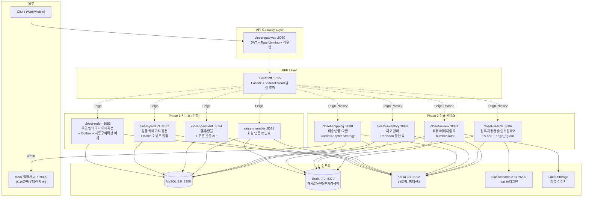
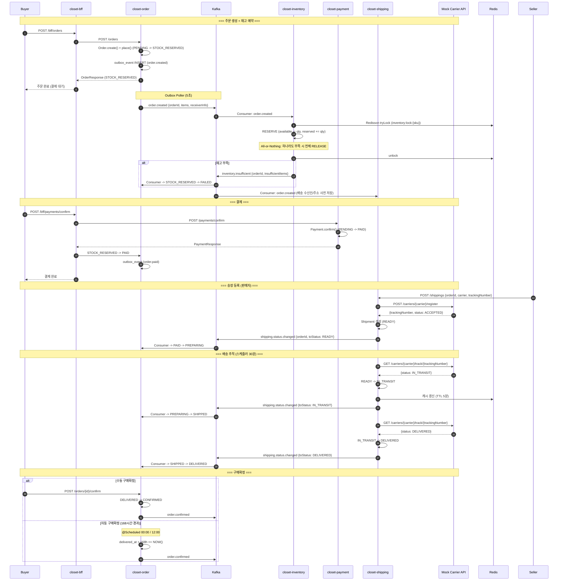
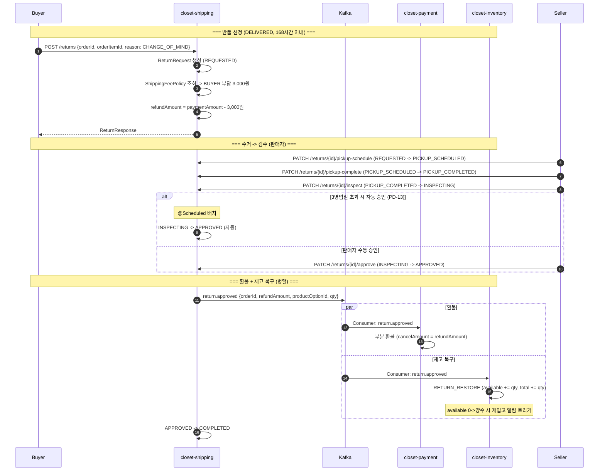
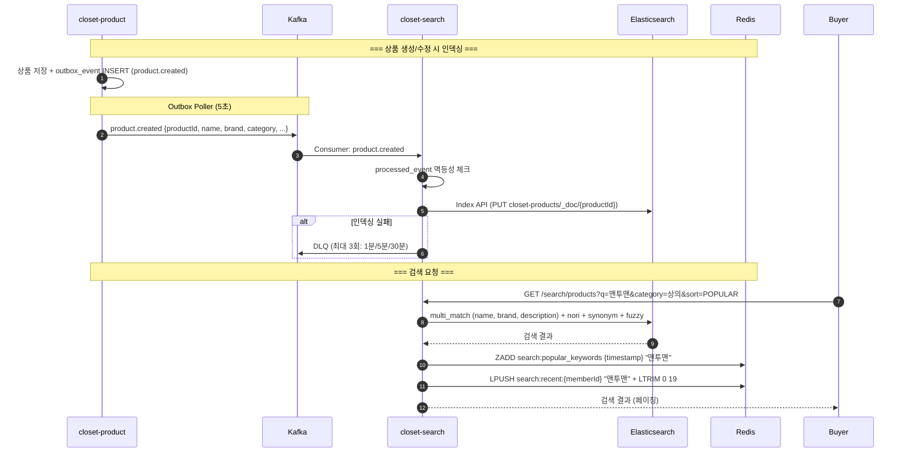

# Phase 2 Logistics TDD (Technical Design Document)

> 작성일: 2026-04-04
> 입력: phase2-logistics_architecture.md, pm_decisions.md, gap_analysis.md, 기존 코드 분석
> 범위: 배송(closet-shipping), 재고(closet-inventory), 검색(closet-search), 리뷰(closet-review) + 기존 서비스 수정
> 스프린트: Sprint 5~8 (8주)

---

## Background

Closet 의류 이커머스 플랫폼의 Phase 1(상품, 주문, 결제, 회원, BFF)이 완료된 상태이다. Phase 1에서는 주문 생성 -> 결제까지의 파이프라인이 구현되었으나, 결제 이후의 물류 흐름(배송, 반품, 교환)과 상품 발견(검색)을 지원하지 못한다.

현재 Phase 1의 한계:
- **배송**: 주문 완료 후 배송 추적이 불가능하다. OrderStatus에 PREPARING/SHIPPED/DELIVERED가 정의되어 있으나, 실제 택배사 연동과 배송 상태 동기화가 없다.
- **재고**: 재고 관리 서비스의 src/가 유실된 상태이다. Flyway 스키마(inventory_item, inventory_transaction)만 존재하며, Redisson 분산 락 기반의 동시성 제어가 구현되지 않았다.
- **검색**: 상품 목록은 DB 직접 조회만 가능하다. Elasticsearch 기반의 형태소 분석, 자동완성, 인기검색어 기능이 없다.
- **리뷰**: 리뷰 서비스가 미구현이다. Flyway 스키마(review, review_image)만 존재한다.
- **이벤트**: 서비스 간 통신이 Spring ApplicationEventPublisher(인프로세스)에 의존한다. Kafka 기반 분산 이벤트가 도입되지 않았다.

---

## Overview

Phase 2는 **물류(Logistics)** + **상품 발견(Discovery)** + **사용자 신뢰(Trust)** 3개 축을 구현한다.

| 축 | 서비스 | 핵심 가치 |
|---|--------|----------|
| 물류 | closet-shipping, closet-inventory | 주문 이후 배송 추적, 반품/교환, 재고 정합성 |
| 발견 | closet-search | 한글 형태소 검색, 자동완성, 인기검색어 |
| 신뢰 | closet-review | 구매 리뷰, 사이즈 후기, 포토 리뷰 |

**신규 서비스 4개** + **기존 서비스 수정 5개** + **인프라(Kafka 16토픽, ES 인덱스 1개, Redis 12키 패턴)** 를 Sprint 5~8(8주)에 걸쳐 구현한다. WMS는 Phase 2.5(Sprint 9~11)로 분리한다.

---

## Terminology

| 용어 | 설명 |
|------|------|
| **Shipment** | 배송 건. 주문 1건 당 1개 Shipment 생성 |
| **CarrierAdapter** | 택배사별 API 차이를 추상화하는 Strategy 패턴 인터페이스 |
| **RESERVE/DEDUCT/RELEASE** | 재고 3단계 패턴. 주문 생성 시 RESERVE -> 결제 시 DEDUCT -> 취소 시 RELEASE |
| **3단 재고** | total_quantity, available_quantity, reserved_quantity 3개 필드로 재고를 표현하는 구조 |
| **Outbox 패턴** | DB INSERT + Kafka 발행의 원자성을 보장하는 패턴. outbox_event 테이블에 INSERT 후 별도 폴러가 Kafka로 발행 |
| **processed_event** | Consumer 멱등성을 보장하는 테이블. eventId + consumerGroup의 UNIQUE KEY로 중복 처리 방지 |
| **nori** | Elasticsearch 한글 형태소 분석기. 복합어 분리(decompound_mode: mixed) 지원 |
| **edge_ngram** | 자동완성용 토크나이저. 문자열 앞부분부터 점진적으로 토큰 생성 (min_gram=2, max_gram=20) |
| **sliding window** | 인기검색어 산정 방식. Redis Sorted Set에 score=timestamp로 저장, 1시간 이전 데이터를 ZREMRANGEBYSCORE로 제거 |
| **Thumbnailator** | Java 이미지 리사이즈 라이브러리. 원본 -> 400x400 썸네일 동기 생성 |
| **ReviewSummary** | 상품별 리뷰 집계 (평균 별점, 별점 분포, 포토 리뷰 수) |
| **TTL** | 주문 예약 만료 시간. 15분 이내 결제 미완료 시 자동 취소 + 재고 RELEASE |
| **All-or-Nothing** | 재고 부족 정책. 주문 내 하나라도 재고 부족이면 전체 주문 거절 |
| **DLQ** | Dead Letter Queue. 3회 재시도(1분/5분/30분) 후 최종 실패 시 수동 처리 큐 |

---

## Define Problem

### P1. 주문 완료 후 물류 파이프라인 부재

Phase 1에서 주문(PAID) 이후의 흐름이 끊겨 있다:
- 판매자가 송장을 등록할 수 없다
- 구매자가 배송 상태를 추적할 수 없다
- 반품/교환 프로세스가 없어 구매자가 클레임을 처리할 수 없다
- 부분 환불(배송비 공제 후 환불)이 불가능하다
- 구매확정 -> 정산의 전제조건인 배송 완료 상태가 관리되지 않는다

### P2. 재고 정합성 미보장

- closet-inventory의 src/가 유실되어 재고 관리가 불가능하다
- 주문 생성 시 재고 검증이 없어 초과 판매(overselling) 위험이 존재한다
- 동시 주문 시 race condition에 대한 방어(분산 락)가 없다
- 재입고 알림이 불가능하다

### P3. 상품 발견 경로 부재

- 상품 검색이 DB LIKE 쿼리 의존으로 성능과 정확도가 낮다
- 한글 형태소 분석이 없어 "맨투맨"으로 검색하면 "스웨트셔츠"가 검색되지 않는다
- 자동완성, 인기검색어, 최근검색어 기능이 없다

### P4. 구매 결정 보조 부재

- 리뷰/별점이 없어 구매 결정에 필요한 사용자 피드백이 없다
- 의류 특화 사이즈 후기(키/몸무게/핏감)가 없다
- 포토 리뷰로 실물을 확인할 수 없다

### P5. 서비스 간 통신의 한계

- Spring ApplicationEventPublisher는 인프로세스 이벤트만 지원하여, 서비스 간 비동기 통신이 불가능하다
- 분산 트랜잭션(재고 차감 성공 -> 결제 실패 -> 재고 복구)의 보상 메커니즘이 없다
- product-service의 상품 변경 이벤트가 외부 서비스로 전파되지 않아 검색 인덱싱이 불가능하다

---

## Possible Solutions

### 벤치마킹 참조 제품

| 제품 | 참조 포인트 |
|------|-----------|
| **무신사 스토어** | 주문 상태 머신(7단계), 반품/교환 프로세스, 사이즈 후기, 인기검색어, All-or-Nothing 재고 정책, 동일 가격 옵션만 교환 허용 |
| **쿠팡** | 3단 재고(available/reserved/damaged), 실시간 배송 추적 UX, DLQ 재시도 전략 |
| **올리브영 GMS** | Transactional Outbox + Debezium CDC, WMS 입고/피킹/출고/실사 (Phase 2.5 벤치마킹) |
| **네이버 검색** | nori 형태소 분석기, edge_ngram 자동완성, 유의어 사전 |

### 방안 비교

#### 방안 A: 모놀리식 확장

Phase 1 서비스에 배송/재고/검색/리뷰 기능을 모듈로 추가한다.

- 장점: 서비스 간 통신 불필요, 트랜잭션 일관성 자연 보장
- 단점: Phase 1 서비스의 책임이 비대해짐, 독립 배포/스케일링 불가, 학습 목적(MSA 경험)에 부합하지 않음
- 판정: **미채택**. 마이크로서비스 아키텍처 학습이 프로젝트 핵심 목적.

#### 방안 B: MSA + 동기 REST 통신

신규 4개 서비스를 독립적으로 구현하되, 서비스 간 통신을 모두 동기 REST로 처리한다.

- 장점: 구현 단순, 디버깅 용이
- 단점: 분산 트랜잭션 처리 어려움(2PC 필요), 장애 전파 위험, 높은 결합도
- 판정: **미채택**. 재고 차감 -> 결제 실패 -> 재고 복구 같은 보상 트랜잭션이 동기 REST로는 안전하지 않음.

#### 방안 C: MSA + Kafka 이벤트 기반 + Outbox 패턴 (채택)

신규 4개 서비스를 독립적으로 구현하고, 서비스 간 통신을 Kafka 이벤트 기반으로 처리한다. DB-Kafka 원자성은 Transactional Outbox 패턴으로 보장한다.

- 장점: 느슨한 결합, 보상 트랜잭션 자연 지원(Choreography Saga), 멱등성 보장, 독립 배포/스케일링
- 단점: 최종 일관성(eventual consistency) 모델, 이벤트 순서 보장 어려움, Kafka 인프라 운영 부담
- 판정: **채택**. 올리브영 GMS Outbox 패턴 벤치마킹. processed_event로 멱등성 보장. 학습 목적에 최적.

#### 방안 C의 세부 선택

| 항목 | 선택지 | 결정 | 근거 |
|------|--------|------|------|
| Outbox 발행 방식 | (1) Debezium CDC (2) Outbox Poller | **Poller** | 단일 인스턴스 환경에서 CDC 인프라는 과도 (PD-51) |
| 재고 차감 시점 | (1) 즉시 차감 (2) 결제 시 차감 (3) RESERVE/DEDUCT | **RESERVE/DEDUCT** | 기존 Flyway 3단 스키마 활용, 보상 트랜잭션 최소화 (PD-18) |
| 이미지 처리 | (1) AWS Lambda (2) Thumbnailator 동기 | **Thumbnailator** | TPS 5에서 Lambda 과도 (PD-33) |
| 이미지 저장 | (1) S3 (2) 로컬 스토리지 | **로컬** | Phase 3에서 S3 + CloudFront 전환 (PD-52) |
| 검색 인기검색어 | (1) 매시간 배치 (2) 실시간 sliding window | **sliding window** | Redis ZADD + ZREMRANGEBYSCORE (PD-25) |
| 반품 SIZE_MISMATCH | (1) BUYER/SELLER 2분리 (2) BUYER 단일 | **BUYER 단일** | Phase 2 단순화 (PD-11) |
| WMS 범위 | (1) Phase 2 포함 (2) Phase 2.5 분리 | **Phase 2.5** | 85파일 규모 8주 초과 (PD-01) |

---

## Detail Design

### 클래스 역할 정의

#### 도메인 모델 (4개 서비스별)

##### closet-shipping (배송 서비스)

| 클래스 | 역할 | 주요 필드 |
|--------|------|----------|
| **Shipment** | 배송 건. 주문 1건 = Shipment 1건 | orderId(UNIQUE), carrier, trackingNumber, status(READY/IN_TRANSIT/DELIVERED), receiverName/Phone, address |
| **ShippingTrackingLog** | 배송 추적 이력. Mock 택배사 원본 상태 보존 | shippingId, carrierStatus(원본), mappedStatus(매핑), location, description, trackedAt |
| **ReturnRequest** | 반품 요청. REQUESTED -> PICKUP_SCHEDULED -> ... -> COMPLETED | orderId, orderItemId, reason(DEFECTIVE/WRONG_ITEM/SIZE_MISMATCH/CHANGE_OF_MIND), status, shippingFee, shippingFeePayer, refundAmount |
| **ExchangeRequest** | 교환 요청. 동일 가격 옵션만 허용 | orderId, orderItemId, originalOptionId, exchangeOptionId, reason, status, shippingFee(왕복 6,000원) |
| **ShippingFeePolicy** | 배송비 정책 테이블. DB 관리 | type(RETURN/EXCHANGE), reason, payer(BUYER/SELLER), fee |
| **ShippingStatus** (enum) | 배송 상태 3단계 + 전이 규칙 | READY -> IN_TRANSIT -> DELIVERED. fromCarrierStatus() 매핑 |
| **ReturnStatus** (enum) | 반품 상태 7단계 + 전이 규칙 | REQUESTED -> PICKUP_SCHEDULED -> PICKUP_COMPLETED -> INSPECTING -> APPROVED -> COMPLETED |
| **ExchangeStatus** (enum) | 교환 상태 6단계 + 전이 규칙 | REQUESTED -> PICKUP_SCHEDULED -> PICKUP_COMPLETED -> RESHIPPING -> COMPLETED |

##### closet-inventory (재고 서비스)

| 클래스 | 역할 | 주요 필드 |
|--------|------|----------|
| **Inventory** | SKU별 재고. 불변 조건: total == available + reserved | productId, productOptionId, sku(UNIQUE), totalQuantity, availableQuantity, reservedQuantity, safetyStock, version(@Version) |
| **InventoryHistory** | 재고 변경 이력 | inventoryId, changeType(RESERVE/DEDUCT/RELEASE/INBOUND/RETURN_RESTORE/ADJUSTMENT), quantity, before/after 값, referenceId/Type |
| **RestockNotification** | 재입고 알림 신청. 90일 후 자동 만료 | productId, productOptionId, memberId, status(WAITING/NOTIFIED/EXPIRED), expiredAt |

##### closet-search (검색 서비스)

| 클래스 | 역할 | 주요 필드 |
|--------|------|----------|
| **ProductDocument** | ES 인덱스 문서 (closet-products) | productId, name(nori + autocomplete), brand, category, price, salePrice, colors, sizes, salesCount, reviewCount, avgRating, popularityScore |
| **SearchSynonym** | 유의어 (DB 테이블 + ES synonym filter) | synonymGroup(쉼표 구분), isActive |
| **PopularKeyword** | 인기검색어 (Redis Sorted Set, 비영속) | keyword, score(=timestamp) |
| **RecentKeyword** | 최근검색어 (Redis List, 비영속) | memberId, keywords(최대 20개, TTL 30일) |

##### closet-review (리뷰 서비스)

| 클래스 | 역할 | 주요 필드 |
|--------|------|----------|
| **Review** | 리뷰. 주문항목당 1개 | productId, memberId, orderItemId(UNIQUE), content(2,000자), rating(1-5, TINYINT UNSIGNED), hasPhoto, status(ACTIVE/HIDDEN/DELETED), editCount(최대 3회), pointAwarded |
| **ReviewImage** | 리뷰 이미지. 원본 + 썸네일 | reviewId, originalUrl, thumbnailUrl(400x400), displayOrder, fileSize(최대 5MB) |
| **ReviewEditHistory** | 수정 이력 보존 (PD-32) | reviewId, previousContent, previousImageUrls(JSON), editedAt |
| **ReviewSummary** | 상품별 리뷰 집계 | productId(UNIQUE), totalCount, averageRating(DECIMAL 3,2), rating1~5Count, photoReviewCount |
| **ReviewSizeInfo** | 사이즈 후기 | reviewId(UNIQUE), height, weight, normalSize, purchasedSize, fitType(SMALL/PERFECT/LARGE) |

#### 서비스 클래스

##### closet-shipping 서비스 레이어

| 클래스 | 책임 |
|--------|------|
| **ShipmentService** | Shipment CRUD + 상태 전이. 송장 등록 시 CarrierAdapter를 통해 Mock 택배사 등록 |
| **ShipmentTrackingService** | 배송 추적 조회. Redis 캐시(5분 TTL) miss 시 CarrierAdapter로 택배사 API 호출 |
| **ShipmentTrackingScheduler** | 30분 간격 스케줄러. READY/IN_TRANSIT 건 폴링 -> 택배사 API 상태 갱신 -> 상태 변경 감지 시 Kafka 발행 |
| **ReturnRequestService** | 반품 CRUD + 상태 전이. 배송비 정책(ShippingFeePolicy) 기반 비용 산정 + refundAmount 계산 |
| **ExchangeRequestService** | 교환 CRUD + 상태 전이. 동일 가격 옵션 검증 + 재고 선점/복구 이벤트 |
| **AutoInspectionScheduler** | 반품 검수 3영업일 초과 자동 승인 배치 (PD-13) |
| **CarrierAdapterFactory** | CarrierAdapter 팩토리. carrier 코드로 적절한 어댑터 반환 |
| **CjCarrierAdapter / LogenCarrierAdapter / LotteCarrierAdapter / EpostCarrierAdapter** | 택배사별 Mock API 연동 구현 |

##### closet-inventory 서비스 레이어

| 클래스 | 책임 |
|--------|------|
| **InventoryService** | 재고 CRUD + 입고(INBOUND) |
| **InventoryLockService** | Redisson 분산 락 + @Version 낙관적 락 이중 잠금. RESERVE/DEDUCT/RELEASE/RETURN_RESTORE 처리 |
| **InventoryEventConsumer** | Kafka Consumer. order.created(RESERVE), order.cancelled(RELEASE), return.approved(RETURN_RESTORE) 처리 |
| **RestockNotificationService** | 재입고 알림 CRUD + available 0->양수 감지 시 알림 트리거 |
| **RestockNotificationScheduler** | 90일 초과 WAITING 건 EXPIRED 처리 배치 (PD-21) |
| **OutboxPoller** | 5초 간격 outbox_event 발행. PENDING -> PUBLISHED 전환 |

##### closet-search 서비스 레이어

| 클래스 | 책임 |
|--------|------|
| **ProductSearchService** | ES multi_match 검색 + 필터 + 정렬 + 페이징 |
| **AutocompleteService** | edge_ngram 기반 자동완성 (P99 50ms) |
| **PopularKeywordService** | Redis Sorted Set 인기검색어 (실시간 sliding window 1시간) |
| **RecentKeywordService** | Redis List 최근검색어 (LPUSH + LTRIM, 최대 20개, TTL 30일) |
| **ProductIndexingService** | Kafka Consumer. product.created/updated/deleted -> ES 인덱싱 |
| **ReviewSummaryIndexingService** | Kafka Consumer. review.summary.updated -> ES 부분 업데이트 (reviewCount, avgRating, popularityScore) |
| **SynonymService** | 유의어 CRUD (DB) + ES synonym filter 리로드 (close/open index) |
| **BulkReindexService** | 전체 상품 벌크 리인덱싱 (10만건/5분 목표, PD-28) |

##### closet-review 서비스 레이어

| 클래스 | 책임 |
|--------|------|
| **ReviewService** | 리뷰 CRUD. 수정 시 editCount 체크(최대 3회) + ReviewEditHistory 저장. 삭제 시 포인트 회수 이벤트 발행 |
| **ReviewImageService** | 이미지 업로드 + Thumbnailator 400x400 썸네일 생성. 5MB/장, 30MB/요청, 최대 10장 |
| **ReviewSummaryService** | 리뷰 생성/삭제 시 ReviewSummary 갱신 + review.summary.updated Kafka 이벤트 발행 |
| **ReviewPointService** | 리뷰 포인트 산정. Redis 일일 한도(5,000P) 체크 -> review.created Kafka 이벤트 발행 -> member-service에서 적립 |

### AS-IS, TO-BE

#### AS-IS (Phase 1)

```
[주문 흐름]
Client -> BFF -> order-service -> payment-service
                                    |
                                    v
                             (결제 완료. 이후 흐름 없음)

[서비스 간 통신]
Spring ApplicationEventPublisher (인프로세스, 동일 JVM 내)

[상품 검색]
product-service -> MySQL LIKE '%keyword%'

[재고]
src/ 유실. Flyway 스키마만 존재

[리뷰]
미구현. Flyway 스키마만 존재
```

#### TO-BE (Phase 2)

```
[주문 흐름 - 정상 경로]
Client -> BFF -> order-service --outbox--> Kafka -> inventory-service (RESERVE)
                                                 -> shipping-service (사전 정보 저장)
Seller -> shipping-service (송장 등록) --Kafka--> order-service (PAID -> PREPARING)
Scheduler -> shipping-service (택배사 추적) --Kafka--> order-service (PREPARING -> SHIPPED -> DELIVERED)
Batch -> order-service (자동 구매확정, 168시간) --Kafka--> shipping-service (최종 완료)

[주문 흐름 - 반품]
Buyer -> shipping-service (반품 신청, DELIVERED 168시간 이내)
Seller -> shipping-service (수거 -> 검수 -> 승인) --Kafka--> payment-service (부분 환불)
                                                          -> inventory-service (RETURN_RESTORE)

[서비스 간 통신]
Transactional Outbox -> Outbox Poller (5초) -> Kafka (16토픽, 파티션3)
Consumer: processed_event 멱등성 보장

[상품 검색]
product-service --outbox--> Kafka ---> search-service -> ES (nori + edge_ngram)
                                                      -> Redis (인기/최근검색어)

[재고]
inventory-service: Redisson 분산 락(SKU 단위) + @Version 낙관적 락
3단 구조: total / available / reserved
RESERVE -> DEDUCT -> RELEASE 패턴

[리뷰]
review-service: Review + ReviewImage(Thumbnailator 400x400) + ReviewSummary + ReviewSizeInfo
포인트 적립: Redis 일일 한도 -> Kafka -> member-service
```

### Component Diagram



### Sequence Diagram

#### SD-1: 주문 -> 재고 예약 -> 결제 -> 배송 -> 구매확정



#### SD-2: 반품 -> 수거 -> 검수 -> 환불 -> 재고 복구



#### SD-3: 상품 검색 인덱싱 파이프라인



---

## ERD (Mermaid -- 신규/변경 테이블)

```mermaid
erDiagram
    %% ===== closet-shipping =====
    shipment {
        BIGINT id PK "배송 고유 식별자"
        BIGINT order_id UK "주문 ID"
        BIGINT seller_id "셀러 ID"
        BIGINT member_id "회원 ID"
        VARCHAR30 carrier "택배사 코드 (CJ, LOGEN, LOTTE, EPOST)"
        VARCHAR30 tracking_number "송장 번호"
        VARCHAR20 status "배송 상태 (READY, IN_TRANSIT, DELIVERED)"
        VARCHAR50 receiver_name "수령인 이름"
        VARCHAR20 receiver_phone "수령인 전화번호"
        VARCHAR10 zip_code "우편번호"
        VARCHAR200 address "배송지 주소"
        VARCHAR200 detail_address "상세 주소"
        DATETIME6 shipped_at "출고 일시"
        DATETIME6 delivered_at "배송 완료 일시"
        DATETIME6 created_at "생성일시"
        DATETIME6 updated_at "수정일시"
    }

    shipping_tracking_log {
        BIGINT id PK "추적 이력 식별자"
        BIGINT shipping_id FK "배송 ID"
        VARCHAR30 carrier_status "Mock 서버 원본 상태"
        VARCHAR20 mapped_status "매핑된 ShippingStatus"
        VARCHAR200 location "위치"
        VARCHAR500 description "설명"
        DATETIME6 tracked_at "추적 시각"
        DATETIME6 created_at "생성일시"
    }

    return_request {
        BIGINT id PK "반품 요청 식별자"
        BIGINT order_id "주문 ID"
        BIGINT order_item_id "주문 항목 ID"
        BIGINT member_id "회원 ID"
        BIGINT seller_id "셀러 ID"
        VARCHAR30 reason "반품 사유"
        VARCHAR500 reason_detail "상세 사유"
        VARCHAR30 status "반품 상태"
        DECIMAL15_2 shipping_fee "반품 배송비"
        VARCHAR30 shipping_fee_payer "BUYER or SELLER"
        DECIMAL15_2 refund_amount "환불 금액"
        VARCHAR50 pickup_tracking_number "수거 송장"
        DATETIME6 inspected_at "검수 시작 일시"
        DATETIME6 completed_at "완료 일시"
        DATETIME6 created_at "생성일시"
        DATETIME6 updated_at "수정일시"
    }

    exchange_request {
        BIGINT id PK "교환 요청 식별자"
        BIGINT order_id "주문 ID"
        BIGINT order_item_id "주문 항목 ID"
        BIGINT member_id "회원 ID"
        BIGINT seller_id "셀러 ID"
        BIGINT original_option_id "기존 옵션 ID"
        BIGINT exchange_option_id "교환 옵션 ID"
        VARCHAR30 reason "교환 사유"
        VARCHAR500 reason_detail "상세 사유"
        VARCHAR30 status "교환 상태"
        DECIMAL15_2 shipping_fee "교환 배송비 (왕복 6000)"
        VARCHAR30 shipping_fee_payer "BUYER or SELLER"
        VARCHAR50 pickup_tracking_number "수거 송장"
        VARCHAR50 reshipping_tracking_number "재발송 송장"
        DATETIME6 completed_at "완료 일시"
        DATETIME6 created_at "생성일시"
        DATETIME6 updated_at "수정일시"
    }

    shipping_fee_policy {
        BIGINT id PK "정책 식별자"
        VARCHAR30 type "RETURN or EXCHANGE"
        VARCHAR30 reason "DEFECTIVE, WRONG_ITEM 등"
        VARCHAR30 payer "BUYER or SELLER"
        DECIMAL15_2 fee "배송비 금액"
        TINYINT1 is_active "활성 여부"
        DATETIME6 created_at "생성일시"
        DATETIME6 updated_at "수정일시"
    }

    shipment ||--o{ shipping_tracking_log : "has"

    %% ===== closet-inventory =====
    inventory {
        BIGINT id PK "재고 식별자"
        BIGINT product_id "상품 ID"
        BIGINT product_option_id UK "상품 옵션 ID"
        VARCHAR50 sku UK "SKU"
        INT total_quantity "전체 수량"
        INT available_quantity "가용 수량"
        INT reserved_quantity "예약 수량"
        INT safety_stock "안전재고"
        BIGINT version "낙관적 락 버전"
        DATETIME6 created_at "생성일시"
        DATETIME6 updated_at "수정일시"
    }

    inventory_history {
        BIGINT id PK "이력 식별자"
        BIGINT inventory_id FK "재고 ID"
        VARCHAR30 change_type "RESERVE, DEDUCT, RELEASE, INBOUND, RETURN_RESTORE"
        INT quantity "변동 수량"
        INT before_available "변경 전 가용"
        INT after_available "변경 후 가용"
        INT before_reserved "변경 전 예약"
        INT after_reserved "변경 후 예약"
        BIGINT reference_id "참조 ID"
        VARCHAR30 reference_type "ORDER, RETURN, INBOUND"
        DATETIME6 created_at "생성일시"
    }

    restock_notification {
        BIGINT id PK "알림 식별자"
        BIGINT product_id "상품 ID"
        BIGINT product_option_id "옵션 ID"
        BIGINT member_id "회원 ID"
        VARCHAR20 status "WAITING, NOTIFIED, EXPIRED"
        DATETIME6 notified_at "알림 발송 일시"
        DATETIME6 expired_at "만료 일시 (등록일 + 90일)"
        DATETIME6 created_at "생성일시"
        DATETIME6 updated_at "수정일시"
    }

    inventory ||--o{ inventory_history : "has"

    %% ===== closet-search (DB) =====
    search_synonym {
        BIGINT id PK "유의어 식별자"
        VARCHAR500 synonym_group "쉼표 구분 유의어 그룹"
        TINYINT1 is_active "활성 여부"
        DATETIME6 created_at "생성일시"
        DATETIME6 updated_at "수정일시"
    }

    %% ===== closet-review =====
    review {
        BIGINT id PK "리뷰 식별자"
        BIGINT product_id "상품 ID"
        BIGINT member_id "회원 ID"
        BIGINT order_id "주문 ID"
        BIGINT order_item_id UK "주문 항목 ID"
        TEXT content "리뷰 내용 (최대 2000자)"
        TINYINT_UNSIGNED rating "별점 1-5"
        TINYINT1 has_photo "포토 리뷰 여부"
        VARCHAR20 status "ACTIVE, HIDDEN, DELETED"
        INT edit_count "수정 횟수 (최대 3)"
        INT point_awarded "지급 포인트"
        DATETIME6 created_at "생성일시"
        DATETIME6 updated_at "수정일시"
    }

    review_image {
        BIGINT id PK "이미지 식별자"
        BIGINT review_id FK "리뷰 ID"
        VARCHAR500 original_url "원본 이미지 경로"
        VARCHAR500 thumbnail_url "400x400 썸네일 경로"
        INT display_order "노출 순서"
        INT file_size "파일 크기 (bytes)"
        DATETIME6 created_at "생성일시"
        DATETIME6 updated_at "수정일시"
    }

    review_edit_history {
        BIGINT id PK "수정 이력 식별자"
        BIGINT review_id FK "리뷰 ID"
        TEXT previous_content "이전 내용"
        TEXT previous_image_urls "이전 이미지 URL JSON"
        DATETIME6 edited_at "수정 일시"
        DATETIME6 created_at "생성일시"
    }

    review_summary {
        BIGINT id PK "집계 식별자"
        BIGINT product_id UK "상품 ID"
        INT total_count "전체 리뷰 수"
        DECIMAL3_2 average_rating "평균 별점"
        INT rating_1_count "1점 리뷰 수"
        INT rating_2_count "2점 리뷰 수"
        INT rating_3_count "3점 리뷰 수"
        INT rating_4_count "4점 리뷰 수"
        INT rating_5_count "5점 리뷰 수"
        INT photo_review_count "포토 리뷰 수"
        DATETIME6 created_at "생성일시"
        DATETIME6 updated_at "수정일시"
    }

    review_size_info {
        BIGINT id PK "사이즈 후기 식별자"
        BIGINT review_id UK "리뷰 ID"
        INT height "키 (cm)"
        INT weight "몸무게 (kg)"
        VARCHAR20 normal_size "평소 사이즈"
        VARCHAR20 purchased_size "구매 사이즈"
        VARCHAR20 fit_type "SMALL, PERFECT, LARGE"
        DATETIME6 created_at "생성일시"
        DATETIME6 updated_at "수정일시"
    }

    review ||--o{ review_image : "has"
    review ||--o{ review_edit_history : "has"
    review ||--o| review_size_info : "has"

    %% ===== 공통 (각 서비스별) =====
    outbox_event {
        BIGINT id PK "Outbox PK"
        VARCHAR100 aggregate_type "집합체 타입"
        VARCHAR100 aggregate_id "집합체 ID"
        VARCHAR100 event_type "이벤트 타입"
        VARCHAR100 topic "Kafka 토픽"
        TEXT payload "이벤트 페이로드 JSON"
        VARCHAR30 status "PENDING, PUBLISHED, FAILED"
        DATETIME6 created_at "생성일시"
        DATETIME6 published_at "발행일시"
        INT retry_count "재시도 횟수"
    }

    processed_event {
        BIGINT id PK "PK"
        VARCHAR100 event_id UK "이벤트 ID"
        VARCHAR100 consumer_group "컨슈머 그룹"
        DATETIME6 processed_at "처리일시"
    }
```



---

## Release Scenario (Feature Flag, 롤백)

### Feature Flag 전략

Phase 2 기능은 Feature Flag로 점진 활성화한다. DB 기반 `SimpleRuntimeConfig` + `FeatureFlagService` + `BooleanFeatureKey` 패턴을 따른다.

| Feature Flag Key | 서비스 | 설명 | 기본값 |
|-----------------|--------|------|--------|
| `PHASE2_SHIPPING_ENABLED` | closet-shipping | 배송 서비스 활성화 | false |
| `PHASE2_RETURN_EXCHANGE_ENABLED` | closet-shipping | 반품/교환 활성화 | false |
| `PHASE2_INVENTORY_RESERVE_ENABLED` | closet-inventory | 재고 RESERVE/DEDUCT/RELEASE 활성화 | false |
| `PHASE2_SEARCH_ENABLED` | closet-search | ES 검색 활성화 (비활성 시 기존 DB 검색) | false |
| `PHASE2_REVIEW_ENABLED` | closet-review | 리뷰 서비스 활성화 | false |
| `PHASE2_KAFKA_OUTBOX_ENABLED` | closet-order, closet-product | Outbox -> Kafka 발행 활성화 (비활성 시 기존 ApplicationEvent만) | false |
| `PHASE2_AUTO_CONFIRM_ENABLED` | closet-order | 자동 구매확정 배치 활성화 | false |

### 배포 순서

```
Sprint 8 배포:
1. [인프라] Kafka 16토픽 생성, ES closet-products 인덱스 생성
2. [코드] 전 서비스 배포 (Feature Flag = false)
3. [데이터] inventory 초기 데이터 생성 (product_option -> inventory 매핑)
4. [데이터] ES 벌크 인덱싱 (전체 상품)
5. [데이터] review_summary 초기화 (전체 상품, count=0)
6. [활성화] PHASE2_KAFKA_OUTBOX_ENABLED = true
   -> Outbox 발행 시작. Consumer는 이미 대기 중이므로 이벤트 처리 시작
7. [활성화] PHASE2_INVENTORY_RESERVE_ENABLED = true
   -> 신규 주문부터 재고 RESERVE 적용
8. [활성화] PHASE2_SHIPPING_ENABLED = true
   -> 판매자 송장 등록 가능
9. [활성화] PHASE2_SEARCH_ENABLED = true
   -> ES 검색으로 전환
10. [활성화] PHASE2_REVIEW_ENABLED = true
    -> 리뷰 작성 가능
11. [활성화] PHASE2_RETURN_EXCHANGE_ENABLED = true
    -> 반품/교환 가능
12. [활성화] PHASE2_AUTO_CONFIRM_ENABLED = true
    -> 자동 구매확정 배치 시작
```

### 롤백 시나리오

| 장애 유형 | 롤백 조치 |
|-----------|----------|
| Kafka 브로커 장애 | PHASE2_KAFKA_OUTBOX_ENABLED = false -> 기존 ApplicationEvent로 fallback. Outbox 이벤트는 DB에 누적되어 복구 후 자동 발행 |
| ES 장애 | PHASE2_SEARCH_ENABLED = false -> 기존 DB 검색으로 fallback |
| 재고 분산 락 장애 (Redis) | PHASE2_INVENTORY_RESERVE_ENABLED = false -> 재고 검증 없이 주문 생성 (Phase 1 동작). 초과 판매 위험은 수동 모니터링으로 대응 |
| 배송 서비스 장애 | PHASE2_SHIPPING_ENABLED = false -> 주문 상태가 PAID에서 멈춤. 복구 후 PAID 건을 재처리 |
| 리뷰 서비스 장애 | PHASE2_REVIEW_ENABLED = false -> 리뷰 기능 비활성. 기존 상품 상세에서 리뷰 영역 미노출 |
| 전체 Phase 2 롤백 | 모든 Feature Flag = false -> Phase 1 상태로 복원. DB 데이터(outbox_event, 신규 테이블)는 유지 |

---

## Testing Plan

### 테스트 프레임워크

- **Kotest BehaviorSpec** (Given/When/Then)
- **Testcontainers** (MySQL, Redis, Kafka, Elasticsearch)
- **MockK** (외부 API Mock)
- **BaseIntegrationTest** 패턴 (싱글턴 컨테이너 + Initializer)

### 도메인별 테스트 시나리오

#### closet-shipping (20개)

| # | 시나리오 | 유형 |
|---|---------|------|
| S-01 | 판매자 송장 등록 -> Shipment READY 생성 + Kafka 발행 | 통합 |
| S-02 | 시스템 자동 채번 (Mock 택배사 등록 -> 송장번호 수신) | 통합 |
| S-03 | 송장번호 형식 검증 `[A-Z]{0,4}[0-9]{10,15}` | 단위 |
| S-04 | ShippingStatus 전이 (READY -> IN_TRANSIT -> DELIVERED) | 단위 |
| S-05 | 배송 추적 Redis 캐시 hit (5분 TTL) | 통합 |
| S-06 | 배송 추적 Redis 캐시 miss -> 택배사 API 호출 | 통합 |
| S-07 | 30분 스케줄러 상태 변경 감지 + Kafka 발행 | 통합 |
| S-08 | orderId 기반 배송 조회 | 통합 |
| S-09 | 반품 신청 (DELIVERED, 168시간 이내) | 통합 |
| S-10 | 반품 신청 거절 (168시간 초과) | 단위 |
| S-11 | 반품 배송비 산정 (CHANGE_OF_MIND -> BUYER 3,000원, DEFECTIVE -> SELLER 0원) | 단위 |
| S-12 | ReturnStatus 전이 (7단계) | 단위 |
| S-13 | 반품 검수 3영업일 초과 자동 승인 | 통합 |
| S-14 | 반품 승인 -> return.approved Kafka 발행 | 통합 |
| S-15 | 교환 신청 (동일 가격 옵션만 허용) | 통합 |
| S-16 | 교환 거절 (가격 차이 옵션) | 단위 |
| S-17 | ExchangeStatus 전이 (6단계) | 단위 |
| S-18 | CarrierAdapter CJ/로젠/롯데/우체국 택배사별 등록 | 통합 |
| S-19 | 지원하지 않는 택배사 에러 | 단위 |
| S-20 | ShippingFeePolicy 조회 (사유별/유형별 매트릭스) | 통합 |

#### closet-inventory (15개)

| # | 시나리오 | 유형 |
|---|---------|------|
| I-01 | RESERVE 성공 (available -= qty, reserved += qty) | 통합 |
| I-02 | RESERVE 실패 (재고 부족 -> inventory.insufficient 발행) | 통합 |
| I-03 | DEDUCT 성공 (reserved -= qty) | 통합 |
| I-04 | RELEASE 성공 (reserved -= qty, available += qty) | 통합 |
| I-05 | RETURN_RESTORE (available += qty, total += qty) | 통합 |
| I-06 | INBOUND 입고 (total += qty, available += qty) | 통합 |
| I-07 | All-or-Nothing (다중 SKU 중 1개 부족 -> 전체 RELEASE) | 통합 |
| I-08 | 불변 조건 검증 (total == available + reserved, available >= 0, reserved >= 0) | 단위 |
| I-09 | Redisson 분산 락 동시성 100스레드 테스트 | 통합 |
| I-10 | @Version 낙관적 락 충돌 시 재시도 | 통합 |
| I-11 | 안전재고 이하 -> inventory.low_stock 발행 (24h 중복 방지) | 통합 |
| I-12 | 품절 -> inventory.out_of_stock 발행 | 통합 |
| I-13 | 재입고(available 0->양수) -> restock_notification 트리거 | 통합 |
| I-14 | 재입고 알림 90일 만료 배치 | 통합 |
| I-15 | InventoryHistory 이력 정확성 (before/after 값 검증) | 단위 |

#### closet-search (16개)

| # | 시나리오 | 유형 |
|---|---------|------|
| SE-01 | 키워드 검색 (nori 형태소 분석, "맨투맨" -> "스웨트셔츠" 유의어) | 통합 |
| SE-02 | 카테고리 필터 + 가격 범위 필터 + 정렬 | 통합 |
| SE-03 | 오타 교정 (fuzziness=AUTO) | 통합 |
| SE-04 | 자동완성 (edge_ngram, P99 50ms) | 통합 |
| SE-05 | 인기검색어 TOP 10 (Redis Sorted Set) | 통합 |
| SE-06 | 인기검색어 sliding window 1시간 만료 | 통합 |
| SE-07 | 최근검색어 LPUSH + LTRIM (최대 20개) | 통합 |
| SE-08 | 최근검색어 개별/전체 삭제 | 통합 |
| SE-09 | product.created -> ES 인덱싱 | 통합 |
| SE-10 | product.updated -> ES 업데이트 | 통합 |
| SE-11 | product.deleted -> ES 삭제 | 통합 |
| SE-12 | review.summary.updated -> ES 부분 업데이트 (reviewCount, avgRating) | 통합 |
| SE-13 | 벌크 리인덱싱 (10만건/5분) | 통합 |
| SE-14 | 유의어 CRUD + ES synonym filter 리로드 | 통합 |
| SE-15 | 멱등성 (동일 eventId 중복 수신 무시) | 통합 |
| SE-16 | DLQ 재시도 (3회, 지수 백오프) | 통합 |

#### closet-review (17개)

| # | 시나리오 | 유형 |
|---|---------|------|
| R-01 | 리뷰 작성 (텍스트 + 별점) | 통합 |
| R-02 | 포토 리뷰 작성 (원본 + 400x400 썸네일 생성) | 통합 |
| R-03 | 이미지 크기 제한 (5MB/장, 30MB/요청, 최대 10장) | 단위 |
| R-04 | 주문항목당 1개 리뷰 제한 (UNIQUE 제약) | 통합 |
| R-05 | 구매확정(CONFIRMED) 상태에서만 리뷰 작성 가능 | 단위 |
| R-06 | 리뷰 수정 (텍스트 + 이미지, 별점 불가) | 통합 |
| R-07 | 리뷰 수정 횟수 제한 (최대 3회) | 단위 |
| R-08 | 리뷰 수정 시 ReviewEditHistory 저장 | 통합 |
| R-09 | 리뷰 삭제 + 포인트 회수 이벤트 발행 | 통합 |
| R-10 | 포인트 회수 시 잔액 부족 -> 마이너스 잔액 허용 | 통합 |
| R-11 | ReviewSummary 갱신 (생성 시 +1, 삭제 시 -1, 평균 재계산) | 통합 |
| R-12 | 상품별 리뷰 목록 (최신순/별점순 정렬 + 페이징) | 통합 |
| R-13 | 포인트 적립 (텍스트 100P, 포토 300P) | 통합 |
| R-14 | 일일 포인트 한도 5,000P (Redis 키 `review:daily_point:{memberId}`) | 통합 |
| R-15 | 관리자 리뷰 블라인드 (ACTIVE -> HIDDEN) | 통합 |
| R-16 | 사이즈 후기 작성 (키/몸무게/핏감) | 통합 |
| R-17 | review.summary.updated Kafka 발행 -> search-service ES 업데이트 | 통합 |

#### 크로스 도메인 (8개)

| # | 시나리오 | 유형 |
|---|---------|------|
| X-01 | 주문 -> 재고 RESERVE -> 결제 -> 배송 -> 구매확정 E2E | 통합 |
| X-02 | 주문 -> 재고 부족 -> FAILED (inventory.insufficient -> order) | 통합 |
| X-03 | 주문 취소 -> 재고 RELEASE (order.cancelled -> inventory) | 통합 |
| X-04 | 반품 승인 -> 부분 환불 + 재고 복구 (return.approved -> payment + inventory) | 통합 |
| X-05 | 상품 등록 -> Kafka -> ES 인덱싱 -> 검색 결과 노출 | 통합 |
| X-06 | 리뷰 작성 -> ReviewSummary -> ES 업데이트 -> 인기순 반영 | 통합 |
| X-07 | 리뷰 작성 -> 포인트 적립 (review.created -> member) | 통합 |
| X-08 | 15분 TTL 주문 만료 -> 자동 취소 + 재고 RELEASE | 통합 |

### 기존 서비스 수정 테스트

| # | 시나리오 | 서비스 |
|---|---------|--------|
| M-01 | OrderStatus 전이 확장 (DELIVERED -> RETURN_REQUESTED/EXCHANGE_REQUESTED) | closet-order |
| M-02 | OrderItemStatus 확장 (EXCHANGE_REQUESTED, EXCHANGE_COMPLETED) | closet-order |
| M-03 | Outbox -> Kafka 발행 (order.created, order.cancelled, order.confirmed) | closet-order |
| M-04 | 자동 구매확정 배치 (168시간, 00:00/12:00) | closet-order |
| M-05 | D-1 사전 알림 배치 (confirm.reminder Kafka 발행) | closet-order |
| M-06 | Payment 부분 환불 (refundAmount, PAID -> REFUNDED) | closet-payment |
| M-07 | Product Kafka 이벤트 발행 (product.created/updated/deleted) | closet-product |
| M-08 | Member 포인트 적립 Consumer (review.created, 멱등성) | closet-member |

---

## Milestone (Sprint 5~8)

### Sprint 5 (Week 1~2): 인프라 + 재고 + 배송 기본

| 주 | 작업 | 산출물 |
|---|------|--------|
| W1 | Kafka 인프라 (16토픽, docker-compose), Outbox/processed_event 공통 모듈, closet-order Outbox 전환 | Kafka 토픽 16개, outbox_event/processed_event DDL |
| W1 | closet-product Kafka 이벤트 발행 (product.created/updated/deleted) | ProductOutboxEventListener |
| W2 | closet-inventory 재개발: Inventory 도메인, InventoryLockService(Redisson), RESERVE/DEDUCT/RELEASE | InventoryService, InventoryLockService, 테스트 I-01~I-10 |
| W2 | closet-inventory Kafka Consumer (order.created -> RESERVE, order.cancelled -> RELEASE) | InventoryEventConsumer |

### Sprint 6 (Week 3~4): 배송 + 반품

| 주 | 작업 | 산출물 |
|---|------|--------|
| W3 | closet-shipping: Shipment 도메인, CarrierAdapter Strategy (4개 택배사), 송장 등록 API | ShipmentService, CarrierAdapter 4종, 테스트 S-01~S-08 |
| W3 | closet-shipping: 배송 추적 스케줄러 (30분), Redis 캐시 (5분 TTL) | ShipmentTrackingScheduler, 테스트 S-05~S-07 |
| W4 | closet-shipping: ReturnRequest 도메인, 반품 API, ShippingFeePolicy | ReturnRequestService, 테스트 S-09~S-14 |
| W4 | closet-payment 부분 환불 API, return.approved Consumer | Payment.refund(), 테스트 M-06 |

### Sprint 7 (Week 5~6): 교환 + 검색 + 리뷰

| 주 | 작업 | 산출물 |
|---|------|--------|
| W5 | closet-shipping: ExchangeRequest 도메인, 교환 API | ExchangeRequestService, 테스트 S-15~S-20 |
| W5 | closet-search: ES 인덱스 매핑, ProductIndexingService, Kafka Consumer | closet-products 인덱스, 테스트 SE-09~SE-16 |
| W6 | closet-search: 검색 API (nori + fuzzy + filter + sort), 자동완성, 인기검색어, 최근검색어, 유의어 | ProductSearchService, 테스트 SE-01~SE-08 |
| W6 | closet-review: Review 도메인, 리뷰 CRUD, 이미지 업로드(Thumbnailator), ReviewSummary | ReviewService, ReviewImageService, 테스트 R-01~R-11 |

### Sprint 8 (Week 7~8): 리뷰 고도화 + 통합 + 배포

| 주 | 작업 | 산출물 |
|---|------|--------|
| W7 | closet-review: 포인트 적립 + 사이즈 후기 + 관리자 블라인드 | ReviewPointService, 테스트 R-12~R-17 |
| W7 | closet-order: 자동 구매확정 배치 + D-1 알림 배치 | AutoConfirmScheduler, 테스트 M-04~M-05 |
| W7 | closet-inventory: 재입고 알림 + 안전재고 알림 + 90일 만료 배치 | RestockNotificationService, 테스트 I-11~I-15 |
| W8 | closet-bff 수정: Feign Client 4개 + Facade 5개 | BFF 확장, 크로스 도메인 테스트 X-01~X-08 |
| W8 | 통합 테스트 + E2E + 데이터 마이그레이션 + Feature Flag 점진 배포 | 전체 테스트 GREEN, Feature Flag 활성화 |
