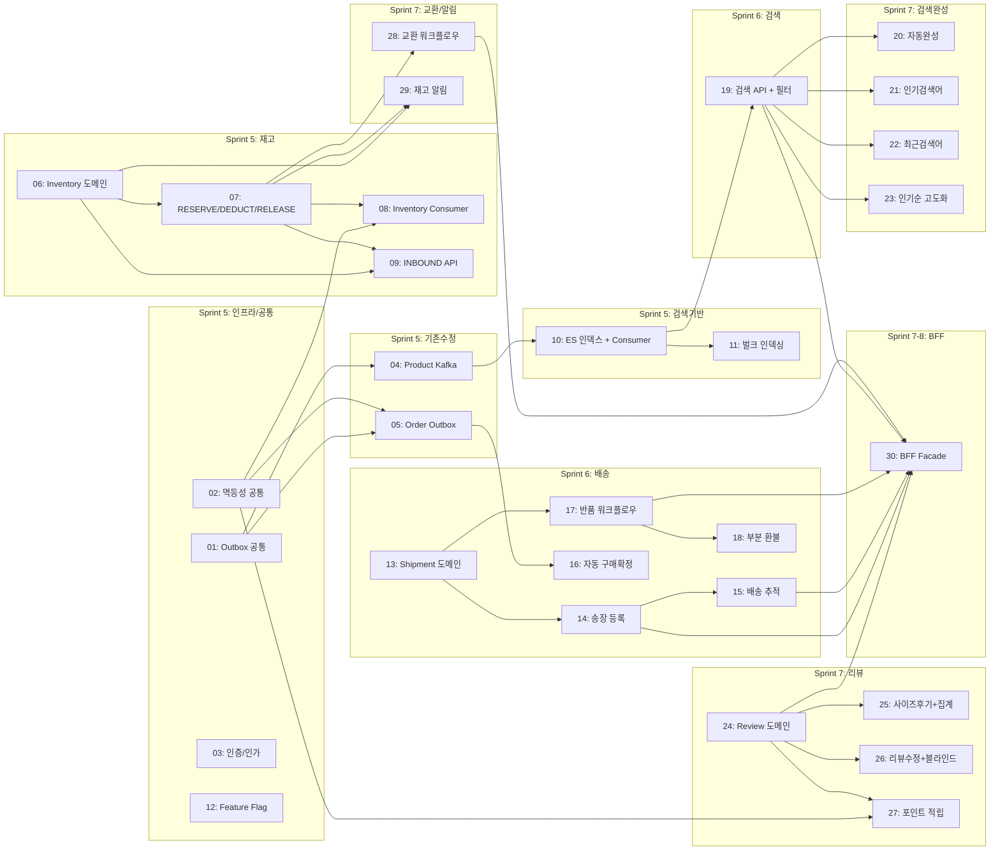

# Phase 2 구현 티켓 요약

> 작성일: 2026-04-04
> 범위: Sprint 5~8 (Phase 2 본편) -- 배송/재고/검색/리뷰 + 기존 서비스 수정
> 총 티켓: 30개 (S: 10, M: 15, L: 5)

---

## PRD 참조

- 아키텍처 설계: `prd/phase2-logistics_architecture.md`
- PM 의사결정: `discovery/pm_decisions.md` (PD-01 ~ PD-52, 52건 전건 확정)
- Gap 분석: `prd/gap_analysis.md` (애매 12건, 누락 12건, 고려 10건)

## 벤치마킹 참조

- 올리브영 GMS: Transactional Outbox + Debezium CDC 패턴 (PD-51에서 Outbox만 채택)
- 무신사: All-or-Nothing 재고 정책, 동일 가격 옵션만 교환
- 쿠팡 WMS: available/reserved/damaged 3단 재고 구조

---

## 티켓 목록

| # | 티켓 | 레이어 | 서비스 | 의존성 | 크기 | 스프린트 |
|---|------|--------|--------|--------|------|---------|
| 01 | Outbox 패턴 공통 모듈 | Infra/Common | closet-common | - | M | 5 |
| 02 | processed_event 멱등성 공통 모듈 | Infra/Common | closet-common | - | S | 5 |
| 03 | 서비스 간 인증 (X-Internal-Api-Key) + JWT role claim | Infra/Common | closet-gateway, closet-member | - | M | 5 |
| 04 | closet-product Kafka 이벤트 발행 (Outbox 전환) | Service | closet-product | 01 | M | 5 |
| 05 | closet-order Outbox 전환 + 상태 확장 | Service | closet-order | 01, 02 | M | 5 |
| 06 | Inventory 도메인 + Repository | Domain/Repository | closet-inventory | - | M | 5 |
| 07 | Inventory RESERVE/DEDUCT/RELEASE Service + Redisson 분산 락 | Service | closet-inventory | 06 | L | 5 |
| 08 | Inventory Kafka Consumer (order.created, order.cancelled, return.approved) | Service | closet-inventory | 06, 07, 02 | M | 5 |
| 09 | Inventory INBOUND API (입고) | Controller/Service | closet-inventory | 06, 07 | S | 5 |
| 10 | ES 인덱스 생성 + nori 매핑 + Kafka Consumer (product.*) | Infra/Service | closet-search | 04 | L | 5 |
| 11 | 벌크 인덱싱 API + Phase 1 데이터 마이그레이션 | Controller/Service | closet-search | 10 | S | 5 |
| 12 | Feature Flag 기반 점진 활성화 설정 | Infra/Common | closet-common | - | S | 5 |
| 13 | Shipment 도메인 + 상태 머신 + Repository | Domain/Repository | closet-shipping | - | M | 6 |
| 14 | 송장 등록 API + CarrierAdapter Strategy 패턴 | Service/Controller | closet-shipping | 13 | L | 6 |
| 15 | 배송 추적 조회 + Redis 캐싱 + orderId 기반 API | Service/Controller | closet-shipping | 13, 14 | M | 6 |
| 16 | 자동 구매확정 배치 + D-1 사전 알림 | Service | closet-order | 05 | M | 6 |
| 17 | ReturnRequest 도메인 + 반품 워크플로우 | Domain/Service/Controller | closet-shipping | 13 | L | 6 |
| 18 | 반품 환불 연동 (payment-service 부분 환불 API) | Service/Controller | closet-payment | 17 | M | 6 |
| 19 | 검색 API + 필터 + 정렬 | Service/Controller | closet-search | 10 | M | 6 |
| 20 | 자동완성 (edge_ngram) | Service/Controller | closet-search | 10, 19 | S | 7 |
| 21 | 인기 검색어 (Redis Sorted Set sliding window) + 금칙어 | Service/Controller | closet-search | 19 | S | 7 |
| 22 | 최근 검색어 (Redis List) | Service/Controller | closet-search | 19 | S | 7 |
| 23 | 인기순 복합 점수 정렬 고도화 | Service | closet-search | 19 | S | 7 |
| 24 | Review 도메인 + 이미지 업로드 (Thumbnailator) | Domain/Service/Controller | closet-review | - | L | 7 |
| 25 | 사이즈 후기 + ReviewSummary 집계 | Service/Controller | closet-review | 24 | M | 7 |
| 26 | 리뷰 수정 + 관리자 블라인드 + 수정 이력 | Service/Controller | closet-review | 24 | S | 7 |
| 27 | 리뷰 포인트 적립 연동 (member-service Consumer) | Service | closet-review, closet-member | 24, 02 | M | 7 |
| 28 | ExchangeRequest 도메인 + 교환 워크플로우 | Domain/Service/Controller | closet-shipping | 13, 07 | M | 7 |
| 29 | 안전재고 알림 + 재입고 알림 | Service | closet-inventory | 06, 07 | M | 7 |
| 30 | closet-bff 신규 Facade + Feign Client | Controller/BFF | closet-bff | 14, 15, 17, 19, 24, 28 | M | 7-8 |

---

## 의존 관계도

---

## 배포 순서

### Sprint 5 (2026-04-07 ~ 04-18): 기반 구축
1. **Wave 1 (인프라)**: T01 Outbox 공통 -> T02 멱등성 공통 -> T03 인증/인가 -> T12 Feature Flag
2. **Wave 2 (기존 수정)**: T04 Product Kafka -> T05 Order Outbox (T01, T02 완료 후)
3. **Wave 3 (재고)**: T06 Inventory 도메인 -> T07 분산 락 -> T08 Consumer -> T09 INBOUND
4. **Wave 4 (검색 기반)**: T10 ES + Consumer (T04 완료 후) -> T11 벌크 인덱싱

### Sprint 6 (2026-04-21 ~ 05-02): 배송/반품 + 검색
5. **Wave 5 (배송)**: T13 Shipment 도메인 -> T14 송장 등록 -> T15 배송 추적
6. **Wave 6 (반품)**: T17 반품 워크플로우 (T13 완료 후) -> T18 부분 환불
7. **Wave 7 (주문)**: T16 자동 구매확정 (T05 완료 후)
8. **Wave 8 (검색)**: T19 검색 API + 필터 (T10 완료 후)

### Sprint 7 (2026-05-05 ~ 05-16): 리뷰 + 교환 + 검색 완성
9. **Wave 9 (검색 완성)**: T20, T21, T22, T23 (T19 완료 후, 병렬 가능)
10. **Wave 10 (리뷰)**: T24 Review 도메인 -> T25 집계 -> T26 수정/블라인드 -> T27 포인트
11. **Wave 11 (교환/알림)**: T28 교환 워크플로우, T29 재고 알림 (T07 완료 후)

### Sprint 7-8 (2026-05-12 ~ 05-30): BFF + 통합
12. **Wave 12 (BFF)**: T30 BFF Facade (각 서비스 완료 후 점진적 추가)

---

## Feature Flag 매핑

| Flag | 관련 티켓 | 스프린트 |
|------|----------|---------|
| `OUTBOX_POLLING_ENABLED` | 01, 04, 05 | 5 |
| `ROLE_AUTHORIZATION_ENABLED` | 03 | 5 |
| `INVENTORY_KAFKA_ENABLED` | 08 | 5 |
| `SEARCH_INDEXING_ENABLED` | 10, 11 | 5 |
| `SHIPPING_SERVICE_ENABLED` | 13, 14, 15 | 6 |
| `AUTO_CONFIRM_BATCH_ENABLED` | 16 | 6 |
| `RETURN_REQUEST_ENABLED` | 17 | 6 |
| `SEARCH_FILTER_ENABLED` | 19 | 6 |
| `AUTOCOMPLETE_ENABLED` | 20 | 7 |
| `POPULAR_KEYWORDS_ENABLED` | 21 | 7 |
| `REVIEW_SERVICE_ENABLED` | 24, 25, 26 | 7 |
| `REVIEW_POINT_ENABLED` | 27 | 7 |
| `EXCHANGE_REQUEST_ENABLED` | 28 | 7 |

---

## 크기 분포

| 크기 | 개수 | 비율 |
|------|------|------|
| S (1-2일) | 10 | 33% |
| M (3-5일) | 15 | 50% |
| L (1주+) | 5 | 17% |

**총 예상 공수**: S(10x1.5d) + M(15x4d) + L(5x6d) = 15 + 60 + 30 = **105 person-days (~21주 1인)**
3인 병렬 시 약 7주 (Sprint 5~8, 8주 내 완료 가능)
