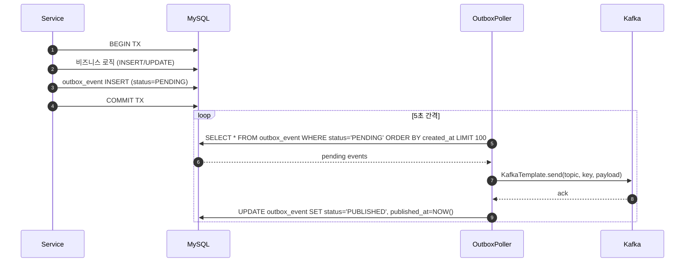
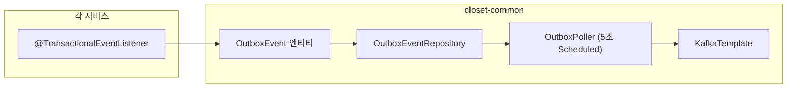

# [CP-01] Transactional Outbox 패턴 공통 모듈

## 메타

| 항목 | 값 |
|------|-----|
| 크기 | M (3-5일) |
| 스프린트 | 5 |
| 서비스 | closet-common |
| 레이어 | Infra/Common |
| 의존 | 없음 |
| Feature Flag | `OUTBOX_POLLING_ENABLED` |
| PM 결정 | PD-04, PD-51 |

## 작업 내용

Phase 2에서 ApplicationEvent -> Kafka 전환 시 DB-Kafka 원자성을 보장하기 위해 Transactional Outbox 패턴을 공통 모듈로 구현한다. 올리브영 GMS의 Outbox + Debezium CDC 벤치마킹에서 Outbox만 채택하고, Poller 방식으로 Kafka 발행한다. 이 모듈은 closet-order, closet-product, closet-shipping, closet-inventory, closet-review 5개 서비스에서 공통으로 사용된다.

### 설계 의도

- 분산 트랜잭션 정합성 보장: 비즈니스 로직 + outbox INSERT를 단일 트랜잭션으로 묶어 DB-Kafka 원자성 확보
- 공통 모듈화: 각 서비스에서 반복 구현하지 않도록 closet-common에 배치
- Debezium CDC 대신 Poller 채택 이유: 단일 인스턴스 환경에서 CDC 인프라는 오버엔지니어링

## 다이어그램

### Outbox 발행 흐름

### 모듈 구조

## 수정 파일 목록

| 파일 | 작업 | 설명 |
|------|------|------|
| `closet-common/src/.../outbox/OutboxEvent.kt` | 신규 | Outbox 이벤트 엔티티 |
| `closet-common/src/.../outbox/OutboxEventRepository.kt` | 신규 | JPA Repository |
| `closet-common/src/.../outbox/OutboxPoller.kt` | 신규 | 5초 간격 폴링 + Kafka 발행 |
| `closet-common/src/.../outbox/OutboxEventStatus.kt` | 신규 | PENDING, PUBLISHED, FAILED enum |
| `closet-common/src/main/resources/db/migration/V20__create_outbox_event.sql` | 신규 | outbox_event DDL |
| `closet-common/build.gradle.kts` | 수정 | spring-kafka 의존성 추가 |

## 영향 범위

- closet-order, closet-product, closet-shipping, closet-inventory, closet-review 5개 서비스에서 의존
- 기존 ApplicationEventPublisher 패턴은 유지하면서 병행 사용
- Kafka 토픽 생성은 별도 인프라 작업 (docker-compose)

## 테스트 케이스

### 정상 케이스

| # | 시나리오 | 검증 |
|---|---------|------|
| 1 | OutboxEvent 생성 시 status=PENDING으로 저장된다 | status 확인 |
| 2 | Poller가 PENDING 이벤트를 조회하여 Kafka로 발행한다 | Kafka Consumer 수신 확인 |
| 3 | 발행 성공 시 status=PUBLISHED, published_at 기록 | DB 상태 확인 |
| 4 | 비즈니스 로직 + outbox INSERT가 단일 트랜잭션으로 묶인다 | 비즈니스 로직 실패 시 outbox도 롤백 |
| 5 | LIMIT 100으로 배치 처리한다 | 100건 초과 시 다음 폴링에서 처리 |

### 예외 케이스

| # | 시나리오 | 검증 |
|---|---------|------|
| 1 | Kafka 발행 실패 시 status=FAILED로 마킹 | 재시도 대상으로 남음 |
| 2 | 트랜잭션 롤백 시 outbox_event도 롤백 | DB 정합성 |
| 3 | OUTBOX_POLLING_ENABLED=OFF 시 Poller 비활성화 | Feature Flag 동작 확인 |
| 4 | 동시에 여러 Poller 인스턴스 실행 방지 (SELECT FOR UPDATE) | 중복 발행 방지 |

## AC (Acceptance Criteria)

- [ ] OutboxEvent 엔티티 + Repository 구현 완료
- [ ] OutboxPoller가 5초 간격으로 PENDING 이벤트를 Kafka로 발행
- [ ] 발행 성공 시 PUBLISHED, 실패 시 FAILED 상태 전이
- [ ] 비즈니스 트랜잭션과 outbox INSERT가 원자적으로 동작
- [ ] `OUTBOX_POLLING_ENABLED` Feature Flag로 on/off 가능
- [ ] Flyway 마이그레이션 파일 작성 완료
- [ ] 통합 테스트 (Testcontainers MySQL + Kafka) 통과

## 체크리스트

- [ ] OutboxEvent 엔티티: aggregateType, aggregateId, eventType, topic, partitionKey, payload, status, createdAt, publishedAt
- [ ] OutboxPoller: @Scheduled(fixedDelay=5000), @ConditionalOnProperty
- [ ] outbox_event 테이블: COMMENT 필수, DATETIME(6), TINYINT(1) for status flag
- [ ] SELECT FOR UPDATE SKIP LOCKED로 동시 폴링 방지
- [ ] Kotest BehaviorSpec 테스트 작성
- [ ] BaseIntegrationTest 패턴 준수
