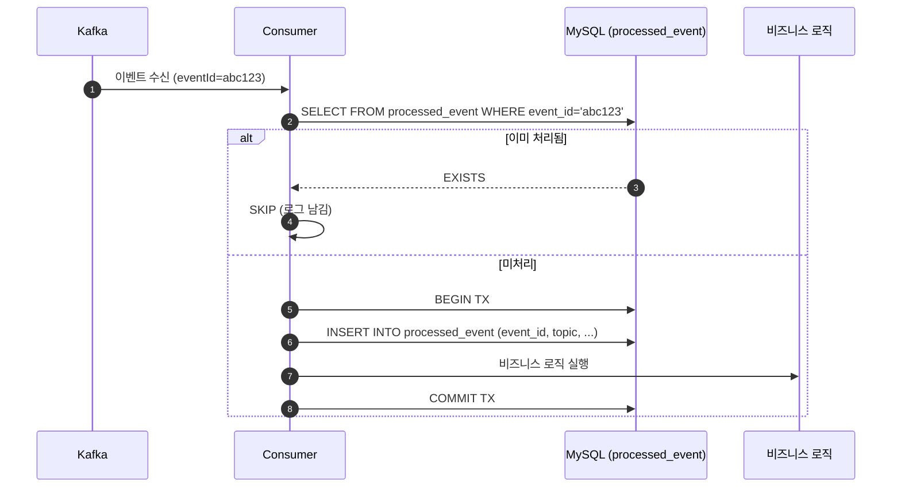
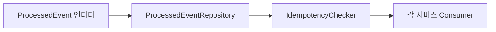

# [CP-02] processed_event 멱등성 공통 모듈

## 메타

| 항목 | 값 |
|------|-----|
| 크기 | S (1-2일) |
| 스프린트 | 5 |
| 서비스 | closet-common |
| 레이어 | Infra/Common |
| 의존 | 없음 |
| Feature Flag | 없음 (항상 활성) |
| PM 결정 | PD-04 |

## 작업 내용

Kafka Consumer가 동일 이벤트를 중복 수신했을 때 비즈니스 로직이 이중 실행되지 않도록 eventId 기반 멱등성 모듈을 구현한다. `processed_event` 테이블에 UNIQUE KEY(eventId)로 중복을 방지하며, SELECT -> INSERT -> 비즈니스 로직 -> COMMIT 순서로 처리한다.

### 설계 의도

- Consumer 레벨 중복 수신 방어: Kafka at-least-once 전송 특성상 이벤트 중복 수신이 발생할 수 있음
- 재고/포인트 등 금전적 영향이 있는 이벤트의 이중 처리 방지
- 공통 모듈로 각 서비스의 Consumer에서 재사용

## 다이어그램

### 멱등성 처리 흐름

### 모듈 구조

## 수정 파일 목록

| 파일 | 작업 | 설명 |
|------|------|------|
| `closet-common/src/.../idempotency/ProcessedEvent.kt` | 신규 | 처리 완료 이벤트 엔티티 |
| `closet-common/src/.../idempotency/ProcessedEventRepository.kt` | 신규 | JPA Repository |
| `closet-common/src/.../idempotency/IdempotencyChecker.kt` | 신규 | 중복 체크 + 등록 유틸 |
| `closet-common/src/main/resources/db/migration/V21__create_processed_event.sql` | 신규 | processed_event DDL |

## 영향 범위

- closet-inventory, closet-order, closet-payment, closet-member, closet-search 5개 서비스의 Consumer에서 사용
- 기존 Consumer 로직에 IdempotencyChecker.process() 래핑 추가 필요

## 테스트 케이스

### 정상 케이스

| # | 시나리오 | 검증 |
|---|---------|------|
| 1 | 최초 이벤트 수신 시 정상 처리 후 processed_event에 기록된다 | DB INSERT 확인 |
| 2 | 비즈니스 로직과 processed_event INSERT가 동일 트랜잭션 | 트랜잭션 원자성 |

### 예외 케이스

| # | 시나리오 | 검증 |
|---|---------|------|
| 1 | 동일 eventId 이벤트 중복 수신 시 비즈니스 로직 스킵 | 로그 확인 + 비즈니스 로직 미실행 |
| 2 | 비즈니스 로직 실패 시 processed_event도 롤백 | 재시도 가능 상태 유지 |
| 3 | UNIQUE KEY 위반 시 (동시 수신) 하나만 처리 | 동시성 안전 |

## AC

- [ ] ProcessedEvent 엔티티 + Repository 구현 완료
- [ ] IdempotencyChecker.process(eventId, topic, block) 인터페이스 제공
- [ ] 중복 이벤트 수신 시 비즈니스 로직 스킵 + 로그 기록
- [ ] 비즈니스 로직 실패 시 processed_event도 롤백
- [ ] Flyway 마이그레이션 (UNIQUE KEY on event_id)
- [ ] 통합 테스트 통과

## 체크리스트

- [ ] processed_event 테이블: event_id (VARCHAR 100, UNIQUE), topic, consumer_group, processed_at DATETIME(6), COMMENT 필수
- [ ] IdempotencyChecker: @Transactional 내에서 동작
- [ ] 동시 수신 시 UNIQUE KEY constraint로 하나만 성공하도록 INSERT 기반 락 사용
- [ ] Kotest BehaviorSpec 테스트
