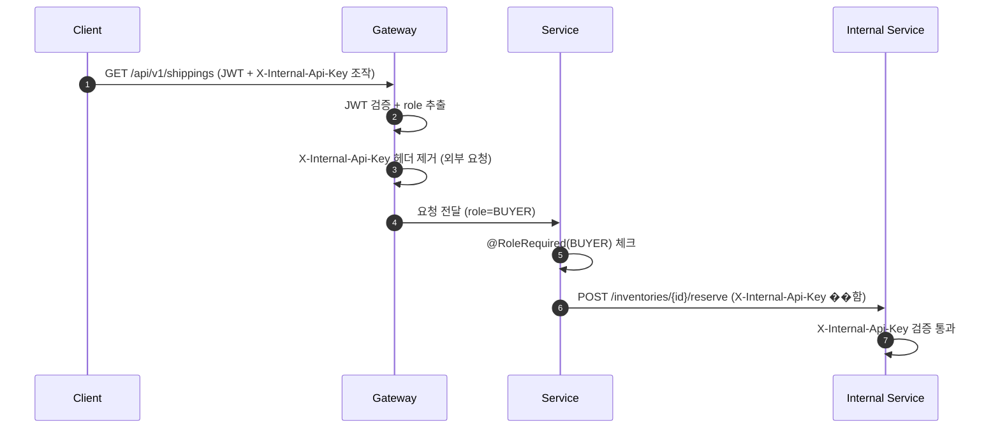
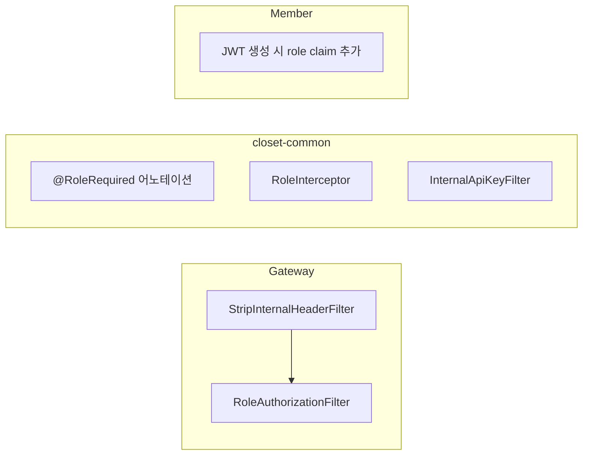

# [CP-03] 서비스 간 인증 (X-Internal-Api-Key) + JWT role claim

## 메타

| 항목 | 값 |
|------|-----|
| 크기 | M (3-5일) |
| 스프린트 | 5 |
| 서비스 | closet-gateway, closet-member, closet-common |
| 레이어 | Infra/Common |
| 의존 | 없음 |
| Feature Flag | `ROLE_AUTHORIZATION_ENABLED` |
| PM 결정 | PD-03, Gap N-04 |

## 작업 내용

Phase 2에서 서비스 간 내부 API 호출(inventory reserve/deduct/release 등)의 보안을 위해 X-Internal-Api-Key 헤더 방식을 도입한다. 또한 구매자/판매자/관리자 역할을 구분하기 위해 JWT claim에 role(BUYER/SELLER/ADMIN)을 추가하고 Gateway에 RoleAuthorizationFilter를 구현한다.

### 설계 의도

- 서비스 간 인증: Gateway에서 외부 요청의 X-Internal-Api-Key 헤더를 제거하여 내부 API 호출만 허용
- RBAC: Phase 2 API는 SELLER(송장 등록, 반품 처리), BUYER(반품 신청, 리뷰), ADMIN(블라인드) 권한이 필요
- Phase 2 착수 전 인가 인프라 선행 구축 (Gap N-04)

## 다이어그램

### 인증/인가 흐름

### 모듈 구조

## 수정 파일 목록

| 파일 | 작업 | 설명 |
|------|------|------|
| `closet-member/src/.../auth/JwtTokenProvider.kt` | 수정 | JWT claim에 role 추가 |
| `closet-member/src/.../auth/MemberRole.kt` | 신규 | BUYER, SELLER, ADMIN enum |
| `closet-gateway/src/.../filter/StripInternalHeaderFilter.kt` | 신규 | 외부 요청의 X-Internal-Api-Key 제거 |
| `closet-gateway/src/.../filter/RoleAuthorizationFilter.kt` | 신규 | role 기반 경로별 권한 체크 |
| `closet-common/src/.../auth/RoleRequired.kt` | 신규 | @RoleRequired 어노테이션 |
| `closet-common/src/.../auth/RoleInterceptor.kt` | 신규 | 어노테이션 기반 인가 인터셉터 |
| `closet-common/src/.../auth/InternalApiKeyFilter.kt` | 신규 | 내부 API 키 검증 필터 |
| `closet-common/src/main/resources/application-common.yml` | 수정 | internal.api.key 설정 추가 |

## 영향 범위

- closet-member: JWT 토큰 구조 변경 (하위 호환 유지 필요)
- closet-gateway: 새 필터 체인 추가
- 모든 Phase 2 서비스: @RoleRequired 어노테이션 사용
- closet-inventory: reserve/deduct/release API에 InternalApiKeyFilter 적용

## 테스트 케이스

### 정상 케이스

| # | ��나리오 | 검�� |
|---|---------|------|
| 1 | JWT에 role=BUYER claim이 포함된다 | 토큰 디코딩 확인 |
| 2 | SELLER 권한 API에 SELLER JWT로 접근 성공 | 200 OK |
| 3 | 내부 API에 X-Internal-Api-Key로 접근 성공 | 200 OK |
| 4 | ROLE_AUTHORIZATION_ENABLED=OFF 시 인가 체크 스킵 | 모든 요청 통과 |

### 예외 케이스

| # | 시나���오 | 검증 |
|---|---------|------|
| 1 | BUYER가 SELLER 전용 API 접근 시 403 Forbidden | 에러 응답 확인 |
| 2 | 외부 요청에 X-Internal-Api-Key를 포함해도 Gateway에서 제거 | 내부 서비스에서 거절 |
| 3 | role claim 없는 레거시 JWT 토큰 호환성 | 기본 BUYER로 처리 |
| 4 | 잘못된 X-Internal-Api-Key 시 401 Unauthorized | 에러 응답 확인 |

## AC

- [ ] JWT 토큰에 role claim 추가 (BUYER/SELLER/ADMIN)
- [ ] Gateway에서 외부 요청의 X-Internal-Api-Key 헤더 자동 제거
- [ ] @RoleRequired 어노테이션으로 API 레벨 인가 체크
- [ ] InternalApiKeyFilter로 내부 API 보호
- [ ] ROLE_AUTHORIZATION_ENABLED Feature Flag 연동
- [ ] 레거시 JWT 하위 호환 (role 없으면 BUYER 기본)
- [ ] 통합 테스트 통과

## 체크리스트

- [ ] MemberRole enum: BUYER, SELLER, ADMIN
- [ ] JwtTokenProvider: role claim 추가 (기존 토큰 하위 호환)
- [ ] StripInternalHeaderFilter: 우선순위 최상위
- [ ] RoleAuthorizationFilter: 경로 패턴 + role 매트릭스 설정
- [ ] InternalApiKeyFilter: @ConditionalOnProperty("internal.api.enabled")
- [ ] application.yml에 internal.api.key 환경변수 외부화
- [ ] Kotest BehaviorSpec 테스트
