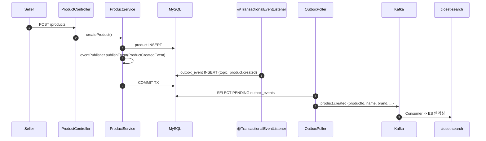
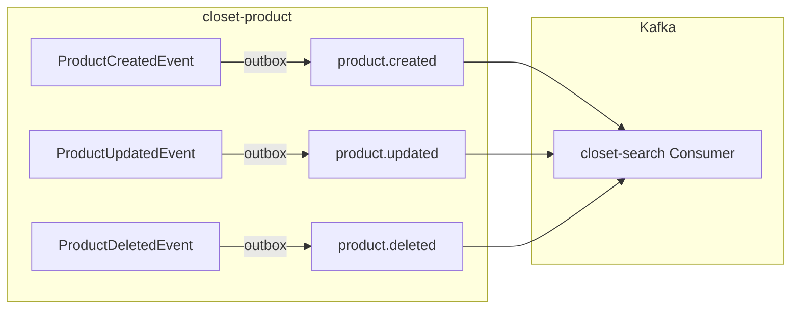

# [CP-04] closet-product Kafka 이벤트 발행 (Outbox 전환)

## 메타

| 항목 | 값 |
|------|-----|
| 크기 | M (3-5일) |
| 스프린트 | 5 |
| ��비스 | closet-product |
| 레이어 | Service |
| 의존 | CP-01 (Outbox 공통) |
| Feature Flag | `OUTBOX_POLLING_ENABLED` |
| PM 결정 | PD-43, Gap N-06 |

## 작업 내용

검색 인덱싱(CP-10)의 전제 조건으로, closet-product에서 상품 생성/수정/삭제 시 Kafka 이벤트를 발행하도록 한다. 기존 `ApplicationEventPublisher`를 유지하면서 `@TransactionalEventListener`에서 outbox 테이블에 INSERT하는 방식으로 Outbox 패턴을 적용한다.

### 설계 의도

- 검색 서비스의 실시간 인덱싱을 위한 이벤트 소스 확보 (Gap N-06 해소)
- 기존 인프로세스 이벤트는 유지하면서 Kafka 발행을 병행
- Outbox 패턴으로 DB-Kafka 원자성 보장

## 다이어그램

### 이벤트 발행 흐름

### 토픽 구조

## 수정 파일 목록

| 파일 | 작업 | ���명 |
|------|------|------|
| `closet-product/src/.../event/ProductOutboxListener.kt` | 신규 | @TransactionalEventListener -> outbox INSERT |
| `closet-product/src/.../event/ProductCreatedEvent.kt` | 수정 | Kafka 페이로드 필드 추가 |
| `closet-product/src/.../event/ProductUpdatedEvent.kt` | 수정 | Kafka 페이로드 필드 추가 |
| `closet-product/src/.../event/ProductDeletedEvent.kt` | 신규 | 상품 삭제 이벤트 |
| `closet-product/src/.../config/OutboxConfig.kt` | 신규 | OutboxPoller 활성화 설정 |
| `closet-product/build.gradle.kts` | 수정 | closet-common outbox 모듈 의존성 |
| `closet-product/src/main/resources/db/migration/V__create_outbox_event.sql` | 신규 | outbox_event 테이블 DDL |

## 영향 범위

- closet-product: 기존 이벤트 발행 로직에 outbox 삽입 추가 (기존 인프로세스 이벤트 유지)
- closet-search (CP-10): product.created/updated/deleted Consumer의 전제 조건
- Kafka: product.created, product.updated, product.deleted 3개 토픽 생성 필요

## 테스트 케이스

### 정상 케이스

| # | 시나리오 | 검증 |
|---|---------|------|
| 1 | 상품 생성 시 product.created outbox 이벤트가 생성된다 | outbox_event 테이블 확인 |
| 2 | 상품 수정 시 product.updated outbox 이벤트가 생성된다 | outbox_event 테이블 확인 |
| 3 | 상품 삭제 시 product.deleted outbox 이벤트가 생성된다 | outbox_event 테이블 확인 |
| 4 | outbox 이벤트 페이로드에 productId, name, brand, category, price, sizes, colors 포함 | JSON 검증 |
| 5 | Poller가 이벤트를 Kafka로 발행한다 | Kafka Consumer 수신 확인 |

### 예외 케이스

| # | 시나리오 | 검증 |
|---|---------|------|
| 1 | 상품 저장 실패 시 outbox_event도 롤백 | DB 정합성 |
| 2 | 기존 ApplicationEvent 기반 로직이 정상 동작 | 인프로세스 이벤트 하위 호환 |
| 3 | OUTBOX_POLLING_ENABLED=OFF 시 outbox INSERT는 되지만 Kafka 발행 안됨 | Feature Flag 동작 |

## AC

- [ ] 상품 생성/수정/삭제 시 outbox_event 테이블에 이벤트 INSERT
- [ ] 기존 ApplicationEvent 기반 로직 하위 호환 유지
- [ ] product.created/updated/deleted 토픽으로 Kafka 발행
- [ ] 페이로드: productId, name, brand, category, subCategory, price, salePrice, sizes, colors, tags, imageUrl, status, sellerId
- [ ] Flyway 마이그레이션 작성
- [ ] 통합 테스트 (Testcontainers MySQL + Kafka) 통과

## 체크리스트

- [ ] @TransactionalEventListener(phase = BEFORE_COMMIT) 사용
- [ ] partitionKey = productId (순서 보장)
- [ ] 기존 ProductService 수정 최소화 (리스너만 추가)
- [ ] Kotest BehaviorSpec 테스트
