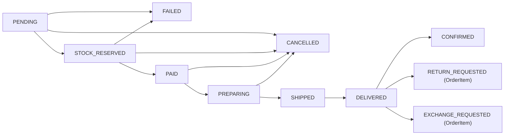
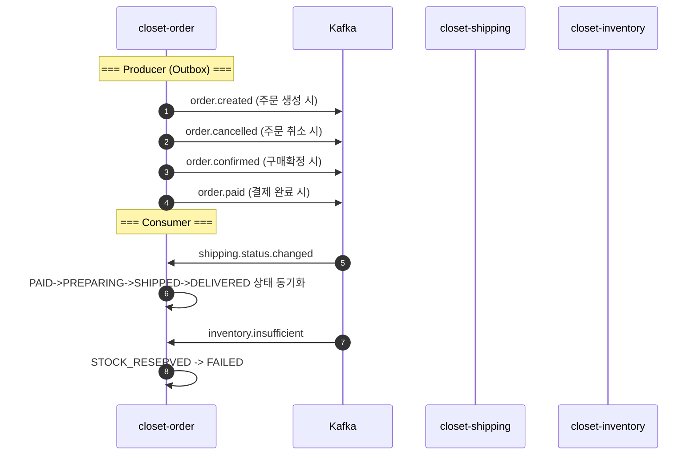

# [CP-05] closet-order Outbox 전환 + 상태 확장

## 메타

| 항목 | 값 |
|------|-----|
| 크기 | M (3-5일) |
| 스프린트 | 5 |
| 서비스 | closet-order |
| 레이어 | Service |
| 의존 | CP-01 (Outbox), CP-02 (멱등성) |
| Feature Flag | `OUTBOX_POLLING_ENABLED` |
| PM 결정 | PD-09, PD-51, Gap C-03 |

## 작업 내용

closet-order의 기존 ApplicationEventPublisher를 Outbox 패턴으로 전환하고, Phase 2 배송/반품/교환을 위해 OrderStatus와 OrderItemStatus enum을 확장한다. 또한 shipping.status.changed, inventory.insufficient Kafka Consumer를 추가하여 주문 상태를 동기화한다.

### 설계 의도

- 분산 이벤트 전환: order.created, order.cancelled, order.confirmed 등을 Kafka로 발행 (재고, 배송 서비스 연동)
- 상태 머신 확장: DELIVERED -> CONFIRMED + RETURN_REQUESTED + EXCHANGE_REQUESTED 전이 추가
- 외부 이벤트 수신: 배송 상태 변경, 재고 부족 이벤트를 수신하여 주문 상태 동기화

## 다이어그램

### 확장된 주문 상태 머신

### Kafka Consumer/Producer 흐름

## 수정 파일 목록

| 파일 | 작업 | 설명 |
|------|------|------|
| `closet-order/src/.../domain/OrderStatus.kt` | 수정 | canTransitionTo 확장 (RETURN_REQUESTED, EXCHANGE_REQUESTED) |
| `closet-order/src/.../domain/OrderItemStatus.kt` | 수정 | EXCHANGE_REQUESTED, EXCHANGE_COMPLETED 추가 |
| `closet-order/src/.../event/OrderOutboxListener.kt` | 신규 | @TransactionalEventListener -> outbox INSERT |
| `closet-order/src/.../consumer/ShippingStatusConsumer.kt` | 신규 | shipping.status.changed Consumer |
| `closet-order/src/.../consumer/InventoryInsufficientConsumer.kt` | 신규 | inventory.insufficient Consumer |
| `closet-order/src/.../config/KafkaConsumerConfig.kt` | 신규 | Consumer 설정 |
| `closet-order/build.gradle.kts` | 수정 | closet-common outbox/idempotency 의존성 |
| `closet-order/src/main/resources/db/migration/V__create_outbox_processed.sql` | 신규 | outbox_event, processed_event DDL |

## 영향 범위

- closet-order: OrderStatus/OrderItemStatus enum 변경 (기존 전이 규칙 유지, 신규 전이만 추가)
- closet-inventory (CP-08): order.created, order.cancelled 이벤트 의존
- closet-shipping (CP-13): order.created 이벤트 의존
- 기존 주문 생성/취소 API: Outbox 삽입이 추가되지만 외부 인터페이스 변경 없음

## 테스트 케이스

### 정상 케이스

| # | 시나리오 | 검증 |
|---|---------|------|
| 1 | 주문 생성 시 order.created outbox 이벤트 발행 | Kafka 수신 확인 |
| 2 | 주문 취소 시 order.cancelled outbox 이벤트 발행 | Kafka 수신 확인 |
| 3 | shipping.status.changed(READY) 수신 시 PAID -> PREPARING | 주문 상태 확인 |
| 4 | shipping.status.changed(IN_TRANSIT) 수신 시 PREPARING -> SHIPPED | 주문 상태 확인 |
| 5 | shipping.status.changed(DELIVERED) 수신 시 SHIPPED -> DELIVERED | 주문 상태 확인 |
| 6 | inventory.insufficient 수신 시 STOCK_RESERVED -> FAILED | 주문 상태 확인 |
| 7 | DELIVERED -> CONFIRMED 전이 가능 | 상태 머신 검증 |

### 예외 케이스

| # | 시나리오 | 검증 |
|---|---------|------|
| 1 | 이미 CANCELLED인 주문에 shipping 이벤트 수신 시 무시 | 상태 불변 |
| 2 | 중복 이벤트 수신 시 멱등성 보장 (processed_event) | 이중 처리 방지 |
| 3 | 잘못된 상태 전이 시도 시 로그 기록 + 무시 | 에러 미전파 |
| 4 | 기존 주문 CRUD API 정상 동작 (하위 호환) | 기존 테스트 통과 |

## AC

- [ ] OrderStatus에 RETURN_REQUESTED, EXCHANGE_REQUESTED 전이 추가
- [ ] OrderItemStatus에 EXCHANGE_REQUESTED, EXCHANGE_COMPLETED 추가
- [ ] order.created/cancelled/confirmed/paid Outbox 발행
- [ ] shipping.status.changed Consumer 구현 + 주문 상태 동기화
- [ ] inventory.insufficient Consumer 구현 + 주문 FAILED 처리
- [ ] 멱등성 체크 (processed_event) 적용
- [ ] 기존 주문 API 하위 호환 유지
- [ ] 통합 테스트 통과

## 체크리스트

- [ ] OrderStatus.canTransitionTo: DELIVERED에서 RETURN_REQUESTED, EXCHANGE_REQUESTED 추가
- [ ] OrderItemStatus: EXCHANGE_REQUESTED, EXCHANGE_COMPLETED 추가 + canTransitionTo 규칙
- [ ] Consumer: @KafkaListener + consumer group = "order-service"
- [ ] Consumer: IdempotencyChecker 래핑
- [ ] 기존 OrderServiceTest 그린 유지
- [ ] Kotest BehaviorSpec 신규 테스트
