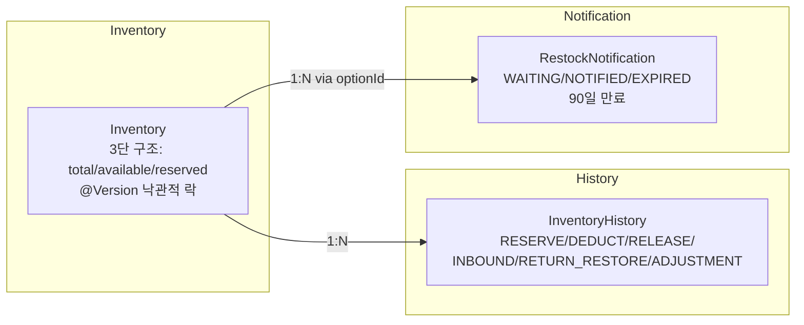
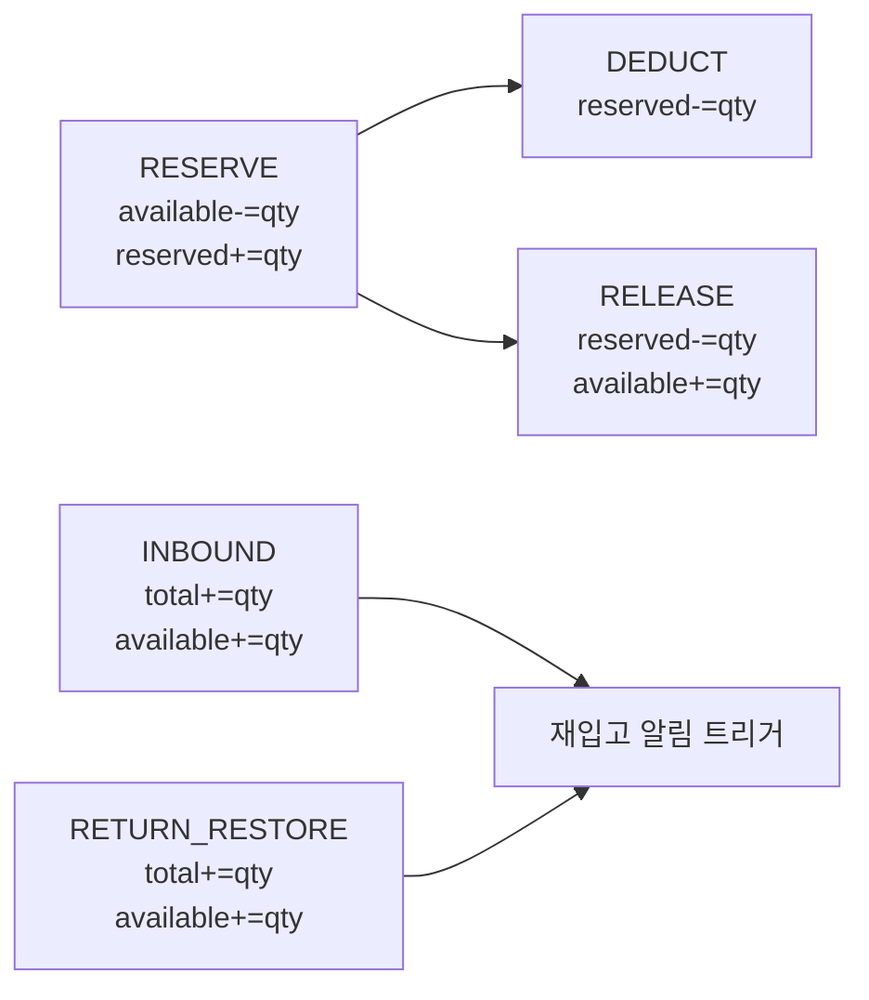

# [CP-06] Inventory 도메인 + Repository

## 메타

| 항목 | 값 |
|------|-----|
| 크기 | M (3-5일) |
| 스프린트 | 5 |
| 서비스 | closet-inventory |
| 레이어 | Domain/Repository |
| 의존 | 없음 |
| Feature Flag | 없음 |
| PM 결정 | PD-06, PD-18, PD-20, PD-21 |

## 작업 내용

closet-inventory 서비스의 핵심 도메인 엔티티(Inventory, InventoryHistory, RestockNotification)와 JPA Repository를 구현한다. 기존 Flyway 스키마의 3단 구조(total/available/reserved)를 기준으로 도메인 모델을 설계하며, 비즈니스 불변 조건을 엔티티에 캡슐화한다.

### 설계 의도

- 3단 재고 구조: total/available/reserved로 RESERVE -> DEDUCT -> RELEASE 패턴 지원 (PD-06, PD-18)
- 비즈니스 로직 캡슐화: reserve(), deduct(), release(), inbound(), returnRestore() 메서드를 엔티티에 배치
- 불변 조건: totalQuantity == availableQuantity + reservedQuantity (항상 성립)
- @Version 낙관적 락: 분산 락과 이중 잠금으로 동시성 방어 (CP-07에서 사용)

## 다이어그램

### 도메인 모델 관계

### 재고 변동 흐름

## 수정 파일 목록

| 파일 | 작업 | 설명 |
|------|------|------|
| `closet-inventory/src/.../domain/Inventory.kt` | 신규 | 3단 재고 엔티티 + 비즈니스 메서드 |
| `closet-inventory/src/.../domain/InventoryHistory.kt` | 신규 | 변경 이력 엔티티 |
| `closet-inventory/src/.../domain/ChangeType.kt` | 신규 | RESERVE, DEDUCT, RELEASE, INBOUND, RETURN_RESTORE, ADJUSTMENT |
| `closet-inventory/src/.../domain/RestockNotification.kt` | 신규 | 재입고 알림 엔티티 |
| `closet-inventory/src/.../domain/RestockNotificationStatus.kt` | 신규 | WAITING, NOTIFIED, EXPIRED |
| `closet-inventory/src/.../repository/InventoryRepository.kt` | 신규 | JPA Repository |
| `closet-inventory/src/.../repository/InventoryHistoryRepository.kt` | 신규 | JPA Repository |
| `closet-inventory/src/.../repository/RestockNotificationRepository.kt` | 신규 | JPA Repository |
| `closet-inventory/src/main/resources/db/migration/V1__init_inventory.sql` | 신규 | inventory, inventory_history DDL |
| `closet-inventory/src/main/resources/db/migration/V2__add_restock_notification.sql` | 신규 | restock_notification DDL |
| `closet-inventory/src/main/resources/application.yml` | 신규 | 서비스 기본 설정 (port:8089) |
| `closet-inventory/build.gradle.kts` | 수정 | JPA, MySQL, QueryDSL 의존성 |
| `settings.gradle.kts` | 수정 | closet-inventory 모듈 등록 |

## 영향 범위

- closet-inventory 신규 서비스 생성 (포트 8089, PD-05)
- settings.gradle.kts에 모듈 등록 필요
- docker-compose.yml에 서비스 추가 필요 (인프라 작업)

## 테스트 케이스

### 정상 케이스

| # | 시나리오 | 검증 |
|---|---------|------|
| 1 | reserve(quantity) 시 available 감소, reserved 증가 | 불변 조건 유지 |
| 2 | deduct(quantity) 시 reserved 감소 | total 변경 없음 |
| 3 | release(quantity) 시 reserved 감소, available 증가 | 원복 확인 |
| 4 | inbound(quantity) 시 total, available 증가 | 입고 반영 |
| 5 | returnRestore(quantity) 시 total, available 증가 | 반품 복구 |
| 6 | InventoryHistory 생성 시 before/after 스냅샷 기록 | 이력 정확성 |
| 7 | RestockNotification 생성 시 expiredAt = createdAt + 90일 | 만료일 계산 |
| 8 | 안전재고 카테고리별 기본값 (상의/하의 10, 아우터 5, 신발 8, 액세서리 15) | PD-20 |

### 예외 케이스

| # | 시나리오 | 검증 |
|---|---------|------|
| 1 | reserve 시 available < quantity면 예외 발생 | InsufficientStockException |
| 2 | deduct 시 reserved < quantity면 예외 발생 | IllegalStateException |
| 3 | release 시 reserved < quantity면 예외 발생 | IllegalStateException |
| 4 | availableQuantity < 0 불가 | 불변 조건 방어 |
| 5 | reservedQuantity < 0 불가 | 불변 조건 방어 |
| 6 | total != available + reserved 시 일관성 오류 | 불변 조건 체크 |

## AC

- [ ] Inventory 엔티티: total/available/reserved 3단 구조 + @Version
- [ ] 비즈니스 메서드: reserve, deduct, release, inbound, returnRestore
- [ ] 불변 조건: totalQuantity == availableQuantity + reservedQuantity
- [ ] InventoryHistory: 모든 변동에 before/after 스냅샷 기록
- [ ] RestockNotification: WAITING/NOTIFIED/EXPIRED + 90일 만료
- [ ] Flyway DDL (COMMENT 필수, DATETIME(6), FK 미사용)
- [ ] settings.gradle.kts 모듈 등록
- [ ] 단위 테스트 + Repository 테스트 (Testcontainers MySQL) 통과

## 체크리스트

- [ ] Inventory: @Version Long 필드, UNIQUE(product_id, product_option_id)
- [ ] ChangeType enum: RESERVE, DEDUCT, RELEASE, INBOUND, RETURN_RESTORE, ADJUSTMENT
- [ ] InventoryHistory: referenceId/referenceType로 추적 가능
- [ ] RestockNotification: UNIQUE(product_option_id, member_id) 방지 중복 신청
- [ ] 최대 알림 신청 50건 제한 (PD-21 관련, 도메인 로직)
- [ ] DDL: FK 미사용, TINYINT(1) for boolean, COMMENT 필수
- [ ] Kotest BehaviorSpec 테스트
