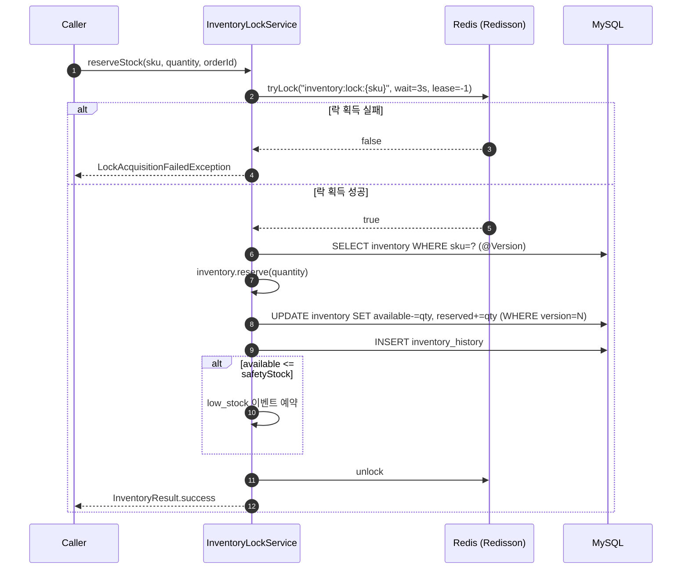
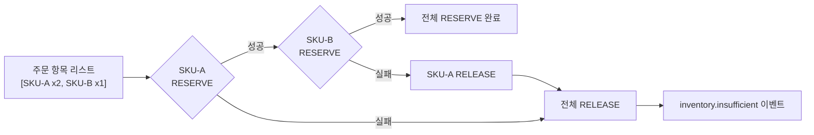

# [CP-07] Inventory RESERVE/DEDUCT/RELEASE Service + Redisson 분산 락

## 메타

| 항목 | 값 |
|------|-----|
| 크기 | L (1주+) |
| 스프린트 | 5 |
| 서비스 | closet-inventory |
| 레이어 | Service |
| 의존 | CP-06 (Inventory 도메인) |
| Feature Flag | 없음 |
| PM 결정 | PD-18, PD-19, PD-22 |

## 작업 내용

재고 차감의 핵심 서비스를 구현한다. Redisson 분산 락(SKU 단위) + JPA @Version 낙관적 락 이중 잠금으로 동시성을 방어하며, RESERVE -> DEDUCT -> RELEASE 3단계 패턴을 구현한다. 프로덕션 목표 100 TPS, P99 200ms 이내를 달성해야 한다.

### 설계 의도

- 이중 잠금: Redisson tryLock(SKU별 세밀 잠금) + @Version(DB 레벨 최종 방어)
- All-or-Nothing: 여러 SKU 주문 시 하나라도 부족하면 전체 RELEASE (PD-19)
- Watch Dog: leaseTime=-1로 Watch Dog 자동 갱신하여 긴 트랜잭션에서도 락 유지

## 다이어그램

### 분산 락 + 재고 차감 시퀀스

### All-or-Nothing 흐름

## 수정 파일 목록

| 파일 | 작업 | 설명 |
|------|------|------|
| `closet-inventory/src/.../service/InventoryLockService.kt` | 신규 | 분산 락 + RESERVE/DEDUCT/RELEASE |
| `closet-inventory/src/.../service/InventoryService.kt` | 신규 | 비즈니스 서비스 (All-or-Nothing 오케스트레이션) |
| `closet-inventory/src/.../config/RedissonConfig.kt` | 신규 | Redisson 클라이언트 설정 |
| `closet-inventory/src/.../controller/InventoryInternalController.kt` | 신규 | 내부 API (reserve/deduct/release) |
| `closet-inventory/src/.../dto/InventoryReserveRequest.kt` | 신규 | 예약 요청 DTO |
| `closet-inventory/src/.../dto/InventoryResult.kt` | 신규 | 결과 DTO |
| `closet-inventory/src/.../exception/InsufficientStockException.kt` | 신규 | 재고 부족 예외 |
| `closet-inventory/build.gradle.kts` | 수정 | redisson-spring-boot-starter 추가 |

## 영향 범위

- closet-inventory: 핵심 서비스 로직
- Redis: inventory:lock:{sku} 키 패턴 사용
- closet-order: inventory.insufficient 이벤트 수신 (CP-05)
- 성능: 100 TPS 동시성 테스트 필요

## 테스트 케이스

### 정상 케이스

| # | 시나리오 | 검증 |
|---|---------|------|
| 1 | reserveStock 시 available 감소, reserved 증가 | 3단 구조 정합성 |
| 2 | deductStock 시 reserved 감소 | total 불변 |
| 3 | releaseStock 시 reserved 감소, available 증가 | 원복 확인 |
| 4 | 100스레드 동시 RESERVE 시 데이터 정합성 유지 | 동시성 테스트 |
| 5 | available <= safetyStock 시 low_stock 이벤트 예약 | 이벤트 발행 확인 |
| 6 | available == 0 시 out_of_stock 이벤트 예약 | 이벤트 발행 확인 |
| 7 | 다중 SKU All-or-Nothing: 전부 성공 시 전체 RESERVE | 정상 경로 |
| 8 | RESERVE P99 < 200ms | 성능 기준 충족 |

### 예외 케이스

| # | 시나리오 | 검증 |
|---|---------|------|
| 1 | 재고 부족 시 InsufficientStockException + 부족 SKU 정보 포함 | 에러 응답 |
| 2 | 다중 SKU 중 하나 부족 시 이미 RESERVE된 건 전체 RELEASE | All-or-Nothing |
| 3 | 락 획득 실패 (3초 초과) 시 LockAcquisitionFailedException | 타임아웃 |
| 4 | @Version 충돌 시 OptimisticLockingFailureException | 낙관적 락 방어 |
| 5 | 락 보유 스레드 아닌 다른 스레드에서 unlock 시도 시 안전 | isHeldByCurrentThread 체크 |
| 6 | 트랜잭션 롤백 시 재고 불변 조건 유지 | DB 정합성 |

## AC

- [ ] Redisson tryLock (waitTime=3s, leaseTime=-1 Watch Dog)
- [ ] SKU 단위 세밀 잠금 (inventory:lock:{sku})
- [ ] @Version 낙관적 락 이중 잠금
- [ ] RESERVE/DEDUCT/RELEASE 3단계 구현
- [ ] All-or-Nothing: 다중 SKU 중 하나 실패 시 전체 RELEASE
- [ ] inventory.insufficient 이벤트 발행 (부족 SKU 정보 포함)
- [ ] 100스레드 동시성 테스트 통과 (P99 200ms 이내)
- [ ] InventoryHistory 모든 변동에 기록
- [ ] 내부 API (reserve/deduct/release) X-Internal-Api-Key 보호

## 체크리스트

- [ ] RedissonConfig: SingleServerConfig, codec=JsonJacksonCodec
- [ ] LOCK_KEY_PREFIX = "inventory:lock:"
- [ ] WAIT_TIME = 3L (초), LEASE_TIME = -1L (Watch Dog)
- [ ] finally 블록에서 lock.unlock() (isHeldByCurrentThread 확인)
- [ ] All-or-Nothing: try-catch에서 부분 성공 건 보상 RELEASE
- [ ] 내부 API: POST /api/v1/inventories/{id}/reserve, /deduct, /release
- [ ] Kotest BehaviorSpec + 동시성 테스트 (CountDownLatch + ExecutorService)
- [ ] Testcontainers Redis + MySQL
