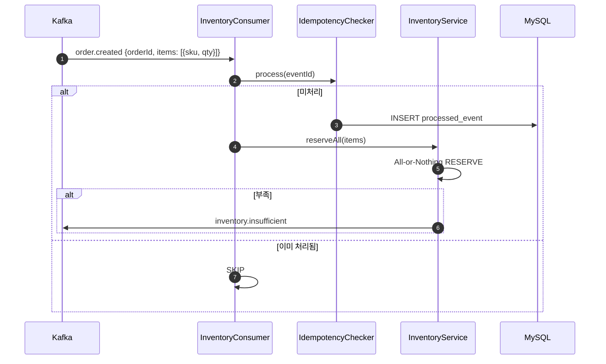
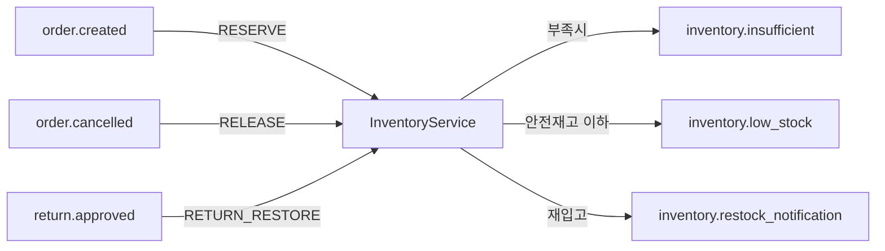

# [CP-08] Inventory Kafka Consumer (order.created, order.cancelled, return.approved)

## 메타

| 항목 | 값 |
|------|-----|
| 크기 | M (3-5일) |
| 스프린트 | 5 |
| 서비스 | closet-inventory |
| 레이어 | Service |
| 의존 | CP-06 (도메인), CP-07 (분산 락), CP-02 (멱등성) |
| Feature Flag | `INVENTORY_KAFKA_ENABLED` |
| PM 결정 | PD-18, PD-19 |

## 작업 내용

closet-inventory에 Kafka Consumer를 구현하여 주문 이벤트(order.created, order.cancelled)와 반품 이벤트(return.approved)를 수신해 재고를 자동 관리한다. 모든 Consumer에 processed_event 멱등성을 적용한다.

### 설계 의도

- order.created 수신 시 All-or-Nothing RESERVE 실행
- order.cancelled 수신 시 RELEASE (reserved -> available 복구)
- return.approved 수신 시 RETURN_RESTORE (available + total 증가)
- 멱등성: processed_event로 중복 이벤트 방어

## 다이어그램

### Consumer 이벤트 처리 흐름

### Consumer 토픽 매핑

## 수정 파일 목록

| 파일 | 작업 | 설명 |
|------|------|------|
| `closet-inventory/src/.../consumer/OrderCreatedConsumer.kt` | 신규 | order.created -> RESERVE |
| `closet-inventory/src/.../consumer/OrderCancelledConsumer.kt` | 신규 | order.cancelled -> RELEASE |
| `closet-inventory/src/.../consumer/ReturnApprovedConsumer.kt` | 신규 | return.approved -> RETURN_RESTORE |
| `closet-inventory/src/.../config/KafkaConsumerConfig.kt` | 신규 | Consumer 설정 |
| `closet-inventory/src/.../event/InventoryEventPublisher.kt` | 신규 | 이벤트 발행 (insufficient, low_stock 등) |
| `closet-inventory/build.gradle.kts` | 수정 | spring-kafka, closet-common 의존성 |

## 영향 범위

- closet-order (CP-05): order.created, order.cancelled 이벤트 발행 서비스
- closet-shipping (CP-17): return.approved 이벤트 발행 서비스
- closet-order (CP-05): inventory.insufficient 이벤트 수신 서비스

## 테스트 케이스

### 정상 케이스

| # | 시나리오 | 검증 |
|---|---------|------|
| 1 | order.created 수신 시 해당 SKU들의 RESERVE 실행 | available 감소, reserved 증가 |
| 2 | order.cancelled 수신 시 해당 SKU들의 RELEASE 실행 | reserved 감소, available 증가 |
| 3 | return.approved 수신 시 RETURN_RESTORE 실행 | available, total 증가 |
| 4 | return.approved 후 available 0->양수 전환 시 재입고 알림 이벤트 발행 | restock_notification 트리거 |
| 5 | RESERVE 성공 시 안전재고 이하면 low_stock 이벤트 발행 | 이벤트 확인 |

### 예외 케이스

| # | 시나리오 | 검증 |
|---|---------|------|
| 1 | order.created 재고 부족 시 All-or-Nothing RELEASE + insufficient 이벤트 | 이벤트 발행 확인 |
| 2 | 중복 order.created 이벤트 수신 시 멱등성 보장 | 이중 RESERVE 방지 |
| 3 | 중복 return.approved 이벤트 수신 시 멱등성 보장 | 이중 RESTORE 방지 |
| 4 | INVENTORY_KAFKA_ENABLED=OFF 시 Consumer 비활성화 | Feature Flag |

## AC

- [ ] order.created Consumer: All-or-Nothing RESERVE + 부족 시 insufficient 이벤트
- [ ] order.cancelled Consumer: RELEASE (예약 해제)
- [ ] return.approved Consumer: RETURN_RESTORE (재고 복구)
- [ ] 모든 Consumer에 IdempotencyChecker 적용
- [ ] INVENTORY_KAFKA_ENABLED Feature Flag 연동
- [ ] 통합 테스트 (Testcontainers Kafka + MySQL + Redis) 통과

## 체크리스트

- [ ] Consumer Group: "inventory-service"
- [ ] @KafkaListener 각 토픽별 분리
- [ ] 이벤트 페이로드 역직렬화: Jackson ObjectMapper
- [ ] Outbox 패턴으로 이벤트 발행 (insufficient, low_stock 등)
- [ ] Kotest BehaviorSpec + Testcontainers
