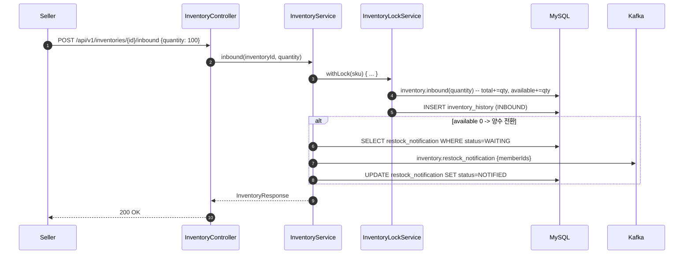
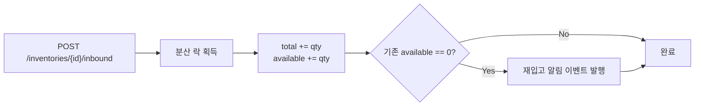

# [CP-09] Inventory INBOUND API (입고)

## 메타

| 항목 | 값 |
|------|-----|
| 크기 | S (1-2일) |
| 스프린트 | 5 |
| 서비스 | closet-inventory |
| 레이어 | Controller/Service |
| 의존 | CP-06 (도메인), CP-07 (분산 락) |
| Feature Flag | 없음 |
| PM 결정 | PD-42, Gap N-02 |

## 작업 내용

상품 등록 시 초기 재고 설정과 추후 재입고를 위한 INBOUND API를 구현한다. 입고 시 total, available 수량이 증가하며, 기존 available이 0이었다가 양수로 전환되면 재입고 알림 이벤트를 발행한다.

### 설계 의도

- Gap N-02 해소: 재고 입고 API가 없으면 초기 재고 설정 불가
- 재입고 알림 트리거: available 0 -> 양수 전환 시 대기 중인 알림 구독자에게 이벤트 발행
- Phase 2.5 WMS의 wms.inbound.confirmed 이벤트 스키마와 호환성 확보

## 다이어그램

### 입고 API 시퀀스

### 입고 플로우

## 수정 파일 목록

| 파일 | 작업 | 설명 |
|------|------|------|
| `closet-inventory/src/.../controller/InventoryController.kt` | 수정 | POST /inbound 엔드포인트 추가 |
| `closet-inventory/src/.../service/InventoryService.kt` | 수정 | inbound() 메서드 추가 |
| `closet-inventory/src/.../dto/InboundRequest.kt` | 신규 | 입고 요청 DTO |

## 영향 범위

- closet-inventory: 신규 API 엔드포인트
- 재입고 알림 구독자에게 이벤트 발행 (Phase 3에서 실제 알림 발송)

## 테스트 케이스

### 정상 케이스

| # | 시나리오 | 검증 |
|---|---------|------|
| 1 | 입고 시 total, available 증가 | 3단 구조 정합성 |
| 2 | InventoryHistory에 INBOUND 이력 기록 | 이력 확인 |
| 3 | available 0->양수 전환 시 재입고 알림 이벤트 발행 | Kafka 이벤트 확인 |
| 4 | available 10->20 전환 시 재입고 알림 미발행 | 이벤트 미발행 |

### 예외 케이스

| # | 시나리오 | 검증 |
|---|---------|------|
| 1 | quantity <= 0 시 400 Bad Request | 입력 검증 |
| 2 | 존재하지 않는 inventoryId 시 404 | 엔티티 미존재 |
| 3 | SELLER 권한 아닌 경우 403 | @RoleRequired(SELLER) |

## AC

- [ ] POST /api/v1/inventories/{id}/inbound API 구현
- [ ] total += quantity, available += quantity 반영
- [ ] InventoryHistory INBOUND 이력 기록
- [ ] available 0->양수 전환 시 restock_notification 이벤트 발행
- [ ] SELLER 권한 체크
- [ ] 통합 테스트 통과

## 체크리스트

- [ ] InboundRequest: quantity (양수 검증 @Positive)
- [ ] 분산 락 적용 (InventoryLockService)
- [ ] Kotest BehaviorSpec 테스트
