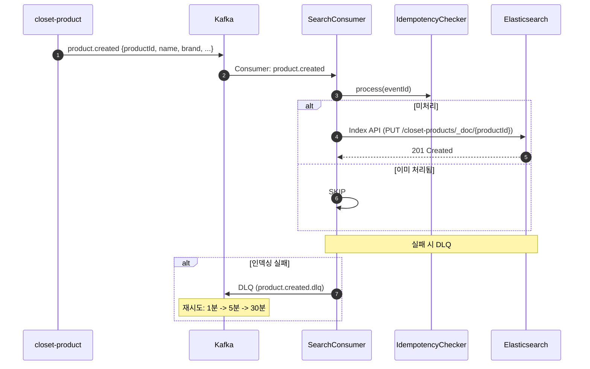
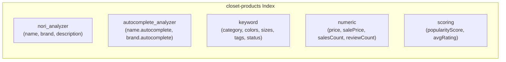

# [CP-10] ES 인덱스 ��성 + nori 매핑 + Kafka Consumer (product.*)

## 메타

| 항목 | 값 |
|------|-----|
| 크기 | L (1주+) |
| 스프린트 | 5 |
| 서비스 | closet-search |
| 레이어 | Infra/Service |
| 의존 | CP-04 (Product Kafka) |
| Feature Flag | `SEARCH_INDEXING_ENABLED` |
| PM 결정 | PD-29, PD-31 |

## 작업 내용

closet-search 서비스를 신규 생성하고, Elasticsearch 8.11에 closet-products 인덱스를 nori 한글 분석기와 edge_ngram 자동완성 분석기로 구성한다. product.created/updated/deleted Kafka Consumer를 구현하여 실시간 인덱싱 파이프라인을 구축한다.

### 설계 의도

- nori 형태소 분석기: 한글 검색 정확도를 위해 nori_tokenizer + 유의어 필터 적용
- edge_ngram: 자동완성을 위한 prefix 토크나이저 (min_gram=2, max_gram=20)
- CDC 기반 인덱싱: product-service -> outbox -> Kafka -> search-service -> ES 파이프라인
- DLQ + 지수 백오프: 인덱싱 실패 시 최대 3회 재시도 (1분/5분/30분, PD-31)
- 인덱싱 지연: P95 3초 이내 soft goal (PD-29)

## 다이어그램

### 인덱싱 파이프라인

### ES 인덱스 구조

## 수정 파일 목록

| 파일 | 작업 | 설명 |
|------|------|------|
| `closet-search/src/.../config/ElasticsearchConfig.kt` | 신규 | ES 클라이언트 설정 |
| `closet-search/src/.../index/ProductIndexManager.kt` | 신규 | 인덱스 생성/삭제/매핑 관리 |
| `closet-search/src/.../index/closet-products-mapping.json` | 신규 | ES 인덱스 매핑 JSON |
| `closet-search/src/.../consumer/ProductCreatedConsumer.kt` | 신규 | product.created -> ES 인덱싱 |
| `closet-search/src/.../consumer/ProductUpdatedConsumer.kt` | 신규 | product.updated -> ES 업데이트 |
| `closet-search/src/.../consumer/ProductDeletedConsumer.kt` | 신규 | product.deleted -> ES 삭제 |
| `closet-search/src/.../consumer/ReviewSummaryConsumer.kt` | 신규 | review.summary.updated -> ES 부분 업데이트 |
| `closet-search/src/.../config/KafkaConsumerConfig.kt` | 신규 | Consumer 설정 + DLQ |
| `closet-search/src/.../document/ProductDocument.kt` | 신규 | ES 문서 DTO |
| `closet-search/src/main/resources/application.yml` | 신규 | 서비스 설정 (port:8086) |
| `closet-search/build.gradle.kts` | 신규 | ES client, spring-kafka 의존성 |
| `settings.gradle.kts` | 수정 | closet-search 모듈 등록 |

## 영향 범위

- closet-search 신규 서비스 생성 (포트 8086)
- closet-product (CP-04): product.* 이벤트 발행 서비스
- Elasticsearch: closet-products 인덱스 생성
- docker-compose: ES 8.11 + nori 플러그인 추가 필요

## 테스트 케이스

### 정상 케이스

| # | 시나리오 | 검증 |
|---|---------|------|
| 1 | product.created 이벤트 수신 시 ES 문서 생성 | ES GET 확인 |
| 2 | product.updated 이벤트 수신 시 ES 문서 갱신 | 변경 필드 확인 |
| 3 | product.deleted 이벤트 수신 시 ES 문서 삭제 | 404 확인 |
| 4 | review.summary.updated 수신 시 ES 부분 업데이트 (reviewCount, avgRating) | 필드 갱신 확인 |
| 5 | nori 분석기로 "맨투맨"과 "스웨트셔츠" 유의어 검색 | 동일 결과 |
| 6 | 인덱싱 P95 3초 이내 | 성능 측정 |

### 예외 케이스

| # | 시나리오 | 검증 |
|---|---------|------|
| 1 | ES 연결 실패 시 DLQ로 이벤트 전송 | DLQ 토픽 확인 |
| 2 | DLQ 3회 재시도 후 최종 실패 시 수동 큐 | 로그 확인 |
| 3 | 중복 이벤트 수신 시 멱등성 보장 | processed_event 확인 |
| 4 | SEARCH_INDEXING_ENABLED=OFF 시 Consumer 비활성화 | Feature Flag |
| 5 | 인덱스 미존재 시 자동 생성 | 인덱스 매핑 확인 |

## AC

- [ ] closet-search 서비스 생성 (port:8086)
- [ ] closet-products 인���스: nori + edge_ngram + 유의어 매핑
- [ ] product.created/updated/deleted Consumer 구현
- [ ] review.summary.updated Consumer 구현 (부분 업데이트)
- [ ] DLQ + 지수 백오프 (1분/5분/30분) 재시도
- [ ] processed_event 멱등성 적용
- [ ] SEARCH_INDEXING_ENABLED Feature Flag
- [ ] 통합 테스트 (Testcontainers ES + Kafka) 통과

## 체크리스트

- [ ] ES 인덱스: shards=1, replicas=0, refresh=1s (개발 환경)
- [ ] nori_tokenizer: decompound_mode=mixed
- [ ] synonym_filter: 패션 유의어 초기 10개 이상
- [ ] edge_ngram: min_gram=2, max_gram=20
- [ ] Consumer Group: "search-service"
- [ ] DLQ 토픽: product.created.dlq, product.updated.dlq, product.deleted.dlq
- [ ] Kotest BehaviorSpec + Testcontainers
